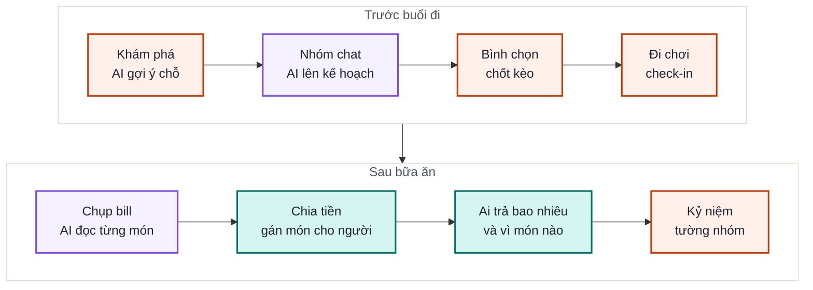
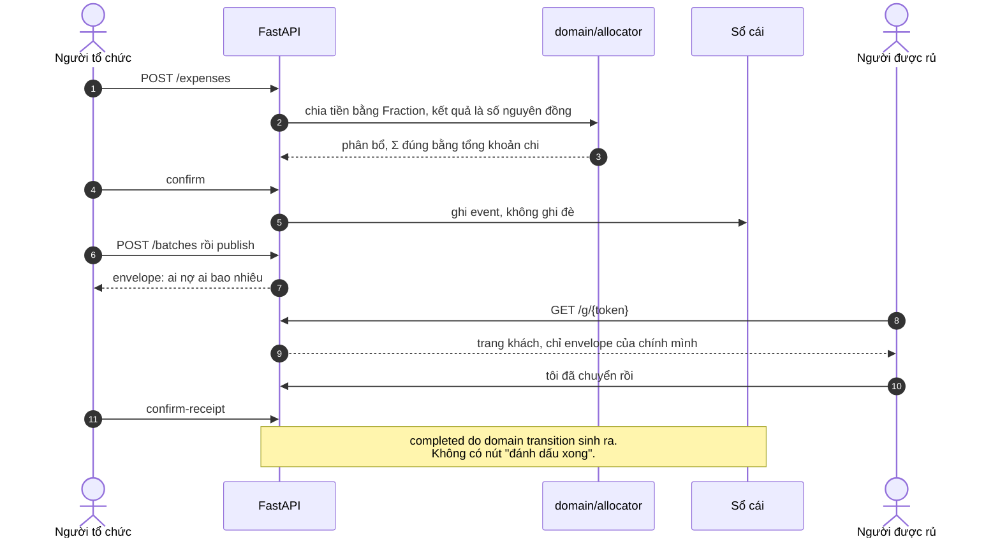
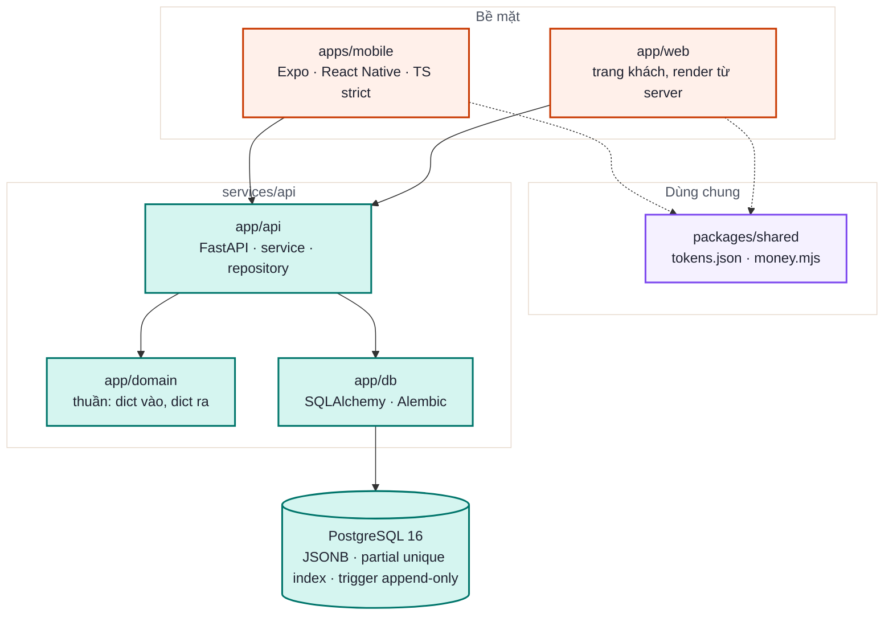

<div align="center">


**Rủ nhau đi chơi → ăn uống → chia bill → thu tiền về.**<br>
Một app, một vòng lặp, và đúng **một** phép chia tiền trong toàn hệ.


<br>


<sub>Mockup concept đã duyệt. Mọi con số và tên người trong ảnh là **dữ liệu trình diễn**, không phải người dùng thật.</sub>

</div>

---

## Phần đau thật không phải là chia tiền

Nhóm bạn Việt đi chơi cùng nhau. Một người ứng tiền trả bill, rồi phải đi đòi lại:
nhắn riêng từng người, gửi số tài khoản, nhớ ai đã chuyển, nhắc mà không mất lòng.

> Spec kết luận rằng phần đau thật **không phải chia tiền mà là đi thu tiền**.
> Nên màn hình trung tâm là **bảng thu tiền**, không phải màn chia tiền.

Từ đó ra hai vai, và hai bề mặt cho hai vai:

| Vai | Họ muốn gì | Họ dùng gì |
|---|---|---|
| **Người tổ chức** | Rủ, chốt chỗ, ứng tiền, rồi đòi lại mà không mất lòng | App Expo (`apps/mobile/`) |
| **Người được rủ** | Đúng hai điều: *mình nợ bao nhiêu* và *chuyển cho ai* | Một link trong chat nhóm, **không cần cài app** (`app/web/`) |

Người không cài app vẫn là người dùng hạng nhất. Trang khách dùng chung hệ thiết kế
với app, không phải một hệ thứ hai.

---

## Vòng lặp sản phẩm

<div align="center">


<sub>Và vòng khép lại: xong một chuyến, AI biết thêm nhóm này thích gì và ai đã trả cho ai, nên lần gợi ý sau khá hơn lần trước.</sub>
</div>

<details>
<summary><b>Nguồn Mermaid của sơ đồ này</b></summary>



Ảnh trên render sẵn từ chính nguồn này, không nhờ trình render của GitHub.
Muốn dựng lại: mermaid `11.4.1`, `htmlLabels:false` (bắt buộc — nhãn dạng
`<foreignObject>` **không** hiện khi SVG được nạp qua ``, mà GitHub nạp ảnh
bằng ``), `securityLevel:'strict'`, `useMaxWidth:false`, rồi lấy `viewBox`
từ `getBBox()` chứ đừng tin `viewBox` mermaid tự ghi — nó hụt và cắt mất nhãn
actor dưới đáy sơ đồ tuần tự.

</details>

Đây là câu mà một sản phẩm hàng xóm không sao chép được nếu chỉ làm một chặng:
**cùng một AI đã gợi ý quán là AI đọc hoá đơn của quán đó, và nó biết ai đã ngồi ở đó.**
Splitwise chia tiền nhưng không biết nhóm bạn là ai. Nhóm chat rủ được nhưng không chia được tiền.

<table>
<tr>
<td width="25%" align="center"></td>
<td width="25%" align="center"></td>
<td width="25%" align="center"></td>
<td width="25%" align="center"></td>
</tr>
<tr>
<td align="center"><b>Khám phá</b><br><sub>AI gợi ý chỗ theo gu của nhóm</sub></td>
<td align="center"><b>Nhóm chat</b><br><sub>AI ở trong nhóm, có context của nhóm</sub></td>
<td align="center"><b>Thu tiền</b><br><sub>ai chuyển cho ai, còn thiếu bao nhiêu</sub></td>
<td align="center"><b>Cá nhân</b><br><sub>tài chính xuyên nhóm, không chỉ một chuyến</sub></td>
</tr>
</table>

<sub>Mockup concept, **dữ liệu trình diễn**. Màn Cá nhân là tài chính xuyên nhóm: rời một nhóm không xoá được khoản còn nợ.</sub>

---

## Lát cắt dọc của tiền

Đây là đường đi đã chạy thật, đầu tới cuối:

<div align="center">

</div>

<details>
<summary><b>Nguồn Mermaid của sơ đồ này</b></summary>



Ảnh trên render sẵn từ chính nguồn này, không nhờ trình render của GitHub.
Muốn dựng lại: mermaid `11.4.1`, `htmlLabels:false` (bắt buộc — nhãn dạng
`<foreignObject>` **không** hiện khi SVG được nạp qua ``, mà GitHub nạp ảnh
bằng ``), `securityLevel:'strict'`, `useMaxWidth:false`, rồi lấy `viewBox`
từ `getBBox()` chứ đừng tin `viewBox` mermaid tự ghi — nó hụt và cắt mất nhãn
actor dưới đáy sơ đồ tuần tự.

</details>

Vài điều cố ý, đừng đọc nhầm thành thiếu sót:

- **Sản phẩm không giữ tiền, không chuyển tiền, và không nói chuyển vào đâu.**
  ADR-0015 đã gỡ cả đường VietQR/EMVCo: app nói phần của mỗi người rồi dừng.
- **`receiver_confirmed` không phải bằng chứng ngân hàng**, và câu chữ trên màn
  hình không được nói như thể nó là.
- **Sửa khoản chi tạo phiên bản mới**, không ghi đè bản cũ.
- Khách chỉ thấy envelope của chính mình: không số dư nhóm, không lịch sử,
  không allocation của người khác.

<div align="center">

</div>

<sub>Bốn bước của chặng chia bill trong mockup. **AI có mặt thì phải nói rõ là AI**: mọi kết quả máy đọc ra đều sửa được bằng tay trước khi chốt, và không có bước nào AI tự quyết chuyện tiền thay người dùng.</sub>

---

## Ba luật về tiền, không thương lượng

<table>
<tr>
<td width="33%" valign="top">

### 1 · Số nguyên đồng

Không `float`, không `Decimal`, kể cả ở giá trị trung gian.
`allocator.py` dùng `Fraction` để giữ hữu tỉ chính xác rồi mới rơi về đồng.

</td>
<td width="33%" valign="top">

### 2 · Σ = đúng tổng

Tổng phân bổ bằng **100%** khoản chi, không ngoại lệ.
**41 golden vector tính tay** giữ điều này.

</td>
<td width="33%" valign="top">

### 3 · Sổ là nguồn sự thật

Số dư luôn **tính lại được từ sổ**.
Cache không bao giờ là nguồn sự thật.

</td>
</tr>
</table>

> Đổi bất kỳ luật nào ở trên thì **mở ADR trước**, đừng sửa code trước.

---

## Kiến trúc

<div align="center">

</div>

<details>
<summary><b>Nguồn Mermaid của sơ đồ này</b></summary>



Ảnh trên render sẵn từ chính nguồn này, không nhờ trình render của GitHub.
Muốn dựng lại: mermaid `11.4.1`, `htmlLabels:false` (bắt buộc — nhãn dạng
`<foreignObject>` **không** hiện khi SVG được nạp qua ``, mà GitHub nạp ảnh
bằng ``), `securityLevel:'strict'`, `useMaxWidth:false`, rồi lấy `viewBox`
từ `getBBox()` chứ đừng tin `viewBox` mermaid tự ghi — nó hụt và cắt mất nhãn
actor dưới đáy sơ đồ tuần tự.

</details>

| Tầng | Việc của nó | Ràng buộc cứng |
|---|---|---|
| `app/domain/` | Tiền, sổ, đợt thu, quyền, hiển thị | 🚫 **Không được import** `app.db`, `app.api`, `sqlalchemy`, `fastapi`, `alembic`, `pydantic` |
| `app/api/service.py` | Workflow: gọi domain trước, rồi mới gọi repository | Repository không bao giờ tự chế allocation |
| `app/api/repository.py` | `ApiRepository` (Protocol) + bản SQLAlchemy | Trạng thái nghĩa vụ **suy ra từ event**, không đọc cột đã lưu |
| `app/web/guest_view.py` | Biên rò rỉ của trang khách | Template **không bao giờ tự query**, chỉ render view model |

Ranh giới `domain/` không phải lời hứa: `tests/test_import_boundary.py` parse AST và
cưỡng chế nó. Lý do là luật tiền số 3 ở trên.

`/healthz` cố ý **không** chạm database: restart API không sửa được Postgres.

<details>
<summary><b>Đo lại các con số trong README này</b></summary>

```bash
git rev-parse --short HEAD                                    # f3d4ede khi đo
python3 -m pytest services/api/tests tests -q --collect-only   # 4474 ca
python3 -c "import sys; sys.path.insert(0,'services/api')
from app.api.main import app; from fastapi.routing import APIRoute
print(len([r for r in app.routes if isinstance(r, APIRoute)]))"   # 156 route (126 do Go phục vụ)
ls services/api/app/api/routes/*.py | wc -l                    # 34 module route
ls services/api/app/domain/*.py | wc -l                        # 42 module domain
find apps/mobile/src -name '*.ts*' | wc -l                     # 260 file
find apps/mobile/src -name '*.ts*' | xargs cat | wc -l         # 28304 dòng
python3 -c "import json,glob; print(sum(len(json.load(open(f))) for f in glob.glob('services/api/tests/domain/golden/*.json')))"   # 41 golden vector
```

Đếm route bằng hai cách khác nhau ra hai con số khác nhau (`grep` decorator ra 102,
`app.routes` ra 103, số path duy nhất là 89). Con số trong README là `APIRoute` thật
sự được đăng ký, vì đó là thứ trả lời được câu "server này phục vụ cái gì".

Repo này có nhiều lane cùng đẩy vào `main`, nên các con số trên **trôi theo ngày**.
Chúng được đo tại `b9f6473` (2026-09-04, sau khi gộp 23 PR của lộ trình production-ready); lệch vài đơn vị so với hôm nay là bình thường, lệch
hàng chục thì đoạn văn quanh nó đã cũ.

</details>

---

## Hệ thiết kế

Màu **không phải trang trí**. Nhìn thấy màu là biết đang ở phần nào của sản phẩm:


| Tông | Token | Nghĩa | Sáng | Tối |
|---|---|---|---|---|
| Cam | `accent` | Thương hiệu và hành động chính | `#c93900` · 5.16:1 | `#fb693e` · 5.77:1 |
| Teal | `split` | Chia bill, tiền, quyết toán | `#00756b` · 5.59:1 | `#02a498` · 5.42:1 |
| Tím | `ai` | Do máy sinh ra, người còn sửa được | `#7d49ef` · 5.16:1 | `#9667ff` · 4.55:1 |

**Một màn hình chỉ có MỘT tông dẫn.** Hai tông dẫn cùng lúc là lỗi, không phải lựa chọn.
Trang khách là mặt quyết toán nên tông dẫn của nó là teal, dù cam mới là màu thương hiệu.

- Nguồn số duy nhất: [`packages/shared/tokens.json`](packages/shared/tokens.json). Hai bề mặt đọc lại cùng một file.
- Màu **đo bằng script lấy mẫu điểm ảnh** trên mockup, không ước lượng bằng mắt.
  Màu nào không đạt WCAG AA thì bị làm tối lại, và **cả hai số đều ghi lại** trong [`DESIGN.md`](DESIGN.md).
- 46 cặp chữ trên nền đều được đo. Thấp nhất 4.52:1, không cặp nào dưới ngưỡng AA.
- Đích ngắm tối thiểu 44×44pt. Chuyện chia tiền xảy ra khi người ta đang đứng dậy ra về, một tay cầm điện thoại.

Xem thử hệ thiết kế và trang khách mà **không cần database**:

```bash
cd services/api && python3 -m app.web.preview
```

---

## Chạy thử

<table>
<tr><td width="50%" valign="top">

**Đường nhanh nhất — Docker, có sẵn dữ liệu demo**

```bash
make demo     # dựng hệ + nạp "Team Đà Lạt":
              # 7 người, 3 chuyến, còn nợ thật
make smoke    # gọi /healthz qua cổng đã publish
make logs     # bám log API và Postgres
make down     # tắt, GIỮ dữ liệu trong volume
```

</td><td width="50%" valign="top">

**Đường thủ công**

```bash
docker compose up -d postgres
cp .env.example .env
pip install -r services/api/requirements-dev.txt
cd services/api && alembic upgrade head
uvicorn app.api.main:app --host 0.0.0.0 --port 8099
```

</td></tr>
</table>

`--host 0.0.0.0` không phải trang trí: mặc định `uvicorn` chỉ nghe `127.0.0.1`,
và điện thoại không tới được loopback của máy khác.

Mặc định là **API 8099**, Metro 8081. 8099 là con số app tự rơi về khi không có
`EXPO_PUBLIC_API_URL` (`apps/mobile/src/api.ts`), nên đừng đổi nó chỉ vì quen tay gõ 8000.

⚠️ `make clean` **xoá cả volume Postgres lẫn ảnh đã tải lên của cả máy**, nên nó đòi `CONFIRM=<tên project>`.

<details>
<summary><b>Dựng ảnh Docker của API</b></summary>

```bash
cd services/api && docker build -t mobile-api .
```

Build context là `services/api/`, **không phải** gốc repo. Docker chỉ đọc
`.dockerignore` ở gốc build context, nên file đó phải nằm trong `services/api/`;
đặt ở gốc repo là không có tác dụng.

</details>

---

## Chạy trên điện thoại thật (Expo Go)

Điện thoại và máy này phải **cùng một Wi-Fi**. Kiểm trước khi mở Expo Go:

```bash
scripts/phone_path.py check     # thoát 1 nếu đường chưa thông, kèm cách sửa
scripts/phone_path.py up        # kiểm rồi phát QR trỏ vào địa chỉ LAN
```

Rồi mở **Expo Go** và quét mã. `up` in sẵn hai dòng cho biết QR trỏ đi đâu và app
sẽ gọi API ở đâu. Đọc hai dòng đó trước khi quét.

<details>
<summary><b>Bốn lý do app không lên, không cái nào tự nói ra</b></summary>

| Triệu chứng trên điện thoại | Nguyên nhân | Cách sửa |
|---|---|---|
| Quét xong quay mãi rồi hết giờ | WSL2 chặn kết nối từ ngoài vào (`DefaultInboundAction = Block`) | `scripts/phone_path.py open-firewall` — cần quyền Administrator, mở đúng 2 cổng TCP cho riêng subnet Wi-Fi hiện tại |
| App lên nhưng mọi màn báo lỗi mạng | `BASE_URL` còn là `localhost`, mà trên điện thoại `localhost` là chính nó | dùng `up`, nó tự đặt `EXPO_PUBLIC_API_URL` theo IP LAN |
| Terminal xanh nhưng không có server | cổng 8081 bận; `expo start` hỏi đổi cổng, trong shell không tương tác nó in `Skipping dev server` rồi **thoát mã 0** | `--metro-port 8082` |
| Metro chết ngay khi khởi động: `configs.toReversed is not a function` | `node` trên PATH quá cũ (Debian/Ubuntu cài sẵn 18.x; RN 0.86 cần `^20.19.4 \|\| ^22.13.0 \|\| ^24.3.0 \|\| >= 25`) | không phải lỗi app. `up` tự dùng bản hợp lệ đã cài (nvm/fnm) và in ra nó đã đổi; nếu máy không có bản nào: `nvm install 20` |

Không cần tự nhớ mình đang ở Node nào. `check` đọc dải phiên bản từ chính
`apps/mobile/node_modules` và nói ra; `up` chạy Metro dưới bản hợp lệ dù PATH của
bạn trỏ vào đâu. Việc đổi chỉ áp dụng cho tiến trình `up` sinh ra.

Khi cổng bận thật, hoặc khi máy có nhiều card mạng:

```bash
scripts/phone_path.py --api-port 8100 --metro-port 8082 up
scripts/phone_path.py up --host <ip-LAN-của-máy-này>
eval "$(scripts/phone_path.py env)"   # chỉ lấy biến, tự chạy expo sau
```

Đổi `--api-port` thì phải bật `uvicorn` ở đúng cổng đó. Script chỉ nói cho app
biết gọi đi đâu, nó không dựng server hộ bạn.

Gỡ luật tường lửa khi không cần nữa:

```powershell
Remove-NetFirewallHyperVRule -Name 'RuDi-ExpoGo'
```

Điện thoại không cùng Wi-Fi được (mạng khách chặn máy nói chuyện với nhau) thì
`npx expo start --tunnel` vẫn nạp được app, nhưng tunnel chỉ đưa Metro ra ngoài,
**không** đưa API, nên app lên rồi vẫn không gọi được server.

</details>

### Xuất bundle: hỏi cây trước, đừng hỏi sau

```bash
make bundle-check           # cây này có khớp origin/main không?
make bundle                 # kiểm rồi mới expo export, và đóng SHA vào bundle
```

`bundle-check` trả lời đúng một câu, bằng đúng một trong ba chữ:

| | mã thoát | nghĩa |
|---|---|---|
| **KHỚP** | 0 | cây bằng đúng `origin/main`, xuất được |
| **LỆCH** | 1 | lệch bao nhiêu commit, và file nào đang bẩn |
| **KHÔNG KIỂM ĐƯỢC** | 2 | không fetch được / không phải cây git — **không phải** là khớp |

Lý do nó tồn tại: 03:20 ngày 31/08 một bundle được xuất từ checkout lùi 4 commit
đang có file màn ở trạng thái đã xoá, rồi đẩy lên máy demo. Bundle thiếu hẳn
`AlbumChuyenDi` và `CaNhanHoa` — và **mọi thứ vẫn báo 200**, vì mọi cổng đọc cây
client đều đọc chính cây bị hỏng đó (`check_screens_reachable.py` in `51/52 màn`
rồi thoát 0; cây sạch in `53/54`).

Kiểm `HEAD == origin/main` thôi thì **không đủ**: `git pull --ff-only` không mang
về file bạn đã xoá, nên cây có thể đứng đúng SHA của main mà vẫn thiếu màn. Cổng
soi cả hai nửa, và `tests/test_tree_matches_main_gate.py` đột biến từng nửa một
để chứng minh cả hai đều đang cắn.

`make bundle` đóng `BUILD-SHA.txt` vào thư mục xuất ra, nên mở cổng 8081 là đối
chiếu được mình đang xem commit nào — thay vì đoán.

---

## Test

```bash
python3 -m pytest services/api/tests tests -q   # domain + API (fake repo) + repo guard
node packages/shared/money.test.mjs             # hai bề mặt, cùng một bộ golden
scripts/setup-hooks.sh                          # bật repo guard trước khi commit
make gate                                       # chạy các cổng của CI ngay tại máy
```

Tầng chạy trên **PostgreSQL thật** mặc định bị skip nếu thiếu URL. Skip không phải là xanh:

```bash
make test-db      # database dùng một lần, tự dựng tự dọn
```

### Mỗi tầng chứng minh được gì, và không chứng minh gì

Đọc kỹ **cột phải** trước khi tin một dấu xanh.

| Tầng | Chứng minh | **Không** chứng minh |
|---|---|---|
| 41 golden vector + `test_golden_selfcheck.py` | Corpus nhất quán nội tại theo ADR-0004 | Tác giả corpus đọc đúng contract — cùng một người viết cả hai |
| `test_selfcheck_catches_mutants.py` | Self-check thực sự đỏ khi đáp án sai | — |
| `tests/api/` với fake repository | Orchestration HTTP ↔ domain | Bất kỳ câu SQL, index, view, trigger nào |
| `tests/postgres/` | Repository thật sau khi Alembic migrate một schema riêng | Mọi method, mọi race, mọi query plan |
| `tests/db/test_migration_matches_models.py` | Migration khớp models, không cần DB | — |
| QA hình ảnh + thăm dò (ADR-0010) | Trang render được, đọc được, không lộ dữ liệu người khác, ở các trạng thái **đã quét** | **Mã QR có quét được bằng app ngân hàng thật không** · người thật có hiểu không · ô nào **chưa** quét |

SQLite bị từ chối có chủ ý: schema production dựa vào JSONB, partial unique index,
view và trigger append-only. Thêm hành vi persistence mới thì **thêm ca live tương ứng**;
mở rộng fake rồi coi đó là bằng chứng DB là nói dối.

Ảnh trong README lấy từ `product/` — spec 47 feature và bộ mockup 21 màn. Thư mục đó
**có trên `main`** từ 2026-08-30 (62 file, 27 PNG, mỗi PNG pin sha256 trong
`.repo-guard-allowlist.json`); 8 file trong `docs/assets/` là bản thu nhỏ cắt lại từ
chính bộ mockup đó để README nhẹ.

---

## Bố cục repo

```
services/core/               Go 1.23 — cửa trước công khai, PHỤC VỤ 126/156 route (LIVE-GO)
services/core/ownership/     routes.json — NGUỒN SỰ THẬT ai phục vụ route nào
parity/                      module Go riêng, hộp đen: so byte Go ↔ Python
services/api/app/domain/     thuần: tiền, sổ, đợt thu, quyền, hiển thị (42 module)
services/api/app/db/         SQLAlchemy + Alembic
services/api/app/api/        FastAPI legacy, 34 module route — còn phục vụ 30/156 route, và là oracle của cổng parity
services/api/app/web/        trang khách, render từ server
apps/mobile/                 Expo + TypeScript (260 file trong src/, ~48.9k dòng)
packages/shared/             token thiết kế, định dạng tiền
docs/assets/                 ảnh của README, pin sha256 trong repo guard allowlist
docs/README.md               mục lục docs: đang sống / nhật ký đang ghi / archive
docs/decisions/              ADR — đọc trước khi đổi hành vi
docs/migration/             thẻ route cho đợt chuyển Go — MÁY ĐỌC, cổng ownership gác
phase0/  docs/protocol/v1/   ĐÓNG BĂNG tại chỗ, không sửa, không xoá
```

---

## Quy trình

Nguồn sự thật: [`docs/team/charter.md`](docs/team/charter.md) ·
[`docs/decisions/`](docs/decisions/) ·
[`docs/architecture/00-layout-va-so-huu.md`](docs/architecture/00-layout-va-so-huu.md).
Đọc trước khi đổi hành vi.

- **Một vai fullstack** (ADR-0032, 2026-09-22). Không còn bảng sở hữu theo người.
  Ai nhận việc thì làm trọn lát cắt: Go backend · SQL và migration · Python AI ·
  TypeScript frontend · mobile native · test mọi tầng.
- **Ranh giới còn lại là ranh giới TẦNG**: `domain/` không import `db`/`api`; ở
  trang khách template không bao giờ tự query; mỗi module có đúng một writer.
  Cưỡng chế bằng test, không bằng phân công.
- **Nhánh**: slug phải là Work ID cụ thể; tiền tố chủ sở hữu không còn bắt buộc.
- **Không còn PR bắt buộc** (ADR-0032 thay ADR-0007): commit thẳng lên `main`, mở
  PR chỉ khi muốn người khác đọc trước. Leader chỉ đọc `main` nên **commit message**
  phải nói *cái gì đổi và vì sao*, kèm số đo của cổng đã chạy.
- **Cổng thay chỗ chữ ký người** (ADR-0030 §3): cây sạch đúng SHA · canary đỏ ·
  hai đột biến tự nghĩ · với UI thì mở ảnh chụp ra nhìn · số đo vào commit message.
- **Blocker chỉ hợp lệ** khi thuộc 5 loại: vi phạm spec/cổng · sai tiền ·
  quyền riêng tư/bảo mật/consent · hỏng tính hợp lệ thí nghiệm · không tái lập được.
  Đặt tên và "tôi thích cách kia hơn" là suggestion, không phải blocker.
- **Repo guard fail closed** với binary, file text > 2 MiB, symlink, gitlink mới.
  Muốn thêm artifact thì pin `path` + `sha256` + `rules` + `reason` vào
  `.repo-guard-allowlist.json`. Xem [`docs/security/repo-guard.md`](docs/security/repo-guard.md).
- **Không bao giờ đưa vào Git**: ảnh bill, số tài khoản, tên người tham gia,
  transcript thô, file export, `.env` thật. `.gitignore` không phải nơi lưu an toàn.

---

## Cái này KHÔNG phải là gì

Phần quan trọng nhất của README này. Đọc trước khi tin bất cứ dấu xanh nào ở trên.

- ❌ **Chưa có bằng chứng hành vi nào.** [ADR-0006](docs/decisions/ADR-0006-gac-giai-doan-0-de-dung-san-pham.md)
  ghi rõ: Giai đoạn 0 bị gác lại theo quyết định có ý thức của chủ sản phẩm. Đây là
  một canh bạc, không phải một giả thuyết đã được kiểm chứng. **Đừng đọc bộ test xanh
  thành "sản phẩm này đúng".**
- ✅ **Có phiên đăng nhập thật từ 2026-09-03** (ADR-0014, #514): `Authorization: Bearer`
  đọc từ `account_sessions`, `MOBILE_AUTH_MODE` vắng mặt là `prod` và không tin
  `X-Actor-*`. ❌ **Chưa có đăng nhập bằng OTP/Google** cho người mới — ADR-0016
  (đề xuất) mở đường đó; hiện phiên chỉ mint được từ lời mời đích danh hoặc
  `scripts/genesis_session.py`.
- ❌ **Chưa có người dùng thật**, chưa có testimonial, chưa có số liệu tăng trưởng,
  chưa có app trên store. Mọi con số trong mockup (4.9 sao, "AI MATCH 95%", tên
  Minh Anh / Quang Huy) là **dữ liệu trình diễn**.
- ❌ **Không giữ tiền, không chuyển tiền, và không nói chuyển vào đâu.** Sản phẩm
  nói mỗi người phải bỏ ra bao nhiêu và vì những khoản nào, rồi dừng. Chuyển bằng
  cách nào là chuyện giữa hai người.
- ❌ **Chưa quyết Home và cấu trúc tab.** Spec mục 14.3 cấm thiết kế Home trước khi
  biết hành động nào tồn tại.
- ⚠️ **Branch protection chưa bật** (GitHub free + repo private không cho), nên mọi
  luật merge ở trên là **kỷ luật**, không phải cưỡng chế. Hook local vẫn bị
  `--no-verify` đi qua.
- ⚠️ **Ruff được cấu hình nhưng cây hiện không sạch và CI không gate nó.** Chạy ruff
  trên file mình đang sửa; đừng chạy `--fix`/`format` cả cây, diff format sẽ nhấn
  chìm thay đổi thật.

Nguyên tắc phía sau danh sách này: **vỏ thì nói là vỏ.** Feature nằm ngoài đường đi
chính được làm đúng vỏ và dán nhãn. Giấu chuyện nó là vỏ mới là lỗi.

---

<div align="center">

**Rủ Đi thôi!**

[`PRODUCT.md`](PRODUCT.md) · [`DESIGN.md`](DESIGN.md) · [`CLAUDE.md`](CLAUDE.md) · [`AGENTS.md`](AGENTS.md) · [`docs/team/hang-doi.md`](docs/team/hang-doi.md)

Giấy phép [MIT](LICENSE) · © 2026

</div>
