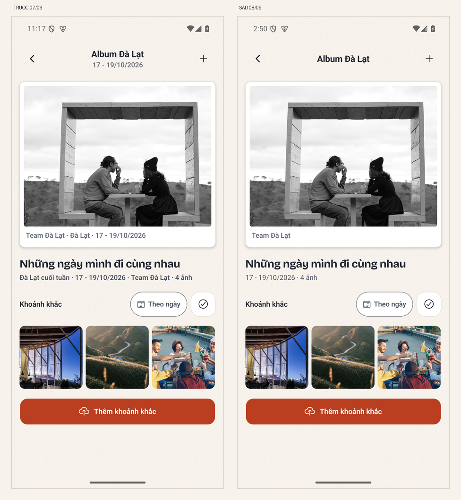
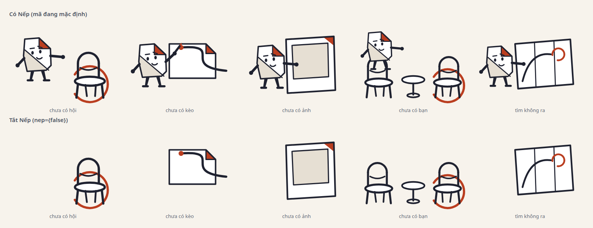
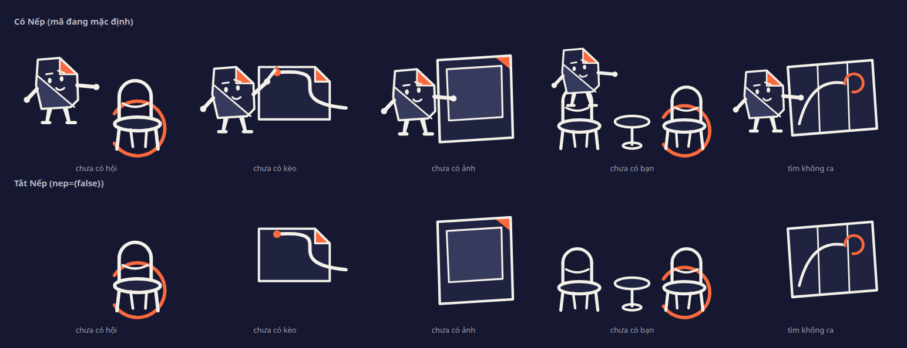
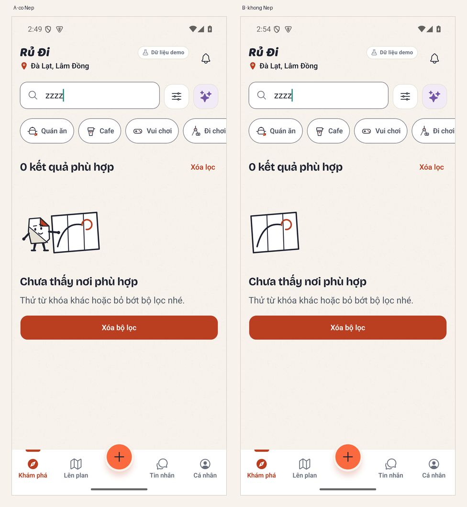
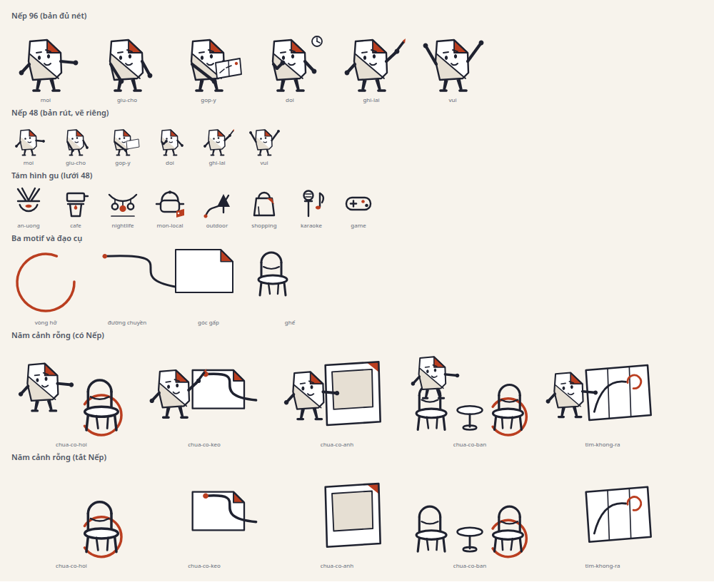
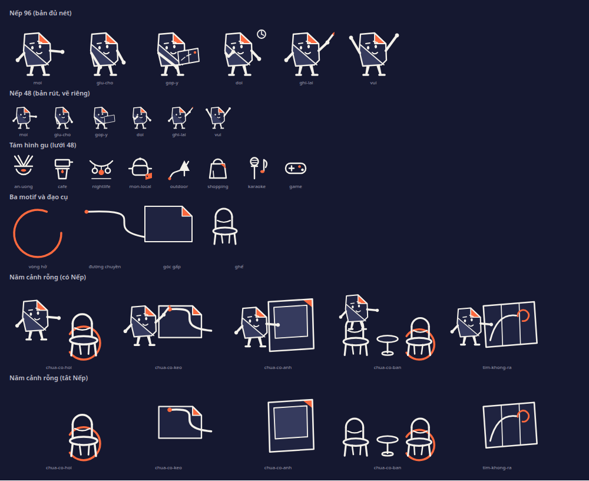
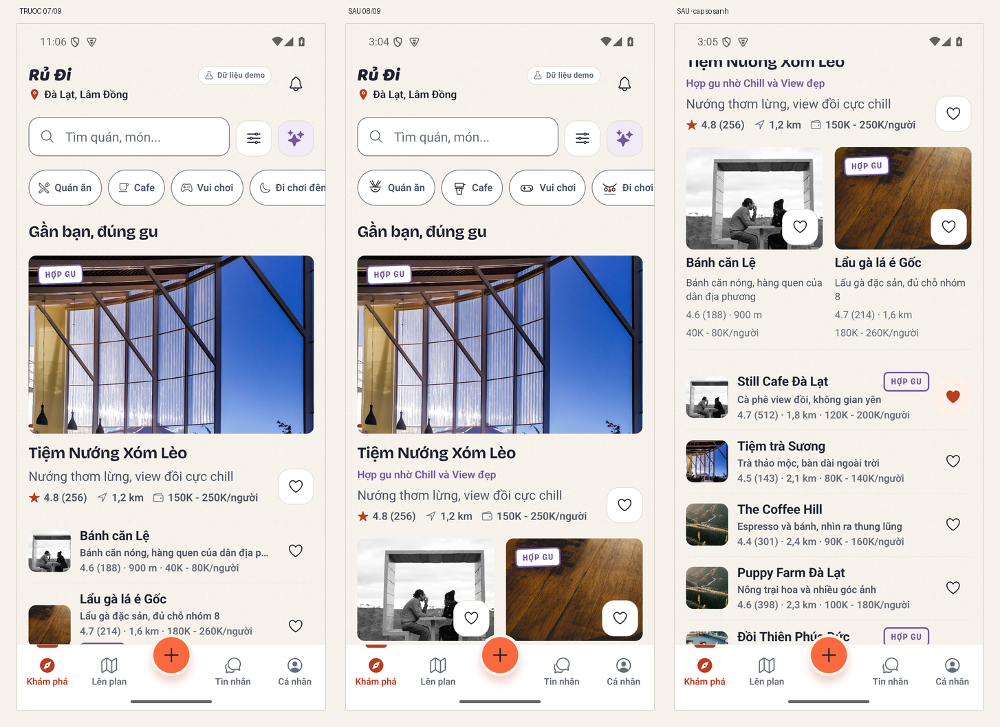
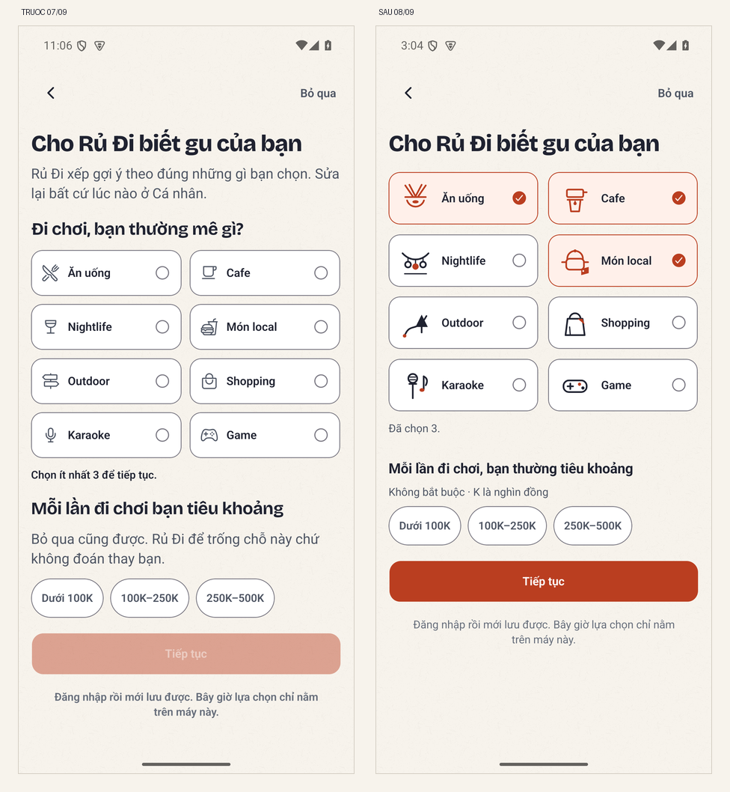

# Hỏi review: ngôn ngữ hình «Chừa một chỗ cho nhau» trước khi trải ra toàn bộ cảnh

**Ngày:** 08/09/2026 · **Nhánh:** `claude/p0-w-ui4-ban-sac-thi-giac` (đã hoà giải `origin/main`
sau PR #580 và #581) · **Người viết:** Claude (lane `apps/mobile`).

**Đây là một yêu cầu phán quyết, không phải báo cáo tiến độ.** Đợt 1 theo §13.1 của
[báo cáo Codex 07/09](../../codex/2026-09-07/bao-cao-ban-sac-va-nhip-thi-giac-rudi.md) đã xong và
`impeccable-finish-reviewer` (context mới) đã cho `ship` với **phạm vi hẹp**. Trước khi trải câu
chuyện ra 41 bề mặt rỗng, 8 sticker và các huy hiệu, tôi cần tám quyết định dưới đây. Chi tiết việc
đã làm và số đo nằm ở [báo cáo đợt 1](bao-cao-ban-sac-dot-1.md); doc này chỉ hỏi.

Ảnh trong doc là bằng chứng đã ghim `sha256` trong `.repo-guard-allowlist.json`. Bộ ảnh native đầy
đủ (47 tấm, sáng/tối/1.3/A-B) nằm ở `.impeccable/review/ban-sac-2026-09-08/` (gitignored, xem trên
máy của lane). Hai liên kết tới `docs/codex/2026-09-07/` chỉ mở được **trên máy**: báo cáo của Codex
hiện chưa được commit, giống các báo cáo 05/09 và 06/09.

---

## 0. §13.1 đi tới đâu — trả lời thẳng

| Đợt §13.1 | Trạng thái | Ghi chú |
|---|---|---|
| **A1** · rút chữ điều phối | ✅ xong | Sở thích 81→44 từ (−46%), Album 124→89 (−29%), Khám phá bỏ đoạn hướng dẫn 5 ý. Bảng §8.5 áp cho 10 màn, không mất thông tin quyết định. |
| **A2** · vẽ motif · Nếp · 8 gu | ✅ xong | 3 motif, 6 pose × 2 bản đọc, 8 glyph, 5 cảnh. Ngữ pháp đường có cổng riêng. |
| **A3** · biên tập ảnh + hợp đồng media | ❌ **chưa làm** | Đây là câu hỏi 3. Không làm được trong phạm vi đợt: fixture chỉ có 5 ảnh và thêm ảnh là quyết định giấy phép, không phải quyết định bố cục. |
| **B1** · ba màn chứng minh | ✅ xong | Sở thích · Khám phá · Album, có ảnh native trước/sau ở sáng 1.0, tối 1.3. |
| B2 · Tạo kèo/Plan/expanded | ⬜ chưa | |
| B3 · AI typed cards, chat, khay sticker | ⬜ chưa | Phụ thuộc câu hỏi 5. |
| C1 · bill/gán món/đợt thu/tài chính | ⬜ chưa | Luật «Nếp đứng xa tiền» nghĩa là các màn này **không** nhận minh hoạ nhân vật. |
| C2 · empty · profile · wall · badges · share | ⬜ chưa | Phụ thuộc câu hỏi 1 và 6. |
| D1 · ba motion chữ ký | ⬜ chưa | |
| D2 · polish trên thiết bị mục tiêu | ⬜ chưa | Chưa đo iOS, TalkBack, release build. |

Màn thứ ba của B1, để nhìn cho đủ bộ (ngày và tên nhóm trước đây lặp ba lần trên một viewport, nay
mỗi dữ kiện viết một lần: nơi ở thanh đầu, nhóm trên ảnh in, ngày + số ảnh ở tiêu đề):

**Phán quyết `ship` của finish-reviewer phủ:** màn fixture Sở thích · Khám phá · Album · cảnh
«tìm không ra», ở sáng 1.0 (+ Sở thích ở 1.3, + tối 1.3 bổ sung sau).
**Không phủ:** hai cửa live (`ExploreLive`, `AlbumLive` — cần stack OTP), iOS, TalkBack, và cặp màu
nút disabled của kit.

---

## 1. Nếp: giữ nhân vật hay chỉ giữ đồ vật?

Đây là câu hỏi chặn nhiều thứ nhất. README concept 08/09 chọn «phương án 1 — có Nếp nhưng tách lớp»,
và mã đã dựng đúng vậy: mọi cảnh **đứng được khi tắt Nếp**. Nhưng «đứng được» không có nghĩa là «đủ
tốt», và tôi thấy một điểm yếu thật khi nhìn hai hàng cạnh nhau:

**Điều tôi thấy:** ở hàng dưới (tắt Nếp), **«chưa có hội» và «chưa có bạn» gần như trùng hình** —
cả hai là ghế với vòng hở, chỉ khác số ghế. Có Nếp thì hai cảnh tách nhau rõ (một bên Nếp kéo ghế
mời, một bên Nếp đứng cạnh hai chỗ). «Chưa có kèo» tắt Nếp cũng khá trừu tượng: một tờ giấy gấp góc
và một nét mực.

Trong app, cùng một cảnh trên máy thật:

**Ba lựa chọn:**

| | Nghĩa là gì | Đổi lại |
|---|---|---|
| **A. Giữ Nếp** (mã đang mặc định) | Nhân vật xuất hiện ở empty state, cửa vào, nhóm mới, sticker; tuyệt đối không cạnh tiền/lỗi/conflict | Cần một dòng ADR: ADR-0020 hiện **không** có linh vật, và concept tự ghi «chưa phải asset thương hiệu được chốt» |
| **B. Bỏ mặt, giữ đồ vật** | Chỉ motif + ghế + khung ảnh + bản đồ | Phải vẽ lại để năm cảnh không trùng nhau; 8 sticker khó thành «cùng một diễn viên» như §7.4 muốn |
| **C. Giữ Nếp nhưng hẹp hơn** | Chỉ ở cửa vào và nhóm mới; các empty state khác dùng đồ vật | Ít rủi ro thương hiệu nhất, nhưng vẫn phải sửa hai cảnh trùng |

**Tôi nghiêng về A**, vì nó là thứ duy nhất phân biệt được năm sự im lặng và là điều kiện để §7.4
(8 sticker cùng một diễn viên) làm được. Nhưng đây là quyết định nhận diện, không phải quyết định
kỹ thuật — nên tôi không tự chốt.

---

## 2. Ba motif chưa xuất hiện ở màn **có dữ liệu**

Finish-reviewer nói thẳng: *«Motifs appear nowhere in any populated screen, only inside empty
scenes.»* Báo cáo §6.3 muốn ba motif là sợi chỉ nối các màn — hiện chúng chỉ sống trong cảnh rỗng.

**Chỗ đặt khả dĩ, và ràng buộc của từng chỗ:**

| Motif | Chỗ đề xuất | Ràng buộc phải giữ |
|---|---|---|
| **Góc gấp** | Dấu «đã chọn» trên ô gu, thay vòng tròn check | Trạng thái chọn **không được** chỉ bằng màu hay chỉ bằng hình; hiện đang nói hai lần (nền + check). Đổi thì phải giữ hai lần |
| **Đường chuyền** | Nối lead → cặp so sánh ở Khám phá; hoặc trục lịch trình | `RouteLine` đã là đường mực của lịch trình. Thêm nữa là hai đường cùng nghĩa |
| **Vòng hở** | Nền cụm avatar ở Check-in | §9.20 **cấm** dùng độ khép của vòng thay tỷ lệ check-in. Chỉ được là nền trang trí |

**Câu hỏi:** có nên đưa motif vào màn có dữ liệu không, và nếu có thì chỗ nào đáng nhất? Hay để
motif sống ở biên (cảnh rỗng, cửa vào) là đủ, và họ hàng thị giác dựa vào **hình gu + nét vẽ** thay
vì motif? Hiện chip lọc Khám phá đã dùng chung bút với ô Sở thích, và reviewer chấm đó là mắt xích
đủ để ba màn thành một họ.

---

## 3. Ảnh fixture sai ngữ cảnh — A3 chưa làm, và tôi không tự quyết được

Đây là khoảng cách «đẹp» lớn nhất còn lại, và là mục §13.1 duy nhất bị bỏ.

Bố cục đã đổi (lead → **hai ứng viên cạnh nhau** → hàng; giá không ngắt dòng; con dấu cạnh tên;
một câu lý do có căn cứ). Nhưng **nội dung ảnh vẫn sai**: «Tiệm Nướng Xóm Lèo» vẫn là ảnh kiến trúc
kính, «Lẩu gà lá é» vẫn là mặt gỗ. Gốc: `apps/mobile/src/rudi/fixtures.ts` chỉ có **5 ảnh** dùng lại
cho mọi địa điểm và album.

Tầng art đã có đường thoát: khung không ảnh vẽ **đồ vật theo loại** (`PlaceGlyph` → `guTheoLoai`).
Nhưng nó chỉ chạy khi **không có** ảnh — mà fixture thì luôn có một ảnh sai.

| | Nghĩa là gì | Đổi lại |
|---|---|---|
| **A. Gỡ ảnh sai khỏi fixture** | Địa điểm nào không có ảnh đúng thì để khung vẽ đồ vật | Thành thật, làm được ngay, không cần giấy phép. Màn Khám phá bớt «giàu» nhưng bớt nói dối |
| **B. Nhập ảnh có giấy phép** | Theo ADR-0017: Wikimedia có `author/license/source_url` | Đúng nhất, nhưng là binary → ghim `sha256`, và cần một lượt nhập dữ liệu, không phải việc UI |
| **C. Giữ nguyên** | Ghi rõ đây là fixture | Rẻ nhất, nhưng mọi lần review sau sẽ lại vấp đúng chỗ này |

**Tôi nghiêng về A cho fixture, B cho live** (live đã có phân biệt «ảnh quanh đây» và credit).
Cần bạn hoặc Codex chốt, vì B chạm dữ liệu và giấy phép — ngoài lane của tôi.

---

## 4. Sở thích: lưới đã đúng silhouette chưa?

Đã bớt hai tầng chữ, tám ô có đồ vật riêng, ngân sách thành câu hỏi + một ghi chú đơn vị. Nhưng
finish-reviewer ghi một câu đáng suy nghĩ: *«the silhouette is identical to the before minus the
intro paragraph and the two headings; the wave's whole visible contribution is the icon swap.»*

§9.3 cho phép «grid ổn định», nên tôi giữ lưới. **Câu hỏi:** đó có phải là đúng silhouette cho màn
này không, hay màn gu nên là một thứ khác (một khay đồ vật rải, một dải chọn) để nó không đọc giống
một form checkbox? Nếu đổi, phải giữ: nhãn tám ô (Maestro ghim), vai trò checkbox cho screen reader,
và quy tắc «chọn nói hai lần».

---

## 5. Tám sticker: vẽ lại thành Nếp?

§7.4 muốn 8 sticker hiện có (`di-thoi`, `an-gi`, `cafe-khong`, `ok-chot`, `cho-ti`, `ket-xe`,
`tra-tien-ne`, `tuyet-voi`) trở thành **cùng một diễn viên**. Hiện chúng là hình học thuần (xe, đồng
hồ, sao, dấu check) từ `chat/sticker.ts`.

Việc này **phụ thuộc câu hỏi 1**: không có Nếp thì không có diễn viên. ID khoá ba chiều theo ADR-0021
(server · `packages/shared/stickers.json` · client) nên chỉ đổi hình, không đổi ID. Ước lượng: 8 hình
× 2 bản đọc, cộng một lượt kiểm khay sticker trên máy thật.

**Câu hỏi:** làm ngay sau khi chốt câu 1, hay để sau B2/B3?

---

## 6. Huy hiệu: vẽ 6 hay 8?

Có **hai hệ song song** và chúng không khớp:

- `screens/Profile.tsx` (fixture): **6** huy hiệu, tất cả đang là cùng một ổ khoá.
- `screens/ky-niem/AchievementsLive.tsx` (live): **8** huy hiệu, ba trạng thái
  (`mo` / `chua-dat` / `chua-do-duoc`). Đính chính so với bản 08/09 đầu: máy chủ **không** gửi huy
  hiệu. Danh sách nằm ở `src/screens/thanh-tich/thanh-tich.ts`, do client tính từ số liệu Tài chính
  (`huyHieuCuaNguoi(so: Finance)`): **4 huy hiệu đo được** (`mo-hang`, `bill-hero`, `trip-planner`,
  `song-phang`) và **4 huy hiệu `chua-do-duoc`** giữ tên của mockup và nói thẳng còn thiếu bảng nào.

§9.22 muốn mỗi thành tích có silhouette gắn hoạt động thật. **Câu hỏi:** vẽ theo danh mục nào? Vẽ 8
theo live rồi fixture dùng lại 6 trong số đó là hợp lý nhất với tôi, nhưng cần biết fixture có được
phép đổi danh mục cho khớp live không (nó đang là dữ liệu trình diễn có tên riêng: «Chân đi», «Kết
nối», «Foodie», «Ký ức», «Xanh», «Nhà thám hiểm»).

---

## 7. Nợ có tên — cần một quyết định ở tầng kit

| Nợ | Ảnh hưởng | Ai quyết |
|---|---|---|
| Nút disabled của `RudiButton`: nhãn trắng trên hồng nhạt, **~2:1** | Mọi màn có nút disabled, không riêng đợt này | Cần một cặp token cho trạng thái disabled; đụng `tokens.json` → phải chạy `scripts/sinh_token_ui_v2.py` và sinh lại bốn gương |
| `PlaceRow` cắt đơn vị giá ở font 1.3 (`numberOfLines 1`) | Có từ trước đợt này | Lane tôi sửa được, nhưng cần biết ưu tiên |
| Tiêu đề chặng fixture đã chứa tên quán nên dòng phụ lặp tên | Fixture | Sửa dữ liệu fixture hay sửa quy tắc `phu`? |

---

## 8. Những gì chưa đo, để không ai đọc nhầm dấu xanh

- **Hai cửa live chưa chụp**: `ExploreLive` và `AlbumLive` là nơi câu lý do và nhịp ngày thật sự
  chạy; cần stack OTP (`--otp` + API prod). Ảnh trong doc này là **fixture**.
- Chưa iOS, chưa TalkBack/VoiceOver, chưa release build, chưa người dùng thử.
- Bảng native trong đợt là mini-bảng chụp ảnh; bảng gốc `make mobile-native` chạy ở lượt merge này
  (kết quả ghi trong PR).

---

## Tóm tắt: cần bạn chốt gì

1. **Nếp:** A (giữ) · B (bỏ mặt) · C (giữ hẹp) — chặn câu 5 và phần lớn C2.
2. **Motif vào màn có dữ liệu:** có/không, và chỗ nào.
3. **Ảnh fixture:** gỡ ảnh sai (A) · nhập ảnh có giấy phép (B) · giữ nguyên (C).
4. **Sở thích:** giữ lưới hay đổi silhouette.
5. **Sticker:** làm ngay hay để sau.
6. **Huy hiệu:** vẽ theo 8 của live hay 6 của fixture.
7. **Nút disabled:** có mở lượt token cho trạng thái disabled không.

Chốt 1 và 3 là đủ để tôi chạy tiếp C2 và A3; các câu còn lại có thể trả lời dần.
