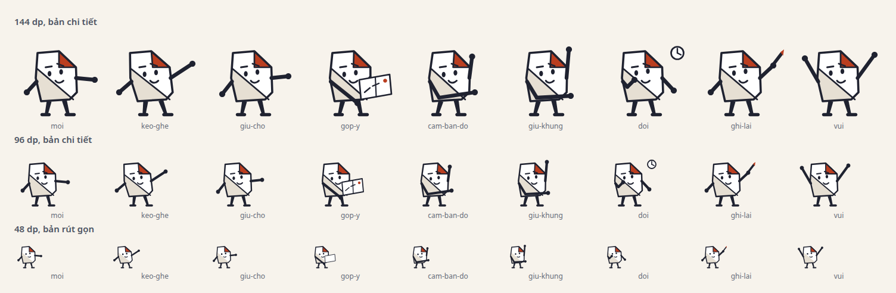
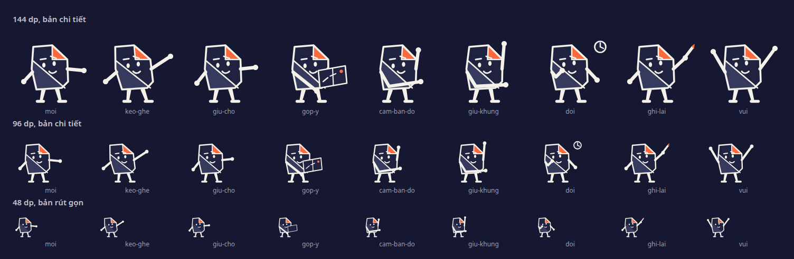
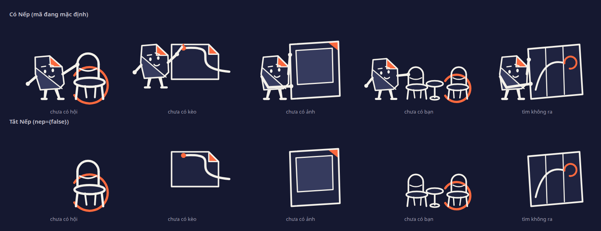
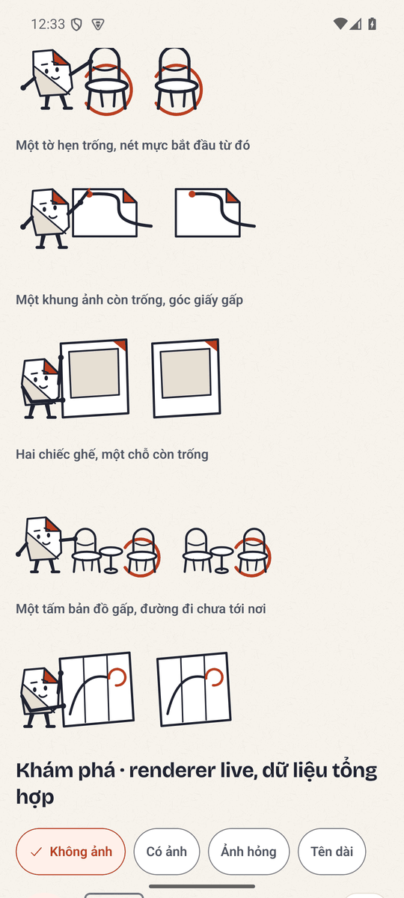
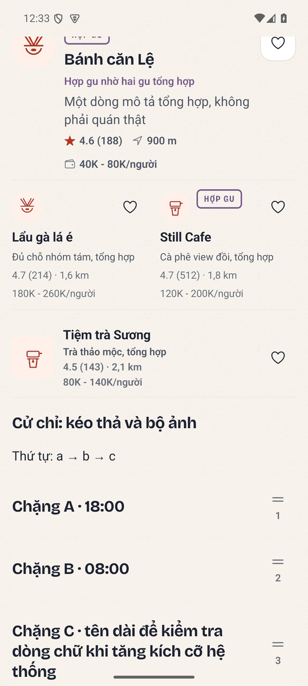
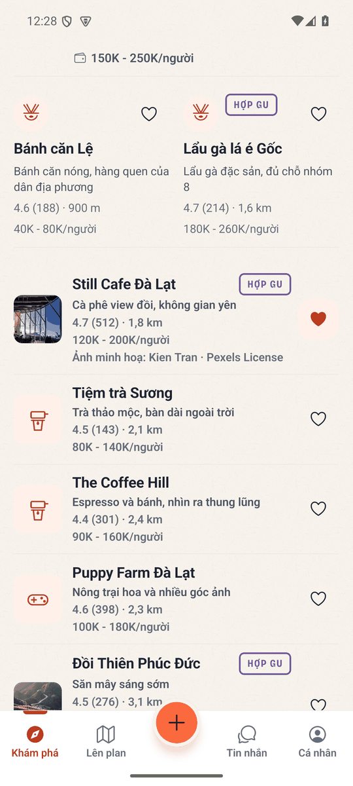
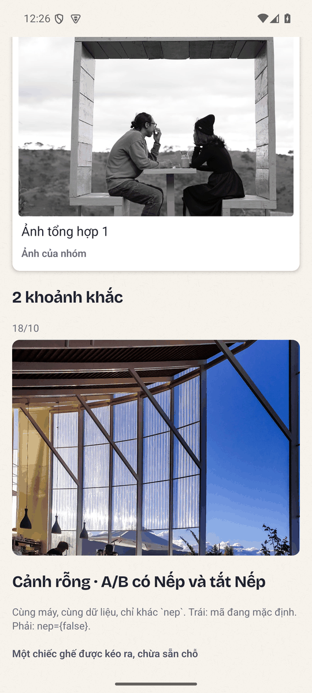
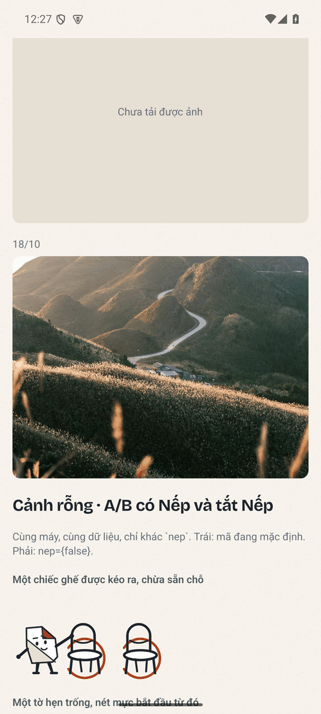
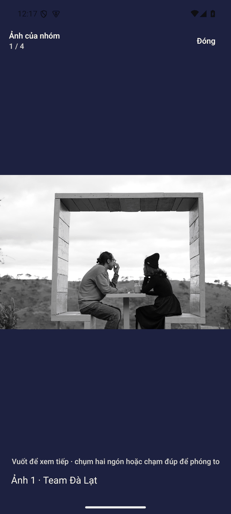

# Trả lời review «ngôn ngữ hình đợt 1» — bốn gói R1–R4

- Nhánh: `claude/p0-w-ui4-ban-sac-sua-review`, dựng trên `main` tại `16ac824d`.
- Trả lời cho: [`docs/codex/2026-09-08/review-ngon-ngu-hinh-dot-1.md`](../../codex/2026-09-08/review-ngon-ngu-hinh-dot-1.md) (VERDICT: REQUEST_CHANGES).
- Phạm vi đúng bằng bốn gói của review. **Không** làm B2 (lời rủ trong ô so sánh),
  **không** làm B3 (tám sticker), **không** làm C2 (token disabled toàn kit): review nói làm xong bốn
  gói rồi review lại một batch mới mở rộng, nên bốn thứ đó chờ.

## Tóm tắt: đã sửa gì

| Gói | Việc | Ở đâu |
|---|---|---|
| R1 · ảnh sai | Gỡ mười mapping ảnh sai; hai ảnh còn lại có quan hệ thật và ghi công; mọi nhánh không ảnh và ảnh lỗi có hình để nhìn | `fixtures.ts`, `HangDiaDiem.tsx`, `Discovery.tsx`, `Group.tsx`, `Outing.tsx`, `MediaSlot.tsx`, `assets/rudi/README.md` |
| R2 · Nếp không diễn | Ba pose diễn mới có điểm tay chạm vật; thân nghiêng và hướng mắt thành tham số; cả năm cảnh đứng trên một mặt sàn | `art/nep.ts`, `art/canh.ts` |
| R3 · Album | Chạm ảnh mở đúng ảnh (F03b); đếm ngày trên toàn bộ ảnh nên album hai ngày hiện đủ hai mốc (F03a); tách `AlbumAnh` để live và fixture dùng chung bộ dựng | `ky-niem.ts`, `AlbumAnh.tsx`, `AlbumLive.tsx`, `Memories.tsx`, `KhungAnh.tsx` |
| R4 · cỡ chữ lớn | Thanh tab nở theo `fontScale`, nhãn hai dòng; `RudiScreen bottomInset="tab"`; hàng và ô so sánh xuống cột ở cỡ chữ lớn | `adaptive.ts`, `RudiTabBar.tsx`, `ui.tsx`, `HangDiaDiem.tsx` |

## R1 — ảnh sai đối tượng

**Đã làm.** `fixtures.ts` trước đây dùng năm tấm ảnh cho mười hai địa điểm, nên «Tiệm Nướng» đội ảnh
kiến trúc kính và «Lẩu gà lá é» đội mặt gỗ. Bây giờ chỉ còn **hai** địa điểm có ảnh, và cả hai có quan
hệ thật với đối tượng:

| Địa điểm | Ảnh | Quan hệ | Nguồn |
|---|---|---|---|
| Still Cafe | `dalat-cafe.jpg` | quán cà phê Đà Lạt, đúng loại và đúng vùng | Kien Tran, Pexels License |
| Đồi Thiên Phúc Đức | `vietnam-road.jpg` | đường đồi Việt Nam, đúng loại cảnh | Hieu Do Quang, Unsplash License |

Mười địa điểm còn lại để `anh: null`. `null` đi hết đường: adapter của `Discovery.tsx`, ô bình chọn
trong `Group.tsx`, chặng trong `Outing.tsx` và ba bộ dựng của Khám phá đều có nhánh không ảnh **được
vẽ**, không phải khung xám: hàng dẫn rút gọn còn glyph 34 cạnh tên, ô so sánh dựng glyph 24 với con
dấu, hàng danh sách dùng `PlaceGlyph` theo `loai`. Ảnh tải hỏng (`onError`) rơi về đúng khối vẽ ấy kèm
câu «Chưa tải được ảnh», nên ba nhánh có ảnh / không ảnh / ảnh lỗi đều có thứ để nhìn.

Ghi công đi theo từng ảnh trong kiểu `AnhMau` (`{ source, nguon: { prefix, author, license } }`) chứ
không nằm rời ở màn, nên không thể quên khi thêm ảnh mới. Manifest quan hệ, cỡ dùng thật và crop ghi ở
`apps/mobile/assets/rudi/README.md`.

**Chưa làm:** bộ ảnh đúng quan hệ cho mười địa điểm còn lại. Review xếp việc đó vào A3 và cho phép
«B có biên tập»; ở đây tôi chọn để trống có chủ ý thay vì lấp bằng ảnh sai, và nhánh không ảnh là
đường đi chính thức chứ không phải trạng thái tạm.

## R2 — Nếp không diễn được câu chuyện

**Đã làm.** Ba pose diễn mới, mỗi pose có điểm tay chạm vật ghi thẳng trong mã:

| Pose | Tay chạm vào | Thân | Mắt |
|---|---|---|---|
| `keo-ghe` | đỉnh cọc lưng ghế, ô (90, 34) | ngả ra sau theo lực kéo (`nghieng` −6) | xuống phải, về phía chỗ ngồi |
| `cam-ban-do` | cạnh gần của bản đồ, hai tay ở ô x 75 và 78, tay gần gập khuỷu | nghiêng vào bản đồ (+5) | xuống, theo đường đi |
| `giu-khung` | cạnh gần của khung ảnh, ô x 74 và 76 | nghiêng vào khung (+4) | ngang, vào ô trống |

`giu-cho` cũng được sửa: tay đặt lên thanh ghế bên cạnh ở (88, 48) thay vì chìa ra không khí.

Thân nghiêng và hướng mắt là **tham số của pose** chứ không phải hình vẽ riêng: `nghieng` trượt phần
thân trên trong khi bàn chân giữ nguyên trên đường sàn `CHAN_NEP = 91`, `nhin` dời hai con mắt tối đa
1.6 ô về phía vật. Bàn tay đặt qua phép biến đổi không trượt, nên tay vẫn rơi đúng lên vật khi thân đã
nghiêng.

Cảnh dựng lại quanh **một mặt sàn chung** `SAN = 102`: chân ghế, chân khung ảnh, chân bản đồ và bàn
chân Nếp cùng kết thúc ở đó. Cảnh «chưa có bạn» đưa Nếp về đứng cạnh bàn với hai ghế thu nhỏ 0.7 nên
cả ba cùng một mặt phẳng; cảnh «chưa có kèo» giữ nguyên nhân vật viết bên tờ hẹn bay, là ngoại lệ có
chủ ý và được ghi trong `DESIGN.md`.

## R3 — Album

**F03b, nhãn nói «Mở ảnh» nhưng vào chế độ chọn.** `Memories.tsx` bây giờ tách hai đường: chạm một ảnh
mở `PhotoViewer` đúng ảnh đó; chế độ chọn chỉ vào bằng nút «Chọn ảnh» ở thanh đầu. Nhãn trợ năng theo
đúng việc: `Mở ảnh N` khi đang xem, `Chọn ảnh N` / `Bỏ chọn ảnh N` khi đang chọn.

**F03a, nhãn ngày mất khi hai ảnh nằm hai ngày.** `chiaAlbumTheoNgay` đếm ngày trên **toàn bộ** ảnh kể
cả ảnh dẫn, nên album có ảnh dẫn ngày 17/10 và một ảnh ngày 18/10 hiện đủ hai mốc thay vì im lặng. Ba
ca biên có test node: mốc 23:59:59 và 00:00:00 cùng múi giờ, cùng ngày, danh sách rỗng.

**Một bộ dựng cho cả hai màn.** Phần dựng ảnh tách ra `screens/ky-niem/AlbumAnh.tsx`, dùng chung bởi
`AlbumLive.tsx` (màn live) và bàn thử. Review đúng ở chỗ ảnh fixture không chứng minh bố cục live;
bằng chứng lần này chụp `AlbumAnh` — đúng bộ dựng màn live nạp — với dữ liệu tổng hợp.

**Dấu góc gấp.** Ảnh in dẫn đầu album mang `NepGoc`, nối motif góc gấp sang màn có dữ liệu mà không
đặt nhân vật vào đó, đúng như review gợi ý.

## R4 — cỡ chữ lớn

Thanh tab: nhãn xuống **hai dòng** căn giữa, và chiều cao thanh cộng thêm theo `fontScale` từ 1.15 trở
lên (`tabBarHeight`, `adaptive.ts`), nên ở 2.0 nhãn không bị cắt. `RudiScreen` nhận `bottomInset="tab"`
và tự cộng đúng chiều cao thật của thanh: mười màn bỏ hằng `112` cũ, nên nút cuối màn không nằm dưới
thanh tab nữa. Ô so sánh xuống một cột khi `fontScale ≥ 1.3` và giá kèm đơn vị đứng riêng một dòng,
nên «180K - 260K/người» không bị bẻ; hàng danh sách cho tên hai dòng và đưa con dấu xuống dưới tên khi
chữ lớn.

Về nhãn mờ: tôi bỏ cách nói «vi phạm WCAG». Nhãn của control inactive có ngoại lệ trong tiêu chí
1.4.3, nên đây là việc đọc khó cần sửa ở lát kit riêng, không phải lỗi tuân thủ, và tôi chưa đo lại tỷ
lệ ~2:1 trong lượt này.

## Quyết định đã ghi lại

Review yêu cầu ghi quyết định mở rộng nhận diện trước khi trải ra. Đã ghi trong `DESIGN.md`, mục «Lớp
vẽ», gồm cả giới hạn:

> Nếp là **một lớp tháo được**, không phải nhân vật bắt buộc: mọi cảnh phải đọc được với `nep={false}`.
> Nhân vật **không** vào màn có dữ liệu thật của nhóm (ảnh nhóm, ledger, hội thoại), **không** vào
> thanh điều hướng hay biểu tượng app, **không** thay `Stamp`/`GuGlyph` trong vai trò thông tin.

Cùng mục ghi thêm hợp đồng tư thế (điểm tay chạm vật, `nghieng`, `nhin`, `CHAN_NEP`) và mặt sàn chung
`SAN`, để lần sau sửa cảnh thì sửa cả hai đầu chứ không chỉnh một bên.

**Đính chính một câu trong doc hỏi review 08/09:** tôi viết «8 huy hiệu từ máy chủ». Sai. Máy chủ không
gửi huy hiệu; danh sách nằm ở `src/screens/thanh-tich/thanh-tich.ts` và do client tính từ số liệu Tài
chính: bốn huy hiệu đo được và bốn huy hiệu `chua-do-duoc` nói thẳng còn thiếu bảng nào. Đã sửa tại chỗ
trong doc đó.

## Cổng đã chạy

| Cổng | Kết quả |
|---|---|
| `npx tsc --noEmit` (apps/mobile) | exit 0 |
| `rm -rf dist-test && npm test` | **750 pass**, 0 fail (gồm `art-duong`, `adaptive`, `rudi-ky-niem`, `kham-pha`, `rudi-khong-hex`, `dau-gach-dai`, `mac-dinh-am-tham-id`) |
| `python3 -m pytest services/api/tests tests -q` (gốc repo) | **3433 passed**, 711 skipped, 5465 subtests, exit 0 |
| `python3 scripts/repo_guard.py staged` | pass ở từng lát commit |

`tests/art-duong.test.mjs` chạy chín pose × hai cách đọc × có/không phép đặt qua đúng bộ đọc của Java
`PathParser`, cộng năm cảnh có và không Nếp, và bắt được một lỗi thật trong lượt này: cảnh «chưa có
bạn» phiên bản đầu đẩy nhân vật ra ngoài khung ở x −6.74.

## Bản xem trước tầng art (48 / 96 / 144, sáng và tối)





Bản 48 là **một bản vẽ khác**, không phải bản 96 co lại: bỏ chân mày, bỏ nếp mặt, dày nét, và bỏ đạo
cụ nhỏ. Cả ba cỡ dựng từ cùng một hàm nên không có đường nào rẽ nhánh theo cỡ ngoài cờ `chiTiet`.




Hàng dưới của mỗi bảng là cảnh với `nep={false}`: đạo cụ giữ nguyên cỡ và không để lại khoảng thụt,
nên tắt nhân vật vẫn là một bức tranh đủ nghĩa.

## Giới hạn của lượt này — đọc trước khi tin dấu xanh

- **Không phải E2E API.** Bằng chứng renderer live đi qua bàn thử `rudi://dev/ui-lab` với dữ liệu bịa
  tại chỗ. Nó chứng minh **component trên máy thật** dựng đúng ở các trạng thái đó, **không** chứng
  minh đường OTP → API → màn. `ExploreLiveScreen` và `TripAlbumLiveScreen` bọc cùng bộ dựng ấy, nhưng
  phần tải dữ liệu của hai màn đó chưa được đo trong lượt này.
- **Chỉ Android.** `emulator-5554`, 1080×2400, density 420. Chưa có iOS, chưa có TalkBack/VoiceOver,
  chưa có bản release, chưa có máy rộng.
- **Ảnh minh hoạ, không phải ảnh của địa điểm thật.** Hai ảnh còn lại đúng loại và đúng vùng, có ghi
  công; chúng không phải ảnh chụp chính hai địa điểm ấy, và tiền tố «Ảnh minh hoạ: » nói đúng điều đó.
- **Mười địa điểm chưa có ảnh.** Đó là lựa chọn, không phải thiếu sót được giấu: A3 đóng khi có bộ ảnh
  đúng quan hệ, và tới lúc đó nhánh không ảnh là đường chính thức.
- **Chưa làm trong lượt này:** B2 (lời rủ trong ô so sánh), B3 (tám sticker theo hình Nếp), C2 (token
  disabled cho cả kit). Review xếp ba việc đó sau batch này.

## Bằng chứng native

Máy: `emulator-5554`, Android, `com.lakiet.rudi`, 1080×2400, density 420 (≈411dp ngang). Metro chạy từ
`apps/mobile`, cổng 8095, cửa fixture bật. Ba lượt cùng máy cùng dữ liệu, chỉ khác `font_scale`:
**1.0**, **1.3**, **2.0**, nền sáng. Không tài khoản thật, không người tham gia thật.

### R2 · A/B trên máy, cùng lúc cùng màn



Trong từng cặp, bản trái là mã đang mặc định và bản phải là `nep={false}`. Đọc từ trên xuống: tay đặt
lên đỉnh cọc lưng ghế và thân ngả theo lực kéo; ngòi bút chạm tờ hẹn; hai tay giữ cạnh gần của khung
ảnh; tay đặt lên thanh ghế bên cạnh và cả người đứng cùng mặt sàn với bàn; hai tay giữ cạnh bản đồ.

### R1 · ba nhánh ảnh trên bộ dựng của Khám phá





Ảnh thứ hai là màn thật của bản trải nghiệm sau khi gỡ mapping sai: «Still Cafe» giữ ảnh cà phê đúng
loại kèm ghi công, các hàng còn lại dựng glyph theo danh mục, và không còn tấm ảnh nào nói sai về đối
tượng của nó.

### R3 · album hai ngày, ảnh hỏng, và chạm để mở







Ảnh đầu là ca F03a của review: ngày 17/10 chỉ có ảnh dẫn, ngày 18/10 có một ảnh, và cả hai mốc đều
hiện. Ảnh cuối là ca F03b: chạm «Mở ảnh 1» ở album của bản trải nghiệm mở trình xem đúng ảnh, không
vào chế độ chọn.

### Chạy lại bằng chứng này

Bảng dùng harness sẵn có, mini-dir nằm cạnh `.maestro/` để bảng chính và meta-test không nhặt:

```bash
export ANDROID_ADB_SERVER_PORT=5038 ANDROID_SERIAL=emulator-5554   # 5037 bị nuốt trên WSL2 ở máy này
adb shell settings put system font_scale 1.0                        # rồi 1.3, rồi 2.0
scripts/mobile_native.sh --flows .maestro-bs-r2 --port 8095         # bộ đủ: bàn thử, Khám phá, album, sở thích
scripts/mobile_native.sh --flows .maestro-bs-r2-font --port 8095    # bộ gọn cho các cỡ chữ
```

## Xin xem lại đúng bốn điểm

1. **R2**: trong ảnh A/B, quan hệ giữa nhân vật và đồ vật có đọc ra không, và bản tắt Nếp có còn là
   một bức tranh đủ nghĩa không.
2. **R1**: nhánh không ảnh có đủ thứ để so sánh hai nơi không, hay vẫn cần ảnh mới đọc được.
3. **R3**: nhãn ngày và nhãn xem/chọn đã đúng nghĩa chưa, ở cả ca hai ngày và ca ảnh hỏng.
4. **R4**: ở 2.0, giá kèm đơn vị, nhãn tab và các nút quyết định có còn đọc và bấm được không.

Nếu bốn điểm này đạt, xin cho phép chuyển sang B2, B3 và C2 theo roadmap. Nếu chưa, xin nói rõ ảnh nào
và chỗ nào trong ảnh, để lượt sau sửa đúng chỗ chứ không mở lại cả hướng.
