# Trả lời review «ngôn ngữ hình» vòng 2 — F21 · F22 · F23

- Nhánh: `claude/p0-w-ui4-ban-sac-vong-2`, dựng trên `main` tại `34258f2c`.
- Trả lời cho: [`docs/codex/2026-09-08/review-ngon-ngu-hinh-vong-2.md`](../../codex/2026-09-08/review-ngon-ngu-hinh-vong-2.md)
  (VERDICT: REQUEST_CHANGES hẹp; hướng mỹ thuật được chấp nhận, R2–R4 đóng trong lát Android đã kiểm).
- Phạm vi đúng bằng ba việc hữu hạn review nêu, cộng một mục polish review xếp «cùng lượt media»
  (nền bệ ảnh trên nền tối). **Không** làm B2 · R04/R07, B3 · R01/R06, C2 · R02/R08 trong PR này;
  lát tiếp theo là **một** sticker `cho-ti` trong khay và bubble (mục cuối), theo lời review và
  quyết định của lead.

## Tóm tắt delta

| Mã | Review yêu cầu | Đã làm | Qua khi (review) → bằng chứng |
|---|---|---|---|
| F21 · P1 | Bình chọn, lịch trình AI, timeline bỏ mất quan hệ/nguồn của hai ảnh minh hoạ | Khung nào vẽ ảnh thì khung ấy in ghi công: `HangChang.anh` nhận cả `AnhMau`, tự vẽ thumbnail 44 + dòng ghi công + nhánh lỗi; `AnhChang` không còn export. **Bình chọn bỏ ảnh** (quyết định lead): ba ô đều hình vẽ theo loại. Test consumer đọc AST mọi `.tsx` | Native vote + lịch trình + timeline không gọi stock là ảnh thật; nhãn không mất khi cuộn; nhánh lỗi thử bằng nguồn loopback; test ở consumer → mục «Bằng chứng» |
| F22 · P2 | Bảng năm cảnh sáng là file lát gạch | Xuất lại bằng script đặt cửa sổ headless trước khi chụp (nguyên nhân thật: cửa sổ ~800×600 nhỏ hơn vùng chụp, không phải chỉ thứ tự đổi viewport). Chỉ đổi bản sáng | Mở PNG tại đúng đường dẫn cũ, đủ 5 cảnh × 2 hàng; sha mới `5917e201…bc29c` |
| F23 · P2 | Tên roadmap và mô tả hợp đồng lệch | Doc đợt 1 sửa tại chỗ (B2/B3/C2 đúng §13.1; `AlbumAnh` = `AlbumLive` + bàn thử; câu «không thể quên» thay bằng sự thật F21; «mười mapping»); `DESIGN.md` có **ngoại lệ sticker** | Tài liệu và đề bài lát tiếp theo cùng mapping, cùng ranh giới mascot/sticker |
| §4 · media | Ảnh lỗi Khám phá trên nền tối là mảng beige + đĩa đỏ nâu | Khung `MediaSlot`/`Photo` lấy `colors.card` thay hằng `#E7DACE` (đã xoá khỏi theme). Đĩa glyph: xem quyết định bằng ảnh ở dưới | Ảnh Khám phá trên bàn thử, ca «Ảnh hỏng», tối trước/sau |

## F21 — khung nào vẽ ảnh thì khung ấy in ghi công

**Điều review nói đúng và tôi nói sai ở đợt 1:** kiểu dữ liệu giữ metadata không chứng minh renderer
in metadata. Ba consumer đọc `.anh.source` rồi bỏ `nguon`, và không test nào nhìn thấy vì không test
nào nạp được `.tsx` hay `fixtures.ts`.

**Sửa tận gốc, không nhắc từng màn:**

1. `screens/keo/HangChang.tsx`: prop mới `anh?: { anh: AnhMau; alt; loai? } | null`. Khi có, chặng
   **tự** vẽ thumbnail 44 ở slot phải và **tự** in `cauGhiCong(anh.nguon)` là dòng chữ cuối của chặng
   (`caption`, `inkFaint`, không trần số dòng: cột hẹp, ở 1.3 tên tác giả xuống dòng chứ không ba
   chấm). Câu ghi công là một phần của hàng, cuộn cùng ảnh, không thể rơi sang bên kia của một lần
   cuộn. Ảnh tải hỏng (`onError`) rơi về hình gu theo `loai` trong cùng khung 44, nền `card`, viền
   `line`, **và** chặng in chữ «Chưa tải được ảnh» (`caption`, `warn`) như `MediaSlot`: trạng thái là
   một chữ nhìn thấy, không chỉ nhãn a11y (finish review bắt). `AnhChang({source, alt})` không còn
   export: cách duy nhất đặt ảnh lên chặng là đường có ghi công.
1b. Cùng luật cho hai khung của Khám phá: `DiaDiemHienThi` bỏ cặp `photo` + `attribution?` rời nhau,
   thay bằng **một** trường `anh: AnhCoGhiCong | null`; `Discovery.tsx` (fixture, AI match) truyền thẳng
   `place.anh`, `ExploreLive.tsx` (live) dựng một khối `{source, nguon}` với tiền tố «Ảnh quanh đây: ».
   Màn chi tiết fixture spread `khungAnh(place.anh)` (helper trong `ghi-cong.ts`) vào `MediaSlot` thay vì
   tự đọc `.source`. Câu «không có cách nào đưa ảnh mà không đưa ghi công» giờ đúng cho cả ba khung, ở
   tầng kiểu. Hàng `PlaceRow` cũng in «Chưa tải được ảnh» khi ảnh hỏng, không chỉ vẽ hình gu.
2. `Group.tsx` (lịch trình AI, chế độ xem) và `Outing.tsx` (timeline) truyền `anh` với `loai` từ
   `LOAI_MAU`; chế độ chỉnh giữ ba nút ở `phai`.
3. **Bình chọn bỏ ảnh** (lead chọn cách 2 của review): ba lựa chọn đều là hình vẽ theo loại trên
   nền `card` viền hairline, cùng ngữ pháp khung với chặng. Hai lý do ghi ngay trong code: ô 56dp không
   có chỗ cho câu ghi công, và một phiếu bầu không được để một lựa chọn nổi hơn chỉ vì catalogue tình cờ
   có ảnh stock của loại đó.
4. `ui/ghi-cong.ts` (thuần): `Attribution`, `cauGhiCong`, `TIEN_TO_MINH_HOA`, `AnhCoGhiCong`.
   `MediaSlot` re-export nên chỗ gọi cũ không đổi; `fixtures.ts` dùng một hằng thay vì viết tay «Ảnh
   minh hoạ: » hai lần; `AnhMau = AnhCoGhiCong`.
5. `assets/rudi/README.md` cột «Dùng ở» sửa: `dalat-cafe.jpg` không còn ở Bình chọn; ghi luật khung.

**Kiểm hồi quy ở consumer** (`tests/rudi-anh-ghi-cong.test.mjs`, tự vào cổng `npm test`):

- Đọc AST TypeScript mọi `.tsx` dưới `src/rudi` và `app`: ngoài đúng ba khung in ghi công
  (`MediaSlot`, `HangDiaDiem`, `HangChang`), **không** `<Image>` nào (kể cả import bí danh
  `Image as ExpoImage` từ `expo-image`/`react-native`) nhận biểu thức `anh.source`, `anh?.source` hay
  `.photo`; **không** chỗ nào đọc trần `x.anh.source`/`x.anh?.source` (bắt cả trường hợp gán ra biến rồi
  mới đưa vào `Image`); và không file nào còn import/gọi `AnhChang`. Ca «máy dò không mù» chạy một chuỗi
  mẫu có đủ các dạng ấy (finish review 08/09 chỉ ra regex đầu bỏ sót `anh?.source`, đúng dạng
  `Discovery.tsx` đang viết; đã nới).
- Ba khung được phép vẫn tồn tại và vẫn gọi `cauGhiCong`; thêm khung mới phải thêm tên vào đây.
- `cauGhiCong({prefix: TIEN_TO_MINH_HOA, …})` đúng «Ảnh minh hoạ: Kien Tran · Pexels License».
- Tầng thứ ba là tsc: `HangChang.anh` chỉ nhận `AnhMau` (có `nguon`), không nhận `ImageSource`.

**Bàn thử dev** (`rudi://dev/ui-lab`) thêm mục «Chặng · renderer live, dữ liệu tổng hợp» ba ca: *Chặng
có ghi công* (asset demo + ghi công tổng hợp), *Chặng ảnh hỏng* (nguồn loopback đóng
`http://127.0.0.1:1/…`), *Chặng không ảnh*. Các ca có ảnh của mục Khám phá cũng có ghi công (trước đó
bàn thử thiếu, nên dòng ghi công chưa từng lên bàn thử).

## F22 — bảng cảnh sáng

Review đúng, và lời tôi viết ở doc đợt 1 («đã vẽ lại») sai: file đích vẫn lát gạch, và bản «đã sửa»
trong scratchpad **cũng** lát gạch. Nguyên nhân thật không phải chỉ thứ tự đổi viewport: cửa sổ Chrome
headless mặc định ~800×600 nhỏ hơn vùng chụp, nên mọi `clip` lớn hơn cửa sổ bị compositor lặp. Script
mới gọi `Browser.setWindowBounds` 1800×1400 trước khi chụp; kiểm bằng cách đếm pixel vùng tiêu đề bên
phải (0 pixel khác nền) rồi mở ảnh.

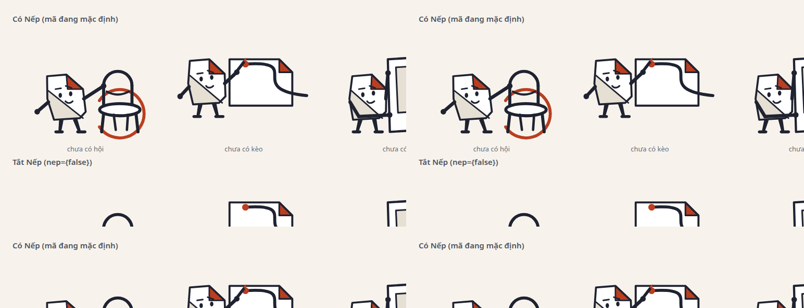

Chỉ thay bản sáng và checksum của nó (`ce1f842f…` → `5917e201ed05eecce817c51a867773adab5a74b8f3a62a0a409ae1a393bc29c`);
bản tối giữ nguyên. `manifest.json` của Codex vẫn ghi sha cũ ở `team_artifact`, đó là bản ghi của lượt
review, không sửa thay.

## F23 — đính chính

- **Phạm vi roadmap (§13.1 của báo cáo 07/09):**

  | Mã | Phạm vi đúng | Bản đợt 1 đã gọi sai thành |
  |---|---|---|
  | B2 · R04/R07 | Tạo kèo / Plan / lịch trình và expanded | «lời rủ trong ô so sánh» |
  | B3 · R01/R06 | AI typed cards, chat keyboard, khay sticker | «tám sticker» |
  | C2 · R02/R08 | Empty, profile, wall, badges, share | «token disabled toàn kit» |
  | Lát kit riêng | Token disabled, bản dùng chung, đo state | (không có mã C2) |

- **`AlbumAnh`** dùng chung cho `AlbumLive` và bàn thử dev; `Memories.tsx` (album fixture) giữ renderer
  riêng, chỉ dùng chung `PhotoViewer`/`KhungAnh`. Bằng chứng R3 là của component live, không của fixture.
- **«Mười ảnh»** nghĩa là mười mapping địa điểm bị gỡ trên năm asset tái dùng.
- **Ngoại lệ sticker trong `DESIGN.md`:** Nếp không *tự* bước vào hội thoại; một người *gửi* Nếp vào
  đó. Sticker là phát ngôn do người gửi chọn, không phải mascot hệ thống; giữ đúng tám ID và nhãn;
  `tra-tien-ne` là lời người gửi, không bao giờ là trạng thái giao dịch; Nếp-hệ-thống vẫn không đứng
  cạnh ledger, lỗi, conflict hay xác nhận tiền. Muốn cấm cả sticker thì trình Lead.
- Cả bốn chỗ được sửa **tại chỗ** trong doc đợt 1, đánh dấu *Đính chính*, có khối dẫn ở đầu doc.

## Tài liệu của Codex trong cây

Theo quyết định lead: hai báo cáo review (đợt 1, vòng 2) và **sáu** ảnh hỗ trợ finding mới
(`02` album hai ngày, `06` A/B cảnh sáng, `08` ảnh hỏng Khám phá tối, `09` Bình chọn, `10` lịch trình,
`20` Khám phá 2.0) được commit cùng `manifest.json` chỉ liệt kê đúng sáu file ấy; sáu PNG ghim sha256.
Không commit XML, 15 PNG còn lại (kể cả `13/14` chụp nhầm Welcome) và `kiem-source.mjs` (script dùng
data-URI base64 và đường dẫn tuyệt đối của máy review; repo guard từ chối). Mọi link tới thứ không đưa
lên đổi thành chữ *«đã kiểm local, không nằm trong PR»*; báo cáo 07/09 và `nep-concept/` của Codex
cũng chưa trong cây nên link tới chúng đổi thành chữ. Script kiểm: mọi `](…)` tương đối trong ba doc
tồn tại trong `git ls-files` → **0 link hỏng**.

## Quyết định bằng ảnh: đĩa glyph trên nền tối

Nền khung đổi sang `card` là phần chắc chắn: trong ảnh, mảng beige biến mất ở cặp so sánh (khung
`MediaSlot`) và hàng; ảnh dẫn dùng cùng `MediaSlot` nhưng nằm ngoài khung hình của lượt chụp này, nên
kết luận cho nó là suy từ cùng một component, không phải từ ảnh. Đĩa glyph `accentSoft` (tối `#3d1a10`) thì **giữ**: đứng trên `card` nó đọc là một tint ấm
cùng họ với accent, không còn là vết trên nền beige; ở nền sáng nó là tint coral nhạt review đã chấp
nhận ở đợt 1. Phương án thay bằng `ground` đã cân nhắc và bỏ: trên nền tối `ground` (#151830) trên
`card` (#1f2340) gần như không thấy đĩa, glyph mất chỗ đứng. Không thêm token. Nếu review vẫn thấy đĩa
lệch nhịp, việc tiếp theo là một vai token riêng cho «nền đồ vật vẽ» trong lát kit, không phải đổi tại chỗ.

| Trước (review, ảnh 08) | Sau |
|---|---|
| 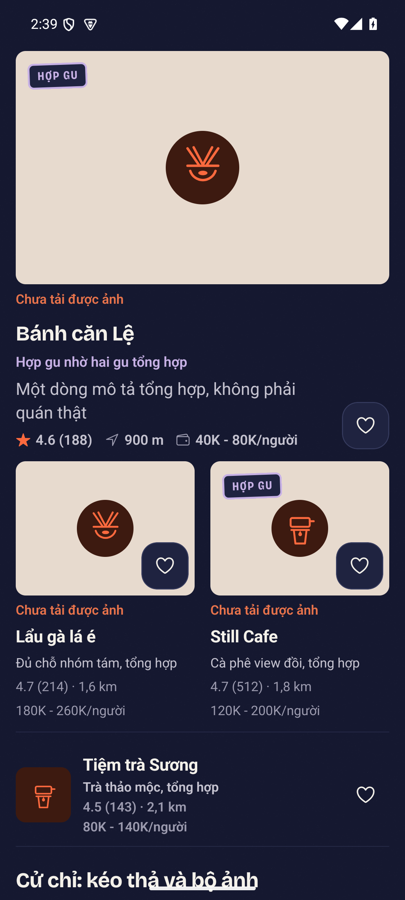 | 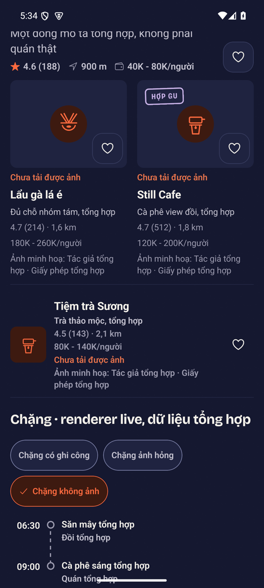 |


## Bằng chứng

Máy: `emulator-5554`, Android, `com.lakiet.rudi`, 1080×2400, density 420 (≈411dp), dev client, cửa
fixture bật. Mini-bảng `.maestro-bs-r3/` (flow 65 Bình chọn, 66 lịch trình AI, 67 timeline, 68 bàn thử,
69 Khám phá fixture) chạy **XANH** ở ba cấu hình, cùng máy cùng dữ liệu, chỉ khác `font_scale`/`uimode`.
Ảnh sáng 1.0 và tối trong doc là của **lượt cuối** trên `f38bed46` (sau lượt sửa theo finish review):
sáng `f38bed46-3122183`, tối `f38bed46-3130871`, bản gốc trong
`.impeccable/review/native/*-f38bed46/` (hai thư mục theo giờ chạy). Ảnh **1.3** là của lượt `d985b15a-3095107`
(`…/native/*-d985b15a/`, lượt 1.3): các sửa sau đó không đổi đường vẽ lịch trình/chặng khi ảnh tải được
(chỉ thêm chữ ở trạng thái hỏng và đổi kiểu dữ liệu Khám phá), nên không chạy lại 1.3; nói rõ để không
ai đọc nó là ảnh của commit cuối. NEO 2b cắn, canary đỏ đúng chỗ ở mọi lượt. Ảnh hạ cỡ 540×1200 để
vào cây.

Lịch sử các lượt: lượt sáng đầu (trước `d985b15a`) **đỏ** ở flow 68: nhãn a11y «Chưa tải được ảnh: …»
của ô rơi về không tới được vì `View` thiếu `accessible`, và ảnh A/B neo vào tiêu đề mục nên cảnh ghế
vẫn dưới mép; sửa ở `d985b15a`. Lượt lab sáng trên `a662d2f2` chụp nhánh ảnh hỏng Khám phá lệch khung
(neo tiêu đề mục Chặng), finish review bắt; neo lại ở `69f9a8a3`. Lượt cuối `f38bed46` thêm flow 69.

### F21 · Bình chọn, lịch trình AI, timeline

| Bình chọn 1.0 | Bình chọn tối | Lịch trình AI ngày 2, 1.0 | Lịch trình AI ngày 2, tối |
|---|---|---|---|
| 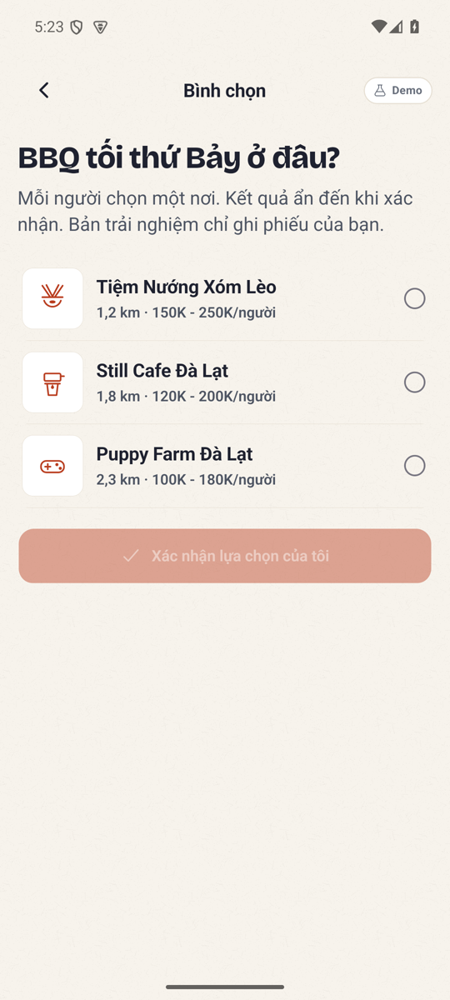 | 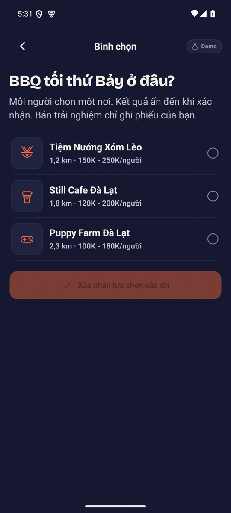 | 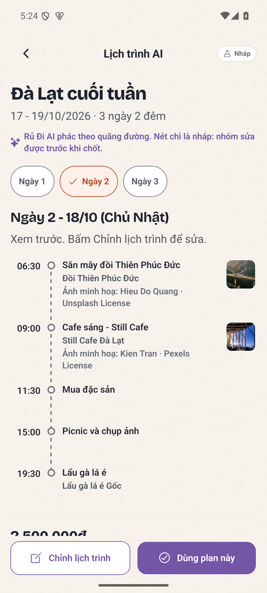 | 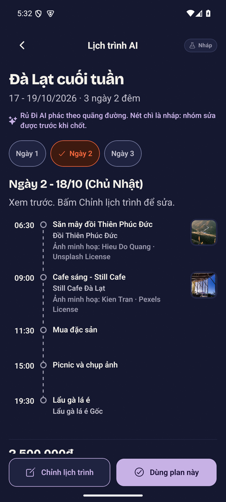 |

| Lịch trình AI cuộn tới cuối (nhãn còn) | Timeline ngày 2 (deep link) | Lịch trình AI ở 1.3 (ghi công xuống dòng, không ba chấm) |
|---|---|---|
| 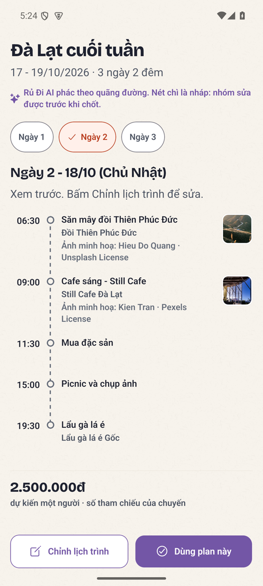 | 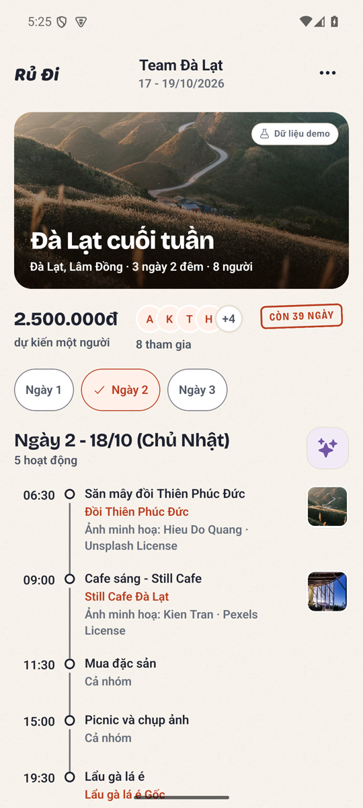 | 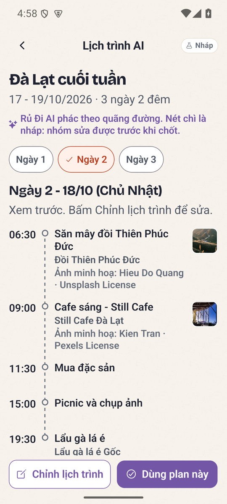 |

Flow 66/67 **assert trọn chuỗi** «Ảnh minh hoạ: Hieu Do Quang · Unsplash License» và «Ảnh minh hoạ:
Kien Tran · Pexels License» (đúng đầu ra của `cauGhiCong`), trước và sau khi cuộn tới «dự kiến một
người · số tham chiếu của chuyến». Bình chọn: ba ô hình vẽ theo loại, không ảnh; «Still Cafe Đà Lạt»
vẫn là chữ.

### F21 · bàn thử: renderer chặng ba ca

| Có ghi công 1.0 | Ảnh hỏng 1.0 (loopback) | Không ảnh 1.0 | Ảnh hỏng tối | Có ghi công 1.3 |
|---|---|---|---|---|
| 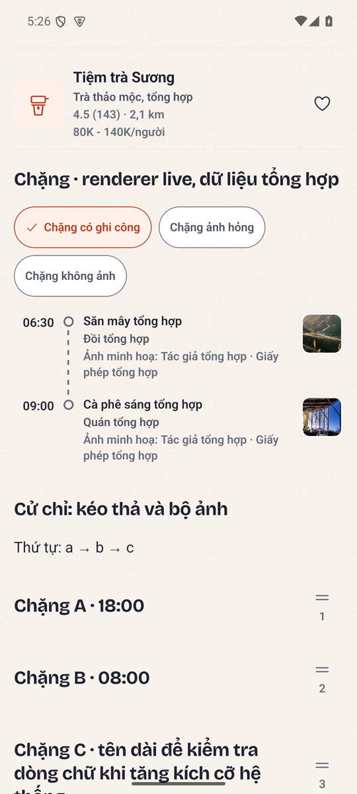 | 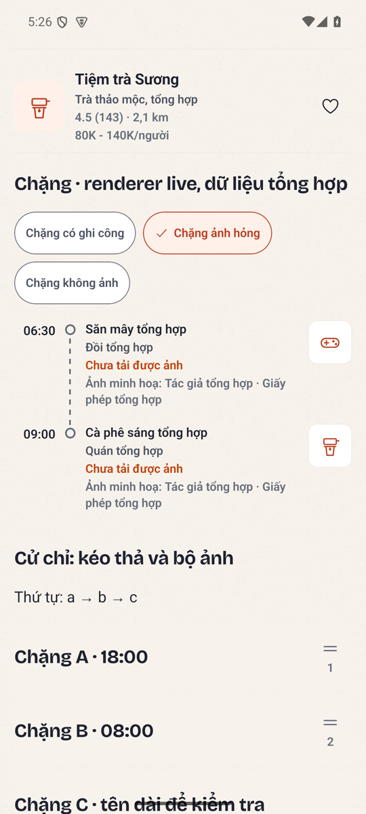 | 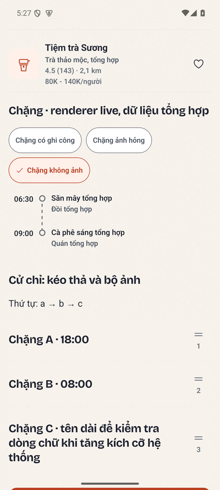 | 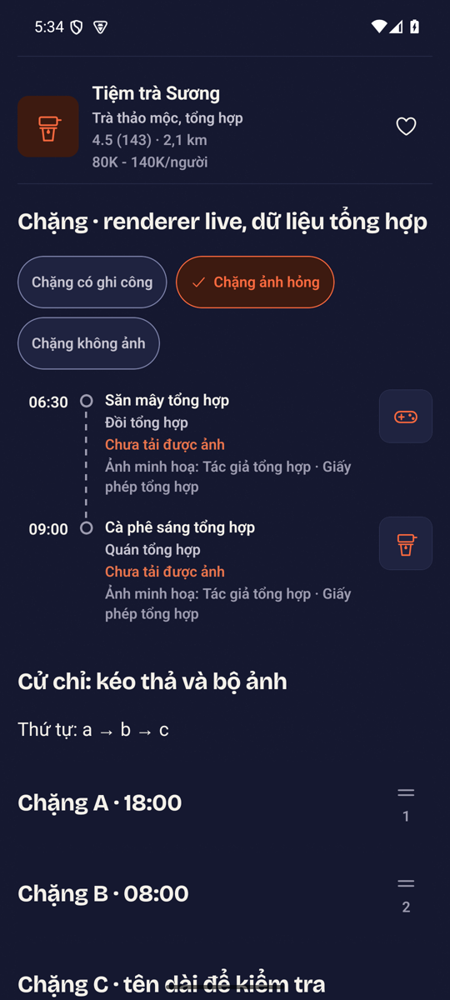 | 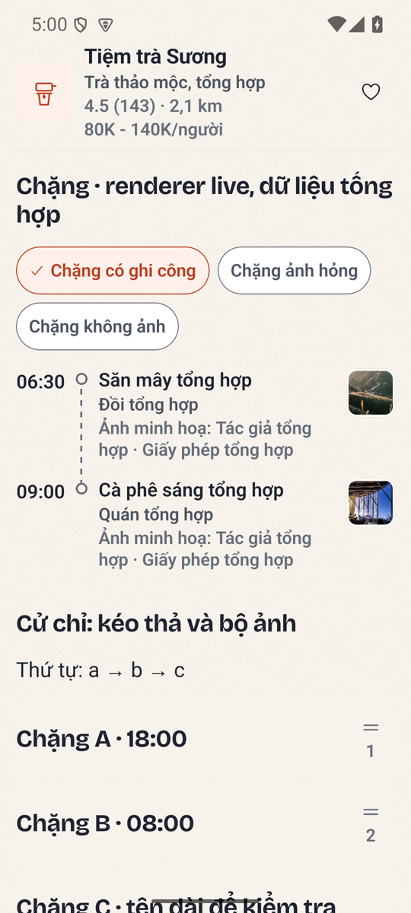 |

Ca ảnh hỏng: flow chờ nhãn a11y «Chưa tải được ảnh: Quán tổng hợp»; hình gu theo loại nằm trong đúng
khung 44 (không ô trống), dòng ghi công vẫn in như `PlaceRow` của Khám phá làm với ảnh hỏng.

### §4 · ảnh lỗi Khám phá sau khi nền khung theo theme

| Sáng 1.0 | Tối |
|---|---|
| 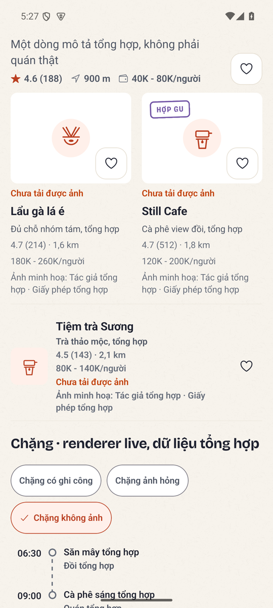 |  |

Hàng «Tiệm trà Sương» giờ cũng nói «Chưa tải được ảnh» dưới dữ kiện (finish review, điểm 4).

### Khám phá fixture sau khi đổi kiểu `DiaDiemHienThi` (flow 69)

| Đầu trang | Cuộn tới «Đồi Thiên Phúc Đức» |
|---|---|
| 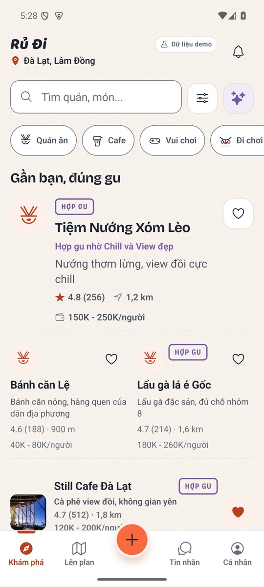 | 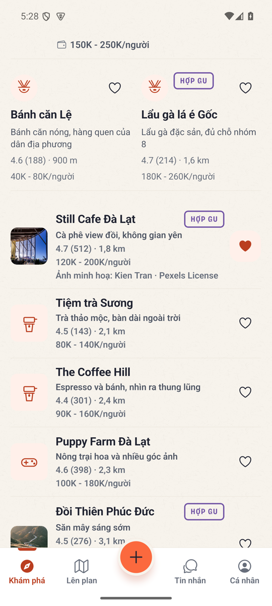 |

Cùng bố cục với bằng chứng đợt 1 (`sua-review/native-kham-pha-hang-1.0.png`): đổi kiểu không đổi hình.

### F22 · A/B cảnh sáng chụp đủ cảnh ghế

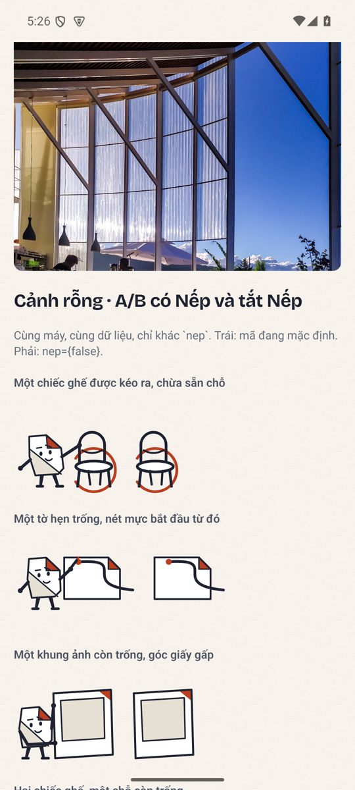


## Cổng đã chạy

| Cổng | Kết quả |
|---|---|
| `npx tsc --noEmit` | exit 0 |
| `rm -rf dist-test && npm test` (build:check + node) | **755 pass, 0 fail** (cổng tự nhặt `tests/rudi-anh-ghi-cong.test.mjs`) |
| `python3 -m pytest services/api/tests tests -q` | **3433 passed, 711 skipped** (skip = tầng Postgres không có URL, không phải xanh) |
| `python3 scripts/repo_guard.py range origin/main HEAD` | pass, từng commit |
| Impeccable detector (`HangChang`, `Group`, `Outing`, `MediaSlot`, `ui.tsx`, `ui-lab`) | `[]`, exit 0; engine FULL; hook DEAD nên chạy tay |
| Kiểm link ba doc review/trả lời | 0 link hỏng |
| Mini-bảng `.maestro-bs-r3` | XANH × 3 (sáng 1.0, tối, sáng 1.3) |
| Finish review (context mới) | xem mục dưới |

## Finish review nội bộ

Finish reviewer của Impeccable chạy trong **context mới** (không thừa kế thread build), đọc packet, 15 ảnh,
source và hai doc. Kết luận: **fix** (không recapture, không rebuild). Bảy điểm và cách xử lý:

| # | Mức | Điểm | Xử lý |
|---|---|---|---|
| 1 | Medium · bằng chứng | Ảnh «Khám phá ảnh hỏng sáng» chụp nhầm phần dưới màn (neo tiêu đề mục Chặng), doc nói «biến mất ở cả ba bộ dựng» trong khi ảnh dẫn ngoài khung | Chụp lại neo vào «Tiệm trà Sương» căn giữa (thấy cặp so sánh + hàng); sửa câu trong doc và ô bảng delta |
| 2 | Medium · harden | Máy dò chỉ biết `anh.source`, bỏ sót `anh?.source` (đúng dạng `Discovery.tsx`), bí danh `Image as X`, biến trung gian | Nới: đọc import để biết bí danh Image; bắt phép đọc trần `x.anh.source`/`x.anh?.source` ở mọi file không phải khung; ca «không mù» thêm ba dạng ấy |
| 3 | Medium · harden | `DiaDiemHienThi` còn `photo` + `attribution?` rời nhau ở tầng kiểu | Một trường `anh: AnhCoGhiCong \| null`; Discovery, ExploreLive, bàn thử đổi theo; chi tiết spread `khungAnh()`. Máy dò nới ở mục 2 bắt đúng chỗ `Discovery.tsx:390` còn đọc trần → sửa |
| 4 | Medium · «mọi trạng thái cũng là một chữ» | Ảnh hỏng ở chặng chỉ có hình gu + nhãn a11y, không chữ | Chặng và `PlaceRow` in «Chưa tải được ảnh» (`caption`, `warn`) như `MediaSlot`; flow 68 assert chữ |
| 5 | Low · craft | Dấu «·» mồ côi cuối dòng ở 1.0 («Hieu Do Quang ·» / «Kien Tran ·») | **Không sửa**: cách chữa là NBSP quanh «·» trong `cauGhiCong`, đổi chuỗi in trên mọi khung live lẫn fixture và làm regex `"Ảnh quanh đây: .* · .*"` của flow 38 (bảng chính, live) đỏ. Ghi nợ typography: giải ở lát kit, có bảng thử 1.0/1.3 |
| 6 | Low · ngữ nghĩa | Tay cầm game cho Puppy Farm giờ là dấu phân biệt duy nhất giữa ba ô Bình chọn | Đã ghi nợ; xếp **đầu** lát nội dung glyph (mục dưới) |
| 7 | Low · §4 | Đĩa `accentSoft` tối gần cùng độ sáng với `card` | Không chặn; giữ như quyết định bằng ảnh ở trên; là vai token riêng của lát kit |

Sau lượt sửa: bảng r3 chạy lại sáng và tối (thêm flow 69 chụp màn Khám phá fixture để kiểm đổi kiểu),
rồi gửi reviewer chấm **verdict pass** từng điểm.

**Verdict pass** (cùng reviewer, sau lượt sửa, đọc lại source và 17 ảnh mới): điểm 1–4 **resolved**
(ảnh và câu chữ §4; máy dò; kiểu `DiaDiemHienThi.anh`; chữ «Chưa tải được ảnh»); điểm 5–7 **unresolved,
có lý do được chấp nhận** (flow 38 ghim regex; phạm vi glyph do Codex đặt; không thêm token). Không phát
hiện hồi quy trong ảnh chụp lại. Hai ghi chú, không phải hồi quy: ảnh 1.3 là của lượt `d985b15a` nên chữ
`warn` ở ca ảnh hỏng chưa có bằng chứng 1.3 (đã nói ở đầu mục Bằng chứng); các hàng Bình chọn / lịch trình
/ timeline sáng và tối không đổi so với vòng review. Disposition: **ship** — *cho bảy điểm đã chấm*, không
phải cho toàn bề mặt.


## Ghi nhận, không sửa lượt này

- **Glyph nông trại/vườn hoa (xếp đầu lát nội dung glyph).** `guTheoLoai("vui-choi") = "game"` (tay cầm) cho cả Puppy Farm, Đồi
  Thiên Phúc Đức, Thung lũng Tình Yêu; danh mục máy chủ `vui-choi` gom cả rạp phim và điểm tham quan
  (OSM `tourism=attraction`). Đề xuất khi làm nội dung glyph: hoặc đổi map `vui-choi → outdoor` (lối
  mòn + bóng cây) nếu catalogue live cũng thiên tham quan, hoặc cho fixture một `loai` riêng. Review
  xếp vào việc nội dung glyph, không mở lại R1; không đổi trong PR này.
- **Search placeholder tràn ở 2.0** (ảnh 17 của review): nợ input/large-text, ghi vào lượt harden.
- **`MEMORY_PHOTOS` album mẫu** dùng lại `cafe`/`road` như ảnh của nhóm, không ghi công. Ngoài phạm vi
  F21 (ảnh địa điểm), ghi nhận: album fixture đang giả định ảnh nhóm; lời giải đúng là ảnh nhóm tổng hợp
  có nhãn, không phải thêm ghi công stock vào album.
- **`Photo` (ô ảnh trần trong lưới) chưa có nhánh `onError`**: một ô album tải hỏng là nền `card` không
  chữ; ba khung có ghi công thì nói «Chưa tải được ảnh». Documenter ghi nhận khi cập nhật `DESIGN.md`;
  đi cùng việc `MEMORY_PHOTOS`.
- **Disabled mờ** ở «Tiếp tục»: lát token tập trung đã thống nhất.
- **Cổng chỉ Android**, fixture + bàn thử; chưa iOS, TalkBack, release.

## Chạy lại

```bash
cd apps/mobile && rm -rf dist-test && npm test
cd apps/mobile && npx tsc --noEmit
python3 -m pytest services/api/tests tests -q
python3 scripts/repo_guard.py range origin/main HEAD
ANDROID_ADB_SERVER_PORT=5038 ANDROID_SERIAL=emulator-5554 scripts/mobile_native.sh --flows .maestro-bs-r3 --port 8095
```

## Lát tiếp theo: một sticker trước tám

Theo review §4 và quyết định lead: thay hình của **`cho-ti` «Chờ tí»** bằng ngôn ngữ Nếp — ở 64dp
(khay) ghế là đạo cụ chính và đồng hồ là dấu hiệu lớn tối giản; ở 120dp (bubble) đủ thân nghiêng, tay
thật giữ ghế, mắt hướng đồng hồ. Không thu nhỏ scene `giu-cho`; silhouette và biểu cảm phải mạnh hơn
cảnh rỗng. Thử khay + bubble, sáng/tối, trạng thái gửi/lỗi/gửi lại trên chat live. Câu hỏi nghiệm thu
duy nhất: **nhận ra «chờ tí» khi chưa đọc nhãn?** Chưa có câu trả lời thì chưa nhân sang bảy sticker
còn lại. PR riêng, sau khi PR này được review delta.
