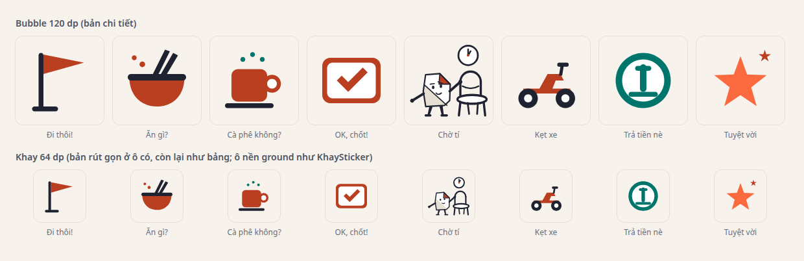
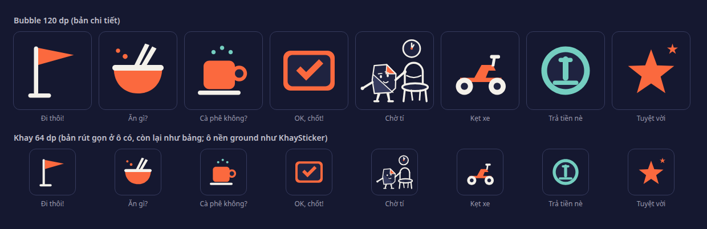
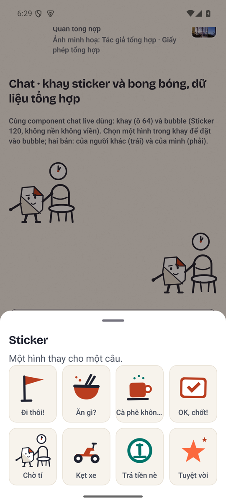
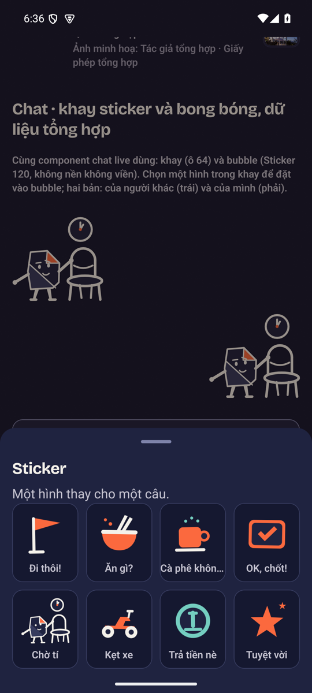
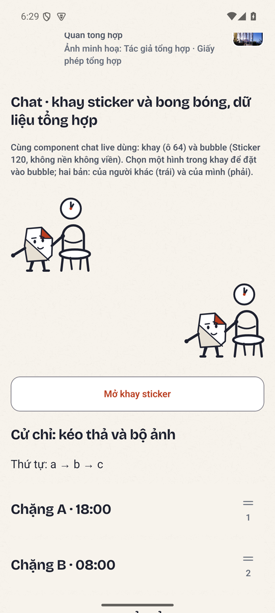
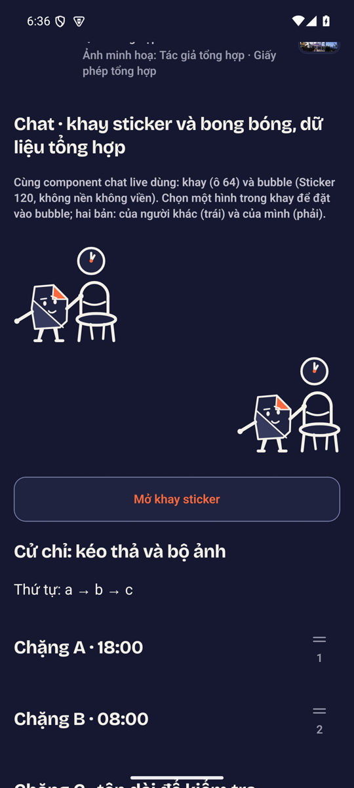
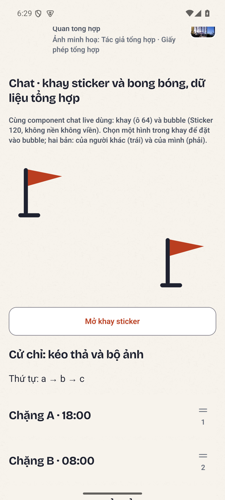

# Một sticker trước tám: «Chờ tí» bằng ngôn ngữ Nếp

- Nhánh: `claude/p0-w-ui4-sticker-cho-ti`, dựng trên nhánh trả lời vòng 2 (`claude/p0-w-ui4-ban-sac-vong-2`).
- Đề bài: [review vòng 2 §4](../../codex/2026-09-08/review-ngon-ngu-hinh-vong-2.md) «Một sticker trước tám sticker»
  và ghi chú của lead 08/09: ở 64dp ghế là đạo cụ chính, đồng hồ là dấu hiệu lớn tối giản; ở 120dp đủ thân
  nghiêng, tay thật giữ ghế, mắt hướng đồng hồ; thử khay lẫn bubble, sáng/tối, trạng thái gửi/lỗi/gửi lại;
  không chỉ thu nhỏ scene `giu-cho`; chưa nhận ra «chờ tí» khi chưa đọc nhãn thì chưa nhân sang bảy cái còn lại.
- Giữ nguyên tám ID và nhãn (ADR-0021 khoá ba chiều); chỉ thay **hình** của `cho-ti`. Không đổi máy chủ, không
  đổi `packages/shared/stickers.json`.

## Câu hỏi nghiệm thu duy nhất

**Nhìn khay ở cỡ thật, chưa đọc nhãn: có nhận ra «chờ tí» không?** Bạn trả lời bằng ảnh dưới đây, không phải
bằng mô tả của tôi. Có → vẽ bảy hình còn lại theo cùng ngữ pháp trong lát B3. Không → sửa một hình này trước.

## Hình

Ghế chiếm nửa phải ở 0.9 cỡ cảnh; Nếp đứng trái ở 0.726, **nghiêng về ghế** (`nghieng` 5), **tay xa nắm đầu trụ
lưng ghế** (pose `keo-ghe`, điểm (62.4, 49.6) của khung 96 đúng đầu trụ gần của `hinhGhe(57, …, 0.9)`, có ở cả
hai cỡ đọc vì ghế rút gọn bỏ thanh ngang chứ không bỏ trụ), tay gần mở về phía chỗ ngồi; **mắt hướng lên phải**
về đồng hồ (`nhin` [1.4, −1.6], sát trần). Đồng hồ là **dấu hiệu**: vòng r12 ở (72, 17) phía trên lưng ghế cách
8 đơn vị, hai kim ở 12 và khoảng 1 giờ — góc nhỏ là dấu «một tí», góc rộng thì đọc là «một giờ nào đó»; chấm
coral ở tâm; không số, không vạch. Không phải scene `giu-cho` thu nhỏ: scene «chưa có bạn» có hai ghế và một bàn,
tay đặt giữa lưng ghế; sticker một ghế to hơn tương đối, thân nghiêng về ghế, tay nắm đầu trụ, thêm đồng hồ.

*Bản đầu* (trước finish review nội bộ) dùng pose `giu-cho` với tay đặt giữa lưng ghế: ở 120 đọc như cánh tay xuyên
qua khung lưng ghế, ở 64 tay chạm vào khoảng trống vì ghế rút gọn không có thanh ngang; mắt chỉ «liếc phải»; kim
đồng hồ ở 12 và 4 giờ nói «một giờ». Bản này sửa cả bốn.

Hai cỡ đọc: bubble 120 dùng bản chi tiết; khay 64 dùng bản rút gọn (cùng phép giản lược 48dp của Nếp: bỏ chân
mày, bỏ nếp mặt, chi dày hơn; ghế trơn; nét đồng hồ dày hơn, **cỡ đồng hồ giữ nguyên**).

**Khay:** ô của `KhaySticker` đổi nền từ `card` sang `ground` (giếng giấy nền trong tấm sheet `card`), vì trên ô
`card` mặt giấy của Nếp (cũng `card`) biến mất ở theme tối; giờ sticker trong khay đứng trên cùng nền với bubble.

| Bảng tám sticker, sáng | tối |
|---|---|
|  |  |

## Kỹ thuật (nhỏ, có chủ đích)

- `LopSticker` thêm `net` (nét) và vai `line`; `Sticker.tsx` vẽ lớp nét bằng stroke bo tròn. Bảy hình cũ không đổi.
- Adapter `tuLopVe` đổi vai lớp vẽ (`giay/muc/gap/bong`) sang vai sticker; gặp vai không có màu thì ném lúc nạp
  module, test node đỏ trước máy.
- `hinhSticker(id, { chiTiet })` chọn bản rút gọn nếu có (`HINH_RUT_GON`); `Sticker.tsx` chọn theo ngưỡng 72 như
  `Nep.tsx`. Bảng `HINH` vẫn tám key `"id": [` để test từ vựng gốc không đổi.
- Test node chạy cả hai cỡ; lớp nét được mở (`M`-first, ≥ 2 điểm), lớp tô vẫn kín; phép cấm «-0» chỉ bắt âm-không
  thật (bản đầu bắt nhầm toạ độ −0.97 hợp lệ trong khung).

## Bằng chứng native (bàn thử dev, cùng component chat live)

Máy `emulator-5554`, dev client, cửa fixture bật, bàn thử `rudi://dev/ui-lab` mục «Chat». Mini-bảng `.maestro-bs-r4/`
(flow 70) **XANH** sáng (dấu vân `6047e8f6-3249388`, bản sửa theo finish review) và tối (`9beb7606-3262999`); NEO 2b cắn, canary đỏ đúng chỗ.
Khay là `KhaySticker` thật (ô 64, nhãn dưới ô, qua khe `overlay` của `RudiScreen`); bubble là `Sticker` 120 trong
hai hàng canh trái/phải, không nền không viền, đúng như `GroupChatLive` vẽ. Ảnh hạ cỡ 540×1200, pin sha256.

| Khay, sáng | Khay, tối |
|---|---|
|  |  |

| Bubble «Chờ tí», sáng | Bubble «Chờ tí», tối | Bubble «Đi thôi!» (hình cũ, để so) |
|---|---|---|
|  |  |  |

Hai lượt bảng đầu đỏ và đều là lỗi của bàn thử/flow, không của hình: (1) `assertVisible` chạy khi tấm sheet còn
trượt → đổi sang chờ; (2) `KhaySticker` đặt trong nội dung cuộn nên trượt lên ở đáy nội dung, ngoài màn → đưa qua
`RudiScreen overlay` đúng quy tắc DESIGN.md. Lượt ba xanh cả hai theme.

**Quyết định đi kèm (finish review nội bộ, điểm 7):** «Chờ tí» là ô duy nhất vẽ bằng nét + hai mảng sắc độ giữa bảy
ô tô đặc một màu; lệch mạnh, không nhẹ. Đó là *trạng thái thử*, không phải kiểu thứ hai của hệ: câu trả lời của
bạn dẫn tới **vẽ đủ tám theo ngữ pháp này** hoặc **hoàn nguyên `cho-ti`**, không có phương án giữ một ô lệch trong
khay lâu dài.

**Điều tôi thấy, để bạn đối chiếu, không thay bạn quyết:** ở 64dp trong khay, ô «Chờ tí» đọc là *một nhân vật
nhỏ, một ghế và một đồng hồ*; ba dấu hiệu đủ nhưng nhỏ hơn bảy ô còn lại vốn là một khối màu lớn. Sự lệch ấy là
điều review dự báo khi làm một trước tám: nếu hướng này được chọn, bảy ô kia sẽ đi theo cùng ngữ pháp (nét + hai
mảng sắc độ) và khay sẽ đều lại. Ở 120 trong bubble, tay chạm ghế, thân nghiêng và mắt hướng đồng hồ đọc rõ ở cả
hai theme.

## Trạng thái gửi / lỗi / gửi lại trên chat live

**Chưa chụp trong PR này.** Trạng thái gửi / lỗi / gửi lại là của `GroupChatLive` (nút gửi `loading`, thông báo
lỗi, bấm lại), chỉ đo được trên chat live: cần stack API chế độ prod với `MOBILE_OTP_DEBUG_CODE`, roster seed và
các flow tiền đề 22 (đăng nhập) → 24 (nhóm) → 34 (ảnh trong chat) → 37 (sticker) của bảng `--otp`, và cách đo
«mất mạng» bằng gỡ đường hầm `adb reverse` giữa lúc gửi. Lúc làm PR này không có stack ấy đang chạy; dựng nó là
một lượt riêng (~40 phút bảng live). Bàn thử ở trên dùng đúng hai component chat live dùng (`KhaySticker`,
`Sticker`) ở đúng cỡ, nên hình và cỡ đã được đo; **hành vi gửi thì chưa**. Nói rõ để không ai đọc bàn thử là chat.
Đề nghị: chạy flow 37 trong lượt bảng live kế tiếp (nó đã bấm «Đi thôi!» và chờ «Sticker: Đi thôi!», không cần đổi).

## Finish review nội bộ (context mới)

Reviewer đọc source, hình học trong `choTi`, bảng tám sticker và năm ảnh native của bản đầu. Kết luận bản đầu:
**fix**. Điều reviewer *đọc được ở 64 trước khi đọc nhãn*: «một nhân vật giấy nhỏ đứng cạnh một ghế, có đồng hồ ở
trên» — đạo cụ đọc, cử chỉ không đọc. Bảy điểm và cách xử lý:

| # | Mức | Điểm | Xử lý |
|---|---|---|---|
| 1 | High | Bản rút gọn: ghế rút gọn bỏ thanh ngang, tay (đặt giữa lưng) chạm khoảng trống | Đổi điểm nắm sang **đầu trụ** lưng ghế: trụ có ở cả hai cỡ đọc |
| 2 | High | Ở 120 tay «xuyên» vào khung lưng ghế, không phải giữ | Pose `keo-ghe` (tay xa nắm đầu lưng ghế), `nghieng` +5 về ghế; toạ độ tay = đầu trụ tính từ `hinhGhe` |
| 3 | Medium-high | Theme tối: mặt giấy (`card`) trùng màu ô khay (`card`), thân thành nét rỗng | Ô khay `KhaySticker` đổi nền `ground` (giếng trong sheet `card`): sticker trong khay đứng trên cùng nền với bubble |
| 4 | Medium | Mắt chỉ «liếc phải», không lên đồng hồ | `nhin` [1.4, −1.6] sát trần; đồng hồ hạ xuống (72, 17) để đường nhìn tin được |
| 5 | Medium | Kim 12 và 4 giờ nói «một giờ», không nói «một tí» | Kim 12 và ~1: góc nhỏ |
| 6 | Low-medium | Đồng hồ và lưng ghế chồng khối ở 64 (cách ~2.7dp) | Đồng hồ r12 tại (72, 17), cách đỉnh lưng ghế 8 đơn vị (≈5dp ở 64) |
| 7 | Quyết định | Lệch mạnh với bảy ô tô đặc; không thể để một ô lệch trong khay lâu dài | Ghi thành quyết định đi kèm (trên): vẽ đủ tám hoặc hoàn nguyên |

Điểm Java/khung: không có (toạ độ trong [−1, 97], nét không cắt). Điều **giữ**: bố cục ghế phải, người 0.7–0.8
nghiêng vào, đồng hồ là vòng lớn, một mặt sàn y 91, adapter `tuLopVe` qua cùng bảng và cùng test Java.

**Verdict pass** (cùng reviewer, sau lượt sửa, đọc lại source và bảy ảnh mới): **7/7 resolved**; disposition
**ship** — cho bảy điểm đã chấm của một lần thử, *không* cho khay như một bộ. Điều reviewer đọc được ở 64 trước khi
đọc nhãn, sau sửa: «một nhân vật giấy, một tay đặt lên lưng một chiếc ghế trống, nhìn lên đồng hồ có kim vừa qua
12» — tức «đang chờ, giữ chỗ, chỉ một lát»; ý tới trước nhãn, vẫn chậm hơn bảy ô một khối vì là ba đồ vật. Hồi quy:
không có điểm vật chất; ghi nhận đổi nền ô khay là thay đổi **toàn khay** (tám ô), cải thiện ở theme tối vì các
mảng `card` của bảy hình cũ cũng tách khỏi ô. Điểm mở còn lại duy nhất là độ lệch với bảy ô tô đặc — chính là câu
hỏi của lần thử này, không phải lỗi cần sửa.

## Cổng

| Cổng | Kết quả |
|---|---|
| `npx tsc --noEmit` | exit 0 |
| `rm -rf dist-test && npm test` | **755 pass, 0 fail** |
| `python3 -m pytest services/api/tests tests -q` | **3433 passed, 711 skipped** (gồm `test_sticker_vocabulary_matches_client.py` 4 ca: ba bản sao ID khớp, bảng `HINH` vẫn tám key) |
| `node --test tests/rudi-chat-sticker.test.mjs` | 4 pass, chạy cả hai cỡ đọc |
| Impeccable detector (`Sticker.tsx`, `KhaySticker.tsx`, `ui-lab.tsx`) | `[]`, exit 0 |
| `scripts/repo_guard.py range` | pass từng commit |
| Mini-bảng `.maestro-bs-r4` (flow 70) | XANH sáng (dấu vân `6047e8f6-3249388`) và tối (`9beb7606-3262999`) trên `emulator-5554` |
| Finish review (context mới) | fix → sửa 6, ghi quyết định 1 → verdict pass ở trên |

## Ranh giới đã ghi

`DESIGN.md` (đợt trước): sticker là phát ngôn do người gửi chọn, không phải mascot hệ thống; giữ tám ID;
`tra-tien-ne` không là trạng thái giao dịch; Nếp-hệ-thống vẫn không đứng cạnh ledger, lỗi, conflict, xác nhận tiền.
