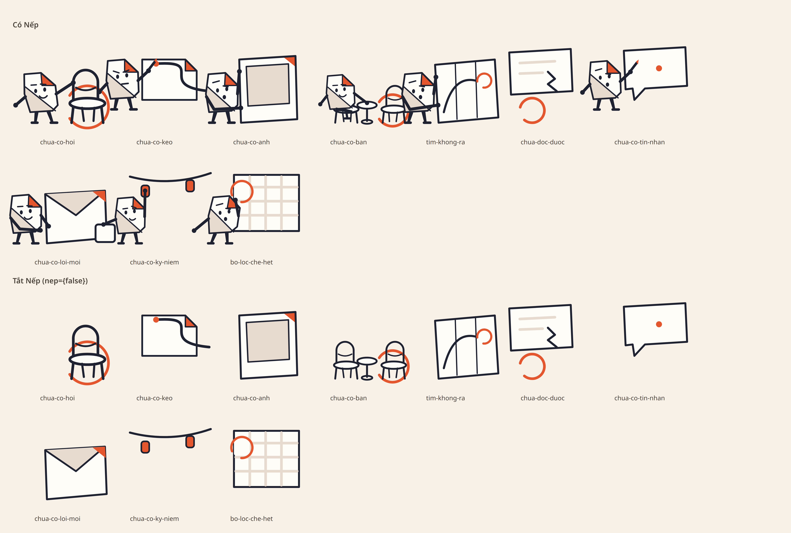
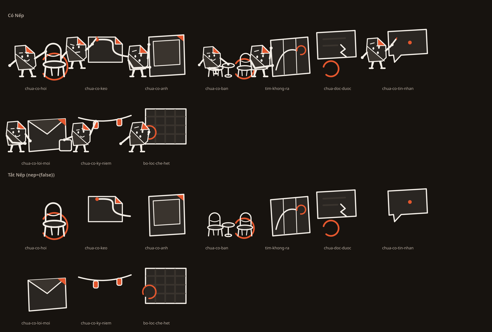

# Mỗi im lặng một cảnh — mười cảnh, và một luật được cưỡng chế thay vì được nhắc

Ngày: 09/09/2026. Nhánh: `claude/p0-w-ui4-canh-moi-im-lang` (xếp trên nhánh sticker).
Nền: review delta 08/09 §4 «với cảnh, mỗi cảnh cần một tình huống riêng; không đưa Nếp vào mọi
hàng dữ liệu chỉ để tăng độ trang trí» — và quyết định của lead: **phủ hết trạng thái rỗng**.

## Đếm trước khi vẽ

Vỏ có **46** chỗ mount `EmptyState`/`ErrorState`. **Năm** có hình. Hai trong năm cảnh đã vẽ
(`chua-co-hoi`, `chua-co-ban`) **không màn nào dùng**. Nên bài toán không phải «vẽ đẹp hơn» mà là
«bốn mươi mốt màn đang nói *không có gì ở đây* bằng một khoảng trắng».

Và năm cảnh đang có thì **dùng chung một dáng người**: `hinhNep` trước lượt này chỉ đổi tay, nên
ba trong năm cảnh là cùng một thân, cùng một khuôn mặt, chỉ khác đạo cụ — đúng thứ review cấm nhân
lên. Trục `BIEU_CAM` và `DANG` (nhánh sticker) là điều kiện để sửa được chỗ này.

## Mười cảnh, mười tình huống

| cảnh | tình huống | dáng · mặt |
|---|---|---|
| `chua-co-hoi` | kéo ghế ra, chừa chỗ | `dung` · `nhuong` |
| `chua-co-keo` | cúi xuống tờ hẹn trống, nét mực vừa bắt đầu | `dung` · `quyet` |
| `chua-co-anh` | nâng khung rỗng lên, **nhìn xuyên qua** nó | `dung` · `hoi` |
| `chua-co-ban` | **ngồi** ở bàn hai chỗ, tay mời sang ghế trống | `ngoi` · `nhuong` |
| `tim-khong-ra` | dò bản đồ, đường đi dừng giữa chừng | `dung` · `hoi` |
| `chua-co-tin-nhan` | trang giấy trắng, chấm mực đầu tiên | `dung` · `hoi` |
| `chua-co-loi-moi` | hai tay đưa một phong thư còn rỗng | `dung` · `nhuong` |
| `chua-co-ky-niem` | dây phơi ảnh, tấm đầu chưa được kẹp lên | `dung` · `binh-than` |
| `bo-loc-che-het` | tấm lưới che gần kín, còn đúng một khe | `dung` · `hoi` |
| `chua-doc-duoc` | tờ giấy rách góc, dòng chữ dừng ở vết rách | **không có người** |

`chua-co-hoi` và `chua-co-ban` từng là cùng một dáng cạnh một hoặc hai chiếc ghế. Nay một cái
**đứng kéo ghế** và một cái **ngồi mời sang chỗ đối diện** — hai tình huống, không phải hai bản
của một tình huống. Chỗ ngồi phải đặt theo **mặt ghế** chứ không theo sàn, nên nó là cảnh duy nhất
không dùng `nepTrenSan`.

## Luật được cưỡng chế, không được nhắc

`DESIGN.md` có «Luật Nếp Đứng Xa Tiền»: nhân vật không bao giờ đứng cạnh lỗi, xung đột hay tiền.
Trạng thái lỗi **chính là** chỗ ấy, và nó có ở khoảng **hai mươi** màn, trong đó có màn sổ.

Một luật mà hai mươi nơi phải tự nhớ `nep={false}` là một luật sẽ hỏng ở lần thêm màn thứ hai mươi
mốt. Nên nó nằm trong `hinhCanh`: `CANH_KHONG_NEP` chứa `chua-doc-duoc`, và **yêu cầu vẽ Nếp bị bỏ
qua** cho id trong tập ấy. Cổng `art-duong` biết tập ấy và đòi bản có/không Nếp **giống hệt nhau**.

Và cảnh lỗi được gắn **một lần** vào `ErrorState`, nên khoảng hai mươi màn có hình mà không màn nào
phải nhớ gì.

## Nối vào đâu, và cố ý để trống chỗ nào

Nối mới: bình luận · kèo của nhóm · tường nhóm · tường người khác · bạn bè · hai tab lời mời ·
chat rỗng · điểm đến không khớp · story hết · danh sách nhóm. Cộng với `ErrorState` là khoảng ba
mươi chỗ.

**Cố ý để trống**: «Bạn chưa chặn ai», «Chưa có phiên nào», và các danh sách quản trị khác. Một
danh sách quản trị rỗng không cần ai kể chuyện; review đã cấm đưa hình kể chuyện vào mọi hàng dữ
liệu, và đây là chỗ áp dụng nó.

**Bỏ một cảnh đã vẽ**: `chua-co-thanh-tich`. Màn Thành tích luôn hiện đủ danh sách huy hiệu kèm
trạng thái nên **không có ca rỗng nào**; giữ một cảnh không màn nào dùng đúng là lỗi review đã nêu
về hai cảnh mồ côi. Vẽ rồi vẫn xoá.

## Lượt chấm bắt tôi tái phạm đúng lỗi review đã cấm

Finish review trả `rebuild`: **ba cảnh MỚI dùng lại pose của ba cảnh cũ**, chỉ đổi hình chữ nhật.
Đúng cái «một dáng đổi đạo cụ» mà review của team cấm, và tôi tái phạm ngay trong lượt sửa nó.

| cảnh | trùng với | thêm |
|---|---|---|
| `chua-co-tin-nhan` | `chua-co-keo`: cùng pose `ghi-lai` **và** cùng motif nền `gocGap` | ngòi bút chỉ vào khoảng không, cách chấm mực 13 sang phải, 26 xuống dưới |
| `chua-co-ky-niem` | `chua-co-anh`: cùng `giu-khung`, cùng điểm tay | câu cho trình đọc màn hình nói ngược với hình |
| `bo-loc-che-het` | `tim-khong-ra`: cùng `cam-ban-do` | chỉ khác hoa văn |

Vẽ lại bằng **ba pose mới** (`nang-bong`, `voi-len`, `ghe-nhin`) và **hai motif nền mới**, nên nay
mười cảnh khác nhau trên cả hai trục. Lượt chấm thứ hai xác nhận điều đó.

Nó còn bắt bốn chỗ đặt sai mà tôi không thấy khi tự chấm: chiếc ghế đang ngồi bị thân người che
kín nên đọc ra «đứng trên ghế»; bàn tay mời dừng cách mặt bàn 15 đơn vị; `ghe-nhin` với hai tay
dang thẳng đọc ra **nhún vai** chứ không phải ghé nhìn, và ô hở của lưới nằm bên kia tấm lưới so
với cái đầu; tấm ảnh trong tay thấp thành mảng trắng **sau ống chân**, thò xuống dưới mặt sàn.

## Cổng

| Cổng | Kết quả |
|---|---|
| `npx tsc --noEmit` | sạch |
| `npm test` (cây sạch) | 770 pass, 0 fail |
| `art-duong` | mười cảnh, có và không Nếp, trong khung 144×112 |
| repo guard | pass, hai bảng ảnh ghim sha256 |

## Chưa chứng minh

- **Chưa chụp native.** Máy ảo do lane khác lái suốt lượt này. Ảnh trên là bảng vector dựng qua
  Chrome headless từ `dist-test`, **không** phải ảnh chụp máy. Ba mươi chỗ nối chưa được nhìn trên
  màn thật, và đó là phần dễ sai nhất: một cảnh 168dp trong `EmptyState layout="inline"` giữa một
  danh sách có thể quá to hoặc quá gần chữ.
- Cỡ chữ 1.3/2.0 chưa đo với cảnh mới.
