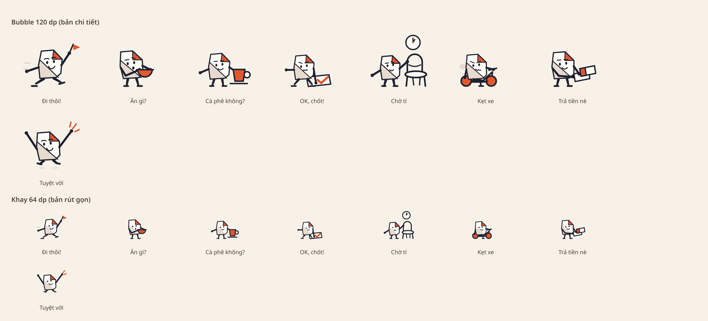
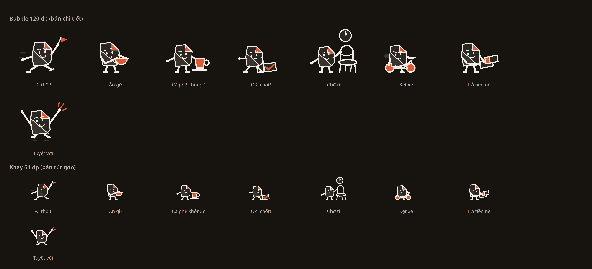
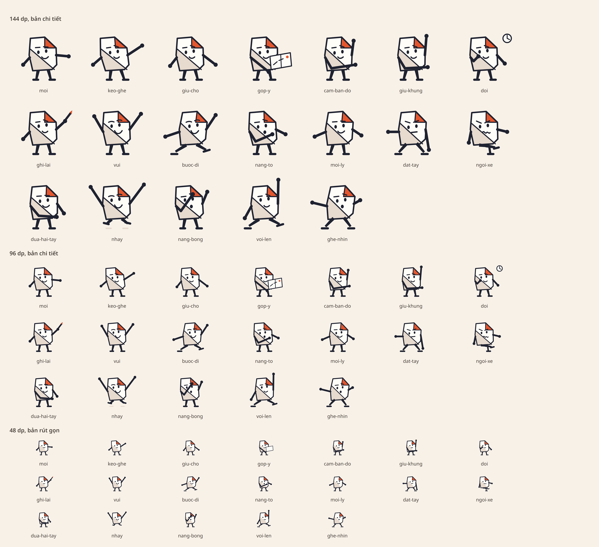

# Tám sticker Nếp — nhân ngôn ngữ hình, không nhân một dáng

Ngày: 09/09/2026. Nhánh: `claude/p0-w-ui4-tam-sticker-nep` (xếp trên nhánh đóng F31/F32).
Nền: `docs/codex/2026-09-08/review-delta-584-585.md` §4 — duyệt pilot `cho-ti`, cho vẽ bảy hình
còn lại, kèm một lời dặn cụ thể.

## Cái chặn thật, và nó không phải bảy bức vẽ

Review viết: «nhân ngôn ngữ hình, **không nhân cùng một pose rồi đổi đồ vật**». Đọc lại tầng art
thì thấy điều đó **không làm được** với `hinhNep` như nó đang có: pose chỉ đổi **tay**. Thân, mặt
và chân giống hệt nhau ở cả chín pose — một khuôn mặt duy nhất (một mày ngang, một mày vống, một
nụ cười xéo) và bốn lớp chân cố định đứng trên `CHAN_NEP`. Vì thế:

- «Đi thôi!» **không thể** có hướng di chuyển: không có dáng bước.
- «Kẹt xe» không có gì để ngồi lên.
- «OK, chốt!» và «Tuyệt vời» buộc phải đeo cùng một khuôn mặt, nên không thể khác cảm xúc.
- Và đó cũng là lý do **năm cảnh** trong `canh.ts` đang là một dáng người đổi đạo cụ.

Nên việc đầu tiên là mở ngữ pháp, không phải vẽ.

## Hai trục mới trong `art/nep.ts`

| trục | giá trị | đổi cái gì |
|---|---|---|
| `BIEU_CAM` | `binh-than` · `hao-hung` · `hoi` · `quyet` · `met` · `nhuong` | mày và miệng |
| `DANG` | `dung` · `buoc` · `nhun` · `ngoi` · `chong` | chân |

Mắt vẫn là **chấm** và vẫn theo `nhin`: mắt to, má hồng, ngôi sao là đúng register mà concept
note của team đã loại. `dung` là bản cũ **nguyên vẹn**, nên chín pose và năm cảnh đang có giữ
nguyên hình từng nét — cổng `art-duong` so lớp theo lớp và vẫn xanh.

Thêm `dam`: nhân **độ dày nét và bề dày chi**, không đụng hình học. Nó có vì `cho-ti` phải nhường
nửa khung cho ghế nên đứng ở 0.726 và ra **nhạt hơn** bảy hình bên cạnh; phóng to thì ghế rơi khỏi
khung (quan hệ `tiLeGhe = 57/46 × tiLeNep` là cứng, tính từ điểm tay chạm đầu trụ). Lead chọn
**cân lại nét, giữ nguyên bố cục** — đó chính là `dam: 1.16` cho một hình đã được duyệt, và PR
này nói rõ là đã đụng vào nó.

## Tám hành động

| id | nhãn | việc đang làm | dáng | mặt | đạo cụ |
|---|---|---|---|---|---|
| `di-thoi` | Đi thôi! | đang bước, vẫy theo | `buoc` | `hao-hung` | cờ + hai vạch chuyển động |
| `an-gi` | Ăn gì? | nâng tô rỗng lên hỏi | `dung` | `hoi` | tô |
| `cafe-khong` | Cà phê không? | đẩy ly về phía người nhận | `dung` | `nhuong` | ly |
| `ok-chot` | OK, chốt! | ấn dấu xuống tờ giấy | `chong` | `quyet` | giấy + dấu |
| `cho-ti` | Chờ tí | giữ ghế, nhìn đồng hồ | `dung` | `binh-than` | ghế + đồng hồ |
| `ket-xe` | Kẹt xe | ngồi trên xe không nhúc nhích | `ngoi` | `met` | xe |
| `tra-tien-ne` | Trả tiền nè | hai tay đưa tiền, hơi cúi | `dung` | `nhuong` | hai tờ |
| `tuyet-voi` | Tuyệt vời | hai chân rời sàn | `nhun` | `hao-hung` | tia |

Ngân sách đạo cụ mặc định là **một**. Đó là bài học đắt nhất của pilot: một người đọc ở 64dp mô tả
`cho-ti` là «ba đồ vật», và ba đồ vật đọc chậm hơn một khối.

`tra-tien-ne` **không** có dấu tick, đồng xu hay ký hiệu tiền tệ, đúng ranh giới ADR-0021: đây là
lời người gửi, tuyệt đối không được trông như hệ thống xác nhận tiền đã chuyển. Bản đầu vẽ một tờ
gấp góc và **đọc ra phong bì** — đúng register concept note loại — nên đổi sang hai tờ chồng nhau
với một vạch coral.

Ba lần sửa sau khi **mở ảnh ra nhìn**, không phải sau khi test xanh: tô che mất thân người nên
dời ra trước; ly quá nhỏ và tay với xuống nên nâng lên ngang tầm; cúi quá sâu nên đọc ra ngã.

## Khay: nhãn không bị cắt nữa

«Cà phê không?» bị cắt thành «Cà phê khôn…» vì ô `width: "22%"` với `numberOfLines={1}`. Tám nhãn
là từ vựng khoá ở ba nơi, nên **layout nhường, không phải chữ**: nhãn hai dòng với chiều cao dành
sẵn (tám ô bằng nhau), và số cột tụt theo `fontScale` (4 → 3 → 2). Bề rộng viết literal chứ không
ghép chuỗi — cổng `receipt.test.mjs` đọc **mọi** «…%» một build sinh ra, vì ADR-0009 cấm hiện phần
trăm của mô hình, và một bề rộng tính bằng template literal rơi đúng vào danh sách ấy.

## Cổng

| Cổng | Kết quả |
|---|---|
| `npx tsc --noEmit` | sạch |
| `npm test` (cây sạch) | 770 pass, 0 fail |
| `tests/test_sticker_vocabulary_matches_client.py` | 4 passed (tám ID và nhãn không đổi) |
| `art-duong` + `rudi-chat-sticker` | xanh ở cả hai cỡ đọc, mười sáu pose |
| repo guard | pass, ảnh ghim sha256 |

Cổng `notDeepEqual` không còn ghim tên `cho-ti`: nay **lặp trên mọi id**, vì cả tám đều có bản đọc
thứ hai cho khay. Dòng cũ khẳng định `di-thoi` **không** có bản rút gọn đã bỏ.

## Chưa chứng minh

- **Chưa chụp native.** Máy ảo đang do lane khác lái suốt lượt này. Ảnh ở trên là bảng vector dựng
  qua Chrome headless từ chính `dist-test`, **không** phải ảnh chụp máy. Khay thật, bubble thật,
  và cỡ chữ 1.3/2.0 chưa đo.
- **Chưa ai đọc mù.** Reviewer vòng trước nói đúng rằng biết trước đề bài thì không gọi là blind
  test. Bảng trên có nhãn ngay dưới hình; muốn đo thật thì che nhãn và hỏi người chưa đọc doc.
- Bộ này thay **cả bảy** hình cũ cùng lúc, đúng lời review («trình một bộ có chủ đích để so sánh»,
  không xin phép từng hình). Nếu team thấy một hình lệch, sửa hình ấy chứ không quay về khối phẳng.
