# Issues: audit UI/UX app mobile RuDi

- Cây đo: `7ea1a7c`. Bản chạy: web export production (`expo export --platform web`) trên stack cục bộ
  (Postgres 16, API Python, cửa trước Go), dữ liệu seed tổng hợp. Chromium 141 headless, giả lập di
  động (`isMobile`, `hasTouch`, DPR 2), chữ thân Roboto (xem `report.md` §A).
- MODE = AUDIT_ONLY: không issue nào được sửa trong đợt này. «Trạng thái sửa» của mọi issue là
  *chưa sửa*; «Retest» là *không áp dụng*.
- Phân loại: BUG (sai, tái hiện được) · UX ISSUE (khó hiểu/khó thao tác, chưa chắc là lỗi kỹ thuật) ·
  VISUAL POLISH (đề xuất thẩm mỹ, không phải lỗi khách quan).
- Mức: P0 mất dữ liệu / app không dùng được diện rộng · P1 chặn flow chính, action quan trọng không
  làm được, overlay không thoát được, điều hướng hỏng · P2 lỗi layout/interaction rõ, che/mất nội dung,
  vẫn còn đường đi tiếp · P3 polish, nhất quán, UX nhẹ.
- Phương pháp: RUNTIME-WEB là đã chạy và đo trên bản web; STATIC là đọc mã; HYPOTHESIS là nghi vấn
  chưa kiểm chứng. Mọi issue dưới đây đã được tái hiện runtime trên web, trừ chỗ ghi khác.
- Native Android/iOS: không chạy được trong container (xem `report.md` §A); cột «Native» nói điều đọc
  mã cho phép suy ra, không phải bằng chứng.

## Tóm tắt theo mức

| Mức | Issue |
|---|---|
| P1 | UI-005, UI-049, UI-082 |
| P2 | UI-002, UI-003, UI-004, UI-006, UI-011, UI-016, UI-018, UI-019, UI-021, UI-022, UI-023, UI-024, UI-032, UI-033, UI-034, UI-035, UI-036, UI-048, UI-050, UI-051, UI-052, UI-062, UI-063, UI-073, UI-074, UI-083, UI-084, UI-085, UI-094, UI-095, UI-096, UI-097, UI-107, UI-113 |
| P3 | UI-001, UI-007, UI-008, UI-009, UI-010, UI-012, UI-013, UI-014, UI-015, UI-017, UI-020, UI-025, UI-026, UI-027, UI-028, UI-029, UI-030, UI-031, UI-037, UI-038, UI-039, UI-040, UI-041, UI-042, UI-043, UI-044, UI-045, UI-046, UI-047, UI-053, UI-054, UI-055, UI-056, UI-057, UI-058, UI-059, UI-060, UI-061, UI-064, UI-065, UI-066, UI-067, UI-068, UI-069, UI-070, UI-071, UI-072, UI-075, UI-076, UI-077, UI-078, UI-079, UI-080, UI-081, UI-086, UI-087, UI-088, UI-089, UI-090, UI-091, UI-092, UI-093, UI-098, UI-099, UI-100, UI-101, UI-102, UI-103, UI-104, UI-105, UI-106, UI-108, UI-109, UI-110, UI-111, UI-112, UI-114, UI-115 |

---

## F00 Vỏ toàn cục

### UI-005 · Đóng khay «Tạo mới» bằng Back trình duyệt để lại `aria-hidden` trên cả màn Khám phá

| Trường | Nội dung |
|---|---|
| Category / Severity | BUG (accessibility) · **P1** cho người dùng trình đọc màn hình trên web |
| Feature / Screen / Layer | F00 · `/explore` + `/create` · L01 khay tạo (`src/rudi/ui/Sheet.tsx`) |
| Nền tảng, cấu hình | web, C1 (390×844). Native: không bị (nhánh web của `Sheet`), suy từ mã |
| Điều kiện ban đầu | Đăng nhập Minh Anh (Team Đà Lạt), đang ở Khám phá |
| Tái hiện | 1. Chạm «Tạo mới». 2. Khi khay mở, bấm Back của trình duyệt (trên Android Chrome: cử chỉ back hệ thống). 3. Đọc cây truy cập |
| Expected | Khay đóng, trang trở lại như trước khi mở: không phần tử nào còn `inert` hay `aria-hidden` |
| Actual | Khay đóng và chạm vẫn hoạt động. Nhưng `div[data-testid="explore-screen"]` 390×844, **chứa cả thanh tab**, giữ `aria-hidden="true"`. Trình đọc màn hình không còn thấy nội dung Khám phá lẫn thanh tab cho tới khi tải lại trang. Đóng bằng X, nền, Esc hay kéo thì sạch (0 phần tử sót) |
| Evidence | Số đo DOM (runtime, lặp lại 3 lần): phần tử `div` tổ tiên của `explore-screen`, 390×844, `inert: false`, `aria-hidden: "true"`, chứa cả `role="tab"`. Ảnh đánh dấu phần tử ấy ngay sau khi đóng bằng Back: 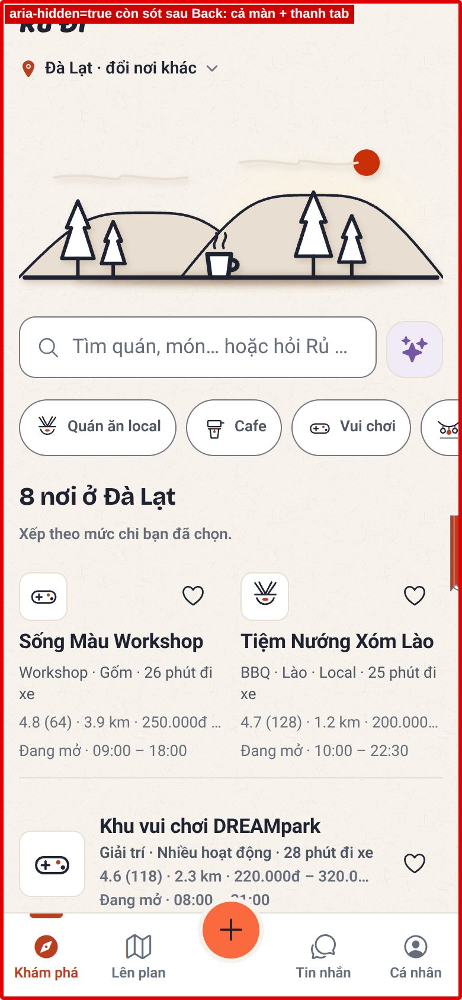 |
| Source | `src/rudi/ui/Sheet.tsx:75-121` (lưu `aria-hidden` cũ của các nhánh anh em, khôi phục khi cleanup) |
| Root cause (giả thuyết mạnh) | Khi mở `/create`, navigator đã đặt `aria-hidden="true"` cho màn bên dưới. `Sheet` ghi nhận giá trị ấy làm «giá trị cũ». Đóng bằng X: `Sheet` khôi phục trước, rồi route pop và navigator gỡ `aria-hidden`, nên sạch. Đóng bằng Back: route pop trước và navigator gỡ `aria-hidden`, rồi cleanup của `Sheet` chạy sau và **khôi phục lại** `"true"` đã lưu |
| Hậu quả | Với người dùng trình đọc màn hình trên web, sau một thao tác back phổ biến, toàn bộ màn và thanh tab câm |
| Đề xuất sửa | Khi cleanup, chỉ khôi phục thuộc tính nếu giá trị hiện tại vẫn là giá trị `Sheet` đã tự đặt; hoặc bỏ việc tự đặt `aria-hidden` cho nhánh đã được navigator ẩn |
| Tiêu chí gỡ | Mở khay rồi Back: 0 phần tử `inert`/`aria-hidden` phủ ≥25% màn; thêm test web cho đường Back |

### UI-002 · Người đã đăng nhập mở link lạ thì bị đưa về bìa Welcome, rồi bị đòi đăng nhập lại

| Trường | Nội dung |
|---|---|
| Category / Severity | UX ISSUE (điều hướng) · **P2** |
| Feature / Screen | F00 · `[...legacy]` → `/welcome` → `/login` |
| Nền tảng, cấu hình | web, C1. Native: route catch-all giống hệt, suy ra cùng hành vi (STATIC) |
| Điều kiện | Đăng nhập Minh Anh (cookie phiên còn hạn) |
| Tái hiện | 1. Mở một đường dẫn không tồn tại (ví dụ `/khong-co-trang-nay`). 2. Bấm «Rủ Đi thôi!» |
| Expected | Người đã có phiên được đưa về tab của mình (hoặc thấy trang «không tìm thấy» có lối về), không bị coi như khách |
| Actual | Bước 1 hiện bìa Welcome như khi chưa đăng nhập. Bước 2 dẫn tới màn Đăng nhập đòi nhập số điện thoại, dù phiên vẫn còn |
| Evidence | 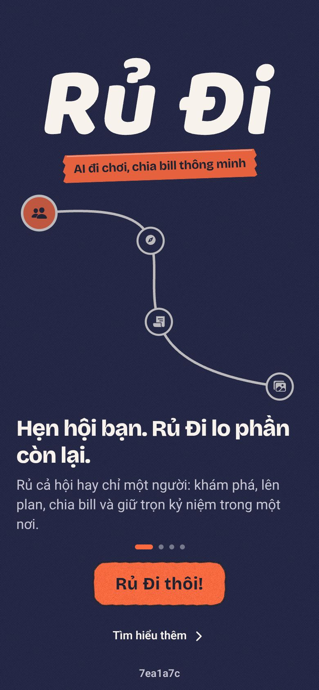 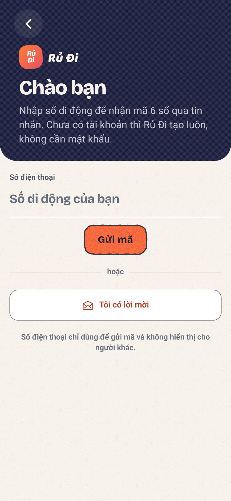 |
| Source | `app/[...legacy].tsx` (luôn `Redirect` `/welcome`), `src/rudi/screens/Welcome.tsx:109-116` (CTA luôn `push("/login")`) |
| Hậu quả | Một link cũ hay gõ nhầm làm người dùng tưởng đã bị đăng xuất; họ phải OTP lại (tốn lượt OTP) |
| Đề xuất | Catch-all đọc phiên như `/` (`duong-vao.ts`), hoặc Welcome/Login chuyển thẳng về tab khi đã có phiên |
| Tiêu chí gỡ | URL lạ khi có phiên thì dẫn về tab (hoặc trang lỗi có lối về); flow Maestro 00/91 vẫn xanh |

### UI-003 · Trên web, `accessibilityState` không tới DOM: thanh tab không báo tab đang chọn (và các chỗ chỉ dùng `accessibilityState`)

| Trường | Nội dung |
|---|---|
| Category / Severity | BUG (accessibility, web) · **P2** |
| Feature / Screen / Layer | F00 · mọi màn tab · L05 `RudiTabBar`; hệ thống |
| Nền tảng, cấu hình | web, C1, C2, C3, C6, C7. Native: `accessibilityState` là API chuẩn của RN nên không bị (STATIC) |
| Tái hiện | Mở bất kỳ tab nào, đọc thuộc tính ARIA của 4 phần tử `role="tab"` |
| Expected | Tab đang chọn có `aria-selected="true"`, và các tab nằm trong một `role="tablist"` |
| Actual | Cả 4 tab đều không có `aria-selected`, và không có `tablist`. Nhìn bằng mắt vẫn phân biệt được tab đang chọn (màu, icon đặc, dải washi), nhưng trình đọc màn hình thì không |
| Evidence | Số đo runtime ở 5 cấu hình: `chon: null` ở mọi tab. Mã `react-native-web` 0.21 (`dist/modules/createDOMProps`) nhận `aria-selected`/`accessibilitySelected` mà **không** đọc object `accessibilityState`. Quét tĩnh: 35 chỗ dùng `accessibilityState`, trong đó 20 chỗ không truyền kèm thuộc tính `aria-*` tương ứng (danh sách ở `report.md` §C). Đối chứng runtime cho thấy chỗ nào có truyền kèm `aria-*` thì đạt: chip gu ở Sở thích (`role=checkbox`, `aria-checked`) và thẻ mức chi (`role=radio`, `aria-checked`). Vì vậy mỗi dòng trong danh sách 20 cần xác nhận runtime. Đã xác nhận: thanh tab (F00); chip ngân sách ở form kèo mới, `role=radio` không có `aria-checked`, axe critical ×4 (F03, `CreateOutingLive.tsx:235`); nút «Các chặng trong ngày» của trang ngày không có `aria-expanded` (F03, `ManHinhHanhTrinh.tsx:175`); nút gập/mở dòng món của chia bill ở bước 2 và 3 không có `aria-expanded` (F04, `ChiaBillLive.tsx:467` và `:578`, hàng `TC-F04-ARIA-GAP`; bước 2 có đổi nhãn «Sửa/Gấp», bước 3 không); F05: lựa chọn của thẻ bình chọn, `role=radio` không có `aria-checked` kể cả lựa chọn của mình (`chat/TheAi.tsx:288–290`, `TC-F05-BINH-CHON-PHIEU`), và 5 ô «Màu bong bóng» của Cài đặt nhóm, `role=radio` không trạng thái dù mắt thấy dấu tích (`chat/CaiDatNhom.tsx:152–154`, `TC-L17-VONGDOI`). F07: sheet «Loại sổ» có hai `role=tab` («Hai người bạn», «Một đôi») mang `aria-selected` đúng nhưng không nằm trong `tablist` (axe `aria-required-parent` ×2, `TC-L23-SHEET-CON`); lá ngày của sheet sửa tờ có `aria-checked` (đạt). Cùng cơ chế với object `accessibilityValue`: tay nắm đổi thứ tự và mặt quay giờ thành `role=slider` không có `aria-valuenow` (UI-036, UI-042) F08: bốn thẻ «Ai đọc được?» của «Đăng bài» là `radio` không `aria-checked`, axe aria-required-attr ×4 (`nguoi/DangBaiScreen.tsx:169–170`, `TC-F08-DANG-BAI`); nút cảm xúc của bài dùng `accessibilityState={{ selected }}` không kèm `aria-*` (`tuong/BaiChiTietScreen.tsx:222`, STATIC, chưa đo trạng thái runtime) |
| Hậu quả | Trên web, người dùng trình đọc màn hình không biết tab nào, ngày nào, chip gu nào, màu nào đang được chọn, và mục nào đang mở/gập |
| Đề xuất | Truyền thêm prop `aria-*` mà RNW đọc được, đúng với role: `aria-checked` cho radio/checkbox/switch, `aria-expanded` cho nút gập mở, `aria-busy`, `aria-selected` **chỉ** cho tab/option/row. Sửa ở checkpoint 3: `HangChang` từng được nêu ở đây làm ví dụ đúng, nhưng nó đặt `aria-selected` trên `role=button`, là thuộc tính không hợp lệ (axe critical, UI-042); nút nên dùng `aria-pressed` hoặc `aria-current`. Gom lại trong một helper ở kit; thêm `role="tablist"` cho thanh tab |
| Tiêu chí gỡ | Quét DOM: mỗi control có trạng thái đều mang thuộc tính ARIA tương ứng; tab đang chọn có `aria-selected=true` |

### UI-004 · Rail (≥600dp, web): vạch chỉ báo tab đang chọn nằm lệch khỏi tab

| Trường | Nội dung |
|---|---|
| Category / Severity | BUG (layout/trạng thái hiển thị) · **P2** |
| Feature / Screen / Layer | F00 · mọi màn tab ở cửa sổ ≥600dp · L05 `RudiTabBar` (rail) |
| Nền tảng, cấu hình | web, biên 600, C6 768×1024, biên 839, biên 840, C7 1024×1366. Native: có thể không bị (Yoga tôn trọng `height: 72`), chưa đo (BLOCKED) |
| Tái hiện | Mở `/messages` hoặc `/profile` ở cửa sổ rộng ≥600dp |
| Expected | Vạch cam dọc nằm cạnh tab đang chọn |
| Actual | Mỗi ô rail chỉ cao 48dp nhưng vạch dịch 72dp/ô. Ở Tin nhắn: tab y156–204, vạch y216–288 (cạnh «Cá nhân»). Ở Cá nhân: tab y204–252, vạch y288–360 (dưới mọi tab). Chỉ Khám phá trùng một phần |
| Evidence | 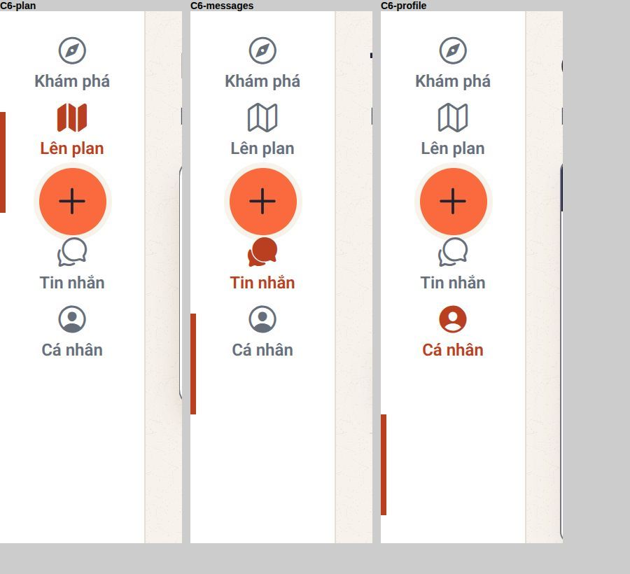 |
| Source | `src/rudi/ui/RudiTabBar.tsx:54-58` (dịch `column * 72`), `:164-165` (`railItem: { flex: 0, height: 72 }`) |
| Root cause | react-native-web biên dịch `flex: 0` thành `flex-basis: 0%`, nên trong cột flex `height: 72` bị bỏ và ô chỉ còn `minHeight: 48` |
| Hậu quả | Tín hiệu «đang ở đâu» nói sai, có lúc chỉ vào tab khác. Màu chữ vẫn đúng nên người dùng còn tự định hướng được |
| Đề xuất | Tính vị trí vạch từ layout đo được (`onLayout`) thay vì hằng 72, hoặc đặt `flexBasis: 72`/`minHeight: 72` cho ô rail |
| Tiêu chí gỡ | Ở mọi biên 600/768/839/840/1024 và cả 4 tab, tâm vạch nằm trong khoảng dọc của tab đang chọn |

### UI-006 · Chạm «+» hai lần nhanh thì chạm thứ hai kích hoạt một việc trong khay đang mở

| Trường | Nội dung |
|---|---|
| Category / Severity | BUG (interaction) · **P2** |
| Feature / Screen / Layer | F00 · tab bar → `/create` · L01 |
| Nền tảng, cấu hình | web, C1 (chạm cảm ứng giả lập). Native: bố cục giống nên có thể xảy ra, chưa đo |
| Tái hiện | Ở Khám phá, chạm «Tạo mới» hai lần cách nhau 60 ms |
| Expected | Mở đúng một khay; không có hành động nào khác |
| Actual | Chạm thứ hai rơi vào thẻ của khay đang trượt lên, nên app đi thẳng tới `/hai-nguoi/chon-nguoi` («Rủ một người đi chơi»). Với người có DM, thẻ này được xếp lên đầu |
| Evidence | Dòng thời gian URL từ 0 ms: `/hai-nguoi/chon-nguoi`, 0 dialog · 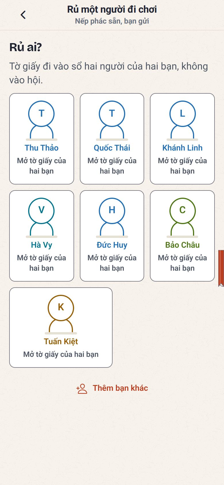 |
| Source | `src/rudi/screens/Create.tsx` (thẻ nhận chạm ngay khi mount), `ui/Sheet.tsx` |
| Hậu quả | Một cú chạm vội (hoặc chạm lại khi tưởng chưa ăn) mở nhầm một luồng |
| Đề xuất | Bỏ qua chạm vào nội dung khay trong pha mở (khoảng 250 ms), hoặc chỉ bật `pointerEvents` khi lò xo đã gần tới đích |
| Tiêu chí gỡ | Chạm đúp «+» cách 60 ms: đúng 1 dialog, URL vẫn `/create` |

### UI-011 · Nút «Vẽ» trong bảng Nếp không làm gì trên web

| Trường | Nội dung |
|---|---|
| Category / Severity | BUG (web) · **P2** |
| Feature / Screen / Layer | F00 · bảng Nếp (`src/rudi/nep/NepBang.tsx`) · L03 |
| Nền tảng, cấu hình | web, C1. Native: `Alert.alert` hiện hộp thoại hệ thống (STATIC) |
| Tái hiện | Mở bảng Nếp (chạm mép phải, chạm Nếp), gõ «một con mèo đội nón lá», bấm «Vẽ» |
| Expected | Hỏi xác nhận «Nhờ Nếp vẽ?» rồi vẽ, hoặc nói vì sao chưa vẽ được (ví dụ chưa cấu hình AI) |
| Actual | Không có gì: 0 dialog mới, 0 alert trình duyệt, 0 request, không dòng trạng thái |
| Evidence | 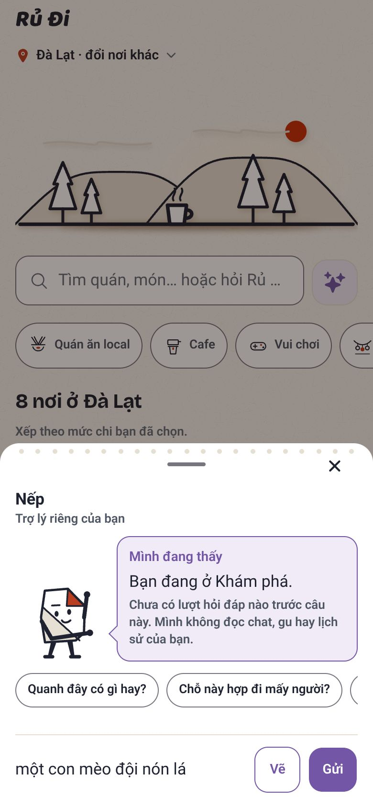 |
| Source | `src/rudi/nep/NepBang.tsx` (`Alert.alert("Nhờ Nếp vẽ?", …)`); `react-native-web/dist/exports/Alert/index.js`: `static alert() {}` |
| Hậu quả | Tính năng vẽ chết hẳn trên web, không một lời báo. Ngoài ra DESIGN.md cấm hộp thoại hệ thống |
| Đề xuất | Xác nhận bằng một dòng hoặc sheet trong bảng (đúng tinh thần DESIGN), không dùng `Alert` |
| Tiêu chí gỡ | Web: bấm «Vẽ» luôn cho một phản hồi nhìn thấy được |

### UI-007 · Khay tạo cao vượt trần 82% ở cửa sổ nhỏ và thấp

| Trường | Nội dung |
|---|---|
| Category / Severity | UX ISSUE (lệch spec) · **P3** |
| Feature / Screen / Layer | F00 · `/create` · L01; `ui/Sheet.tsx` (dùng chung) |
| Nền tảng, cấu hình | web, C2 320×640: 589/640 = 92%; C8 390×460: 441/460 = 96% (chỉ còn 19px nền để chạm ra ngoài). C1 75%, C3 80%: đạt |
| Expected | DESIGN.md: sheet cao tối đa 82% màn |
| Actual | `ScrollView` bên trong được giới hạn 82%, nhưng panel còn cộng hàng tay cầm 48dp + margin + padding đáy, nên tổng vượt trần |
| Evidence | 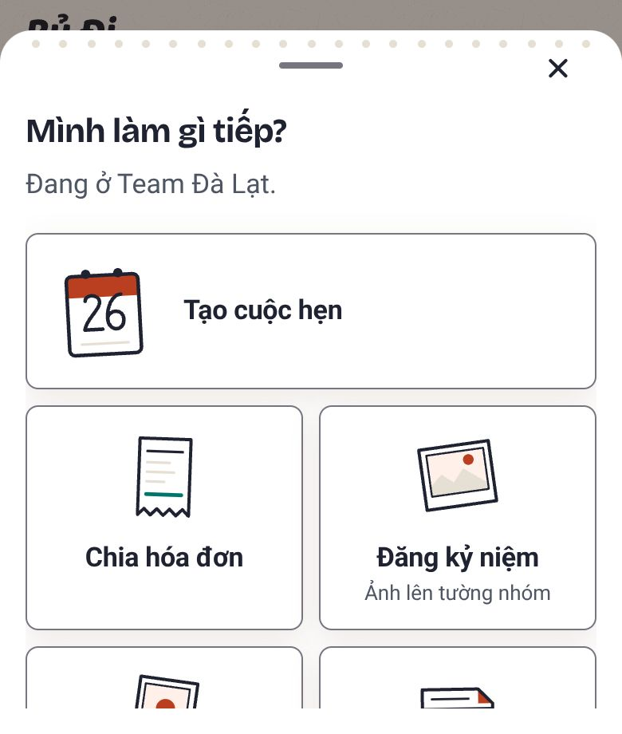 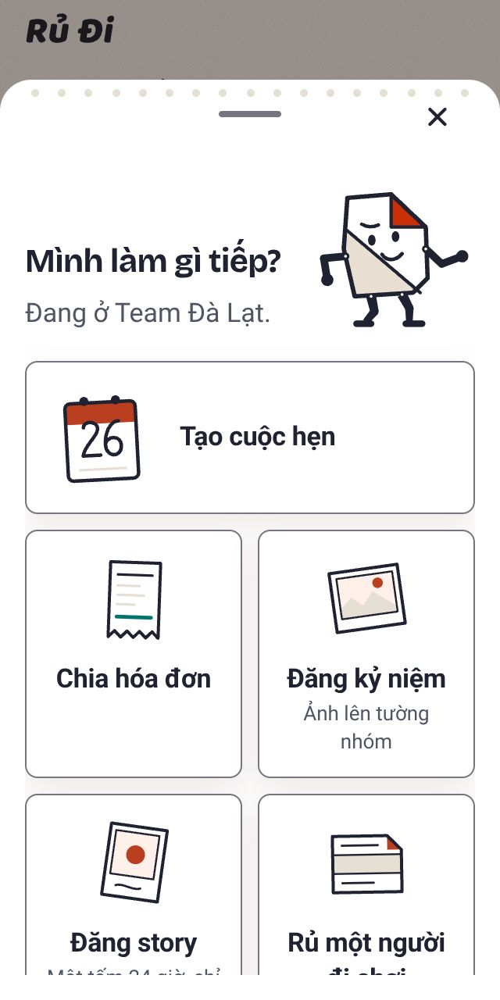 |
| Source | `src/rudi/ui/Sheet.tsx:53` (`tran = 0.82 × cao cửa sổ` cho ScrollView), `:207-217` |
| Hậu quả | Ở cửa sổ thấp (split-screen, hoặc khi bàn phím thu nhỏ cửa sổ) gần như không còn nền để chạm ra ngoài; mất ngữ cảnh màn dưới |
| Đề xuất | Trừ phần đầu panel khỏi `tran` (giới hạn cả panel, không chỉ vùng cuộn) |
| Tiêu chí gỡ | Chiều cao panel ≤82% ở C2 và C8 |

### UI-013 · Sheet dùng chung: cuối pha đóng, panel còn lộ rồi biến mất đột ngột

| Trường | Nội dung |
|---|---|
| Category / Severity | BUG (motion) · **P3** |
| Feature / Screen / Layer | F00 · mọi sheet cao hơn 480dp · `ui/Sheet.tsx` |
| Nền tảng, cấu hình | web, C1 (khay tạo cao 637). C9 (giảm chuyển động): khay tạo cắt thẳng; nhưng F07 cho thấy C9 cũng lộ khi sheet cao và luồng chính bận (xem Actual) |
| Tái hiện | Mở khay tạo, bấm X, quay khung hình |
| Expected | Panel trượt khỏi mép dưới rồi mới gỡ |
| Actual | Panel dịch cố định 480dp: khung cuối trước khi gỡ, panel ở y=667, còn lộ 177px, độ mờ 1. Khung sau thì biến mất (bật mất). Khi mở, khung đầu cũng đã lộ 157px đỉnh panel. F07, C9: sheet «Lập sổ hai người» (đỉnh 133) sau «Đồng ý» nhảy thẳng tới y=613 (133 + 480), còn lộ 231px, và đứng đó tới khi gỡ, ở mẫu rAF 162 → 568 ms sau chạm, lúc M6 dựng (luồng chính bận nên thời lượng không đại diện; trình tự thì có). Sheet thấp hơn («Cài đặt sổ», đỉnh 405: 405 + 480 > 844) cắt sạch ở C9 (`TC-MO04-C9-SO`) |
| Evidence | 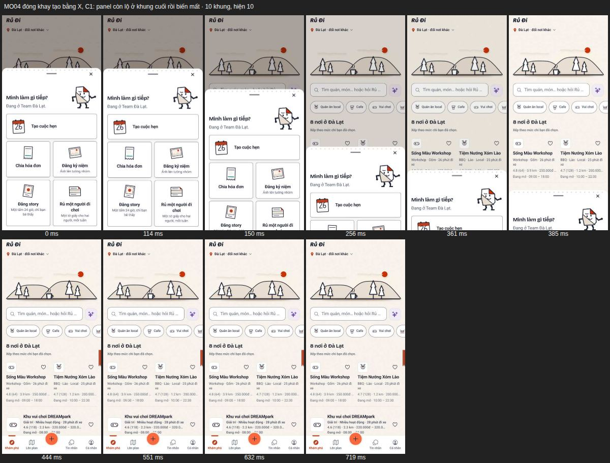 · lấy mẫu mỗi rAF: `y 565 → 632 → 667 → (mất)` · F07: 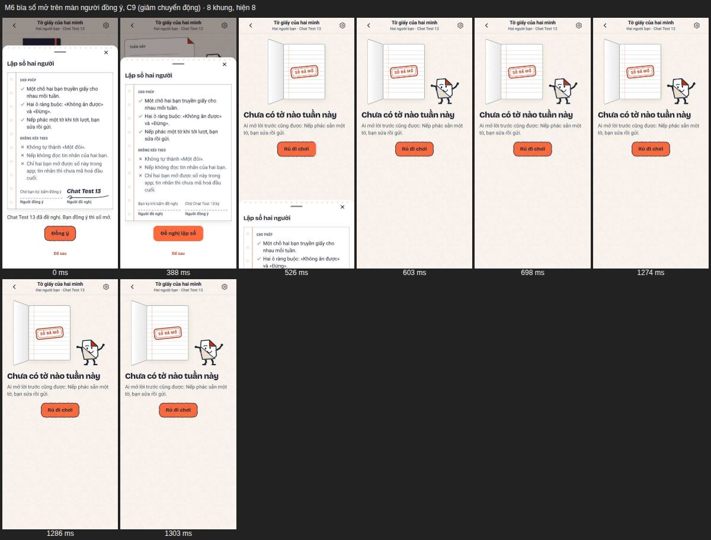 (hàng `TC-F07-DONG-Y-NHAY-C9`: đỉnh sheet `93 → 133 → 613`) |
| Source | `src/rudi/ui/Sheet.tsx:167-170` (`translateY: (1 - progress) * 480 + keo`) |
| Hậu quả | Cú bật mất nhìn thấy được mỗi lần đóng sheet cao; trông như giật |
| Đề xuất | Dịch theo chiều cao đo được của panel (hoặc theo chiều cao cửa sổ), hoặc mờ panel ở phần cuối pha đóng |
| Tiêu chí gỡ | Khung cuối trước khi gỡ: đỉnh panel ≥ chiều cao cửa sổ, hoặc độ mờ ≈0 |

### UI-008 · Trong khay tạo, điểm dừng phím Tab đầu tiên là khối Nếp không tên

| Trường | Nội dung |
|---|---|
| Category / Severity | UX ISSUE (accessibility, web) · **P3** |
| Feature / Screen / Layer | F00 · `/create` · L01 + L04 (`ui/NepDien.tsx`) |
| Nền tảng, cấu hình | web, C1 (bàn phím) |
| Tái hiện | Mở khay, nhấn Tab |
| Expected | Mọi điểm dừng focus có tên và vai trò |
| Actual | Điểm dừng đầu: `div` 112×112, `tabindex=0`, không role, không tên (Nếp M1). Sau đó mới đến 5 thẻ và «Đóng bảng». Focus ban đầu khi mở vào «Đóng bảng», và vòng Tab giữ trong khay: đạt |
| Evidence | danh sách phần tử nhận focus (runtime) trong `report.md` §C; 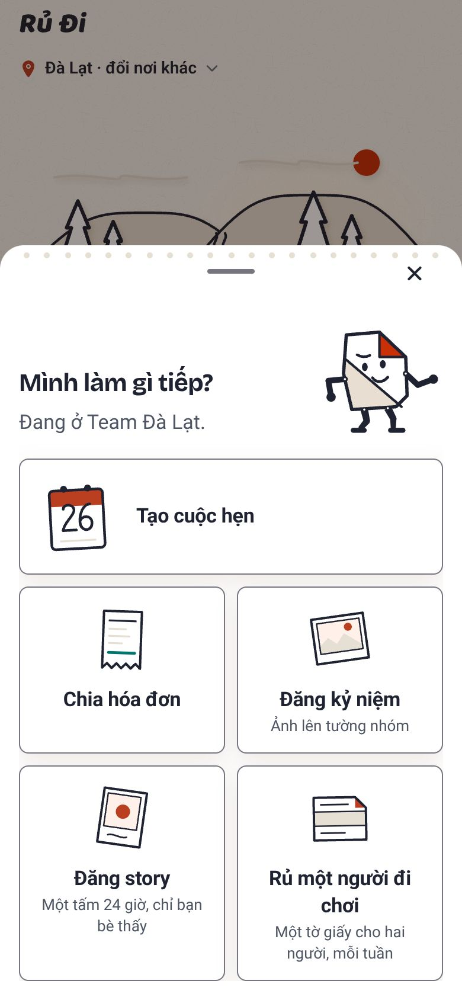 · F08: Nếp M8 ở «Thành tích» cũng là `div` 112×112 `tabindex=0` không tên (baseline `TC-F08.S09-BASE`, `ky-niem/AchievementsLive.tsx:152`) |
| Source | `src/rudi/ui/NepDien.tsx:52` (`Pressable accessible={false}` vẫn nhận `tabindex=0` trên web) |
| Đề xuất | `focusable={false}` (hoặc `tabIndex={-1}`) trên web khi không có việc để bấm |
| Tiêu chí gỡ | Không điểm dừng Tab nào không có tên |

### UI-009 · Khôi phục phiên chậm thì vùng nội dung trống, không có chỉ báo tải

| Trường | Nội dung |
|---|---|
| Category / Severity | UX ISSUE · **P3** |
| Feature / Screen / Layer | F00 · mọi route bọc `phienDaDoc` (tab, chat, tiền) · L35 |
| Nền tảng, cấu hình | web, C1, `/sessions/web/resume` bị làm trễ 5 s bằng chặn mạng (giả lập mạng chậm) |
| Tái hiện | Mở lạnh `/plan` khi có cookie phiên, mạng chậm |
| Expected | Có khung xương hoặc chỉ báo đang tải |
| Actual | Suốt thời gian chờ: nền trống, chỉ có thanh tab và mép Nếp; 0 progressbar. Các tab khác cũng trống |
| Evidence | 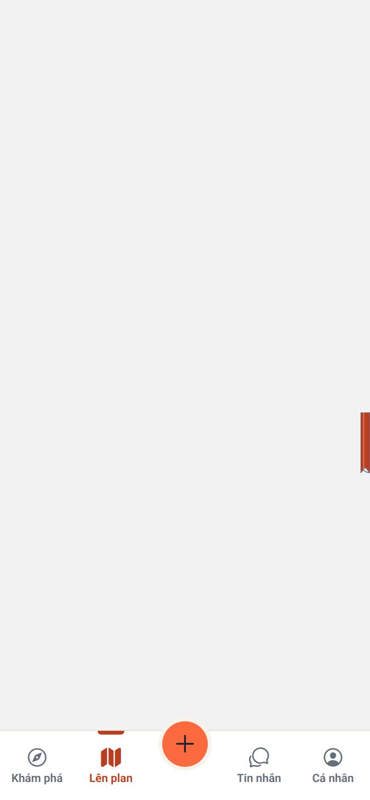 |
| Source | `app/(tabs)/plan.tsx` và các route khác: `if (!phienDaDoc) return null;` |
| Đề xuất | Hiện skeleton của màn (kit `Skeleton`) thay cho `null` |
| Tiêu chí gỡ | Trễ resume 5 s: có progressbar hoặc skeleton trong ≤300 ms |

### UI-010 · Link tới `/create` mở lạnh trên web không mở khay

| Trường | Nội dung |
|---|---|
| Category / Severity | BUG (web) · **P3** |
| Feature / Screen / Layer | F00 · `app/create.tsx` · L01 |
| Nền tảng, cấu hình | web, C1, có và không có phiên. Native: chưa đo (BLOCKED) |
| Tái hiện | Mở thẳng URL `/create` |
| Expected | Theo chú thích trong mã: đặt Khám phá bên dưới rồi mở lại khay trên đó |
| Actual | Chỉ `replaceState /explore` được ghi vào history; không có push `/create`; 0 dialog trong 3 s |
| Evidence |  |
| Source | `app/create.tsx:19-24` |
| Root cause (giả thuyết) | `router.replace` làm route unmount ngay trên web; cleanup `clearTimeout(t)` huỷ cú push hẹn 0 ms |
| Đề xuất | Push trong callback sau khi replace xong (ví dụ trên màn đích), hoặc không huỷ timer khi unmount do chính replace |
| Tiêu chí gỡ | Mở lạnh `/create`: có 1 dialog trên Khám phá |

### UI-012 · Chip gợi ý trong bảng Nếp chỉ cao 36dp

| Trường | Nội dung |
|---|---|
| Category / Severity | UX ISSUE (vùng bấm) · **P3** |
| Feature / Screen / Layer | F00 · bảng Nếp · L03 |
| Nền tảng, cấu hình | web, C1 |
| Expected | DESIGN.md: chip 48dp, mọi đích bấm ≥48×48dp |
| Actual | 3 chip («Quanh đây có gì hay?», …) cao 36dp, rộng 150–184dp |
| Evidence | 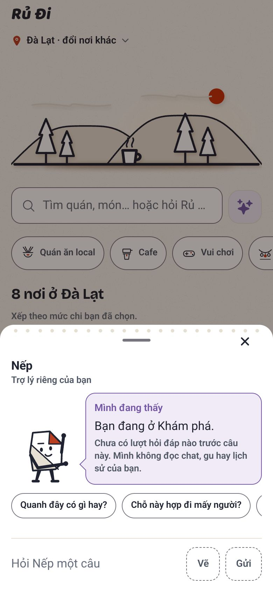 |
| Source | `src/rudi/nep/NepBang.tsx` (style `goiY`) |
| Đề xuất | `minHeight: 48` cho chip gợi ý (dùng `Chip` của kit) |
| Tiêu chí gỡ | Chip ≥48dp |

### UI-014 · Ở màn hẹp, mép Nếp đè lên chữ của hàng chip tràn mép

| Trường | Nội dung |
|---|---|
| Category / Severity | VISUAL POLISH (lệch luật ADR-0035 «không che chữ») · **P3** |
| Feature / Screen / Layer | F00 · Khám phá · L02 |
| Nền tảng, cấu hình | web, C2 320×640 (ở C1 và C3 mép rơi vào vùng thẻ, không đè chữ) |
| Actual | Mép Nếp x310–320 nằm trên chữ chip «Vui chơi». Hàng chip cuộn ngang nên chữ vốn đã bị mép màn cắt; ảnh hưởng thực tế nhỏ |
| Evidence | 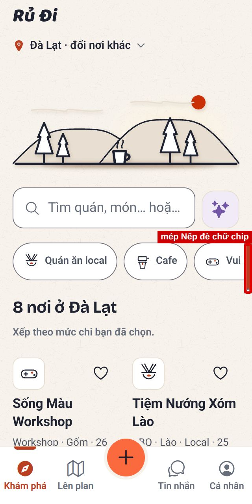 |
| Source | `src/rudi/nep/dock-vi-tri.ts` (`yTuTyLe`: vị trí dọc theo tỷ lệ chiều cao) |
| Đề xuất | Tránh dải y của hàng cuộn ngang tràn mép, hoặc để hàng chip chừa lề phải 16dp |
| Tiêu chí gỡ | `nep.chuBiChe` rỗng ở C2 trên Khám phá |

## F01 Vào cửa

### UI-001 · Ô nhập một dòng `ONhapMuc` cao 44dp, dưới ngưỡng 48dp của DESIGN.md

| Trường | Nội dung |
|---|---|
| Category / Severity | UX ISSUE (vùng bấm, lệch spec hệ thống) · **P3** |
| Feature / Screen / Layer | F01 và mọi màn dùng `ONhapMuc` một dòng · Login (ô số điện thoại), Lời mời (ô mã). Thêm F03, F04, F05, F06, F07, F08 (xem Actual) |
| Nền tảng, cấu hình | web, C1, C2, C3 (đo runtime). Native: cùng `minHeight: 44` (STATIC) |
| Expected | DESIGN.md §Mục tiêu chạm: «Mọi node bấm được ≥48×48dp, kể cả `TextInput`» |
| Actual | Ô số điện thoại 358×44; ô mã lời mời 196×44. F03 (form kèo mới): «Ô tên kèo» và «Ô ngân sách một người» 324×44, «Ô số người» 64×44; nút «Bớt/Thêm một người» 44×44 (có `hitSlop` 4, nhưng react-native-web không áp `hitSlop`); ô ngày của lá lịch 44×44. F04 (chia bill): 9 ô nhập của một bill 3 món cao 44 (tên 326×44, số phần 110×44, tiền 204×44) và «Ô tên khoản chi» 358×44 (`TC-F04-VUNG-BAM`). F05 (chat): 6 nút cảm xúc của menu tin 44×44 (`chat/MenuTin.tsx:97`, `TC-F05-MENU-PHAN-UNG`); bong bóng một dòng cao 46, và bong bóng là chỗ duy nhất mở menu tin (`TC-F05-BO-CUC-TIN` G20). F06 (`TC-F06-VUNG-BAM`): «Ô tên nhóm» 230×44 và ghi chú-link «Chỉ hai người?… Thêm bạn» 358×40 (dưới cả ngưỡng 44) ở Lập nhóm; hai ô của Mời 300×44; ô số của Thêm bạn 324×44; mỗi hàng «Xem hồ sơ …» ở Bạn bè 236×44. F07 (`TC-F07-SUA-NHAP`): sheet sửa tờ có ba ô một dòng cao 44 («Chỗ chính», «Giờ đi tiếp», «Đi tiếp (tuỳ chọn)»); ô «Không ăn được» của Hai ô ràng buộc cao 48 (đạt) F08: 6 nút cảm xúc của bài 38×32 (`tuong/BaiChiTietScreen.tsx:325`, `TC-F08-CAM-XUC-BAI`); trình xem story: «Đóng story», «Xoá story» 44×44, «Giữ lại» và «Xoá» 88×44 (`story/XemStoryScreen.tsx:279`, `:288`; `TC-F08-STORY-VUNG-CHAM`, `TC-L26-XOA`); thùng rác của bình luận bài 18×20 (UI-096); F09: công tắc «Tìm theo số điện thoại» chỉ 40×20, dưới cả ngưỡng 24 (`CaiDatScreen.tsx:166`, RN `Switch` trên web; baseline `TC-F09.S02-BASE`, `TC-F09-TIM-THEO-SO`) |
| Evidence | 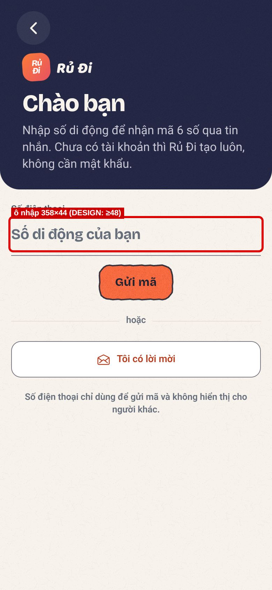 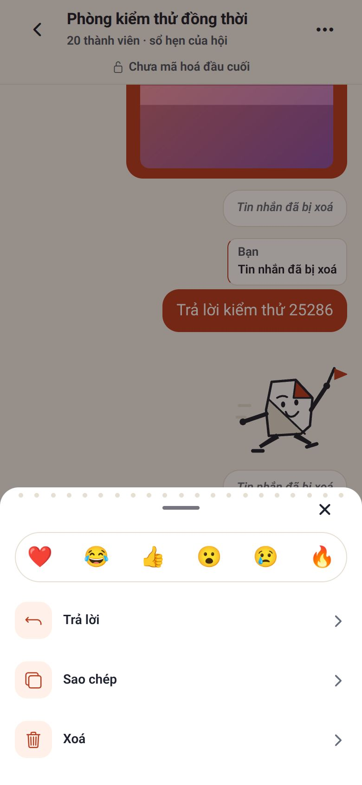 |
| Source | `src/rudi/ui/ONhapMuc.tsx:60` (`minHeight: 44`) |
| Đề xuất | `minHeight: 48` (vẫn không hộp, dòng kẻ giữ nguyên) |
| Tiêu chí gỡ | Mọi `input` một dòng ≥48dp cao |

### UI-016 · Welcome trên web: chấm trang và mốc trên đường đứng yên ở trang 1 khi vuốt

| Trường | Nội dung |
|---|---|
| Category / Severity | BUG (web) · **P2** |
| Feature / Screen / Layer | F01 · `/welcome` · L30 pager (`src/rudi/screens/Welcome.tsx`) |
| Nền tảng, cấu hình | web, C1. Native: `onMomentumScrollEnd` có phát, nên suy ra không bị (STATIC) |
| Tái hiện | Mở `/welcome`, vuốt trái trên đoạn chữ |
| Expected | Chấm trang, mốc sáng trên đường vẽ, và nhãn truy cập «Trang x trên 4» theo trang đang hiện |
| Actual | Nội dung sang trang 3 («Chia bill từng đồng») nhưng chấm và mốc vẫn ở trang 1; `aria-label` luôn «Trang 1 trên 4». Hệ quả: «Tìm hiểu thêm» ở trang cuối đưa sang trang 2 thay vì trang 1 |
| Evidence | 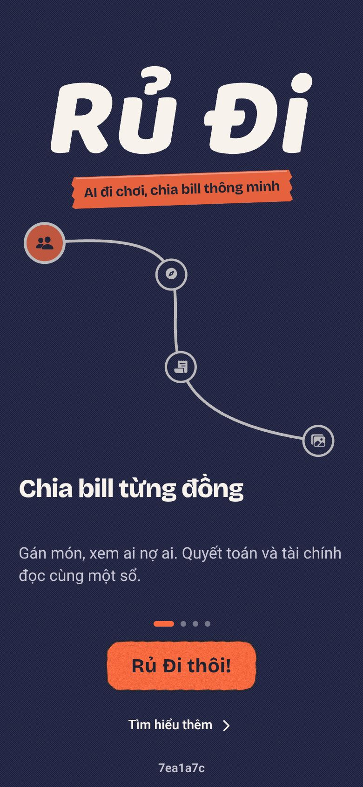 · `scrollLeft` 0 → 780 → 1170, nhãn không đổi |
| Source | `Welcome.tsx:186-192` (`onMomentumScrollEnd={onScroll}` là nơi duy nhất cập nhật `page`); `react-native-web/dist/exports/ScrollView/ScrollViewBase.js` không phát sự kiện momentum nào |
| Hậu quả | Màn đầu tiên của bản web nói sai vị trí; người dùng trình đọc màn hình nghe «Trang 1» ở mọi trang |
| Đề xuất | Cập nhật `page` trong `onScroll` (có `scrollEventThrottle`) theo `Math.round(x / pageWidth)` |
| Tiêu chí gỡ | Sau mỗi lần vuốt, chấm, mốc và nhãn khớp `scrollLeft / pageWidth` |

### UI-019 · Mã lời mời sai được báo thành «Cập nhật app rồi thử lại»

| Trường | Nội dung |
|---|---|
| Category / Severity | UX ISSUE (thông điệp lỗi sai chuyện) · **P2** |
| Feature / Screen | F01 · `/moi` (`screens/LoiMoi.tsx`), `src/api.ts` `thongDiepNguoiDoc` |
| Nền tảng, cấu hình | web, C1. Native: cùng hàm dịch lỗi (STATIC) |
| Tái hiện | Mở `/moi`, dán `khong-phai-ma-that`, bấm «Nhận lời mời» |
| Expected | Câu nói đúng chuyện: mã không đúng hoặc đã hết hạn, hỏi lại người mời |
| Actual | «Phần này chưa mở được trên bản app này. Cập nhật app rồi thử lại.» Máy chủ trả `404 {"code":"invite_not_found","detail":"Invite link is not valid"}` |
| Evidence | 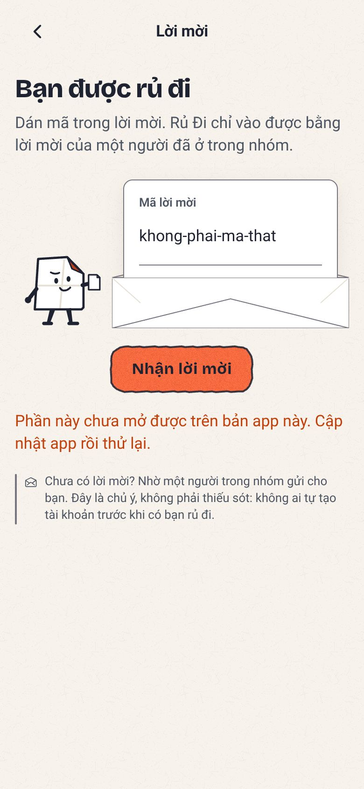 |
| Source | `src/api.ts:300-313`: `detail` chỉ được dùng khi là tiếng Việt; 404 luôn được coi là «app và máy chủ lệch phiên bản»; `code` bị bỏ qua |
| Hậu quả | Người gõ nhầm hoặc cầm link hết hạn đi cập nhật app vô ích. Có thể lặp ở mọi 404 «không tìm thấy» thật (HYPOTHESIS, sẽ ghi khi gặp) |
| Đề xuất | Dịch theo `code` (`invite_not_found` → «Mã lời mời không đúng hoặc đã hết hạn…»); chỉ dùng câu «cập nhật app» cho 404 không kèm code |
| Tiêu chí gỡ | Mã sai hiện câu về mã, không nhắc cập nhật app |

### UI-017 · Welcome trên web: vuốt nhanh nhảy qua một trang

| Trường | Nội dung |
|---|---|
| Category / Severity | UX ISSUE (web) · **P3** |
| Feature / Screen / Layer | F01 · `/welcome` · L30 |
| Nền tảng, cấu hình | web, C1 (cảm ứng giả lập, timestamp đúng) |
| Actual | Vuốt 250dp trong 900 ms hoặc 200dp trong 500 ms: sang 1 trang. Vuốt 280dp trong 260 ms (khoảng 1077 px/s): nhảy 2 trang, bỏ qua trang 2 |
| Source | `pagingEnabled` trên web thành `scroll-snap-type: x mandatory` với `scroll-snap-stop: normal` |
| Đề xuất | `scroll-snap-stop: always` cho từng trang trên web (hoặc tự dừng ở trang kế trong `onScroll`) |
| Tiêu chí gỡ | Vuốt nhanh cũng chỉ sang một trang |

### UI-018 · Nút «Quay lại» không làm gì khi màn được mở thẳng bằng link

| Trường | Nội dung |
|---|---|
| Category / Severity | UX ISSUE (điều hướng) · **P2**. Checkpoint 2 ghi P3; nâng ở checkpoint 3 vì phạm vi không còn là một màn: đo lại ở `/places/[id]`, và nút back của `TopBar` trong kit cũng gọi `router.back()` không kiểm `canGoBack()` |
| Feature / Screen | F01 · `/login` (`ui/CoverBand.tsx`: `onBack === true ? router.back()`). F02 · `/places/[id]` (`TopBar`, `src/rudi/ui.tsx:235`). F03 · `/outings/[id]` (đo: URL giữ nguyên sau khi chạm), `/outings/chon`, và ErrorState «Về Lên plan» của màn kèo cũng là `router.back()`. F04 · đo cả bốn màn tiền mở lạnh: `/smart-split/[id]/review`, `/settlements/[id]`, `/batches/[id]`, `/finance` đều đứng yên sau khi chạm (`TC-F04.S0x-BACK-LANH`); ba màn sau không có thanh tab. F05 · `/groups/[id]/chat` mở lạnh: chạm «Quay lại» của đầu chat, URL giữ nguyên (`TC-F05.S02-BACK-LANH`); màn chat không có thanh tab. F06 · năm màn mở lạnh đều đứng yên: `/groups/[id]/members`, `/groups/[id]/invite`, `/friends`, `/friends/add`, `/people/[id]` (`TC-F06.S0x-BACK-LANH`). Cùng cơ chế: «Về danh sách bạn» và «Xem thành viên» (`router.back()`) không làm gì khi màn trước không nằm trong stack. F07 · `/groups/[id]/to-giay` mở lạnh: chạm «Quay lại», URL giữ nguyên (`TC-F07.S02-BACK-LANH`); màn không có thanh tab. 37 file màn dùng `TopBar` với `back` mặc định; các màn còn lại đo ở feature của chúng F08 · tám màn mở lạnh đều đứng yên sau khi chạm «Quay lại»: `/groups/[id]/wall`, `/groups/[id]/album`, `/trips/[id]/album`, `/moments/new`, `/stories/new`, `/posts/new`, `/posts/[id]`, `/achievements` (`TC-F08-BACK-LANH-*`); «Đóng story» của `/stories/[id]` mở lạnh cũng vậy (`TC-F08-STORY-DONG-LANH`), còn mở từ dải story thì «Đóng story» và Back đều về Tin nhắn (`TC-L26-VONGDOI`) F09 · năm màn Cài đặt mở lạnh đều đứng yên sau khi chạm «Quay lại»: `/settings`, `/settings/phien`, `/settings/da-chan`, `/settings/ve-rudi`, `/settings/xoa-tai-khoan`; ở màn cuối «Ở lại» (cũng là `router.back()`) cũng đứng yên (`TC-F09-BACK-LANH-*`) |
| Nền tảng, cấu hình | web, C1 |
| Tái hiện | Mở thẳng `/login` (không có lịch sử), chạm «Quay lại» |
| Expected | Đưa về màn hợp lý (Welcome), hoặc không vẽ nút khi không có nơi để về |
| Actual | Đứng yên ở `/login`, không phản hồi |
| Evidence |  · F02: mở thẳng `/places/p-tiem-nuong-xom-lao`, chạm «Quay lại», URL vẫn là `/places/p-tiem-nuong-xom-lao` sau 900 ms (`TC-F02-CHI-TIET-BACK-LANH`). Màn chi tiết không có thanh tab, nên trong app không còn lối ra |
| Source | `src/rudi/ui/CoverBand.tsx:45`; `src/rudi/ui.tsx:235` (`TopBar`); chỉ `app/create.tsx` kiểm `canGoBack()` |
| Đề xuất | `router.canGoBack() ? router.back() : router.replace(<màn cha>)` trong nút back của kit |
| Tiêu chí gỡ | Mở lạnh rồi chạm «Quay lại» luôn đi tới một màn |

### UI-020 · Welcome: cụm chấm trang không đọc được, pager không nhận focus bàn phím

| Trường | Nội dung |
|---|---|
| Category / Severity | UX ISSUE (accessibility, web) · **P3** |
| Feature / Screen / Layer | F01 · `/welcome` · L30 |
| Nền tảng, cấu hình | web, C1 và C3 (axe WCAG 2 A/AA) |
| Actual | axe: `aria-prohibited-attr` (cụm chấm mang `aria-label` trên `div` không có role, nên không được đọc); `scrollable-region-focusable` (vùng pager cuộn ngang không nhận focus: người dùng bàn phím chỉ xem trang 2–4 được qua «Tìm hiểu thêm») |
| Source | `Welcome.tsx:201` (`View` chấm có `accessibilityLabel`, không role); `ScrollView` pager |
| Đề xuất | Đặt role cho cụm chấm (`progressbar` hoặc `text` có `aria-live`), hoặc gắn nhãn vào pager; `tabIndex=0` cho vùng cuộn trên web |
| Tiêu chí gỡ | axe 0 vi phạm trên `/welcome` |

## F02 Khám phá

### UI-021 · Hàng địa điểm: dòng giá bị cắt, mất giá trên và «mỗi người»

| Trường | Nội dung |
|---|---|
| Category / Severity | UX ISSUE (mất nội dung) · **P2** |
| Feature / Screen / Layer | F02 · `/explore` · hàng `HangDiaDiem` và cặp so sánh đầu danh sách |
| Nền tảng, cấu hình | web, C1–C6 (đo DOM); C7 đạt. Native: cùng component, `numberOfLines={1}` cũng cắt (STATIC) |
| Điều kiện ban đầu | Minh Anh, Đà Lạt, 10 nơi đều có giờ mở cửa |
| Tái hiện | Mở Khám phá, đọc dòng «điểm · km · giá» của mỗi hàng |
| Expected | Khoảng giá đọc trọn, ví dụ «200.000đ – 250.000đ mỗi người». Chính mã ghi dải giá có dòng riêng để không bị cắt (QA 23/09) |
| Actual | Dòng bị ellipsis, người xem chỉ thấy «4.8 (64) · 3.9 km · 250.000đ …». Số dòng chứa giá bị cắt: C1 9/10 (thiếu 35–127px) · C2 10/10 (68–162px) · C3 10/10 (28–142px) · C4 10/10 (13–134px) · C5 8/10 (22–107px) · C6 8/10 (48–119px) · C7 0/10 |
| Evidence | 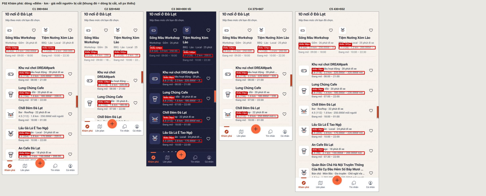 Số đo: `scrollWidth − clientWidth` của phần tử một dòng, `kich-ban/f02-kham-pha.mjs --chi cat-chu`, hàng `TC-F02-META` |
| Source | `src/rudi/kham-pha/dia-diem.ts:541-565` (`chiTietNgan` trả [điểm, km, giá, giờ mở]); `src/rudi/screens/explore/HangDiaDiem.tsx:206-207`, `:236-242`, `:313-321` (coi phần tử **cuối** là dải giá, cho nó dòng riêng; phần còn lại ghép thành một dòng `numberOfLines={1}`) |
| Root cause | Quán có giờ mở thì giá không còn là phần tử cuối. Giá rơi vào dòng ghép một dòng; dòng riêng lại thuộc về giờ mở cửa. Bản sửa QA 23/09 mất tác dụng với mọi quán có giờ mở |
| Hậu quả | Giá, thông tin chọn quán quan trọng nhất, bị ẩn ở mọi điện thoại |
| Đề xuất sửa | Tìm dải giá theo loại (icon `wallet-outline`), không theo vị trí; hoặc cho giá một dòng riêng, giờ mở một dòng khác |
| Tiêu chí gỡ | 0/10 dòng chứa giá bị cắt ở C1–C6, đo lại bằng `cat-chu` |

### UI-022 · «Chỉ đường» trên web không làm gì và không báo gì

| Trường | Nội dung |
|---|---|
| Category / Severity | BUG · **P2** |
| Feature / Screen / Layer | F02 · `/places/[id]` · L33 link ngoài |
| Nền tảng, cấu hình | web, C1 (Chromium 141, Linux) |
| Tái hiện | Mở chi tiết Tiệm Nướng Xóm Lào. Chạm «Chỉ đường», hoặc chạm dòng địa chỉ («Mở địa chỉ trên bản đồ») |
| Expected | Mở bản đồ ở tab mới, hoặc một câu nói vì sao không mở được |
| Actual | Một lời gọi `window.open("geo:11.9404,108.4383?q=…", "_blank", "noopener")`, trả `null`. Không có trang mới trong 3 giây, URL không đổi, không có câu nào hiện. Nhánh `catch` («Máy này chưa có ứng dụng bản đồ để chỉ đường.») không bao giờ chạy trên web, vì `Linking.openURL` của react-native-web không ném |
| Evidence | Số đo runtime: bọc `window.open` rồi lắng nghe trang mới, ở hàng `TC-F02-CHI-TIET-CHI-DUONG` và `TC-L33-VONGDOI`. Ảnh sau khi chạm trông y như trước khi chạm, nên không commit |
| Source | `src/rudi/kham-pha/dia-diem.ts:582` (URL `geo:`); `src/rudi/screens/explore/PlaceDetailLive.tsx:154-160`, `:314`, `:321` (cả hai lối cùng gọi `chiDuong`) |
| Hậu quả | Trên web, và trên trình duyệt không có ứng dụng nhận `geo:`, cả hai lối chỉ đường là nút chết |
| iOS | UNVERIFIED HYPOTHESIS: iOS không có scheme `geo:`, nên `Linking.openURL` sẽ từ chối, và máy luôn nói «chưa có ứng dụng bản đồ» dù có Apple Maps. Chưa chạy được vì không có macOS |
| Đề xuất sửa | Chọn URL theo nền tảng (`Platform.select`): web dùng URL https của một dịch vụ bản đồ, iOS dùng `maps:` hoặc `https://maps.apple.com/?ll=`, Android giữ `geo:`. Kiểm `Linking.canOpenURL` trước khi mở |
| Tiêu chí gỡ | Web: chạm «Chỉ đường» mở trang mới hoặc hiện câu. iOS: đo trên máy |

### UI-023 · Nhãn «Lưu địa điểm» ở chân trang chi tiết bị cắt trên điện thoại

| Trường | Nội dung |
|---|---|
| Category / Severity | UX ISSUE (layout, mất nội dung) · **P2** |
| Feature / Screen | F02 · `/places/[id]` · chân trang hai nút |
| Nền tảng, cấu hình | web. Bị cắt: C1 (thiếu 5px), C2 (34px), C3 (17px), C4 (11px). Đọc trọn: C5, C6, C7 |
| Tái hiện | Mở chi tiết bất kỳ quán nào, nhìn chân trang |
| Expected | Nhãn nút đọc trọn |
| Actual | «Lưu địa đi…» ở 390, «Lưu đ…» ở 320. Ở 320 không còn đoán được nút làm gì nếu không nhìn icon |
| Evidence | 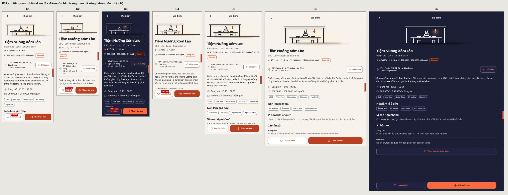 (hàng `TC-F02-NHAN-LUU`) |
| Source | `PlaceDetailLive.tsx:166-183` và `:483-497`: nút trái `flex: 1`, nút phải `flex: 1.4`, chia theo tỉ lệ chứ không theo nhãn; nhãn `RudiButton` kẹp một dòng (`src/rudi/ui.tsx:509`) |
| Hậu quả | Mất chữ trên một hành động chính của màn, ở mọi điện thoại dưới 430dp |
| Đề xuất sửa | Để nhãn quyết định bề rộng nút trái; hoặc rút nhãn thành «Lưu»; hoặc xếp dọc hai nút dưới khoảng 400dp |
| Tiêu chí gỡ | Nhãn đọc trọn ở C2 |

### UI-024 · Nút ✦ «Hỏi Rủ Đi AI» không hỏi; danh sách báo «0 kết quả» trước khi có câu hỏi

| Trường | Nội dung |
|---|---|
| Category / Severity | UX ISSUE · **P2** |
| Feature / Screen | F02 · `/explore` · ô tìm và nút ✦ |
| Nền tảng, cấu hình | web, C1. Máy chủ cục bộ không có khoá AI |
| Tái hiện | 1. Chạm ✦. 2. Muốn hỏi thật: chạm vào ô rồi Enter |
| Expected | ✦ đặt câu mẫu và sẵn sàng gửi (gửi luôn, hoặc focus vào ô). Danh sách không báo thất bại khi chưa hỏi gì. AI không trả lời được thì nói rõ AI chưa sẵn sàng |
| Actual | Bước 1: ô nhận câu «quán nướng cho 6 người, 200k mỗi người», focus ở lại nút ✦. Danh sách lọc theo tên với cả câu, lập tức hiện «0 kết quả», «Chưa thấy nơi phù hợp / Thử từ khóa khác, hoặc bỏ bớt bộ lọc…» và nút «Xóa lọc». Bước 2: `POST /places/search` trả 200, `source: "none"`, 0 nơi. Thẻ «Rủ Đi AI chưa đủ chắc để xếp hạng cho câu này. Thử nói rõ số người, ngân sách hoặc khu vực.» chồng lên cùng trạng thái rỗng, dù câu mẫu đã có số người và ngân sách. Kèm theo: placeholder «…hoặc hỏi Rủ Đi AI» bị cắt thành «…hoặc hỏi Rủ …» ở 390 (đọc trọn ở 430) |
| Evidence | 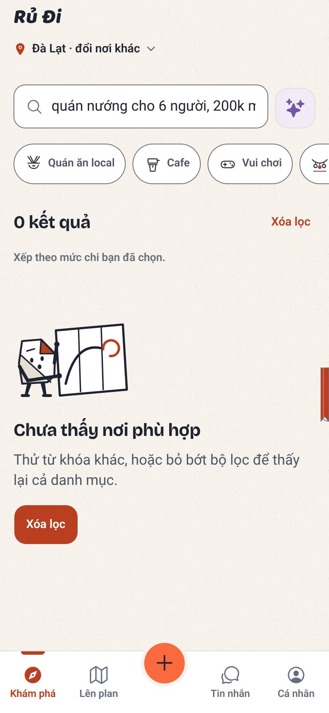 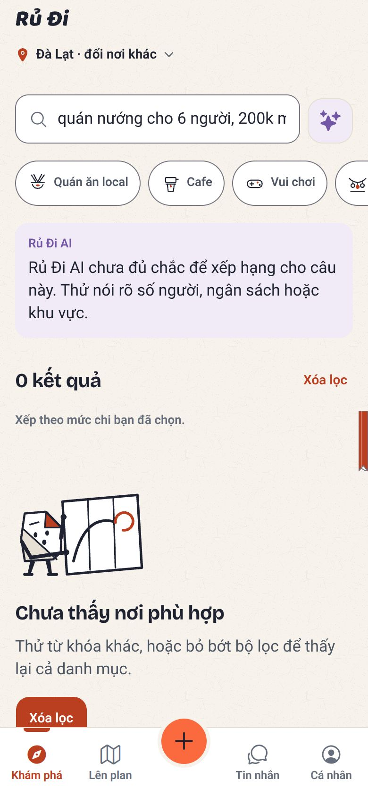 |
| Source | `ExploreLive.tsx:261` (`onPress={() => setQuery(CAU_MAU)}`); `:191-196` (`locTheoTen` đòi mọi từ trong ô khớp tên); `:348-356` (một kiểu trạng thái rỗng); `src/rudi/kham-pha/dia-diem.ts:596-597` (câu cho `khong-tra-loi`); `src/screens/kham-pha/tim-kiem.ts` (`source: "none"` nghĩa là mô hình không trả lời, hoặc câu trả lời bị từ chối vì không bám danh mục) |
| Hậu quả | Lối vào AI nổi bật nhất trông như hỏng ngay lần chạm đầu, và lời khuyên tự mâu thuẫn với câu mẫu của chính app |
| Ghi chú môi trường | Bước 2 đo trên máy chủ không có AI; với AI thật có thể ra kết quả. Bước 1 không phụ thuộc AI |
| Đề xuất sửa | ✦ đặt câu rồi gọi `hoi()`, hoặc ít nhất focus vào ô. Khi ô chứa câu hỏi chưa gửi thì chưa lọc theo tên. Với `source: "none"`, nói «Rủ Đi AI chưa trả lời được lúc này», không bảo người dùng sửa câu |
| Tiêu chí gỡ | Chạm ✦ không bao giờ hiện «0 kết quả» trước khi có câu trả lời |

### UI-025 · Lần đầu mở Khám phá, danh sách hiện rồi bị sân khấu đẩy xuống 149dp

| Trường | Nội dung |
|---|---|
| Category / Severity | VISUAL POLISH (layout shift) · **P3** |
| Feature / Screen | F02 · `/explore` · sân khấu thành phố |
| Nền tảng, cấu hình | web, C1 và C9 |
| Tái hiện | Từ Cá nhân chạm tab Khám phá lần đầu trong phiên |
| Expected | Phần đầu giữ chỗ cho sân khấu, dòng «10 nơi ở Đà Lạt» vẽ một lần ở chỗ cuối cùng |
| Actual | Lấy mẫu mỗi khung hình: dòng «10 nơi ở Đà Lạt» vẽ ở y=257, rồi nhảy xuống y=406. Nhảy sau 95–104 ms ở C1 và 28–37 ms ở C9; cả danh sách dịch 149dp. Ảnh ghép: khung 332 ms danh sách sát ô tìm, khung 474 ms mới có chỗ trống cho sân khấu |
| Evidence | 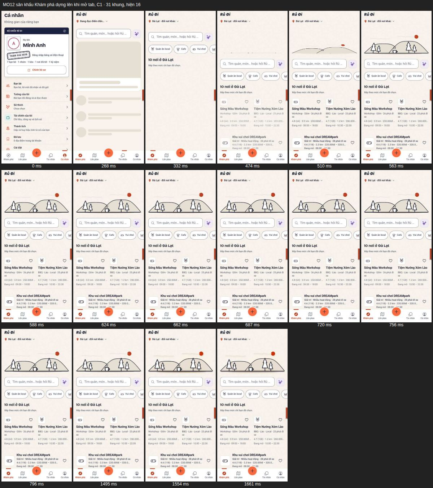 (hàng `TC-F02-NHAY`) |
| Source | `ExploreLive.tsx:239-242` và `:401`: khung `sanThanhPho` không có chiều cao; `SanKhau` chỉ vẽ sau khi `onLayout` cho ra `rongSan` |
| Hậu quả | Nội dung nhảy dưới ngón tay đúng lúc vừa hiện. Với người bật giảm chuyển động, đây là chuyển động họ không muốn |
| Đề xuất sửa | Cho `sanThanhPho` một `aspectRatio` (khung.w/khung.h) để giữ chỗ trước khi đo |
| Tiêu chí gỡ | `TC-F02-NHAY` nhảy 0dp ở C1 và C9 |

### UI-026 · Bỏ lọc hoặc xoá tìm làm sân khấu dựng lại từ đầu mỗi lần

| Trường | Nội dung |
|---|---|
| Category / Severity | VISUAL POLISH · **P3** |
| Feature / Screen | F02 · `/explore` · MO12 |
| Nền tảng, cấu hình | web, C1 |
| Tái hiện | Chạm chip «Cafe», rồi chạm lại để bỏ lọc |
| Expected | Theo chú thích trong `ExploreLive.tsx:236` («It stands up once per city»), sân khấu quay lại ở tư thế đứng |
| Actual | Sân khấu mount lại và chạy lại cú bật dựng từ phẳng tới đứng mỗi lần bỏ lọc (khoảng 1 giây trong môi trường này; SwiftShader không đại diện cho thời lượng) |
| Evidence | 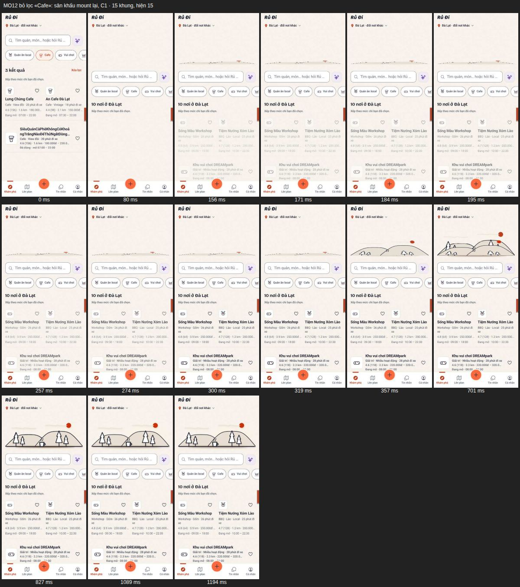 |
| Source | `ExploreLive.tsx:239` (render có điều kiện `!dangLoc && query === ""`); `src/rudi/ui/SanKhau.tsx:55-66` (bật dựng một lần mỗi lần **mount**) |
| Đề xuất sửa | Giữ `SanKhau` mount và gập bằng `gap` (API đã có), thay vì unmount |
| Tiêu chí gỡ | Bỏ lọc không phát lại cú bật dựng |

### UI-027 · Giảm chuyển động: sân khấu trống một lúc khi mount lại

| Trường | Nội dung |
|---|---|
| Category / Severity | BUG (hiển thị) · **P3** |
| Feature / Screen | F02 · `/explore` · `KhungSkia` (chung cho mọi tranh Skia) |
| Nền tảng, cấu hình | web, C9 (`prefers-reduced-motion: reduce`). C1 không thấy trống: ở đó SVG được giữ trong 400 ms của cú fade |
| Tái hiện | Như UI-026, ở C9 |
| Expected | Chú thích `KhungSkia` hứa không bao giờ trống: SVG ở lại tới khi canvas Skia đã vẽ |
| Actual | Dòng thời gian `data-renderer` trên cùng đồng hồ với screencast: 71 ms SVG và Skia cùng mount, Skia opacity 0; 145 ms SVG bị gỡ, Skia opacity 1. Khung 176 ms vùng sân khấu trống; khung 609 ms tranh Skia mới hiện. Trống khoảng 430–460 ms F10: trên bảng dev, «Chạy lại» ở C9 làm sân khấu ghế trống ở 603 và 704 ms rồi hiện đứng sẵn ở 1098 ms, trong khi Nếp và đường mực ngay trên đứng yên đúng ở tư thế cuối (`TC-F10-CHAY-LAI` C9) |
| Evidence | 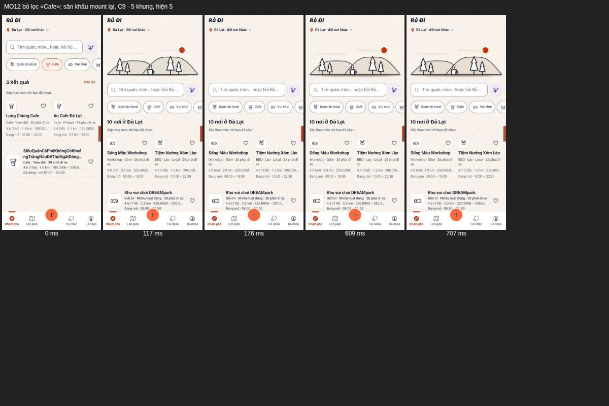 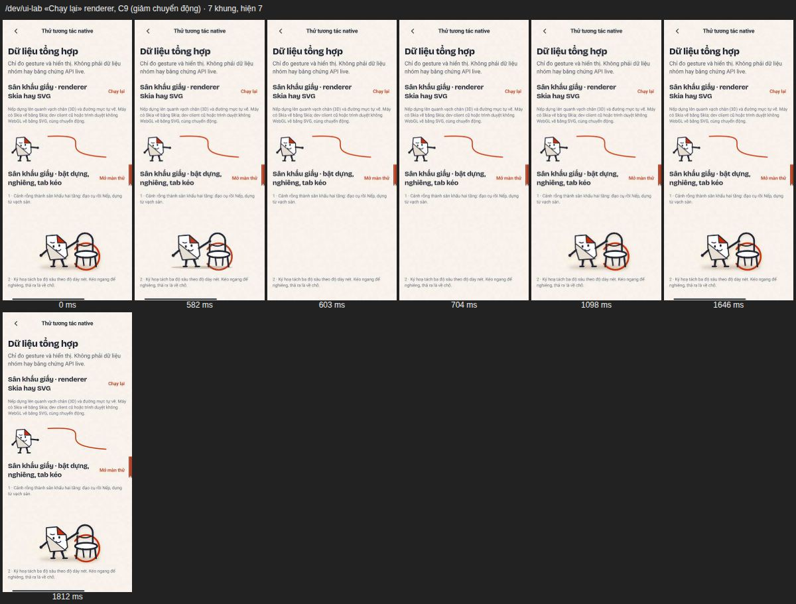 |
| Source | `src/rudi/ui/KhungSkia.tsx:65-93` (`HienSauKhiVe` đợi đúng hai `requestAnimationFrame`, rồi fade; giảm chuyển động nên thời lượng 0), `:130-134` (gỡ SVG khi fade xong) |
| Root cause | Hai rAF không phải tín hiệu «canvas đã vẽ»; dựng surface CanvasKit mất lâu hơn |
| Giới hạn | Độ dài khoảng trống phụ thuộc GPU, SwiftShader chậm hơn máy thật. Cơ chế gỡ SVG trước khi canvas có khung đầu thì không phụ thuộc máy |
| Đề xuất sửa | Chỉ gỡ SVG sau khung vẽ thật đầu tiên của canvas |
| Thêm (F03, M5) | Cùng cú bàn giao, ở chỗ khác: tạo kèo ở C9 rồi tới kèo mới, con rối Nếp cạnh tiêu đề là SVG ở tư thế đầu từ 410 tới 606 ms, rồi cắt sang Skia ở tư thế cuối lúc 908 ms (chụp đúng vùng Nếp mỗi 150 ms, ghi `data-renderer` từng lần). ADR-0037 D3 muốn giảm chuyển động hiện ngay khung cuối tĩnh; ở đây có một cú nhảy tư thế. Ở C1 tiết mục chạy 4 ảnh và dừng ở 1327 ms, trong trần 1400 ms (đạt) |
| Tiêu chí gỡ | Ở C9 không khung nào có vùng sân khấu trống; Nếp M5 ở C9 chỉ có một ảnh từ lúc hiện |

### UI-028 · Thành phố chưa có quán: trạng thái rỗng khuyên bỏ một bộ lọc không tồn tại

| Trường | Nội dung |
|---|---|
| Category / Severity | UX ISSUE · **P3** |
| Feature / Screen | F02 · `/explore` sau `/destinations` |
| Nền tảng, cấu hình | web, C1 |
| Tái hiện | «Đổi điểm đến», chọn Hội An (0 nơi trong danh mục) |
| Expected | Nói rõ Hội An chưa có địa điểm, lối ra là đổi điểm đến |
| Actual | «0 nơi ở Hội An», «Chưa thấy nơi phù hợp», «Thử từ khóa khác, hoặc bỏ bớt bộ lọc để thấy lại cả danh mục.» và nút «Xóa lọc», trong khi không có bộ lọc hay từ khoá nào |
| Evidence | 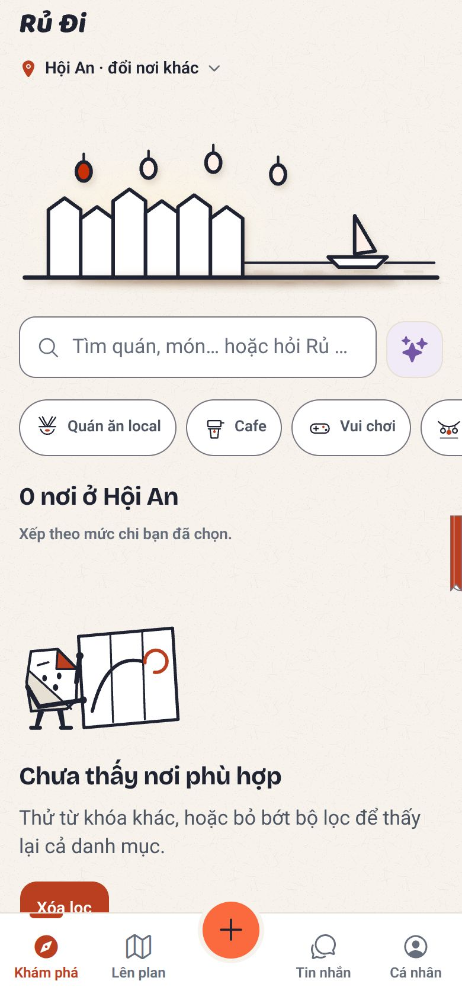 |
| Source | `ExploreLive.tsx:348-356`: một `EmptyState` cho mọi danh sách rỗng, không xét `dangLoc` |
| Đề xuất sửa | Nhánh riêng khi `!dangLoc`: «Hội An chưa có địa điểm nào», kèm «Đổi điểm đến» |
| Tiêu chí gỡ | Thành phố rỗng không hiện «Xóa lọc» |

### UI-029 · Khám phá gặp lỗi máy chủ nhưng bảo người dùng kiểm tra mạng

| Trường | Nội dung |
|---|---|
| Category / Severity | UX ISSUE · **P3** |
| Feature / Screen / Layer | F02 · `/explore` · L35 trạng thái lỗi |
| Nền tảng, cấu hình | web, C1; `/places` trả 503 (chặn ở trình duyệt) |
| Actual | Tiêu đề «Chưa đọc được danh mục», thân là câu mặc định của kit: «Kiểm tra mạng rồi thử lại. Những gì bạn đã nhập vẫn còn nguyên.» Màn này không có gì để nhập. «Thử lại» tải lại được «10 nơi ở Đà Lạt» (đạt) |
| Evidence | 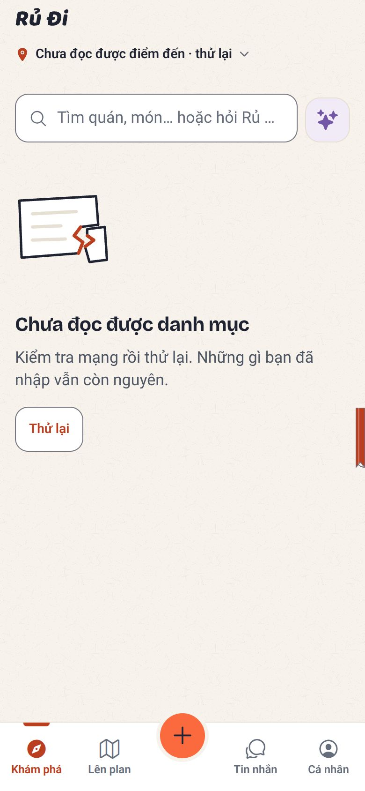 |
| Source | `ExploreLive.tsx:271` không truyền `body`, dù `trang.loi` đã có câu đúng nguyên nhân (`loiRaChu` → `thongDiepNguoiDoc`; 5xx là «Rủ Đi đang gặp sự cố…»). Đếm tĩnh toàn `src/`: 24 chỗ dùng `ErrorState` khác đều truyền `body`, đây là chỗ duy nhất |
| Đề xuất sửa | `body={trang.loi}` |
| Tiêu chí gỡ | 503 hiện câu về máy chủ; mất mạng hiện câu về mạng |

### UI-030 · Mất mạng rồi quay lại tab: danh sách đã tải bị thay bằng màn lỗi

| Trường | Nội dung |
|---|---|
| Category / Severity | UX ISSUE · **P3** |
| Feature / Screen / Layer | F02 · `/explore` · L35 |
| Nền tảng, cấu hình | web, C1 (`context.setOffline(true)`) |
| Tái hiện | Mở Khám phá (10 nơi), ngắt mạng, chạm tab «Lên plan», rồi quay lại «Khám phá» |
| Expected | Nội dung đã tải vẫn xem được, kèm một câu báo đang offline |
| Actual | Hiện «Chưa đọc được danh mục» và «Thử lại»; 10 nơi đã tải biến mất (tên thành phố và sân khấu vẫn còn) |
| Evidence | 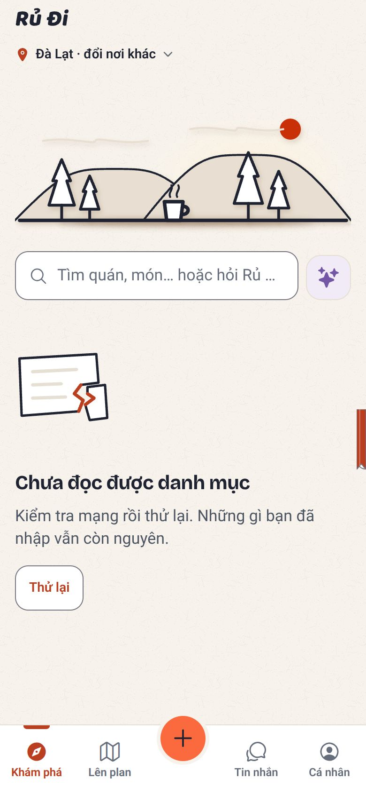 |
| Source | `ExploreLive.tsx:159-163` (`useFocusEffect` gọi `nap()` mỗi lần focus), `:154-156` (lỗi thì `setTrang({ pha: "hong" })`, bất kể đã có dữ liệu) |
| Đề xuất sửa | Khi đã có dữ liệu, lỗi lúc nạp lại chỉ hiện một dòng báo và giữ danh sách |
| Tiêu chí gỡ | Mất mạng rồi đổi tab không làm mất danh sách |

### UI-031 · Lưới Điểm đến luôn 2 cột, kể cả ở expanded

| Trường | Nội dung |
|---|---|
| Category / Severity | VISUAL POLISH · **P3** |
| Feature / Screen | F02 · `/destinations` |
| Nền tảng, cấu hình | web; C6 (768) đạt, C7 (1024) không đạt |
| Expected | DESIGN.md: expanded 3 cột; `gridFor(…, maxColumns = 3)` cho hàng thẻ |
| Actual | Ở 1024 vẫn 2 cột, mỗi thẻ khoảng 450px; một màn chỉ thấy 8/15 thành phố |
| Evidence | 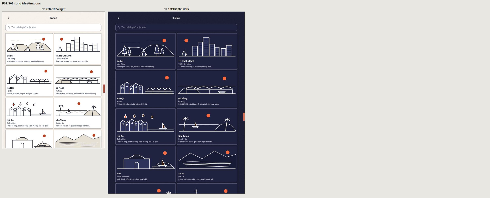 |
| Source | `src/rudi/screens/explore/DiemDenScreen.tsx:120` (`Math.floor((rongLuoi - KHE) / 2)`) |
| Đề xuất sửa | Dùng `gridFor` như các lưới thẻ khác |
| Tiêu chí gỡ | C7 hiện 3 cột |

## F03 Plan · Kèo · Hành trình

### UI-032 · Kèo nhiều ngày: chế độ Bản đồ không hiện chặng nào, mọi ngày báo «chưa có điểm nào»

| Trường | Nội dung |
|---|---|
| Category / Severity | BUG · **P2** |
| Feature / Screen | F03 · `/outings/[id]`, chế độ Bản đồ (`hanh-trinh/SoHanhTrinh.tsx`) |
| Nền tảng, cấu hình | web, C1. Native: cùng mã chia ngày (STATIC) |
| Điều kiện | Kèo seed «Đà Lạt cuối tuần», 3 ngày, 3 chặng đều gắn quán trong danh mục (đủ toạ độ). Các chặng được thêm từ Lịch trình, như mọi chặng thêm bằng «Thêm chặng» hay «Thêm vào kèo» |
| Tái hiện | Mở kèo, chọn «Bản đồ», lần lượt Ngày 1, 2, 3 |
| Expected | Mỗi chặng có địa điểm hiện một mốc ở ngày của nó. Chặng chưa xếp ngày thì được nói ra, không bị lặng lẽ bỏ |
| Actual | Cả 3 ngày: 0 mốc, và câu «Ngày này chưa có điểm nào trên bản đồ. Gắn một quán hoặc một địa điểm vào lịch trình…», trong khi 3 chặng đã gắn quán (0/3). Đối chứng: kèo **1 ngày** có 12 chặng thì hiện 6 mốc (đạt) |
| Evidence | 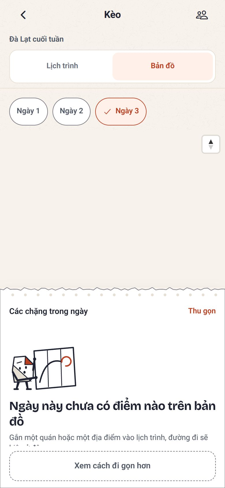 (hàng `TC-F03-BAN-DO-CHANG-NHIEU-NGAY`) |
| Source | `SoHanhTrinh.tsx` (`visible = draft.stops.filter((s) => s.day === day)`); `hanh-trinh/ke-hoach.ts:15` (`nhapTuKeo` chỉ gán ngày khi `day === undefined` và kèo dài một ngày); `src/api.ts` `luuDongThoiGian` gửi chặng không có `day`. Máy chủ trả `day: null` cho chặng của kèo nhiều ngày (đọc API: 3/3 chặng `null`), còn kèo một ngày thì được máy chủ gán ngày |
| Hậu quả | Với chuyến đi nhiều ngày, loại phổ biến nhất, Bản đồ luôn trống, và lời nhắn còn bảo người dùng làm việc họ đã làm |
| Đề xuất sửa | Chặng không có ngày thì đưa vào một mục «Chưa xếp ngày», hoặc mặc định vào ngày đầu; hoặc bắt `Thêm chặng`/`Thêm vào kèo` chọn ngày với kèo nhiều ngày |
| Tiêu chí gỡ | Kèo 3 ngày có 3 chặng gắn quán: tổng mốc qua các ngày = 3, hoặc có dòng nói rõ 3 chặng chưa xếp ngày |

### UI-033 · Bản đồ, ngày trống: «Về Lịch trình» và lời giải thích nằm dưới mép vùng cuộn

| Trường | Nội dung |
|---|---|
| Category / Severity | UX ISSUE (layout, mất nội dung) · **P2** |
| Feature / Screen / Layer | F03 · `/outings/[id]` Bản đồ · L13 trang ngày (`ManHinhHanhTrinh.tsx`) |
| Nền tảng, cấu hình | web; hỏng ở C1, C2, C3, C4, C8; đạt ở C6, C7 |
| Tái hiện | Kèo 2 ngày chưa có chặng, chọn «Bản đồ» |
| Expected | Trạng thái rỗng và nút «Về Lịch trình» thấy được mà không phải cuộn trong một khung nhỏ |
| Actual | Trang ngày là một vùng cuộn cao tối đa 56% của 65% chiều cao màn. Vùng đó chỉ lộ tranh và tiêu đề; câu giải thích bị cắt giữa chừng; «Về Lịch trình» thấy 0% (C1: nút ở 791–839, vùng thấy 571–772). Nút vô hiệu «Xem cách đi gọn hơn» (viền đứt) lại chiếm chỗ chính bên dưới. Ở C8 (390×460) vùng cuộn cao **0px**: không với tới được gì của trạng thái rỗng |
| Evidence | 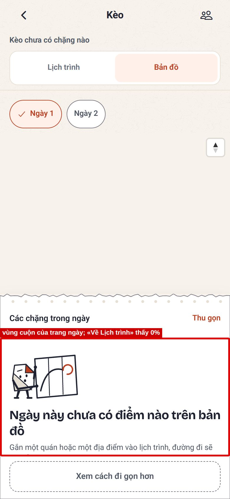 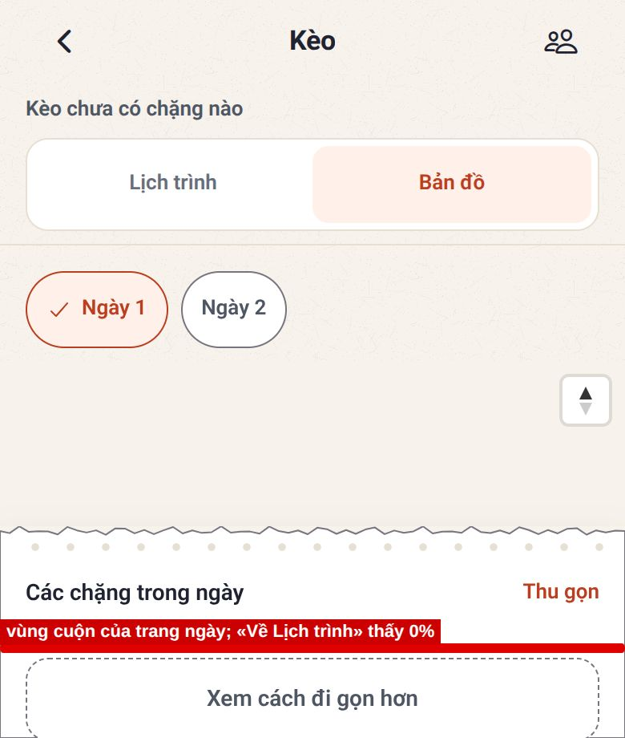 (hàng `TC-F03-VE-LICH-TRINH`) |
| Source | `ManHinhHanhTrinh.tsx:167-225`: `maxHeight: availableHeight * 0.56` cho trang ngày; khối rỗng (tranh 144, tiêu đề, ghi chú, nút) nằm trong `ScrollView`; `primaryAction` ở ngoài, dưới cùng |
| Hậu quả | Người mở Bản đồ ở một ngày trống không thấy lối về và không thấy lời giải thích; vẫn còn công tắc «Lịch trình» ở đầu màn |
| Đề xuất sửa | Ở ngày trống: bỏ tranh hoặc thu nhỏ, đưa «Về Lịch trình» lên trước, ẩn nút gợi ý tuyến khi không có hoạt động |
| Tiêu chí gỡ | C1–C4 và C8: «Về Lịch trình» thấy trọn không cần cuộn |

### UI-034 · Tạo kèo: ô ngân sách trông như đã điền, bỏ trống thì «Tạo kèo» như không làm gì

| Trường | Nội dung |
|---|---|
| Category / Severity | UX ISSUE · **P2** |
| Feature / Screen | F03 · `/outings/new` (`keo/CreateOutingLive.tsx`) |
| Nền tảng, cấu hình | web, C1 |
| Tái hiện | Gõ tên kèo, không chọn mức chi, chạm «Tạo kèo» |
| Expected | Hoặc tạo kèo, hoặc một câu thấy được ngay nói thiếu ngân sách; ô trống không trông như có số |
| Actual | Ô «hoặc gõ số đồng» hiện «250000» là **placeholder**, nhưng đọc như số đã điền (giá trị thật rỗng). Chạm «Tạo kèo»: ở lại `/outings/new`. Câu «Ngân sách mỗi người là số tiền Việt Nam, viết bằng chữ số.» nằm ở y=854–902, dưới nút và ngoài khung 844 (có `aria-live`, nên trình đọc màn hình nghe, người nhìn thì không). Đối chứng: chọn «300 nghìn» thì tạo được (đạt, cả C9) |
| Evidence | 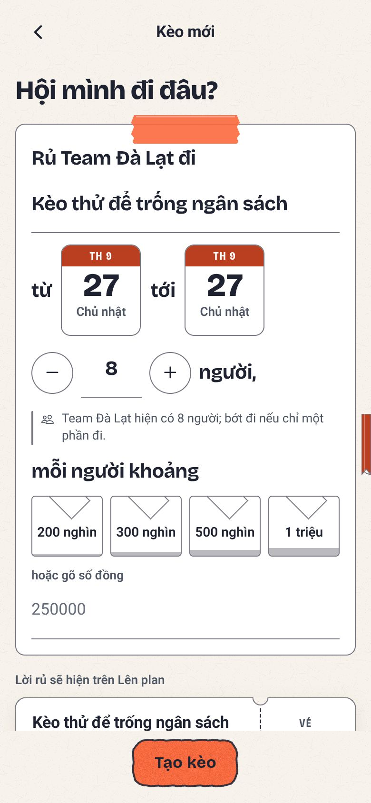 (hàng `TC-F03-TAO-NGAN-SACH-TRONG`) |
| Source | `CreateOutingLive.tsx:248` (placeholder của ô ngân sách); `src/screens/len-plan/buoi-di.ts:164-171` (từ chối ngân sách rỗng); câu lỗi render cuối form, không cuộn tới |
| Đề xuất sửa | Điền sẵn một mức chi thật, hoặc placeholder dạng «ví dụ 250.000đ»; khi từ chối thì cuộn tới câu lỗi và đặt focus vào ô ngân sách |
| Tiêu chí gỡ | Bỏ trống ngân sách rồi «Tạo kèo»: câu lỗi thấy được ngay |

### UI-035 · `/trips/[id]/timeline` hiện dữ liệu demo cho người đã đăng nhập, dưới id kèo thật

| Trường | Nội dung |
|---|---|
| Category / Severity | BUG (dữ liệu sai hiển thị như thật) · **P2** |
| Feature / Screen | F03 · `/trips/[id]/timeline` (route demo) |
| Nền tảng, cấu hình | web, C1–C3 |
| Điều kiện | Đã đăng nhập (phiên thật); id là kèo «Đà Lạt cuối tuần» của nhóm |
| Tái hiện | Mở `/trips/<id kèo>/timeline` |
| Expected | Như hai route demo anh em (sửa B5, QC 24/09): có phiên thì chuyển về màn sống (`/outings/[id]`) |
| Actual | Hiện lịch trình demo: «07:00 Khởi hành từ TP.HCM», «11:00 Check-in homestay», «12:30 Ăn trưa - Bánh căn Lệ», ảnh bìa, «2.500.000đ dự kiến một người». Không có nhãn demo, không có nút Quay lại. Hai route anh em đạt: `/trips/[id]/itinerary` → `/outings/[id]`, `/check-ins/new` → `/plan` |
| Evidence | 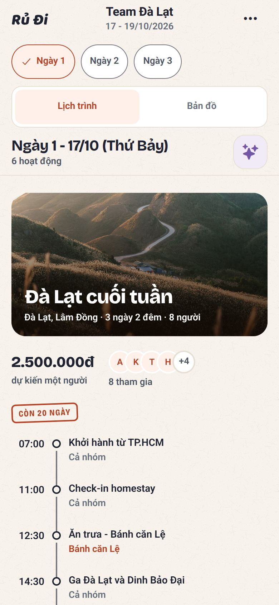 |
| Source | `app/trips/[id]/timeline.tsx` export thẳng `TripTimelineScreen`, thiếu khối `if (phien !== null) return <Redirect …/>` mà `app/trips/[id]/itinerary.tsx` và `app/check-ins/new.tsx` có |
| Hậu quả | Link cũ hoặc gõ tay đưa người dùng thật tới một lịch trình bịa mang tên nhóm của họ |
| Đề xuất sửa | Chép khối chặn B5 sang `timeline.tsx` |
| Tiêu chí gỡ | Có phiên: `/trips/<id>/timeline` về `/outings/<id>` |

### UI-036 · Đổi thứ tự chặng trên web chỉ làm được bằng kéo

| Trường | Nội dung |
|---|---|
| Category / Severity | BUG (accessibility, web) · **P2** |
| Feature / Screen | F03 · `/outings/[id]` Lịch trình · `ui/ReorderList.tsx` |
| Nền tảng, cấu hình | web, C1. Native: `accessibilityActions` tăng/giảm là API chuẩn (STATIC, chưa chạy) |
| Tái hiện | Focus tay nắm «Thứ tự Cà phê sáng», nhấn mũi tên xuống |
| Expected | Có lối đổi thứ tự không cần kéo, như thao tác tăng/giảm vị trí trên native |
| Actual | Tay nắm là `role=slider`, không có `tabindex` (không nhận focus), không có `aria-valuenow`/`aria-valuemax`; phím mũi tên không đổi gì. Kéo bằng tay (giữ 450 ms rồi kéo 160dp) thì đạt ở C1 và C9, trang không cuộn theo. «Xếp theo giờ hẹn» chỉ xếp theo giờ, không thay được thứ tự tuỳ ý |
| Evidence | Hàng `TC-F03-SAP-XEP-PHIM` (đọc DOM); axe ở màn kèo: `aria-required-attr` «Thứ tự …» ×3 (×12 ở kèo 12 chặng) |
| Source | `ReorderList.tsx:78-84`: `accessibilityRole="adjustable"`, `accessibilityValue` (object, RNW bỏ), `accessibilityActions` (RNW không có) |
| Hậu quả | Người dùng bàn phím hoặc trình đọc màn hình trên web không đổi được thứ tự chặng |
| Đề xuất sửa | Trên web, thêm hai nút «Lên/Xuống một chặng» (hoặc xử lý phím mũi tên và `tabIndex=0`), truyền `aria-valuenow/min/max` trực tiếp |
| Tiêu chí gỡ | Chỉ bằng bàn phím đổi được thứ tự một chặng; axe không còn `aria-required-attr` ở tay nắm |

### UI-037 · Nếp vắng suốt màn kèo, cả khi đang ở Lịch trình

| Trường | Nội dung |
|---|---|
| Category / Severity | UX ISSUE · **P3** |
| Feature / Screen | F03 · `/outings/[id]` |
| Nền tảng, cấu hình | web, C1 |
| Tái hiện | Từ Lên plan (có mép Nếp) mở một kèo |
| Expected | Nếp chỉ nhường chỗ khi bản đồ hiện (chú thích ở `ManHinhHanhTrinh`: bản đồ chạy mép tới mép) |
| Actual | Lên plan: có Nếp. Kèo ở Lịch trình: không. Bản đồ: không. Lịch trình lại: không. Quay về Lên plan: có |
| Evidence | 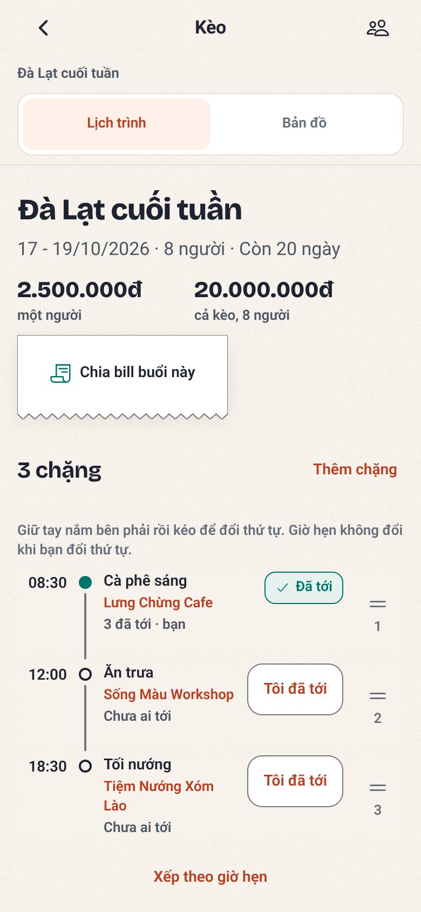 (hàng `TC-F03-NEP-LICH-TRINH`) |
| Source | `OutingLive.tsx:382-385` giữ `SoHanhTrinh` luôn mount, chỉ `display: none`; `ManHinhHanhTrinh.tsx:84` gọi `useNhuongChoNep(true)` vô điều kiện |
| Đề xuất sửa | `useNhuongChoNep(hienBanDo)`, truyền cờ chế độ từ màn kèo |
| Tiêu chí gỡ | Kèo ở Lịch trình có mép Nếp; Bản đồ thì không |

### UI-038 · Web: Back khi đang mở sheet rời cả màn

| Trường | Nội dung |
|---|---|
| Category / Severity | UX ISSUE · **P3** |
| Feature / Screen / Layer | F03 · `/outings/[id]` · L08 (chung cho mọi `ui/Sheet.tsx`, khoảng 20 sheet). F05 · `/groups/[id]/chat` · L18 menu tin, L19 khay sticker (cùng `Sheet`), L20 khay công cụ và L21 khay tờ hẹn chung (khay trong màn). F06 · `/people/[id]` · L06 hành động hồ sơ. F07 · `/groups/[id]/to-giay` · L23 «Cài đặt sổ» F08 · `/groups/[id]/wall` · L24 sheet Check-in; `/posts/[id]` · L07 sheet báo cáo bài |
| Nền tảng, cấu hình | web, C1 (trên Android Chrome, cử chỉ back hệ thống cũng là Back trình duyệt). Native Android: `Sheet` nghe `BackHandler` nên đóng sheet (STATIC) |
| Tái hiện | Từ Lên plan mở kèo, mở sheet «Chặng mới», gõ dở tên chặng, bấm Back |
| Expected | Back đóng sheet, ở lại màn kèo |
| Actual | Sheet đóng vì màn bị gỡ: URL về `/plan`, 12/12 ô của lưới chạm đổi, chữ đang gõ mất |
| Evidence | Hàng `TC-L08-DONG-back` (URL và lưới chạm sau Back). Sáu cách đóng khác đạt. F05, vào chat từ Tin nhắn rồi mở từng lớp: Back trình duyệt đóng lớp bằng cách rời chat về `/messages` ở cả bốn lớp (`TC-L18-VONGDOI`, `TC-L19-VONGDOI`, `TC-L20-VONGDOI`, `TC-L21-VONGDOI`); Esc, nền, kéo xuống và X đều đóng mà vẫn ở lại chat, trừ Esc ở L21 (UI-066). Chữ đang gõ trong ô soạn mất theo màn. F06: sheet «Thêm hành động» của hồ sơ, Back rời hồ sơ về Bạn bè; Esc, nền, kéo xuống ở lại hồ sơ (`TC-L06-VONGDOI`). F07: tới tờ giấy từ Tin nhắn, mở «Cài đặt sổ», Back rời tờ giấy về `/messages` (`TC-L23-BACK`); X, nền, Esc, kéo dài, vuốt nhanh đóng mà ở lại, kéo ngắn bật về (`TC-L23-VONGDOI`). F08: tới tường từ Tin nhắn, mở sheet Check-in, Back rời tường về `/messages`; X, nền, Esc đóng mà ở lại tường, focus vào sheet (`TC-L24-VONGDOI`). Sheet báo cáo bài: Back rời bài về `/messages`; X, Esc, nền ở lại bài (`TC-L07-VONGDOI`) |
| Source | `src/rudi/ui/Sheet.tsx:145` chỉ nghe `hardwareBackPress` (react-native-web không phát). Khay công cụ: `chat/SoHen.tsx:111` (`BackHandler`, chỉ Android). Khay tờ hẹn chung: không nghe gì, nên trên Android Back cũng rời chat (STATIC) |
| Đề xuất sửa | Trên web, đẩy một mục lịch sử khi mở sheet và đóng sheet ở `popstate` (như khay `/create`) |
| Tiêu chí gỡ | Back khi sheet mở: sheet đóng, URL giữ nguyên |

### UI-039 · «Thêm chặng» là công tắc: chạm đúp mở rồi đóng ngay

| Trường | Nội dung |
|---|---|
| Category / Severity | UX ISSUE · **P3** |
| Feature / Screen / Layer | F03 · `/outings/[id]` · L08 |
| Nền tảng, cấu hình | web, C1 |
| Tái hiện | Chạm «Thêm chặng» hai lần cách 60 ms |
| Expected | Đúng một sheet mở |
| Actual | 0 sheet sau 1,3 s: lần chạm thứ hai đóng sheet vừa mở |
| Evidence |  (hàng `TC-L08-CHAM-DUP`) |
| Source | `OutingLive.tsx:289-292` (`setMoThem((v) => !v)`) |
| Đề xuất sửa | Nút mở chỉ mở (`setMoThem(true)`); đóng thuộc về sheet |
| Tiêu chí gỡ | Chạm đúp: 1 sheet |

### UI-040 · Sheet «Chặng mới» cao 93% ở cửa sổ thấp

| Trường | Nội dung |
|---|---|
| Category / Severity | VISUAL POLISH · **P3** |
| Feature / Screen / Layer | F03 · L08 · `ui/Sheet.tsx`. F07 · L23 «Sửa bản phác», «Hai ô ràng buộc» F08 · L24 sheet Check-in |
| Nền tảng, cấu hình | web, C8 (390×460). C2 67%, C6 42% (đạt). F07: cả ở C1 |
| Expected | Sheet ≤ 82% chiều cao (DESIGN.md) |
| Actual | Sheet cao 427px, 93% màn; chỉ còn 33px nền mờ phía trên để chạm đóng. Nút gửi vẫn thấy được. F07: sheet «Sửa bản phác» cao 756px = 90% ở **C1** (`TC-F07-SUA-NHAP`); ở C8 cả «Sửa bản phác» lẫn «Hai ô ràng buộc» cao 96% (đỉnh y 19), nút chính («Lưu bản phác», «Lưu hai ô của tôi») nằm dưới mép cửa sổ (đáy 833 và 556 trên cửa sổ 460), chỉ tới được sau khi cuộn trong sheet (`TC-F07-C8`). F08: sheet Check-in cao 96% ở C8, đỉnh y 19 (`TC-F08-C8`). Ba form đăng của F08 đạt ở C8: «Chia sẻ ngay vào nhóm» ở chân trang cố định; «Đăng story» và «Đăng» cuộn tới được, trọn trong cửa sổ cùng dòng lý do (`TC-F08-VOI-TOI`, `TC-F08-THA-CUON`) |
| Evidence | 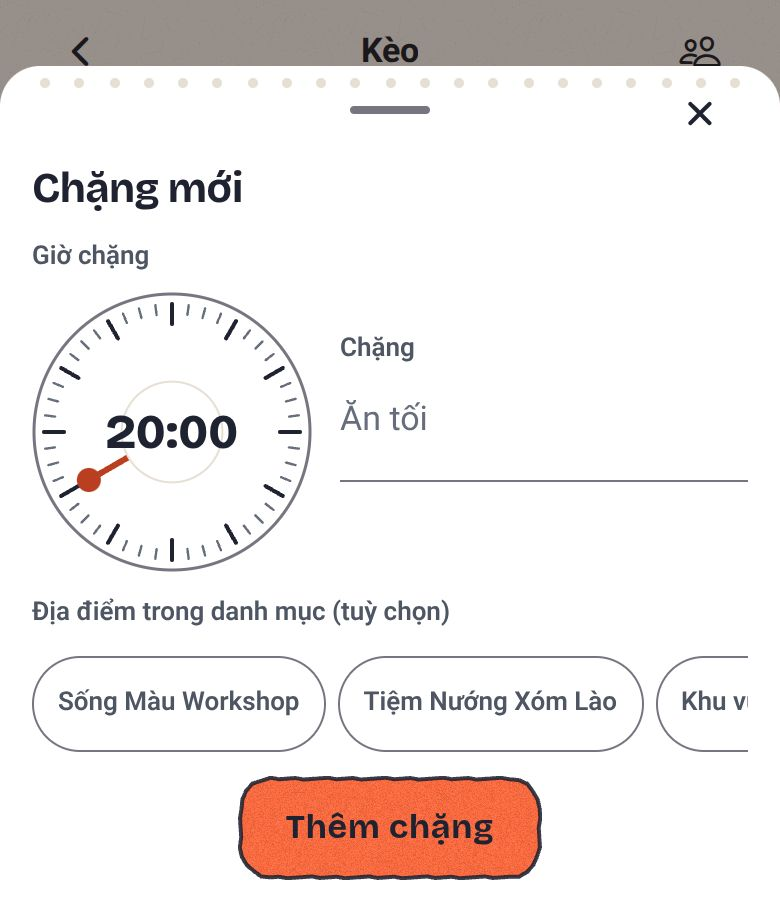 (hàng `TC-L08-KICH-THUOC`) 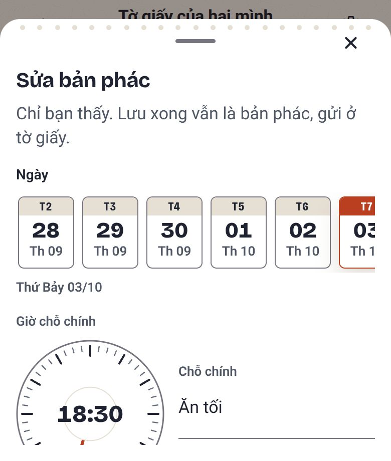 |
| Source | `Sheet.tsx`: trần 82% chỉ áp cho `ScrollView` bên trong; tay cầm và lề cộng thêm ngoài trần |
| Đề xuất sửa | Áp trần cho cả khung sheet |
| Tiêu chí gỡ | C8: sheet ≤ 82% |

### UI-041 · Sheet «Sửa trang ngày»: đầu màn không bị làm mờ nhưng chạm vào không có tác dụng

| Trường | Nội dung |
|---|---|
| Category / Severity | UX ISSUE · **P3** |
| Feature / Screen / Layer | F03 · `/outings/[id]` Bản đồ · L10 (`hanh-trinh/SoHanhTrinh.tsx`) |
| Nền tảng, cấu hình | web, C1 |
| Tái hiện | Bản đồ, chạm «Sửa trang ngày», rồi chạm công tắc «Lịch trình» phía trên sheet |
| Expected | Nền mờ phủ cả đầu màn; chạm ra ngoài thì đóng sheet |
| Actual | Đầu màn (Quay lại, tiêu đề, công tắc) vẫn sáng như dùng được, nhưng chạm không đổi chế độ và cũng không đóng sheet (vẫn 1 dialog). Thêm: nút tên «Sửa trang ngày» mở sheet tiêu đề «Những hẹn quan trọng» |
| Evidence | 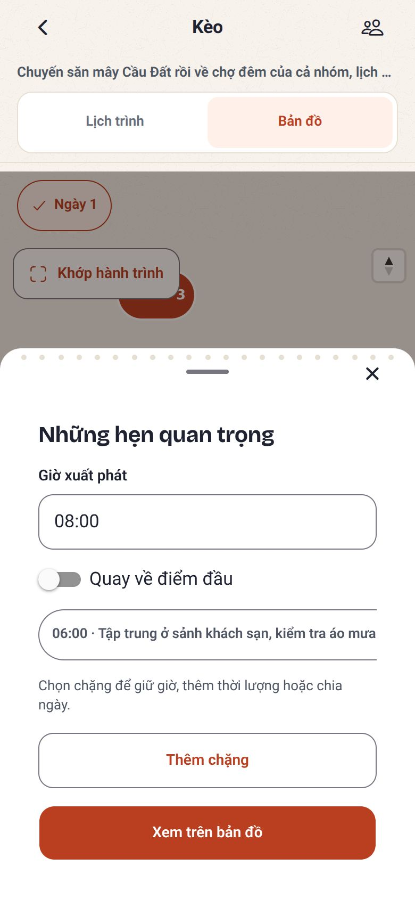 (hàng `TC-L10-NEN`) |
| Source | `SoHanhTrinh.tsx:156`: `Sheet` nằm trong thân màn, không ở khe `overlay` của `RudiScreen` như sheet của Lịch trình (`OutingLive.tsx:293`, chú thích «Editors live over the route») |
| Đề xuất sửa | Đưa hai sheet của Bản đồ lên khe `overlay`; thống nhất tên nút và tiêu đề sheet |
| Tiêu chí gỡ | Khi sheet mở, đầu màn bị làm mờ và chạm vào thì đóng sheet |

### UI-042 · ARIA sai vai trò ở màn kèo

| Trường | Nội dung |
|---|---|
| Category / Severity | BUG (accessibility) · **P3** |
| Feature / Screen | F03 · `/outings/[id]` |
| Nền tảng, cấu hình | web, C1 và C3 (axe WCAG 2 A/AA) |
| Actual | axe critical: `aria-allowed-attr` ×3 (×12 ở kèo 12 chặng): nút chặng `role=button` mang `aria-selected`. `aria-required-parent` ×2: «Lịch trình» và «Bản đồ» là `role=tab` mà không có `tablist` (công tắc vẫn báo `aria-selected` đúng khi đổi). `aria-required-attr`: slider «Thứ tự …» thiếu `aria-valuenow` (UI-036), mặt quay giờ cũng là slider không có giá trị. F09 «Cài đặt»: ba mục «Giao diện» («Sáng», «Tối», «Theo hệ thống») là `role=tab` có `aria-selected` đúng nhưng không nằm trong `tablist` (axe `aria-required-parent` ×3; `Segmented` của kit, `ui.tsx:951`); nhóm «Ai được bình luận tường tôi» là `radiogroup` chứa ba `button` mang `aria-pressed` thay vì `radio` (`CaiDatScreen.tsx:177`). `TC-F09-CAI-DAT-ARIA` F10: mặt quay giờ (`BanXoay`, `role=slider`, không `aria-valuenow`) chứa nút «Gõ giờ: Giờ chặng», nên axe báo thêm `nested-interactive` (serious). Đo trên bảng dev, cùng component với sheet chặng của màn kèo (`TC-F10-BAN-XOAY-LONG`) |
| Evidence | Báo cáo axe của ảnh baseline S03 (ở C1 và C3); hàng `TC-F03-CHE-DO`, `TC-L15-KEO`; F10: hàng `TC-F10-BAN-XOAY-LONG` |
| Source | `keo/HangChang.tsx:129` (`aria-selected` trên button); `hanh-trinh/ThanhCheDo.tsx` (tab không có tablist); `ui/ReorderList.tsx:78`, `ui/BanXoay.tsx:85-88` (`adjustable` + `accessibilityValue`) |
| Đề xuất sửa | `aria-pressed` hoặc `aria-current` cho chặng đang chọn; bọc công tắc bằng `role=tablist`; truyền `aria-valuenow`/`aria-valuetext` trực tiếp |
| Tiêu chí gỡ | axe 0 vi phạm critical trên màn kèo |

### UI-043 · Điều khiển bản đồ và popup cụm mang tên tiếng Anh; Esc không đóng popup

| Trường | Nội dung |
|---|---|
| Category / Severity | UX ISSUE (accessibility, ngôn ngữ) · **P3** |
| Feature / Screen / Layer | F03 · Bản đồ · L12 (`hanh-trinh/BanDo.tsx`) |
| Nền tảng, cấu hình | web, C1 |
| Actual | Nút la bàn của MapLibre tên «Drag to rotate map, click to reset north»; nút đóng popup cụm tên «Close popup». Esc không đóng popup cụm (nút đóng thì đóng). Phần còn lại của popup đạt: nằm trọn trong bản đồ, mục 48px, focus vào danh sách |
| Evidence | 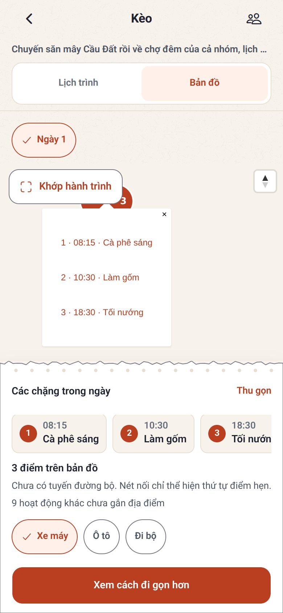 (hàng `TC-F03-BAN-DO-NHAN`, `TC-L12-CUM`) |
| Source | `BanDo.tsx`: `NavigationControl` và `Popup` dùng nhãn mặc định của MapLibre (có tuỳ chọn `locale`) |
| Đề xuất sửa | Truyền `locale` tiếng Việt cho `Map`; nghe `keydown` Escape khi popup mở |
| Tiêu chí gỡ | Không còn nhãn tiếng Anh; Esc đóng popup |

### UI-044 · Lên plan: dòng thông tin của vé kèo bị cắt

| Trường | Nội dung |
|---|---|
| Category / Severity | UX ISSUE · **P3** |
| Feature / Screen | F03 · `/plan` · vé trong «Sau đó» |
| Nền tảng, cấu hình | web; C1 2/3 dòng (thiếu 31 và 135px), C2 2/3 (86, 190px), C4 2/3 (43, 147px), C5 1/3 (104px); C6/C7 đạt |
| Actual | «24/10/2026 · 8 người · 12 chặng · Còn 27 ngày» còn «…12 chă…»; «31/10 - 01/11/2026 · 8 người · Chưa có chặng nào · Còn 34 ngày» mất cả «Chưa có chặng nào». Phần mất là số chặng và đếm ngược, thông tin phụ nhưng là lý do để mở vé |
| Evidence | 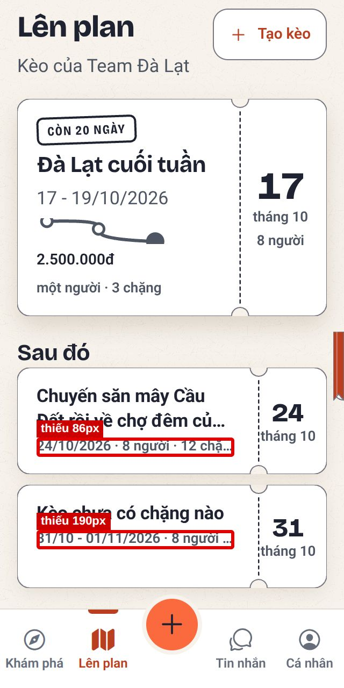 (hàng `TC-F03-META`) |
| Source | `keo/PlanLive.tsx:103` (`HangKeo`, dòng thông tin `numberOfLines={1}`) |
| Đề xuất sửa | Hai dòng, hoặc bỏ năm khỏi ngày, hoặc đưa đếm ngược lên cuống vé |
| Tiêu chí gỡ | C2: không dòng nào mất số chặng |

### UI-045 · Ở 320dp cột tên chặng còn 53px

| Trường | Nội dung |
|---|---|
| Category / Severity | VISUAL POLISH · **P3** |
| Feature / Screen | F03 · `/outings/[id]` Lịch trình · `keo/HangChang.tsx` |
| Nền tảng, cấu hình | web, C2 (320). C1: cột 123px, 4 dòng (đạt ngưỡng đo 120px) |
| Actual | Cột tên chặng rộng 53px, giữa cột giờ, nút «Tôi đã tới» và tay nắm: nhãn 57 ký tự gãy khoảng 9 dòng, «Lưng Chừng Cafe» 3 dòng, «Chưa ai tới» 2 dòng. Không tràn ngang (đạt) |
| Evidence | 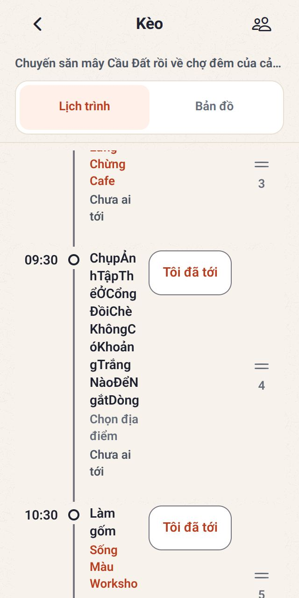 (hàng `TC-F03-COT-CHANG`) |
| Đề xuất sửa | Dưới khoảng 360dp, đưa nút check-in xuống dòng dưới tên |
| Tiêu chí gỡ | C2: cột tên ≥ 120px |

### UI-046 · `/outings/chon` thiếu `?place` thì kẹt skeleton vô hạn

| Trường | Nội dung |
|---|---|
| Category / Severity | BUG · **P3** (không có lối vào từ UI; chỉ qua link hỏng) |
| Feature / Screen | F03 · `/outings/chon` (`keo/PickOutingLive.tsx`) |
| Nền tảng, cấu hình | web, C1–C3 |
| Actual | Sau 6 s vẫn 1 skeleton, chỉ có tiêu đề «Thêm vào kèo»; nút Quay lại mở lạnh không làm gì (UI-018) |
| Evidence | 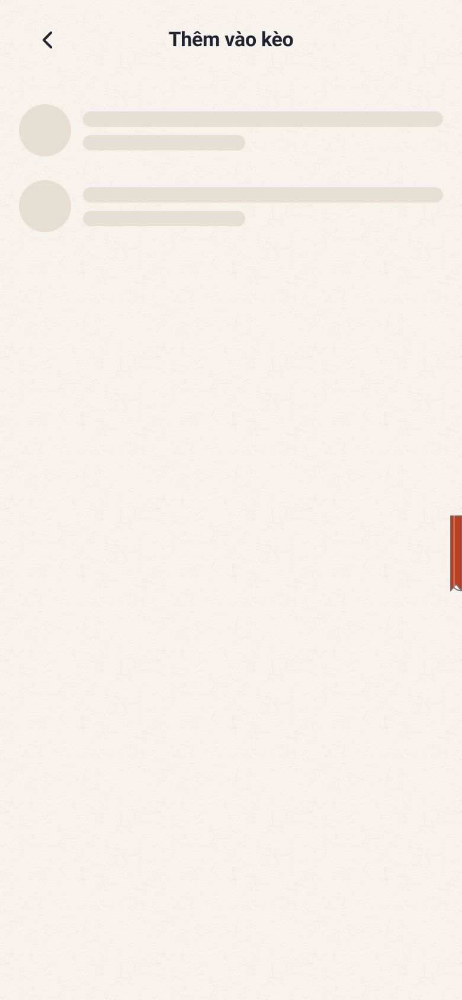 |
| Source | `PickOutingLive.tsx:59` (`if (!placeId) return;` để trạng thái «đang đọc» mãi) |
| Đề xuất sửa | Thiếu `place` thì hiện ErrorState có lối về Khám phá |
| Tiêu chí gỡ | Mở `/outings/chon`: một câu và một lối ra trong ≤ 1 s |

### UI-047 · Tablet: đầu màn kèo co vào giữa, lệch khỏi cột nội dung

| Trường | Nội dung |
|---|---|
| Category / Severity | VISUAL POLISH · **P3** |
| Feature / Screen | F03 · `/outings/[id]`; chung cho mọi màn dùng khe `header` của `RudiScreen` (STATIC, chat đo ở F05) |
| Nền tảng, cấu hình | web; C6 và C7 hỏng, C1 đạt |
| Actual | C6 (768): nút Quay lại ở x=310, nội dung bắt đầu ở x=16 (lệch 294px), công tắc Lịch trình/Bản đồ chỉ rộng 139px. C7 (1024): lệch 390px, công tắc 139px |
| Evidence | 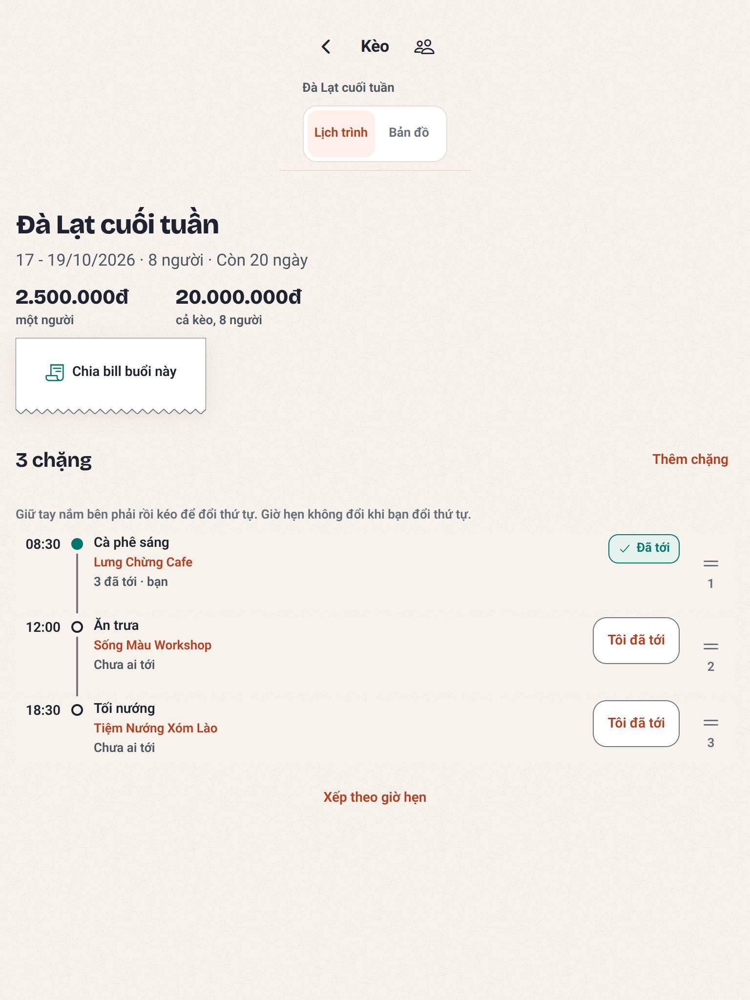 (hàng `TC-F03-DAU-MAN`) |
| Source | `src/rudi/ui.tsx:156`: khe `header` ở tablet nhận `tabletInner` (`alignSelf: "center"`, `maxWidth: 960`) mà không có `width: "100%"`, nên co về bề rộng nội tại |
| Đề xuất sửa | Thêm `width: "100%"` cho khe `header` ở tablet |
| Tiêu chí gỡ | C6/C7: nút Quay lại thẳng mép trái cột nội dung |

## F04 Tiền

### UI-048 · Số tiền của món bị cắt: «12.345.678đ» hiện thành «12.3…»

| Trường | Nội dung |
|---|---|
| Category / Severity | BUG (hiển thị tiền) · **P2** |
| Feature / Screen | F04 · `/smart-split/[id]/review`, bước 2 «Xem lại hóa đơn» (dòng món) và bước 3 «Ai dùng món nào?» (thẻ món trên bàn) |
| Nền tảng, cấu hình | web, C1–C5 (bước 2), C2 (bước 3). Native: cùng bố cục flex (STATIC) |
| Điều kiện | Bill nhập tay 3 món: tên 70 ký tự có dấu cách, «Bia», tên liền 41 ký tự; tiền 12.345.678đ, 960.000đ, 400.000đ |
| Tái hiện | Nhập tay 3 món như trên; xem dòng món ở bước 2 (mở hay gập đều vậy); sang bước 3 ở 320dp |
| Expected | Số tiền không bao giờ bị cắt; tên món xuống dòng hoặc nhường chỗ trước |
| Actual | Bước 2: số tiền của hai món có tên dài chỉ còn 30–48px và bị ellipsis, «12.3…» và «400.…», ở mọi bề rộng điện thoại (C1 41px, C2 30px, C3 37px, C4 39px, C5 47px). «Bia» 960.000đ đọc trọn. Bill trên 3 dòng thì các dòng gập lại, nên dòng này là chỗ duy nhất hiện số tiền của món. Bước 3 ở C2: thẻ món giữa bàn hiện «12.345.6…» (68px) |
| Evidence | 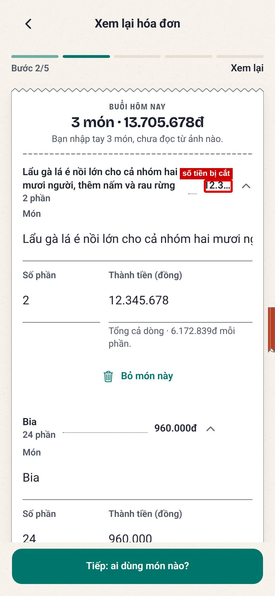 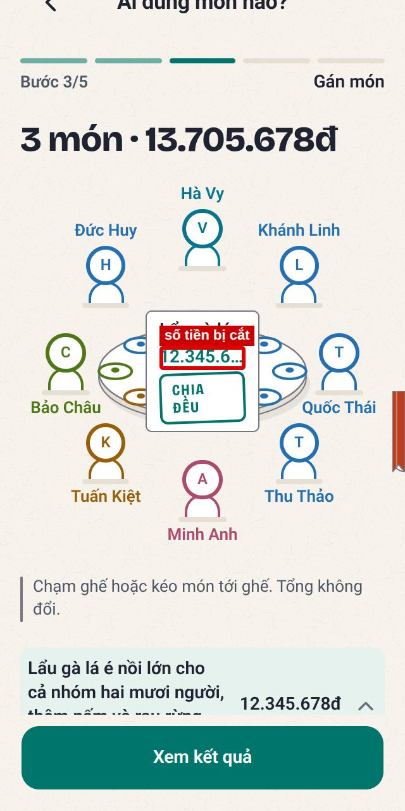 (hàng `TC-F04-MON-DAI`, đo `scrollWidth > clientWidth` trên phần tử có tên là số tiền) |
| Source | `chia-bill/ChiaBillLive.tsx:482` (`Money` trong hàng `dongDau`, cạnh `tenMon: { flexShrink: 1 }` và vạch chấm `chamDan`, dòng 755–756); `ui/Money.tsx` mặc định `numberOfLines={1}`; thẻ món `ui/BanGanMon.tsx:156`, rộng `theMon(rx).w` ≤ 128 |
| Hậu quả | Người chia bill không đọc được số tiền của chính món vừa gõ; với bill dài chỉ còn cách mở từng dòng |
| Đề xuất sửa | Số tiền `flexShrink: 0` (không bao giờ co); tên món co và xuống dòng; trên thẻ món cho số tiền xuống dòng hoặc thu cỡ chữ thay vì ellipsis |
| Tiêu chí gỡ | Bill trên, bước 2 ở C1–C5 và bước 3 ở C2: 0 phần tử số tiền có `scrollWidth > clientWidth` |

### UI-049 · Web: «Gửi cho <tên>» ở đợt thu không gửi được link, và báo nhầm «Kiểm tra mạng»

| Trường | Nội dung |
|---|---|
| Category / Severity | BUG · **P1** trên web ở trình duyệt không có Web Share: không gửi được link nào, không có lối khác. Ở trình duyệt có Web Share, link đi được nhưng màn báo lỗi sai (mức P2 nếu tách riêng) |
| Feature / Screen / Layer | F04 · `/batches/[id]`, mục «Gửi link riêng» · L32 Chia sẻ |
| Nền tảng, cấu hình | web, C1. Native: `Share.share` của React Native trả `{ action }`, nên nhánh này không xảy ra (STATIC) |
| Điều kiện | Đợt vừa phát trên chính máy này; phong bì có 19 link |
| Tái hiện | Chạm «Gửi cho Chat Test 14» trong ba trường hợp: (a) trình duyệt không có `navigator.share`; (b) có, và chia sẻ xong; (c) có, người dùng đóng khay |
| Expected | (a) Có lối khác để chép link, hoặc câu nói đúng là trình duyệt không chia sẻ được. (b) Hàng ghi «Đã mở khay chia sẻ». (c) Không báo lỗi |
| Actual | Cả ba trường hợp: câu «Không kết nối được Rủ Đi. Kiểm tra mạng rồi thử lại.» hiện ở đầu trang (y −2855, ngoài màn), hàng vẫn «Chưa gửi link». Với người dùng, nút không làm gì |
| Evidence | 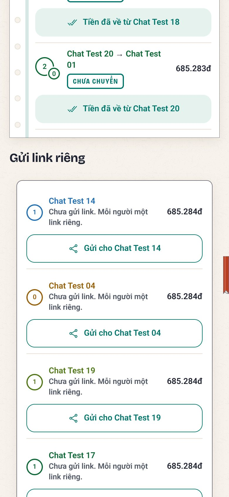 (hàng `TC-L32-VONGDOI`) |
| Source | `dot-thu/DotThuLive.tsx:160–161`. `Share.share` của react-native-web trả về `navigator.share(...)`, giải quyết với `undefined`, nên `ketQua.action` ném TypeError; không có `navigator.share` thì reject. Lỗi rơi vào `loiRaChu` → `thongDiepNguoiDoc(0)` = `LOI_KHONG_NOI_DUOC` (`src/api.ts:291`). Câu hiện ở `DotThuLive.tsx:207`, đầu trang |
| Hậu quả | Link khách chỉ có một bản, giữ trên máy đã phát (`dot-thu/kho-link.ts`). Người tổ chức phát đợt trên web, ở trình duyệt không có Web Share, không gửi được link nào, kể cả khi sang máy khác. Người nợ thường không cài app và không nhận được phần của mình |
| Đề xuất sửa | Web: không có `navigator.share` thì hiện «Chép link» (clipboard); coi `undefined` là đã mở khay; `AbortError` là người dùng đóng, không phải lỗi; câu lỗi đặt cạnh hàng vừa chạm |
| Tiêu chí gỡ | Ba trường hợp trên: (a) chép được link, (b) hàng ghi «Đã mở khay chia sẻ», (c) không có câu lỗi |

### UI-050 · Bàn gán món: từ 9 người tên đè hình nhân; nhóm 20 người chạm một ghế lại đổi ghế bên cạnh

| Trường | Nội dung |
|---|---|
| Category / Severity | UX ISSUE (thao tác trên tiền) · **P2** |
| Feature / Screen | F04 · bước 3 «Ai dùng món nào?» (`ui/BanGanMon.tsx`, `ui/hinh-tien.ts` `viTriGhe`) |
| Nền tảng, cấu hình | web, C1, C2, C6 (nhóm 20 người, runtime); 288–700dp (tính bằng hàm của app) |
| Điều kiện | Nhóm chat-test 20 thành viên (app cho phép), món đầu «cả nhóm» |
| Tái hiện | Mở bước 3; chạm vào giữa hình nhân «Chat Test 07» |
| Expected | Chạm vào hình nhân nào thì đúng ghế đó đổi; tên đọc được. PRODUCT.md: nhóm 4 tới 10 người |
| Actual | Runtime: tâm hình nhân của 10/20 ghế ở C1, 17/20 ở C2, 6/20 ở C6 nằm dưới ghế khác (`elementFromPoint`); chạm thật vào «Chat Test 07» đổi «Chat Test 08». Tên ghế nào cũng thành «Chat Test …». Tính bằng `viTriGhe` với chính vị từ của `tests/hinh-tien.test.mjs`: n ≤ 8 không chỗ nào đè; n = 9 tên đè hình nhân 2 chỗ, n = 10 4 chỗ (288–358dp); n ≥ 12 tên đè tên; n ≥ 16 hình nhân đè nhau. Với 8 người (Team Đà Lạt), chạm và kéo thẻ đều đạt (`TC-F04-BAN-CHAM`, `TC-F04-BAN-KEO`) |
| Evidence | 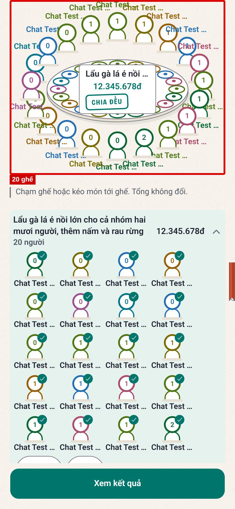 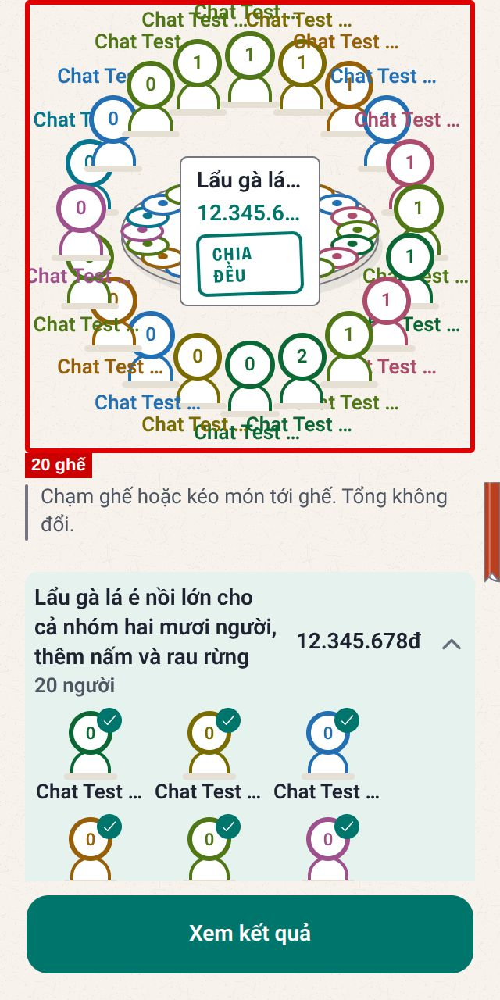 (hàng `TC-F04-BAN-20`, `TC-F04-BAN-HINH`) |
| Source | `ui/hinh-tien.ts` `viTriGhe`: ghế đặt đều trên một elip có bán kính trần 170, mỗi ghế rộng `RONG_GHE` 72; `tests/hinh-tien.test.mjs:35` và `:57` chỉ lặp `n = 1…8` |
| Hậu quả | Ở nhóm đông, chạm nhầm là gán món cho người khác; phải kiểm lại bằng danh sách bên dưới. Ở nhóm 9–10 người tên bị che |
| Đề xuất sửa | Từ 9 người thì xếp ghế hai vòng hoặc thu nhỏ, hoặc để danh sách «tên · món» (`RosterPicker`) làm lối chính; mở rộng test tới n = 20 |
| Tiêu chí gỡ | Vị từ của `hinh-tien.test.mjs` xanh với n tới 20 ở 288–700; chạm tâm mỗi hình nhân trúng đúng ghế |

### UI-051 · Chia bill: lý do không đi tiếp được và lỗi máy chủ hiện ở đầu trang, ngoài tầm nhìn

| Trường | Nội dung |
|---|---|
| Category / Severity | UX ISSUE · **P2** |
| Feature / Screen | F04 · `/smart-split/[id]/review`: bước 2, bước 3 và bước xem ảnh |
| Nền tảng, cấu hình | web, C1 |
| Tái hiện | (1) Bill 6 món, một món không tên, cuộn xuống, chạm «Tiếp: ai dùng món nào?». (2) Bước 3, «Bỏ hết» ở một món, chạm «Xem kết quả». (3) Máy chủ trả 503 khi tạo bill, chạm «Tiếp». (4) Chọn ảnh bill, «Dùng ảnh này» khi máy chủ không đọc được ảnh |
| Expected | Lỗi là một câu cạnh chỗ vừa bấm (DESIGN.md); hoặc nút tự giải thích ngay tại chỗ |
| Actual | Cả bốn: màn ở nguyên bước, nút không mờ, câu lý do hoặc câu lỗi hiện ở đầu trang ngoài khung nhìn (y −248 và −194; −256; −578; −89). Phần thấy được không đổi gì. Ở (2) hàng món có chữ «Chưa chọn người» màu cảnh báo, nhưng câu chính ở đầu trang. Thêm: câu ở (2) ghi «còn 12.345.678 chưa có người trả», thiếu «đ» |
| Evidence | 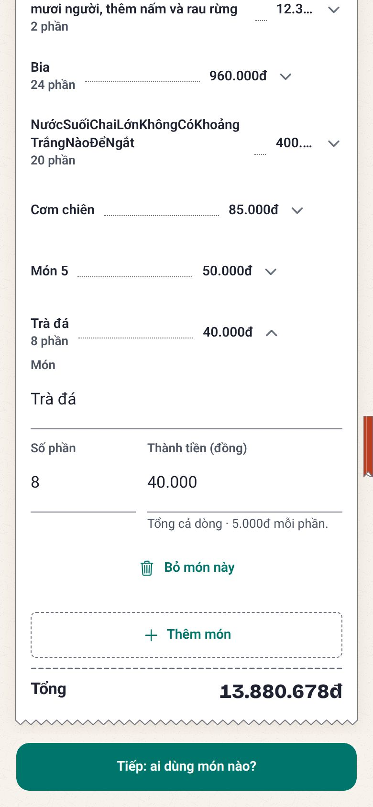 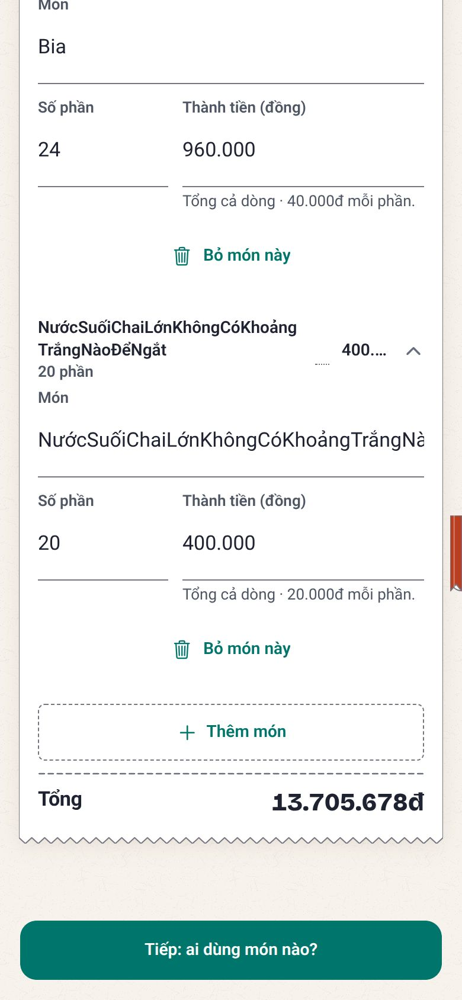 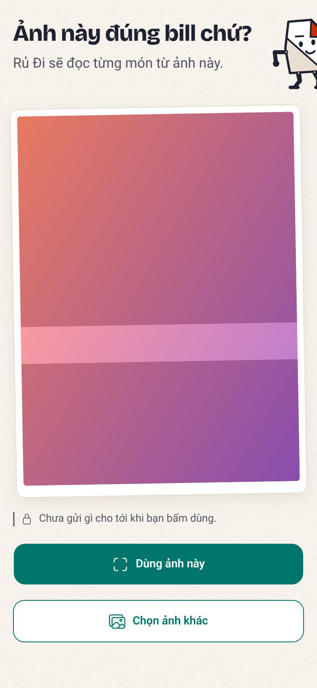 (hàng `TC-F04-CHAN-TEN`, `TC-F04-CHAN-NGUOI`, `TC-F04-BILL-503`) |
| Source | `chia-bill/ChiaBillLive.tsx:374` (`thongBao` ngay dưới `Stepper`, đầu trang); `Stepper` in `lockedReason` cũng ở đầu; nút chân `nutChinh` (dòng 352) chỉ `disabled={ban}`; `src/assignment.ts:206` (`formatVnd(con)` không kèm «đ») |
| Hậu quả | Người dùng chạm mà không thấy gì, dễ chạm lại hoặc nghĩ app treo; với lỗi máy chủ thì không biết đã ghi hay chưa |
| Đề xuất sửa | Đặt câu lý do và câu lỗi ngay trên nút ở chân trang (vùng `footer`), hoặc cuộn tới câu và đưa focus vào đó |
| Tiêu chí gỡ | Bốn trường hợp trên: câu nằm trong khung nhìn ngay sau khi chạm |

### UI-052 · Chia bill: về bước 1, Back trình duyệt hay tải lại đều mất bill đang gõ

| Trường | Nội dung |
|---|---|
| Category / Severity | UX ISSUE (mất dữ liệu người dùng vừa nhập, chưa ghi) · **P2** |
| Feature / Screen | F04 · `/smart-split/[id]/review` |
| Nền tảng, cấu hình | web, C1. Native: Back phần cứng Android rời route như Back trình duyệt (STATIC: màn không có `BackHandler` hay `beforeRemove`) |
| Tái hiện | (1) Gõ bill 3 món, «Quay lại» của đầu màn tới bước 1, chạm «Nhập tay». (2) Ở bước 3 bấm Back của trình duyệt, rồi Forward. (3) Ở bước 3 tải lại trang |
| Expected | Bill đã gõ còn, hoặc có câu hỏi trước khi bỏ |
| Actual | (1) «Quay lại» lùi 4 → 3 → 2 và giữ bill (đạt, `TC-F04-LUI-TRONG`). Nhưng từ bước 2 về bước 1 thì bước 1 chỉ có «Chọn ảnh bill», «Nhập tay», «Cách chia», và «Nhập tay» mở một bill trống. (2) Back đưa về `/plan`; Forward mở lại bước 1, bill mất. (3) Tải lại về bước 1, không câu nào nhắc bill vừa làm. Bản nháp đã gửi lên máy chủ (`POST /bills`) ở lại mồ côi: không route nào liệt kê bill theo nhóm |
| Evidence | 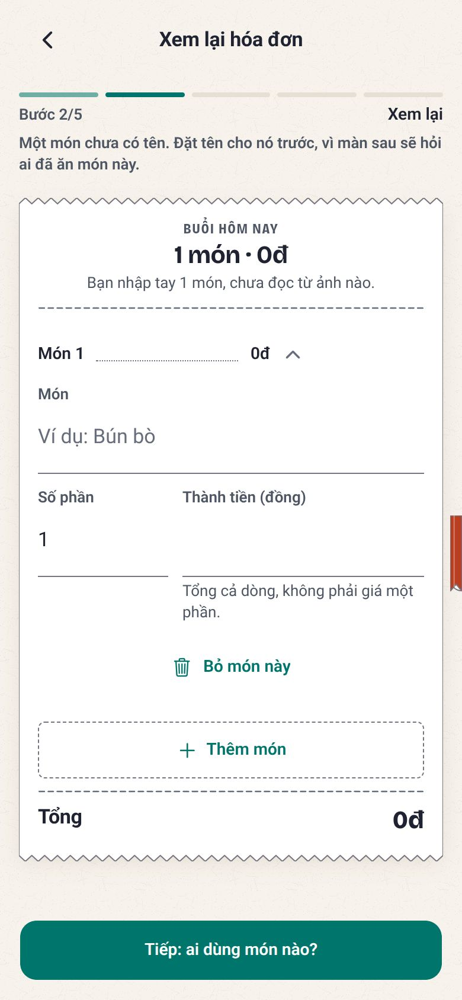 (hàng `TC-F04-LUI-VE-BUOC1`, `TC-F04-BACK-TRINH-DUYET`, `TC-F04-TAI-LAI`) |
| Source | `chia-bill/ChiaBillLive.tsx:183` (bước là state, không nằm trong URL); `quayLai` (dòng 337) lùi `xem-lai` về `bat-dau`; `nhapTay` (dòng 282) thay bill bằng `hoaDonTrong()` |
| Hậu quả | Một bill dài phải gõ lại từ đầu sau một cú Back quen tay |
| Đề xuất sửa | Bước 1 giữ lối «Tiếp tục bill đang gõ» khi đã có món; hỏi trước khi bỏ; đưa bước vào URL (`?buoc=`) hoặc giữ nháp trong bộ nhớ phiên để Back và tải lại lấy lại được |
| Tiêu chí gỡ | Ba thao tác trên không làm mất món nào mà không hỏi |

### UI-053 · Web: ô chọn dựng bằng Pressable (checkbox, radio) không đổi bằng phím Space

| Trường | Nội dung |
|---|---|
| Category / Severity | BUG (accessibility, web) · **P3** |
| Feature / Screen | F04 · ghế ở bàn gán món và ô «tên · món» bên dưới. Cùng cơ chế ở mọi Pressable có `accessibilityRole` checkbox, radio hoặc switch (12 chỗ trong `src`) |
| Nền tảng, cấu hình | web, C1 |
| Tái hiện | Tab tới ghế đầu (nhận focus, `tabindex` 0), bấm Space, rồi Enter. Làm tương tự với một ô «Minh Anh · …» |
| Expected | Checkbox đổi bằng Space (WAI-ARIA) |
| Actual | Space không đổi gì ở cả hai; Enter thì đổi |
| Evidence | Hàng `TC-F04-BAN-PHIM` (đọc `aria-checked` trước và sau phím) |
| Source | react-native-web `modules/usePressEvents/PressResponder.js:66–71`: `isValidKeyPress` chỉ nhận Space khi phần tử là `button` hoặc `role="button"` |
| Hậu quả | Người dùng bàn phím và trình đọc màn hình trên web gặp checkbox không theo quy ước |
| Đề xuất sửa | Helper trong kit bắt `onKeyDown` Space cho các role checkbox, radio, switch trên web |
| Tiêu chí gỡ | Space đổi `aria-checked` ở ghế và ô danh sách |

### UI-054 · Sơ đồ quyết toán: từ 10 người, nhãn tên đè nhau và tràn mép

| Trường | Nội dung |
|---|---|
| Category / Severity | VISUAL POLISH · **P3** |
| Feature / Screen | F04 · `/settlements/[id]` (`ui/SoDoChuyen.tsx`, `ui/hinh-tien.ts` `soDoChuyen`) |
| Nền tảng, cấu hình | web, C1, C2 (nhóm 20 người, runtime); 288–398dp (tính) |
| Actual | 20 người: 25 cặp nhãn đè nhau ở C1, 32 ở C2; nhãn đầu và cuối hàng ra ngoài mép màn. Tính với dải tên 72dp của test repo: tới 9 người không đè; 10 người có 4 cặp đè và 2 nhãn ra ngoài khung ở mọi bề rộng điện thoại; ở 398dp bắt đầu từ 12 người. Danh sách «Các khoản chuyển» bên dưới vẫn đọc trọn, số tiền không bị cắt |
| Evidence | 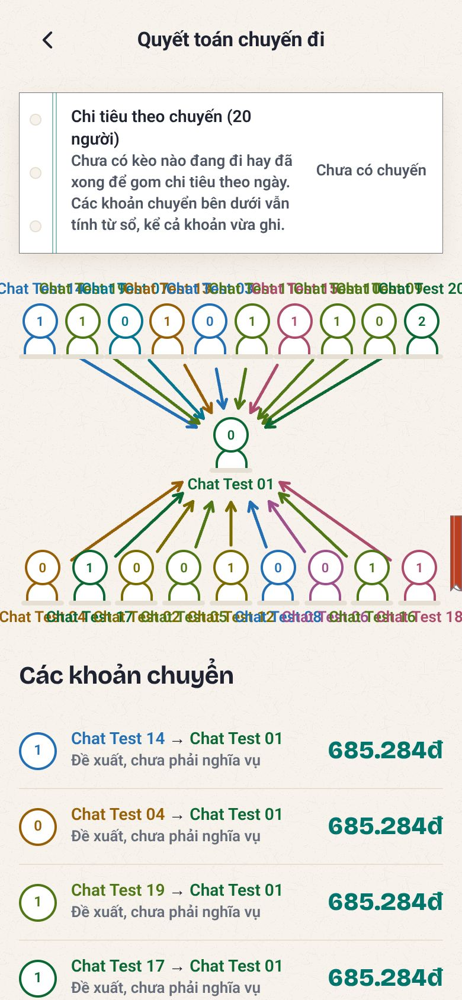 (hàng `TC-F04-QT-20`, `TC-F04-SO-DO-HINH`) |
| Source | `ui/hinh-tien.ts` `hang()` (x = w·(i+0.5)/n, không có trần số người mỗi hàng); nhãn rộng 88 (`SoDoChuyen.tsx`, `styles.nhan`); test repo dựng tối đa 6 người trả |
| Hậu quả | Sơ đồ, phần kể chuyện của màn, thành một chuỗi chữ đè ở nhóm đông. Không mất thông tin vì danh sách còn đó |
| Đề xuất sửa | Ở điện thoại, chia hàng khi quá khoảng 4 người một hàng, hoặc chỉ hiện chữ cái đầu khi chật |
| Tiêu chí gỡ | Nhóm 10 người ở 288–398: 0 cặp nhãn đè, 0 nhãn ra ngoài khung |

### UI-055 · Nếp M2 ở bước xem ảnh bill bị đẩy ra ngoài màn

| Trường | Nội dung |
|---|---|
| Category / Severity | VISUAL POLISH · **P3** |
| Feature / Screen | F04 · bước xem trước ảnh («Ảnh này đúng bill chứ?») |
| Nền tảng, cấu hình | web, C1, C2, C3 (đạt ở C6) |
| Actual | Hộp Nếp M2 luôn ở x 321–433 vì tiêu đề giữ bề rộng 293px: ra ngoài màn 43px ở C1, 73px ở C3; ở C2 nằm hẳn ngoài màn, không thấy Nếp. Ở C2 tiêu đề chạm x 309, qua lề phải 16dp |
| Evidence | 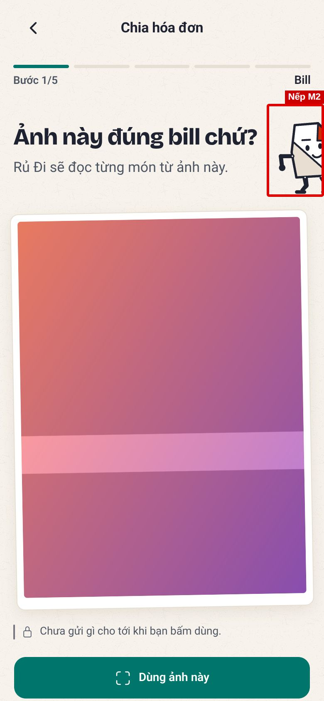 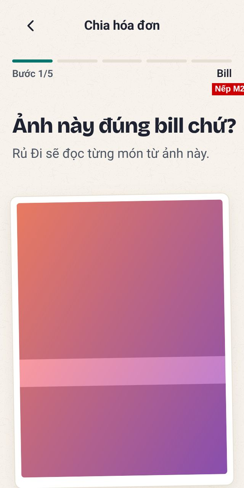 (hàng `TC-F04-NEP-M2-KHUNG`) |
| Source | `chia-bill/ChiaBillLive.tsx:429` (hàng `hangDau` gồm `Heading` và `NepDien`; style dòng 748 không cho `Heading` co) |
| Hậu quả | Khoảnh khắc M2 (Nếp giơ máy ảnh) mất hoặc bị cắt đúng trên điện thoại; trái luật `NepDien` «chiếm chỗ riêng trong bố cục» |
| Đề xuất sửa | `Heading` `flex: 1` trong hàng này, để co và xuống dòng |
| Tiêu chí gỡ | Hộp Nếp M2 nằm trọn trong màn ở C1–C3 |

### UI-056 · Đọc ảnh bill không được: câu khuyên nhập tay nhưng bước này không có nút «Nhập tay»

| Trường | Nội dung |
|---|---|
| Category / Severity | UX ISSUE · **P3** |
| Feature / Screen | F04 · bước xem ảnh |
| Nền tảng, cấu hình | web, C1; máy chủ chưa cấu hình khoá đọc bill, trả 503 sau 91 ms |
| Actual | Câu «Rủ Đi chưa bật phần đọc bill từ ảnh. Đây là lỗi phía Rủ Đi, không phải ảnh bạn chụp. Bạn có thể nhập món bằng tay.» (ngoài màn, xem UI-051). Nút trên màn: «Quay lại», «Dùng ảnh này», «Chọn ảnh khác»; muốn nhập tay phải lùi về bước 1. «Dùng ảnh này» vẫn mời gửi lại |
| Evidence |  (hàng `TC-F04-ANH-DOC`) |
| Source | `chia-bill/ChiaBillLive.tsx:427–440` (bước `xem-anh` chỉ có hai nút); `chia-bill/hoa-don.ts:129` (`cauSauKhiScanHong`) |
| Đề xuất sửa | Khi đọc hỏng, đặt nút «Nhập tay» cạnh câu; ẩn «Dùng ảnh này» khi lỗi là cấu hình máy chủ |
| Tiêu chí gỡ | Sau khi đọc hỏng, lối nhập tay có ngay trên màn |

### UI-057 · Mép Nếp ở màn tiền là nút «chạm để kéo ra» nhưng chạm không làm gì

| Trường | Nội dung |
|---|---|
| Category / Severity | UX ISSUE (accessibility) · **P3** |
| Feature / Screen | F04 · mọi màn trong `MAN_NEP_LUI` (`finance`, `settlements`, `batches`, `smart-split`) |
| Nền tảng, cấu hình | web, C1 |
| Actual | Mép 56×64, `role=button`, `tabindex=0`, nhãn «Nếp đang cài trong mép sổ, chạm để kéo ra». Chạm, rồi Enter khi có focus: Nếp không ra, không có bảng. Đúng luật «Nếp Không Chạm Số», nhưng nhãn và vai trò hứa một việc màn này cố ý không làm |
| Evidence | 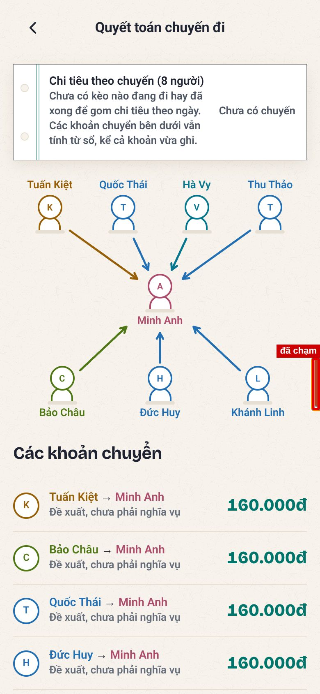 (hàng `TC-F04-NEP-MEP`) |
| Source | `nep/trang-thai.ts:131` (`cham` bị bỏ qua khi `luiLai`); nhãn ở `nep/NepDock.tsx:240–241` |
| Đề xuất sửa | Ở màn tiền: bỏ vai trò nút và khỏi thứ tự Tab, hoặc đổi nhãn thành trạng thái |
| Tiêu chí gỡ | Ở màn tiền, không phần tử nào có nhãn hứa hành động mà không làm |

### UI-058 · «Tạo đợt thu từ sổ» vẫn hiện khi mọi khoản đã vào đợt

| Trường | Nội dung |
|---|---|
| Category / Severity | UX ISSUE · **P3** |
| Feature / Screen | F04 · `/settlements/[id]` |
| Nền tảng, cấu hình | web, C1 |
| Điều kiện | Team Đà Lạt: khoản duy nhất đã nằm trong đợt đã phát; 7 khoản chuyển chưa về |
| Actual | Nút hiện kèm câu «Gom mọi khoản đã ghi mà chưa vào đợt nào…». Chạm: máy chủ từ chối (409 `no_unbatched_allocations`); câu «Sổ chưa có khoản nào để thu…» hiện đúng, ngay trên nút; số đợt 1 → 1 |
| Evidence | 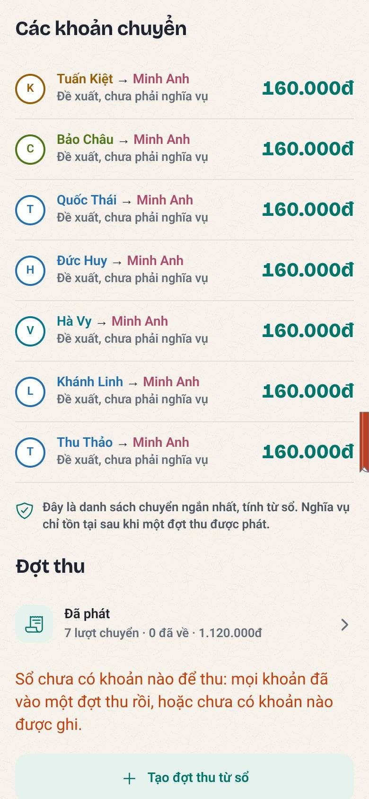 (hàng `TC-F04-DOT-RONG`) |
| Source | `screens/Bill.tsx:556` (nút hiện khi `du.chuyenTien.length > 0`; danh sách chuyển tính từ số dư, gồm cả khoản đã vào đợt) |
| Đề xuất sửa | Chỉ hiện nút khi có khoản chưa vào đợt; nếu không, nói «mọi khoản đã vào đợt» và dẫn tới đợt đó |
| Tiêu chí gỡ | Sổ không còn khoản ngoài đợt thì không có nút mời một việc chắc chắn bị từ chối |

### UI-059 · Trang «Đã ghi sổ»: dòng người trả bị cắt mất «(trả)»

| Trường | Nội dung |
|---|---|
| Category / Severity | UX ISSUE · **P3** |
| Feature / Screen | F04 · bước 5 «Ghi sổ» |
| Nền tảng, cấu hình | web, C1 |
| Actual | «Chat Test 01 (trả)», tên 12 ký tự, hiện «Chat Test 0…»: phần bị cắt đúng là dấu hiệu ai đã trả. Các dòng khác đọc trọn |
| Evidence | 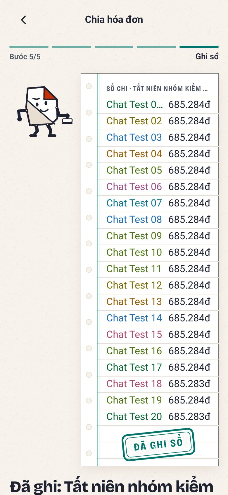 (hàng `TC-F04-DA-GHI-TRA`) |
| Source | `chia-bill/ChiaBillLive.tsx:710` (ghép «(trả)» vào cuối tên); `ui/TrangSo.tsx:81` (`numberOfLines={1}`) |
| Đề xuất sửa | Đưa «đã trả» thành nhãn riêng, không nằm trong phần có thể bị cắt |
| Tiêu chí gỡ | Ở C1–C3, dòng người trả luôn thấy chữ «trả» |

### UI-060 · Tài chính: mục «Chi theo nhóm» không có hàng nào

| Trường | Nội dung |
|---|---|
| Category / Severity | UX ISSUE · **P3** |
| Feature / Screen | F04 · `/finance` |
| Nền tảng, cấu hình | web, C1–C7 |
| Actual | Tiêu đề «Chi theo nhóm» có nút «Xem quyết toán», bên dưới chỉ có câu «Người khác đang nợ bạn 1.120.000đ. Số này đọc từ sổ cái…», không có số theo nhóm nào |
| Evidence | 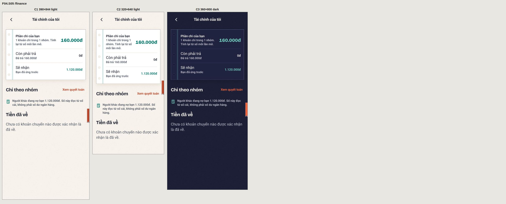 |
| Source | `screens/Profile.tsx:403–413`; wire `Finance` (`screens/ca-nhan/tai-chinh.ts:33–47`) không có trường theo nhóm |
| Đề xuất sửa | Đổi tiêu đề cho khớp điều mục thật nói, hoặc thêm số theo nhóm khi máy chủ có |
| Tiêu chí gỡ | Tiêu đề mục khớp nội dung bên dưới |

### UI-061 · Quyết toán ở 320dp: dòng đầu sổ ép lời giải thích thành 9 dòng hẹp

| Trường | Nội dung |
|---|---|
| Category / Severity | VISUAL POLISH · **P3** |
| Feature / Screen | F04 · `/settlements/[id]` |
| Nền tảng, cấu hình | web, C2 (C1 5 dòng, C3 7 dòng) |
| Actual | Tiêu đề và câu giải thích dồn vào cột trái vì trạng thái «Chưa có chuyến» giữ cột phải; ở C2 thành 9 dòng |
| Evidence | 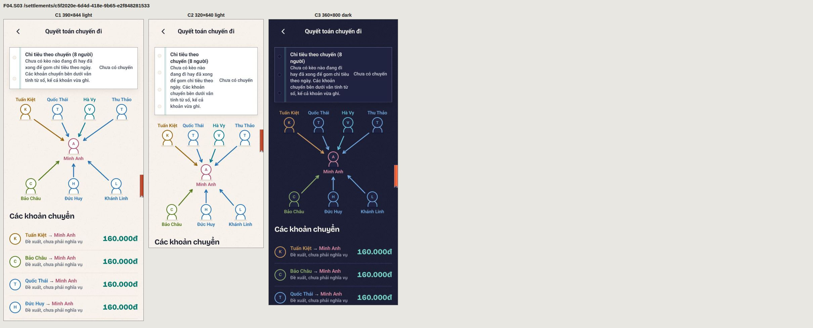 |
| Source | `screens/Bill.tsx:488` (`hangDauSo`, hai cột cố định) |
| Đề xuất sửa | Khi không có số (`hero.laSo` sai), đặt trạng thái dưới câu thay vì chia cột |
| Tiêu chí gỡ | Ở C2 câu giải thích ≤ 5 dòng |

## F05 Tin nhắn · Chat

Người yêu cầu xem chat trên web và so với Messenger (27/09). Họ nêu năm điểm:
- bong bóng tin xuất hiện ở đâu;
- giờ hiện thế nào;
- chữ trong ô soạn nằm trên, còn phần dưới ô bị dư;
- «+» và nút gửi không thẳng hàng;
- tin dài «rớt xuống dưới».

Họ cũng chê thẻ bình chọn «chưa sáng tạo, chưa đẹp mắt». Mỗi điểm được đo thành số trong
`kich-ban/f05-chat.mjs` (phần `bo-cuc`, `soan`, `bong-dai`, `phieu`) rồi ghi thành issue dưới đây:
- UI-062: ô soạn và tin dài trong ô;
- UI-063: tin dài trong bong bóng;
- UI-064: avatar và giờ;
- UI-065: thẻ bình chọn.

Nhận xét thẩm mỹ của người yêu cầu được ghi nguyên văn là phán đoán của họ. Phần có thể kiểm là số đo đi kèm.

### UI-062 · Web: ô soạn tin là textarea 2 hàng không cao lên; chữ nằm trên, lệch 20px so với «+» và nút gửi

| Trường | Nội dung |
|---|---|
| Category / Severity | BUG (bố cục web trái với chính ý đồ ghi trong mã) · **P2**: khi gõ tin dài, phần lớn chữ khuất, phải cuộn trong một ô 64px |
| Feature / Screen / Layer | F05 · `/groups/[id]/chat` (nhóm và chat hai người) · ô soạn |
| Nền tảng, cấu hình | web, mọi cấu hình đã chụp (C1–C7, C9). Đo số ở C1. Native: Android có `textAlignVertical: "center"` và ô multiline tự cao lên, nên dòng đơn nằm giữa (STATIC). iOS không có `textAlignVertical`: một dòng 24px trong ô `minHeight` 48 có thể lệch khoảng 8px (HYPOTHESIS, chưa đo) |
| Người yêu cầu nêu | «chỗ box nhắn tin sao mà nó bị ở trên trong khi đó box bị dư ra ở dưới», «các dấu cộng dấu gửi không aligned», «tin nhắn dài bị rớt xuống dưới» |
| Tái hiện | Mở một chat. (a) Nhìn ô soạn trống. (b) Gõ 7 dòng, Enter giữa các dòng |
| Expected | Như Messenger và như chú thích trong mã («the composer grows with its text, so one line sits in the middle of the pill»): một dòng nằm giữa viên thuốc, cùng đường giữa với «+» và nút gửi. Ô cao dần theo chữ tới trần 120 rồi mới cuộn |
| Actual | (a) Ô cao 64 (2 hàng), viên thuốc 78. Giữa dòng chữ ở y 785, giữa «+» và nút gửi ở y 805: lệch 20px. Dư 32px dưới dòng chữ. (b) 7 dòng: ô vẫn 64, chữ cuộn trong ô, chỉ thấy khoảng 2,5 dòng, dòng trên cùng bị mép cắt ngang. Enter xuống dòng, không gửi (tin trong nhóm 42 → 42) |
| Evidence | 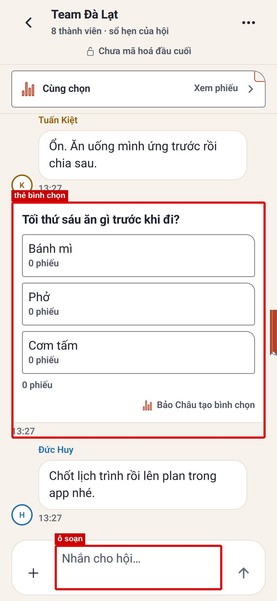 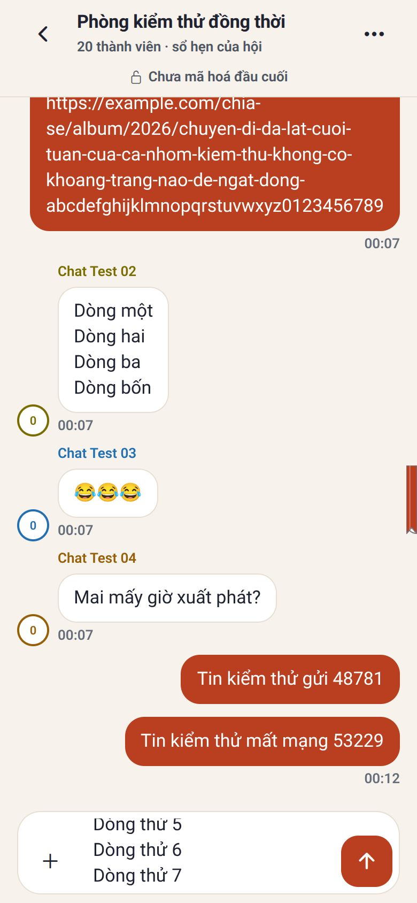 (hàng `TC-F05-SOAN-CAN`, `TC-F05-SOAN-NHIEU-DONG`, `TC-F05-BO-CUC-TIN` G8 và G20: cùng số đo) |
| Source | `screens/chat/GroupChatLive.tsx:967` (`TextInput multiline`, không truyền `rows`), `:1082` (`oNhap`: `minHeight` 48, `maxHeight` 120, `textAlignVertical: "center"`), `:1077` (`soan`: `alignItems: "flex-end"`). react-native-web 0.21 `TextInput`: `rows = multiline ? rows ?? numberOfLines : 1`. Thiếu cả hai thì `<textarea>` không có `rows`, trình duyệt lấy mặc định 2 hàng. Textarea không tự cao lên. `textAlignVertical` chỉ có ở Android |
| Hậu quả | Cảm giác ô soạn «lệch» ở mọi màn chat trên web. Tin nhiều dòng không đọc lại được trước khi gửi, trừ khi cuộn trong ô 64px |
| Đề xuất sửa | Trên web truyền `rows={1}`. Tự đổi chiều cao theo `onContentSizeChange` (RNW có phát cho multiline), kẹp 48–120. Khi chỉ có một dòng, căn «+» và nút gửi theo giữa ô |
| Tiêu chí gỡ | Web C1: ô trống thì giữa dòng chữ lệch ≤ 4px so với giữa «+» và nút gửi, không dư quá phần padding. Gõ 7 dòng thì ô cao tới 120 rồi mới cuộn |

### UI-063 · Web: bong bóng có link dài tràn khỏi cột 82%, ở 320dp mất đầu link ở mép trái

| Trường | Nội dung |
|---|---|
| Category / Severity | BUG (bố cục) · **P2**: mất nội dung ở C2. Vẫn còn đường đi tiếp: «Sao chép» trong menu tin chép đủ link |
| Feature / Screen | F05 · `/groups/[id]/chat` · bong bóng tin của mình |
| Nền tảng, cấu hình | web, C1, C2, C3, C5. Native: Android và iOS tự bẻ một từ dài hơn dòng theo ký tự (HYPOTHESIS, chưa đo) |
| Điều kiện | Tin là một URL 158 ký tự. Link chỉ có chỗ ngắt ở `-` và `/`, đoạn liền dài nhất 36 ký tự |
| Người yêu cầu nêu | «tin nhắn dài bị rớt xuống dưới». Với link dài, chữ không rớt xuống dòng mà đẩy bong bóng ra ngoài |
| Expected | Bong bóng ≤ 82% bề ngang hàng, nằm trọn trong màn; link xuống dòng ở bất kỳ ký tự nào khi cần (Messenger bẻ link dài trong bong bóng) |
| Actual | Bong bóng luôn rộng 346px, ở mọi bề rộng: C1 x 28–374 (trần 294); C2 x −42–304, mất «http» ở mép trái; C3 x −2–344, chạm mép; C5 x 68–414 (trần 326) |
| Evidence | 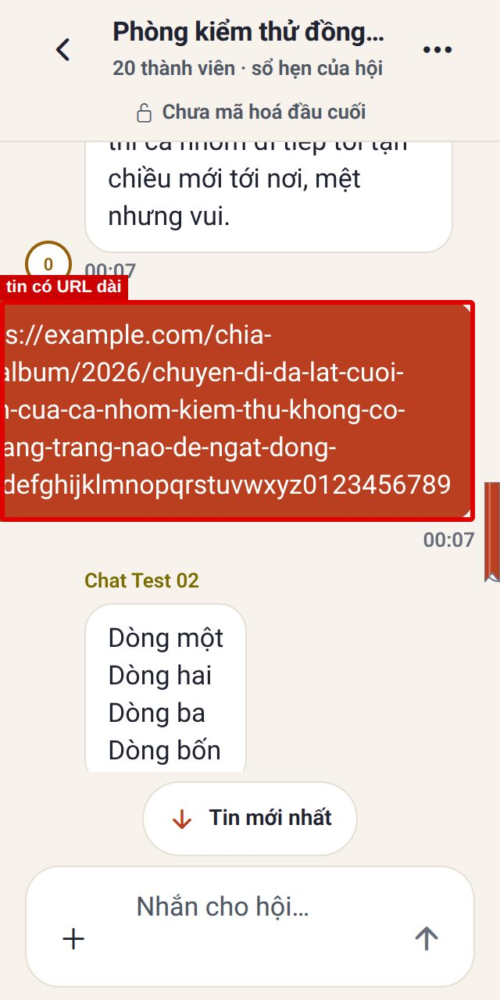 (hàng `TC-F05-URL-DAI`) |
| Source | `screens/chat/GroupChatLive.tsx:1054` (`khoi: { maxWidth: "82%" }`), `:1052` (`hangToi: justifyContent: "flex-end"`). Chữ của RNW dùng `overflow-wrap: break-word`: kiểu này không làm nhỏ bề rộng tối thiểu của phần tử flex, nên bong bóng giữ 346px và tràn khỏi cột. Tin của mình căn phải, nên phần tràn đi ra bên trái |
| Hậu quả | Link hay mã dài dán vào chat bị mất đầu trên máy hẹp. Người đọc thấy «s://example.com/…» |
| Đề xuất sửa | Chữ trong bong bóng: `overflowWrap: "anywhere"` (hoặc `wordBreak: "break-word"`) trên web, thêm `minWidth: 0` / `flexShrink: 1` cho chuỗi phần tử bọc |
| Tiêu chí gỡ | Tin trên ở C1, C2, C3, C5: bong bóng nằm trong [0, bề rộng cửa sổ] và ≤ 82% hàng |

### UI-064 · Chat: avatar đứng ngang dòng giờ, thấp hơn bong bóng 22px; giờ lặp dưới mọi cụm tin

| Trường | Nội dung |
|---|---|
| Category / Severity | VISUAL POLISH · **P3** |
| Feature / Screen | F05 · `/groups/[id]/chat` · hàng tin của người khác |
| Nền tảng, cấu hình | web, C1 (đo trong Team Đà Lạt và nhóm 20 người). Native: cùng bố cục flex (STATIC) |
| Người yêu cầu nêu | «tin nhắn box xuất hiện ở đâu rồi thời gian xuất hiện như nào», so với Messenger |
| Expected | Theo quy ước Messenger: avatar nằm cạnh bong bóng cuối của cụm, đáy avatar bằng đáy bong bóng. Giờ là một dải giữa màn khi hai cụm cách nhau một quãng; giờ của từng tin hiện khi chạm |
| Actual | Mọi avatar trên màn thấp hơn đáy bong bóng 22px, đứng ngang dòng giờ. Giờ hiện dưới mỗi cụm (cùng người trong 5 phút). Team Đà Lạt: 5 nhãn giờ trên một màn cho 11 tin, cả 5 đều «13:27». Thẻ bình chọn và thẻ tờ hẹn của người khác trải hết bề ngang, không có avatar hay tên ở đầu; tên người tạo ký ở chân thẻ |
| Evidence |  (hàng `TC-F05-BO-CUC-TIN` G8 và G20) |
| Source | `screens/chat/GroupChatLive.tsx:1051` (`hang: { flexDirection: "row", alignItems: "flex-end" }`). Avatar là anh em với cột `khoi`; cột này chứa tên, bong bóng và dòng giờ + cảm xúc (`:581–680`), nên avatar bám đáy dòng giờ. Giờ hiện khi `cuoiChuoi` (`:677`), cụm theo `cungNguoi` 5 phút (`:553`) |
| Hậu quả | Luồng tin trông lỏng và nhiều chữ thừa. Avatar không chỉ vào bong bóng nào. Lặp «13:27» năm lần không cho thêm thông tin |
| Đề xuất sửa | Đưa avatar vào hàng của bong bóng, căn đáy với bong bóng cuối. Dòng giờ và cảm xúc đặt dưới, thụt theo cột bong bóng. Giờ gom thành dải giữa màn khi hai cụm cách nhau quá N phút (N do thiết kế chốt); giờ từng tin hiện khi chạm |
| Tiêu chí gỡ | Đáy avatar = đáy bong bóng cuối của cụm ± 4px. Trong một quãng không nghỉ, trên màn chỉ có một nhãn giờ |

### UI-065 · Thẻ bình chọn trong chat: to so với nội dung, «N phiếu» lặp 4 lần, trải hết bề ngang tablet

| Trường | Nội dung |
|---|---|
| Category / Severity | VISUAL POLISH · **P3**. Người yêu cầu nhận xét «chưa được sáng tạo, chưa được đẹp mắt, quá xấu» (27/09). Đó là phán đoán thẩm mỹ của họ, ghi nguyên văn. Dưới đây là phần đo được |
| Feature / Screen | F05 · `/groups/[id]/chat` · thẻ bình chọn (`screens/chat/TheAi.tsx`), dải ghim «Cùng chọn» |
| Nền tảng, cấu hình | web, C1, C3, C6. Native: cùng mã (STATIC) |
| Actual | **0 phiếu** (Team Đà Lạt, 3 lựa chọn): thẻ cao 333px, bằng 39% chiều cao màn C1. Mỗi lựa chọn là một hộp viền 60px chỉ có tên và «0 phiếu», rồi thêm «0 phiếu» tổng: «N phiếu» 4 lần. Câu hỏi ở cỡ tiêu đề; tên người tạo ở chân thẻ. **12 phiếu** (nhóm 20 người, 7/4/1, một phiếu của người xem): thẻ cao 498px, bằng 59% màn ở C1 và 62% ở C3. Mỗi lựa chọn 88–90px, dấu vân tay 24×25, tối đa 12 dấu rồi «+N»; phiếu của mình có viền, nền đỏ nhạt, dấu tay màu mực riêng và dấu tích. Không có tỉ lệ hay phần trăm. Dải ghim «Cùng chọn · Xem phiếu» ở đầu vẫn hiện khi thẻ đang ở ngay trên màn. Ở C6 thẻ trải cả hàng 768dp: mỗi hộp lựa chọn rộng khoảng 780px, chỉ có một chữ ở góc trái. Trong chính app, màn demo `/votes/[id]` (F05.S04) đã dùng mẫu gọn hơn: một hàng có icon và vòng chọn |
| Expected | Thẻ gọn so với nội dung, đọc được bên nào hơn mà không phải đếm, số phiếu không lặp khi bằng 0, bề ngang có trần trên tablet. Đây là quy ước phổ biến (Messenger: hàng lựa chọn một dòng, thanh tỉ lệ, avatar người đã bầu), không phải spec của repo. ADR-0037 D1 chọn dấu vân tay có chủ đích («count is seen before it is read»), nên cách thể hiện là việc của thiết kế |
| Evidence |  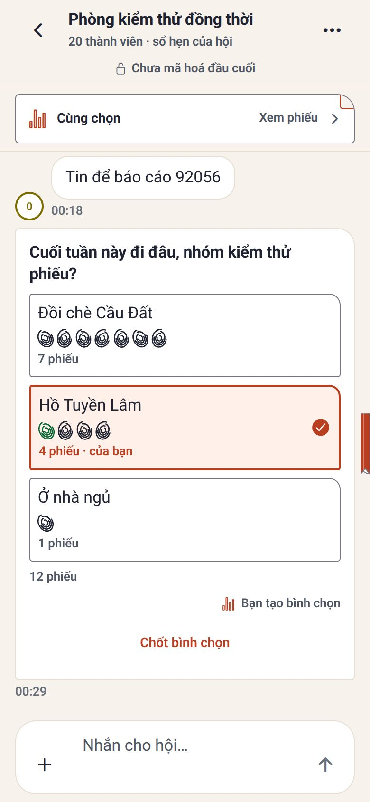 (hàng `TC-F05-BINH-CHON-THE` G8 và G20, `TC-F05-BINH-CHON-CO-PHIEU` C1/C3: đọc được và phiếu của mình nổi rõ, nên hàng này PASS; ảnh ghép C6 trong `EV-F05.S02-rong-BASE-ghep`, ngoài git) |
| Source | `screens/chat/TheAi.tsx:284–335` (mỗi lựa chọn là `Pressable` `minHeight` 52, padding 8, chữ «{so} phiếu» luôn hiện; dòng «{tong} phiếu»), `:370–384` (style, `luaChon` ở `:380`) |
| Hậu quả | Một bình chọn 3 lựa chọn đẩy gần hết cuộc trò chuyện khỏi màn điện thoại. Ở 320dp, nó chiếm cả vùng tin |
| Đề xuất sửa | Để thiết kế chốt. Hướng đo được: hàng lựa chọn một dòng (tên trái, số phải); ẩn «0 phiếu» từng hàng khi chưa ai bầu, thay bằng một câu «Chưa có phiếu». Dấu tay hoặc thanh đặt trên cùng một thang để so được. Trần bề ngang ở tablet. Ẩn dải ghim khi thẻ đang trên màn. Có thể dùng lại mẫu hàng của `/votes/[id]` |
| Tiêu chí gỡ | Bình chọn 3 lựa chọn, 0 phiếu: thẻ ≤ 25% chiều cao C1; «phiếu» xuất hiện ≤ 1 lần khi chưa ai bầu; ở C6 thẻ ≤ 560dp |

### UI-066 · Khay «Tờ hẹn chung» không đóng bằng Esc, trong khi khay công cụ ngay cạnh thì đóng

| Trường | Nội dung |
|---|---|
| Category / Severity | UX ISSUE (bàn phím, nhất quán) · **P3** |
| Feature / Screen / Layer | F05 · `/groups/[id]/chat` · L21 `ToHenChungKhay.tsx` |
| Nền tảng, cấu hình | web, C1. Nút Back: xem UI-038 |
| Tái hiện | Đóng một bình chọn, chạm «Mở tờ hẹn chung cho lựa chọn này», bấm Esc |
| Expected | Esc đóng khay như khay công cụ (L20) |
| Actual | Khay vẫn mở. Chỉ nút X đóng được. Khay chiếm nửa dưới màn, với form 5 ô và 3 nút |
| Evidence | 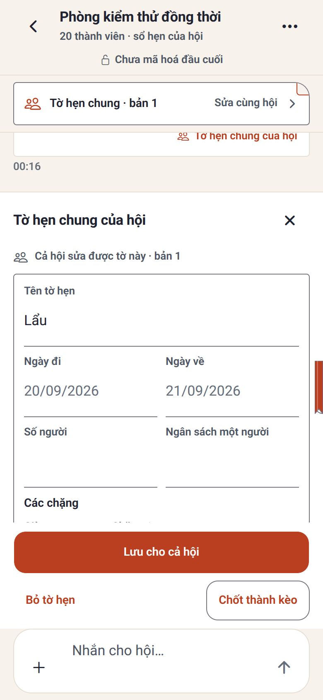 (hàng `TC-L21-VONGDOI`) |
| Source | `screens/chat/SoHen.tsx:116` bắt `Escape` cho khay công cụ. `ToHenChungKhay.tsx` không bắt phím nào và không có `BackHandler` (gắn ở `GroupChatLive.tsx:895`) |
| Đề xuất sửa | Dùng chung cơ chế đóng của khay công cụ (Esc trên web, `BackHandler` trên Android) |
| Tiêu chí gỡ | Esc đóng khay; focus về nút đã mở nó |

### UI-067 · Sheet báo cáo: lý do đang chọn chỉ khác màu nền, không có trạng thái cho trình đọc màn hình

| Trường | Nội dung |
|---|---|
| Category / Severity | UX ISSUE (accessibility) · **P3** |
| Feature / Screen / Layer | F05 · L16 báo cáo tin. Cùng component ở F06 (sheet hành động hồ sơ, `HanhDongHoSo.tsx`) và F08 (bài, `BaiChiTietScreen.tsx`) |
| Nền tảng, cấu hình | web, C1 (đo). Native: cùng mã, nút không có `accessibilityState` nào nên TalkBack/VoiceOver cũng không đọc được lý do nào đang chọn (STATIC) |
| Tái hiện | Menu một tin của người khác → «Báo cáo» → chọn «Làm phiền, quấy rối» |
| Expected | Năm lý do là nhóm chọn một: mỗi lý do là `radio` có `aria-checked`, và nhìn cũng ra là lựa chọn (vòng chọn hoặc dấu tích) |
| Actual | `radiogroup` chứa 5 `button`. Lý do đang chọn chỉ đổi nền (biến thể `soft` và `ghost`), không có trạng thái nào trong DOM. Bốn lý do còn lại trông như link chữ đỏ. axe: `aria-prohibited-attr` ×1 trong sheet. Gửi báo cáo và «Xong» hoạt động đúng |
| Evidence | 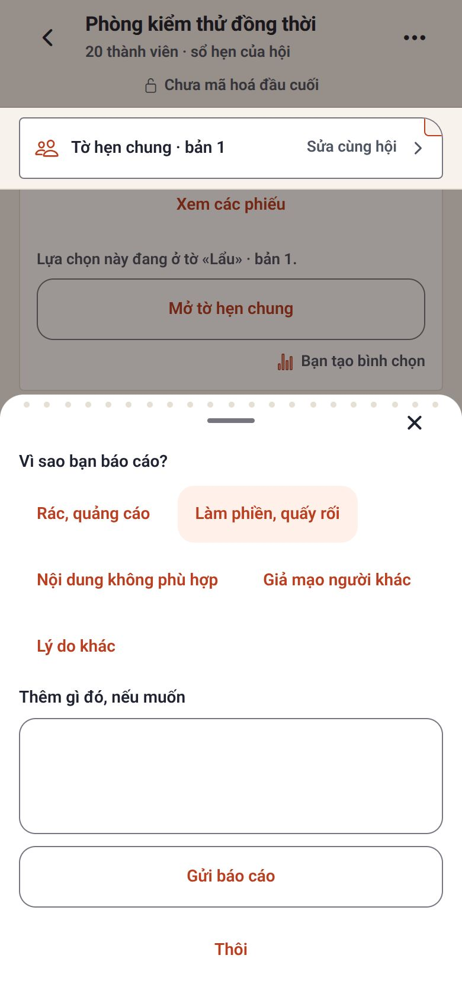 (hàng `TC-L16-VONGDOI`) · F08: sheet báo cáo bài mở và đóng ở runtime (`TC-L07-VONGDOI`); không gửi báo cáo nào, nên trạng thái lý do đang chọn chưa đo ở F08 |
| Source | `screens/nguoi/NoiDungBaoCao.tsx:76–86` (`RudiButton` với `variant={lyDo === muc.ma ? "soft" : "ghost"}`) |
| Đề xuất sửa | Mỗi lý do là `accessibilityRole="radio"` kèm `aria-checked` trên web (xem UI-003) và dấu tích; hoặc dùng component chọn một của kit |
| Tiêu chí gỡ | Quét DOM: 5 phần tử `role=radio`, đúng một cái `aria-checked=true`; axe sạch |

### UI-068 · Chat: một request tin hỏng thì hiện câu lỗi chung, không có «Thử lại», dù tin vẫn hiện đủ

| Trường | Nội dung |
|---|---|
| Category / Severity | UX ISSUE · **P3** |
| Feature / Screen | F05 · `/groups/[id]/chat` |
| Nền tảng, cấu hình | web, C1 |
| Điều kiện | `GET /contexts/{id}/messages` trả 503. Luồng thay đổi (`changes/snapshot`) vẫn chạy |
| Tái hiện | Từ Tin nhắn mở Team Đà Lạt khi request trên hỏng; 15 s sau cho máy chủ ổn lại |
| Expected | Tin vẫn tới từ luồng thay đổi, nên hoặc không báo, hoặc nói đúng phần nào chưa tải được, kèm cách thử lại |
| Actual | 11 tin hiện đủ, nhưng câu màu cảnh báo «Rủ Đi đang gặp sự cố nên chưa làm được việc này. Chưa có gì bị ghi sai, thử lại sau một chút.» đứng ngay trên ô soạn (y 722). Người dùng chưa làm «việc» nào. Câu bảo «thử lại» nhưng không có nút. Câu tự tắt 15 s sau khi máy chủ ổn (đúng) |
| Evidence | 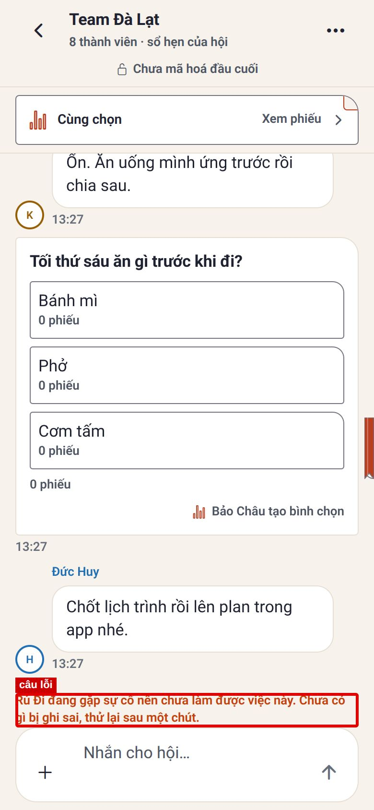 (hàng `TC-F05.S02-503`) |
| Source | `screens/chat/GroupChatLive.tsx:866–867` (`chat.loi` là một dòng chữ, không nút) |
| Đề xuất sửa | Khi đã có tin từ luồng thay đổi thì bỏ câu, hoặc nói «Chưa tải được tin cũ hơn» kèm «Thử lại» |
| Tiêu chí gỡ | Cùng điều kiện: không có câu lỗi khi tin đã hiện, hoặc câu có «Thử lại» và nói đúng phần hỏng |

### UI-069 · Thẻ thông báo «Đã hiểu» mọc ở cuối chat, ngoài tầm nhìn khi đang đọc tin cũ; trông như tin của AI

| Trường | Nội dung |
|---|---|
| Category / Severity | UX ISSUE · **P3** |
| Feature / Screen / Layer | F05 · `/groups/[id]/chat` · L22 |
| Nền tảng, cấu hình | web, C1. Native: cùng mã (STATIC) |
| Điều kiện | Máy chủ trả 503 cho cảm xúc. Thẻ này cũng nhận lỗi gửi ảnh, lỗi xoá tin và câu ý định sau khi gửi |
| Tái hiện | Cuộn lên đọc tin cũ (1400px), mở menu một tin cũ, chạm «Thích» |
| Expected | Người vừa chạm biết là chưa được: câu hiện gần tin vừa chạm hoặc trong vùng đang xem |
| Actual | Thẻ được thêm ở cuối chat, y 2086–2266, ngoài màn. Chip cảm xúc không hiện, không có gì khác báo lỗi; nút «Tin mới nhất» có từ trước. Khi đang ở cuối chat thì thẻ trong tầm nhìn (y 544–724), «Đã hiểu» 328×48 gỡ được thẻ (`TC-L22-VONGDOI` đạt). Trong cả hai trường hợp, thẻ mang biểu tượng ✦ và màu AI, đầu đề «Rủ Đi», rồi câu lại bắt đầu bằng «Rủ Đi đang gặp sự cố…»: một lỗi hệ thống trông như AI trả lời. «Việc này» cũng không nói việc nào hỏng |
| Evidence | 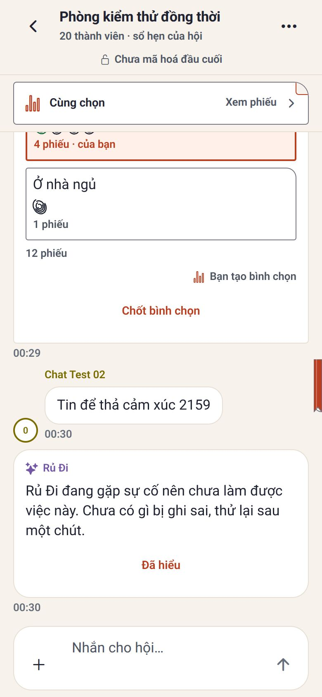 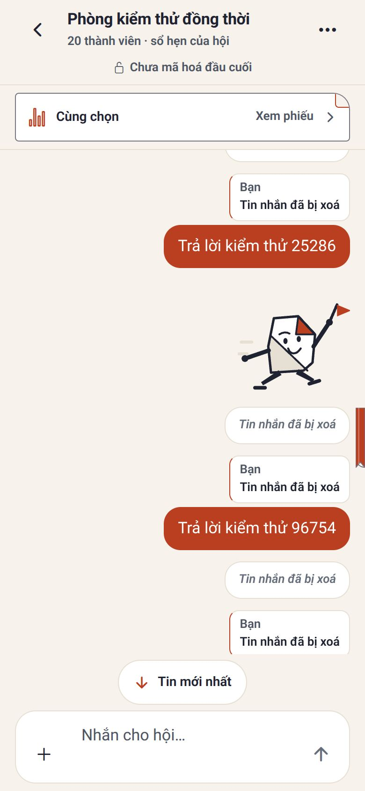 (hàng `TC-L22-KHI-DOC-CU`) |
| Source | `screens/chat/GroupChatLive.tsx:538–551` (`phanUng` → `setThongBao`), `:784–797` (thẻ với `sparkles` và `colors.ai`), `:350` (chỉ cuộn về cuối khi `ganCuoi`) |
| Đề xuất sửa | Lỗi của một thao tác trên một tin: đặt câu ngay dưới tin đó. Thẻ lỗi hệ thống không dùng dáng AI. Câu nêu đúng thao tác («Chưa thả được cảm xúc») |
| Tiêu chí gỡ | Cùng điều kiện khi đang đọc tin cũ: câu lỗi nằm trong vùng đang xem; thẻ không có biểu tượng hay màu của AI |

### UI-070 · Web: dải ghim của chat sáng trên nền mờ khi sheet đang mở; chạm vào thì chỉ đóng sheet

| Trường | Nội dung |
|---|---|
| Category / Severity | VISUAL POLISH · **P3** (cùng họ với UI-041) |
| Feature / Screen / Layer | F05 · `/groups/[id]/chat` · dải ghim, dưới mọi sheet `ui/Sheet.tsx` mở trong chat (đo với L17 Cài đặt nhóm và L18 menu tin; thấy trong ảnh L16) |
| Nền tảng, cấu hình | web, C1. Native: `zIndex` chỉ xếp các phần tử anh em nên có lẽ không bị (HYPOTHESIS) |
| Tái hiện | Nhóm có bình chọn mở hoặc tờ hẹn chung; mở «Cài đặt nhóm»; chạm vào dải «Cùng chọn · Xem phiếu» |
| Expected | Nền mờ phủ cả dải như phủ đầu chat và danh sách tin |
| Actual | Đầu chat và danh sách tin bị làm mờ, riêng dải vẫn sáng như dùng được. Chạm vào giữa dải trúng nền «Đóng»: sheet đóng, không mở phiếu |
| Evidence | 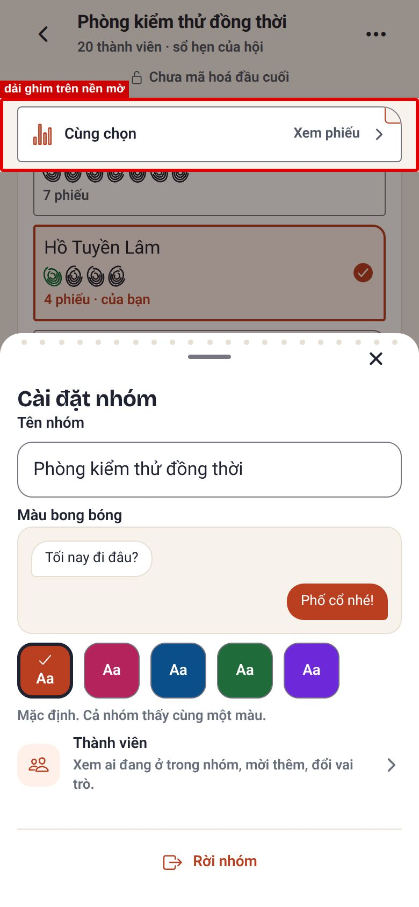 (hàng `TC-F05-GHIM-TREN-NEN`, phân xử bằng mắt) |
| Source | `screens/chat/GroupChatLive.tsx:1031` (`dayGhim: { …, zIndex: 1 }`); `ui/Sheet.tsx:178–180` (sheet là `absoluteFill` trong cây của màn, không có `zIndex`). Trên web, `z-index: 1` vẽ dải lên trên nền mờ |
| Đề xuất sửa | Bỏ `zIndex` của dải, hoặc cho lớp sheet `zIndex` cao hơn |
| Tiêu chí gỡ | Khi sheet mở, dải bị làm mờ như phần còn lại của màn |

## F06 Nhóm · Người

Mọi lần ghi của F06 đi vào tài khoản mới (`moi-51`, `moi-52`, `moi-53`) và hai người của chat seed không có nhóm
(`chat-20`, `chat-21`). Team Đà Lạt và nhóm chat-test chỉ được đọc; riêng chat-0 gửi một lời mời kết bạn tới chat-5.

### UI-071 · Lập nhóm xong bị đưa về Khám phá: không xác nhận, không thấy nhóm vừa lập, không có lối mời bạn

| Trường | Nội dung |
|---|---|
| Category / Severity | UX ISSUE · **P3** |
| Feature / Screen | F06 · `/groups/new` |
| Nền tảng, cấu hình | web, C1. Native: cùng mã điều hướng (STATIC) |
| Điều kiện | Tài khoản mới, chưa có nhóm nào |
| Tái hiện | Tin nhắn → «Tạo nhóm», gõ tên, «Mở nhóm» |
| Expected | Vào nhóm vừa lập (chat, hoặc bước mời), hoặc ít nhất một câu xác nhận kèm lối mời bạn. Chính màn này hứa «Mời bạn bè sau». Messenger mở thẳng cuộc trò chuyện mới |
| Actual | Nhóm được tạo (đúng một, kể cả khi chạm đúp), rồi app thay màn bằng Khám phá. Trên màn không có tên nhóm, không câu nào nói đã lập xong, không nút mời. Muốn mời phải tự tìm: Tin nhắn → nhóm → «⋯» → Thành viên → «Mời bằng số điện thoại» |
| Evidence | 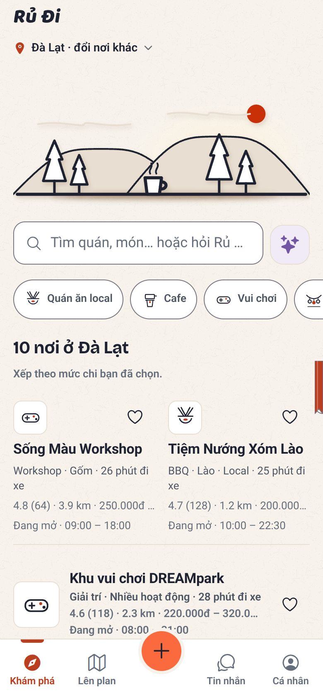 (hàng `TC-F06-TAO-SAU`) |
| Source | `screens/groups/New.tsx:62` (`router.replace(manDau(moi))`); `duong-vao.ts:145–151` (`manDau` trả `/explore` khi phiên có nhóm đang hoạt động) |
| Đề xuất sửa | Sau khi tạo, mở chat của nhóm mới (hoặc màn Mời) thay vì `manDau` |
| Tiêu chí gỡ | Sau «Mở nhóm», màn tiếp theo hiện tên nhóm vừa lập và có lối mời bạn |

### UI-072 · Mời một người đã ở trong nhóm: máy chủ nói «đã có», app lại báo «Lần bấm trước chưa chạy xong… đừng bấm lại ngay»

| Trường | Nội dung |
|---|---|
| Category / Severity | BUG (câu lỗi sai lý do) · **P3** |
| Feature / Screen | F06 · `/groups/[id]/invite` |
| Nền tảng, cấu hình | web, C1. Native: cùng bảng câu (STATIC) |
| Tái hiện | Mời số của một người đã là thành viên, dưới một tên khác lần mời trước |
| Expected | «Người này đã ở trong nhóm hoặc đã được mời rồi.» (câu này có sẵn trong app) |
| Actual | `POST /contexts/{id}/members` trả 409 `{"code":"membership_already_open"}`. App hiện câu của idempotency: «Lần bấm trước chưa chạy xong nên chưa biết đã ghi hay chưa. Chờ một chút rồi mở lại màn hình để xem, đừng bấm lại ngay.» Mời lại một số đang chờ với đúng tên cũ thì app dùng lại khoá cũ, máy chủ phát lại 201, và màn báo «Đã mời» (đúng) |
| Evidence | 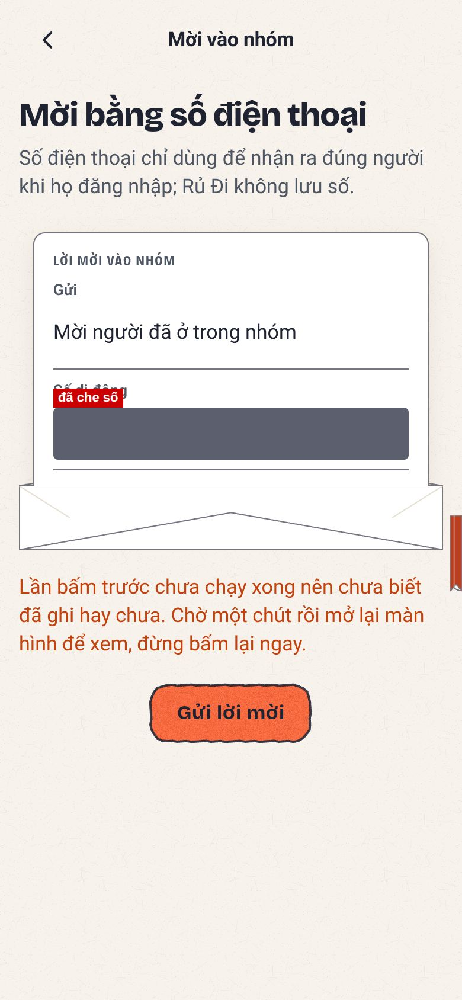 (hàng `TC-F06-MOI-THANH-VIEN`, mã HTTP ghi trong hàng; gọi thẳng API ra đúng mã và body trên) |
| Source | App: `screens/vao-cua/cong-api.ts:144–151` (`MOI_REFUSALS` chỉ có `membership_conflict`, `duplicate_membership`), rơi xuống `api.ts:314–316` (mọi 409 thành câu idempotency). Máy chủ: Go `internal/repo/contexts.go:187` (`MEMBERSHIP_ALREADY_OPEN`) và `internal/routes/contexts.go:166` (`strings.ToLower`), Python `app/api/service.py:1643` (`exc.code.lower()`) |
| Hậu quả | Người mời được dặn chờ và đừng bấm lại, trong khi không có gì đang chạy. Lý do thật (đã có trong nhóm) bị giấu |
| Đề xuất sửa | Thêm `membership_already_open` vào `MOI_REFUSALS`. Câu idempotency chỉ dùng cho mã `idempotency_request_in_flight`, không cho mọi 409 |
| Tiêu chí gỡ | Mời số của một thành viên: câu nói người này đã ở trong nhóm |

### UI-073 · Người vào bằng lời mời bỏ qua bước Sở thích; tên người mời đặt thành tên công khai mà chính chủ chưa xác nhận

| Trường | Nội dung |
|---|---|
| Category / Severity | BUG (luồng vào cửa, đồng thuận về danh tính) · **P2**. Thuộc loại quyền riêng tư/đồng thuận trong danh sách blocker của repo |
| Feature / Screen | F06 · `/groups/[id]/invite` → F01 · OTP → F05.S01 |
| Nền tảng, cấu hình | web, C1. Native: cùng máy chủ và cùng `manSauDangNhap` (STATIC) |
| Điều kiện | Số chưa từng đăng nhập, được mời vào nhóm dưới tên «Tên do người mời đặt cho số 53» |
| Tái hiện | Người được mời đăng nhập lần đầu bằng OTP qua UI |
| Expected | Tài khoản mới đi qua Sở thích («personalized lúc mới tạo acc», `duong-vao.ts:153–165`). Người đó thấy và sửa được tên người khác đặt cho mình trước khi cả nhóm thấy |
| Actual | Đăng nhập xong vào thẳng `/messages`: không qua Sở thích, không có ô tên, không thấy tên người mời đặt. Sau «Đồng ý», cả nhóm thấy họ là «Tên do người mời đặt cho số 53». Cùng cơ chế với moi-52, được mời dưới tên «Bạn thân từ hồi cấp ba của mình, người hay trễ hẹn nhất hội». Một người lạ (chat-20: không chung nhóm, không là bạn) tra số của moi-52 ở Thêm bạn cũng thấy đúng cái tên đó |
| Evidence | 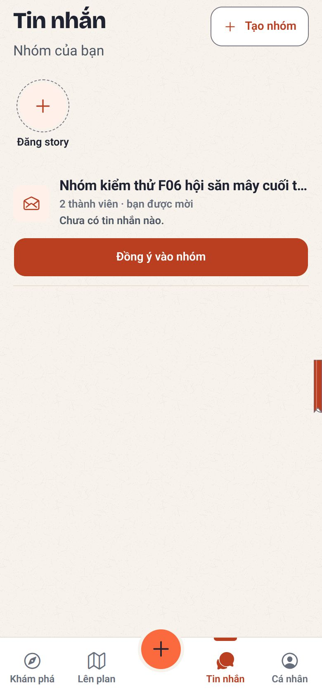 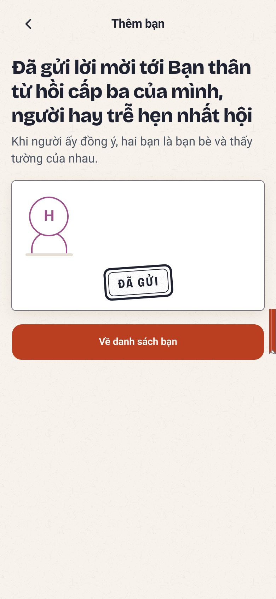 (hàng `TC-F06-DUOC-MOI-VAO-CUA`, `TC-F06-THEM-GUI`) |
| Source | Máy chủ coi người đã có hàng `people` là không mới: Python `app/api/service.py:3977` (`is_new = person is None`), Go `internal/domain/authsteps/otpdoor.go:255`. Lời mời tạo trước hàng đó kèm tên (`PUT /people/{id}` trong `groups/Invite.tsx`, «hồ sơ tạm» có chủ đích). App chỉ vào Sở thích khi `is_new_person` (`duong-vao.ts:166–176`) |
| Hậu quả | Phần lớn người dùng mới (vào qua lời mời) không bao giờ nói gu, nên gợi ý không cá nhân hoá. Họ mang một cái tên người khác đặt (có thể là biệt danh) trước cả nhóm, và trước người lạ tra số, mà không được hỏi |
| Đề xuất sửa | Máy chủ trả `is_new_person` theo «lần đăng nhập đầu của danh tính này», không theo «đã có hàng người». Hoặc app coi người chưa từng tự đặt tên là mới. Sở thích hiện ô tên điền sẵn tên người mời đặt, ghi rõ «Nhóm đang gọi bạn là …» |
| Tiêu chí gỡ | Số được mời đăng nhập lần đầu: vào Sở thích, ô tên điền sẵn và sửa được. Tra số: không lộ tên người khác đặt khi chính chủ chưa xác nhận |

Ghi chú: `main` đã đổi luật ai tra được số ở `dd75752` (sau mốc đo). Phần «người lạ thấy tên» cần đo lại ở hàng đợi sau
pipeline; phần «bỏ qua Sở thích» không liên quan tới commit đó.

### UI-074 · Quản trị tự bỏ quyền của chính mình bằng một chạm, không có bước hỏi

| Trường | Nội dung |
|---|---|
| Category / Severity | UX ISSUE (thao tác không tự hoàn tác được) · **P2** |
| Feature / Screen | F06 · `/groups/[id]/members` |
| Nền tảng, cấu hình | web, C1. Native: cùng mã (STATIC) |
| Điều kiện | Nhóm có hai quản trị; người xem là người lập nhóm |
| Tái hiện | Mở Thành viên, chạm «Bỏ quyền quản trị» trên hàng «… (bạn)» |
| Expected | Bước hỏi trước khi tự bỏ quyền: sau đó không tự lấy lại được, phải nhờ quản trị khác. Nút nói rõ là của chính mình |
| Actual | Một chạm là xong: vai trò trên máy chủ đổi `admin` → `member`, không câu hỏi nào. Nút của chính mình là nút đầu tiên trong danh sách và mang đúng tên «Bỏ quyền quản trị» như nút của người khác. Lỗi này được phát hiện vì harness chạm «Bỏ quyền quản trị» đầu tiên để hạ quyền một người khác, và trúng hàng của người lập nhóm. Đã đặt lại vai trò qua API |
| Evidence | 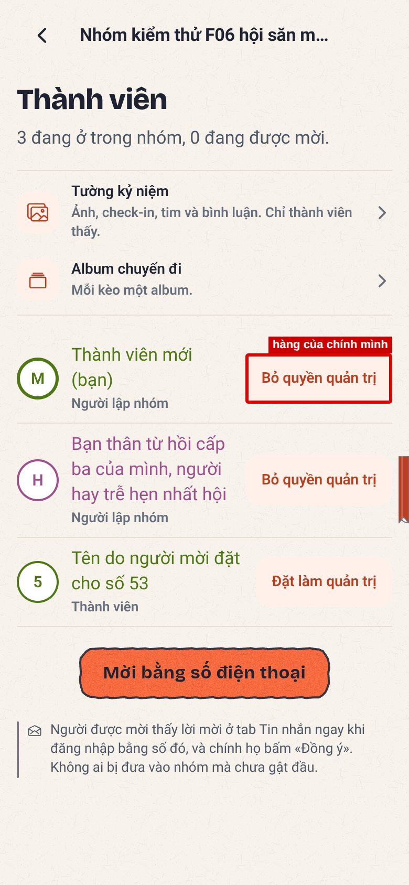 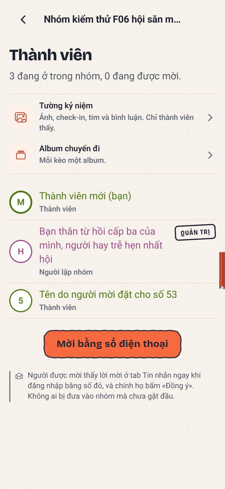 (hàng `TC-F06-TU-BO-QUAN-TRI`) |
| Source | `screens/groups/Members.tsx:79` (`doiVaiTro` gọi thẳng `datVaiTro`, không bước hỏi); `screens/quan-tri/quan-tri.ts:306` (`coTheDoiVaiTro` cho tự hạ khi còn quản trị khác), `:366` (`nhanNutVaiTro` không kèm tên) |
| Đề xuất sửa | Hỏi lại khi hạ quyền của chính mình (một câu nói hậu quả, «Bỏ quyền»/«Thôi»); nhãn và tên truy cập kèm tên người («Bỏ quyền quản trị của bạn») |
| Tiêu chí gỡ | Chạm nút trên hàng của mình: có bước hỏi; vai trò chỉ đổi sau khi xác nhận |

### UI-075 · Mọi quản trị đều mang nhãn «Người lập nhóm»

| Trường | Nội dung |
|---|---|
| Category / Severity | BUG (nhãn sai) · **P3** |
| Feature / Screen | F06 · `/groups/[id]/members` |
| Nền tảng, cấu hình | web, C1. Native: cùng mã (STATIC) |
| Tái hiện | Đặt một thành viên làm quản trị |
| Expected | Chỉ người lập nhóm mang «Người lập nhóm»; quản trị khác ghi «Quản trị» |
| Actual | Người vừa được đặt làm quản trị cũng hiện «Người lập nhóm». Sau khi người lập nhóm thật tự bỏ quyền (UI-074), chính người đó chỉ còn «Thành viên», còn nhãn «Người lập nhóm» nằm ở người khác |
| Evidence |  (hàng `TC-F06-TU-BO-QUAN-TRI`, `TC-F06-VAI-TRO`) |
| Source | `screens/groups/Members.tsx:132` (`tv.role === "admin" && tv.state === "active" ? "Người lập nhóm" : "Thành viên"`) |
| Đề xuất sửa | Ghi «Người lập nhóm» theo người tạo nhóm (nếu wire có), còn lại «Quản trị» |
| Tiêu chí gỡ | Nhóm có hai quản trị: chỉ người lập nhóm mang nhãn đó |

### UI-076 · Danh sách thành viên: 19 nút cùng tên «Đặt làm quản trị», hàng không mở được hồ sơ

| Trường | Nội dung |
|---|---|
| Category / Severity | UX ISSUE (accessibility, điều hướng) · **P3** |
| Feature / Screen | F06 · `/groups/[id]/members` |
| Nền tảng, cấu hình | web, C1 và C6. Native: nhãn là chữ của nút, cùng mã (STATIC) |
| Điều kiện | Nhóm 20 người, người xem là quản trị |
| Expected | Mỗi nút có tên riêng kèm tên người («Đặt Chat Test 07 làm quản trị»). Chạm một hàng mở hồ sơ người đó (Messenger mở thông tin thành viên) |
| Actual | 19 nút, cả 19 tên «Đặt làm quản trị» (cao 48, đạt). 21 hàng không hàng nào chạm mở được. Trong nhóm, lối tới hồ sơ một thành viên chỉ có khi đã là bạn (Bạn bè) hoặc qua bài của họ. Thêm: khi danh sách lỗi 503, phụ đề vẫn ghi «Đang đọc danh sách thành viên…» ngay trên màn lỗi |
| Evidence | 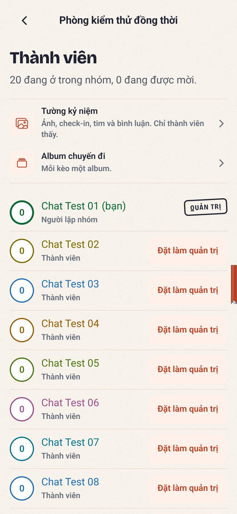 (hàng `TC-F06-THANH-VIEN-20` C1, C6; `TC-F06.S02-503`) |
| Source | `screens/groups/Members.tsx:118–150` (hàng là `View`, không `Pressable`; `RudiButton label={nhanNutVaiTro(tv)}`), phụ đề `:97–104` (mọi trạng thái khác «xong» ra câu đang đọc) |
| Đề xuất sửa | `accessibilityLabel` kèm tên người; bọc hàng bằng `Pressable` mở `/people/{id}`; phụ đề theo trạng thái lỗi |
| Tiêu chí gỡ | Quét DOM: tên các nút vai trò khác nhau; chạm hàng mở hồ sơ |

### UI-077 · Bạn bè: «Đồng ý» lỗi thì cả danh sách thành màn «Chưa đọc được danh sách bạn»

| Trường | Nội dung |
|---|---|
| Category / Severity | UX ISSUE · **P3** |
| Feature / Screen | F06 · `/friends`, phân đoạn «Đã nhận» |
| Nền tảng, cấu hình | web, C1. Native: cùng mã (STATIC) |
| Điều kiện | Một lời mời kết bạn đang chờ; `POST /friends/requests/{id}/respond` trả 503 |
| Tái hiện | Chạm «Đồng ý» |
| Expected | Một câu lỗi cạnh hàng vừa chạm, danh sách giữ nguyên, chạm lại được |
| Actual | Cả màn thành trạng thái lỗi «Chưa đọc được danh sách bạn» với câu chung. Tiêu đề sai: danh sách đọc được, thứ hỏng là câu trả lời. Hàng lời mời biến mất tới khi «Thử lại». Sau khi máy chủ ổn, «Thử lại» rồi «Đồng ý» thì thành bạn (đúng) |
| Evidence | 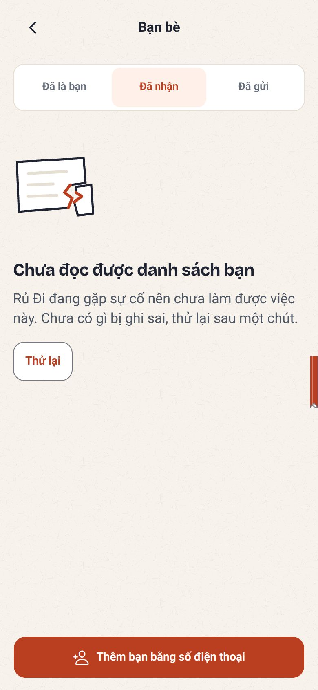 (hàng `TC-F06-DONG-Y-503`) |
| Source | `screens/friends/Friends.tsx:113–136` (`traLoi` và `nhanTin` bắt lỗi bằng `setTrang({ pha: "hong" })`, cùng trạng thái với lỗi đọc danh sách) |
| Đề xuất sửa | Lỗi của một thao tác trên một hàng thì giữ danh sách, đặt câu dưới hàng đó |
| Tiêu chí gỡ | Cùng điều kiện: danh sách còn, câu lỗi nằm cạnh hàng lời mời |

### UI-078 · Sau khi chặn: mở lại hồ sơ thì mất dấu «Đã chặn», hồ sơ ghi «Cùng nhóm», mời «Kết bạn» và mời chặn lần nữa

| Trường | Nội dung |
|---|---|
| Category / Severity | UX ISSUE · **P3** |
| Feature / Screen / Layer | F06 · `/people/[id]` · L06 |
| Nền tảng, cấu hình | web, C1. Native: cùng mã (STATIC) |
| Điều kiện | Hai người là bạn, có chat đôi, không chung nhóm nào; một người chặn người kia |
| Tái hiện | «Thêm hành động» → «Chặn …» → «Chặn»; rồi tải lại hồ sơ |
| Expected | Hồ sơ vẫn cho biết mình đã chặn người này; sheet mời «Bỏ chặn» |
| Actual | Ngay sau khi chặn: chip «Đã chặn», nhưng câu «Kết bạn để nhắn riêng.» vẫn còn ngay trên nó. Sau khi tải lại: không còn «Đã chặn»; quan hệ ghi «Cùng nhóm» dù hai người không chung nhóm nào (chỉ chung chat đôi); nút «Kết bạn» mời kết bạn với chính người vừa chặn; sheet lại mời «Chặn Chat Test 22». Bước hỏi trước khi chặn thì đạt, có nói hậu quả |
| Evidence | 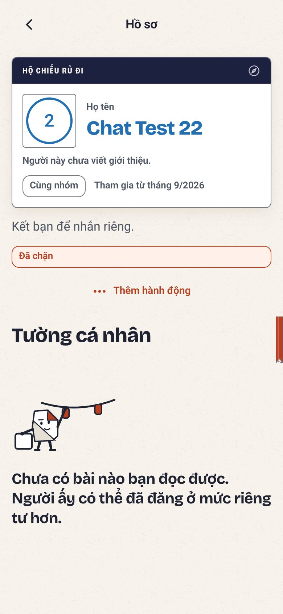 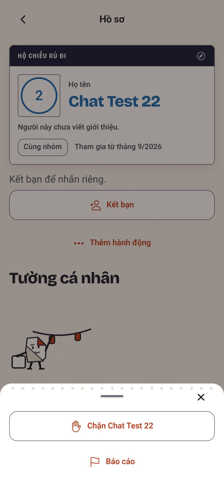 (hàng `TC-F06-CHAN`, `TC-F06-CHAN-MO-LAI`) |
| Source | `screens/nguoi/HoSoNguoiScreen.tsx:70–74` (cờ chặn là state cục bộ, theo ADR-0023 §2.3: đọc hồ sơ không cho biết mình đã chặn); quan hệ `groupmate` từ máy chủ khi hai người chỉ chung chat đôi |
| Đề xuất sửa | Đọc danh sách chặn của mình (đã có `GET /people/me/blocked`) khi mở hồ sơ, hoặc máy chủ trả cờ trong hồ sơ. Không hiện «Kết bạn» với người mình đã chặn. Không gọi chat đôi là «Cùng nhóm» |
| Tiêu chí gỡ | Tải lại hồ sơ người đã chặn: thấy «Đã chặn» và «Bỏ chặn», không thấy «Kết bạn» |

### UI-079 · Chat đôi sau khi chặn: «Đang nối lại» không dứt, vẫn mời nhắn và mời hẹn

| Trường | Nội dung |
|---|---|
| Category / Severity | UX ISSUE · **P3** |
| Feature / Screen | F05.S03 · `/groups/[id]/chat` (chat hai người) |
| Nền tảng, cấu hình | web, C1, cả hai phía. Native: cùng mã (STATIC) |
| Tái hiện | Chặn người kia (UI-078), mở chat đôi; nhìn ở giây thứ 3 và thứ 20 |
| Expected | Người chặn đọc được là mình đã chặn và cách bỏ chặn. Không còn lời mời nhắn tin hay hẹn đi chơi. Không báo đang nối lại mãi |
| Actual | Cả hai phía, cả hai thời điểm: nhãn «Chưa mã hoá đầu cuối · Đang nối lại» không dứt. Trạng thái rỗng «Một lời mở đầu. Một tin nhắn nhỏ cho …» vẫn mời nhắn. Dải «Tờ giấy của hai mình… Đi đâu không?» vẫn mời hẹn. Chỗ ô soạn là câu «Cuộc trò chuyện này không còn nhận tin.», không nói vì sao, không có lối bỏ chặn |
| Evidence | 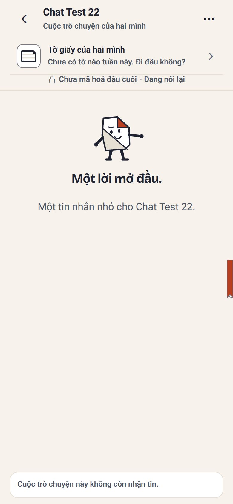 (hàng `TC-F06-CHAN-CHAT`, `TC-F06-BI-CHAN-CHAT`) |
| Source | `screens/chat/GroupChatLive.tsx:940–943` (`khongNhanTin` chỉ thay ô soạn); trạng thái rỗng và `HangToGiaySong` không xét cờ này; `changes.connection === "recovering"` (`:725`) giữ nguyên khi luồng bị từ chối |
| Đề xuất sửa | Khi chat không còn nhận tin: ẩn lời mời mở đầu và dải tờ giấy; với người chặn, nói «Bạn đã chặn …» kèm lối tới Cài đặt → Đã chặn; dừng thử nối lại khi máy chủ từ chối vì chặn |
| Tiêu chí gỡ | Cùng điều kiện, 20 s: không «Đang nối lại», không «Một lời mở đầu», không «Đi đâu không?»; phía người chặn có câu nói đã chặn |

### UI-080 · Lời mời vào nhóm không nói ai mời, và không có cách từ chối

| Trường | Nội dung |
|---|---|
| Category / Severity | UX ISSUE (đồng thuận) · **P3** |
| Feature / Screen | F05.S01 · `/messages`, hàng nhóm đang mời |
| Nền tảng, cấu hình | web, C1. Native: cùng mã (STATIC) |
| Tái hiện | Được mời vào một nhóm, mở Tin nhắn |
| Expected | Hàng nói ai mời mình (để biết có nên tin). Có «Đồng ý» và cách từ chối hoặc bỏ qua |
| Actual | Hàng có tên nhóm, «2 thành viên · bạn được mời», «Chưa có tin nhắn nào.» và một nút «Đồng ý vào nhóm» 358×48. Không có tên người mời, không có nút từ chối. Hàng chính bị tắt nên không xem trước được. Lời mời không muốn nhận nằm mãi trong danh sách |
| Evidence |  (hàng `TC-F05.S01-LOI-MOI`, phân xử bằng mắt) |
| Source | `screens/groups/Conversations.tsx:167–224` (`duocMoi` chỉ thêm « · bạn được mời» và một `RudiButton`) |
| Đề xuất sửa | Ghi «<tên> mời bạn» (nếu wire có người mời); thêm «Từ chối» |
| Tiêu chí gỡ | Hàng lời mời có tên người mời và hai lựa chọn |

### UI-081 · Tablet: danh sách Bạn bè và Thành viên trải hết bề ngang, nút hành động cách tên 487–679px

| Trường | Nội dung |
|---|---|
| Category / Severity | VISUAL POLISH · **P3** (cùng họ UI-031, UI-047) |
| Feature / Screen | F06 · `/friends`, `/groups/[id]/members` |
| Nền tảng, cấu hình | web, C6, C7 |
| Expected | Như các form cùng feature (Lập nhóm, Mời, Thêm bạn gom cột 560 ở giữa): danh sách có trần bề ngang để nút đứng gần tên |
| Actual | Từ cuối tên «Thu Thảo» tới nút «Nhắn tin»: 487px ở C6, 679px ở C7. Nút «Đặt làm quản trị» cũng dạt mép phải |
| Evidence | 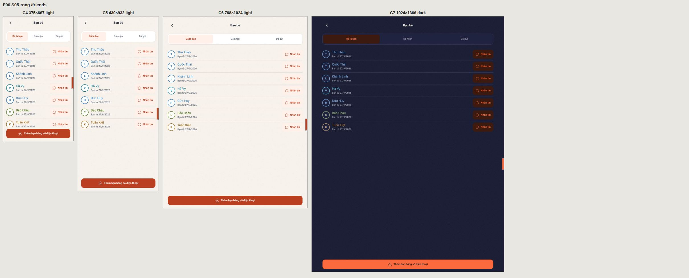 (hàng `TC-F06-BAN-TABLET` C6/C7, đo bằng hộp của chính dòng chữ) |
| Source | `screens/friends/Friends.tsx` và `screens/groups/Members.tsx` không đặt `maxWidth` cho nội dung (`New.tsx`, `AddFriend.tsx` có `maxWidth: 560`) |
| Đề xuất sửa | Cùng trần bề ngang cho danh sách, hoặc bố cục hai cột ở expanded |
| Tiêu chí gỡ | C6/C7: nút hành động cách tên ≤ 160px |

## F07 Sổ hai người

Cặp đo chính: chat-0 (A) và chat-1 (B), bạn của nhau, có chat đôi. M6 và trạng thái chờ đo trên các cặp mới lập qua API
(chat-2/3, chat-4/5, chat-6/7, chat-8/9, chat-10/11, chat-12/13), vì khoảnh khắc chỉ diễn khi sổ mở lúc màn đang mở.
Con dấu «01 GỬI» và avatar «0» là do tên giả «Chat Test 0N»: mã lấy chữ cuối làm tên gọi (`to-giay.ts:280`), không
phải lỗi.

### UI-082 · Không có phiên: link tờ giấy của một cặp thật mở sổ demo không nhãn; «Gửi cho người ấy» báo đã gửi mà không gửi gì

| Trường | Nội dung |
|---|---|
| Category / Severity | BUG (xác nhận giả, dữ liệu sai nguồn) · **P1** trên web |
| Feature / Screen | F07 · `/groups/[id]/to-giay` (giao với F11 chế độ demo) |
| Nền tảng, cấu hình | web, C1, bản export production. Native: cùng route, cùng nhánh «không phiên thì dùng store demo», nên deep link tới tờ giấy khi đã đăng xuất đi cùng đường (STATIC) |
| Điều kiện | Không có phiên (đăng xuất, hết phiên, trình duyệt khác). Link là tờ giấy của cặp chat-0/chat-1 có thật trên máy chủ |
| Tái hiện | 1. Mở thẳng `/groups/<id của cặp>/to-giay`. 2. Chạm «Rủ đi chơi». 3. Chạm «Gửi cho người ấy» |
| Expected | Tới cửa vào (Welcome, đăng nhập) rồi quay lại đúng tờ giấy; nếu cho xem bản trải nghiệm thì có nhãn «Dữ liệu demo» và không nói «đã gửi» khi không có gì được gửi |
| Actual | Trang hiện một sổ với nội dung bịa: «Bún chả, quán góc phố · Thứ Bảy 06/09 · KÝ ỨC», «Tờ đã khép: Hết khung · Chủ nhật 14/09», tiêu đề «Hai người bạn · Người ấy». Không nhãn demo, không lối đăng nhập. «Rủ đi chơi» phác một tờ «Thứ Bảy 20/09» (ngày đã qua); «Gửi cho người ấy» đổi tờ thành «ĐÃ GỬI · Đã gửi, chờ trả lời. Người ấy chưa xem.». Suốt lúc đó trang gửi **0** lệnh ghi tới API. F08 (`TC-F08-KHONG-PHIEN`): không phiên, link album của một kèo thật mở album demo «Album Đà Lạt · Team Đà Lạt · 17 - 19/10/2026 · 4 ảnh» **không** nhãn; `/stories/new` và `/posts/new` hiện form thật, không lối đăng nhập. Đạt: `/groups/[id]/album` về Welcome; tường, «Thả khoảnh khắc» và «Thành tích» hiện bản demo có nhãn, «Đăng vào tường nhóm» của bản demo về tường demo có nhãn (`TC-F08-KHONG-PHIEN-THA`). F09 (`TC-F09-KHONG-PHIEN`): không phiên, `/settings` hiện trang cài đặt của «Bạn» (avatar «B», công tắc, ba chip) mà mọi thao tác không có tác dụng; `/settings/phien` và `/settings/da-chan` sau 8 s vẫn là khung chờ xám, không hàng, không trạng thái rỗng, không câu lỗi (lượt đọc dừng khi không có người, `PhienScreen.tsx:38`, `DaChanScreen.tsx:37`); `/settings/xoa-tai-khoan` hiện bước 1 như có tài khoản. Không màn nào có nhãn demo hay lối đăng nhập |
| Evidence | 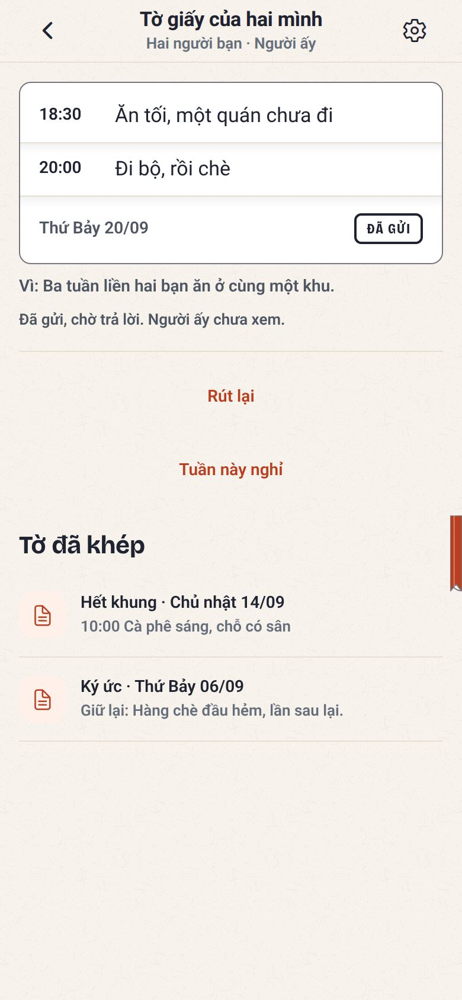 (hàng `TC-F07.S02-LANH-KHONG-PHIEN`, `TC-F07-KHONG-PHIEN-GUI`) 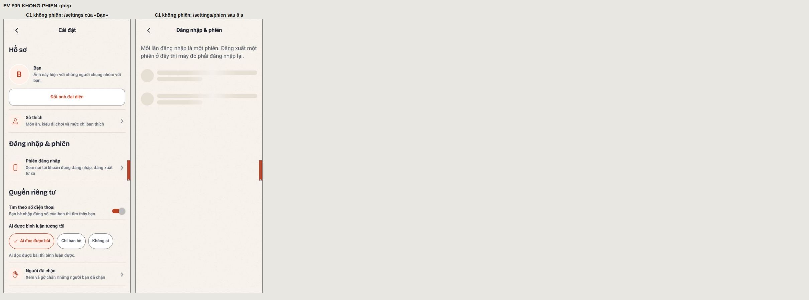 |
| Source | `app/groups/[id]/to-giay.tsx`: có phiên thì bọc `SoDoiSongProvider`; không phiên thì dựng `KhongGianGiayScreen` trên store fixture gắn ở `_layout`. Chú thích nói nhánh này dành cho bản fixture, nhưng mã áp cho mọi bản dựng. Màn không dùng `DemoBadge` |
| Hậu quả | Người mở link từ thông báo hay tin nhắn khi đã rơi phiên thấy một sổ trông như của mình, gửi lời rủ và được báo đã gửi. Người kia không nhận được gì; người gửi không có lý do để đăng nhập lại |
| Đề xuất sửa | Route có `id` thật mà không có phiên: đưa về cửa vào, giữ đường dẫn để quay lại sau đăng nhập. Store demo chỉ cho route demo, và luôn kèm `DemoBadge` |
| Tiêu chí gỡ | Không phiên, mở link: tới cửa vào; sau đăng nhập về đúng tờ giấy. Không màn nào hiện «Đã gửi» khi chưa có lệnh ghi thành công |

### UI-083 · Đọc sổ lỗi thì màn vẽ «Chưa có sổ hai người» và mời lập sổ lại

| Trường | Nội dung |
|---|---|
| Category / Severity | BUG (lỗi hiện như trạng thái rỗng) · **P2** |
| Feature / Screen | F07 · `/groups/[id]/to-giay` |
| Nền tảng, cấu hình | web, C1. Native: cùng mã (STATIC) |
| Điều kiện | Sổ của chat-0/chat-1 đã mở, tuần này có tờ. `GET /contexts/{id}/notebook` và `/papers` trả 503 |
| Tái hiện | Mở tờ giấy khi hai lệnh đọc trên trả 503; rồi cho máy chủ ổn lại |
| Expected | Một câu nói chưa đọc được sổ, có «Thử lại» (như `ChonNguoi.tsx:89` làm với danh sách bạn); không vẽ như sổ chưa lập |
| Actual | Bìa sổ đóng, «Chưa có sổ hai người … Cả hai cùng đồng ý thì sổ mở.» và con dấu «Đề nghị lập sổ». Không câu lỗi, không «Thử lại». Khi máy chủ ổn lại, lượt đọc 4 s tự đưa sổ về sau khoảng 4 s (4068 ms), vì màn đang được focus |
| Evidence | 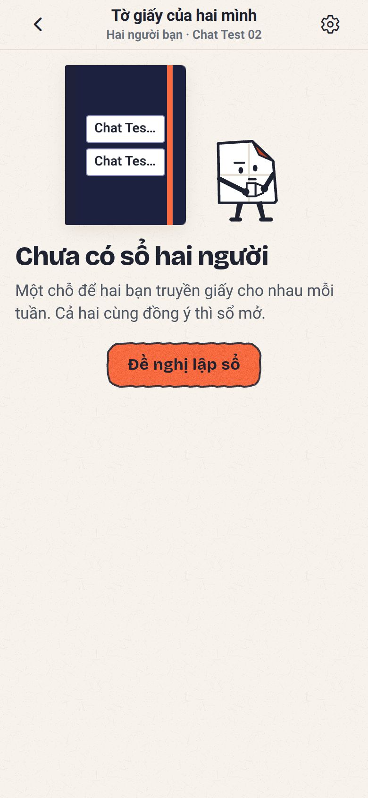 (hàng `TC-F07.S02-503`) |
| Source | `to-giay/useToGiay.ts:169` đặt `pha: "loi"` kèm `loi` khi lần đọc đầu hỏng, nhưng `SoDoiSong.tsx` không đưa `loi` ra `SoDoiApi`. `daNap` (`:70`) thành `true`, `lapSo` (`:46`) thành `false` vì `so` rỗng, nên `KhongGianGiay.tsx` vẽ nhánh chưa lập sổ; màn không có nhánh lỗi đọc |
| Hậu quả | Lúc mạng hay máy chủ trục trặc, người dùng tưởng sổ đã mất hoặc chưa từng lập, và được mời «Đề nghị lập sổ». Theo mã máy chủ (`services/core/internal/domain/pairsteps/notebook.go:261–318`), lệnh đó nếu tới nơi sẽ nộp một lời đề nghị lap_so mới trên sổ đã mở (không đo, vì là lệnh ghi) |
| Đề xuất sửa | Đưa `loi` qua `SoDoiApi`; màn có nhánh lỗi dùng `ErrorState` với «Thử lại» |
| Tiêu chí gỡ | 503 khi đọc sổ: màn nói chưa đọc được, có «Thử lại»; không hiện «Chưa có sổ hai người» |

### UI-084 · Sheet «Lập sổ hai người» quay về trạng thái mời ngay khi lời đề nghị được đồng ý

| Trường | Nội dung |
|---|---|
| Category / Severity | BUG (overlay hiện trạng thái sai) · **P2** |
| Feature / Screen / Layer | F07 · `/groups/[id]/to-giay` · L23, sheet `LapSo` (`hai-nguoi/DongYBac.tsx`) |
| Nền tảng, cấu hình | web, C1 và C9. Native: cùng mã (STATIC) |
| Điều kiện | Hai người, một người đã đề nghị lập sổ |
| Tái hiện | (a) Người đề nghị để sheet chờ mở («Đã đề nghị. Chờ … đồng ý…»), người kia đồng ý trên máy họ. (b) Người được đề nghị chạm «Đồng ý» |
| Expected | (a) Sheet chờ đóng, hoặc nói sổ đã mở. (b) Sheet đóng với đúng nội dung lúc bấm |
| Actual | (a) Thân màn đổi sang sổ đã mở, nhưng sheet ở lại và đổi về «Bạn ký khi bấm đề nghị · Chờ Chat Test 02 ký», con dấu «Đề nghị lập sổ» và «Để sau», che bìa sổ vừa mở (M6). (b) Trong lúc đóng, sheet hiện đúng trạng thái mời đó: 4 khung rAF từ 97 tới 395 ms sau chạm ở C1; 2 và 3 khung ở hai lượt C9. Thân màn cũng qua 1–2 khung «Tuần này» thường trước khi bìa mở |
| Evidence | 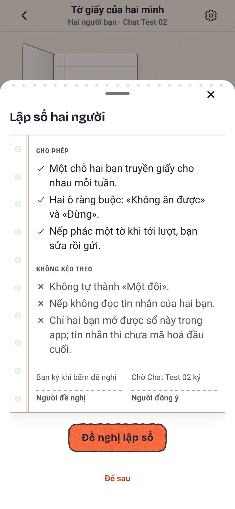  (hàng `TC-F07-SO-MO-BEN-KIA`, `TC-F07-DONG-Y-NHAY-C1`, `TC-F07-DONG-Y-NHAY-C9`) |
| Source | `DongYBac.tsx:75–127`: nội dung suy từ `dangCho` (còn lời đề nghị đang chờ). Khi máy chủ báo đã đồng ý, lời đề nghị biến mất khỏi `pending_proposals`, `dangCho` thành `false`, và nhánh cuối vẽ con dấu `nhanDeNghi` (`:127`). Phía đồng ý, `KhongGianGiay.tsx:324` chỉ đóng sheet ở `.then((ok) => ok && dong())`, sau lần đọc lại; phía người đề nghị không có gì đóng sheet. Khung thân «thường» có vì `vuaMoSo` được đặt trong effect, sau render đầu đã có `lapSo` |
| Hậu quả | Người đề nghị được mời lập sổ lần nữa trên một sổ đã mở, và không thấy khoảnh khắc sổ mở. Theo mã máy chủ, chạm con dấu đó nộp một lời đề nghị lap_so mới trên sổ đã mở (STATIC; không bấm vì là lệnh ghi). Phía đồng ý thấy sheet nháy như vừa bị huỷ |
| Đề xuất sửa | Khi `lapSo` chuyển sang `true`, đóng sheet `lap-so` ở cả hai phía; sheet đang đóng giữ nội dung lúc còn mở. Đặt `vuaMoSo` cùng lúc với `lapSo` để không có khung thân thường |
| Tiêu chí gỡ | (a) sheet chờ tự đóng khi sổ mở. (b) 0 khung trạng thái mời sau «Đồng ý», 0 khung thân thường trước bìa |

### UI-085 · «Rủ <tên> tới đây» khi tuần đã có tờ chốt: phác thêm một tờ cùng tuần, bỏ chỗ vừa chọn, và câu trên đầu nói ngược lại

| Trường | Nội dung |
|---|---|
| Category / Severity | BUG (luồng) · **P2** |
| Feature / Screen | F02 · `/places/[id]` → F07 · `/groups/[id]/to-giay?ru=1&cho=…` |
| Nền tảng, cấu hình | web, C1. Native: cùng mã (STATIC) |
| Điều kiện | Sổ đã mở; tuần này có một tờ đã chốt («Thứ Bảy 03/10»), không có tờ nào đang mở |
| Tái hiện | Ở chi tiết Tiệm Nướng Xóm Lào chạm «Rủ Chat Test 02 tới đây» |
| Expected | Chỗ vừa chọn nằm trên một bản phác; hoặc màn nói vì sao không, và không tạo gì |
| Actual | Máy chủ có thêm một tờ nháp cho chính tuần đó: số tờ của cặp 1 → 2, cùng tuần bắt đầu 28/09 (SQL chỉ đọc). Đầu trang: «Tuần này hai bạn đã có tờ rồi. Chỗ bạn chọn chưa được thêm, để dành cho tuần sau nhé.»; ngay dưới là bản phác mới «18:30 Ăn tối · Thứ Bảy 03/10», trùng tối với tờ đã chốt, không có Tiệm Nướng Xóm Lào. Khi bản phác đã có, chạm lại nút thì đúng: sheet sửa mở với «Ở Tiệm Nướng Xóm Lào» và không thêm tờ (`TC-F02-CHI-TIET-RU-NHAP`) |
| Evidence | 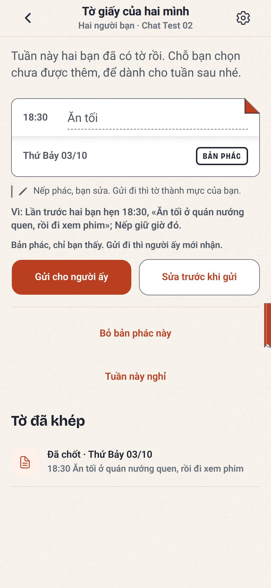 (hàng `TC-F02-CHI-TIET-RU`) |
| Source | `KhongGianGiay.tsx:62–70`: `?ru=1` gọi `so.ruDiChoi()` khi `nenXinTo` trả «xin», và `to-giay.ts:201` coi tờ `chot` là không mở (`TRANG_THAI_MO`, `:43`). Cùng lúc, effect `goiYCho` (`KhongGianGiay.tsx:83–93`) đọc `toMo` là tờ `chot` trước khi bản phác về, rơi xuống câu cuối của `goiYChoLam` (`to-giay.ts:235`) và xoá `goiYCho`. Màn thường thì không mời «Rủ đi chơi» khi tờ tuần này đã chốt (`KhongGianGiay.tsx:273`) |
| Hậu quả | Chỗ người dùng vừa chọn mất; một bản phác trùng tối với buổi đã hẹn hiện ra dù họ không yêu cầu, chiếm một trong ba tờ của tuần; câu hướng dẫn nói ngược với thứ họ đang nhìn |
| Đề xuất sửa | Một quyết định cho cả `ru` lẫn `cho`: không phác được thì không gọi `ruDiChoi`; có phác thì đợi bản phác về rồi mở sheet với chỗ đã chọn |
| Tiêu chí gỡ | Tuần đã có tờ chốt: số tờ không đổi và câu giải thích khớp với màn; hoặc bản phác mới mang chỗ vừa chọn |

### UI-086 · Người vừa đề nghị lập sổ đóng sheet thì màn không còn nói đang chờ

| Trường | Nội dung |
|---|---|
| Category / Severity | UX ISSUE · **P3** |
| Feature / Screen | F07 · `/groups/[id]/to-giay` |
| Nền tảng, cấu hình | web, C1 |
| Tái hiện | «Đề nghị lập sổ» → sheet → «Đề nghị lập sổ», rồi «Để sau» |
| Expected | Màn nói mình đã đề nghị và đang chờ người kia |
| Actual | Trong sheet có câu chờ (đạt, `TC-F07-DE-NGHI`). Đóng sheet thì màn vẫn «Chưa có sổ hai người … Cả hai cùng đồng ý thì sổ mở.», con dấu đổi thành «Xem lời đề nghị», đúng chữ người kia thấy khi họ được đề nghị. Không câu nào trên màn nói đang chờ |
| Evidence | 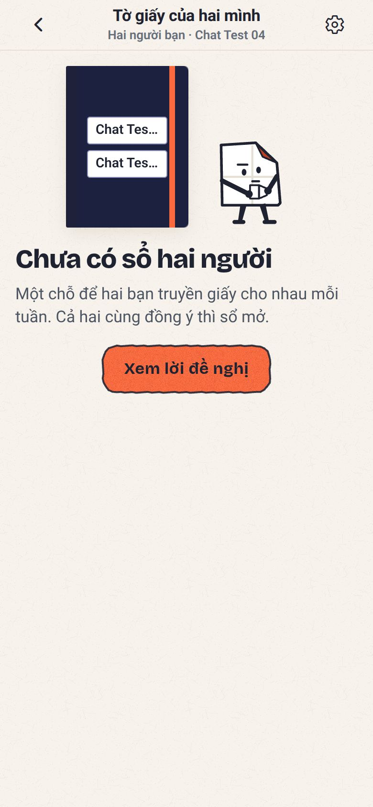 (hàng `TC-F07-CHO-SAU-KHI-DONG`) |
| Source | `KhongGianGiay.tsx:181` (`label={deNghiLapSo ? "Xem lời đề nghị" : "Đề nghị lập sổ"}`, không xét `cuaToi`) |
| Hậu quả | Đọc như người kia vừa đề nghị, hoặc như chưa có gì xảy ra |
| Đề xuất sửa | Khi lời đề nghị là của mình: một dòng «Đã đề nghị. Chờ … đồng ý» ngay trên màn; nút gọi đúng việc («Xem lời đề nghị của bạn») |
| Tiêu chí gỡ | Sau «Để sau», câu chờ nằm trên màn |

### UI-087 · «Cài đặt sổ» vẫn mở khi quay lại từ «Tin nhắn» hay «Kỷ niệm của hai bạn»

| Trường | Nội dung |
|---|---|
| Category / Severity | UX ISSUE · **P3** |
| Feature / Screen / Layer | F07 · `/groups/[id]/to-giay` · L23 sheet «Cài đặt sổ» |
| Nền tảng, cấu hình | web, C1 |
| Tái hiện | ⚙ → «Tin nhắn» → Back (trình duyệt, hoặc «Quay lại» của chat) |
| Expected | Rời màn qua một hàng của sheet thì sheet đóng; quay lại thấy tờ giấy |
| Actual | Quay lại thấy sheet «Sổ hai người» còn mở như trước khi đi, bằng Back trình duyệt và bằng «Quay lại» của chat. Lúc ở chat, sheet ẩn cùng màn tờ giấy (0 hộp thoại hiện), không chặn gì: ô soạn nhận chạm |
| Evidence | 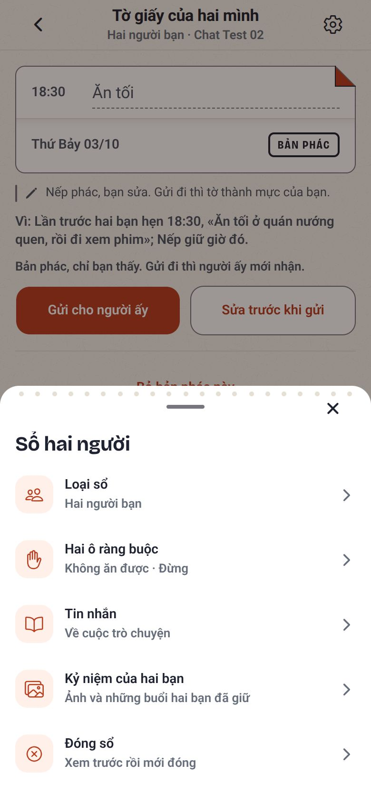 (hàng `TC-L23-CAI-DAT-DAY`) |
| Source | `KhongGianGiay.tsx:290–291` push thẳng. Cùng file, «Sửa gu của tôi» đóng sheet trước khi push (`:352`); Cài đặt nhóm của chat cũng vậy (`chat/CaiDatNhom.tsx:200`, `:211`) |
| Đề xuất sửa | `dong()` trước `router.push` ở hai hàng này |
| Tiêu chí gỡ | Back về tờ giấy: 0 hộp thoại |

### UI-088 · Nền của sheet nhận chạm ngay lúc mở: chạm đúp nút ⚙ mở rồi đóng «Cài đặt sổ»

| Trường | Nội dung |
|---|---|
| Category / Severity | UX ISSUE · **P3** (cùng họ UI-006, UI-039; khác cơ chế) |
| Feature / Screen / Layer | F07 · L23 · `ui/Sheet.tsx`: mọi sheet mở từ một nút nằm trong vùng nền |
| Nền tảng, cấu hình | web, C1 |
| Tái hiện | Chạm ⚙ hai lần cách 60 ms |
| Expected | Đúng một sheet mở |
| Actual | 0 sheet sau 1,3 s. 60 ms sau chạm đầu, ở toạ độ nút ⚙ đã là nền «Đóng» của sheet, nên chạm thứ hai đóng sheet vừa mở. Nút ⚙ không phải công tắc (`setMo("cai-dat")`), khác UI-039 |
| Evidence | Hàng `TC-L23-CHAM-DUP` (phần tử dưới ngón tay đo bằng `elementFromPoint`) |
| Source | `Sheet.tsx:180` (`Pressable` «Đóng» phủ cả màn, nhận chạm ngay khi mount) |
| Đề xuất sửa | Bỏ qua chạm lên nền trong pha mở (ví dụ tới khi `progress` gần 1) |
| Tiêu chí gỡ | Chạm đúp: 1 sheet |

### UI-089 · Tay cầm của mọi sheet là `div` mang `aria-label` mà không có role

| Trường | Nội dung |
|---|---|
| Category / Severity | BUG (accessibility) · **P3** |
| Feature / Screen / Layer | F07 (đo), mọi sheet · `ui/Sheet.tsx:210`. Cùng kiểu ở F08 «Thành tích» |
| Nền tảng, cấu hình | web, C1. Native: `View` có `accessibilityLabel` mà không `accessible` thì cũng không được đọc (STATIC) |
| Actual | axe `aria-prohibited-attr` (serious) ×1 trong mỗi sheet đã quét: Cài đặt sổ, Loại sổ, Hai ô ràng buộc, Đóng sổ. Phần tử: `
`. Sheet báo cáo của F05 (UI-067) cũng ghi ×1; cùng component nên nhiều khả năng là cùng phần tử, nhưng lượt F05 không in phần tử ra. Nhãn và gợi ý «Kéo xuống để đóng» không tới trình đọc màn hình. F08: cùng kiểu lỗi ở «Thành tích»: thanh tiến độ «Tiến độ … phần trăm tới cấp sau» và con dấu «Huy hiệu Mở hàng» là `div` mang `aria-label` không role, axe ×2 (baseline `TC-F08.S09-BASE`, `ky-niem/AchievementsLive.tsx:135`, `:144`). Hai vùng chạm của story cũng ra lỗi axe này, nhưng là nút thiếu role: UI-101. F09 «Cài đặt», sau khi đổi ảnh đại diện: khung ảnh là `div` mang `aria-label` không role, và `img` bên trong không có `alt` (axe `aria-prohibited-attr` ×1, `image-alt` ×1; `ui/Avatar.tsx:54–62`, `TC-F09-CAI-DAT-ARIA`) F10: component `Sticker` (bong bóng chat và ô trong khay sticker) cũng là `div` mang `aria-label="Sticker: …"` mà không có role: axe ×29 trên bảng dev (`TC-F10.S01-BASE`, `AxeBuilder` in phần tử) |
| Evidence | Hàng `TC-L23-SHEET-CON` (axe trên từng sheet, phần tử in ra bằng `AxeBuilder`) |
| Hậu quả | Nhẹ: «Đóng bảng» vẫn có tên và đóng được. Nhưng mọi sheet mang một lỗi axe serious, làm nhiễu số đếm a11y |
| Đề xuất sửa | Hoặc cho tay cầm vai trò có hành động đóng, hoặc bỏ nhãn và ẩn khỏi cây truy cập, vì «Đóng bảng» đã làm việc đó |
| Tiêu chí gỡ | axe `aria-prohibited-attr` = 0 trong sheet |

### UI-090 · Hai tên trên bìa sổ bị cắt «Chat Tes…» ở mọi cỡ màn

| Trường | Nội dung |
|---|---|
| Category / Severity | VISUAL POLISH · **P3** |
| Feature / Screen | F07.S02 · `ui/SoBia.tsx` (bìa sổ khi chưa lập, và bìa M6) |
| Nền tảng, cấu hình | web, C1–C7 |
| Actual | Nhãn tên rộng 66px cho chữ cần 79px: «Chat Test 01» và «Chat Test 02» đều thành «Chat Tes…», nhìn không phân biệt được hai người. Tên mới 12 ký tự; tên thật như «Nguyễn Minh Anh» dài hơn |
| Evidence | 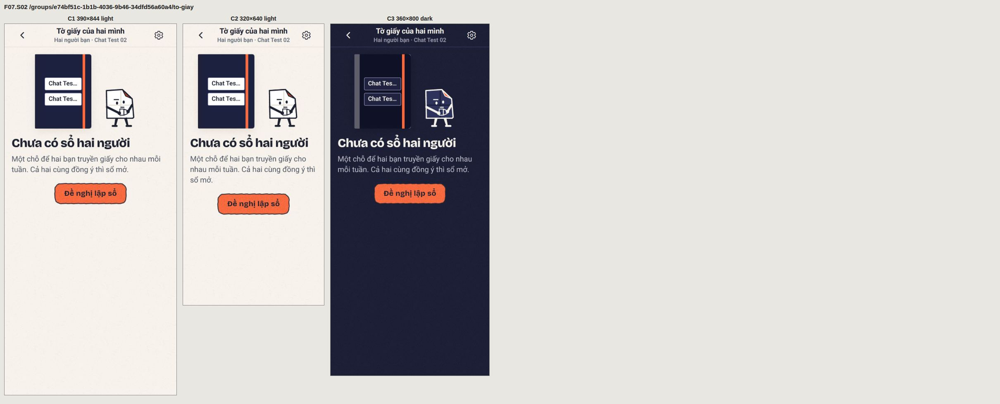 (hàng `TC-F07-BIA-TEN`, `TC-F07.S02-BASE`) |
| Source | `SoBia.tsx:103` (`numberOfLines={1}`) trong nhãn có lề 22 mỗi bên (`:133`) trên bìa rộng 128 và 140 |
| Đề xuất sửa | Dùng tên gọi (chữ cuối, như `tenNgan` của con dấu) trên bìa, hoặc cho nhãn xuống hai dòng |
| Tiêu chí gỡ | Hai tên đọc được, hoặc ít nhất khác nhau, ở 320–1024 |

### UI-091 · «Lưu hai ô của tôi» tắt mà không nói lý do (ADR-0038 §2.2)

| Trường | Nội dung |
|---|---|
| Category / Severity | UX ISSUE · **P3** |
| Feature / Screen / Layer | F07 · L23 sheet «Hai ô ràng buộc». «Giữ lại» của sheet «Giữ lại một điều» cùng kiểu (STATIC, `GiuMotDieu.tsx:40`, chưa tới được trạng thái đó ở runtime). F08: «Chia sẻ ngay vào nhóm» (`/moments/new`), «Đăng check-in» (L24), «Gửi bình luận» của bài (`/posts/[id]`) |
| Nền tảng, cấu hình | web, C1 |
| Expected | ADR-0038 §2.2: nút mà việc của nó chưa có nghĩa thì không hiện («Lưu tên» chỉ hiện khi tên đã khác); nếu còn hiện thì nói lý do ngay dưới |
| Actual | Mở sheet khi chưa gõ gì: «Lưu hai ô của tôi» viền đứt, ngay dưới là «Đóng», không có dòng lý do. F08: «Chia sẻ ngay vào nhóm» 326×52 viền đứt khi chưa chọn ảnh, không dòng lý do (`TC-F08.S04-NUT-TAT`); «Đăng check-in» 358×52 viền đứt khi chưa chọn chỗ, ngay dưới là «Thôi» (`TC-L24-NUT-TAT`); «Gửi bình luận» 48×48 viền đứt khi ô trống, ngay dưới là nút «Báo cáo bài này» (`TC-F08-BINH-LUAN-BAI`). Đối chứng trong cùng feature: «Đăng story» và «Đăng» của bài có lý do ngay dưới («Chọn một tấm ảnh trước đã.», «Viết vài chữ trước đã…»), đạt |
| Evidence | 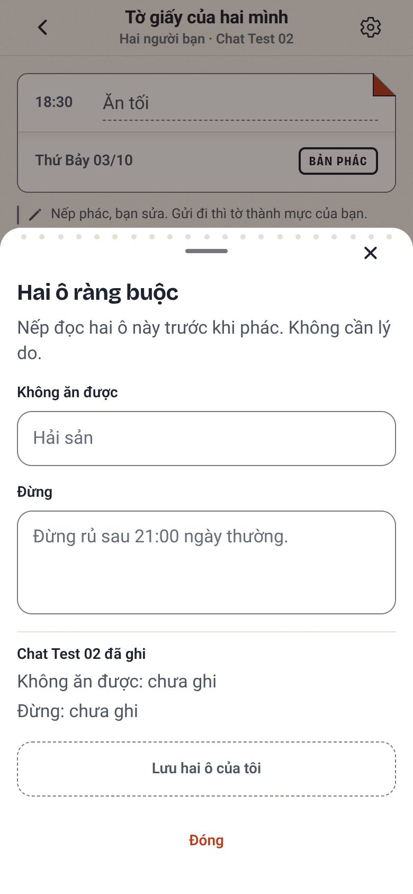 (hàng `TC-F07-RANG-BUOC-NUT-TAT`) 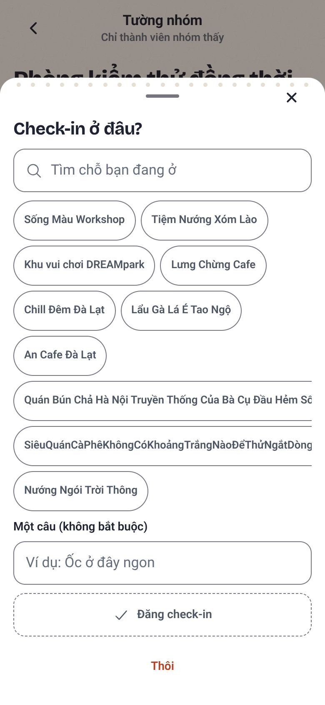 |
| Source | `RangBuoc.tsx:40` `disabled={!doi \|\| dangLuu}` không truyền `lyDo`; kit chỉ in lý do khi có `lyDo` (`ui.tsx:544`) |
| Đề xuất sửa | Ẩn nút tới khi hai ô khác bản đã lưu, đúng ví dụ «Lưu tên» của ADR |
| Tiêu chí gỡ | Sheet mở khi chưa gõ: không có nút tắt không lý do |

### UI-092 · Sheet sửa tờ: lá ngày đang chọn nằm lưng chừng mép phải

| Trường | Nội dung |
|---|---|
| Category / Severity | VISUAL POLISH · **P3** |
| Feature / Screen / Layer | F07 · L23 sheet «Sửa bản phác» và «Đề nghị sửa» (`DeNghiSua.tsx:167`) |
| Nền tảng, cấu hình | web, C1, C8 |
| Actual | Dải 14 lá (28/09 → 11/10) cuộn ngang, mở ở đầu dải. Tờ hẹn Thứ Bảy 03/10, là lá thứ sáu: chỉ thấy 36/56px. Ngày vẫn đọc được bằng chữ «Thứ Bảy 03/10» dưới dải. Cả ba sheet sửa tờ đã chụp cắt ở cùng chỗ. Các lá có `aria-checked` (đạt) |
| Evidence | 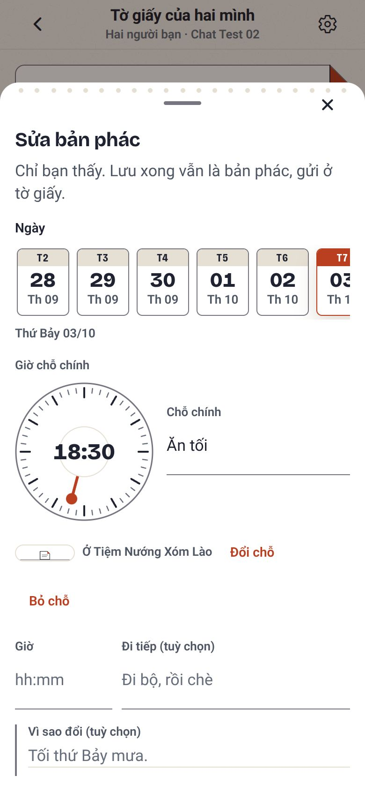 (hàng `TC-F07-DAI-NGAY`, số đo ở `TC-F02-CHI-TIET-RU-NHAP`) |
| Đề xuất sửa | Cuộn tới lá đang chọn khi sheet mở |
| Tiêu chí gỡ | Lá đang chọn nằm trọn trong dải khi mở |

### UI-093 · Tablet: tờ giấy và sheet «Cài đặt sổ» trải hết bề ngang

| Trường | Nội dung |
|---|---|
| Category / Severity | VISUAL POLISH · **P3** (cùng họ UI-031, UI-047, UI-081) |
| Feature / Screen / Layer | F07.S02 · L23 |
| Nền tảng, cấu hình | web, C6, C7 |
| Expected | Như thanh đầu của chính màn và trạng thái chưa có sổ (gom cột ở giữa), và như khay tạo (nội dung `maxWidth` 560, DESIGN.md) |
| Actual | Tờ giấy rộng 720px ở C6 và 912px ở C7; hai nút «Gửi cho người ấy», «Sửa trước khi gửi» chia đôi bề ngang đó. Sheet «Cài đặt sổ» rộng đúng bằng cửa sổ (768, 1024px): mũi tên của mỗi hàng dạt về mép phải, xa chữ |
| Evidence | 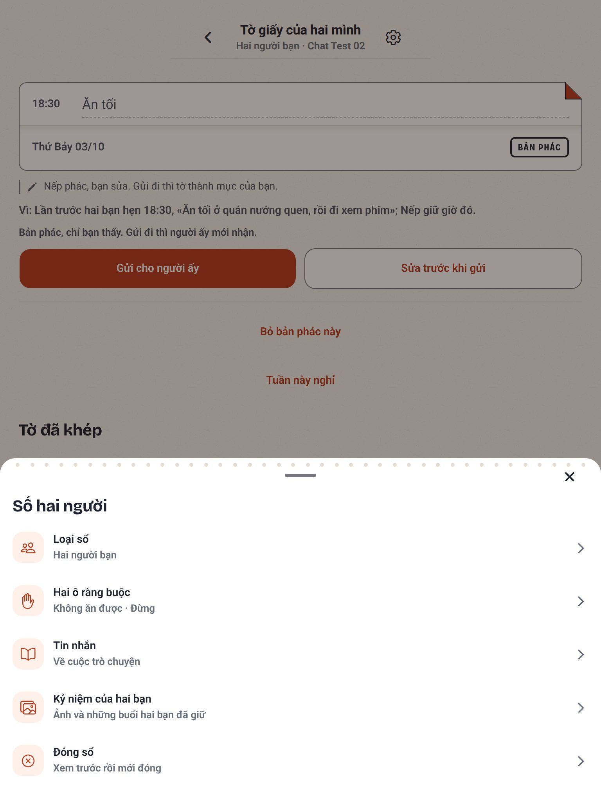 (hàng `TC-F07-TABLET`, `TC-L23-TABLET` C6/C7) |
| Source | `KhongGianGiay.tsx:485` (`than: { paddingTop: 8 }`, không `maxWidth`); `Sheet.tsx` không có trần bề ngang |
| Tiêu chí gỡ | C6/C7: tờ giấy và nội dung sheet ≤ 640px |

## F08 Kỷ niệm · Media

### UI-094 · Web: trình xem ảnh không hiện ảnh nào; vuốt nhảy hai ảnh mà bộ đếm đứng yên; chụm hai ngón phóng cả trang

| Trường | Nội dung |
|---|---|
| Category / Severity | BUG (web) · **P2** |
| Feature / Screen / Layer | F08 · `/trips/[id]/album` · L25 `ui/PhotoViewer.tsx` (RN `Modal` duy nhất của app) |
| Nền tảng, cấu hình | web, C1 (đo); C9 chụp cùng vùng trống. Native: HYPOTHESIS, ô của FlatList ngang trên native được kéo cao theo danh sách nên có thể không bị; chưa chạy được |
| Tái hiện | Album của kèo có 3 ảnh → chạm ảnh dẫn. Vuốt trái giữa khung. Chạm đúp. Chụm hai ngón (ngón thứ hai xuống sau 40 ms, dang ra, nhấc lần lượt) |
| Expected | Ảnh hiện trọn giữa đầu và chú thích; vuốt sang ảnh sau, bộ đếm và chú thích đổi theo; chạm đúp và chụm phóng to ảnh, đúng như dòng gợi ý dưới đáy |
| Actual | (1) Hộp thoại mở đúng (role dialog, aria-modal, focus vào «Đóng ảnh», bộ đếm «1 / 3», gợi ý, chú thích), nhưng ảnh cao **0px** (390×0, ảnh gốc 480×640): vùng giữa là nền chàm trống, ở cả ba ảnh. (2) Một cú vuốt cuộn khung lật trang 0 → 780px, bỏ qua ảnh thứ hai; bộ đếm vẫn «1 / 3», chú thích vẫn của ảnh đầu. (3) Chạm đúp: transform của ảnh giữ `scale(1)`. (4) Chụm: ảnh vẫn `scale(1)` nhưng **cả trang** phóng ×4,12 (`visualViewport.scale`; một lượt khác ×4,98). «Đóng» ra ngoài màn (toạ độ trên màn 1046, −754), vuốt sau đó chỉ kéo khung nhìn của trang. Muốn đóng phải chụm lại cho trang về cỡ cũ, hoặc Back (rời album). Trình xem chưa ai chụm thì Esc và «Đóng» đóng ngay, focus về ảnh đã mở (`TC-L25-VONGDOI` đạt) F10: cùng component trên bảng dev, với ảnh đóng gói sẵn trong app (không qua mạng): ảnh 390×0 ở C1 và C9, cả ở trình xem của album tổng hợp («1 / 4») lẫn ở nút «Mở bộ ảnh tổng hợp». Như vậy nguyên nhân không nằm ở việc tải ảnh. Vòng đời thì đạt: focus vào «Đóng ảnh», Esc đóng, focus về nút mở (`TC-F10-ALBUM-XEM`, `TC-F10-XEM-ANH`) |
| Evidence | 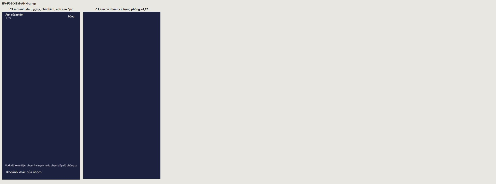 (hàng `TC-L25-ANH`, `TC-L25-CU-CHI`) 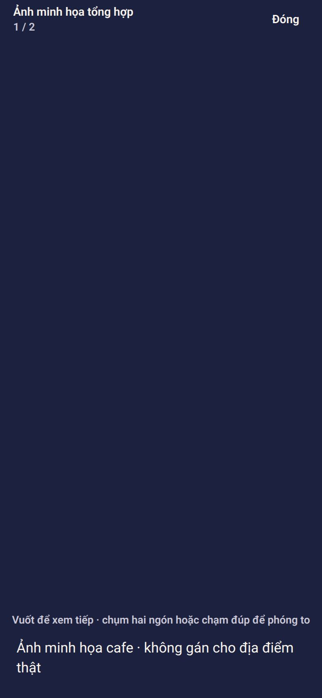 |
| Source | `ui/PhotoViewer.tsx:96`: ô mỗi ảnh `{ width, flex: 1 }` nằm trong FlatList ngang; trên web ô không nhận chiều cao của danh sách nên cao 0, ảnh `absoluteFill` (dòng 99) cao 0 theo, và `GestureDetector` của chạm đúp và chụm (dòng 97) không có diện tích nhận chạm: hai ngón rơi cho trình duyệt (cả hai con trỏ nhận `pointercancel`). Dòng 49: chỉ số ảnh chỉ đổi ở `onMomentumScrollEnd`, sự kiện ScrollView web không phát, nên bộ đếm và chú thích đứng yên. `index.html` để trang phóng được (`initial-scale=1`, không `maximum-scale`) |
| Hậu quả | Trên web, trình xem ảnh không cho xem ảnh nào; ai thử phóng to thì mất luôn nút «Đóng» |
| Đề xuất sửa | Cho ô chiều cao tường minh (chiều cao đo được của vùng, như đã làm với `width`); đổi chỉ số theo `onScroll` hoặc `onViewableItemsChanged`; chặn phóng trang trên vùng ảnh (`touch-action: none`) |
| Tiêu chí gỡ | Web C1: ảnh cao > 0, trọn trong vùng; một cú vuốt sang đúng ảnh sau và bộ đếm «2 / 3»; chạm đúp ra `scale(2)`; chụm không đổi `visualViewport.scale` |

### UI-095 · Thả tim lỗi khi đang ở cuối tường: câu lỗi nằm ở đầu tường, ngoài khung nhìn

| Trường | Nội dung |
|---|---|
| Category / Severity | UX ISSUE · **P2** (cùng họ UI-051) |
| Feature / Screen | F08 · `/groups/[id]/wall` |
| Nền tảng, cấu hình | web, C1; máy chủ trả 503 cho `/memories/{id}/reactions` (giả lập bằng `route()`). Native: cùng mã (STATIC) |
| Tái hiện | chat-1 cuộn tới kỷ niệm thứ tư (ảnh có chú thích dài), chạm «Thích» trong lúc máy chủ trả 503 |
| Expected | Câu lỗi hiện gần nút vừa chạm, hoặc màn cuộn tới câu |
| Actual | Quanh nút không có gì đổi: vẫn «Thích», «0 tim». Câu «Rủ Đi đang gặp sự cố nên chưa làm được việc này. Chưa có gì bị ghi sai, thử lại sau một chút.» có trên trang nhưng ở y −1535, trên đầu tường. Câu có `aria-live="polite"` nên trình đọc màn hình có thể đọc; người nhìn thì không thấy |
| Evidence | 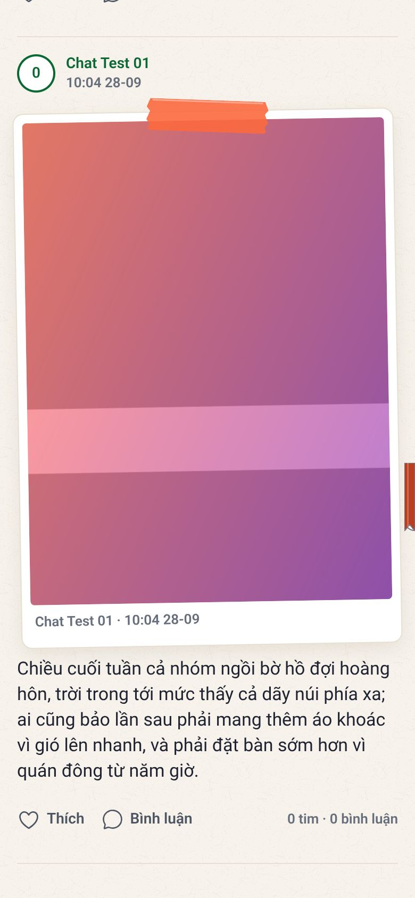 (hàng `TC-F08-TIM-503`) |
| Source | `ky-niem/GroupWallLive.tsx:244`: `thongBao` của mọi thao tác trên tường vẽ ở một chỗ, trên đầu danh sách |
| Hậu quả | Người dùng thấy tim không ăn mà không biết vì sao, chạm lại nhiều lần |
| Đề xuất sửa | Câu lỗi ngay dưới kỷ niệm vừa thao tác, hoặc cuộn tới câu và đưa focus vào đó (như đề xuất của UI-051) |
| Tiêu chí gỡ | Tim lỗi ở bất kỳ kỷ niệm nào: câu lỗi nằm trong khung nhìn ngay sau khi chạm |

### UI-096 · Xoá bình luận của bài: một chạm là xoá, không hỏi; thùng rác 18×20

| Trường | Nội dung |
|---|---|
| Category / Severity | UX ISSUE (thao tác không tự hoàn tác được) · **P2** |
| Feature / Screen | F08 · `/posts/[id]` (`tuong/BaiChiTietScreen.tsx`) |
| Nền tảng, cấu hình | web, C1. Native: cùng mã (STATIC) |
| Tái hiện | chat-1 mở bài «Bạn bè» của Chat Test 01, nơi có hai bình luận của mình; chạm biểu tượng thùng rác cạnh «Vừa xong» |
| Expected | Hỏi trước khi xoá, như xoá tin trong chat và xoá story («Xoá story này? …» · «Giữ lại» · «Xoá»); đích chạm ≥ 48dp |
| Actual | Không hỏi, không có «Hoàn tác»: bình luận trên máy chủ 2 → 1 ngay sau một chạm. Thùng rác 18×20, sát dòng giờ (`hitSlop` 8 không áp trên react-native-web) |
| Evidence | 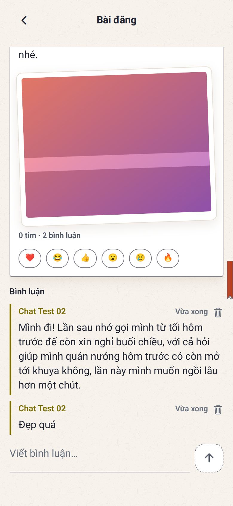 (hàng `TC-F08-XOA-BINH-LUAN`) |
| Source | `tuong/BaiChiTietScreen.tsx:294–295` (`Pressable` bọc icon cỡ 18, `onPress={() => void xoaBl(c)}`); `xoaBl` (dòng 156) gọi thẳng API |
| Hậu quả | Chạm nhầm là mất bình luận, không lấy lại được |
| Đề xuất sửa | Câu hỏi ngay tại bình luận («Xoá bình luận này?» · «Giữ lại» · «Xoá») như trình xem story; vùng chạm 48dp |
| Tiêu chí gỡ | Một chạm vào thùng rác không xoá; vùng chạm ≥ 48dp |

### UI-097 · «Thả khoảnh khắc» và «Đăng story»: rời màn là mất ảnh và câu đã soạn, không hỏi

| Trường | Nội dung |
|---|---|
| Category / Severity | UX ISSUE (mất dữ liệu người dùng vừa nhập, chưa ghi) · **P2** (cùng họ UI-052) |
| Feature / Screen / Layer | F08 · `/moments/new`, `/stories/new` · L34 route modal trượt từ dưới |
| Nền tảng, cấu hình | web, C1. Native: vuốt xuống của modal iOS và Back phần cứng Android rời route theo cùng đường; toàn app không có `usePreventRemove` hay `beforeRemove` (STATIC) |
| Tái hiện | Mở «Thả khoảnh khắc» từ tường nhóm (hoặc «Đăng story mới» từ Tin nhắn), chọn một ảnh, gõ «Nháp thử quay lại». Rời bằng Back của trình duyệt (rồi Forward), hoặc «Quay lại» ở đầu màn. Mở lại bằng cùng nút |
| Expected | Hỏi trước khi bỏ, hoặc mở lại vẫn còn ảnh và câu |
| Actual | Cả bốn đường (2 màn × 2 cách rời): rời ngay, 0 hộp thoại trong trang, 0 hộp hỏi của trình duyệt. Forward và mở lại đều ra khung trống «Chưa có ảnh. Chạm để chọn một tấm.» và «300 ký tự còn lại» (story: «Còn 200 ký tự»). Rời xong không sót lớp chặn |
| Evidence | 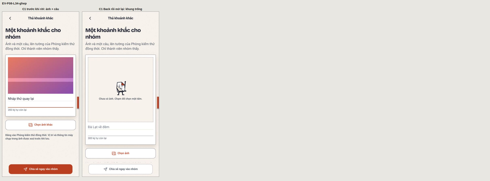 (hàng `TC-L34-VONGDOI`) |
| Source | `ky-niem/ShareMomentLive.tsx:58–68`: ảnh đã chọn bị bỏ khi màn gỡ (`boAnh` trong cleanup), câu nằm ở `useState`; `story/DangStoryScreen.tsx` cùng kiểu. Không màn nào chặn rời |
| Hậu quả | Một cú Back quen tay (hay vuốt xuống trên iOS) bỏ ảnh vừa chọn và câu vừa gõ |
| Đề xuất sửa | Hỏi trước khi rời khi đã có ảnh hoặc câu (`usePreventRemove`), hoặc giữ nháp trong bộ nhớ phiên theo nhóm |
| Tiêu chí gỡ | Bốn đường trên: có câu hỏi, hoặc mở lại còn ảnh và câu |

### UI-098 · Trình xem ảnh mờ dần khi mở nhưng biến mất ngay khi đóng

| Trường | Nội dung |
|---|---|
| Category / Severity | VISUAL POLISH · **P3** |
| Feature / Screen / Layer | F08 · `/trips/[id]/album` · L25, MO24 |
| Nền tảng, cấu hình | web, C1. C9 đạt: hiện và mất ngay (`TC-MO24-C9`) |
| Expected | `animationType="fade"`: mờ dần cả hai chiều |
| Actual | Mở: độ mờ 0 → 1 trong 242 ms. Đóng bằng «Đóng»: 4 mẫu rAF đầu còn thấy ở độ mờ 1 rồi mất hẳn; mẫu đầu tiên không còn trình xem ở 64 ms kể từ lúc bắt đầu lấy mẫu (tính cả cú chạm). Không có độ mờ trung gian |
| Evidence | Số đo khung rAF ở hàng `TC-MO24-DONG`; không kèm ảnh (trạng thái đầu và cuối đều bình thường) |
| Source | `ky-niem/AlbumLive.tsx:207`: `viewer ? <PhotoViewer …/> : null`. Đóng là gỡ `Modal` khỏi cây, nên hiệu ứng ra của `Modal` không có dịp chạy |
| Đề xuất sửa | Giữ `PhotoViewer` trong cây và điều khiển bằng `visible`, gỡ sau `onDismiss` |
| Tiêu chí gỡ | C1: lúc đóng có ít nhất một mẫu độ mờ giữa 0 và 1; C9 vẫn mất ngay |

### UI-099 · Sheet Check-in: chip tên quán dài tràn ra ngoài mép sheet

| Trường | Nội dung |
|---|---|
| Category / Severity | UX ISSUE (layout) · **P3** |
| Feature / Screen / Layer | F08 · `/groups/[id]/wall` · L24 sheet «Check-in ở đâu?» |
| Nền tảng, cấu hình | web, C1; danh mục có tên quán 72 ký tự và tên liền 57 ký tự (dữ liệu biến thể của F02) |
| Expected | Chip xuống dòng hoặc có dấu lược, nằm trọn trong sheet |
| Actual | 10 chip; hai chip rộng 521 và 448px, tới x 537 và 464 trong sheet rộng 390: «Quán Bún Chả Hà Nội Truyền Thống Của Bà Cụ Đầu Hẻm Số…» và «SiêuQuánCàPhêKhôngCóKhoảngTrắngNàoĐểThửNgắtDòng…» bị mép sheet cắt, không dấu lược, mất viền phải. Chip cao 48 (đạt); tìm không ra có câu (đạt, `TC-L24-DANG`) |
| Evidence |  (hàng `TC-L24-CHIP-DAI`) |
| Source | `ui.tsx:709` `Chip`: chữ có `numberOfLines={1}` nhưng chip không có `maxWidth`, nên chip nở theo chữ và dấu lược không bao giờ chạy; `ky-niem/GroupWallLive.tsx:224` |
| Hậu quả | Tên quán bị cắt giữa chừng ở mép màn; người chọn không đọc được đuôi tên |
| Đề xuất sửa | `maxWidth: "100%"` cho chip (dấu lược sẽ chạy), hoặc cho chữ xuống hai dòng |
| Tiêu chí gỡ | Mọi chip nằm trọn trong sheet ở C1, C2 |

### UI-100 · Bài «Chỉ mình tôi» mở bởi người khác: hai khối lỗi giống nhau, hai «Thử lại» vô ích

| Trường | Nội dung |
|---|---|
| Category / Severity | UX ISSUE · **P3** |
| Feature / Screen | F08 · `/posts/[id]` |
| Nền tảng, cấu hình | web, C1; chat-1 mở link bài «Chỉ mình tôi» của Chat Test 01 |
| Expected | Một câu nói bài không dành cho mình, một lối ra; không «Thử lại» cho điều thử lại không đổi được |
| Actual | Hai khối lỗi xếp chồng: «Chưa mở được bài» và «Chưa đọc được bình luận», cùng thân «Bài này không có, hoặc không dành cho bạn.», mỗi khối một «Thử lại». Không lộ nội dung bài (đạt) |
| Evidence | 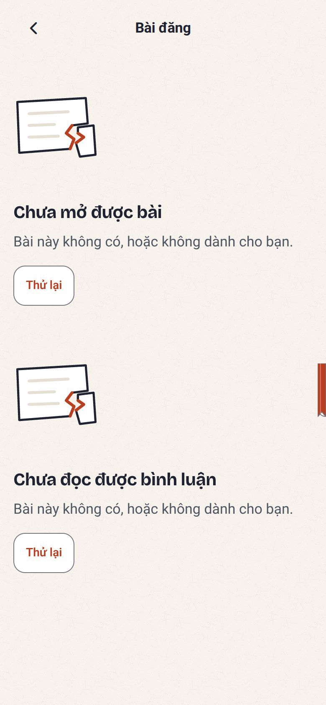 (hàng `TC-F08-BAI-KHONG-DANH-CHO`) |
| Source | `tuong/BaiChiTietScreen.tsx:174` và `:243`: bài và bình luận đọc riêng, mỗi cái vẽ `ErrorState` của mình |
| Đề xuất sửa | Bài không đọc được thì không đọc, không vẽ phần bình luận; lỗi «không có / không dành cho bạn» không kèm «Thử lại» |
| Tiêu chí gỡ | Mở bài không dành cho mình: một khối, không «Thử lại» |

### UI-101 · Trình xem story: hai vùng chạm không có vai trò; câu hỏi xoá không nhận focus

| Trường | Nội dung |
|---|---|
| Category / Severity | UX ISSUE (accessibility) · **P3** |
| Feature / Screen / Layer | F08 · `/stories/[personId]` · L26 |
| Nền tảng, cấu hình | web, C1. Native: `Pressable` không `accessibilityRole` thì TalkBack và VoiceOver không đọc là nút (STATIC) |
| Actual | «Story trước» (137×677) và «Story tiếp theo» (254×677) là `div` có `aria-label`, `tabindex=0`, không role: axe `aria-prohibited-attr` (serious) ×2. Bàn phím: focus vào «Story tiếp theo» được, Enter ở story cuối về Tin nhắn (đạt). Chạm «Xoá story»: câu «Xoá story này? Bạn bè sẽ không thấy nó nữa.» hiện ở chân màn (y 651), không phải hộp thoại, focus ở lại «Xoá story». «Giữ lại» đóng câu hỏi; «Xoá» xoá đúng một story (2 → 1) rồi về Tin nhắn (đạt). Nút 44dp: UI-001 |
| Evidence | 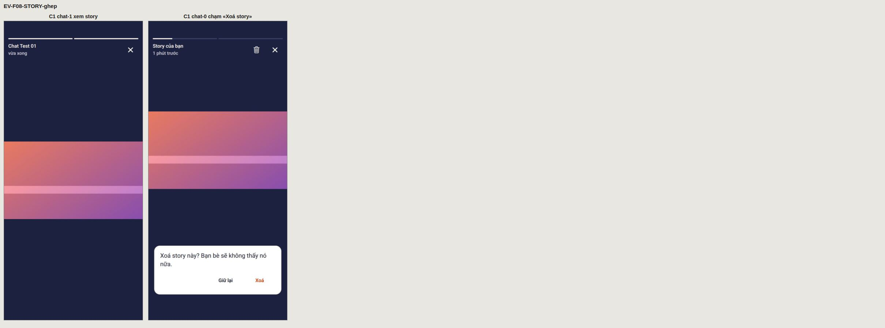 (hàng `TC-F08-STORY-VUNG-CHAM`, `TC-L26-XOA`) |
| Source | `story/XemStoryScreen.tsx:245–246` (hai `Pressable` không `accessibilityRole`); câu hỏi ở dòng 251–263 là một `View` thường |
| Đề xuất sửa | `accessibilityRole="button"` cho hai vùng; câu hỏi hiện thì đưa focus vào nó (hoặc vào «Giữ lại») |
| Tiêu chí gỡ | axe 0 lỗi `aria-prohibited-attr` trên trình xem; focus vào câu hỏi khi nó hiện |

### UI-102 · Ảnh dọc 9:16: xem trước hiện trọn ảnh, lên tường bị cắt đầu và đuôi

| Trường | Nội dung |
|---|---|
| Category / Severity | UX ISSUE · **P3** |
| Feature / Screen | F08 · `/moments/new` → `/groups/[id]/wall` |
| Nền tảng, cấu hình | web, C1; ảnh tổng hợp 360×640 |
| Expected | Khung xem trước cho thấy đúng phần ảnh sẽ hiện trên tường |
| Actual | Hai khung cùng kẹp về 3:4 (332×443 xem trước, 340×453 trên tường). Xem trước vẽ trọn ảnh (`contain`) với hai dải nền hai bên; tường phủ kín khung (`cover`), mất khoảng 25% chiều cao ở đầu và đuôi. Ảnh ngang 16:9 và ảnh 3:4 nằm trong khoảng kẹp nên hai nơi giống nhau (`TC-F08-THA-NGANG`, `TC-F08-THA-DOC-3-4`) |
| Evidence | 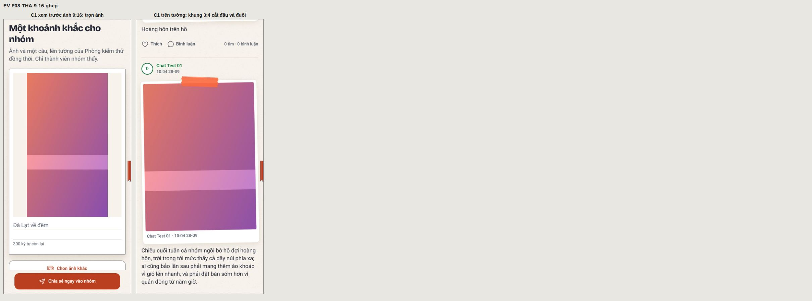 (hàng `TC-F08-THA-XEM-TRUOC`) |
| Source | `ky-niem/ShareMomentLive.tsx:152` (`contentFit="contain"`, `aspectRatio: tiLeKhung(anh)`); `ky-niem/GroupWallLive.tsx:283–291` (`contentFit="cover"`, cùng `tiLeKhung`); `ky-niem/ti-le.ts:8` kẹp tỉ lệ trong 0,75…1,91 |
| Đề xuất sửa | Vẽ cùng một cách ở hai nơi (cùng `cover` và cho thấy phần sẽ bị cắt, hoặc cùng `contain`) |
| Tiêu chí gỡ | Ảnh 9:16: phần hiện ở xem trước và trên tường trùng nhau |

### UI-103 · Kệ album và đầu album chỉ ghi năm, không ghi ngày của chuyến

| Trường | Nội dung |
|---|---|
| Category / Severity | UX ISSUE · **P3** |
| Feature / Screen | F08 · `/groups/[id]/album`, `/trips/[id]/album` |
| Nền tảng, cấu hình | web, C1–C3 (bản có phiên, máy chủ Go) |
| Expected | Chú thích mã của `AlbumLive.tsx` (dòng 20): «The dates and the group are written once, in the heading» |
| Actual | Kèo đi 28–29/09 mà kệ và đầu album đều ghi «2026 · đang đi · 20 người · 3 ảnh · 1 chỗ đã tới · 1 check-in»: không có ngày nào, nhiều chuyến trong cùng năm không phân biệt được bằng thời gian. Bản demo của cùng màn ghi «17 - 19/10/2026» (`TC-F08-KHONG-PHIEN`) |
| Evidence | 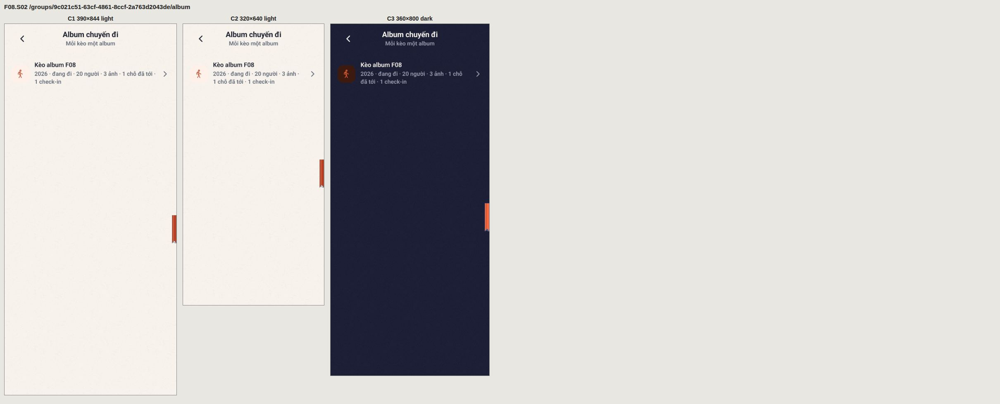 (hàng `TC-F08-ALBUM-NGAY`) |
| Source | `ky-niem/AlbumLive.tsx:61–62` (`cauKhoang` chỉ dùng `period_label`); Go `internal/domain/album/album.go:103–104` (`PeriodLabel` trả `2026` hoặc `2025–2026`), dù miền đã có `StartsOn`, `EndsOn` (dòng 179) |
| Đề xuất sửa | Ghi khoảng ngày của chuyến («28–29/09»), thêm năm khi khác năm nay |
| Tiêu chí gỡ | Kệ và đầu album có ngày của chuyến |

### UI-104 · Giờ trên tường viết «10:07 28-09», khác «28/09» ở mọi chỗ khác

| Trường | Nội dung |
|---|---|
| Category / Severity | VISUAL POLISH (nhất quán) · **P3** |
| Feature / Screen | F08 · `/groups/[id]/wall`. F09 · `/settings/da-chan`, `/settings/phien` |
| Nền tảng, cấu hình | web, C1–C7. Native: định dạng do Intl của Hermes quyết định, có thể khác (HYPOTHESIS) |
| Actual | Dưới tên người đăng và trên mép ảnh in: «10:07 28-09», «Chat Test 01 · 10:04 28-09», ngày và tháng nối bằng gạch nối. Chat, bài, story và album viết «vừa xong», «3 giờ trước», «28/09». F09: «Chặn từ 28/9/2026» và «Số điện thoại · từ 28/9/2026» (tháng không đệm 0) nằm cạnh «Hết hạn 28/10/2026» (`toLocaleDateString("vi-VN")` ở `DaChanScreen.tsx:102`, `PhienScreen.tsx:103`, `phien-cai-dat.ts:71`; `TC-F09-NGAY`) |
| Evidence | 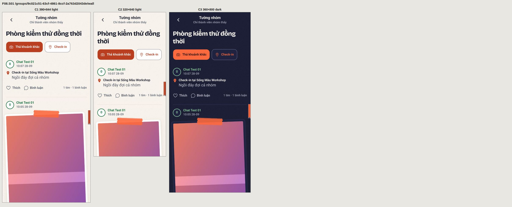 (hàng `TC-F08-GIO-TUONG`) |
| Source | `ky-niem/GroupWallLive.tsx:70`: `toLocaleString("vi-VN", { day, month, hour, minute: "2-digit" })`; ICU vi-VN nối ngày tháng bằng «-» |
| Đề xuất sửa | Dùng chung hàm ghi thời gian của app (tương đối, hoặc «28/09») |
| Tiêu chí gỡ | Tường ghi ngày như các màn khác |

### UI-105 · Tablet: ảnh trên tường, ảnh dẫn album, bài và hàng kệ trải hết bề ngang

| Trường | Nội dung |
|---|---|
| Category / Severity | VISUAL POLISH · **P3** (cùng họ UI-031, UI-047, UI-081, UI-093) |
| Feature / Screen | F08.S01, F08.S02, F08.S03, F08.S08 |
| Nền tảng, cấu hình | web, C6, C7 |
| Expected | Cột nội dung có trần, như chính «Thả khoảnh khắc» (640px) và khay tạo (560px); một ảnh dọc không cao hơn một màn |
| Actual | Tường: ảnh in dọc 702×936 ở C6 (cửa sổ cao 1024) và 894×1192 ở C7 (cao 1366); ảnh ngang 702×395 và 894×503. Album: ảnh dẫn 720×383 và 912×465, lưới giữ 2 ô 175 và 223px, nửa phải trống. Kệ: hàng trải hết bề ngang, mũi tên ở mép phải xa chữ. Bài: thẻ bài và ảnh trải hết bề ngang. F09: tab Cá nhân ở C7: thẻ hộ chiếu 872px, các hàng 842px trải hết bề ngang; C6 616px nằm vừa trong trần nhờ rail (`TC-F09-TABLET`, ảnh ghép C1–C7 `EV-F09.S01-BASE-ghep`) |
| Evidence | 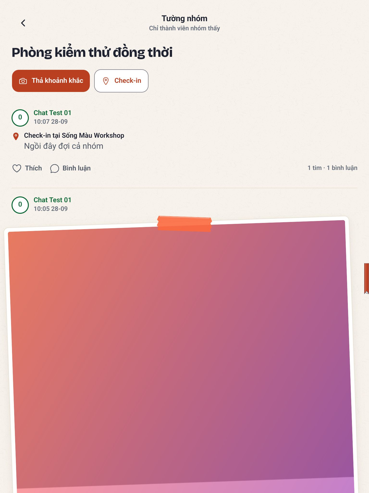 (hàng `TC-F08-TABLET` C6/C7; baseline `TC-F08.S01/S02/S03/S08-BASE` C4–C7) 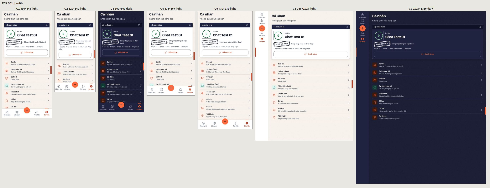 |
| Source | `ky-niem/GroupWallLive.tsx`, `ky-niem/AlbumLive.tsx`, `tuong/BaiChiTietScreen.tsx` không đặt `maxWidth`; `ky-niem/ShareMomentLive.tsx:172` có `maxWidth: 640`, cách làm đã có trong cùng feature |
| Tiêu chí gỡ | C6/C7: cột nội dung ≤ 640px; ảnh dọc trên tường không cao hơn cửa sổ |

### UI-106 · Thành tích ở 320px: thẻ huy hiệu vừa mở bẻ đôi chữ

| Trường | Nội dung |
|---|---|
| Category / Severity | UX ISSUE (layout) · **P3** (cùng họ UI-055: `NepDien` chen trong một hàng) |
| Feature / Screen | F08 · `/achievements` (khoảnh khắc M8) |
| Nền tảng, cấu hình | web, C2 (320×640). C1, C3, C4, C5, C9 không bẻ chữ (cột chữ 106, 76, 91, 146, 106px) |
| Điều kiện | Lần đầu mở «Thành tích» trên máy này sau khi một huy hiệu vừa mở («Mới mở», Nếp M8). Lần sau (tải lại) Nếp không còn, cột chữ 162px |
| Expected | Tên huy hiệu và điều kiện xuống dòng giữa hai từ |
| Actual | Hàng nổi bật chia 80 (con dấu) + 36 (chữ) + 112 (Nếp M8) trong thẻ 288px: «Mở hà / ng» 3 dòng, «Chia kho / ản chi đầu tiên» 6 dòng, «Mới / mở» 2 dòng |
| Evidence | 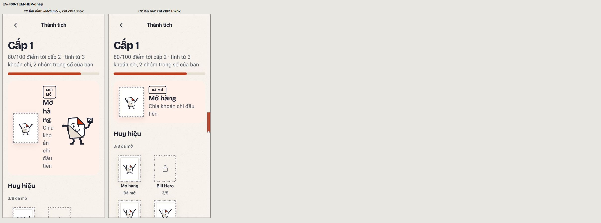 (hàng `TC-F08-TEM-HEP` C2; baseline `TC-F08.S09-BASE`) |
| Source | `ky-niem/AchievementsLive.tsx:142–152` (`noiBat`: `Tem` 80, cột chữ `flex: 1`, `NepDien` 112 trong một hàng; style dòng 222) |
| Hậu quả | Lúc ăn mừng huy hiệu mới là lúc chữ khó đọc nhất, trên máy nhỏ |
| Đề xuất sửa | Ở cỡ compact đặt Nếp M8 xuống dưới hoặc thu nhỏ, hoặc cho cột chữ `minWidth` |
| Tiêu chí gỡ | C2 lần đầu: không từ nào bị bẻ; cột chữ ≥ 120px |

## F09 Hồ sơ · Cài đặt

### UI-015 · Màn Cài đặt hiện dữ liệu giữ chỗ («Bạn», avatar «B», công tắc tắt) rồi mới đổi

| Trường | Nội dung |
|---|---|
| Category / Severity | UX ISSUE · **P3** |
| Feature / Screen | F09 · `/settings` (`cai-dat/CaiDatScreen.tsx`) |
| Nền tảng, cấu hình | web, C1, stack cục bộ (mạng nhanh) |
| Tái hiện | Từ Cá nhân chạm «Cài đặt», quay khung hình |
| Actual | Ở 130 ms: avatar «B», tên «Bạn», công tắc «Tìm theo số điện thoại» tắt. Từ 162–197 ms: «Minh Anh», công tắc lật sang bật. Mạng chậm thì trạng thái giả kéo dài hơn |
| Evidence | 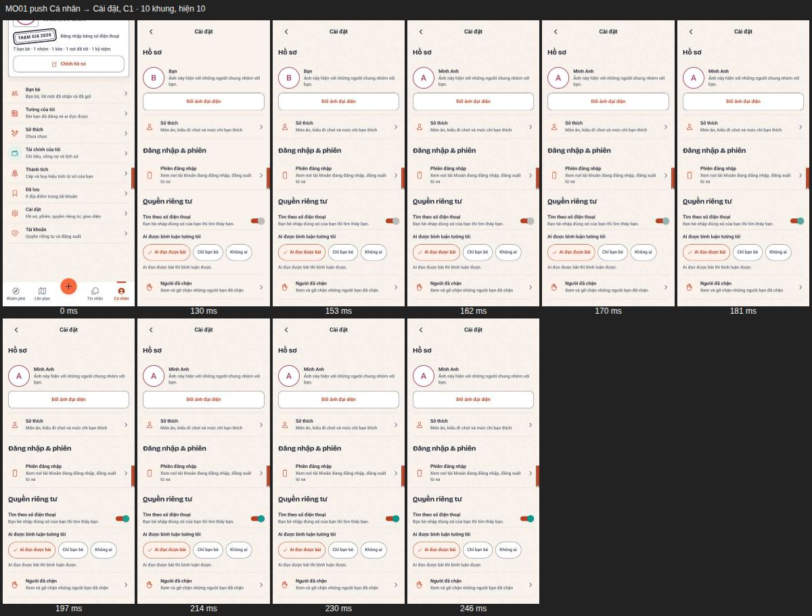 |
| Hậu quả | Nháy nội dung sai; công tắc tự lật trông như thiết lập vừa bị đổi. Chạm vào công tắc trong lúc còn hiện trạng thái giả có thể ghi ngược ý người dùng (HYPOTHESIS, chưa đo) |
| Đề xuất | Skeleton hoặc ẩn control tới khi có dữ liệu; công tắc `disabled` trong lúc tải |
| Tiêu chí gỡ | Không khung nào hiện tên/giá trị giữ chỗ |

### UI-107 · Cài đặt: lưu công tắc hoặc chip lỗi thì câu lỗi nằm ở cuối trang, ngoài khung nhìn

| Trường | Nội dung |
|---|---|
| Category / Severity | UX ISSUE · **P2** (cùng họ UI-051, UI-095) |
| Feature / Screen | F09 · `/settings` (`cai-dat/CaiDatScreen.tsx`) |
| Nền tảng, cấu hình | web, C1; máy chủ trả 503 cho `PATCH /people/me` (giả lập bằng `route()`). Native: cùng mã (STATIC) |
| Tái hiện | Cá nhân → «Cài đặt» → chạm công tắc «Tìm theo số điện thoại» trong lúc máy chủ lỗi |
| Expected | Câu lỗi ngay gần công tắc, trong khung nhìn; công tắc giữ trạng thái cũ |
| Actual | Công tắc ở y 422 đứng yên ở «bật» (đúng, vì chưa lưu được). Câu «Rủ Đi đang gặp sự cố nên chưa làm được việc này. Chưa có gì bị ghi sai, thử lại sau một chút.» nằm ở y 1124 trong cửa sổ cao 844, cuối trang, dưới cả mục «Xoá tài khoản». Quanh công tắc không có gì đổi |
| Evidence | 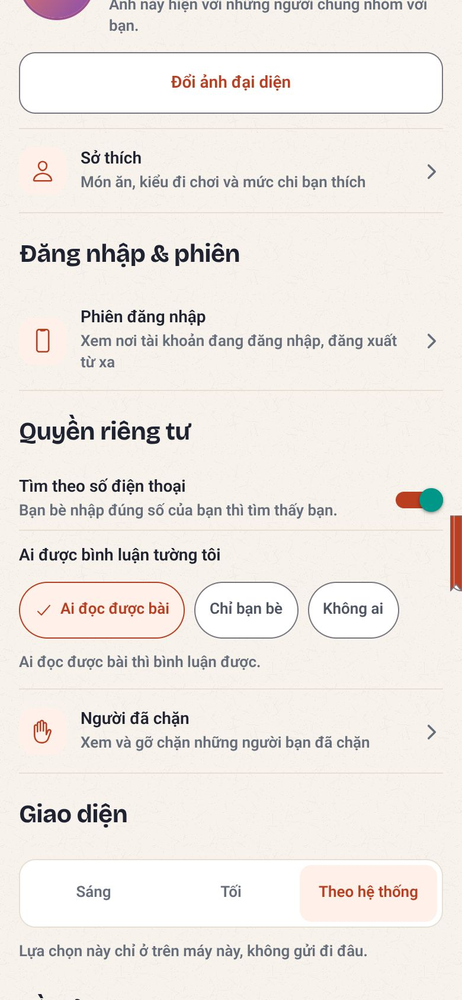 (hàng `TC-F09-LOI-CONG-TAC`) |
| Source | `CaiDatScreen.tsx:227`: một `loi` cho mọi thao tác của trang (công tắc dòng 166, chip dòng 177, đổi ảnh dòng 132), vẽ ở cuối trang |
| Hậu quả | Người đổi quyền riêng tư thấy công tắc không nhúc nhích mà không biết vì sao; dễ chạm lại nhiều lần hoặc bỏ đi với thiết lập chưa đổi |
| Đề xuất sửa | Câu lỗi đặt ngay dưới mục vừa thao tác (công tắc, nhóm chip, ảnh), hoặc cuộn tới câu và đưa focus vào đó |
| Tiêu chí gỡ | Lỗi khi lưu công tắc, chip hay ảnh: câu nằm trong khung nhìn, sát mục vừa chạm |

### UI-108 · Cá nhân: panel «Tài khoản», «Đã lưu» và form «Chỉnh hồ sơ» có «Quay lại» như màn con, nhưng Back rời Cá nhân

| Trường | Nội dung |
|---|---|
| Category / Severity | UX ISSUE (điều hướng) · **P3** (cùng họ UI-038) |
| Feature / Screen / Layer | F09 · `(tabs)/profile` · L36 panel trong màn |
| Nền tảng, cấu hình | web, C1. Native Android: Back phần cứng đi theo tab (về Khám phá), vì panel là state chứ không phải route; màn không nghe `BackHandler` (STATIC) |
| Tái hiện | A: mở Khám phá, chạm tab «Cá nhân», mở «Tài khoản» (hoặc «Chỉnh hồ sơ» rồi gõ vào ô giới thiệu), bấm Back. B: tới `/profile` bằng một link từ Tin nhắn rồi làm như trên |
| Expected | Panel và form trông như một màn con (tiêu đề giữa, chevron «Quay lại»), nên Back đóng panel và ở lại Cá nhân; chữ đang gõ không mất mà không hỏi |
| Actual | A: Back về Khám phá; chạm lại tab thì panel (hay form, còn nguyên chữ «Đang gõ dở thì bấm Back») vẫn mở. B: Back về Tin nhắn; chạm lại tab thì panel đóng, form đóng và chữ đang gõ mất (máy chủ vẫn giữ giới thiệu cũ). «Quay lại» của panel thì đúng: về trang Cá nhân. Đổi tab khi panel mở rồi quay về: panel vẫn mở |
| Evidence | 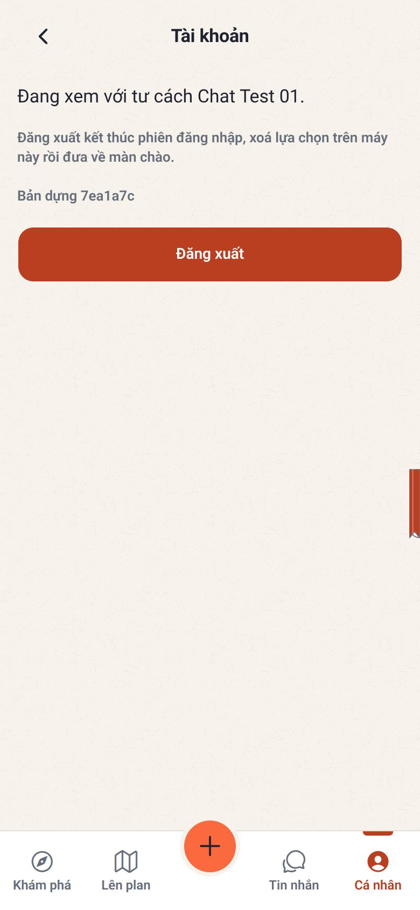 (hàng `TC-L36-VONGDOI`, `TC-F09-SUA-BACK`) |
| Source | `screens/Profile.tsx:64` (`panel` là state), dòng 98–146 (`TopBar onBack={() => setPanel("home")}`); `profile/HoSoSong.tsx:50` (`dangSua`) và dòng 110–137 (form) |
| Hậu quả | Back quen tay rời hẳn tab; theo đường link thì mất chữ đang sửa trong hồ sơ |
| Đề xuất sửa | Đưa «Tài khoản», «Đã lưu» và form sửa thành route con của Cá nhân, hoặc chặn Back để đóng panel trước (`usePreventRemove` / `BackHandler`) |
| Tiêu chí gỡ | Cả hai đường A và B: Back khi panel hay form mở thì ở lại Cá nhân và đóng panel; chữ đang gõ không mất mà không hỏi |

### UI-109 · «Đã lưu» chỉ có con số, không có danh sách chỗ đã lưu

| Trường | Nội dung |
|---|---|
| Category / Severity | UX ISSUE · **P3** |
| Feature / Screen / Layer | F09 · `(tabs)/profile` · L36 panel «Đã lưu» |
| Nền tảng, cấu hình | web, C1; moi-54 lưu 2 địa điểm qua API |
| Expected | Panel cho thấy các nơi đã lưu (tên, lối mở), đúng như câu của chính nó nói «Danh sách lưu…» |
| Actual | Tiêu đề «2 địa điểm», câu «Danh sách lưu trong tài khoản của bạn. Mở Khám phá để thêm.», một nút «Mở Khám phá»; không tên chỗ nào. Đọc mã: Khám phá chỉ tô tim trên từng hàng, không có bộ lọc «đã lưu»; không màn nào liệt kê chỗ đã lưu |
| Evidence | 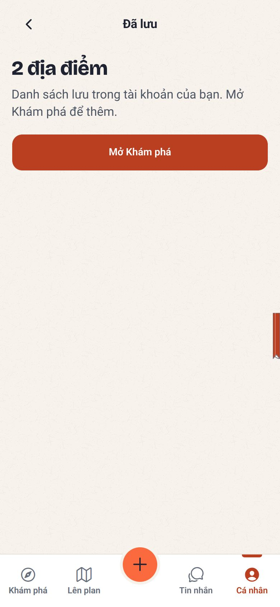 (hàng `TC-F09-DA-LUU`) |
| Source | `screens/Profile.tsx:135–146` (panel chỉ in số và nút); `explore/ExploreLive.tsx:361` (tim trên hàng) |
| Hậu quả | Người dùng lưu một quán để quay lại sau không có chỗ nào để tìm lại nó, trừ việc dò từng hàng ở Khám phá |
| Đề xuất sửa | Liệt kê các chỗ đã lưu trong panel (tên, khu vực, chạm để mở), hoặc một bộ lọc «Đã lưu» ở Khám phá mà panel dẫn tới |
| Tiêu chí gỡ | Từ «Đã lưu» mở được từng chỗ đã lưu |

### UI-110 · Xoá tài khoản: từ xác nhận là «XOA» không dấu, gõ «XOÁ» thì nút tắt mà không nói vì sao; Back ở bước 2 rời trang

| Trường | Nội dung |
|---|---|
| Category / Severity | UX ISSUE · **P3** |
| Feature / Screen / Layer | F09 · `/settings/xoa-tai-khoan` · L27 |
| Nền tảng, cấu hình | web, C1, moi-55 (tài khoản dùng một lần, đã xoá ở cuối ca) |
| Tái hiện | Cài đặt → «Xoá tài khoản» → «Tôi hiểu, tiếp tục»; gõ lần lượt «xoá», «XOÁ», «xoa», «XOA»; ở bước 2 bấm Back |
| Expected | Từ xác nhận viết như mọi chữ «Xoá» trên chính màn đó, hoặc gõ «XOÁ» cũng được nhận; khi nút chưa bật thì nói vì sao; Back ở bước 2 về bước 1 |
| Actual | Câu nhắc «Gõ XOA vào ô dưới để xác nhận.», trong khi tiêu đề, nút và mọi câu trên màn viết «Xoá». Với «xoá» và «XOÁ»: «Xoá vĩnh viễn» tắt (viền đứt), dòng ngay dưới là «Ở lại», không câu nào nói phải bỏ dấu. Với «xoa» và «XOA»: bật. Back ở bước 2 về `/settings`, không về bước 1. Phần còn lại đạt: bước 1 nói rõ cái gì mất và cái gì ở lại; «Xoá vĩnh viễn» với «XOA» xoá thật, token cũ trả 401, tải lại vẫn ở màn chào (`TC-F09-XOA-TAI-KHOAN`) |
| Evidence | 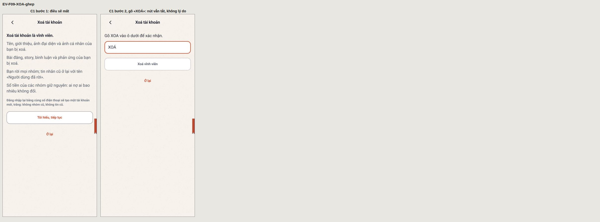 (hàng `TC-L27-VONGDOI`) |
| Source | `cai-dat/xoa-tai-khoan.ts:11` (`TU_XAC_NHAN = "XOA"`), dòng 27–29 (`trim().toUpperCase() === "XOA"`); `XoaTaiKhoanScreen.tsx:29` (bước là state), dòng 87–93 (nút tắt, không `lyDo`) |
| Hậu quả | Người gõ đúng chữ họ đọc thấy khắp màn bị kẹt ở một nút tắt mà không có gợi ý; bước nhỏ nhưng ở đúng hành động không lấy lại được |
| Đề xuất sửa | Nhận cả «XOÁ» (so sau khi bỏ dấu), hoặc đổi câu nhắc và nói lý do dưới nút («Gõ đúng XOA, không dấu»); bước 2 vào URL hoặc Back về bước 1 |
| Tiêu chí gỡ | Gõ «XOÁ» thì bật nút, hoặc có câu lý do ngay dưới nút; Back ở bước 2 về bước 1 |

### UI-111 · Câu cuối trang Cài đặt chỉ sai chỗ đổi tên hiển thị

| Trường | Nội dung |
|---|---|
| Category / Severity | UX ISSUE (chữ lệch với màn) · **P3** |
| Feature / Screen | F09 · `/settings` |
| Nền tảng, cấu hình | web, C1 |
| Actual | Cuối trang: «Đăng nhập, đăng xuất và tên hiển thị vẫn nằm ở mục Tài khoản trên màn Cá nhân.» Panel «Tài khoản» của Cá nhân có «Đang xem với tư cách …» và «Đăng xuất», 0 ô nhập; tên đổi ở «Chỉnh hồ sơ» trên thẻ hộ chiếu |
| Evidence | 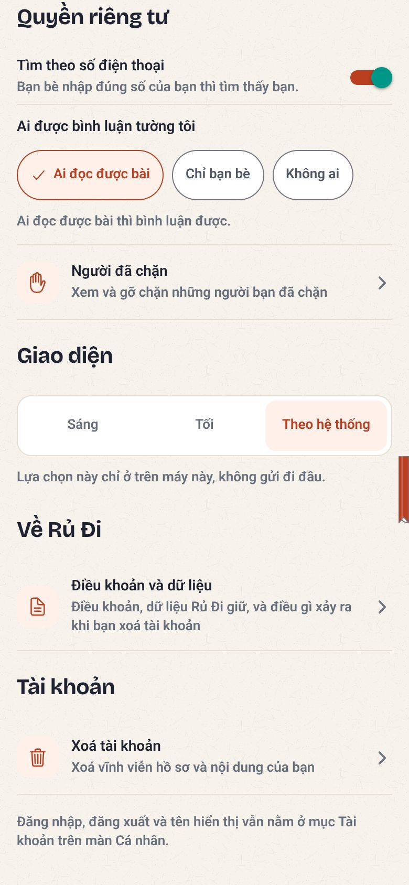 (hàng `TC-F09-CHU-CHAN-TRANG`) |
| Source | `CaiDatScreen.tsx:228–230`; `screens/Profile.tsx:98–124` (panel «Tài khoản» không có ô tên); `profile/HoSoSong.tsx:189` («Chỉnh hồ sơ») |
| Đề xuất sửa | «Tên hiển thị đổi ở "Chỉnh hồ sơ" trên màn Cá nhân; đăng xuất ở mục Tài khoản» |
| Tiêu chí gỡ | Câu chỉ đúng chỗ đổi tên |

### UI-112 · Web: sang màn mới thì focus nằm ở `body`, không vào màn mới

| Trường | Nội dung |
|---|---|
| Category / Severity | UX ISSUE (accessibility, web) · **P3** |
| Feature / Screen | F00 (điều hướng toàn app), đo ở F08 và F09 |
| Nền tảng, cấu hình | web, C1. Native: React Navigation báo màn mới cho trình đọc màn hình theo cách của hệ điều hành; chưa đo (BLOCKED) |
| Tái hiện | Đi tới màn bằng nút trong app, đọc `document.activeElement` ngay khi màn mới hiện |
| Expected | Focus vào màn mới (tiêu đề hay phần tử đầu), để người dùng trình đọc màn hình và bàn phím biết đã sang màn khác và bắt đầu từ đầu màn |
| Actual | Focus ở `body` sau khi mở «Cài đặt», «Đăng nhập & phiên», «Người đã chặn», «Xoá tài khoản», trình xem story, «Thả khoảnh khắc» và «Đăng story» (7/7 màn đã đo). Sau khi đóng trình xem story focus cũng ở `body`. Đối chứng: hộp thoại và sheet thì đưa focus vào trong và trả về khi đóng (`TC-L25-VONGDOI`, `TC-L24-VONGDOI`) |
| Evidence | hàng `TC-F09-FOCUS-MAN` (gom số đo của `TC-F09-CAI-DAT-ARIA`, `TC-F09-PHIEN`, `TC-F09-BO-CHAN`, `TC-L27-VONGDOI`, `TC-L26-VONGDOI`, `TC-L34-VONGDOI`) |
| Source | Không màn nào đặt focus khi nhận focus điều hướng; `TopBar` (`ui.tsx:217`) không đưa tiêu đề vào focus |
| Hậu quả | Trên web, người dùng trình đọc màn hình không được báo đã sang màn mới; người dùng bàn phím bắt đầu Tab lại từ đầu trang |
| Đề xuất sửa | Khi màn nhận focus điều hướng, đưa focus vào tiêu đề của `TopBar` (`accessibilityRole="header"`, focus được bằng lập trình), hoặc một vùng live nói tên màn |
| Tiêu chí gỡ | Sau khi mở mỗi màn trên, `document.activeElement` nằm trong màn mới |

## F10 Bảng QA dev

Các issue dưới đây đo trên `/dev/ui-lab` và `/dev/san-khau`, trên server dev bật cờ fixture. Hai bảng dựng **đúng
component mà app dùng** với dữ liệu tổng hợp, để thấy những trạng thái mà dữ liệu sống trên stack cục bộ không có.
Mỗi issue ghi rõ app thật có vào được trạng thái đó hay không.

### UI-113 · Khám phá, cặp so sánh không ảnh: ở màn 320dp, tim «Lưu» của ô có dấu bị đẩy ra ngoài mép phải

| Trường | Nội dung |
|---|---|
| Category / Severity | UX ISSUE (layout, mất nội dung) · **P2** |
| Feature / Screen | F02 · `(tabs)/explore`, component `PlaceCompare` (`explore/HangDiaDiem.tsx`); đo trên bảng dev F10.S01 |
| Nền tảng, cấu hình | web, C2 (320×640). C1 (390), C4 (375) và C3 (360) thì vừa. Đo trên `/dev/ui-lab`, nơi bảng dùng đúng renderer của Khám phá sống với dữ liệu tổng hợp. Khám phá sống trên stack cục bộ không vào được trạng thái này: dấu «Hợp gu» lấy từ kết quả khớp của AI (`place.match` có `real`), mà stack không có khoá AI. Đã kiểm dalat-0, chat-0, moi-51 ở C2: 0 dấu, 0 tim bị cắt. Native: cùng một hàng flex, HYPOTHESIS |
| Điều kiện ban đầu | Cặp so sánh mà cả hai quán không có ảnh, và một quán mang dấu. Trên app thật, dấu là «Hợp gu» khi AI khớp mà không kèm câu lý do |
| Tái hiện | `/dev/ui-lab` ở 320dp → mục «Khám phá · renderer live» → chip «Không ảnh» → nhìn cặp «Lẩu gà lá é» / «Still Cafe» |
| Expected | Hai nút «Lưu …» nằm trọn trong ô của mình, như ở 360dp trở lên |
| Actual | Hàng đầu ô «Still Cafe» gồm biểu tượng, dấu «HỢP GU», khoảng trống và tim, rộng hơn nửa màn. Nút «Lưu Still Cafe» 48dp nằm ở x 294–342 trong cửa sổ 320, chỉ còn thấy 26dp; icon tim bị cắt 9px, còn nửa trái. Chạm vào phần còn thấy vẫn trúng nút. Ô «Lẩu gà lá é» (không dấu) vừa: x 104–152 |
| Evidence | 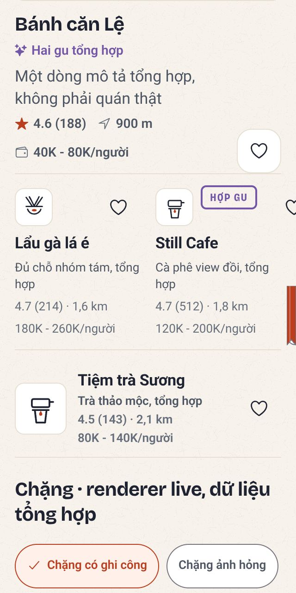 (hàng `TC-F10-SO-SANH-TIM` C1/C4/C2; cửa sổ 21 của `TC-F10.S01-BASE` C2) |
| Source | `HangDiaDiem.tsx:328–341`: nhánh `khongAnhNao`, hàng `ungVienDau` là `PlaceGlyph` + `Stamp` + `flex1` + `IconButton`, không co giãn và không xuống dòng |
| Hậu quả | Trên máy hẹp chỉ thấy nửa icon tim, vùng chạm còn 26dp: dễ không nhận ra nút lưu, dễ chạm trượt. Vẫn lưu được từ màn chi tiết quán |
| Đề xuất sửa | Khi thiếu chỗ, cho dấu xuống dưới biểu tượng hoặc thu dấu lại; hoặc xếp dọc cặp so sánh ở bề rộng hẹp |
| Tiêu chí gỡ | Ở 320dp, cả hai nút «Lưu …» của cặp so sánh không ảnh nằm trọn trong ô và trong màn |

### UI-114 · Khám phá, cặp so sánh có ảnh: nút «Lưu …» nằm lồng trong nút «Mở …»

| Trường | Nội dung |
|---|---|
| Category / Severity | BUG (accessibility, web) · **P3** |
| Feature / Screen | F02 · `(tabs)/explore`, component `PlaceCompare` (`explore/HangDiaDiem.tsx`); đo trên bảng dev F10.S01 |
| Nền tảng, cấu hình | web, C1. Chỉ khi ít nhất một quán trong cặp có ảnh (các chip «Có ảnh», «Ảnh hỏng», «Cặp lệch»); «Không ảnh» thì không lồng. Khám phá sống trên stack cục bộ không có ảnh quán nên không vào nhánh này (0 nút lồng). Native: chưa đo |
| Tái hiện | `/dev/ui-lab` → «Khám phá · renderer live» → chip «Có ảnh» → đọc cây DOM, hoặc chạy axe |
| Expected | «Mở …» và «Lưu …» là hai control tách nhau, không cái nào nằm trong cái kia |
| Actual | `button «Mở Lẩu gà lá é»` chứa `button «Lưu Lẩu gà lá é»`, và tương tự với «Still Cafe». axe báo `nested-interactive` (serious) trỏ đúng hai nút «Mở …». Bản dev còn hiện cảnh báo của React: «`<button>` cannot contain a nested `<button>`». Trên Chromium, chạm tim vẫn lưu («Lưu» → «Bỏ lưu»), và focus vào tim rồi Enter cũng đổi lại được |
| Evidence | 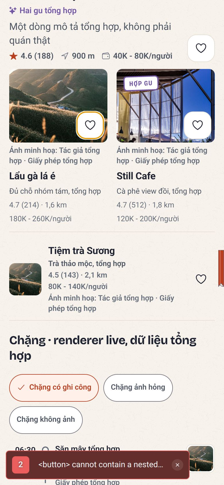 (hàng `TC-F10-TIM-LONG`) |
| Source | `HangDiaDiem.tsx:350–375`: `IconButton` lưu nằm trong `overlay` của `MediaSlot`, bên trong `Pressable` «Mở …». Nhánh không ảnh (`:328–345`) đặt tim bên ngoài `Pressable` |
| Hậu quả | Nút trong nút là HTML không hợp lệ; trình đọc màn hình có thể đọc gộp hoặc bỏ qua nút bên trong. Trình duyệt và trình đọc màn hình khác chưa đo |
| Đề xuất sửa | Đưa tim ra khỏi `Pressable` «Mở …» (vẫn đặt đè lên góc ảnh bằng vị trí tuyệt đối), như nhánh không ảnh đang làm |
| Tiêu chí gỡ | axe không còn `nested-interactive` ở cặp so sánh có ảnh; tim vẫn nằm trên góc ảnh và vẫn lưu được |

### UI-115 · Sân khấu có kéo nghiêng: trên web, cú kéo dọc bắt đầu trên tranh không cuộn trang

| Trường | Nội dung |
|---|---|
| Category / Severity | BUG (web) · **P3**. Chưa chạm tới người dùng: ở mốc `7ea1a7c`, chỉ bảng dev bật kéo nghiêng |
| Feature / Screen | F10 · `/dev/san-khau`; component `CanhGap` khi `keo` bật (`ui/CanhGap.tsx`, `ui/useThiSai.ts`), dùng làm đầu màn sân khấu |
| Nền tảng, cấu hình | web, C1. C9 (giảm chuyển động) không bị, vì cử chỉ tắt. Native: RNGH phân xử bằng `failOffsetY`, HYPOTHESIS là không bị |
| Tái hiện | `/dev/san-khau` → kéo dọc 160dp, bắt đầu trên tranh «Phố đêm» (cao 119dp) |
| Expected | Danh sách cuộn theo tay. Chú thích trong mã cũng hứa vậy: cử chỉ chỉ nhận cú kéo rõ ràng sang ngang, «the list under the stage keeps every vertical scroll» |
| Actual | C1: danh sách đứng yên (0 → 0). Cùng cú kéo nhưng bắt đầu dưới tranh thì cuộn 175dp. C9: cuộn 175dp cả khi bắt đầu trên tranh. Lớp bọc của `GestureDetector` mang `touch-action: none`, nên trình duyệt không bắt đầu cuộn được. Phần kéo ngang thì đạt: tranh nghiêng theo tay (6,5% điểm ảnh đổi khi giữ), thả ra về đúng chỗ, trang không cuộn ngang |
| Evidence | hàng `TC-F10-KEO-DOC-TREN-TRANH` (C1/C9) và `TC-F10-MO12-KEO` (C1/C9) |
| Source | `CanhGap.tsx:107` (`GestureDetector` bọc sân khấu khi `keo`); `useThiSai.ts:28–31` (`activeOffsetX`, `failOffsetY`) |
| Hậu quả | Màn nào bật `keo` trên web sẽ có vùng tranh (khoảng 120–200dp đầu màn) không cuộn được bằng tay |
| Đề xuất sửa | Trên web cho lớp bọc `touch-action: pan-y`, hoặc không bật `keo` ở web |
| Tiêu chí gỡ | Ở C1, kéo dọc bắt đầu trên tranh cuộn danh sách như bắt đầu ở chỗ khác |

