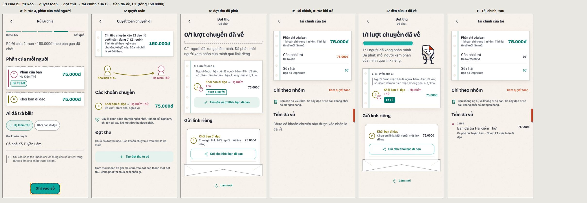

# Audit UI/UX app mobile RuDi: báo cáo

- Ngày: 27/09/2026. Cây đo: `7ea1a7c` (trùng `origin/main` lúc bắt đầu). Nhánh ghi: `claude/busy-cray-vfmt4r`.
- MODE = **AUDIT_ONLY**: không sửa mã app; chỉ thêm tài liệu, ảnh bằng chứng và harness đo.
- protocol_version: không áp dụng (không đụng giao thức v1 hay trang khách).
- Verdict: không có (chưa có reviewer thật; đây là báo cáo phát hiện).
- Trạng thái: **xong pipeline**: F00–F11, E1–E6 và verify cuối trong cây sạch (§E). Còn hàng đợi sau pipeline, đo trên
  bản dựng từ `main` mới. Mục «Checkpoint» ở cuối là nguồn sự thật về phần đã và chưa đo.
- Trong lúc audit, `main` đã đi tiếp tới `33d29fe` (49 commit: Cộng đồng, Nhật ký chuyến, sửa ở Khám phá, Kèo, Hồ sơ),
  rồi tới `16f24d5` (thêm 4 PR: AI v2, Rủ Đi AI trong chat hai người, sổ kỷ niệm Nếp v3, hồ sơ kể chuyện và sổ huy
  hiệu). Đợt này **giữ mốc `7ea1a7c`** tới hết pipeline, để số đo giữa các checkpoint so được với nhau. Feature mới
  nằm trong hàng đợi sau pipeline (mục «Checkpoint»).

Tài liệu đi kèm:
- `inventory.md`: danh mục feature → screen → lớp UI → motion.
- `coverage-matrix.md`: mọi hàng test, sinh từ sổ kết quả, có đếm.
- `issues.md`: từng phát hiện với bước tái hiện và ảnh.
- `evidence-manifest.md`: danh sách ảnh đã commit.
- Harness: `tests/qa/mobile-ui-audit/` (README ở đó).

## A. Phạm vi và môi trường

### Đã chạy thật

| Thứ | Giá trị |
|---|---|
| Nền tảng runtime | **web** (react-native-web), bản **production export** (`expo export --platform web`, không lớp phủ dev) |
| Trình duyệt | Chromium 141 headless, giả lập di động (`isMobile`, `hasTouch`), DPR 2, locale `vi-VN`, giờ `Asia/Ho_Chi_Minh` |
| Vẽ | WebGL qua SwiftShader; mọi ảnh ghi `data-renderer`: sân khấu vẽ bằng **Skia** (không phải SVG dự phòng) |
| Chữ | Chữ thân Roboto qua một file fontconfig riêng, vì mặc định máy chỉ có DejaVu Sans (rộng hơn Roboto/SF). Tiêu đề là Bricolage của app |
| Backend | Postgres 16 cục bộ, API Python, cửa trước Go (`core serve`, 152/159 route phục vụ bằng Go), `MOBILE_AUTH_MODE` vắng nên là `prod`, OTP debug |
| Dữ liệu | `seed:rudi` (Team Đà Lạt: 8 người, 13 tin, 1 kèo 3 ngày, bill 1.280.000đ, 1 đợt thu, 5 kỷ niệm) + chat seed (22 người tổng hợp, nhóm 20 thành viên, 2 DM). Toàn bộ là dữ liệu giả; số điện thoại bị che trên mọi ảnh |
| Phiên | OTP qua API một lần cho mỗi persona, rồi gắn vào trang bằng `POST /sessions/web` (cookie HttpOnly, đúng đường app tự dùng sau khi tải lại). Luồng OTP qua UI được audit riêng ở F01 |
| Gián đoạn | Máy khởi động lại năm lần: giữa F02, giữa F04, giữa F06 (ba lần này lúc phiên chờ hạn mức), giữa E1 và giữa verify cuối. Mỗi lần Postgres, API và cửa Go được dựng lại trên đúng thư mục dữ liệu cũ, không seed lại; phiên đã lưu vẫn dùng được. Lượt đầu của `TC-E1-VAO-CUA` chạy khi stack chưa dựng lại, nên bị rút (lỗi môi trường) và đo lại. Ở verify cuối, lượt F00 đầu trong cây sạch dừng ở bước gắn phiên («Failed to fetch») trước khi ghi hàng nào; dựng lại stack rồi chạy lại |
| Dữ liệu biến thể (F03) | `tests/qa/mobile-ui-audit/seed-bien-the.mjs` tạo qua API của app hai kèo giả: tên 96 ký tự với 12 chặng dài (một nhãn 57 ký tự liền), và kèo 2 ngày không chặng. Ca nào ghi vào hai kèo này thì đặt lại chặng sau đó. Việc dọn dẹp chỉ chạy trên DB cục bộ: xoá kèo «Kèo thử…» do ca tạo kèo sinh ra, xoá check-in của kèo biến thể. Không route nào xoá được hai thứ này, và đã kiểm trước: không bảng hay tin chat nào tham chiếu tới chúng |
| Ghi tiền (F04) | Sổ tiền là append-only (trigger chặn sửa, xoá nghĩa vụ), nên mọi lần ghi ở lại trên DB cục bộ. Team Đà Lạt **không bị ghi sổ**: 1 khoản chi, 1 đợt, 0 biên nhận như lúc seed; chỉ có thêm 17 bill nháp (`POST /bills` ở bước 2 → 3, không route nào liệt kê, UI không hiện). Mọi lần ghi đi vào nhóm chat-test 20 người: 3 khoản chi (13.705.678đ và hai khoản «Trà đá» 20.000đ), 1 đợt đã phát (19 link, lưu trong localStorage của context test rồi mất khi đóng), 3 biên nhận «Tiền đã về». Ghi tiền không đăng tin chat (đã đọc mã Go), nên ảnh F05 không bị ảnh hưởng |
| Ghi chat (F05) | Team Đà Lạt chỉ được đọc: vẫn 13 tin như lúc seed. Mọi lần ghi đi vào luồng chat cũ (chưa mã hoá đầu cuối) của nhóm chat-test 20 người: 40 tin tổng hợp do `seed-bien-the.mjs --chat` gửi qua API (đoạn dài, URL 158 ký tự, 4 dòng, emoji), cộng các tin của từng ca. Tổng hiện có 59 tin: 51 chữ, 3 thẻ (2 bình chọn, 1 tờ hẹn chung «Lẩu» bản 1), 3 tin đã xoá, 1 ảnh tổng hợp 480×360, 1 sticker. Có 13 phiếu (1 ở bình chọn đã chốt, 12 ở bình chọn mở, do chat-0 tới chat-11 bỏ qua API) và 1 báo cáo «quấy rối» nhắm vào một tin của Chat Test 02. Chat hai người chat-0/chat-1 chỉ được mở, 0 tin. Thêm một tài khoản mới `moi-50` (không nhóm) cho trạng thái rỗng. Không route nào xoá tin khỏi luồng cũ (xoá chỉ đổi thành «Tin nhắn đã bị xoá»), nên các hàng này ở lại trên DB cục bộ |
| Ghi nhóm và người (F06) | Mọi lần ghi đi vào ba tài khoản mới và hai người của chat seed không có nhóm. `moi-51` mở hai nhóm «Nhóm kiểm thử F06 …» (một lần thường, một lần sau lỗi 503) và mời số của `moi-52`, `moi-53`; hai người này đăng nhập và «Đồng ý». Lượt đo đổi vai trò làm người lập nhóm tự mất quyền (UI-074); vai trò đã được đặt lại qua API. `chat-20` và `chat-21` kết bạn qua màn Thêm bạn, mở chat đôi, rồi `chat-20` chặn `chat-21`; việc bỏ chặn để F09.S04. Còn hai lời mời kết bạn đang chờ: `chat-20` → `moi-52`, `chat-0` → `chat-5`. Team Đà Lạt và nhóm chat-test chỉ được đọc. Tổng trên DB cục bộ: 36 người, 4 nhóm |
| Ghi sổ đôi (F07) | Team Đà Lạt không bị đụng. Cặp chat-0/chat-1: lập sổ qua UI (đề nghị ở phía A, đồng ý ở phía B), một tờ đi đủ vòng nháp → sửa → gửi → B đề nghị sửa (phiên bản 2, có lý do) → A đồng ý → chốt, thành một kèo «Thứ Bảy 03/10»; thêm một bản phác cùng tuần mà «Rủ … tới đây» tự tạo (UI-085). Sáu cặp mới kết bạn, mở chat đôi và được đề nghị lập sổ qua API, rồi đồng ý qua UI để đo M6 và trạng thái chờ: chat-2/3 (đề nghị qua UI, đồng ý ở C9; một bản phác do ca C8), chat-4/5, chat-6/7, chat-8/9, chat-10/11, chat-12/13. Không đóng sổ nào (sheet «Đóng sổ» chỉ mở rồi thôi), không bật «Một đôi», không gửi tờ nào ngoài cặp chat-0/chat-1. Lệnh «Gửi» ở trang không phiên không tới máy chủ (UI-082). Tổng trên DB cục bộ: 36 người, 4 nhóm, 8 chat đôi, 7 sổ, 3 tờ (1 chốt, 2 nháp) |
| Ghi kỷ niệm (F08) | Team Đà Lạt chỉ được đọc (tường 2 ảnh, 3 check-in như lúc seed). Mọi lần ghi vào nhóm chat-test và hai người chat-0/chat-1: một kèo «Kèo album F08» (28–29/09, để kệ album có album «đang đi»); 3 ảnh tổng hợp trên tường nhóm (360×640 chú thích 213 ký tự, 640×360 «Hoàng hôn trên hồ», 480×640 không chú thích; byte sinh bằng `pngThuBytes`, không phải ảnh chụp) và 1 check-in «Sống Màu Workshop»; 1 tim và 1 bình luận của chat-1 trên tường. chat-0 đăng story qua UI và xoá qua ca xoá; còn 1 story, tự hết hạn sau 24 giờ (story đã xoá không còn hàng trên DB nên số đã đăng không kiểm lại được bằng SQL). chat-0 có 2 bài: «Chỉ mình tôi» (mức mặc định) và «Bạn bè»; chat-1 bình luận 2 lần trên bài «Bạn bè», 1 bị xoá ở ca xoá. Không gửi báo cáo nào (sheet báo cáo chỉ mở rồi đóng). Ca nháp (L34) không gửi gì |
| Ghi hồ sơ và cài đặt (F09) | Hai tài khoản mới qua OTP của API: `moi-54` nhận mọi lần sửa (tên 102 ký tự có emoji, giới thiệu, thành phố; ảnh đại diện tổng hợp đổi hai lần; công tắc «Tìm theo số điện thoại» tắt rồi bật lại; chính sách bình luận đổi rồi trả về; 2 địa điểm lưu qua API; một phiên thêm qua OTP rồi đăng xuất từ màn phiên). Giao diện Sáng/Tối lưu trên máy (`rudi.giao-dien.v1`, trong context test đã đóng), không lên máy chủ. `moi-55` được tạo chỉ để xoá, và đã bị xoá qua trang hai bước. `chat-20` bỏ chặn `chat-21` (khối chặn từ F06); sau đó hai người không còn là bạn, đúng như trang «Về Rủ Đi» nói. `chat-0` và `dalat-0` chỉ được đọc; Team Đà Lạt không bị đụng |
| Bảng dev (F10) | Server dev E2: `npx expo start --web` với `EXPO_PUBLIC_RUDI_FIXTURE=1`, `EXPO_OFFLINE=1`, `CI=1`; bundle dev khoảng 13 MB, dựng trong 30 s. Hai bảng `/dev/ui-lab` và `/dev/san-khau` chỉ mở khi có cả `__DEV__` lẫn cờ fixture; trên bản export production (E1) cả hai chuyển về `/welcome` (đã đo). Bảng không cần phiên và không ghi gì vào DB. Lớp báo lỗi của bản dev (LogBox) có hiện trong vài ảnh; nó chỉ có ở bản dev, và cảnh báo nó hiện được ghi thành bằng chứng khi đúng là lỗi của app (UI-114) |
| Demo (F11) | Bản export production (E1), chưa đăng nhập: bốn tab và tám route demo dựng fixture «Team Đà Lạt» ngay trong trang. Không có phiên nên không lệnh ghi nào tới được máy chủ; tim, sheet và «Đăng xuất bản trải nghiệm» chỉ đổi trạng thái trong trang. Các hàng «có phiên» dùng phiên đã lưu của chat-0 và chỉ mở route. F11 không ghi gì vào DB |
| Luồng E1–E6 | Ba tài khoản mới vào cửa qua OTP bằng UI: `moi-56` (A, «Hạ Kiểm Thử», tự đăng ký, qua Sở thích), `moi-57` (B, được A mời dưới tên «Khôi bạn đi dạo»), `moi-58` (C, được mời dưới tên «Lan bạn cùng lớp», chỉ cho `TC-E1-DEM-THANH-VIEN`). Mọi lần ghi nằm trong nhóm mới «Nhóm E1 cuối tuần đi dạo» hoặc giữa A và B. Đếm bằng SQL chỉ đọc sau lượt đo: nhóm có 3 người active và 5 tin; 1 kèo «Kèo E2 dạo hồ cuối tuần» (29/09) với 1 chặng «Lưng Chừng Cafe» và 1 lượt «Tôi đã tới» của A; 1 khoản chi «Cà phê hồ Tuyền Lâm» 150.000đ, 1 đợt đã phát, 1 biên nhận «Tiền đã về» 75.000đ (sổ tiền append-only, nên ở lại); cặp A–B: kết bạn, 1 tin trong chat đôi, sổ hai người đã mở, 1 tờ B gửi lúc đang bị chặn (`da_gui`, không ai trả lời), chặn rồi bỏ chặn hai lần (một lần qua UI, một lần qua API sau ca UI-120), nên hai cạnh bạn còn lại ở trạng thái `declined` và hai người không còn là bạn. Nhiều lần đăng xuất và đăng nhập lại của E6. Team Đà Lạt và nhóm chat-test không bị đụng |

### Ma trận cấu hình

Kích thước là dp (CSS px). Tất cả DPR 2, cảm ứng.

| ID | Viewport | Theme | Vai trò |
|---|---|---|---|
| C1 | 390×844 | sáng | điện thoại chuẩn |
| C2 | 320×640 | sáng | hẹp nhất, dò tràn |
| C3 | 360×800 | tối | Android phổ biến + tối |
| C4 | 375×667 | sáng | iPhone SE 2/3 |
| C5 | 430×932 | sáng | máy lớn |
| C6 | 768×1024 | sáng | tablet medium (rail) |
| C7 | 1024×1366 | tối | tablet expanded (hai pane) |
| C8 | 390×460 | sáng | cửa sổ thấp: proxy cho IME/split-screen, **không** phải bằng chứng về bàn phím |
| C9 | 390×844 | sáng | `prefers-reduced-motion: reduce` |
| B599/B600/B839/B840 | 599–840 | sáng | biên size class của `adaptive.ts` |

Cách lấy mẫu:
- Mọi screen đo baseline ở C1, C2, C3.
- C4, C5: màn danh sách, chi tiết, form.
- C6, C7: tab gốc, cặp danh sách/chi tiết, sheet.
- C8: form, sheet có ô nhập, chat.
- C9: motion inventory.
- Flow rủi ro cao (tiền, tạo kèo, chat, vào cửa, sổ đôi) chạy đủ C1–C9.
- Đây là **lấy mẫu có chủ đích**, không phải mọi tổ hợp.

### Không chạy được, và vì sao

| Hạng mục | Trạng thái | Lý do đo được |
|---|---|---|
| Android native | BLOCKED | Không có `/dev/kvm`, CPU không có vmx/svm, không có Android SDK (proxy từ chối `dl.google.com`) |
| iOS native | BLOCKED | Không có macOS / iOS Simulator |
| Cỡ chữ hệ thống 1.3 / 2.0 | BLOCKED (runtime) | react-native-web cố định `fontScale` = 1.0; chỉ rà mã các nhánh `fontScale`/`chuLon` |
| Bàn phím ảo che nội dung | BLOCKED (runtime) | Chromium headless không có bàn phím ảo; C8 chỉ là proxy cửa sổ thấp; rà mã `KeyboardAvoidingView` |
| Safe area, notch, home indicator | N/A trên web; BLOCKED native | `index.html` không có `viewport-fit=cover`, nên inset luôn 0 |
| Nền bản đồ | BLOCKED | Proxy từ chối `tiles.openfreemap.org`; vẫn đo marker, đường, control, sheet |
| AI thật | BLOCKED | Không có khoá; chỉ đo trạng thái «chưa cấu hình» |
| Trình đọc màn hình thật, haptics, BackHandler, vuốt back iOS | BLOCKED | Chỉ đo cây ARIA trên web |
| Độ mượt / FPS | Không đo | SwiftShader headless không đại diện cho máy; motion chỉ kết luận về hình dạng (đi đâu, dừng đâu, có bị ngắt, giảm chuyển động) |

## B. Coverage thực tế (checkpoint 13)

Đếm lấy từ `coverage-matrix.md` (sinh máy). Mọi hàng BLOCKED và NOT_TESTED đều được đếm.

| Phạm vi | PASS | FAIL | BLOCKED | NOT_TESTED | N/A |
|---|---|---|---|---|---|
| Tất cả (933 hàng) | 430 | 301 | 193 | 4 | 5 |
| Web | 430 | 301 | 61 | 4 | 5 |
| Android native | 0 | 0 | 66 | 0 | 0 |
| iOS native | 0 | 0 | 66 | 0 | 0 |
| Method RUNTIME-WEB | 430 | 299 | 1 | 4 | 4 |
| Method STATIC | 0 | 2 | 192 | 0 | 1 |

Theo feature đã đo:

| Feature | PASS | FAIL | BLOCKED | NOT_TESTED | N/A |
|---|---|---|---|---|---|
| F00 Vỏ toàn cục | 34 | 18 | 15 | 4 | 1 |
| F01 Vào cửa | 18 | 7 | 15 | 0 | 0 |
| F02 Khám phá | 25 | 27 | 12 | 0 | 2 |
| F03 Plan · Kèo · Hành trình | 56 | 39 | 25 | 0 | 0 |
| F04 Tiền | 40 | 36 | 15 | 0 | 1 |
| F05 Tin nhắn · Chat | 23 | 26 | 12 | 0 | 0 |
| F06 Nhóm · Người | 36 | 22 | 24 | 0 | 0 |
| F07 Sổ hai người | 16 | 23 | 6 | 0 | 0 |
| F08 Kỷ niệm · Media | 43 | 39 | 27 | 0 | 0 |
| F09 Hồ sơ · Cài đặt | 22 | 17 | 18 | 0 | 0 |
| F10 Bảng QA dev | 49 | 9 | 6 | 0 | 1 |
| F11 Chế độ demo | 34 | 26 | 6 | 0 | 0 |
| E1 Người mới → nhóm → mời → chat | 4 | 4 | 2 | 0 | 0 |
| E2 Kèo từ chat → quán → tới → kỷ niệm | 5 | 3 | 2 | 0 | 0 |
| E3 Chia bill → quyết toán → đợt thu → tài chính | 6 | 0 | 2 | 0 | 0 |
| E4 Sổ hai người: đề nghị, đồng ý | 2 | 1 | 2 | 0 | 0 |
| E5 Kết bạn → nhắn riêng → chặn → bỏ chặn | 8 | 2 | 2 | 0 | 0 |
| E6 Phiên: tải lại, đăng xuất, link lạnh | 9 | 2 | 2 | 0 | 0 |

Một hàng BLOCKED trên web là thật sự không chạy được trong giả lập: giữ ngón tay trên bản đồ (`TC-L11-GIU`). Giả lập
cảm ứng CDP không sinh `contextmenu` từ cú giữ như Chrome Android thật.

Hai hàng STATIC có kết quả FAIL ở F04 là phép tính trên chính hàm bố cục của app (`viTriGhe`, `soDoChuyen` từ
`dist-test`), cùng vị từ với test của repo, cho số người vượt phạm vi test. Chúng đỡ cho hàng runtime cùng issue,
không thay thế nó.

E1–E6 chỉ chạy ở C1 trên web, mỗi hành trình thêm một hàng Android và một hàng iOS (BLOCKED). Tiền của E3 khớp ở mọi màn:
tổng 150.000đ, 75.000đ mỗi người, đợt 0/1 → 1/1, «Còn phải trả» của B 75.000đ → 0đ.

Hàng rút: `coverage-matrix.md` có mục «Hàng đã rút» cho 85 test case có phán quyết sinh từ lỗi của harness.
Sổ gốc giữ nguyên các dòng đó; ma trận chỉ bỏ chúng khỏi bảng và ghi lý do.

Inventory:
- 12 feature (F00–F11), 60 screen, 36 lớp UI, 25 motion.
- 60 BLOCKED trên web là 60 hàng «cỡ chữ 1.3/2.0», mỗi screen một hàng.

## C. Issues

122 issue sau checkpoint 13, chi tiết và ảnh ở `issues.md`.

| Mức | BUG | UX ISSUE | VISUAL POLISH |
|---|---|---|---|
| P1 | UI-005, UI-049, UI-082, UI-120 |  |  |
| P2 | UI-003, UI-004, UI-006, UI-011, UI-016, UI-022, UI-032, UI-035, UI-036, UI-048, UI-062, UI-063, UI-073, UI-083, UI-084, UI-085, UI-094, UI-116, UI-117 | UI-002, UI-018, UI-019, UI-021, UI-023, UI-024, UI-033, UI-034, UI-050, UI-051, UI-052, UI-074, UI-095, UI-096, UI-097, UI-107, UI-113, UI-119, UI-121 |  |
| P3 | UI-010, UI-013, UI-027, UI-042, UI-046, UI-053, UI-072, UI-075, UI-089, UI-114, UI-115, UI-122 | UI-001, UI-007, UI-008, UI-009, UI-012, UI-015, UI-017, UI-020, UI-028, UI-029, UI-030, UI-037, UI-038, UI-039, UI-041, UI-043, UI-044, UI-056, UI-057, UI-058, UI-059, UI-060, UI-066, UI-067, UI-068, UI-069, UI-071, UI-076, UI-077, UI-078, UI-079, UI-080, UI-086, UI-087, UI-088, UI-091, UI-099, UI-100, UI-101, UI-102, UI-103, UI-106, UI-108, UI-109, UI-110, UI-111, UI-112, UI-118 | UI-014, UI-025, UI-026, UI-031, UI-040, UI-045, UI-047, UI-054, UI-055, UI-061, UI-064, UI-065, UI-070, UI-081, UI-090, UI-092, UI-093, UI-098, UI-104, UI-105 |

Đổi mức: UI-018 từ P3 lên P2 ở checkpoint 3. Nút back của `TopBar` trong kit (37 file màn) cũng không kiểm
`canGoBack()`, và F02 đo lại được ở `/places/[id]`, một màn không có thanh tab nên mở thẳng bằng link thì
trong app không còn lối ra.

Điểm cần đọc trước:
- **UI-005 (P1, web + trình đọc màn hình):** đóng khay «Tạo mới» bằng Back trình duyệt để lại
  `aria-hidden="true"` trên cả màn và thanh tab.
- **UI-049 (P1, web, đợt thu):** «Gửi cho <tên>» không bao giờ gửi được link trên web. Trình duyệt không có Web
  Share thì không có lối nào khác, mà link chỉ có một bản trên máy đã phát. Có Web Share thì link đi được nhưng
  màn vẫn báo «Kiểm tra mạng» ở ngoài khung nhìn và không ghi đã mở khay.
- **Chat so với Messenger (người yêu cầu nêu 27/09):** mỗi điểm đã được đo.
  - **UI-062 (P2, web):** ô soạn là textarea 2 hàng không cao lên; chữ nằm trên, lệch 20px so với «+» và nút gửi,
    dư 32px dưới chữ. Gõ 7 dòng chỉ thấy khoảng 2,5 dòng. Mã có ý đồ ngược lại (ô cao dần, dòng đơn nằm giữa):
    react-native-web không nhận `textAlignVertical` và không tự đổi chiều cao textarea.
  - **UI-063 (P2, web):** bong bóng có link dài luôn rộng 346px; ở 320dp mất đầu link ở mép trái.
  - **UI-064 (P3):** avatar đứng ngang dòng giờ, thấp hơn bong bóng 22px; giờ lặp dưới mọi cụm (5 lần «13:27» trên
    một màn).
  - **UI-065 (P3):** thẻ bình chọn 3 lựa chọn cao 39% màn khi 0 phiếu và 59% khi 12 phiếu; «N phiếu» lặp 4 lần;
    trải cả bề ngang tablet. Nhận xét «chưa sáng tạo, chưa đẹp» là phán đoán của người yêu cầu, ghi nguyên văn.
- **UI-073 (P2, vào cửa qua lời mời, đồng thuận):** người vào bằng lời mời không qua Sở thích. Máy chủ coi họ không mới
  vì lời mời đã tạo trước hàng `people`. Cái tên người mời đặt (có thể là biệt danh) thành tên của họ trước cả nhóm, và
  trước người lạ tra số, mà họ không được hỏi.
- **UI-074 (P2, Thành viên):** quản trị tự bỏ quyền của mình bằng một chạm, không bước hỏi. Nút của chính mình đứng đầu
  và cùng tên với nút của người khác. Harness đã vấp đúng bẫy này; vai trò đặt lại qua API.
- **UI-082 (P1, web, sổ đôi):** không có phiên mà mở link tờ giấy của một cặp thật thì thấy một sổ demo không nhãn.
  «Gửi cho người ấy» ở đó báo «Đã gửi, chờ trả lời» trong khi 0 lệnh ghi tới máy chủ, và không có lối đăng nhập.
- **UI-120 (P1, E5, chặn và sổ hai người, quyền riêng tư):** A chặn B thì chat đôi đóng đúng, nhưng sổ hai người vẫn
  mở. B vẫn gửi được một tờ hẹn; A nhận nó với câu «Khôi bạn đi dạo vừa gửi. Bạn ừ, hay đề nghị sửa?». App hứa ở «Về Rủ
  Đi» rằng chặn thì «không nhắn riêng được nữa», và ADR-0027 đòi đọc chặn rồi từ chối. Cổng chặn của máy chủ Go chỉ gác
  tin nhắn; oracle Python cũng không kiểm, nên parity sẽ xanh mà cả hai cùng sai.
- **UI-083 (P2, sổ đôi):** đọc sổ lỗi (503) thì màn vẽ «Chưa có sổ hai người» và mời «Đề nghị lập sổ», không câu lỗi,
  không «Thử lại». Hook có trạng thái lỗi nhưng lớp nối với màn bỏ nó đi.
- **UI-084 (P2, sổ đôi):** ngay khi lời đề nghị lập sổ được đồng ý, sheet «Lập sổ hai người» quay về trạng thái mời. Phía
  người đề nghị, sheet chờ ở lại và mời đề nghị lần nữa trên sổ đã mở; phía đồng ý thấy nó nháy khi đóng.
- **UI-085 (P2, Khám phá → sổ đôi):** «Rủ <tên> tới đây» khi tuần đã có tờ chốt tự phác thêm một tờ cùng tuần, bỏ chỗ
  vừa chọn; câu trên đầu lại nói «Chỗ bạn chọn chưa được thêm, để dành cho tuần sau».
- **UI-094 (P2, web, album):** trình xem ảnh mở đúng hộp thoại nhưng ảnh cao 0px, nên không thấy ảnh nào. Một cú vuốt
  nhảy qua hai ảnh mà bộ đếm vẫn «1 / 3»; chạm đúp không phóng; chụm hai ngón phóng cả trang ×4–5 và đẩy «Đóng» ra ngoài
  màn. Nguyên nhân: ô của FlatList ngang không có chiều cao trên web, và chỉ số ảnh chỉ đổi ở `onMomentumScrollEnd`.
- **UI-097 (P2, Thả khoảnh khắc, Đăng story):** Back, Forward hay «Quay lại» đều bỏ ảnh và câu đã soạn mà không hỏi.
  Toàn app không có chỗ nào chặn rời màn.
- **UI-107 (P2, Cài đặt):** lưu công tắc quyền riêng tư lỗi thì câu lỗi nằm ở cuối trang (y 1124 trong cửa sổ 844); quanh
  công tắc không có gì đổi.
- **UI-113 (P2, Khám phá, đo trên bảng dev):** ở 320dp, trong cặp so sánh không ảnh có dấu, tim «Lưu» bị đẩy ra ngoài mép
  phải, còn thấy 26/48dp. Khám phá sống trên stack này không vào được trạng thái đó (dấu cần AI khớp).
- **UI-117 (P2, web, bản demo):** Back khi sheet «Tùy chọn chuyến đi» của tab «Lên plan» đang mở đưa về Khám phá, nhưng
  sheet vẫn mở ở màn tab nằm bên dưới và Khám phá bị khoá `inert`. Cú chạm rơi xuống sheet vô hình: chạm thẻ
  «Bánh căn Lệ» mở tường nhóm, chạm tim đóng sheet ngầm, thanh tab không phản hồi. Ở mốc này chỉ bản demo có `Sheet`
  trong màn tab.
- **UI-119 (P2, E2, kèo và kỷ niệm):** «Tôi đã tới» ở một chặng ghi vào bảng lượt tới của kèo, còn album và tường chỉ
  đếm kỷ niệm. Ngay sau khi tới, tường mời «check-in ở chỗ đang ngồi» và album ghi «0 chỗ đã tới», trong khi màn kèo ghi
  «1 đã tới».
- **UI-121 (P2, E6, điều hướng):** mở link chat nhóm khi chưa đăng nhập thì tới `/login`; đăng nhập xong app về Khám phá,
  không về chat của link. Không nơi nào giữ đường dẫn gốc.
- **UI-095, UI-096 (P2, tường, bài):** tim lỗi ở cuối tường báo lỗi ở đầu tường (y −1535); xoá bình luận của bài chỉ
  cần một chạm vào thùng rác 18×20, không hỏi, trong khi xoá tin và xoá story đều có bước hỏi.
- **UI-048 (P2, chia bill):** số tiền của món bị ellipsis còn «12.3…» ở mọi bề rộng điện thoại khi tên món dài.
- **UI-050 (P2, chia bill):** bàn gán món chồng ghế từ 9 người; ở nhóm 20 người chạm một ghế đổi ghế bên cạnh.
- **UI-051, UI-052 (P2, chia bill):** lý do không đi tiếp và lỗi máy chủ hiện ở đầu trang ngoài màn; lùi về bước 1,
  Back trình duyệt hay tải lại đều mất bill đang gõ.
- **UI-003 (P2, hệ thống):** `accessibilityState` không tới DOM trên web ở 35 chỗ, nên trạng thái
  chọn/đánh dấu/mở gập vô hình với công nghệ hỗ trợ.
- **UI-021 (P2, Khám phá):** giá bị cắt ở 8–10 trên 10 hàng, ở mọi bề rộng điện thoại và cả 768. Nguyên nhân
  là thứ tự dữ liệu: bản sửa QA 23/09 cho «phần tử cuối» dòng riêng, nhưng phần tử cuối nay là giờ mở cửa.
- **UI-022 (P2, web):** «Chỉ đường» và dòng địa chỉ là nút chết trên web (`geo:` qua `window.open`), không
  có câu báo. Trên iOS nghi vấn luôn báo «chưa có ứng dụng bản đồ» (chưa đo).
- **UI-024 (P2):** nút ✦ «Hỏi Rủ Đi AI» chỉ thả câu mẫu; danh sách lập tức báo «0 kết quả» trước khi có câu hỏi.
- **UI-032 (P2, Kèo):** với kèo nhiều ngày, chế độ Bản đồ không hiện chặng nào. Chặng thêm từ Lịch trình
  hay «Thêm vào kèo» không có ngày, và màn chỉ vẽ chặng có ngày. Kèo 1 ngày thì đạt.
- **UI-034 (P2, tạo kèo):** ô ngân sách hiện placeholder «250000» như đã điền; bỏ trống thì «Tạo kèo» từ
  chối bằng một câu nằm ngoài màn.
- **UI-035 (P2):** `/trips/[id]/timeline` hiện lịch trình demo cho người đã đăng nhập, thiếu lớp chặn B5 mà
  hai route anh em có.
- **UI-036 (P2, web):** đổi thứ tự chặng chỉ làm được bằng kéo; tay nắm không nhận focus.
- **UI-003 sửa đề xuất:** checkpoint 3 nêu `HangChang` làm ví dụ đúng, nhưng nó đặt `aria-selected` trên
  `button`, là thuộc tính không hợp lệ (UI-042). Đề xuất đã sửa theo role.

Danh sách quét tĩnh cho UI-003: 20/35 chỗ dùng `accessibilityState` mà không truyền kèm `aria-*` tương ứng.
Mỗi dòng cần xác nhận runtime: `Onboarding.tsx:252` hoá ra dương tính giả (role radio đã có `aria-checked`).
- `ui.tsx:523` (busy)
- `ui/ReorderList.tsx:81` (disabled)
- `ui/CoverButton.tsx:35` (busy)
- `ui/RudiTabBar.tsx:84` (selected, **đã xác nhận runtime**)
- `hanh-trinh/ManHinhHanhTrinh.tsx:175` (expanded) và `:265` (selected)
- `screens/Group.tsx:266` (expanded)
- `screens/Bill.tsx:250` (expanded)
- `screens/chia-bill/ChiaBillLive.tsx:391` (busy), `:467` và `:578` (expanded, **đã xác nhận runtime** ở F04)
- `screens/hai-nguoi/ChonNguoi.tsx:108` (busy)
- `screens/chat/TheAi.tsx:290` (checked, **đã xác nhận runtime** ở F05)
- `screens/chat/CaiDatNhom.tsx:154` (selected, checked, **đã xác nhận runtime** ở F05)
- `screens/chat/SoHen.tsx:235` (expanded)
- `screens/keo/CreateOutingLive.tsx:235` (selected)
- `screens/tuong/BaiChiTietScreen.tsx:222` (selected)
- `screens/explore/DiemDenScreen.tsx:125` (selected)
- `screens/nguoi/DangBaiScreen.tsx:170` (selected, **đã xác nhận runtime** ở F08: bốn `radio` không `aria-checked`)

Phát hiện bị loại vì là lỗi của harness, không phải của app:
- «fling không đóng sheet»: CDP giao sự kiện chậm 30–125 ms nên cú vuốt chỉ còn khoảng 200 px/s.
  Với timestamp đúng thì fling đóng ở 1250 px/s và ở lại ở 825 px/s, đúng ngưỡng 900.
- «bảng Nếp không mở»: chạm vào phần dock nằm ngoài màn.
- «chạm Cài đặt mở khay tạo»: chưa cuộn hàng vào tầm nhìn.

Ở F02, thêm các trường hợp sau (mỗi cái có hàng rút kèm lý do trong `coverage-matrix.md`):
- «503 không có nút Thử lại»: nút có, nhưng tên nằm ở chữ chứ không ở `aria-label`. Còn mẫu chặn
  `/places?` thì trượt, vì máy chưa chọn thành phố gọi `/places` không có query.
- «Rủ một người không có»: tên nút thật là «Rủ <tên> tới đây», và nút chỉ hiện khi có sổ đôi đang mở.
- «AI không trả lời gì»: Enter rơi vào nút ✦ vừa được chạm, nên câu chưa hề được gửi. Chạy lại tách hai ca.
- «Kéo nghiêng sân khấu không động»: Khám phá không nối nghiêng; đổi thành đo cú bật dựng.
- Ảnh ghép có khung đỏ cũ: bản chú thích của lượt trước còn sót khi lượt mới không khoanh gì. `chup` nay xoá
  bản cũ.

Ở F03:
- «Tạo kèo không đi đâu»: lượt đầu harness không điền ngân sách. Chính điều này lộ ra bẫy UI-034, được đo
  thành ca riêng.
- «Câu lỗi nhãn chặng không có»: câu thật là «Đặt tên cho chặng, ví dụ Ăn tối.», regex của harness đoán sai.
- «Đóng sheet Gắn quán để sót lớp»: lưới chạm «trước» được chụp trước khi cuộn chặng vào tầm nhìn.
- «Lịch tháng không khép»: phép đếm ô ngày tính cả hai lá ngày.
- «Nhãn chuỗi liền bị che»: tín hiệu che là hàng đang cuộn dưới đầu màn cố định; tiêu chí quá chặt.
- «Kéo nghiêng / giữ ngón tay trên bản đồ không làm gì»: giả lập cảm ứng không sinh `contextmenu`; ghi BLOCKED.
- Giả định sai trong seed: thay lịch trình không đổi id chặng, nên check-in không tự mất. Đã đo lại và sửa.

Ở F04:
- «Nếp M2 nằm trọn trong màn»: `scrollIntoView` của harness cuộn ngang cả khung `overflow: hidden` (tiêu đề bị đẩy
  tới x −27 ở C1, −97 ở C2), nên lượt đầu đo ra PASS giả. Không ngón tay nào cuộn ngang được khung đó. Sửa: mọi
  lần cuộn của harness trả lại cuộn ngang của khung không cuộn được (`thu-vien/cu-chi.mjs` `tamCua` và
  `f04-tien.mjs`); `tu-kiem` vẫn 16/16. Đo lại: FAIL (UI-055). Các phát hiện cũ dựa trên vị trí ngang (UI-004
  vạch rail, UI-047 đầu màn tablet) đã có nguyên nhân trong mã và ảnh không bị lệch, nên không bị ảnh hưởng.
- «Đọc ảnh bill không ra câu nào»: lượt đầu chụp sau 4 s khi nút còn quay. Chạy lại chờ tới câu: máy chủ trả 503
  sau 91 ms, câu hiện sau 286 ms.
- `fullPage` không chụp được phần cuộn: trang cuộn trong ScrollView của react-native-web, không phải document. Ảnh
  số tiền bị cắt được chụp bằng cách đánh dấu phần tử rồi cuộn tới nó.
- «M3 và M4 nhảy tư thế ở C9»: tiêu chí «một ảnh» quá chặt. Xem ảnh đầu và cuối thì cùng tư thế; lần đổi pixel duy
  nhất là SVG nhường Skia. Phán quyết bằng mắt: đạt.

Ở F05:
- «Ô soạn nhiều dòng đạt»: tiêu chí đầu chỉ kiểm ô không vượt trần và có cuộn trong ô, nên ô không cao lên (64 → 64)
  vẫn thành PASS. Rút và đo lại với điều kiện ô phải cao lên: FAIL (UI-062).
- «Chọn sticker không gửi gì», «Menu tin có 8 nút cảm xúc»: bộ chọn lấy nhầm nền «Đóng» phủ cả màn và nút «Đóng bảng».
- «Back từ khay sticker về trang trống»: mở chat lạnh nên lịch sử không có màn trước. Các ca Back nay vào chat từ
  Tin nhắn.
- «Trích dẫn trỏ nhầm tin»: danh sách tin là FlatList đảo ngược, thứ tự DOM ngược thứ tự trên màn; harness lấy phần
  tử «Trích:» cuối DOM, tức trả lời cũ nhất.
- «Báo cáo chạm trượt»: `scrollIntoView` tới một tin cũ đua với cú nhảy về cuối của danh sách đảo ngược. Ca báo cáo
  nay dùng một tin mới do Chat Test 02 gửi, nằm sẵn ở cuối.
- «Cài đặt nhóm thiếu công tắc AI»: chat thật cố ý không truyền công tắc «Rủ Đi AI tự gợi ý» (AI chỉ nhận nội dung
  được gọi). Tiêu chí đòi nhầm.
- «Dải ghim trên nền mờ đạt»: tiêu chí tự động chỉ đo điểm chạm. Phán quyết bằng mắt: dải không bị làm mờ (UI-070).
- Không thành hàng nào: câu hỏi bình chọn của harness có dấu hỏi ở giữa, và form từ chối đúng luật («Đặt dấu hỏi ở
  cuối câu hỏi.»); một lượt chọn tin để mở menu không thấy bong bóng chữ nào vì thẻ bình chọn chiếm vùng tìm.

Ở F06:
- «Mời lại ra câu sai»: `viTriCau` bắt phải câu phụ đề của màn Thành viên đang nằm ẩn trong stack. Nay chỉ nhận phần tử
  đang hiện, ghi thêm mã HTTP. Đo lại thì lộ ra lỗi thật UI-072 (409 `membership_already_open`).
- «Đồng ý vào nhóm đạt»: `/people/me/contexts` không có `membership_state`, nên tiêu chí luôn đúng. Đo lại bằng trạng thái
  thành viên trên máy chủ: đạt.
- «Số chưa ai dùng không có câu»: regex thiếu «Chưa có ai dùng số này»; ảnh cho thấy câu có.
- «Về danh sách bạn không làm gì»: màn mở bằng `pushState` nên router chỉ có một màn và `router.back()` không có chỗ về.
  Đo lại bằng nút trong app: đạt. Cùng cơ chế với UI-018 khi màn được mở thẳng bằng link.
- «Nút Nhắn tin gần tên ở tablet»: harness đo hộp của khối chữ (trải hết hàng), không đo dòng chữ. Đo lại ra 487 và 679px
  (UI-081).
- «Chat đôi sau khi chặn đạt», «lời mời đạt»: tiêu chí tự động lỏng hơn kỳ vọng ghi trong hàng. Phán quyết bằng mắt: FAIL
  (UI-079, UI-080).
- Tên nút có ký tự icon (vùng Private Use) nên so tên chính xác trượt. Hàm tìm nút của F06 nay bỏ các ký tự này, như F05.
- Harness bấm «Bỏ quyền quản trị» đầu tiên để hạ quyền một người khác và trúng hàng của chính người lập nhóm. Không phải lỗi
  đo, đó là lỗi thật UI-074; lượt sau tìm nút theo hàng của người cần hạ.

Ở F07:
- «Đề nghị lập sổ không nói đang chờ»: harness đọc chữ trang cắt ở 500 ký tự, câu chờ nằm dưới đó; sheet cố ý mở tiếp ở
  trạng thái chờ. Đo lại bằng câu đang hiện, trên cặp chat-2/chat-3: đạt. Chính lượt đo lại lộ ra UI-086.
- «M6 ở C9 vẫn đổi hình tới 5,8 s» (và «7,3 s» ở C1): ảnh chụp cách 150 ms có mẫu đầu ở 620 ms, lúc bìa đã lật xong,
  nên chỉ đếm Nếp diễn và SVG nhường Skia; mã test còn mang nhầm số MO19 (kéo đổi thứ tự). Đo lại bằng góc bìa trong
  từng khung rAF, bắt đầu trước khi chạm: C1 lật qua 16 góc trung gian, C9 cắt thẳng. Lượt đo góc đầu tiên đọc nhầm mặt
  trong của bìa (hai mặt cùng `rotateY`), nên rút thêm lần nữa và đo trên hai cặp mới.
- «Rủ tới đây đạt» và «Sổ mở bên kia đạt»: tiêu chí tự động chỉ đòi có câu, có thân sổ mở. Ảnh cho thấy bản phác mới ngay
  dưới câu nói ngược (UI-085) và sheet chờ ở lại trong trạng thái mời (UI-084). Phán quyết bằng mắt: FAIL.
- Không thành hàng nào: con dấu «01 GỬI» và avatar «0» là do tên giả «Chat Test 0N» (mã lấy chữ cuối làm tên gọi).

Ở F08:
- «Không thấy khung xem trước và khung trên tường» (ba ca thả ảnh): expo-image trên web vẽ ``, không có
  `aria-label`; ảnh in trên tường lại nghiêng nên hộp bao lớn hơn khung. Đo lại bằng `alt` và `offsetWidth/Height`: đạt.
- «Chạm đúp không phóng» lượt đầu chạm vào «ảnh cuối trong DOM», là ảnh kế bên ngoài khung. Lượt sau chạm giữa khung lật
  trang; vẫn không phóng, và lộ ra ảnh cao 0px (UI-094).
- «Trình xem không đóng bằng "Đóng"» và «đóng không mờ, 77 mẫu còn thấy»: lượt đầu chạm «Đóng» sau cú chụm hai ngón.
  Cú chụm đã phóng **cả trang** ×4–5 (`visualViewport.scale`), nên chạm ở toạ độ bố cục của nút rơi ra chỗ khác, và trình
  xem chưa hề đóng trong lúc lấy mẫu. Dò riêng: trên trình xem chưa ai chụm, «Đóng» đóng ngay (chạm và chuột), focus về
  ảnh đã mở. Kịch bản nay đo vòng đời và hiệu ứng đóng trên trình xem riêng, cử chỉ trên trình xem khác, và ghi
  `visualViewport.scale` sau cú chụm. Đo lại: vòng đời đạt; đóng không mờ dần là thật (UI-098). Ghi chú «sau chụm vuốt không
  lật» cũng rút: vuốt chỉ kéo khung nhìn của trang đang phóng.
- Ba ca của bài (báo cáo, bình luận, xoá bình luận) lượt đầu đo trên bài đăng ở mức mặc định «Chỉ mình tôi», nên người đọc
  không mở được bài. Kịch bản đăng thêm một bài «Bạn bè» để đo. Mức mặc định kín là đúng thiết kế; hai khối lỗi lúc mở bài
  kín thì thành UI-100.
- «Tablet C7: ảnh 256×256»: harness lấy «ảnh đầu tiên rộng hơn 200px», ở C7 là một ảnh khác. Đo lại theo `alt`.
- «Nút gửi bình luận của bài có lý do»: tiêu chí tự động lấy dòng ngay sau nút làm lý do, mà dòng đó là nút «Báo cáo bài
  này». Phán quyết bằng mắt: FAIL (UI-091).
- Không thành hàng nào: câu «Thước phim AI có trả lời, nhưng…» xuất hiện trên stack không có khoá AI. Máy chủ Go gọi dịch vụ
  AI nội bộ, dịch vụ đó trả một thẻ `source: none` không bám ảnh thật nên bị bỏ (`albums_wai.go:136`). Câu đúng với đường
  đi của mã; nó có đúng với mô hình thật hay không thì chưa đo được.

Ở F09:
- «Panel "Tài khoản" và Back» lượt đầu: harness mở thẳng Tin nhắn rồi tới tab Cá nhân bằng thanh tab. Lần đổi tab đó không
  thêm mục lịch sử, nên Back rời hẳn app về trang khởi động của harness, và các bước sau chạy khi app không còn trên
  trang. Kịch bản nay đo hai đường vào: A mở Khám phá rồi dùng thanh tab (từ Khám phá, lần đổi tab đầu thêm một mục lịch
  sử, như `TC-F00-TAB-BACK`), B đi bằng `pushState` từ Tin nhắn, có ghi `history.length`. UI-108 đo trên cả hai.
- «Tên dài làm tràn»: tiêu chí tự đặt của kịch bản đếm mọi phần tử có mép phải quá cửa sổ, được 21, gồm cả các lớp
  ẩn. Bộ đo của harness (có canary) ra tràn ngang 0 và chữ bị cắt 0; ảnh cho thấy tên xuống 7 dòng gọn trong hộ chiếu.
  Đo lại bằng bộ đo của harness: đạt.
- «Đổi ảnh đại diện»: harness lấy ảnh đầu tiên trong Cài đặt, mà đó là ảnh nền giấy. Đo lại bằng khung 64dp mang tên
  người, qua hai lần đổi ảnh: đạt.
- C8 «"Lưu hồ sơ" ngoài tầm với»: kịch bản kéo trang tới cuối rồi mới đọc nút, trong khi nút nằm ở đầu trang và đã trôi
  lên y −332. Đo lại bằng từng cú kéo 100px về phía nút, đọc nút sau mỗi cú: đạt.
- «Câu cuối trang Cài đặt»: lượt đầu đếm ô nhập trên cả trang, nên tính cả ô tìm của Khám phá (tab đã ghé vẫn gắn trên
  trang). Đo lại chỉ trong màn Cá nhân: panel «Tài khoản» không có ô nào. Phán quyết FAIL giữ nguyên (UI-111).
- Không phiên, ghi chú «0 khung chờ» sai hai lần. `SkeletonRow` dùng trần thì không mang role, nên không bộ chọn nào
  đếm được; chỉ `SkeletonGroup` mang role progressbar «Đang tải». Đo lại bằng tiêu chí khác: sau 8 s không có hàng,
  không có trạng thái rỗng, không có câu lỗi. Phán quyết FAIL không đổi (UI-082).
- Kiểm «không hàng FAIL nào thiếu issue» bắt được một hàng F00 từ checkpoint 2 (`TC-F00-LA-DANG-NHAP`) chưa gắn issue.
  `f09-phan-xu.mjs` gắn lại UI-002, đúng issue mà hàng đó đã chứng minh.
- Không thành issue:
  - «Đăng xuất» một phiên khác và «Bỏ chặn» đều chỉ cần một chạm, không hỏi. Khác xoá bình luận (UI-096): cả hai không
    làm mất dữ liệu và làm lại được (máy kia đăng nhập lại, chặn lại). Ghi ở đây để thiết kế cân nhắc.
  - Sau khi bỏ chặn, hai người không còn là bạn. Điều này khớp với «Về Rủ Đi»: «Bỏ chặn không tự nối lại tình bạn; hai
    người kết bạn lại nếu muốn.» Màn «Người đã chặn», nơi bấm bỏ chặn, thì không nhắc câu này.
  - Dấu «BẢN NHÁP» ở «Về Rủ Đi» là chủ ý (chú thích mã: chưa người làm luật nào đọc). Nội dung pháp lý không thuộc
    phạm vi audit UI.

Ở F10:
- **Trùng ID giữa hai feature.** Lượt F10 đầu ghi hàng kéo nghiêng dưới `TC-MO12-KEO`, trùng hàng N/A của F02 (Khám phá
  không nối nghiêng). Sổ khoá hàng theo `tc|nền tảng|cấu hình`, nên hàng F10 đè hàng F02.
  - `f10-phan-xu.mjs` rút ID cũ và ghi lại nguyên văn hai hàng F02.
  - Hàng F10 nay mang tiền tố `TC-F10-`, và tách hai ý (nghiêng theo tay; kéo dọc vẫn cuộn).
  - `TC-MO12-GAP` cũng đổi thành `TC-F10-MO12-GAP`.
- «Bảy trạng thái album đều không mở được»: bộ định vị khối album leo tới cha có ba con rồi lấy phần tử kế, không trúng
  album. Chip vẫn bấm được (trình xem mở với «1 / 4»). Đo lại bằng vị trí, giữa hàng chip và tiêu đề mục kế: đạt cả bảy,
  ở C1 và C2.
- ID của sáu hàng Khám phá lặp «PHA» do cắt chuỗi lệch; số đo đúng, đo lại dưới ID đúng.
- Khay sticker có hai lần rút:
  - lượt đầu so lưới chạm qua một lần tải lại trang (ca Back rời trang mở lạnh), ở chỗ cuộn khác;
  - một lượt khác chạy song song với baseline dài (hai Chromium SwiftShader cùng lúc), nên hoạt ảnh đóng quá 2,5 s.
  - Hai lượt chạy riêng đều đạt. Ca Back khi khay mở thuộc họ UI-038, không ghi lại.
- «Ô tìm: placeholder 0px»: app vẽ placeholder bằng một `Text` đè lên ô (F44), không dùng thuộc tính `placeholder`. Đo
  lại bằng chữ vẽ: ở C2 câu dài kết bằng «…» đúng thiết kế.
- «Tên sticker trong khay bị cắt»: bộ lọc so chữ mà không so vị trí, nên gán «…» của bảng chú thích (nằm dưới lớp nền)
  cho khay. Trong khay thật, «Cà phê không?» và «Trả tiền nè» xuống hai dòng, không bị cắt.
- Không thành issue:
  - «−/+» 33×48 thuộc `CauRu`, mà ở mốc này chỉ bảng dev dùng component đó.
  - Tên trong bảng chú thích sticker bị «…» ở C2: bảng chú thích là của trang dev (N/A).
  - `scrollable-region-focusable` ở `/dev/san-khau`: danh sách thử toàn chữ, chỉ có ở bảng dev.

Ở F11:
- **Hit-test đi xuyên lớp inert.** Ca Back của sheet L28 dùng `elementFromPoint` để hỏi «sheet có thấy được không», và
  chạm theo toạ độ để «đóng bằng X». Cả hai đều bỏ qua phần tử inert: khi Khám phá bị khoá, chúng rơi xuống sheet nằm
  dưới, nên lượt đầu báo «sheet hiện lại» trong khi ảnh vẫn là Khám phá.
  - Rút `TC-L28-BACK-LOI-RA` và `TC-L28-BACK`, đo lại.
  - «Thấy được» nay chỉ kết luận bằng ảnh. Hit-test chỉ dùng cho điều nó đo đúng: cú chạm sẽ rơi vào đâu.
  - Chính sai lầm này dẫn tới cơ chế của UI-117.
- **Ellipsis không tính là «cắt».** `doDac` xếp chữ kết bằng «…» vào danh sách riêng, còn tiêu chí tự động của hàng
  route chỉ xét chữ bị xén. Nhờ vậy ba route demo PASS trong khi có «1.106.25…» và ba nhãn nút bị cắt; ảnh C2 cho thấy.
  - `f11-phan-xu.mjs` lật năm hàng đó thành FAIL bằng hàm `lat`, ghi lý do trước số đo tự động.
  - Phần `cat-chu` đo lại từng chữ bằng `scrollWidth`, kèm ảnh có khung.
  - Từ đây mỗi màn đọc cả danh sách ellipsis, không chỉ số «cắt».
- Vòng đời sheet so vùng inert với mốc trước khi mở, không so với 0: tới «Lên plan» bằng thanh tab thì tab Khám phá ẩn
  vốn đã `aria-hidden`. Rút `TC-L28-VONGDOI`, đo lại: đạt.
- Hàng «Tài khoản» ở tab Cá nhân bắt đầu bằng ký tự icon (vùng Private Use), nên mẫu `^Tài khoản` không khớp; lối
  «Đăng xuất bản trải nghiệm» lại nằm trong panel đó. Rút `TC-F11-THOAT` hai lần, đo lại: đạt.
- Phần L28 chạy lại ba lần sau khi sửa; số đo vòng đời và kích thước trùng nhau.
- Không thành issue:
  - placeholder «Tìm quán, mó…» của Khám phá demo ở C2 (cùng kiểu phần placeholder của UI-024);
  - mô tả một dòng ở thẻ quán và danh sách tên ở «Ai dùng món nào?» cắt có chủ đích.

Ở E1–E6 (13 test case rút, lý do từng hàng ở `coverage-matrix.md`):
- **Môi trường, không phải app.** Lượt đầu `TC-E1-VAO-CUA` chạy khi máy vừa khởi động lại lần thứ tư, cửa Go và API chưa
  chạy (ECONNREFUSED); không tài khoản nào được tạo. Dựng lại stack rồi đo lại: đạt.
- **Đo sai mốc.** `TC-E1-TIN-TOI` lượt đầu bắt đầu chờ ở máy đọc sau khi máy gửi đã gửi và chụp ảnh, nên con số «2 ms»
  vô nghĩa. Đo lại với bên đọc chờ trước khi bên gửi soạn: 411 ms và 408 ms, tính cả lúc gõ.
- **Màn stack không có thanh tab.** Năm hàng E2 đầu tiên chạm «tab Khám phá» khi đang ở chat nhóm, nơi không có thanh tab,
  nên mọi bước sau chạy trên chat. Đo lại, bắt đầu từ tab Khám phá.
- **Lối của trạng thái rỗng biến mất.** «Rủ hội một buổi» chỉ có khi chat chưa có tin; khi đã có tin, lối là «+» →
  «Tờ hẹn». Kịch bản nay thử lối thứ nhất rồi mới tới lối thứ hai.
- **Tiêu chí lỏng hoặc tìm sai chữ.**
  - `TC-E2-ALBUM` nhận cả «0 chỗ đã tới», nên PASS sai. Đo lại với ít nhất 1 chỗ: FAIL (UI-119).
  - `TC-E6-LANH-CO-PHIEN-QUYET-TOAN` tìm tên nhóm, trong khi trang quyết toán ghi tên kèo. Đo lại: đạt.
- **Nhãn của bản demo khác bản sống.** Hai hàng E3 tìm «Cần trả» (demo) thay vì «Còn phải trả» (sống). Đọc theo thứ tự
  `innerText` cũng không ghép đúng nhãn với số ở bố cục hai cột. Nay đọc ô tiền theo DOM (`oTien`).
- **Cửa sổ 400 ký tự.** `chuTrang` chỉ giữ 400 ký tự đầu; câu chờ của `TC-E4-DE-NGHI` nằm dưới đó. Đề nghị không làm lại
  được (sổ đã lập), nên phân xử bằng ảnh `EV-E4-A1-C1`: đạt.
- **Ghi chú sai.** `TC-E6-DANG-XUAT` nói token của «phiên khác» nhận 401. Thật ra đó là chính phiên vừa đăng xuất, vì trang
  được gắn phiên bằng token đó. Phán quyết không đổi. Đăng xuất cũng thu hồi bearer harness đã lưu, nên kịch bản xoá bản
  lưu khi gặp 401.
- **Phần ghi có chốt.** Mỗi phần ghi dữ liệu (tài khoản, nhóm, kèo, khoản chi, đợt, kết bạn, sổ, chặn rồi bỏ chặn) đọc
  trạng thái trên máy chủ trước, và dừng nếu việc đã làm, để chạy lại không ghi lần hai.
- **Ảnh trùng từng byte.** `EV-E6-L2-C1` trùng `EV-E1-A2-C1` (Khám phá của A), `EV-E6-L3-C1` trùng `EV-E2-B1-C1` (màn kèo
  của B). Đã mở ra xem: cùng màn, cùng dữ liệu; Chromium dựng tất định nên JPEG ra cùng byte. Không phải ảnh bị chép nhầm.
- **Phát hiện từ việc xem ảnh.** `EV-E1-A4-C1` cho thấy «1 thành viên» trên đầu chat khi B đã nhắn; không hàng tự động nào
  đo điều đó. Phần `e1-dem` đo lại có hẹn giờ, với người thứ ba (UI-122).
- Không thành issue:
  - bản demo quyết toán có nút «Đánh dấu đã trả» (`screens/Bill.tsx:633`, chỉ ở demo), khác luồng «Tiền đã về» của bản
    sống. Để retest ở hàng đợi sau pipeline;
  - chữ «D» trên avatar và con dấu «DẠO GỬI»: mã lấy chữ cuối của tên làm tên gọi, như «01 GỬI» ở F07. Ở đây tên do người
    mời đặt, nên ghi vào UI-073.

Mỗi trường hợp đã sửa trong harness, và giữ ghi chú ở đây để người đọc biết đã được loại trừ.

## D. Thay đổi

Không sửa file nào trong `apps/`, `services/`, `packages/`. Thêm:
- `docs/claude/2026-09-27/mobile-ui-audit/`: tài liệu và ảnh (163 ảnh, 19,40 MiB, ngân sách 20 MiB);
- `tests/qa/mobile-ui-audit/`: harness. Thư viện dùng chung ở `thu-vien/` (trước là `lib/`, xem sự cố 2);
  `kich-ban/f01-phan-xu.mjs` tới `f11-phan-xu.mjs` ghi các phán quyết bằng mắt kèm ảnh đã xem (`f01-phan-xu.mjs` chỉ gắn
  lại bằng chứng, xem sự cố 3); `kich-ban/e-luong.mjs` đi sáu hành trình E1–E6 bằng chính nút của app, còn
  `e-phan-xu.mjs` ghi phán quyết bằng mắt của E và gắn ảnh ghép cho từng hàng; `kiem-tai-lieu.mjs` kiểm ghim ảnh, link
  ảnh và bảng issue trước mỗi commit; `thu-vien/lam-tron.mjs` quyết định ma trận in số thế nào (sự cố 4);
  `so-sanh-so.mjs` so sổ của một lượt chạy lại với sổ chính (verify cuối);
  `seed-bien-the.mjs` tạo dữ liệu biến thể qua API (thêm `--chat`: 40 tin tổng hợp cho nhóm chat-test);
- các mục ghim ảnh trong `.repo-guard-allowlist.json`.

## E. Verification

| Lệnh | Kết quả |
|---|---|
| `npm ci` (apps/mobile) | xong |
| `npm run typecheck` | 0 lỗi |
| `npm test` (gồm `build:check`), `CHROME_BIN` trỏ Chromium | 1220 test: 1219 pass, **1 fail có sẵn** trước mọi thay đổi |
| `node tu-kiem.mjs --dot-bien` (harness) | 16/16 xanh; đột biến M1 (bỏ ngưỡng tràn ngang) và M2 (coi mọi nền trong suốt) đỏ **đúng dòng dự đoán**. Chạy lại sau khi đổi `lib/` thành `thu-vien/`: vẫn 16/16, M1 và M2 đỏ đúng chỗ |
| `node tu-kiem.mjs` sau khi vá `tamCua` (F04) | 16/16 xanh |
| `node tu-kiem.mjs --dot-bien` ở checkpoint 6 tới 12 | 16/16 xanh; M1 đỏ ở «tràn ngang: phần tử 500px», M2 đỏ ở «chữ bị che bởi lớp đục», đúng dự đoán (cả bảy lần) |
| `node tu-kiem.mjs --dot-bien` ở checkpoint 13 (thêm bảng làm tròn số, sự cố 4) | 20/20 xanh. M1, M2 đỏ như cũ. M3 (bỏ ngưỡng chín chữ số) đỏ đúng hai hàng dự đoán: «tiền kiểu Việt giữ nguyên», «số lẻ ngắn giữ nguyên». M4 (làm tròn cả số nhiều dấu chấm) đỏ đúng «tiền chín chữ số để nguyên cho guard chặn». Hàm cũ chạy trên chính câu thử: «B nợ A 75.000đ, tổng 13.705.678đ» ra «B nợ A 75đ, tổng 13.7.678đ» |
| Chặn file bị `.gitignore` bỏ qua (bước mới của script commit) | canary: một file trong thư mục `lib/` giả bị liệt kê; identity: 0 file bị bỏ qua ngoài `node_modules/` |
| `node kiem-tai-lieu.mjs <docs>` (mới ở checkpoint 10) | Lượt đầu trên cây thật: đỏ đúng 3 ảnh của sự cố 3. Checkpoint 13: 163 ảnh, 163 ghim khớp sha256; 521 link ảnh; 163/163 ảnh được dẫn tới ngoài manifest; hai bảng issue khớp 122 mục (4 P1, 38 P2, 80 P3). Ở checkpoint 11, trước khi chép ảnh F10, nó đỏ đúng 4 link ảnh chưa có |
| `node kiem-tai-lieu.mjs <docs> --canary` | identity xanh; 5/5 canary đỏ đúng thông báo dự đoán: `sha` (lệch một ký tự), `bang` (bỏ mã cuối của ô P2/UX ISSUE khỏi bảng loại: UI-107 ở checkpoint 11, UI-113 ở checkpoint 12, UI-121 ở checkpoint 13), `muc` (bỏ UI-002 khỏi bảng mức), `link` (thêm link tới ảnh không có), `thua` (bỏ mọi link tới một ảnh, trừ manifest) |

Test fail có sẵn:
- `tests/rudi-hanh-trinh-web.test.mjs:76`: «timed out waiting for Lịch trình trên /plan».
- Test này mở bản build-check không backend, trỏ tới host `.invalid`.
- Đã đo ở F03. Kết luận: không tái hiện như lỗi màn.
  - Chạy lại riêng test: vẫn đỏ, hết 25 s.
  - Cùng bản build-check, cùng Chromium, mở bằng Playwright: `/plan` (demo khi chưa đăng nhập) hiện
    «Lịch trình» sau 660 ms với cờ `--disable-gpu` như test, và 803 ms với SwiftShader.
  - Request `.invalid` hỏng ngay (ERR_NAME_NOT_RESOLVED ở 553 ms).
  - Bản E1 khi chặn hết API cũng hiện sau 654 ms.
  - Nguyên nhân nằm trong harness `chrome-cdp` của test, chưa khoanh. Giả thuyết cũ (UI-009) không đứng vững
    cho ca này.

### Verify cuối trong cây sạch (`41c5cf4`)

Một worktree tách mới tại SHA đã push, cài lại phụ thuộc từ lockfile. Mọi lệnh dưới đây chạy trong cây đó.

| Lệnh | Kết quả |
|---|---|
| `git diff --stat 7ea1a7c HEAD -- apps services packages parity phase0` | 0 dòng (AUDIT_ONLY) |
| `npm ci` (apps/mobile) | 708 gói |
| `npm run typecheck` | 0 lỗi |
| `npm test`, `CHROME_BIN` trỏ Chromium | 1220 test: 1219 pass, 1 fail. Test fail trùng baseline: `rudi-hanh-trinh-web.test.mjs:76`, «timed out waiting for Lịch trình trên /plan» |
| `npm ci` (harness) | 3 gói, từ `package-lock.json` của harness |
| `node tu-kiem.mjs --dot-bien` | 20/20 xanh; M1–M4 đỏ đúng hàng dự đoán |
| `node kiem-tai-lieu.mjs <docs> --canary` | 163 ảnh, 163 ghim khớp sha256; 521 link ảnh; 163/163 ảnh có chỗ dẫn tới ngoài manifest; hai bảng khớp 122 issue; 5/5 canary đỏ đúng chỗ, identity xanh |
| repo guard `tree HEAD`, `range 7ea1a7c HEAD` | xanh: 4063 file; 13 commit |
| pytest `test_repo_guard`, `test_qa_evidence_runs_on_another_machine` | 79 xanh |

Chạy lại để so. Kịch bản của cây sạch ghi vào một thư mục kết quả riêng; phiên đã lưu được chép sang, nên không đăng nhập
OTP thêm. Phần chạy lại: F00 `dinh-tuyen,khay-tao` và F11 `tab,l28,l28-thoat`, 37 hàng, so bằng `so-sanh-so.mjs`.
- **So với hàng tự động cuối của sổ chính: 34/37 cùng trạng thái.** Ba hàng lệch đều là hàng được phân xử ở checkpoint 1,
  trước khi có quy ước ghi «phân xử bằng mắt:»:
  - `TC-L01-NGAT`: hàng tự động là FAIL, là hệ quả của ca chạm đúp chạy trên cùng trang. Đo riêng lại thì PASS. Cây sạch
    lặp đúng FAIL đó.
  - `TC-L01-KICH-C2` và `-C8`: hàng tự động là PASS; phân xử thành FAIL theo trần 82% (UI-007). Cây sạch ra cùng số đo,
    589/640 và 441/460.
- **So với hàng tự động đầu tiên: 33/37 giống từng chữ** (bỏ số ms). Bốn hàng khác là hàng đã rút hoặc đã sửa vì lỗi
  harness: `TC-L01-DONG-fling` ở checkpoint 1, ba hàng L28 ở F11. Với bốn hàng này, cây sạch ra như bản đo lại.
- **Issue tái hiện:**
  - UI-005: `TC-L01-DONG-back` còn 1 vùng inert sau Back;
  - UI-002: URL lạ khi đã đăng nhập về `/welcome`;
  - UI-116: hình học chữ bị cắt trùng từng số với lượt chính (thiếu 22px ở C1, 92px ở C2, 9 và 52px ở C3);
  - UI-117: ba hàng L28 sau Back;
  - UI-007: cùng số đo.
- **Không chạy lại trong cây sạch:** F01–F10, và E1–E6 cùng các ca có ghi dữ liệu. Chạy lại những ca đó sẽ ghi lần hai,
  hoặc chốt của kịch bản sẽ dừng ngay.

Ảnh:
- Theo ghi chép của từng checkpoint, mỗi ảnh đã commit được mở ra xem khi nó được thêm. Lượt verify cuối không mở lại cả
  163 ảnh, chỉ mở tám ảnh ghép của E.
- Dung lượng 19,40 MiB, tức 20,35 MB thập phân. Kế hoạch ban đầu ghi ngân sách «≤20 MB»; từ checkpoint 2, report áp con số
  đó là 20 MiB. Tính theo MB thì vượt 0,35 MB.

### Sự cố quy trình

1. **Checkpoint 2, luật long-number.** `coverage-matrix.md` chứa một toạ độ chưa làm tròn: mười chữ số liền,
   có dấu chấm thập phân sau ba chữ số đầu. Đó đúng là dạng repo guard chặn (con số không chép lại ở đây vì
   cùng lý do). Lệnh commit nối `| tail -1` nên mã thoát của guard bị nuốt, và commit đã được push.
   - Sửa: làm tròn mọi số lẻ trước khi ghi markdown.
   - Commit đã được amend thành `48a0a04` rồi force-push có lease trên nhánh của đợt này.
   - Từ đó mọi commit đi qua một script dừng ở bước guard đầu tiên bị đỏ.
2. **Checkpoint 1–2, harness thiếu thư viện.** `.gitignore` gốc có dòng `lib/` (mẫu Python). Vì vậy 13 file
   `tests/qa/mobile-ui-audit/lib/*.mjs` chưa từng vào git: hai commit `6cac592` và `48a0a04` có kịch bản import
   `../lib/…` không tồn tại trên máy khác.
   - Test `test_moi_nhap_noi_bo_deu_ton_tai` xanh ở máy này, vì nó kiểm file trên đĩa.
   - Đo trên worktree sạch: ở `48a0a04` test đỏ, «48 import khong link duoc»; ở commit sửa, file test
     xanh 43/43.
   - CI chưa chạy, vì nhánh không có PR.
   - Phát hiện ở checkpoint 3. Sửa bằng cách đổi thư mục thành `thu-vien/`, không đụng `.gitignore` gốc.
   - Script commit thêm bước dừng khi có file audit bị ignore.
   - Hai commit cũ giữ nguyên trong lịch sử.
3. **Checkpoint 2–9, phép kiểm «ảnh thừa» không đỏ được.** Commit của checkpoint 4 và 5 ghi «ảnh nào cũng được nhắc
   tới», commit của checkpoint 9 ghi «không ảnh nào thừa». Cả ba câu đều sai.
   - Có 3 ảnh từ checkpoint 2 (`48a0a04`) chỉ được `evidence-manifest.md` nhắc tới: `EV-F01.S01-BASE-ghep`,
     `EV-F01.S04-BASE-ghep`, `EV-F01.S05-BASE-ghep`.
   - Manifest do `tong-hop.mjs` sinh và liệt kê mọi file trong thư mục. Phép kiểm lúc đó không tách nó ra, nên không
     thể đỏ.
   - Phát hiện ở checkpoint 10: canary «bỏ mọi link tới một ảnh» vẫn xanh, nên đi tìm lý do.
   - Nguyên nhân gốc nằm trong sổ. Hàng `TC-F01.S01-BASE` trỏ nhầm ảnh ghép của `/` (`EV-F00.S01-BASE-ghep`, không có
     C8). Hàng của `/moi` và `/personalization` để trống cột bằng chứng.
   - Phán quyết của ba hàng giữ nguyên. Ghi chú gốc có «đã mở ảnh 4 cấu hình», và ở checkpoint 10 ảnh được mở lại, khớp
     đúng màn và cấu hình.
   - Sửa:
     - `kich-ban/f01-phan-xu.mjs` gắn lại bằng chứng cho ba hàng, và thêm ảnh ghép của `/` vào `TC-F00.S01-BASE`;
     - phép kiểm vào harness thành `kiem-tai-lieu.mjs`, không đếm manifest, và có 5 canary.
   - Lịch sử giữ nguyên.
4. **Checkpoint 2–12, ma trận in sai số tiền.** Sau sự cố 1, `tong-hop.mjs` làm tròn mọi chuỗi dạng `\d+\.\d{2,}` về một
   chữ số lẻ trước khi ghi markdown. Tiền kiểu Việt dùng dấu chấm để nhóm hàng nghìn, nên «75.000đ» thành «75đ» và
   «13.705.678đ» thành «13.7.678đ».
   - Phạm vi: 26 hàng đã commit của `coverage-matrix.md` (19 test case ở F02, F04, F08, F10, F11), cộng 5 hàng E3 chưa
     commit; 50 số tiền. Số lẻ ngắn cũng mất độ chính xác («0.75» thành «0.8»).
   - Không bị ảnh hưởng: sổ gốc `results.jsonl`, bản CSV (không đi qua hàm này), và mọi tài liệu viết tay (grep hai dạng
     hỏng trên `issues.md`, `report.md`, `inventory.md`: 0 chỗ). Phán quyết và số đếm không đổi, vì hàm chỉ đổi chữ in ra.
   - Phát hiện ở checkpoint 13: ma trận in «B nợ A 75đ» cho một hàng mà sổ ghi «75.000đ».
   - Sửa: `thu-vien/lam-tron.mjs` chỉ làm tròn số một dấu chấm có từ 9 chữ số trở lên, đúng phạm vi luật long-number của
     guard; mọi số khác in nguyên văn. `tu-kiem.mjs` thêm bảng bốn hàng và hai đột biến (M3, M4) cho hàm này. Ma trận sinh
     lại có 0 dãy long-number (kiểm bằng chính regex của guard). Hai hàng canary của bảng mới cố ý chứa số 9 và 10
     chữ số; lượt commit đầu, repo guard staged đỏ đúng ở hai dòng đó, nên chúng mang chú thích
     `repo-guard: allow=long-number` kèm lý do. Các commit cũ giữ nguyên trong lịch sử.

## F. Giới hạn và rủi ro còn lại

- Không có bằng chứng native nào (A).
- Mọi nhận xét về cỡ chữ lớn, bàn phím và safe area là đọc mã.
- Web khác native ở ba điểm đã thấy trong đợt này:
  - chuyển cảnh stack trên web là cắt thẳng;
  - `Alert.alert` là hàm rỗng;
  - `flex: 0` đổi nghĩa.
- Vì vậy nhận xét gắn nhãn web không tự chuyển sang native.
- Không có nền bản đồ, không có AI thật (UI-024 đo trên máy chủ không có khoá AI).
- Thời lượng motion không kết luận (SwiftShader). UI-027 nêu cơ chế; độ dài khoảng trống trên máy thật có thể
  ngắn hơn.
- Chia sẻ trên web (UI-049) đo bằng `navigator.share` giả lập hai kiểu (xong, người dùng đóng); khay chia sẻ thật
  của Android và iOS chưa chạy. Đọc bill từ ảnh chỉ đo nhánh máy chủ chưa có khoá AI.
- Chat (F05):
  - Hai lỗi P2 (ô soạn UI-062, link dài UI-063) sinh từ cách react-native-web dựng textarea và bẻ chữ. Trên native
    chúng có thể không xảy ra; phần native của hai issue là đọc mã hoặc giả thuyết, chưa đo.
  - «Như Messenger» là quy ước tham chiếu người yêu cầu chọn, không phải spec của repo. Issue ghi số đo, còn cách sửa
    để thiết kế chốt.
  - Chỉ đo luồng chat cũ «Chưa mã hoá đầu cuối». Chat v2 E2EE chỉ có ở chat-lab, app chưa dùng.
  - Không có bàn phím ảo: C8 chỉ là cửa sổ thấp.
- Nhóm và người (F06):
  - Tra số điện thoại ra tên người lạ là hành vi của máy chủ ở mốc `7ea1a7c`. `main` đã đổi luật ở `dd75752`, nên phần
    «người lạ thấy tên» của UI-073 phải đo lại trên bản mới.
  - Danh sách chặn và bỏ chặn (`/settings/da-chan`) để ở F09.S04. Một cặp chat-20/chat-21 đang bị chặn chờ ca đó.
  - Persona tạo bằng API không qua Sở thích, nên tên của moi-51 là tên giữ chỗ của máy chủ («Thành viên mới»). Đó là cách dựng
    dữ liệu, không phải phát hiện.
- Sổ hai người (F07):
  - Thời lượng của M6 không đọc được: có khoảng 267–406 ms không có khung rAF nào lúc M6 dựng (luồng chính bận trên
    SwiftShader). Trình tự (sheet nháy trạng thái mời, sheet 480dp còn lộ, bìa cắt thẳng ở C9) thì đọc được.
  - Hậu quả phía máy chủ của việc chạm «Đề nghị lập sổ» trên sổ đã mở (UI-083, UI-084) là đọc mã Go, không bấm thử.
  - Chưa tới: bật «Một đôi» và đồng ý bậc đó, «Giữ lại một điều» sau buổi hẹn, «Ai lo tuần này», «Gu hai bạn», các
    bước hỏi bỏ/rút/nghỉ tuần/huỷ, và đóng sổ thật (không làm vì không đảo ngược được). Các sheet đó nằm trong
    NOT_TESTED của L23 ở `inventory.md`.
  - UI-082 ở native (deep link khi đã đăng xuất) là đọc mã: cùng route, cùng nhánh.
- Kỷ niệm · Media (F08):
  - Trình xem ảnh chỉ đo trên web. UI-094 bắt nguồn từ cách react-native-web dựng ô FlatList ngang và từ việc trình
    duyệt nhận cú chụm; trên native ô được kéo cao theo danh sách và RNGH nhận chụm, nên phần native của UI-094 là giả
    thuyết. Chụm, kéo và chạm đúp trên máy thật chưa chạy.
  - Chụm được giả lập bằng CDP (hai điểm chạm, ngón thứ hai xuống sau 40 ms, nhấc lần lượt). Trình duyệt trên điện thoại
    thật có thể xử lý cú chụm trên trang khác Chromium headless ở mức phóng, nhưng việc ảnh không nhận chạm (cao 0px) thì
    không phụ thuộc vào đó.
  - Thời lượng tự chuyển story (5 s) và hiệu ứng mở trình xem (242 ms) đo trên SwiftShader: kết luận về trình tự và điểm
    cuối, không về độ mượt.
  - Thước phim chỉ đo nhánh máy chủ không có mô hình (`source: none`); câu «AI có trả lời…» chưa đối chiếu được với mô
    hình thật.
  - Focus khi mở và đóng route toàn màn (story, «Thả khoảnh khắc») nằm ở `body`. F09 đo thêm năm màn và thấy cùng
    kiểu, nên thành UI-112 (7/7 màn đã đo). F10, F11 và E1–E6 không đo thêm focus khi đổi màn; các route
    chưa đo vẫn chưa đo.
  - Chưa tới: đăng bài «Một nhóm» và «Công khai», gửi báo cáo bài (không gửi để khỏi tạo báo cáo thật trên DB), check-in
    từ màn địa điểm (`?place=`), kỷ niệm của cặp đôi (`laDoi`), ảnh lỗi hoặc chậm trên tường (để F10 bảng dev).
- Hồ sơ · Cài đặt (F09):
  - Đổi ảnh đại diện chỉ đo trên web, qua bộ chọn tệp với hai ảnh tổng hợp. Quyền thư viện ảnh và camera của Android
    và iOS chưa chạy.
  - «Theo hệ thống» chỉ đo khi trình duyệt ở chế độ sáng. Hệ thống tối, và đổi chế độ của hệ thống trong lúc app đang
    mở, chưa đo.
  - Xoá tài khoản chạy thật một lần, trên persona dùng một lần (moi-55). Đã đo: về `/welcome`, token cũ nhận 401, tải
    lại vẫn ở `/welcome`. Những gì bước 1 hứa (tin nhắn cũ ở lại với tên khác, sổ tiền giữ nguyên) là câu trên màn,
    chưa đối chiếu với DB.
  - Hàng lối vào ở Cá nhân chỉ được đo về cỡ (≥ 48dp). Màn mà chúng mở ra (Bạn bè, Tường, Tài chính, Sở thích) thuộc
    F06, F08, F04 và F01, đã đo ở đó.
  - «Về Rủ Đi» là bản nháp theo chú thích mã; audit chỉ xem bố cục và độ đọc được, không xem nội dung điều khoản.
- Bảng QA dev (F10):
  - Bảng chạy trên bản dev (React dev, `__DEV__`, LogBox), không phải bản production, nên hiệu năng và cảnh báo khác bản
    thật. Kết luận về component dựa trên việc bảng dựng đúng component của app. Mỗi issue mới đều ghi app thật có vào
    được trạng thái đó không.
  - Hai trạng thái chỉ dựng được trên bảng: cặp so sánh có dấu «Hợp gu» (cần AI khớp) và cặp có ảnh quán (catalog cục bộ
    không có ảnh). Trên stack có AI và ảnh thật, UI-113 và UI-114 cần đo lại ngay trên Khám phá.
  - Kéo nghiêng chỉ đo trên web với cảm ứng giả lập bằng CDP; native (RNGH) chưa chạy.
  - Chưa tới: bấm từng tiết mục của «Nếp con rối giấy» (chín tiết mục, tám khoảnh khắc), «Kéo để mở thư», các primitive
    của «Bộ giấy». Ba mục này chỉ được xem trong ảnh baseline.
- Chế độ demo (F11):
  - UI-117 chỉ đo trên web với Back trình duyệt. Trên Android native, `Sheet` nghe `hardwareBackPress` và đóng sheet
    trước (đọc mã); vuốt back của iOS không áp dụng ở màn tab.
  - Chỉ đo hai trạng thái: không phiên, và có phiên của chat-0. Phiên hết hạn giữa chừng chưa đo.
  - Tám route demo được đo baseline, nhãn, chữ bị cắt và redirect khi có phiên. Chưa bấm từng lối trong mỗi route, và
    chưa gõ hay gửi trong chat demo.
  - Nhãn nút bị cắt ở C2/C3 có lẽ nặng hơn ở cỡ chữ 1.3 (suy từ mã, chưa đo: cỡ chữ BLOCKED trên web).
- Luồng xuyên feature (E1–E6):
  - Chỉ chạy ở C1 trên web, bản export production. Mỗi hành trình có một hàng Android và một hàng iOS, BLOCKED.
  - Vào cửa dùng mã OTP debug của stack; SMS thật chưa chạy.
  - Chặn chỉ đo một chiều: người bị chặn gửi tờ tới người chặn. Chiều ngược lại, và các lệnh ghi khác của sổ (trả lời tờ,
    đề nghị lập sổ), là đọc mã: cùng nhóm route, cùng thiếu cổng chặn (UI-120).
  - Vòng tiền nhỏ: 2 người, 1 khoản chi, 1 đợt. Nhóm đông và nhiều khoản đã đo ở F04.
  - Chưa đo: nền và tiền cảnh (`visibilitychange`), phiên hết hạn giữa hành trình, và đăng nhập từ link kèo hay link đợt
    thu (UI-121 chỉ đo link chat).

## Checkpoint

- **Đã xong:** F00 (vỏ toàn cục), F01 (vào cửa), F02 (Khám phá), F03 (Plan · Kèo · Hành trình), F04 (Tiền),
  F05 (Tin nhắn · Chat), F06 (Nhóm · Người), F07 (Sổ hai người), F08 (Kỷ niệm · Media), F09 (Hồ sơ · Cài đặt),
  F10 (Bảng QA dev), F11 (Chế độ demo), sáu luồng xuyên feature E1–E6, và verify cuối trong cây sạch tại `41c5cf4` (§E).
  - F00:
    - định tuyến theo phiên, URL lạ;
    - thanh tab và rail ở 9 cấu hình;
    - khay tạo: 7 cách đóng, chạm đúp, ngắt, focus, kích thước ở 6 cấu hình, `/create` lạnh;
    - dock và bảng Nếp;
    - khôi phục phiên chậm;
    - MO01/MO02/MO04 kèm giảm chuyển động.
  - F01:
    - Welcome: pager, lật bìa C1/C9, C8;
    - Đăng nhập: back lạnh, số sai, 503, C8;
    - OTP thật cho 2 tài khoản mới: sai mã, đúng mã, Back;
    - Sở thích người mới: chưa đủ, đủ, lưu, ARIA;
    - Lời mời sai.
  - F02:
    - baseline Khám phá C1–C7, Điểm đến C1–C3/C6/C7, chi tiết quán C1–C7, kèm tên 76 ký tự và tên liền;
    - lọc, tìm, tim lưu, cuối danh sách;
    - 503 và thử lại, mất mạng, thành phố rỗng;
    - AI hai bước (chạm ✦, gửi);
    - «Thêm vào kèo», «Chỉ đường», back lạnh;
    - chữ bị cắt đo bằng DOM ở C1–C7;
    - MO12: bật dựng C1/C9, bỏ lọc C1/C9, nhảy bố cục theo từng khung hình.
  - F03:
    - baseline 8 màn ở C1–C3, danh sách/form/kèo ở C4–C7, kèo 12 chặng và kèo rỗng;
    - Nếp ở màn kèo; công tắc Lịch trình/Bản đồ và việc giữ chế độ;
    - Bản đồ: ngày trống ở 7 cấu hình, mốc theo ngày ở kèo 1 ngày và 3 ngày;
    - sheet «Chặng mới»: 7 cách đóng, focus, chạm đúp, nhãn rỗng, gửi thật, C8/C2/C6;
    - gắn quán, kéo đổi thứ tự (C1, C9) và lối bàn phím, check-in;
    - tạo kèo: thiếu tên, bẫy ngân sách, chip, lịch tháng, tạo thật và M5 (C1, C9), C8;
    - thêm quán vào kèo, route thiếu tham số, 3 route demo, 503, offline, back lạnh;
    - các lớp L09–L15: sheet sửa ngày, điểm hẹn, popup cụm, trang ngày gập, lá lịch, mặt quay giờ;
    - đầu màn ở tablet.
  - F04:
    - baseline 5 màn tiền ở C1–C3 và C4–C7, màn gán món demo khi chưa đăng nhập;
    - chia bill 5 bước với món tên dài và tiền 8 chữ số ở C1–C5, tablet C6/C7, C8;
    - lý do chặn ở bước 2 và 3, lỗi 503 khi tạo bill, lùi trong luồng, Back trình duyệt, tải lại;
    - bàn gán món: chạm, kéo, phím, nhóm 20 người ở C1/C2/C6, tính bố cục 2–20 người;
    - ảnh bill: huỷ bộ chọn, xem trước, máy chủ không đọc được, Nếp M2 ở C1–C3/C6;
    - ghi sổ chạm đúp, Nếp M3 và dấu; quyết toán 20 người; đợt thu: mở, hỏi hai bước, phát, chia sẻ web ba kiểu,
      tiền về và Nếp M4; «Tạo đợt thu» khi không còn khoản ngoài đợt;
    - 503 và thử lại ở quyết toán, đợt thu, tài chính; tài chính mất mạng; back lạnh 4 màn;
    - mép Nếp ở màn tiền, khoảng cách Nếp tới số tiền khi cuộn; MO10, MO13 (M3/M4), MO14, MO15 ở C1/C9.
  - F05:
    - baseline Tin nhắn, chat nhóm, chat nhóm lịch sử dài, chat hai người, `/votes/[id]` ở C1–C3, và C4–C7/C9;
      Tin nhắn của tài khoản mới (rỗng) ở C1/C3;
    - ô soạn trống và 7 dòng; gửi; mất mạng rồi «Thử lại»; ảnh qua bộ chọn tệp (huỷ, gửi); link 158 ký tự ở
      C1/C2/C3/C5;
    - menu tin: cảm xúc, trả lời, sao chép, xoá; 4 cách đóng menu; khay sticker 3 cách đóng rồi gửi;
    - khay công cụ 3 cách đóng; bình chọn: tạo, bỏ phiếu, chốt, mở tờ hẹn chung; bình chọn 12 phiếu ở C1/C3;
    - báo cáo tin; Cài đặt nhóm (5 màu, rời nhóm, Esc); thẻ thông báo «Đã hiểu» ở cuối và khi đọc tin cũ;
    - tin mới từ người thứ hai khi đang đọc tin cũ; dải ghim (dưới dải, trên nền mờ); back lạnh; 503; C8;
    - bố cục so với Messenger (avatar, giờ, ô soạn, thẻ bình chọn) theo nhận xét của người yêu cầu.
  - F06:
    - baseline 8 màn ở C1–C3 và 6 màn ở C4–C7;
    - lập nhóm: tên trống, tên dài có emoji, chạm đúp, 503 rồi chạm lại, màn sau khi lập;
    - mời bằng số: thiếu số/tên, mời thật, mời lại số đang chờ và số đã là thành viên (kèm mã HTTP), danh sách sau khi mời;
    - người được mời vào cửa lần đầu qua OTP bằng UI, «Đồng ý vào nhóm» kiểm trên máy chủ;
    - thành viên 20 người ở C1/C6, đặt và bỏ quản trị, tự bỏ quyền;
    - bạn bè: 3 phân đoạn rỗng, hàng cuối ở C2, tablet; thêm bạn: số sai, số mình, số lạ, tìm thấy, gửi, nhận với 503
      rồi đồng ý, «Nhắn tin»;
    - hồ sơ người chung nhóm, «Kết bạn», sheet hành động 4 cách đóng; chặn, mở lại hồ sơ, chat đôi hai phía sau khi chặn;
    - back lạnh 5 màn, 503 ba màn, C8 ba form, vùng bấm.
  - F07:
    - baseline 2 màn ở C1–C3 và tờ giấy ở C4–C7; chọn người khi không có bạn và khi có một bạn;
    - lập sổ hai phía (đề nghị, trạng thái chờ trong sheet và sau khi đóng, đồng ý, màn bên kia tự đổi);
    - một tờ đủ vòng: phác, sửa, gửi, người kia đề nghị sửa có lý do, thấy chỗ đổi, đồng ý, chốt thành kèo;
    - «Cài đặt sổ»: 7 cách đóng, focus, chạm đúp, rời qua «Tin nhắn» rồi Back (hai cách), 3 sheet con, C9, tablet;
    - «Rủ <tên> tới đây» khi tuần đã có tờ chốt và khi đã có bản phác;
    - M6: góc bìa từng khung ở C1/C9, khung compositor, Nếp M6; sheet nháy khi đồng ý;
    - C8 hai sheet có ô nhập; back lạnh; mở link không phiên (và bấm gửi ở đó); 503 rồi tự hồi; tablet.
  - F08:
    - baseline 9 màn ở C1–C3, tường/album/bài ở C4–C7, ba form ở C4–C5;
    - thả ba ảnh tổng hợp (9:16, 16:9, 3:4) và đo khung xem trước và trên tường; nút tắt; huỷ bộ chọn; rời màn khi có
      nháp (Back, Forward, «Quay lại» ở hai màn);
    - sheet Check-in: 4 cách đóng, focus, tìm không ra, chip tên dài, đăng thật; tim (`aria-pressed`), bình luận tường,
      tim lỗi 503;
    - kệ album, album của kèo, thước phim; trình xem ảnh: vòng đời, bộ đếm, vuốt, chạm đúp, chụm (đo cả phóng trang),
      mở/đóng mờ ở C1/C9;
    - story: đăng qua dải, xem ở C1 (tự chuyển 5 s, dừng ở story cuối) và C9 (đứng yên), vùng chạm, bàn phím, xoá
      («Giữ lại» rồi «Xoá»), đóng bằng nút và Back;
    - bài: đăng với mức người đọc, mở bài kín bằng người khác, cảm xúc, bình luận dài, xoá bình luận, sheet báo cáo
      4 cách đóng;
    - Thành tích hai persona, thẻ huy hiệu vừa mở ở C1–C5/C9 (lần đầu và lần hai);
    - mở 7 link không phiên; back lạnh 8 màn và «Đóng story»; 503 năm màn; C8 và vùng với tới của nút đăng; tablet.
  - F09:
    - baseline 6 màn ở C1–C3, tab Cá nhân ở C4–C7, Cài đặt ở C4–C5, trạng thái rỗng của «Người đã chặn»;
    - hộ chiếu và số đếm; panel «Tài khoản» và «Đã lưu»; Back khi panel hoặc form sửa đang mở, qua hai đường vào;
    - sửa hồ sơ: tên rỗng, tên 102 ký tự có emoji, giới thiệu và thành phố; đổi ảnh đại diện hai lần và huỷ bộ chọn;
    - Cài đặt: Sáng, Tối, Theo hệ thống, giữ sau tải lại; công tắc tìm theo số và chip người đọc, kiểm trên máy chủ; lỗi
      503 khi lưu; ARIA của tab, công tắc, nhóm chip; câu cuối trang;
    - «Đăng nhập & phiên»: đăng xuất một phiên khác, token của phiên đó nhận 401; «Người đã chặn»: bỏ chặn chat-21;
    - xoá tài khoản hai bước trên moi-55 (chữ xác nhận, Back ở bước 2, xoá thật);
    - focus khi đổi màn; ngày ở hai màn; back lạnh 5 màn; không phiên 2 màn; 503 ba màn; C8; tablet.
  - F10:
    - baseline `/dev/ui-lab` ở C1–C3 (23, 30 và 24 cửa sổ, đã xem hết); `/dev/san-khau` ở C1–C3 và `?canh=1`;
    - sân khấu: kéo nghiêng và kéo dọc trên tranh (C1, C9), gập theo cuộn (C1, C9), tiêu đề nhỏ trên thanh, «Chạy lại»
      (C1, C9);
    - album bảy trạng thái ở C1 và C2, trình xem của album; renderer Khám phá bốn trạng thái ảnh, có và không có tên
      dài, ở C1 và C2; tim của cặp so sánh ở C1, C4, C2; nút lồng; chặng ba trạng thái;
    - khay sticker: ba cách đóng, chọn hình, tên trong khay ở C2; hàng chờ gửi ba trạng thái; ô tìm; kéo đổi thứ tự;
      trình xem ảnh C1, C9; mặt quay giờ;
    - đối chứng: bản production chuyển `/dev/*` về `/welcome`.
  - F11:
    - bốn tab khi chưa đăng nhập ở C1–C3 (nhãn demo, lối về cửa vào, chữ bị cắt, axe); tám route demo ở C1–C3;
    - tám route khi có phiên (hồi quy B5);
    - sheet L28: 7 cách đóng, focus, C8, C6, C7; sau Back: năm kiểu chạm, Forward, Esc;
    - chữ bị cắt ở ba route demo, đo bằng `scrollWidth` kèm ảnh có khung ở C2, C3;
    - «Đăng xuất bản trải nghiệm».
  - E1–E6 (C1, web, ba tài khoản mới qua OTP bằng UI):
    - E1: tự đăng ký qua Sở thích; lập nhóm; mời bằng số từ Thành viên; người được mời vào cửa, đồng ý, nhắn; tin hai
      chiều không tải lại (khoảng 410 ms); tên trong nhóm; số thành viên ở thanh đầu khi người thứ ba vào (0, 5, 15 s);
    - E2: kèo từ chat; chat sau khi tạo; thêm quán từ Khám phá; bản đồ; «Tôi đã tới»; phía B; tường và album;
    - E3: chia bill từ kèo, ghi sổ, quyết toán, đợt thu, tài chính của B trước và sau «Tiền đã về»;
    - E4: đề nghị lập sổ từ «Tạo mới», dấu ở phía B, đồng ý, màn của người đề nghị;
    - E5: kết bạn, nhắn riêng, chặn từ hồ sơ; chat đôi, nhóm chung và sổ hai người sau khi chặn; gửi tờ khi đang bị
      chặn; danh sách chặn; bỏ chặn;
    - E6: tải lại; đăng xuất và Back; bốn link lạnh không phiên; đăng nhập từ link chat; bốn link lạnh có phiên.
- **Tiếp theo:** hàng đợi sau pipeline, bắt đầu bằng retest các issue trên bản `main` mới.
- **Hàng đợi sau pipeline** (người yêu cầu nhắc 27/09 và 28/09). Các feature mới trên `main` được audit trên bản dựng
  từ `main` mới nhất (ít nhất `16f24d5`), sau khi xong mọi bước trên:
  - Cộng đồng: tab mới và 7 route `/community/*`, bảng tin có kiểm duyệt, realtime; bình luận và like của tường v2 nay
    đi qua writer của Cộng đồng;
  - sổ kỷ niệm Nếp v3 và Nhật ký chuyến: `/diaries/[id]`, `/outings/[id]/ending`, mở bằng link lạnh, xoá, quyền riêng tư;
  - hồ sơ kể chuyện, sổ huy hiệu nhiều ngã rẽ, tường cá nhân v2: thành tích viết lại, ba huy hiệu trưng bày, bình luận
    hai tầng, đăng lại;
  - Rủ Đi AI trong chat: câu trả lời chạy dần, chip bối cảnh, @Rủ Đi trong chat hai người, bảng dev
    `/dev/tra-loi-song`. Chưa có model thật, nên chỉ đo được nhánh không có khoá;
  - retest các màn cũ mà `main` đã sửa: thanh tab và rail (F00), Khám phá và địa điểm (F02), picker của kèo (F03), Hồ sơ,
    bài và tường (F06, F08, F09), và các màn đổi chữ trong đợt sổ kỷ niệm v3. Chạy lại cách tái hiện của từng issue
    (UI-001…UI-122), ghi còn, hết hay đổi; thêm nút «Đánh dấu đã trả» của bản demo quyết toán.
- **Còn NOT_TESTED:**
  - các sheet F07, các nhánh F08–F11 và các phần E1–E6 chưa tới (mục F ở trên);
  - 4 hàng F00 đã ghi ở checkpoint trước.
