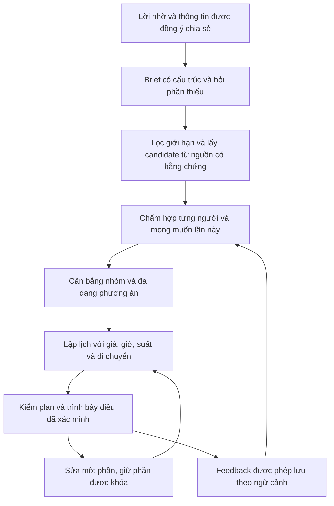

# Hành vi đi chơi của giới trẻ Việt Nam và hướng recommendation cho Rủ Đi

Ngày nghiên cứu: 27/09/2026. Đây là analysis sản phẩm và kỹ thuật, chưa phải ADR
hay đặc tả đã được duyệt. Bổ sung cho hai báo cáo cùng ngày:

- [Flow AI tạo plan hiện tại](nghien-cuu-ai-tao-plan.md).
- [Insight và dữ liệu cá nhân hóa](insight-va-du-lieu-ca-nhan-hoa-plan.md).

Phạm vi: đi chơi casual và du lịch, với bạn bè hoặc cặp đôi. Đối tượng nghiên cứu
ban đầu đề xuất là người trưởng thành 18–30 ở Việt Nam; đây là lựa chọn tuyển mẫu
của sản phẩm, không phải định nghĩa Gen Z chung cho mọi nguồn.
Không thay đổi runtime, không huấn luyện model, không đọc dữ liệu cá nhân/chat.

## 1. Hướng đi đầu tiên

Rủ Đi nên giúp người dùng **chốt được một buổi đi hợp với những người tham gia,
đúng mong muốn lần này và có thể thực hiện**. Điểm khác biệt cần kiểm chứng là
hiểu người trong hoàn cảnh, cân bằng nhóm, tìm trải nghiệm phù hợp rồi cho sửa
cục bộ dễ dàng. Một danh sách địa điểm được viết hay chưa đáp ứng việc đó.

Ý tưởng casual ưu tiên điều mới, du lịch ưu tiên đặc trưng địa phương là một
định hướng hữu ích. Cần bổ sung hai trục: **đã quen nơi này đến đâu** và **muốn
đạt điều gì lần này**. Người du lịch quay lại có thể tìm trải nghiệm ít nổi tiếng;
người sống tại chỗ có thể muốn tìm hiểu lịch sử. Không ép vào hai kiểu trái ngược.

Không có đủ bằng chứng để kết luận “cặp đôi trẻ Việt luôn muốn workshop”,
“hội bạn luôn muốn sôi động” hay “người local đã biết mọi điểm du lịch”. Những
nhận định này là giả thuyết để hỏi và quan sát, không phải profile tự động.

## 2. Bằng chứng thị trường và giới hạn của nguồn

Ưu tiên nguồn của đơn vị thực hiện khảo sát, bài nghiên cứu gốc và tài liệu
research chính thức. Khảo sát thương mại vẫn có bias tuyển mẫu và mục đích
marketing; một tỷ lệ trong survey không tự đại diện toàn bộ giới trẻ Việt Nam.
“Đã từng làm” tự báo cáo cũng khác log giao dịch hay hành vi quan sát trực tiếp.

### 2.1. Ăn uống ngoài nhà: ngân sách và kết nối cùng quan trọng

Decision Lab F&B Trends 2024 công bố 84% người trả lời đặt giới hạn chi tiêu ăn
uống ngoài nhà theo tháng. Bài phân tích kèm report nêu 49% Gen Z bám ngân sách
nghiêm, so với 44% chung. Trang report ghi 47% xem gần gũi bạn bè/gia đình là một
lý do chính đi ăn ngoài; 16% bị thu hút bởi thương hiệu có trải nghiệm độc đáo.
Không coi hai tỷ lệ cuối là lựa chọn loại trừ nhau. Trang công khai đã đọc không
có cỡ mẫu, phân bổ tuổi và weighting để kiểm tra tính đại diện.
Nguồn: [report](https://www.decisionlab.co/fnb_trends_report_2024),
[phân tích của Decision Lab](https://www.decisionlab.co/blog/vietnamese-consumers-prioritise-savings-while-dining-out-remains-essential).

**Suy luận cho sản phẩm:** hỏi cả “muốn có thời gian với nhau” và “muốn thử mới”.
Không để độ mới lấn át mục đích kết nối. Ngân sách của lần này cần được xác nhận;
budget band onboarding không đủ. Giới hạn tháng trong survey cũng không phải
trần chi cho một buổi đi.

### 2.2. Café không chỉ có một công dụng

Q&Me nghiên cứu tháng 03/2026 với 200 khách tại năm chuỗi café ở Hà Nội/TP.HCM,
40 mẫu mỗi chuỗi; cân bằng thành phố, ngày thường/cuối tuần và hai khung giờ.
Report dùng hóa đơn cho giỏ hàng, đồng thời khảo sát lý do chọn quán. Báo cáo
mô tả đi một mình thiên về sự thoải mái cho học/làm việc, đi với bạn hoặc cặp
đôi thiên về không gian gặp gỡ. Nhóm cặp đôi chỉ 25 mẫu, bạn/đồng nghiệp 41 mẫu.
Đây không phải mẫu riêng Gen Z, không bao phủ quán ngõ/hẻm hoặc mọi kiểu café.
<!-- repo-guard: allow=long-number reason=public-research-source-identifier -->
Nguồn: [Q&Me, Vietnam’s Coffee Chain Landscape](https://cdn.qandme.net/1775534099_Cafe_chain_trend_analyzed_by_receipt_collection_040526.pdf),
trang 2, 6 và 18.

**Suy luận cho sản phẩm:** tag `cafe` không đủ để chọn. Một lần cần nói chuyện,
một lần cần view/chụp hình, một lần cần thưởng thức đồ uống. Cần dữ liệu phù hợp
mục đích như tiếng ồn, chỗ ngồi, thời lượng sử dụng và khả năng ngồi cùng nhóm.
Các thuộc tính này phải có nguồn; không suy “yên tĩnh” từ tên hay ảnh đẹp.

### 2.3. Giá hợp lý thay đổi theo tuổi và dịp; không dùng làm trần tự động

iPOS.vn/Nestlé Professional H1/2025 ghi phương pháp ở trang 4: 1.286 thực khách,
20 tỉnh thành, tập trung thành phố lớn, thu thập 01/07–30/08/2025. Trang 37 nêu
mức giá tự báo cáo hợp lý cho ăn uống thường xuyên: nhóm 18–22 khoảng 41.880đ
một bữa và 29.922đ một đồ uống; nhóm 23–25 tương ứng 45.596đ và 35.546đ.
Đây không phải ngân sách hẹn hò/du lịch, không phải giá quán và không chứng minh
khả năng chi trả từng người. PDF có chênh số mẫu giữa lời mở đầu và phần phương
pháp; sử dụng phần phương pháp, ghi nhận giới hạn. Bản đọc là PDF tác giả phát
hành, được lưu trên website khác; chưa xác minh được bản tải từ host iPOS.
Nguồn: [báo cáo iPOS/Nestlé H1/2025](https://stevehoang.com/assets/pdf/iPOS%20-%20F%26B%20Vietnam%20market%20report%20H1-2025.pdf).

**Suy luận cho sản phẩm:** hỏi mức chi của buổi này và đơn vị: mỗi người hay cả
nhóm, mỗi ngày hay cả chuyến, gồm những khoản nào. Không tự gán giá theo tuổi.
Không suy thu nhập từ ledger. Phần giá chưa biết phải còn là chưa biết.

### 2.4. Du lịch cũng có nhu cầu mới, local và ít nổi tiếng

Klook Travel Pulse tháng 06/2026 khảo sát 1.020 người ở 10 thị trường gồm Việt
Nam, nghiên cứu Millennials/Gen Z. Riêng Việt Nam, 80% nói sẵn sàng đến thành
phố ít nổi tiếng vì sự kiện/hoạt động local; 52% đặt sớm để có giá tốt. Đây là
ý định với câu hỏi cụ thể, không phải 80% đã thực hiện. Trang release không nêu
cỡ mẫu Việt Nam, tuổi chi tiết hay weighting.

Ở mẫu APAC chung, 23% bắt đầu từ một hoạt động rồi chọn điểm đến. Nguồn tin được
tin cậy: review xác minh 58%, bạn bè/gia đình 49%, creator 35%, AI 33%. Không
đổi các tỷ lệ APAC này thành tỷ lệ giới trẻ Việt Nam.
Nguồn: [Klook Travel Pulse 2026](https://www.klook.com/newsroom/travelpulse-2026-travelconfidence/),
03/07/2026.

**Suy luận cho sản phẩm:** hỗ trợ hai lối bắt đầu: có điểm đến trước hoặc có
trải nghiệm muốn thử trước. Sự kiện cần ngày, suất, giá và nguồn kiểm chứng.
“Local” và “điểm biểu tượng” có thể cùng xuất hiện trong một chuyến đi.

### 2.5. Nguồn tạo cảm hứng khác nguồn giúp quyết định

Klook/GWI khảo sát tháng 12/2024 hơn 7.000 người ở 14 thị trường, gồm Việt Nam,
về Millennials/Gen Z. 79% mẫu chung nói đã đặt hoạt động/lưu trú/ăn uống theo
gợi ý mạng xã hội; release nhắc Việt Nam trong nhóm thường hành động theo gợi ý
nhưng không công bố phần trăm Việt Nam. Report cũng nêu ưu tiên trải nghiệm
authentic, món địa phương và điểm ngoài lối quen ở Gen Z. Các kết luận này không
chứng minh nhu cầu đi chơi casual hoặc mức phù hợp của từng creator.
Nguồn: [Klook Travel Pulse 2025](https://www.klook.com/newsroom/travelpulse-2025-ultimatetherapy/),
26/02/2025.

**Suy luận cho sản phẩm:** người dùng có thể đưa một ý tưởng đã thấy vào brief,
chẳng hạn “muốn thử làm gốm”. Planner kiểm tra xem ý tưởng đó phù hợp và khả thi
thay vì biến độ viral thành độ hợp. Nếu nhận link phải thiết kế cơ chế riêng để
trích xuất, kiểm tra nguồn và quyền dùng dữ liệu; app hiện chưa có flow này.

### 2.6. Sẵn sàng dùng AI không đồng nghĩa tin hoàn toàn

Agoda Travel Outlook 2026, fact sheet Việt Nam công bố cuối 2025, ghi 81% có khả
năng dùng AI cho chuyến tới nhưng chỉ 28% tin thông tin AI, 59% trung lập. Động
lực đứng đầu là thư giãn, văn hóa, ẩm thực. Fact sheet không cung cấp cỡ mẫu,
phương pháp hay phân tách tuổi; không gọi đây là số liệu riêng Gen Z hoặc usage
thực tế. Dùng nội dung tiếng Anh để tránh sai khác diễn đạt ở bản dịch.
Nguồn: [Agoda, Vietnamese Traveler in 2026](https://www.agoda.com/press/wp-content/uploads/2025/11/VN-Market.pdf).

**Suy luận cho sản phẩm:** AI cần giải thích lý do hợp brief, cho xem thông tin
có nguồn và sửa dễ. Không dùng lời văn chắc chắn để che dữ liệu thiếu.

### 2.7. Cặp đôi và điều mới: cơ sở đặt giả thuyết, chưa có bằng chứng Việt Nam

Aron và cộng sự (2000) nghiên cứu hoạt động mới/kích thích cùng nhau và chất
lượng quan hệ được cảm nhận, gồm khảo sát và ba thí nghiệm. Nghiên cứu tạo cơ sở
cho giả thuyết hoạt động cùng làm có thể có giá trị với cặp đôi. Nó không chứng
minh workshop cụ thể hiệu quả, không nghiên cứu sản phẩm này hay cặp đôi trẻ Việt.
Nguồn: [bài nghiên cứu gốc](https://pubmed.ncbi.nlm.nih.gov/10707334/).

**Suy luận cho sản phẩm:** thử nghiệm “cùng làm điều gì đó” so với chỉ ghé điểm;
đo người dùng có thích và muốn chọn lại. Không hứa cải thiện tình cảm, không tự
suy trạng thái quan hệ từ `pair`, chat hay lịch sử.

## 3. Mô hình insight nên dùng để thiết kế

Các dòng dưới là **giả thuyết sản phẩm cần kiểm chứng**, được gợi mở từ nguồn
và yêu cầu của người dùng; không phải persona đã có dữ liệu đại diện.

| Nhu cầu của lần đi | Mâu thuẫn cần giải | Hành vi cần quan sát | Planner cần làm |
|---|---|---|---|
| Có thời gian với nhau | Quán đẹp nhưng khó nói chuyện | Bỏ điểm ồn, kéo dài thời gian ngồi | Ưu tiên không gian tương tác và đủ thời lượng |
| Thoát routine | Muốn mới nhưng không muốn phiền | Chấp nhận hoạt động mới, từ chối di chuyển xa | Điều mới vừa ngưỡng bất tiện |
| Nghỉ nhẹ | Muốn đi nhưng ít năng lượng | Xóa bớt điểm, về sớm | Ít chuyển chỗ, nhịp thoáng |
| Đáng tiền | Có điểm nhấn nhưng giới hạn chi | Giữ activity, đổi quán ăn | Phân bổ theo ưu tiên thay vì mọi stop đều rẻ |
| Hiểu nơi đến | Sợ bỏ lỡ nhưng không muốn chạy lịch | Giữ điểm tiêu biểu, giảm số điểm | Chọn điều muốn tìm hiểu và lịch vừa sức |
| Chơi được cùng hội | Khó chốt, khác gu và mức chi | Một người liên tục phải nhường | Giữ điều tránh của từng người, cân bằng cả plan |
| Biến cảm hứng thành buổi đi | Ý tưởng hấp dẫn nhưng chưa biết thực hiện | Có một activity làm điểm neo | Tìm suất thật rồi xây phần còn lại |
| Có quyền điều khiển | Plan gần đúng nhưng một phần sai | Đổi một stop, khóa phần đã thích | Sửa cục bộ và giải thích tác động |

“Độc lạ” cần tách ít nhất bốn khái niệm:

- **Mới với người:** chưa biết/chưa thử, theo xác nhận hoặc lịch sử được phép dùng.
- **Đa dạng:** những lựa chọn/hoạt động khác nhau trong một plan hay bộ phương án.
- **Bất ngờ hợp gu:** người dùng không nghĩ tới nhưng thấy có giá trị sau khi xem.
- **Ít nổi tiếng:** độ phổ biến của địa điểm, không đồng nghĩa ba điều trên.

<!-- repo-guard: allow=long-number reason=public-research-source-identifier -->
Sự phân biệt có cơ sở trong [survey về serendipity](https://doi.org/10.1016/j.knosys.2016.08.014):
khuyến nghị bất ngờ còn cần liên quan và có giá trị; cách định nghĩa/đo chưa thống
nhất. Với Rủ Đi, “bất ngờ hợp gu” phải được người dùng đánh giá, không chỉ model
tự chấm. Không lấy ít review làm bằng chứng chất lượng hay “hidden gem”.

### Ngữ cảnh ban đầu và cách điều chỉnh

| Ngữ cảnh do người dùng xác nhận | Giả thuyết mặc định để thử | Câu hỏi giúp tránh đoán sai |
|---|---|---|
| Cặp đôi casual | Cùng trải nghiệm, đủ thời gian kết nối | Muốn thử mới hay ngồi trò chuyện? |
| Bạn bè casual | Dễ chốt, mọi người tham gia được | Nhẹ nhàng hay hoạt động cùng nhau? |
| Cặp đôi du lịch | Cân bằng hai người, có điểm nhấn và nghỉ | Mỗi người đã quen nơi này đến đâu? |
| Bạn bè du lịch | Gu khác nhau, logistics nhóm | Điều cả nhóm muốn và từng người tránh? |

Casual không buộc cùng ngày; du lịch không buộc nhiều ngày. Chuyến đi một ngày
vẫn có thể là du lịch; một cuối tuần tại thành phố quen vẫn có thể casual.

### Brief tối thiểu

1. Nơi muốn đi hoặc hoạt động muốn thử; điểm bắt đầu nếu cần tính di chuyển.
2. Ngày/khung giờ, số người, cách đi và thời điểm cần kết thúc.
3. Casual/du lịch; bạn bè/cặp đôi chỉ khi người dùng tự chọn và phù hợp quyền chia sẻ.
4. Mục đích lần này; mức quen thuộc và mức muốn thử mới.
5. Trần chi và phạm vi chi; điều bắt buộc/điều không muốn của người tham gia.

Không bắt điền form dài. Trích từ lời nhờ, dùng thông tin đã được phép chia sẻ,
hiển thị điều đã hiểu, hỏi phần thiếu có thể làm thay đổi lựa chọn. Không tự
hỏi chuyện riêng tư để phân loại quan hệ. Cho dùng một lần mà không lưu vào gu.

## 4. Dữ liệu và flow hiện tại đáp ứng đến đâu

Code khảo sát tại HEAD `c8f092c1` và working tree chưa sạch. Ownership manifest
là nguồn xác định route; không xem riêng Python hay Go là toàn bộ backend.
Chi tiết bằng chứng và đường dẫn ở hai báo cáo liên kết đầu tài liệu.

Flow đang đọc: lời nhờ `/plan` → Go kiểm quyền/queue → lấy gu nhóm, roster,
catalogue → Python inference → Go kiểm schema/ID → thẻ plan → tạo outing/stops.
Pipeline này hiện chưa biểu diễn đầy đủ brief cá nhân hóa ở trên.

| Thành phần | Đang có | Khoảng trống ảnh hưởng recommendation |
|---|---|---|
| Gu | 8 tag và 3 budget band | Thiếu mục đích, familiar, novelty, pace, mức chi lần này |
| Gu nhóm | Hợp các interest, trung bình midpoint budget | Mất người nào thích gì và ai không thể chi mức đó |
| Điểm đến của worker | Mặc định theo destination sắp xếp khi truyền nil | Chưa có resolver chuẩn từ brief đã xác nhận |
| Candidate | Rank điểm theo budget/taste/distance/group size, lấy 40 | Thiếu quota theo mục đích và activity; dễ bỏ ứng viên trước khi LLM thấy |
| Context gửi model | 9 trường địa điểm | Bỏ description/kinds/traits/activities và provenance hữu ích |
| Đầu ra AI | Text, place cards, stop có time_text/note | Thiếu day, duration, price scope, activity session và trạng thái xác minh |
| Kiểm plan | Schema/ID/card limits | ID thật chưa chứng minh giờ, giá, ăn kiêng, suất hay lịch hợp lệ |
| Chỉnh hành trình | UI có day/duration/lock/revision; solver riêng | Chưa nối thành vòng recommend → kiểm → sửa AI có bảo toàn |

Các file chính:
[catalogue](../../../services/core/internal/service/catalogue.go),
[worker](../../../services/core/internal/chatassist/worker.go),
[prompt/schema](../../../services/api/app/api/companion_gemini.py),
[grounding](../../../services/core/internal/domain/companion/companion.go),
[route scheduling](../../../services/core/internal/domain/itinerary/itinerary.go).

### Snapshot DB local đã đọc tổng hợp

Đọc khoảng 14:05 giờ Việt Nam ngày 27/09/2026 từ cấu hình container local
`rudi-vnlocal-api-1`, transaction READ ONLY rồi rollback. Không phải production,
không phải mẫu hành vi người dùng thị trường. Không đọc tên, body chat hay ảnh.

- 9.363 địa điểm; 33 destination khai báo nhưng chỉ 8 có địa điểm.
- Tất cả có description và kinds; 5.600 điểm có photo, 8.152 có address.
- Không có bản ghi địa điểm với price_min/max, open_hours, rating hay group_fit.
- Không có traits hoặc activities không rỗng. Một destination chứa 5.288 điểm.
- 1 người, không có interests/budget/city; 1 saved place; 0 outing, stop, memory,
  pair constraint hoặc AI job trong snapshot.
- Tất cả source là `vnlocal`; importer này chưa tìm thấy trong checkout đã đọc,
  nên chưa xác nhận provenance/licensing hay đồng nhất container với code repo.

**Hệ quả:** có kho để bắt đầu tìm nội dung, chưa có corpus để học gu hành vi;
chưa đủ facts để bảo đảm plan thực hiện được. Schema có trường không có nghĩa
DB đã có dữ liệu; DB có dữ liệu không có nghĩa worker gửi dữ liệu đó cho AI.
Không tuyên bố có nguồn workshop thật dựa trên seed giả lập.

## 5. Thuật toán: mỗi tầng giải một bài toán khác nhau

### 5.1. Kiến trúc đề xuất

Đây là kiến trúc đề xuất, không mô tả hệ thống đã triển khai. Auth, consent,
domain validation, persistence, queue và điều phối thuộc Go/SQL. Python phục vụ
inference/extraction/evaluation; không tự quyết quyền chia sẻ hoặc ghi domain.

### 5.2. Hiểu mong muốn: preference elicitation

<!-- repo-guard: allow=long-number reason=public-research-source-identifier -->
Nghiên cứu [usage-related questions](https://arxiv.org/abs/2111.13463) cho thấy
hướng hỏi về cách sử dụng thay vì chỉ thuộc tính của item; journal extension
2024, bản arXiv sửa 2025. Nó cung cấp cơ sở thiết kế câu hỏi, không chứng minh
UX Việt Nam hay số câu tối ưu.

Đề xuất: hỏi “muốn trò chuyện hay cùng làm một hoạt động?” dễ trả lời hơn “chọn
traits”. Trích xuất vào brief có schema; Go kiểm loại, đơn vị, phạm vi và consent.
Hard constraint thiếu thì hỏi; soft preference thiếu có thể đề xuất mặc định cho
sửa. Chưa cần một model học cách hỏi khi chưa có tập đánh giá câu hỏi.

### 5.3. Retrieval: content/knowledge-based phù hợp điểm xuất phát

Đề xuất lấy candidate từ nhiều kênh: khớp loại/mục đích, khớp mô tả ngữ nghĩa,
địa lý phù hợp, điểm tiêu biểu và hoạt động mới có dữ liệu thật. Có quota theo
brief để candidate không toàn café/quán ăn. Deduplicate địa điểm và trải nghiệm.

Với 9.363 điểm local và chưa có lịch sử, bắt đầu bằng SQL/rule và tìm kiếm text;
đánh giá trước khi thêm embeddings. Nếu thêm semantic search, description giúp
tìm ứng viên chứ không chứng minh giá, giờ, lịch workshop hay thuộc tính nhạy cảm.
Phải giữ tách facts có nguồn với nội dung AI suy diễn và dữ liệu còn thiếu.

Cold start nên dùng lời khai lần này, onboarding được phép dùng, shortlist phản
hồi và tri thức venue đã xác minh. Không cần collaborative filtering để bước
đầu cá nhân hóa. CF/fine-tune/ranker học máy cần dữ liệu exposure, lựa chọn và
kết quả đủ chất lượng, đánh giá theo segment; DB hiện chưa đáp ứng.

### 5.4. Rank theo từng người và từng hoàn cảnh

Đề xuất utility `u_i(place, activity, brief)` có các thành phần: mục đích lần này,
gu của người i được chia sẻ, mức mới với i, mức tương tác mong muốn, bất tiện và
độ chắc chắn của facts. Điểm này là heuristic thử nghiệm ban đầu, không phải
xác suất hài lòng hay kết luận khách quan về người.

Hard constraints được kiểm riêng, không để điểm gu bù vi phạm. Giá null không
được tính là 0; giờ null không được coi đang mở. Có thể trình bày draft chờ xác
minh nhưng không gắn nhãn đã chắc chắn trong ngân sách/khả thi.

Không cộng điểm novelty vô hạn: yêu cầu “nhẹ, gần, tiết kiệm” có thể quan trọng
hơn điều mới. Độ quen và novelty phải theo người; hai người đi cùng có thể khác.

### 5.5. Group recommendation: giữ khác biệt, tránh trung bình hóa

Nghiên cứu [sequential group recommendation](https://link.springer.com/article/10.1007/s10844-021-00652-x)
phân biệt mức hài lòng và bất đồng giữa thành viên, chỉ ra đánh đổi của Average
và Least Misery, đề xuất cách dùng phản ứng qua nhiều vòng. Đây là cơ sở chọn
baseline và phép đo, không phải bằng chứng thuật toán sẽ thắng ở Rủ Đi.

Đề xuất so sánh:

- Average utility: dễ làm, có thể bỏ qua người thiểu số.
- Least Misery: nâng người có utility thấp nhất, dễ tạo phương án nhạt.
- Average với sàn utility và phạt bất đồng: phương án thử ban đầu, cần tune bằng
  lựa chọn thật, không chọn trọng số rồi gọi là fairness đã chứng minh.

Đánh giá **cả plan**, không bắt mỗi stop là nơi tất cả thích nhất. Giới hạn không
thể tham gia/không ăn được vẫn áp dụng ở từng phần liên quan. Có thể một điểm
hợp A hơn, một điểm hợp B hơn; không công khai gu riêng để giải thích nếu chưa
được đồng ý. Người chưa khai gu là chưa biết, không phải utility bằng 0.

Budget nhóm cần giữ từng trần đã chia sẻ và phạm vi chi. Không lấy trung bình
làm mức chi mọi người chấp nhận. Recommendation không thay đổi ba luật tiền,
không tự ghi ledger hoặc suy khả năng chi trả.

### 5.6. Đa dạng phương án: MMR là baseline nhỏ, dễ kiểm tra

[Goldstein/Carbonell, MMR (1998)](https://aclanthology.org/X98-1025/) là nghiên
cứu gốc về cân bằng relevance và tránh dư thừa khi rerank. Áp dụng vào lựa chọn
plan là đề xuất của báo cáo, cần đánh giá lại trên sản phẩm.

Sau khi giữ ứng viên hợp brief, chọn phương án bằng relevance trừ mức tương tự
với phương án đã chọn. Similarity xét loại trải nghiệm, nhịp, khu vực và cách chi,
không chỉ tên địa điểm. Không làm ba plan bằng cách thay ba quán café giống nhau.
MMR hỗ trợ đa dạng, không tự tạo novelty theo người hay bảo đảm serendipity.

UX thử nghiệm: một đề xuất chính và một/hai hướng đánh đổi rõ như “ít di chuyển”
hoặc “thêm hoạt động mới”, nếu có đủ nguồn. Số phương án là giả thuyết UX cần thử.

### 5.7. Lập lịch: tối ưu có ràng buộc, LLM không làm toàn bộ

[Google Research (06/2025)](https://research.google/blog/optimizing-llm-based-trip-planning/)
mô tả hybrid: LLM đề xuất, retrieval tìm thay thế, thuật toán tối ưu dùng giờ và
di chuyển; dynamic programming ở mức ngày và local search giữa ngày. Điều này
hỗ trợ phân tách mong muốn mềm với logistics định lượng, không phải yêu cầu sao
chép stack Google hay bảo đảm chất lượng dữ liệu Việt Nam.

<!-- repo-guard: allow=long-number reason=public-research-source-identifier -->
[TravelPlanner (2024)](https://arxiv.org/abs/2402.01622) cung cấp benchmark về
planning với nguồn và ràng buộc. Dùng như tham khảo cách tạo evaluation, không
lấy điểm benchmark hoặc dữ liệu Mỹ thay cho validation casual Việt Nam.

Đề xuất bắt đầu với ít stop/ngày: giữ activity có suất làm điểm neo, thêm thời
lượng, buffer và lịch mở cửa đã xác minh; tìm thứ tự/ứng viên khả thi. Multiday
cần phân ngày và tránh trùng, có điểm bắt đầu/kết thúc từng ngày. Solver hiện có
giúp route/time nhưng phải mở contract để kiểm giờ, giá và suất.

Một plan hợp lệ về tài chính cần tổng phạm vi chi gồm vé/activity, đồ ăn,
di chuyển và khoản người dùng chọn tính. Không cộng giá min để tuyên bố chắc
đủ tiền; dùng mức chi/range có nghĩa rõ và hiển thị uncertainty. VND luôn integer.
Trong trường hợp overconstrained, nêu giới hạn xung đột và cho người dùng chọn
nới; không tự bỏ điều tránh để tạo được kết quả.

### 5.8. Chỉnh cục bộ: tối ưu cả việc bảo toàn

Đề xuất câu lệnh “đổi chỗ ăn tối, giữ workshop và ngân sách” chuyển thành patch
trên revision, không generate lại toàn bộ. Giữ stable stop IDs, lock, thời lượng,
ý định gốc; tính lại phần phụ thuộc. Backend kiểm revision/idempotency và khả thi.

Objective sau sửa có thể thêm phạt thay đổi các phần ngoài phạm vi người dùng
yêu cầu. Lock là constraint cứng trừ khi người dùng mở; nếu lock làm lịch bất
khả thi thì giải thích xung đột. Hiển thị thay đổi giá/giờ/di chuyển và cho undo.
UI itinerary có nền tảng revision/lock, nhưng cần contract AI patch và pipeline
validation trước khi coi feature đã có.

### 5.9. Học từ feedback: sau khi có nền dữ liệu

[Contextual bandit, Li và cộng sự (2010)](https://arxiv.org/abs/1003.0146) là
hướng cân bằng khai thác và thử lựa chọn theo ngữ cảnh. Nghiên cứu trên news,
không chứng minh hiệu quả cho đi chơi. Chưa đề xuất triển khai bandit hiện nay.

Khi đã có volume và consent, có thể thử trong các phương án đều đủ điều kiện,
không thử sai giá/giờ hoặc vi phạm hạn chế. Reward nên phản ánh lựa chọn/kết quả
buổi đi, có xử lý độ trễ; tối đa click có thể thưởng plan đẹp nhưng khó thực hiện.
[Offline replay research](https://arxiv.org/abs/1003.5956) cho thấy vai trò log
randomized exposure trong đánh giá; logging policy phải được thiết kế trước,
không gọi replay bất kỳ log click nào là đánh giá unbiased.

## 6. Dữ liệu cần bổ sung, theo giá trị sản phẩm

| Nhóm dữ liệu | Cần có trước khi hứa gì | Lưu/điều phối đề xuất |
|---|---|---|
| Venue facts | Giá và đơn vị, giờ/timezone, tọa độ, loại, thời lượng | Go/SQL; nguồn, thời điểm kiểm, expiry, trạng thái unknown |
| Activity instance | Hoạt động thật, suất/ngày, duration, giá, capacity, booking requirement | Tách khỏi venue; không suy lịch từ `activities` tag |
| Fit evidence | Khả năng trò chuyện, tham gia nhóm, điều kiện cần | Có nguồn và độ mới của bằng chứng; không để LLM tự xác nhận |
| User state | Gu được phép dùng, lần này muốn gì, familiarity | Người dùng sửa/xóa, chọn dùng lần này hay ghi nhớ |
| Group state | Participants và constraint được chia sẻ | Theo quyền từng người; không tự kéo chat/pair notebook |
| Exposure | Phương án đã hiện, thứ tự, brief/plan revision, policy | Log tối thiểu có retention, không lưu raw chat |
| Preference action | Giữ/đổi/bỏ và lý do tùy chọn | Phân biệt thích với đã biết/xa/đắt/sai giờ |
| Outcome | Có đi không, phần thích/không thích, muốn thử lại | Tự nguyện, không coi check-in là hài lòng |

“Đã biết”, “đã đi”, “đã đi và thích”, “muốn thử lại” là bốn trạng thái khác nhau.
Save không tự bằng thích; xóa một stop có thể vì trễ giờ chứ không ghét loại đó.
Lịch sử recommender chỉ được dùng theo consent và boundary hiện hành. Chat v2
E2EE không có đường fallback server đọc plaintext để cá nhân hóa.

Nguồn địa điểm mới cần provenance và quyền sử dụng rõ. Description hiện có có
thể giúp discovery, nhưng trước khi dùng làm evidence cần xác minh importer
`vnlocal`. Ưu tiên một vùng có supply đáng tin thay vì tăng số POI toàn quốc.

## 7. Nghiên cứu người dùng để biến giả thuyết thành insight

### Vòng định tính đầu tiên

Đề xuất tuyển 16–24 người trưởng thành 18–30, phân bổ sinh viên/đi làm,
Hà Nội/TP.HCM và ít nhất một địa phương khác. Có người thường rủ đi, người ít
tham gia quyết định, casual/du lịch và lần đầu/quay lại. Đây là mẫu discovery,
không đủ ước lượng tỷ lệ toàn Việt Nam; không đặt quota giới tính = gu.

Phỏng vấn hồi tưởng một buổi đi gần nhất: ai khởi xướng, điều muốn đạt, shortlist
từ đâu, điều bị bỏ, ai nhường, chi và bất tiện đã khiến họ đổi quyết định ra sao.
Xin người tham gia tự mô tả; không cần thu transcript chat, danh tính bạn đi cùng
hay sao kê. Nếu dùng ví dụ màn hình, người tham gia chủ động chọn và ẩn thông tin.

Cho chọn giữa plan synthetic có kiểm soát: mới hơn nhưng xa hơn; gần hơn nhưng
quen hơn; nhiều điểm nổi bật nhưng ít thời gian nghỉ; một activity đắt hơn với
các stop khác tiết kiệm. Giữ facts đáng tin giống nhau để không nhầm preference
với chất lượng lời văn. Hỏi lý do trước khi diễn giải thành tag.

Theo dõi tự nguyện 7–14 ngày bằng diary ngắn: có ý định nào, có chốt/đi không,
vì sao đổi hoặc bỏ. Phân biệt attitude với hành vi theo
[NN/g research methods](https://www.nngroup.com/articles/attitudinal-behavioral/).
Không coi phỏng vấn “thích AI” là bằng chứng planner tạo ra buổi đi tốt.

### Những giả thuyết cần có khả năng bị bác bỏ

- H1: người quen địa phương chọn trải nghiệm mới hơn khi mức bất tiện ngang nhau.
- H2: familiarity dự báo lựa chọn tốt hơn nhãn casual/du lịch đơn lẻ.
- H3: mục đích kết nối đổi cách chọn venue, kể cả khi cùng thích café.
- H4: phản ánh constraint từng người giảm số lần một người phải nhường.
- H5: plan có facts/uncertainty rõ dễ chốt hơn lời văn chắc nhưng thiếu evidence.
- H6: sửa một phần có bảo toàn giúp hoàn thành task nhanh hơn generate lại.

Không chỉ tuyển người mê workshop hoặc thường dùng app du lịch. Ghi nhận cả
người thích nơi quen và người muốn spontaneity; kết quả trái giả thuyết vẫn là
input để chỉnh product. Chưa có phỏng vấn/diary nào được thực hiện trong task này.

## 8. Evaluation: đúng, hợp, mới, công bằng và sửa được

Tạo corpus synthetic và nguồn venue public có xác minh. Không dùng dữ liệu thật
của người tham gia đưa lên external inference/eval. Mỗi case có brief, quyền
chia sẻ, nguồn facts và tiêu chí; kỳ vọng sở thích không được chính model tự
đặt rồi tự xác nhận.

| Trục | Cách đo đề xuất | Sai lầm cần tránh |
|---|---|---|
| Đúng ràng buộc | Vi phạm trần/giờ/suất/điều tránh, facts bịa | Chỉ kiểm ID rồi gọi plan khả thi |
| Hợp lần này | Pairwise lựa chọn, lý do, tỷ lệ chốt theo segment | Cho model tự chấm hài lòng |
| Mới có giá trị | Người dùng đánh giá mới với mình và đáng thử | Lấy ít review làm novelty |
| Cân bằng nhóm | Mức thấp nhất, bất đồng, phản hồi từng người | Chỉ average score hoặc ý người rủ |
| Sửa được | Task completion, thời gian, lock preserved, undo | Đổi toàn plan rồi gọi edit thành công |
| Kết quả | Có đi, trải nghiệm thích, muốn dùng lại | Check-in = thích, click = buổi đi tốt |
| Chi phí vận hành | Latency p50/p95, token/cost, tỷ lệ hỏi lại | Chốt SLA/ROI khi chưa có phép đo |

Baseline A: planner/ranker hiện tại. B: thêm brief và facts. C: thêm utility từng
người/cân bằng nhóm. D: thêm novelty/đa dạng. Đo theo từng bước để biết cải thiện
đến từ dữ liệu, prompt hay thuật toán. So sánh offline trước; thử với người dùng
theo assignment ở mức nhóm/buổi để tránh cùng người thấy nhiều biến thể lẫn nhau.
Nếu đổi đồng thời model thì tách thử nghiệm, không quy mọi gain cho personalization.

Ma trận case cần bao phủ bốn ngữ cảnh, mức quen, gu xung đột, budget thấp,
thiếu giá/giờ, activity hết suất, ngày nghỉ, mưa nếu có nguồn, ít năng lượng,
người chưa khai gu, khác mức chi, multiday và sửa stop có lock. Test phải có cả
case không thể tạo plan và cần hỏi thêm. Không đặt mục tiêu “luôn có câu trả lời”.

Tỷ lệ vi phạm/khẳng định facts không có nguồn phải được báo riêng. Không gộp với
điểm văn phong để che lỗi. Chưa chạy benchmark hay user study trong nghiên cứu này.

## 9. Thứ tự phát triển đề xuất

### Slice 1: tạo plan casual có brief và facts trong một vùng

Chọn vùng sau khi kiểm supply; xác minh venue/activity, giá/giờ và provenance.
Người dùng nhập lời nhờ, xác nhận brief tối thiểu; candidate theo mục đích;
Go kiểm plan, trả draft/verified status phù hợp. Hai/nhóm bạn và cặp đôi dùng
ngữ cảnh đã xác nhận, nhưng không mở bypass legacy sang E2EE.

Đây là hướng đầu tiên đề xuất vì có thể kiểm chứng insight casual/novelty với
ít stop. Multiday vẫn là mục tiêu sau, không lấy contract stop hiện tại để giả
vờ đã hỗ trợ du lịch hoàn chỉnh. Slice gồm UI, Go/SQL, Python AI và evidence.

### Slice 2: cá nhân hóa nhóm và sửa cục bộ

Giữ constraint từng người theo quyền chia sẻ, so baseline aggregation; patch
revision/lock, recompute phần phụ thuộc, undo; log exposure/action tối thiểu.
Đánh giá số lần phải đổi và cảm nhận từng người, không chỉ conversion của người rủ.

### Slice 3: du lịch đa ngày và hiểu nơi đến

Thêm day/session/timezone, điểm đầu/cuối ngày, budget scope, nhịp nghỉ; điểm
biểu tượng và local theo familiarity/mục đích. Kiểm multiday và edit có bảo toàn.
Không mặc định mọi du lịch là lịch dày hoặc mọi casual là hidden gem.

### Slice 4: học từ hành vi đủ chất lượng

Chỉ chọn ranker học máy/bandit sau khi có consent, exposure, feedback và outcome
đủ để đánh giá theo segment. Tối ưu giá trị buổi đi, có kiểm drift/bias theo vùng.
Fine-tuning không bù supply rỗng, facts thiếu hay intent được mô hình hóa sai.

## 10. Những quyết định cần chốt sau analysis

1. Vùng pilot có dữ liệu venue/activity đáng tin và cách duy trì cập nhật.
2. Persona tuyển nghiên cứu và mục đích/đánh đổi ưu tiên kiểm chứng.
3. Contract brief, venue facts, activity session, plan revision và consent.
4. Tiêu chí phân biệt draft với plan đã kiểm đủ điều kiện.
5. Corpus/evaluation baseline và điều kiện mở sang multiday/học hành vi.

Đề xuất sản phẩm cần chứng minh bằng nghiên cứu và pilot: **Rủ Đi hiểu điều cả
nhóm muốn làm trong lần này, tìm được trải nghiệm có thật và cho chỉnh mà giữ
những phần đã thích.** Không tuyên bố đạt khả năng này từ code/DB hiện tại.
