# Issues mới trên main: audit UI/UX app mobile RuDi, phần sau pipeline

- Cây đo: main `461eabf`, bản web export production trên stack cục bộ thứ hai (Postgres 16, API Python, cửa
  trước Go, cổng khác stack của audit gốc), dữ liệu seed tổng hợp. Chromium 141 headless, giả lập di động như
  audit gốc (xem `report.md` §A).
- File này chỉ ghi issue **mới**, đánh số tiếp audit gốc (UI-001…UI-122 ở
  `docs/claude/2026-09-27/mobile-ui-audit/issues.md`). Kết quả đo lại các issue cũ ở `retest.md`.
- Checkpoint retest 2 đo lại 79 issue P3 còn lại và không thêm issue mới.
- Checkpoint N26 audit feature mới đầu tiên của main, hai lớp chat hai người «đám bạn» / «cặp đôi» (PR #660, task #26), và
  thêm UI-124…UI-131. Mục «N26» dưới đây nói phần nào đạt; mục «Mở rộng» ghi ba issue của audit gốc gặp lại ở màn mới.
- Checkpoint N14 audit Cộng đồng (task #14, ADR-0040), tab đầu của app trên main, và thêm UI-132…UI-148. Mục «N14» nói phần
  nào đạt; mục «Mở rộng (đo ở N14)» ghi bảy issue của audit gốc gặp lại. Quan sát Q5 đóng ở đây.
- Checkpoint N15 audit sổ chuyến đi / Nếp v3 (task #15, ADR-0039): khép cuộc đi, giữ sổ, sửa, công khai, gửi Cộng đồng, xoá,
  và thêm UI-149…UI-154. Mục «N15» nói phần nào đạt; mục «Mở rộng (đo ở N15)» ghi tám issue của audit gốc gặp lại, trong đó
  link sổ khi chưa đăng nhập là UI-121. Quan sát Q4 đóng ở đây (UI-149).
- Checkpoint N21 audit hồ sơ kể chuyện (task #21, PR #658): sổ hành trình nhiều ngã rẽ, huy hiệu trưng bày, tường cá nhân v2,
  bình luận một tầng, ảnh toàn màn kèm khay, đăng lại. Thêm UI-155…UI-162. Mục «N21» nói phần nào đạt; mục «Mở rộng (đo ở
  N21)» ghi tám issue của audit gốc gặp lại. Quan sát Q3 đóng ở đây (UI-158). Cùng checkpoint, phần hero quyết toán của UI-149
  đã đo được trên màn (không còn là giả thuyết).
- Checkpoint N22 audit Rủ Đi AI trong chat (task #22, AI v2 PR #654, chat hai người #659; ADR-0046): chip bối cảnh, «Xem»,
  «Chỉ gửi lời nhờ», lời gọi và hàng lời nhờ hỏng, chat đôi, Nếp, trang lab chữ hiện dần. Stack không có khoá AI: phòng «sẵn
  sàng» dựng bằng cách viết lại một phản hồi ở trình duyệt, câu trả lời thật BLOCKED. Thêm UI-163…UI-167. Mục «N22» nói phần
  nào đạt; mục «Mở rộng (đo ở N22)» ghi bốn issue của audit gốc gặp lại.
- MODE = AUDIT_ONLY: không issue nào được sửa. «Trạng thái sửa» của mọi issue là *chưa sửa*; «Retest» là
  *không áp dụng*.
- Phân loại, mức và phương pháp như audit gốc: BUG · UX ISSUE · VISUAL POLISH; P0–P3; RUNTIME-WEB, STATIC,
  HYPOTHESIS.

## Tóm tắt theo mức

| Mức | Issue |
|---|---|
| P2 | UI-123, UI-124, UI-130, UI-132, UI-133, UI-134, UI-135, UI-136, UI-137, UI-138, UI-149, UI-150, UI-151, UI-155, UI-156, UI-157, UI-158, UI-163, UI-166 |
| P3 | UI-125, UI-126, UI-127, UI-128, UI-129, UI-131, UI-139, UI-140, UI-141, UI-142, UI-143, UI-144, UI-145, UI-146, UI-147, UI-148, UI-152, UI-153, UI-154, UI-159, UI-160, UI-161, UI-162, UI-164, UI-165, UI-167 |

---

## F00 Vỏ toàn cục

### UI-123 · Web: chuyển tab rồi bấm Back thì rời khỏi app, vì tab đầu nay là Cộng đồng mà app vẫn mở ở Khám phá

| Trường | Nội dung |
|---|---|
| Category / Severity | BUG (điều hướng, web) · **P2** |
| Feature / Screen / Layer | F00 · mọi màn tab · L05 thanh tab (`app/(tabs)/_layout.tsx`, `ui/RudiTabBar.tsx`) |
| Nền tảng, cấu hình | web, C1, có phiên và không phiên. Cơ chế không phụ thuộc bề rộng (thanh tab và rail cùng một navigator), nhưng chỉ C1 được đo. Native: Android với `backBehavior` «firstRoute» thì Back hệ thống đưa về tab đầu (Cộng đồng) thay vì tab trước, không thoát app; iOS không có Back (STATIC, chưa đo) |
| Điều kiện | App mở ở Khám phá: đó vẫn là đích sau đăng nhập trên main (`TC-F00-DT-dalat-0`: tới `/explore`). Hoặc mở thẳng bất kỳ tab nào không phải Cộng đồng |
| Tái hiện | 1. Mở app, tới Khám phá. 2. Chạm tab «Lên plan». 3. Bấm Back của trình duyệt (trên Android Chrome là cử chỉ back hệ thống) |
| Expected | Back về tab vừa rời (Khám phá), như ở bản `7ea1a7c`; ít nhất là không rời app |
| Actual | Chuyển tab không thêm mục lịch sử nào: có phiên `/explore#3` → Lên plan `/plan#3`; không phiên `/explore#2` → `/plan#2` (số sau «#» là `history.length`). Back rời app, tới trang trình duyệt mở trước đó (trong harness là trang gắn phiên `/favicon.ico`, hoặc `about:blank`). Chuỗi Khám phá → Lên plan → Tin nhắn cũng không thêm mục nào. Chỉ khi bắt đầu ở tab đầu thì có một mục: Cộng đồng `#3` → Khám phá `#4` → Lên plan `#4`, và Back về Cộng đồng chứ không về Khám phá. Đối chứng bản `7ea1a7c` bằng cùng phép đo: `/explore#3` → Lên plan `#4` → Tin nhắn `#4`, Back về `/explore` |
| Evidence | Không có ảnh: lỗi nằm ở lịch sử trình duyệt, không nằm trên màn hình. Hàng `TC-M-UI-123` (sổ của main); phép đo `kich-ban/tham-do-lich-su-tab.mjs` chạy trên cả hai bản (`report.md` §E) |
| Source | Commit `0ec19fa` thêm `Tabs.Screen name="community"` đứng đầu `app/(tabs)/_layout.tsx`. Bộ định tuyến (bản fork `useLinking` trong `expo-router/build/fork`) chỉ `history.push` khi lịch sử của navigator đang focus dài thêm (`historyDelta > 0`); bằng nhau thì `history.replace`. Tabs mặc định `backBehavior: "firstRoute"`, nên lịch sử tab chỉ giữ [tab đầu, tab hiện tại]: đi giữa hai tab không phải tab đầu thì độ dài không đổi, nên là replace. Ở `7ea1a7c`, tab đầu là Khám phá, trùng với đích sau đăng nhập, nên lần chuyển tab đầu tiên luôn là push |
| Hậu quả | Trên web, và Android Chrome, sau một lần chuyển tab, Back đóng app thay vì về tab trước. Thứ đang soạn dở trên màn đó mất, người dùng phải mở lại app. Đường tái hiện của UI-117 cũng vì vậy mà đổi: Back rời app trước khi tới màn bị khoá (`retest.md`, `TC-R-UI-117-A`/`-B`) |
| Đề xuất sửa | Chọn theo ý đồ sản phẩm: `backBehavior: "history"` cho Tabs, để mỗi lần chuyển tab là một mục lịch sử; hoặc đưa đích sau đăng nhập về tab đầu; hoặc để Khám phá đứng đầu như trước. Sau khi sửa, kiểm lại các flow Maestro có dùng Back |
| Tiêu chí gỡ | Mở app ở Khám phá, chạm «Lên plan», Back: về Khám phá (ít nhất là một màn của app). `tham-do-lich-su-tab.mjs` trên bản sửa cho `history.length` tăng khi chuyển tab |
| Trạng thái sửa · Retest | chưa sửa · không áp dụng |

---

## N26 Hai lớp chat hai người («đám bạn» / «cặp đôi», #660)

Đo trên bản web export của main với năm cặp của stack thứ hai: chat-0/chat-1 (đám bạn, chưa sổ), chat-4/chat-5 (đám bạn, sổ
đã mở), chat-12/chat-13 (lời đề nghị lập sổ chờ), chat-10/chat-11 (thành cặp đôi ngay trong lượt đo, qua UI), chat-8/chat-9
(cặp đôi). Trang lab `/dev/hai-lop-chat` đo trên server dev có cờ fixture. AI không có khoá: cặp nào cũng báo
`provider_unavailable`, nên câu trả lời thật, chân thẻ «· dùng gu của …» và tấm «Xem» ở màn sống là BLOCKED (tấm «Xem» đo
trên trang lab).

Đạt trong phạm vi đã đo (`coverage-matrix.md`, hàng `TC-N26-*`):
- Hợp đồng `chat-capabilities`: `cap_doi` chỉ đúng ở cặp đôi, `gu_chat` là `null` ngoài cặp đôi (ADR-0046 §8.4, ADR-0048 §3.2).
- Khay của đám bạn bốn công cụ, của cặp đôi năm công cụ, một hàng không nhãn nào bị cắt từ 320 tới 1024 (C1–C9); chữ khay
  viết cho hai người. Sticker «Cho hai người» chỉ ở cặp đôi. Gợi ý lệnh và chip «AI chưa sẵn sàng» viết cho hai bạn.
- Hàng mời lập sổ: đúng người thấy, người đề nghị không thấy, chạm tới «Xem lời đề nghị». Đề nghị và đồng ý «Một đôi» qua UI
  ghi đúng lên máy chủ; phía người đồng ý có hàng ghim và năm công cụ khi về chat.
- «Gu của hai bạn» nói Rủ Đi AI dùng gu trong chat; bật và «Bật lại cho chat» chạy đúng thứ tự thu hồi rồi đề nghị.
- Lỗi đọc `chat-capabilities` thì phòng hiện như đám bạn (đóng an toàn) và hồi lại khi vào lại.
- Trang lab: ba lỗi đã sửa ở `762d5c5` vẫn đạt (tấm «Xem» phủ cả cửa sổ, năm ô một hàng ở 360 và 320, chữ hai người);
  «Reduce Motion» chỉ hiện câu trọn. Bản export production chuyển `/dev/hai-lop-chat` về `/welcome`.

### UI-124 · Chat hai người chưa có tin: ở cửa sổ thấp, trạng thái rỗng đẩy ô soạn và khay công cụ ra ngoài đáy

| Trường | Nội dung |
|---|---|
| Category / Severity | BUG (bố cục, nội dung bị che) · **P2** |
| Feature / Screen / Layer | N26 · `/groups/[id]/chat` của chat hai người · trạng thái rỗng, L16 khay công cụ, ô soạn |
| Nền tảng, cấu hình | web, đo ở C1, C2, C4, C8 cho cả hai lớp. C8 (390×460) là proxy cửa sổ thấp, không phải phép đo bàn phím. Native: cùng cột bố cục, và màn không cuộn cả trang như web (STATIC, chưa đo) |
| Điều kiện | Chat hai người chưa có tin nào. Mọi chat hai người mới bắt đầu như vậy |
| Tái hiện | 1. Mở chat đôi chưa có tin ở 320×640, 375×667 hoặc 390×460. 2. Chạm «+» (Thêm vào cuộc trò chuyện) |
| Expected | Ô soạn và nút gửi luôn nằm trong cửa sổ, khay đóng hay mở; nhãn công cụ không rơi ra ngoài đáy |
| Actual | Cặp đôi, C8, khay đóng: ô soạn ở y 473–537 trong cửa sổ cao 460. Cả ô soạn và nút «+» nằm ngoài; trên web chỉ thấy khi cuộn cả trang (trang cao 544). Cặp đôi, C4, mở khay: ô soạn 671–735 (cửa sổ 667). Cặp đôi, C2, mở khay: nhãn cả năm công cụ ngoài đáy, ô soạn 702–766 (640). Đám bạn, C2, mở khay: ô soạn 611–675. Đám bạn, C8, mở khay: nhãn bốn công cụ ngoài đáy, ô soạn 593–657; khay đóng thì nút gửi vừa chạm đáy (459). C1 đạt ở cả hai lớp; đám bạn ở C4 đạt |
| Evidence |  (hàng `TC-N26-SOAN-CHAT-RONG-BAN` C2, C8; `TC-N26-SOAN-CHAT-RONG-DOI` C4, C2, C8) |
| Source | `GroupChatLive.tsx:807–819`: trạng thái rỗng vẽ ngoài danh sách lật, là một khối trong cột (`rong: { paddingVertical: 24 }`, `:1184`) gồm Nếp 96, tiêu đề, dòng phụ và nút, không co và không cuộn. `FlatList` (`:820`) co về 0 trước, rồi khối rỗng, khay (`SoHen.tsx`, trần `tranKhay`) và ô soạn tràn khỏi cột. Cặp đôi thêm hàng ghim Tờ giấy 78dp dưới tiêu đề. Chat nhóm dùng cùng khối rỗng (STATIC, chưa đo nhóm rỗng) |
| Hậu quả | Ở màn thấp, người mở chat đôi lần đầu không thấy chỗ gõ tin đầu tiên (cặp đôi, C8), hoặc mở khay thì mất ô soạn và nhãn công cụ. Trên web còn cuộn được cả trang, đầu màn trôi theo; trên native nhiều khả năng không cuộn được (HYPOTHESIS) |
| Đề xuất sửa | Cho khối rỗng vào vùng co giãn (ví dụ `ListEmptyComponent`, hoặc cho khối co và cuộn), hoặc thu nó lại khi khay mở hay cửa sổ thấp. Ô soạn luôn là khối cuối, không bị đẩy |
| Tiêu chí gỡ | `n26-hai-lop-chat.mjs --chi soan`: ở C2, C4, C8, cả hai lớp, khay đóng và mở, nút gửi nằm trong cửa sổ, không nhãn công cụ nào ngoài đáy, trang không cuộn |
| Trạng thái sửa · Retest | chưa sửa · không áp dụng |

### UI-125 · Lớp phòng chỉ đọc lúc màn chat được focus: về chat thì hàng ghim Tờ giấy tắt rồi bật lại, còn phòng đang mở không đổi khi người kia đồng ý «Một đôi»

| Trường | Nội dung |
|---|---|
| Category / Severity | UX ISSUE (trạng thái cũ, nội dung nhảy) · **P3** |
| Feature / Screen / Layer | N26 · `/groups/[id]/chat` của cặp đôi · hàng ghim Tờ giấy, L16 khay |
| Nền tảng, cấu hình | web, C1. Native: cùng mã (`useFocusEffect`, `AppState`) (STATIC) |
| Điều kiện | (a) Cặp đôi chat-8/chat-9. (b) Cặp đám bạn chat-10/chat-11: chat-10 đề nghị «Một đôi» rồi để chat mở trong lúc chat-11 đồng ý |
| Tái hiện | (a) Trong chat cặp đôi, chạm hàng ghim Tờ giấy, rồi «Quay lại» từ không gian giấy. (b) chat-11 đồng ý trên máy của mình; chat-10 ở yên trong chat |
| Expected | (a) Về chat, hàng ghim đứng yên, nội dung không nhảy. (b) Phòng của chat-10 thành phòng cặp đôi (hàng ghim, «Tờ giấy») mà không phải rời chat, hoặc chat có một dấu báo |
| Actual | (a) Mạng nhanh: 2 khung (95–107 ms) không có hàng, dòng «Chưa mã hoá đầu cuối» ở y 64, rồi hàng hiện và dòng nhảy xuống y 142 (78dp). `chat-capabilities` trễ 800 ms: 49 khung (99–929 ms) phòng hiện như đám bạn, khay còn bốn công cụ, rồi nhảy 78dp. (b) 8 s sau khi chat-11 đồng ý, phòng của chat-10 vẫn không hàng ghim, khay bốn công cụ. Chỉ khi app về nền rồi trở lại (`visibilitychange`) mới có hàng ghim và năm công cụ |
| Evidence | 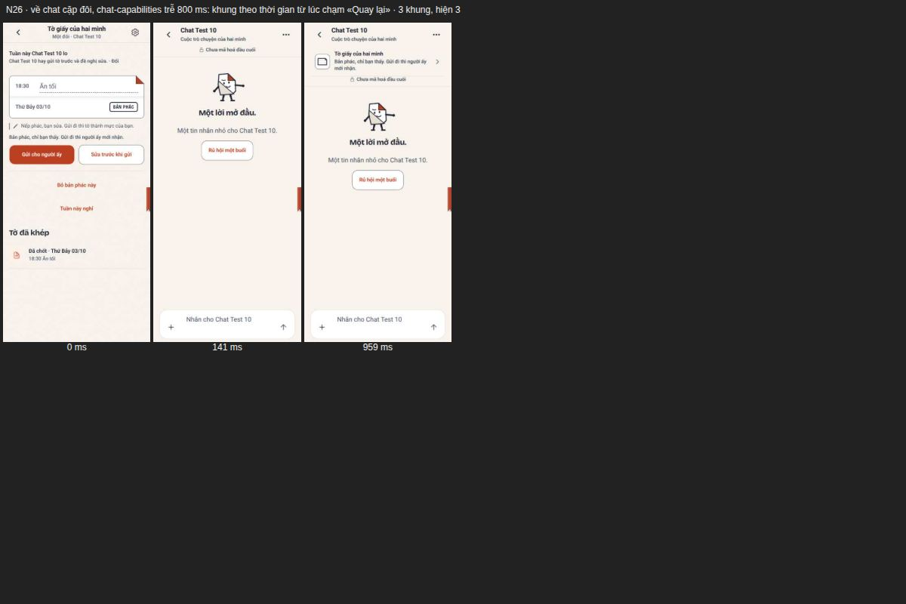 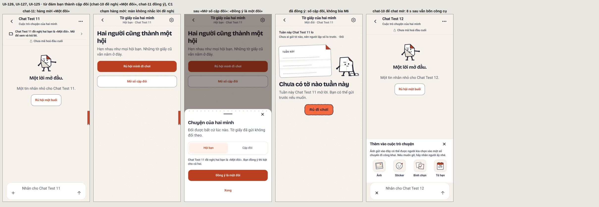 (hàng `TC-N26-NHAY-VE-CHAT`, `TC-N26-NHAY-VE-CHAT-TRE`, `TC-N26-CHUYEN-BEN-KIA`) |
| Source | `useChatAi.ts:43–47`: mỗi lần màn focus, `useFocusEffect` đặt `capabilities` về `null` rồi đọc lại; `AppState` «active» cũng đọc lại. `GroupChatLive.tsx:217`: `capDoi = nhanRieng && laCapDoi(ai.capabilities)`, nên chưa đọc xong là đám bạn và `hangGhimChat` (`so-doi-map.ts:30–47`) không trả hàng Tờ giấy. `HangToGiaySong.tsx:23–26, :40` (`nhip: 0`) ghi rõ: cặp thành cặp đôi thì không đọc lại. Không tin hay sự kiện nào của phòng báo «Một đôi» vừa bật |
| Hậu quả | Mỗi lần quay về chat cặp đôi (từ tờ giấy, hồ sơ, ảnh), nội dung nhảy 78dp sau một nhịp mạng, và một cú chạm vào đầu danh sách lúc đó có thể rơi chỗ khác. Người đề nghị «Một đôi» không biết người kia đã đồng ý cho tới khi rời chat |
| Đề xuất sửa | Giữ `capabilities` cũ trong lúc đọc lại (không đặt `null` khi focus), hoặc giữ chỗ hàng ghim khi đã biết là cặp đôi. Đọc lại sổ và capabilities khi change feed của phòng báo đổi, hoặc thêm một dòng hệ thống khi «Một đôi» bật |
| Tiêu chí gỡ | `--chi nhay`: `TC-N26-NHAY-VE-CHAT` và `-TRE` có 0 khung không hàng, dòng bảo mật ở một vị trí. `--chi chuyen:doi` trên một cặp đám bạn mới: phía người đề nghị có hàng ghim và năm công cụ trong 8 s mà không rời chat |
| Trạng thái sửa · Retest | chưa sửa · không áp dụng |

### UI-126 · Hàng mời «Một đôi» dẫn tới màn không nhắc lời đề nghị; lối trả lời nằm sau nút «Mở sổ cặp đôi»

| Trường | Nội dung |
|---|---|
| Category / Severity | UX ISSUE (lối đi, chữ hứa một việc màn không làm) · **P3** |
| Feature / Screen / Layer | N26 · chat đôi → `/groups/[id]/to-giay` (sổ của đám bạn) · hàng mời, L23 sheet «Loại sổ» |
| Nền tảng, cấu hình | web, C1. Native: cùng mã (STATIC) |
| Điều kiện | Cặp đám bạn đã lập sổ; người kia đề nghị «Một đôi», mình chưa trả lời (chat-10 đề nghị qua UI, chat-11 nhận) |
| Tái hiện | 1. chat-11 mở chat đôi: hàng «Chat Test 11 đề nghị hai bạn là «Một đôi». Mở để xem và trả lời.» 2. Chạm hàng |
| Expected | Như hàng mời lập sổ: màn tới nói có lời đề nghị và có ngay lối trả lời. Lập sổ có con dấu «Xem lời đề nghị» (`TC-N26-MOI-CHAM`, đạt) |
| Actual | Màn tới là thân sổ của đám bạn: «Hai người cũng thành một hội · Hẹn nhau như mọi hội bạn. Những tờ giấy cũ vẫn nằm ở đây.», «Rủ hội mình đi chơi», «Mở sổ cặp đôi». Không chữ nào nói có lời đề nghị. Lối trả lời là «Mở sổ cặp đôi» → sheet «Loại sổ» («Chat Test 11 đề nghị hai bạn là «Một đôi». Bạn đồng ý thì bật cho cả hai.», «Đồng ý là một đôi»). Maestro 47 đi đúng đường này. Thêm: câu «Những tờ giấy cũ vẫn nằm ở đây.» hiện cả khi cặp chưa có tờ nào |
| Evidence |  (hàng `TC-N26-MOI-BAT-DOI-DEN`; đạt: `TC-N26-MOI-BAT-DOI`, `TC-N26-CHUYEN-DE-NGHI`, `TC-N26-CHUYEN-DONG-Y`) |
| Source | `HangToGiay.tsx:120–123` (`CAU_DE_NGHI`); `KhongGianGiay.tsx:203` (lập sổ: con dấu «Xem lời đề nghị» khi có đề nghị); `:206–212` (thân đám bạn không đọc `deNghiBatDoi`); `LoaiSo.tsx` (câu đề nghị và nút đồng ý chỉ có trong sheet) |
| Hậu quả | Người được mời phải đoán rằng «Mở sổ cặp đôi», một nhãn đọc như tự mở một việc mới, là chỗ trả lời. Không đoán được thì quay về chat, hàng mời vẫn nằm đó |
| Đề xuất sửa | Khi có đề nghị `bat_doi` của người kia, thân sổ hiện câu và nút trả lời (như «Xem lời đề nghị» của lập sổ), hoặc chạm hàng mời mở thẳng sheet «Loại sổ». Câu về tờ giấy cũ chỉ hiện khi có tờ |
| Tiêu chí gỡ | `--chi chuyen:doi` trên một cặp đám bạn có sổ, chưa «Một đôi»: `TC-N26-MOI-BAT-DOI-DEN` thấy câu về lời đề nghị hoặc «Đồng ý là một đôi» ngay khi tới |
| Trạng thái sửa · Retest | chưa sửa · không áp dụng |

### UI-127 · Khoảnh khắc M6 «sổ hai người mở» không còn diễn ở bước nào của thang đồng ý

| Trường | Nội dung |
|---|---|
| Category / Severity | UX ISSUE (phản hồi đã thiết kế bị mất) · **P3** |
| Feature / Screen / Layer | N26 · `/groups/[id]/to-giay` · MO, khoảnh khắc M6 và thân sổ |
| Nền tảng, cấu hình | web. Lập sổ đo ở C1 và C9 (checkpoint retest 1); «Một đôi» đo ở C1. Native: cùng mã (STATIC) |
| Điều kiện | Người được đề nghị đồng ý ngay trên màn: lập sổ (chat-6/chat-7, chat-10/chat-11 ở checkpoint retest 1), rồi «Một đôi» (chat-10/chat-11 ở N26) |
| Tái hiện | Chạm «Đồng ý» của lập sổ, hoặc «Đồng ý là một đôi», khi đang ở không gian giấy; lấy mẫu mỗi khung rAF |
| Expected | M6 (ADR-0037, bảng khoảnh khắc: «sổ hai người mở», `keo-tab` rồi `nhay`; bìa sổ mở và con dấu «Sổ đã mở») diễn đúng một lần ở một bước của thang: lúc sổ mở, hoặc lúc thành cặp đôi. C9 thì cắt thẳng |
| Actual | Lập sổ: 0 khung có bìa M6 ở C1 và C9; thân sổ sang «Hai người cũng thành một hội». «Một đôi»: 0 khung M6 trong 3,5 s; thân sổ đi thẳng từ «hội» (10 khung) sang «Chưa có tờ nào tuần này» (191 khung) |
| Evidence |  (hàng `TC-N26-M6-BAT-DOI`; lập sổ: `TC-R-UI-084-B` C1, C9 ở `retest.md`) |
| Source | `KhongGianGiay.tsx:142–152`: `vuaMoSo` chỉ bật khi `lapSo` đổi false → true lúc màn đang mở. `:272–279`: bìa M6 chỉ vẽ trong nhánh `giay-trong`, nhánh này chỉ tới được khi `batDoi`. `:206–212`: sổ vừa lập của cặp chưa «Một đôi» rơi vào nhánh đám bạn. «Một đôi» bật sau đó không đổi `lapSo`, nên `vuaMoSo` không bật |
| Hậu quả | Khoảnh khắc thiết kế cho lúc sổ hai người mở không diễn trong luồng thật. Cả hai bước đồng ý kết thúc mà không có phản hồi nào ngoài việc thân sổ đổi |
| Đề xuất sửa | Chọn một bước (sổ mở, hay thành «Một đôi») cho M6. Nếu chọn «Một đôi», bật `vuaMoSo` khi `batDoi` đổi false → true |
| Tiêu chí gỡ | Lấy mẫu rAF thấy khung có «Sổ đã mở» đúng một lần ở bước đã chọn (C1), và ở C9 hiện ngay tư thế cuối |
| Trạng thái sửa · Retest | chưa sửa · không áp dụng |

### UI-128 · Chat hai người còn chữ của nhóm: cài đặt, nhãn trợ năng, trạng thái rỗng của cặp đôi, form kèo mới

| Trường | Nội dung |
|---|---|
| Category / Severity | UX ISSUE (chữ) · **P3** |
| Feature / Screen / Layer | N26 · chat hai người, L17 sheet cài đặt chat, trạng thái rỗng; F03 · `/outings/new` mở từ sổ của đám bạn |
| Nền tảng, cấu hình | web, C1. Nhãn trợ năng đọc từ DOM. Native: cùng chữ (STATIC) |
| Điều kiện | Chat hai người (đám bạn hoặc cặp đôi) |
| Tái hiện | (a) Chạm «…» ở đầu chat đôi. (b) Mở chat cặp đôi chưa có tin. (c) Ở sổ của đám bạn chat-4/chat-5, chạm «Rủ hội mình đi chơi» |
| Expected | Chữ và nhãn trợ năng của phòng hai người viết cho hai người. Đó là luật chữ mà khay đã theo (`762d5c5`: test cấm «hội», «nhóm» trong chữ khay của cặp), và lời nhắc cặp đôi cũng cấm «hội», «cả nhóm» (ADR-0046 §8.4) |
| Actual | (a) Sheet đã đổi tiêu đề thành «Cuộc trò chuyện», nhưng dòng dưới màu bong bóng là «Mặc định. Cả nhóm thấy cùng một màu.»; nhãn trợ năng của nút mở và của sheet đều là «Cài đặt nhóm». Nhãn nút được giữ có chủ ý vì hướng dẫn và Maestro 47 trích nó (`docs/claude/2026-09-28/chay-may-that.md` §6). (b) Nút duy nhất của phòng cặp đôi chưa có tin là «Rủ hội một buổi». (c) Form «Kèo mới»: «Hội mình đi đâu?», và «Chat Test 06 hiện có 2 người; bớt đi nếu chỉ một phần đi.». Tên phòng hai người là tên người kia, nên câu đọc thành «[người kia] hiện có 2 người» |
| Evidence | 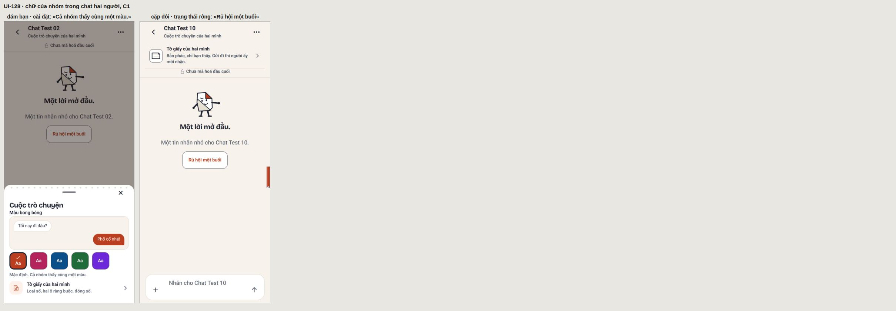 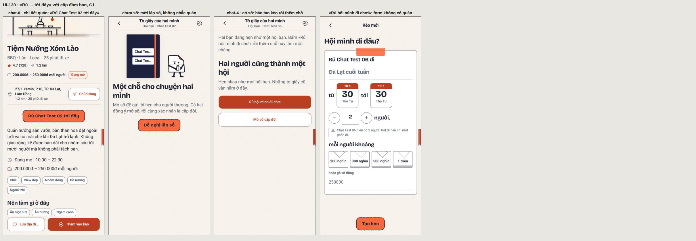 (hàng `TC-N26-BAN-CAI-DAT`, `TC-N26-DOI-TRONG`, `TC-N26-RU-FORM-CHU`) |
| Source | `CaiDatNhom.tsx:113` (sheet «Cài đặt nhóm»), `:177`; `GroupChatLive.tsx:782` (nút), `:816` («Rủ hội một buổi», hiện ở mọi phòng từ `c021702`); `CreateOutingLive.tsx:186`, `:226` |
| Hậu quả | Phòng hai người nói về «nhóm», «hội». Với cặp đôi, nó trái chính luật chữ khay đã theo. Người dùng trình đọc màn hình nghe «Cài đặt nhóm» trong chat một-một. Câu số người ở form đọc sai nghĩa |
| Đề xuất sửa | Nhánh chữ hai người cho ba chỗ: màu bong bóng («Hai bạn thấy cùng một màu.»), trạng thái rỗng của cặp đôi, và form kèo mới của chat hai người (tiêu đề, bỏ câu số người). Đổi nhãn trợ năng cùng lúc với Maestro 47 |
| Tiêu chí gỡ | `--chi ban:C1` và `doi:C1`: sheet cài đặt và trạng thái rỗng của chat hai người không còn «nhóm», «hội» ở chữ hay nhãn trợ năng; `--chi ru`: form «Kèo mới» của chat hai người không có câu «… hiện có N người» |
| Trạng thái sửa · Retest | chưa sửa · không áp dụng |

### UI-129 · Sheet «Gu của hai bạn» nói sai hoặc giấu trạng thái công tắc

| Trường | Nội dung |
|---|---|
| Category / Severity | UX ISSUE (chữ minh bạch về dữ liệu, câu lỗi ngoài chỗ nhìn) · **P3** |
| Feature / Screen / Layer | N26 · `/groups/[id]/to-giay` → «Cài đặt sổ» → sheet «Gu của hai bạn» (`GuHaiBan.tsx`) · L23 |
| Nền tảng, cấu hình | web, C1. Trạng thái đồng ý cũ dựng bằng `page.route` (sửa `gu_chat.cua_toi` của phản hồi thành `can_bat_lai`), vì mốc 29/09 của ADR-0048 đã qua nên không tạo được đồng ý cũ thật. Hai lệnh bật và tắt là lệnh thật; lỗi 503 chèn ở trình duyệt. Native: cùng mã (STATIC) |
| Điều kiện | Cặp đôi chat-8/chat-9, phía chat-9 |
| Tái hiện | (a) Người có đồng ý chia gu từ trước mốc mở sheet. (b) Chạm «Bật lại cho chat» khi lệnh thứ hai (đề nghị `chia_gu`) hỏng; hoặc chạm «Cho Chat Test 09 thấy gu của mình» khi lệnh hỏng |
| Expected | (a) Sheet nói một điều: gu này chưa được Rủ Đi AI dùng trong chat cho tới khi bật lại (ADR-0048 §3.1, §3.5). (b) Công tắc tắt (đóng an toàn, §3.2), và câu lỗi hiện trong sheet đang mở, nói công tắc đang tắt |
| Actual | (a) Hai dòng liền nhau nói ngược nhau: «Chat Test 09 thấy gu của bạn; Nếp dùng nó khi phác tờ, và Rủ Đi AI dùng nó trong chat của hai bạn.» rồi «Bạn bật từ trước, khi lời hứa chỉ là Nếp dùng gu khi phác tờ. Muốn Rủ Đi AI dùng gu của bạn trong chat thì bật lại.». (b) Bật lại: DELETE rồi POST (503); máy chủ báo `cua_toi = tat`; sheet sang «Gu của bạn đang để riêng.» và nút bật thường. Câu lỗi «Rủ Đi đang gặp sự cố nên chưa làm được việc này. Chưa có gì bị ghi sai, thử lại sau một chút.» nằm ở y 69, ngoài sheet, dưới lớp phủ (mờ, không chạm được). Công tắc vừa bị tắt, mà câu nói chưa có gì bị ghi. Bật thường mà hỏng: cùng câu, cùng chỗ |
| Evidence | 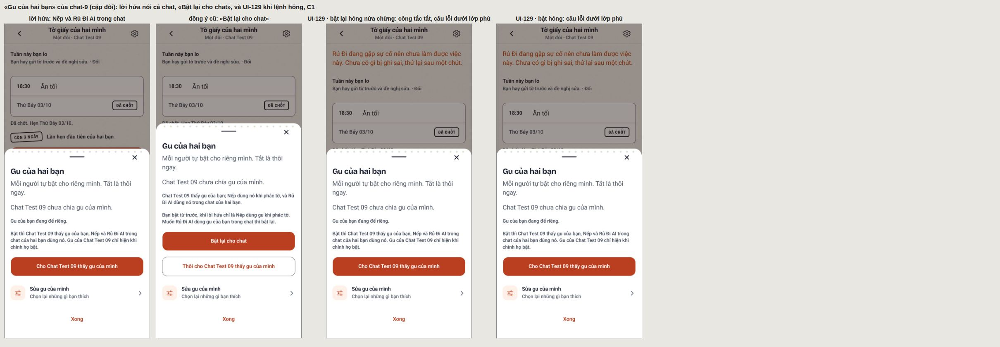 (hàng `TC-N26-GU-BAT-LAI-CAU`, `TC-N26-GU-BAT-LAI-LOI`, `TC-N26-GU-BAT-LOI`; đạt: `TC-N26-GU-LOI`, `TC-N26-GU-BAT`, `TC-N26-GU-BAT-LAI-HIEN`, `TC-N26-GU-BAT-LAI`) |
| Source | `gu-doi.ts:52` (`cuaToi` chỉ đọc `mine_shared`, không đọc `gu_chat`), `:86` (`CAU_BAT_LAI_CHO_CHAT`); `GuHaiBan.tsx:61–70`; `SoDoiSong.tsx:88` (`batLaiChoChat`: thu hồi rồi đề nghị); `useToGiay.ts:223` (lỗi vào `loiLenh`); `KhongGianGiay.tsx:433–437` (câu lỗi vẽ ở thân màn, dưới sheet); `src/api.ts:328` (câu 5xx dùng chung) |
| Hậu quả | Với đồng ý cũ, sheet vừa nói gu đang được AI dùng trong chat vừa nói chưa: lời minh bạch mà ADR-0048 §3.5 đòi thành mâu thuẫn. Khi bật lại hỏng nửa chừng, người bấm thấy công tắc của mình tắt, còn câu giải thích nằm sau lớp phủ và nói chưa có gì bị ghi |
| Đề xuất sửa | `cauGu` đọc thêm `gu_chat`: khi `can_bat_lai`, dòng của tôi chỉ nói phần sổ. Câu lỗi của lệnh gu vẽ trong sheet. Bật lại hỏng nửa chừng có câu riêng nói công tắc đang tắt và mời bật lại |
| Tiêu chí gỡ | `--chi gu:C1`: khi `can_bat_lai`, sheet không có câu «Rủ Đi AI dùng nó trong chat»; `TC-N26-GU-BAT-LAI-LOI` và `TC-N26-GU-BAT-LOI` có câu lỗi trong sheet, thấy được, nói công tắc đang tắt |
| Trạng thái sửa · Retest | chưa sửa · không áp dụng |

### UI-130 · «Rủ … tới đây» hiện cho mọi chat hai người, nhưng với cặp đám bạn chỗ vừa chọn không đi tới đâu

| Trường | Nội dung |
|---|---|
| Category / Severity | UX ISSUE (luồng, nút hứa một việc không làm) · **P2** |
| Feature / Screen / Layer | N26 × F02 · `/places/[id]` → `/groups/[id]/to-giay?ru=1&cho=…` → `/outings/new` |
| Nền tảng, cấu hình | web, C1. Native: cùng mã (STATIC) |
| Điều kiện | Người xem có chat đôi đang mở với một người chưa cùng bật «Một đôi» |
| Tái hiện | Ở chi tiết Tiệm Nướng Xóm Lào, chạm «Rủ Chat Test 02 tới đây» (chat-0, cặp chưa sổ) hoặc «Rủ Chat Test 06 tới đây» (chat-4, cặp đã lập sổ) |
| Expected | Chỗ vừa chọn nằm trên một lời rủ với người đó (tờ giấy, hay kèo của hai người), hoặc màn nói vì sao không và chỗ đó đi đâu. Nút chỉ hiện ở nơi nó làm được việc của nó |
| Actual | Chưa sổ: tới không gian giấy «Một chỗ cho chuyện hai mình. Mở sổ để gửi lời hẹn cho người thương…» với «Đề nghị lập sổ»; không chữ nào nhắc Tiệm Nướng Xóm Lào. Có sổ: câu «Hai bạn đang hẹn như một hội bạn. Bấm «Rủ hội mình đi chơi» rồi thêm chỗ này làm một chặng.»; «Rủ hội mình đi chơi» mở form «Kèo mới» không có quán, người dùng phải tìm lại. Nút hiện cho ba chat đôi đang mở đầu tiên, không xét «Một đôi» |
| Evidence |  (hàng `TC-N26-RU-BAN-CHUA-SO`, `TC-N26-RU-BAN-CO-SO`) |
| Source | `PlaceDetailLive.tsx:210` (`doi` = ba chat đôi `active` đầu tiên, không xét `cap_doi`), `:328–335`; `KhongGianGiay.tsx:96–116` (`goiYCho`: có sổ mà chưa «Một đôi» thì nói câu hướng dẫn rồi bỏ chỗ; chưa sổ thì không làm gì), `:78` (`?ru=1` chỉ phác khi `batDoi`); `/outings/new` không nhận chỗ |
| Hậu quả | Nút hứa rủ người đó tới quán này. Với mọi cặp chưa «Một đôi», tức mọi chat đôi mới, lời hứa không thành: chỗ bị bỏ trong im lặng, hoặc người dùng phải làm lại từ đầu. Cùng họ với UI-085 (tuần đã có tờ chốt) |
| Đề xuất sửa | Chỉ hiện «Rủ … tới đây» cho cặp đôi; hoặc với đám bạn thì mở «Kèo mới» của chat đôi đó với quán đã điền làm chặng đầu |
| Tiêu chí gỡ | `--chi ru`: với cả hai cặp đám bạn, màn tới nhắc tên quán, và form kèo mới (nếu có) có quán; hoặc trang quán không còn nút «Rủ … tới đây» cho họ |
| Trạng thái sửa · Retest | chưa sửa · không áp dụng |

### UI-131 · Máy chủ vẫn phác tờ giấy cho cặp chưa «Một đôi»: luật «tờ giấy chỉ cho cặp đôi» chỉ do app giữ

| Trường | Nội dung |
|---|---|
| Category / Severity | BUG (luật nghiệp vụ, phía máy chủ) · **P3** |
| Feature / Screen / Layer | N26 · `POST /contexts/{id}/papers/draft` (LIVE-GO, Python `live`) → `/groups/[id]/to-giay` |
| Nền tảng, cấu hình | API trên stack thứ hai (RUNTIME); màn web C1. Tác động tới người dùng qua bản app cũ hơn #660 là HYPOTHESIS, không đo |
| Điều kiện | Cặp đám bạn đã lập sổ, chưa «Một đôi» (chat-6/chat-7, `cap_doi = false`) |
| Tái hiện | chat-6 gọi `POST /contexts/{id}/papers/draft`, lệnh app gọi ở «Rủ đi chơi» |
| Expected | Máy chủ từ chối: từ #660, tờ giấy, «Rủ đi chơi» và công cụ «Tờ giấy» chỉ dành cho cặp đôi (`c021702`, «tờ giấy và sticker đôi chỉ cho cặp đôi»; ADR-0046 §8.4 định nghĩa cặp đôi) |
| Actual | 201, tờ ở trạng thái `nhap`; số tờ của cặp 0 → 1. Không gian giấy của chat-6 vẽ tờ đó với «Gửi cho người ấy» và «Sửa trước khi gửi», dưới đầu «Hội bạn · Chat Test 08»; chat đôi không hàng nào. Không lối UI nào trên main tới được lệnh này cho cặp đám bạn (đã rà `?ru=1`, «Rủ đi chơi», khay, hàng ghim, «Rủ … tới đây»). Bản phác đã bỏ qua UI («Bỏ bản phác này»; trên dây là nghỉ tuần, tờ sang `nghi_tuan`) |
| Evidence | 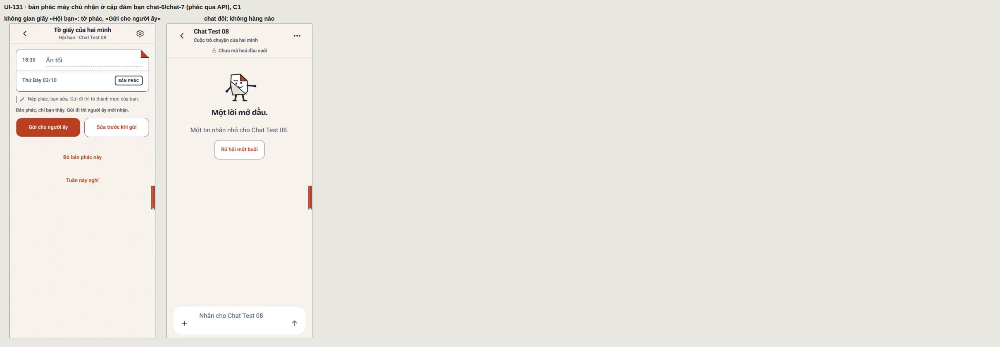 (hàng `TC-N26-Q2-PHAC-API`; `TC-N26-Q2-UI` đạt: màn giữ tờ đang mở, đúng chú thích mã) |
| Source | `services/core/internal/domain/pairsteps/papers.go:131–146`: `DraftPaper` chỉ kiểm `is_group_member` và `cycle_active_or_temporary`, không kiểm `CanBatDoi`, trong khi `guChoNep` cùng file (`:787`) có kiểm. App gác ở `KhongGianGiay.tsx:78`, `:206` và `GroupChatLive.tsx:1054`. Route LIVE-GO với oracle Python `live`, nên sửa phải đi cả hai nửa, qua cổng parity |
| Hậu quả | Trong thời gian cuốn chiếu, bản app cũ trước #660 vẫn phác và gửi tờ cho cặp đám bạn. Người nhận ở bản mới thấy tờ trong không gian giấy, nhưng chat không có hàng ghim nào báo. Luật của hai lớp phòng không có chỗ cưỡng chế phía máy chủ |
| Đề xuất sửa | Thêm điều kiện «Một đôi» vào phác và gửi tờ, ở Go và oracle Python cùng lúc; hoặc ghi vào ADR rằng luật này chỉ ở app, và vì sao |
| Tiêu chí gỡ | `--chi q2` trên một cặp đám bạn có sổ: `POST …/papers/draft` trả 4xx, số tờ không đổi |
| Trạng thái sửa · Retest | chưa sửa · không áp dụng |

---

## Mở rộng issue của audit gốc (đo ở N26)

Ba issue của `docs/claude/2026-09-27/mobile-ui-audit/issues.md` gặp lại trên màn mới của #660. Không đánh số mới.

| Issue gốc | Gặp lại ở N26 | Hàng · ảnh |
|---|---|---|
| UI-001 (vùng bấm dưới 48dp) | Hàng mời lập sổ hay «Một đôi» ở chat đôi (`HangLoiDeNghi`, `paddingVertical: 6`, `HangToGiay.tsx:128`): 49dp khi chữ xuống hai dòng (C1–C3), 31dp khi một dòng (C6, rộng 736) | `TC-N26-MOI-VUNG-BAM` C6 · [EV-N26-MOI-ghep](evidence/EV-N26-MOI-ghep.jpg) |
| UI-083 (đọc sổ lỗi thì vẽ như sổ trống) | Hàng ghim Tờ giấy ở chat cặp đôi: GET notebook trả 503 thì hàng đọc «Chưa có tờ nào tuần này. Đi đâu không?», trong khi chat-8 đang có bản phác | `TC-N26-LOI-SO-503` · [EV-N26-MOI-ghep](evidence/EV-N26-MOI-ghep.jpg) |
| UI-093 (tablet: tờ và sheet trải hết bề ngang) | Sheet «Gu của hai bạn» rộng 768 ở C6 | `TC-N26-GU-LOI` C6 · [EV-N26-MOI-ghep](evidence/EV-N26-MOI-ghep.jpg) |

---

## N14 Cộng đồng (tab đầu của app: bảng tin kiểm duyệt, realtime; #14, ADR-0040)

Đo trên bản web export của main với stack thứ hai. Cờ `MOBILE_COMMUNITY_ENABLED` bật và không có model kiểm duyệt, nên theo
ADR-0040 mọi bài và bình luận công khai chờ người duyệt. Persona:
- chat-0: tác giả;
- chat-1: bạn duy nhất của chat-0;
- chat-2 chọn «Cá nhân hóa», chat-3 chọn «Để sau»;
- chat-15: người duyệt, cấp vào `community_moderators` bằng SQL, đúng cách người vận hành cấp theo `docs/testing/cong-dong.md`;
- chat-16: người lạ, không là bạn của chat-0, không vai trò.

Stack không đặt `MOBILE_CORS_ALLOW_ORIGINS`, nên WebSocket của trang bị từ chối ở bước bắt tay (403). Phần realtime nối
socket của trang qua một relay Node không gửi Origin; khung nhận được là khung của máy chủ (`report.md` §A). Trạng thái
«chưa có bài công khai nào được duyệt» chỉ đo được một lần, nên được đo trước mọi lần ghi.

Đạt trong phạm vi đã đo (`coverage-matrix.md`, hàng `TC-N14-*`):
- **Không phiên, tab Cộng đồng** có lời mời và «Đăng nhập» 358×52 tới `/login`. Quan sát Q5 đóng: tab đúng; màn trong mở
  từ link thì không (UI-137).
- **Bảng tin trước bài duyệt đầu tiên**, phần không dính UI-132:
  - «Đang theo dõi» có trạng thái rỗng «Câu chuyện bắt đầu từ một người» và «Kể khoảnh khắc đầu tiên»;
  - hộp mời cá nhân hoá có hai nút cao 48dp; «Cá nhân hóa» đưa «Dành cho bạn» về trạng thái rỗng.
  - Sau bài duyệt đầu tiên, ba mode trả 200 cho chat-0 và chat-3, log core không thêm dòng lỗi nào.
- **Form «Kể một khoảnh khắc»**:
  - nút gửi luôn trong cửa sổ ở C1, C2, C3, C8, C6, C7; không tràn, không chữ bị cắt;
  - đăng công khai (chat-0 ở C1, chat-1 ở C3), đăng kèm một ảnh tổng hợp (bộ chọn tệp, xem trước 120×120, «Bỏ tệp»), đăng
    «Bạn bè»: cả ba tới chi tiết bài. Bài công khai mang dải «Đang chờ duyệt · Bản mới chưa xuất hiện công khai»; «Quay
    lại» về bảng tin.

  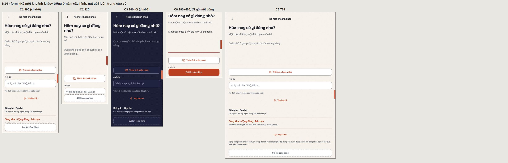
- **Hàng duyệt**: người không vai trò nhận «Tài khoản này không có quyền kiểm duyệt.». Người duyệt duyệt hai bài và hai
  bình luận qua UI, mỗi lần với lý do; bài «Bạn bè» không vào hàng.
- **Thẻ bài** ở C1, C3–C8:
  - khung ảnh nằm trọn trong vùng album; không tràn trang, không chữ bị cắt, không nút dưới 48dp;
  - «Đọc tiếp» mở hết thân bài tại chỗ;
  - thích đổi tên nút thành «Bỏ thích bài, 1 lượt thích» (phân xử bằng mắt: trạng thái nằm trong tên nút);
  - ba sheet «Lựa chọn cho bài đăng», «Bảng tin của bạn», «Báo cáo bài» (mở rồi «Thôi», không gửi): role dialog, tiêu điểm
    vào sheet, Esc đóng và trả tiêu điểm về nút mở, không sót inert.

  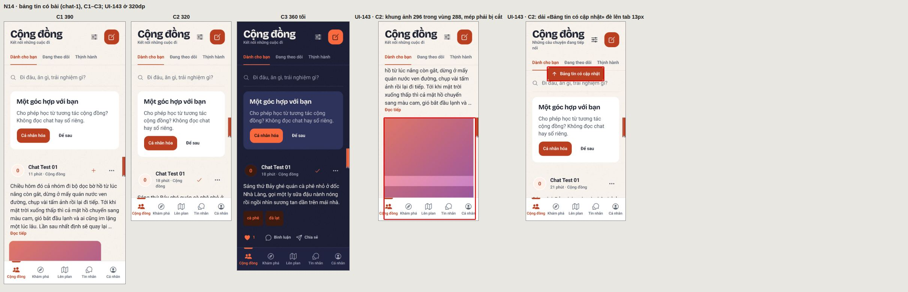
- **Realtime** (qua relay):
  - kết nối nhận khung `sync`; dòng phụ đổi thành «Những câu chuyện đang tiếp nối»;
  - một bài được duyệt hay một lượt thích đổi thì dải «Bảng tin có cập nhật» hiện: C1 mờ dần khoảng 200 ms, C9 hiện trọn
    ngay khung đầu. Chạm dải thì tải lại và về đầu;
  - mở chi tiết bài khi stream đang nối: thẻ hiện một lần, không nháy.
- **Chi tiết bài** ở C1, C2, C3, C8, có «Quay lại»:
  - sheet «Quản lý bài» đủ năm lựa chọn của tác giả; «Xóa bài» hỏi bằng cách đổi nhãn thành «Xác nhận xóa bài và bình
    luận» (không bấm xác nhận); «Chỉ mình tôi» rồi «Cất lại cho bạn bè» đổi người đọc qua lại;
  - sửa bài đã duyệt tạo phiên bản 2 chờ duyệt, người khác vẫn đọc bản đã duyệt;
  - người lạ mở bài «Bạn bè» nhận «Bài đã được cất riêng hoặc không còn ở đây.», không lộ nội dung, và không thấy bản sửa
    chưa duyệt của bài công khai.

  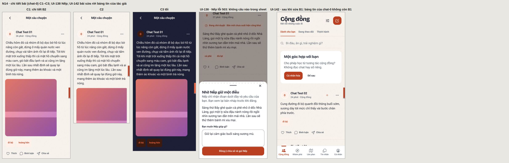
- **Bình luận và màn phụ**: bình luận vừa gửi hiện ngay với «Đang chờ duyệt · Chỉ bạn thấy»; «Trả lời» gắn tên người được
  trả lời; tag một người bạn thì sau khi duyệt người đó có thông báo. Tìm theo chủ đề và theo người, «Bài của tôi · Trạng
  thái duyệt», «Bài đã lưu» đạt.
- **Lỗi**: đọc bảng tin 503 hay mất mạng có câu và «Thử lại» chạy được; bài không còn thì có câu và «Quay lại».
- **Chỗ gặp tường cá nhân v2 (#658)**: bạn thấy cả ba bài của chat-0 trên tường (hai công khai, một «Bạn bè»); người lạ chỉ
  thấy hai bài công khai.

### UI-132 · Cộng đồng chưa có bài công khai nào được duyệt: tab đầu của app nói «chưa kết nối được» thay cho trạng thái rỗng, và «Thử lại» không bao giờ thành

| Trường | Nội dung |
|---|---|
| Category / Severity | BUG (máy chủ trả lỗi cho một trạng thái rỗng) · **P2** |
| Feature / Screen / Layer | N14 · `/community`, tab đầu của app · bảng tin «Dành cho bạn» và «Thịnh hành»; `GET /v2/community/feed` (LIVE-GO, không có bản Python) |
| Nền tảng, cấu hình | API trên stack thứ hai (RUNTIME); màn web ở C1, C2, C3. Native gọi cùng API nên nhận cùng lỗi (STATIC) |
| Điều kiện | Chưa có bài công khai nào được duyệt: trạng thái của mọi cộng đồng vừa bật, kéo dài tới khi người duyệt duyệt bài đầu tiên (không có model thì mọi bài chờ người, ADR-0040). «Dành cho bạn» dính khi người xem chưa bật «Cá nhân hóa», tức mặc định; «Thịnh hành» dính với mọi người |
| Tái hiện | 1. chat-0 mở tab Cộng đồng. 2. Chạm «Thử lại». 3. Chạm tab «Thịnh hành». 4. Một người khác (chat-3) chạm «Để sau» ở hộp mời cá nhân hoá |
| Expected | Trạng thái rỗng mời kể chuyện đầu tiên, như tab «Đang theo dõi» đang làm («Câu chuyện bắt đầu từ một người», «Kể khoảnh khắc đầu tiên») |
| Actual | API: `for_you` và `trending` trả 503 `community_unavailable`; `following`, `mine`, `saved` trả 200 với 0 bài. Màn: «Cộng đồng chưa kết nối được. Bạn thử lại sau một chút nhé.» và «Thử lại» (y 427 ở C1 và C3, y 451 ở C2), không có trạng thái rỗng. «Thử lại» đọc lại và lại 503. «Thịnh hành»: cùng câu. «Để sau»: hộp mời mất, câu lỗi còn. Chỉ «Cá nhân hóa» (chat-2) đưa «Dành cho bạn» về trạng thái rỗng; «Thịnh hành» của chat-2 vẫn lỗi. Mỗi lần đọc hỏng để lại một dòng `sqlstate=23502` (vi phạm NOT NULL) trong log core: 12 dòng có từ trước (các lượt retest có mở tab Cộng đồng), 37 dòng sau phần đo rỗng. Người duyệt duyệt bài đầu tiên xong thì ba mode trả 200 cho chat-0 và chat-3, bảng tin có thẻ, log đứng ở 37 |
| Evidence |  (hàng `TC-N14-API-RONG`, `TC-N14-RONG-BANG-TIN` C1–C3, `TC-N14-RONG-THU-LAI`, `TC-N14-RONG-THINH-HANH`, `TC-N14-RONG-DE-SAU`; đạt: `TC-N14-RONG-THEO-DOI`, `TC-N14-RONG-CA-NHAN-HOA`, `TC-N14-API-SAU-DUYET`, `TC-N14-RONG-SAU-DUYET`) |
| Source | `services/core/internal/community/candidates.go:54`: bảng xếp hạng chung được chép bằng `append([]string(nil), h.commonRanking...)`, nên danh sách rỗng cho ra `nil`. `feed.go:244`: INSERT `community_feeds(…, post_ids, …)` với mảng đó, và mảng `nil` xuống cơ sở dữ liệu thành NULL. `schema.sql:100`: `post_ids uuid[] NOT NULL`. «Đang theo dõi» và «Dành cho bạn» đã cá nhân hoá đi nhánh `rank()`, trả mảng rỗng khác `nil`, nên không dính. Route chỉ có Go (`routes.json`: `python: absent`): không có oracle, cổng parity không phủ nó |
| Hậu quả | Ở lần mở đầu tiên của một cộng đồng mới, tab đầu của app nói cộng đồng hỏng thay vì mời kể chuyện đầu tiên, và «Thử lại» không bao giờ thành. Người mới đọc đó là app lỗi, trong khi thứ duy nhất thiếu là một bài được duyệt. Vẫn có lối đi (nút viết bài ở đầu màn, tab «Đang theo dõi»), nên là P2 |
| Đề xuất sửa | Chép bảng xếp hạng thành mảng rỗng khác `nil` (`make([]string, 0, n)` rồi append), hoặc không ghi snapshot khi không có bài nào. Thêm ca bảng tin rỗng ở test Go và ở tầng PostgreSQL thật |
| Tiêu chí gỡ | Trên một stack chưa có bài công khai nào được duyệt, `n14-cong-dong.mjs --chi api,rong`: `for_you` và `trending` trả 200 với 0 bài; màn ở C1–C3 có trạng thái rỗng ở cả ba tab, không câu lỗi; log core không thêm dòng 23502 |
| Trạng thái sửa · Retest | chưa sửa · không áp dụng |

### UI-133 · Sáu chủ đề, hoặc một chủ đề một ký tự: máy chủ từ chối, còn app nói đó là lỗi của app và đặt câu dưới mép màn

| Trường | Nội dung |
|---|---|
| Category / Severity | BUG (câu lỗi sai nguyên nhân, nằm ngoài tầm nhìn) · **P2** |
| Feature / Screen / Layer | N14 · `/community/new` «Kể một khoảnh khắc» · ô «Chủ đề», câu lỗi của form |
| Nền tảng, cấu hình | web, C1. Native: cùng mã, cùng câu (STATIC) |
| Điều kiện | Người viết gõ sáu chủ đề (gợi ý dưới ô nói «Tối đa 5 chủ đề, ngăn cách bằng dấu phẩy.»), hoặc một chủ đề chỉ một ký tự |
| Tái hiện | 1. Mở «Kể một khoảnh khắc», gõ nội dung. 2. Ô «Chủ đề»: «cà phê, đi bộ, đà lạt, ăn sáng, hoàng hôn, chợ đêm» (hoặc «a»). 3. Chạm «Gửi lên cộng đồng» |
| Expected | Form nói đúng điều cần sửa (quá năm chủ đề, chủ đề quá ngắn), gần ô chủ đề và trong tầm nhìn. Gợi ý đã nêu giới hạn, nên tốt hơn là báo trước khi gửi |
| Actual | `POST /v2/community/posts` trả 422 (`too_many_topics`, `invalid_topic`). Câu hiện ra: «App gửi lên một yêu cầu không hợp lệ, nên việc này chưa được ghi. Đây là lỗi của app chứ không phải do bạn nhập sai. Thử lại sau, và báo cho nhóm kỹ thuật nếu vẫn vậy.» Lúc chạm gửi, câu nằm ở y 844–940 trong cửa sổ cao 844, hẳn dưới mép; nút gửi ở y 780–832. Màn trông như không có gì xảy ra. Bản viết và chủ đề còn nguyên |
| Evidence | 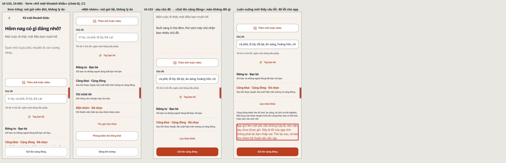 (hàng `TC-N14-DANG-6-CHU-DE`, `TC-N14-DANG-CHU-DE-NGAN`) |
| Source | `services/core/internal/community/posts.go:28` (`too_many_topics`), `:35` (`invalid_topic`). `apps/mobile/src/rudi/community/api.ts:70–93` (`COMMUNITY_ERRORS`) không có hai mã này, nên câu rơi về câu 4xx chung (`src/api.ts:325`). `Composer.tsx:70`: nút gửi là chân cố định của màn; `:82`: câu lỗi là dòng cuối của phần cuộn, và màn không cuộn tới nó |
| Hậu quả | Người viết làm đúng gợi ý trừ một chủ đề, rồi được bảo đó là lỗi của app: họ báo lỗi hoặc bỏ bài thay vì bớt một chủ đề. Trên điện thoại chuẩn không thấy câu nào, chỉ thấy nút gửi không làm gì |
| Đề xuất sửa | Thêm `too_many_topics`, `invalid_topic` vào `COMMUNITY_ERRORS` với câu nói việc cần sửa; kiểm số và độ dài chủ đề ngay khi gõ; đặt câu lỗi gần ô, hoặc cuộn tới câu lỗi và dời tiêu điểm vào nó |
| Tiêu chí gỡ | `--chi dang:C1`: `TC-N14-DANG-6-CHU-DE` và `TC-N14-DANG-CHU-DE-NGAN` có câu nói về chủ đề, không có «lỗi của app», và câu nằm trong cửa sổ lúc chạm gửi (hoặc nút gửi tắt kèm lý do) |
| Trạng thái sửa · Retest | chưa sửa · không áp dụng |

### UI-134 · Stream nối lại thì chi tiết bài dựng lại từ đầu: chữ đang gõ trong ô bình luận mất, màn về đầu

| Trường | Nội dung |
|---|---|
| Category / Severity | BUG (mất chữ người dùng đang gõ, không do thao tác của họ) · **P2** (họ UI-097) |
| Feature / Screen / Layer | N14 · `/community/posts/[id]` · khu bình luận (ô «Bình luận»), stream `/v2/community/stream` |
| Nền tảng, cấu hình | web, C1; stream nối qua relay (`report.md` §A). Native: app về nền rồi trở lại (`AppState`) đóng và nối lại socket bằng cùng mã (STATIC) |
| Điều kiện | Đang ở chi tiết bài với stream đã nối. Stream nối lại khi máy chủ đóng socket (khởi động lại, mạng chập chờn) hoặc khi app về nền rồi trở lại |
| Tái hiện | 1. chat-1 mở chi tiết B1, gõ «Một lời nháp chưa gửi, gõ dở giữa chừng» vào ô bình luận. 2a. Máy chủ đóng socket (relay đóng phía máy chủ); app tự nối lại. 2b. Hoặc trang ẩn rồi hiện lại (`visibilitychange`, xấp xỉ chuyển app) |
| Expected | Nối lại xong, bài và chữ đang gõ còn nguyên. ADR-0040: client «phục hồi sau reconnect và không tự đẩy vị trí cuộn» |
| Actual | Mỗi kết nối mới nhận khung `sync` đầu tiên; màn gỡ thẻ bài cùng khu bình luận rồi đọc lại bài. 5 s sau, ô bình luận trống và màn về đầu. Ẩn rồi hiện lại: cùng kết quả |
| Evidence | 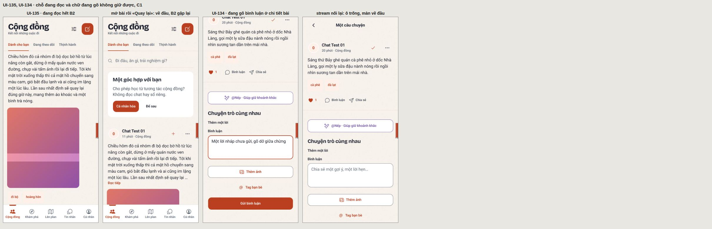 (hàng `TC-N14-WS-MAT-CHU`, `TC-N14-WS-AN-HIEN`; đạt: `TC-N14-WS-NHAY`, lần mở đầu không nháy) |
| Source | `apps/mobile/src/rudi/community/PostDetail.tsx:45–50`: khung `sync` gọi `setPost(null)`, `setDraft("")`, `setNep(false)` rồi đọc lại. `:100`: khu bình luận (`Comments`, giữ chữ đang gõ trong state của nó) chỉ vẽ khi có `post`, nên bị gỡ và mất state. `useCommunityStream.ts:24`: mọi kết nối mới nhận `sync` trước; `:28`, `:32`: socket đóng hay `AppState` đổi thì nối lại. Cùng dòng `:46–48` đóng sheet Nếp và xoá bản nháp Nếp vừa viết (STATIC, không đo vì AI không có khoá) |
| Hậu quả | Một bình luận đang viết dở mất mà người viết không làm gì, mỗi khi mạng chập chờn hay khi họ rời app một lát (trả lời tin nhắn rồi quay lại). Trên điện thoại đó là thao tác thường ngày |
| Đề xuất sửa | Khi `sync` tới, đọc lại bài mà không đặt `post` về `null` (giữ thẻ và khu bình luận, chỉ thay dữ liệu); hoặc nâng chữ đang gõ lên màn cha để nó sống qua lần dựng lại. Không xoá bản nháp Nếp khi nối lại |
| Tiêu chí gỡ | `--chi ws:chi-tiet`: `TC-N14-WS-MAT-CHU` và `TC-N14-WS-AN-HIEN` còn nguyên chữ đã gõ sau khi nối lại, màn không về đầu |
| Trạng thái sửa · Retest | chưa sửa · không áp dụng |

### UI-135 · Mở một bài rồi «Quay lại»: bảng tin về đầu, bài vừa đọc dở gập lại

| Trường | Nội dung |
|---|---|
| Category / Severity | UX ISSUE (mất chỗ đang đọc) · **P2** |
| Feature / Screen / Layer | N14 · `/community` → `/community/posts/[id]` → «Quay lại» · danh sách bảng tin |
| Nền tảng, cấu hình | web, C1. Native: cùng `useFocusEffect` (STATIC) |
| Điều kiện | Bảng tin đủ dài để cuộn; người đọc đã cuộn xuống và mở hết thân một bài dài |
| Tái hiện | 1. chat-1 cuộn bảng tin tới ảnh của B2, chạm «Đọc tiếp» cho hết thân B2. 2. Chạm thân B2 để mở chi tiết. 3. «Quay lại» |
| Expected | Về đúng chỗ đang đọc, B2 vẫn mở hết. ADR-0040 đặt luật «không tự đẩy vị trí cuộn» cho realtime; quay về từ một bài là trường hợp thường gặp hơn |
| Actual | Trước: cuộn 367 trên 1407px, thẻ B2 ở y 64. Sau khi về: cuộn 0 (danh sách tải lại, cao 1374px), thẻ B2 xuống y 431 và gập lại («Đọc tiếp» trở lại) |
| Evidence |  (hàng `TC-N14-BANG-CUON`) |
| Source | `apps/mobile/src/rudi/community/CommunityScreen.tsx:79`: mỗi lần màn được focus, `useFocusEffect` gọi `setPosts([])` rồi đọc lại từ đầu; chi tiết bài là route đẩy lên, nên quay về là một lần focus. Trạng thái mở hết (`expanded`) nằm trong `PostCard`, mất theo thẻ. Stream nối lại ở bảng tin cũng `setPosts([])` (`:85–88`), nên cũng đẩy về đầu (STATIC, chưa đo ở bảng tin) |
| Hậu quả | Đọc theo kiểu «mở một bài, quay lại, đọc tiếp», cách đọc chính của một bảng tin, thì mỗi lần mở bài lại phải cuộn tìm chỗ cũ. Bảng tin càng dài càng tốn |
| Đề xuất sửa | Không xoá danh sách khi màn được focus lại; chỉ làm mới khi dữ liệu đã cũ, và giữ vị trí cuộn (hoặc làm mới ngầm rồi báo bằng dải «Bảng tin có cập nhật» như realtime) |
| Tiêu chí gỡ | `--chi bang:C1`: `TC-N14-BANG-CUON` về lại vị trí cuộn trong khoảng 24px, B2 vẫn mở hết |
| Trạng thái sửa · Retest | chưa sửa · không áp dụng |

### UI-136 · «Chia sẻ» trên thẻ bài: trên web không có gì xảy ra; có Web Share thì gửi đi một chuỗi `rudi://` làm chữ

| Trường | Nội dung |
|---|---|
| Category / Severity | BUG (nút không làm gì, lỗi bị nuốt) · **P2** (họ UI-049) |
| Feature / Screen / Layer | N14 · thẻ bài ở `/community` và ở chi tiết bài · nút «Chia sẻ» |
| Nền tảng, cấu hình | web, C1. Chromium headless không có `navigator.share`; ca có Web Share dựng bằng một `navigator.share` giả cài trong trang, chỉ để đọc thứ app gửi. Native: khay chia sẻ mở với cùng chữ `rudi://community/posts/[id]` (STATIC) |
| Điều kiện | Bất kỳ bài nào |
| Tái hiện | Chạm «Chia sẻ» dưới một thẻ bài |
| Expected | Có một cách gửi bài đi (khay chia sẻ, hoặc chép link) và một câu khi không làm được. Link mở được ở người nhận: https, hoặc link app có đường dự phòng |
| Actual | Không có Web Share: không gì đổi (đường dẫn, hộp thoại, chữ trang như trước), trang ném lỗi không ai bắt «Share is not supported in this browser», không câu nào cho người dùng. Có Web Share: `navigator.share` nhận `{"title":null,"text":"rudi://community/posts/[id]","url":""}`, tức link nằm trong chữ chứ không trong `url`, và mang scheme của app |
| Evidence | 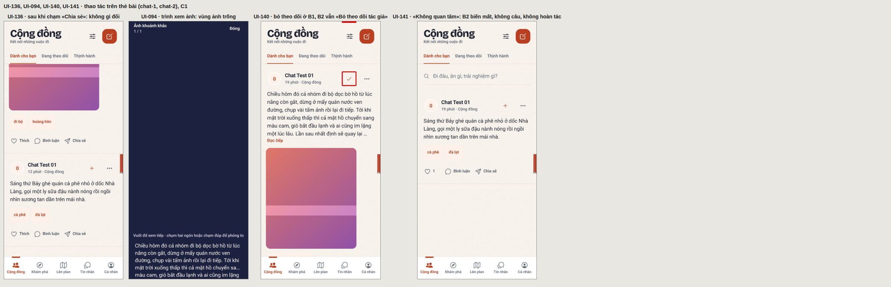 (hàng `TC-N14-BANG-CHIA-SE`, `TC-N14-BANG-CHIA-SE-LINK`) |
| Source | `apps/mobile/src/rudi/community/PostCard.tsx:81`: `void Share.share({ message })`, với `message` là `rudi://community/posts/` nối id bài. `void` bỏ promise, nên khi react-native-web từ chối (không có Web Share) thì không ai bắt; react-native-web đưa `message` vào `text` của Web Share. Cùng cơ chế với UI-049 |
| Hậu quả | Trên web, «Chia sẻ» của mọi bài là nút chết, không một lời. Ở trình duyệt có Web Share và trên native, người nhận nhận một chuỗi `rudi://…`: ai chưa cài app thì không mở được, và nhiều app nhắn tin có thể không biến chuỗi đó thành link bấm được (HYPOTHESIS, chưa đo trên máy) |
| Đề xuất sửa | Bắt lỗi của `Share.share`; khi không có khay chia sẻ thì chép link rồi báo một câu. Dùng link https mở được app (universal link, app link) hoặc có trang dự phòng, và đưa vào `url` |
| Tiêu chí gỡ | `--chi bang:C1`: `TC-N14-BANG-CHIA-SE` có phản hồi thấy được (khay, hoặc câu đã chép link), không lỗi trang; `TC-N14-BANG-CHIA-SE-LINK` nhận một link https trong `url` |
| Trạng thái sửa · Retest | chưa sửa · không áp dụng |

### UI-137 · Không phiên, mở màn trong của Cộng đồng bằng link: chi tiết bài chờ mãi, các màn khác không có lối đăng nhập

| Trường | Nội dung |
|---|---|
| Category / Severity | UX ISSUE (ngõ cụt khi mở link lạnh) · **P2** |
| Feature / Screen / Layer | N14 · `/community/posts/[id]`, `/community/new`, `/community/notifications`, `/community/review`, mở lạnh không phiên |
| Nền tảng, cấu hình | web, C1. Native: link app mở cùng các route (STATIC) |
| Điều kiện | Chưa đăng nhập, hay phiên đã hết, rồi mở một link vào màn trong: ví dụ link bài người khác gửi (UI-136) |
| Tái hiện | Không phiên, mở thẳng bốn đường trên |
| Expected | Như tab Cộng đồng không phiên (đạt, `TC-N14-KHONG-PHIEN`): nói cần đăng nhập và có «Đăng nhập», hoặc chuyển tới màn đăng nhập rồi quay lại |
| Actual | Chi tiết bài: «Một câu chuyện» và «Đang mở câu chuyện…», không gì hơn. Viết bài: «Đăng nhập để viết câu chuyện của bạn.», không nút. Thông báo: «Những lời nhắc sẽ gặp bạn ở đây.»; hàng duyệt: «Chưa có nội dung cần xem xét.», tức trạng thái rỗng như đã đăng nhập. Không màn nào có «Đăng nhập»; đường dẫn đứng yên |
| Evidence | 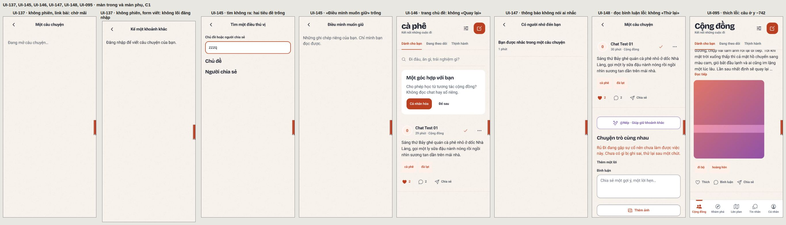 (hàng `TC-N14-KHONG-PHIEN-SAU`; đạt: `TC-N14-KHONG-PHIEN`) |
| Source | `apps/mobile/src/rudi/community/PostDetail.tsx:35–36`: `load` thoát ngay khi không có `person`, nên bài không bao giờ được đọc; `:100` vẽ «Đang mở câu chuyện…» khi chưa có bài và chưa có lỗi. `Composer.tsx:68`: câu không kèm nút. `Notifications.tsx`, `Review.tsx`: không kiểm phiên, vẽ danh sách rỗng. Tab thì có kiểm (`CommunityScreen.tsx:119–120`) |
| Hậu quả | Link bài gửi cho một người chưa đăng nhập dẫn tới một màn chờ không bao giờ xong; người đó không biết cần đăng nhập, và không có nút để làm. Thông báo và hàng duyệt nói sai rằng không có gì |
| Đề xuất sửa | Một cổng phiên dùng chung cho các route `/community/*`: câu và nút «Đăng nhập», hoặc chuyển tới đăng nhập kèm đường quay lại, như tab đang làm |
| Tiêu chí gỡ | `--chi khong-phien`: `TC-N14-KHONG-PHIEN-SAU` có «Đăng nhập» (hoặc tới `/login`) ở cả bốn màn, không màn nào chờ mãi |
| Trạng thái sửa · Retest | chưa sửa · không áp dụng |

### UI-138 · Gọi Nếp lỗi: sheet không đổi gì, câu lỗi nằm ở đầu màn phía sau sheet

| Trường | Nội dung |
|---|---|
| Category / Severity | UX ISSUE (lỗi không thấy được) · **P2** |
| Feature / Screen / Layer | N14 · `/community/posts/[id]` · sheet «Gọi Nếp» («Nhờ Nếp giữ một điều») |
| Nền tảng, cấu hình | web, C1. AI không có khoá nên `POST …/nep` trả 503 (`report.md` §A). Native: cùng mã (STATIC) |
| Điều kiện | Nếp không trả lời được: chưa có model, model lỗi, hay mất mạng |
| Tái hiện | chat-0 mở chi tiết bài của mình → «@Nếp · Giúp giữ khoảnh khắc» → gõ «Giữ lại cảm giác buổi sáng sương mù.» → «Đồng ý chia sẻ và gọi Nếp» |
| Expected | Câu lỗi hiện trong sheet đang mở, gần nút vừa bấm |
| Actual | `POST …/nep` trả 503. Nút trở lại như cũ, sheet không có câu nào. Câu «Nếp chưa trả lời được. Nội dung của bạn vẫn ở đây.» nằm ở y −148 trên thân màn phía sau sheet, dưới lớp phủ, không thấy và không chạm được. Yêu cầu đã gõ còn |
| Evidence |  (hàng `TC-N14-NEP`) |
| Source | `apps/mobile/src/rudi/community/PostDetail.tsx:51–60` (`act`): lỗi vào `error` của màn; `:99`: `error` chỉ vẽ dưới `TopBar` của thân màn, ngoài sheet. Cùng họ UI-095 (câu lỗi ngoài chỗ nhìn) và phần câu lỗi dưới sheet của UI-129 |
| Hậu quả | Người gọi Nếp chạm nút, thấy nút đổi rồi trở lại, không biết là lỗi hay phải chờ; thử lại mãi hoặc bỏ. Câu lỗi có trấn an rằng nội dung vẫn còn, nhưng không ai thấy nó |
| Đề xuất sửa | Vẽ câu lỗi của lệnh Nếp trong sheet (lỗi riêng của sheet), kèm «Thử lại» |
| Tiêu chí gỡ | `--chi chi-tiet:C1` trên stack không có AI: `TC-N14-NEP` có câu lỗi trong sheet, trong cửa sổ |
| Trạng thái sửa · Retest | chưa sửa · không áp dụng |

### UI-139 · Thẻ bài ngắn: lần chạm đầu vào thân bài không làm gì, lần hai mới mở bài

| Trường | Nội dung |
|---|---|
| Category / Severity | UX ISSUE (chạm không phản hồi) · **P3** |
| Feature / Screen / Layer | N14 · `/community` · thẻ bài, vùng thân bài (nhãn trợ năng «Đọc toàn bộ câu chuyện») |
| Nền tảng, cấu hình | web, C1. Native: cùng mã (STATIC) |
| Điều kiện | Thân bài đủ ngắn để hiện trọn trong sáu dòng (B1: 121 ký tự), nên không có «Đọc tiếp» |
| Tái hiện | chat-1 chạm thân B1 một lần, rồi lần hai |
| Expected | Lần chạm đầu mở chi tiết bài, như nhãn trợ năng hứa: thân đã hiện trọn, không còn gì để mở rộng |
| Actual | Lần 1: vẫn ở `/community`, thân cao 78px như trước, không gì đổi. Lần 2: tới chi tiết bài. Với bài dài, lần 1 mở hết thân tại chỗ (đạt, `TC-N14-BANG-DOC-TIEP`): hai chạm là thiết kế cho bài dài, nhưng bài ngắn cũng phải chịu |
| Evidence | Không có ảnh: lần chạm đầu không đổi gì trên màn. Số đo ở hàng `TC-N14-BANG-CHAM-THAN` |
| Source | `apps/mobile/src/rudi/community/PostCard.tsx:68`: `onPress` luôn đặt `expanded` trước (`if (!expanded) setExpanded(true)`), chỉ lần sau mới `router.push`, không xét thân có bị cắt hay không |
| Hậu quả | Người đọc chạm một bài ngắn, không thấy gì, nghĩ app không nhạy hay bài không mở được; có người không chạm lần hai |
| Đề xuất sửa | Chỉ qua bước mở rộng khi thân thật sự bị cắt (đo `onTextLayout` hay độ dài); còn lại mở chi tiết ngay |
| Tiêu chí gỡ | `--chi bang:C1`: `TC-N14-BANG-CHAM-THAN` tới chi tiết bài sau lần chạm đầu |
| Trạng thái sửa · Retest | chưa sửa · không áp dụng |

### UI-140 · Theo dõi hay bỏ theo dõi ở một thẻ: thẻ khác của cùng tác giả vẫn mang nhãn cũ

| Trường | Nội dung |
|---|---|
| Category / Severity | BUG (trạng thái lệch giữa các thẻ) · **P3** |
| Feature / Screen / Layer | N14 · `/community` · thẻ bài, nút theo dõi tác giả |
| Nền tảng, cấu hình | web, C1. Native: cùng mã (STATIC) |
| Điều kiện | Bảng tin có hai bài của cùng một tác giả (B1, B2 của chat-0); người xem đang theo dõi tác giả đó |
| Tái hiện | chat-1 chạm «Bỏ theo dõi tác giả» ở thẻ B1, nhìn thẻ B2; rồi chạm lại để theo dõi |
| Expected | Mọi thẻ của cùng tác giả đổi nhãn cùng lúc |
| Actual | Lần 1: B1 «Bỏ theo dõi tác giả» → «Theo dõi tác giả», B2 vẫn «Bỏ theo dõi tác giả». Lần 2: B1 trở lại «Bỏ theo dõi tác giả». Máy chủ đúng: cuối lượt chat-1 vẫn theo dõi chat-0, «Đang theo dõi» có 2 thẻ |
| Evidence |  (hàng `TC-N14-BANG-THEO-DOI`) |
| Source | `apps/mobile/src/rudi/community/CommunityScreen.tsx:136`: `onFollow` gọi API rồi `update({ ...item, following: !item.following })` cho đúng một thẻ; `update` (`:91`) thay theo `id` bài |
| Hậu quả | Hai nút cạnh nhau nói hai điều ngược nhau về cùng một người; ai đọc thẻ B2 hiểu sai rằng mình vẫn theo dõi |
| Đề xuất sửa | Sau khi theo dõi hay bỏ, cập nhật mọi thẻ có cùng `author_id`, hoặc đọc lại trạng thái theo dõi |
| Tiêu chí gỡ | `--chi bang:theo-doi`: sau mỗi lần chạm, B1 và B2 cùng nhãn |
| Trạng thái sửa · Retest | chưa sửa · không áp dụng |

### UI-141 · «Không quan tâm» ẩn bài vĩnh viễn: không câu báo, không hoàn tác, không chỗ xem lại; «Xóa lịch sử đề xuất» chạy ngay sau một chạm

| Trường | Nội dung |
|---|---|
| Category / Severity | UX ISSUE (thao tác không đảo được, không phản hồi) · **P3** |
| Feature / Screen / Layer | N14 · `/community` · sheet «Lựa chọn cho bài đăng» («Không quan tâm»), sheet «Bảng tin của bạn» («Xóa lịch sử đề xuất») |
| Nền tảng, cấu hình | web, C1 cho «Không quan tâm» (RUNTIME). «Xóa lịch sử đề xuất» chỉ đọc mã, không bấm trên stack (STATIC). Native: cùng mã |
| Điều kiện | Người xem có bài trong bảng tin (chat-2, B2) |
| Tái hiện | «…» trên thẻ B2 → «Không quan tâm». Tải lại. Tìm lại B2 trong sheet «Bảng tin của bạn» |
| Expected | ADR-0040 cho người dùng «tắt, xóa lịch sử và không quan tâm». Một lựa chọn làm bài biến mất nên nói đã ẩn và cho hoàn tác, ít nhất trong chốc lát, hoặc có chỗ xem lại bài đã ẩn. Xoá lịch sử đề xuất nên hỏi trước |
| Actual | B2 biến mất ngay (còn 1 thẻ), không câu nào, không «Hoàn tác». Tải lại vẫn ẩn. Sheet «Bảng tin của bạn» có «Tắt cá nhân hóa», «Xóa lịch sử đề xuất», «Bài đã lưu», «Bài của tôi · Trạng thái duyệt», «Điều mình muốn giữ», «Thông báo»: không có mục bài đã ẩn. API có lệnh bỏ ẩn (`feedback` với `enabled=false`) nhưng app không gọi ở đâu, và xoá lịch sử đề xuất cũng không bỏ ẩn. «Xóa lịch sử đề xuất» (đọc mã): gọi `DELETE /v2/community/history` ngay, tải lại và đóng sheet, không hỏi, không câu báo |
| Evidence |  (hàng `TC-N14-BANG-AN`; `TC-N14-XOA-LICH-SU` STATIC) |
| Source | `apps/mobile/src/rudi/community/CommunityScreen.tsx:127` («Không quan tâm»: `feedback(…, "hidden", true)` rồi lọc bài khỏi danh sách), `:122–126` («Xóa lịch sử đề xuất»). `community/api.ts:112` (`feedback` nhận `enabled`). `services/core/internal/community/feed.go:374–395` (`clearHistory` xoá `community_interactions` và `community_feeds`, không đụng `community_feedback`), `:198` (bảng tin loại bài `hidden`) |
| Hậu quả | Một cú chạm nhầm làm mất một bài khỏi mọi bảng tin của người đó, không cách nào lấy lại trong app. Lịch sử đề xuất mất sau một chạm, không báo đã xoá |
| Đề xuất sửa | Sau «Không quan tâm», một dòng «Đã ẩn bài» kèm «Hoàn tác» (gọi `enabled=false`); thêm mục bài đã ẩn ở sheet cài đặt. Hỏi trước khi xoá lịch sử đề xuất, và báo sau khi xoá |
| Tiêu chí gỡ | `--chi bang:an` trên một bài chưa ẩn: có câu và «Hoàn tác» đưa bài trở lại; sheet có lối xem bài đã ẩn. Chạm «Xóa lịch sử đề xuất» mở bước hỏi |
| Trạng thái sửa · Retest | chưa sửa · không áp dụng |

### UI-142 · Sửa một bài đã duyệt: bài rời bảng tin của chính tác giả cho tới khi bản sửa được duyệt

| Trường | Nội dung |
|---|---|
| Category / Severity | UX ISSUE (bài của mình biến mất không lời) · **P3** |
| Feature / Screen / Layer | N14 · `/community` («Dành cho bạn», «Thịnh hành») sau `/community/new?edit=…`; `GET /v2/community/feed` |
| Nền tảng, cấu hình | API và web, C1 |
| Điều kiện | Tác giả sửa một bài công khai đã duyệt; bản sửa chờ duyệt (không có model thì chờ người) |
| Tái hiện | chat-0 sửa B1 («Sửa bài» → «Gửi bản sửa»), về bảng tin; so với bảng tin của chat-1 |
| Expected | Tác giả vẫn thấy bài của mình trong bảng tin: bản đã duyệt, với dải chờ duyệt cho bản mới, như chi tiết bài đang làm và như người khác vẫn thấy |
| Actual | Bảng tin của chat-0: 2 bài, không có B1. Bảng tin của chat-1: 3 bài, có B1 (bản đã duyệt). B1 chỉ còn ở «Bài của tôi · Trạng thái duyệt» (mode `mine`, dải «Đang chờ duyệt · Bản mới chưa xuất hiện công khai»). Không câu nào nói bài tạm rời bảng tin |
| Evidence |  (hàng `TC-N14-SUA-BANG-TIN`; đạt: `TC-N14-SUA`) |
| Source | `services/core/internal/community/feed.go:288`: ở mọi mode trừ `mine` và `saved`, bài bị bỏ khi `p.Status == "pending" && p.AuthorID == person`, nên tác giả chỉ thấy bài của mình ở bảng tin khi nó không chờ duyệt |
| Hậu quả | Tác giả sửa một lỗi chính tả rồi thấy bài biến khỏi cộng đồng, và có thể nghĩ bài đã bị gỡ, trong khi mọi người khác vẫn đọc nó |
| Đề xuất sửa | Ở bảng tin, cho tác giả thấy bản đã duyệt kèm dải chờ duyệt; hoặc báo một câu khi gửi bản sửa: bài hiện bản cũ cho tới khi bản sửa được duyệt |
| Tiêu chí gỡ | `--chi chi-tiet:sua-bang`: bảng tin của chat-0 có B1 khi bản sửa đang chờ duyệt |
| Trạng thái sửa · Retest | chưa sửa · không áp dụng |

### UI-143 · 320dp: khung ảnh của bài bị cắt mép phải; dải «Bảng tin có cập nhật» đè lên hàng tab

| Trường | Nội dung |
|---|---|
| Category / Severity | VISUAL POLISH · **P3** |
| Feature / Screen / Layer | N14 · `/community` ở bề rộng 320 · thẻ bài có ảnh; dải «Bảng tin có cập nhật» |
| Nền tảng, cấu hình | web, C2 (320×640). Ảnh đạt ở C1, C3–C8; dải đạt ở C1 và C9 |
| Điều kiện | Bài có ảnh (B2). Một cập nhật tới qua stream khi đang ở bảng tin |
| Tái hiện | Ảnh: chat-1 mở bảng tin ở 320×640. Dải: chat-0 ở bảng tin 320×640 trong lúc chat-2 đổi lượt thích một bài (máy chủ gửi khung `feed.changed`) |
| Expected | Khung ảnh nằm trọn trong thẻ; dải cập nhật không che hàng tab |
| Actual | Khung ảnh rộng cố định 296 trong vùng album rộng 288: mép phải bị cắt 8px. Dòng phụ «Những câu chuyện đang tiếp nối» xuống hai dòng nên hàng tab dời xuống y 109–157, còn dải đặt ở y 144: đè 13px lên tab «Dành cho bạn» |
| Evidence |  (hàng `TC-N14-BANG-THE` C2, `TC-N14-WS-DAI` C2; đạt: `TC-N14-BANG-THE` C1, C3–C8, `TC-N14-WS-DAI` C1, C9) |
| Source | `apps/mobile/src/rudi/community/PostCard.tsx:90`: `mediaFrame: { width: 296 }`, `media: { width: 296, height: 330 }`. `CommunityScreen.tsx:142`: `newPosts: { position: "absolute", top: 136 }`, không theo chiều cao thật của phần đầu màn |
| Hậu quả | Ở máy hẹp, ảnh bị cắt mép; dải cập nhật che một phần tên tab trong lúc nó hiện |
| Đề xuất sửa | Khung ảnh theo bề rộng vùng nội dung (trần 296, giữ tỉ lệ); đặt dải dưới phần đầu theo bố cục thật (đo `onLayout`) thay vì `top` cố định |
| Tiêu chí gỡ | `--chi bang:C2,ws:C2`: ảnh bị cắt 0px, dải chồng lên tab 0px |
| Trạng thái sửa · Retest | chưa sửa · không áp dụng |

### UI-144 · Hàng duyệt in mã trạng thái thô «· pending»

| Trường | Nội dung |
|---|---|
| Category / Severity | UX ISSUE (chữ) · **P3** |
| Feature / Screen / Layer | N14 · `/community/review` («Xem xét nội dung») · dòng chú thích của mỗi mục |
| Nền tảng, cấu hình | web, C1, C2, C3 |
| Điều kiện | Người có vai trò duyệt, hàng có bài hay bình luận |
| Tái hiện | chat-15 mở «Xem xét nội dung» |
| Expected | Trạng thái viết bằng tiếng Việt, như dải «Đang chờ duyệt» ở thẻ bài |
| Actual | «Bài đăng · phiên bản 1 · pending» ở mọi bài; «Bình luận · pending» ở bình luận |
| Evidence | 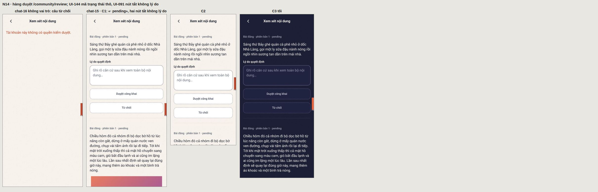 (hàng `TC-N14-DUYET-HANG`, `TC-N14-DUYET-BL`; bố cục ở C2, C3 đạt: `TC-N14-DUYET-BASE`) |
| Source | `apps/mobile/src/rudi/community/Review.tsx:47`: in thẳng `item.status`. Hàng lấy cả `pending` lẫn `review` (`services/core/internal/community/moderation.go:237`) |
| Hậu quả | Người duyệt đọc mã máy; muốn phân biệt hai trạng thái vào hàng (`pending`, `review`) thì phải biết mã |
| Đề xuất sửa | Nhãn tiếng Việt cho từng trạng thái (ví dụ `pending` → «Chờ duyệt», `review` → «Cần xem lại») |
| Tiêu chí gỡ | `--chi duyet`: dòng chú thích không còn mã trạng thái thô |
| Trạng thái sửa · Retest | chưa sửa · không áp dụng |

### UI-145 · Không có trạng thái rỗng: tìm không ra, và «Điều mình muốn giữ» khi chưa có ghi chép

| Trường | Nội dung |
|---|---|
| Category / Severity | UX ISSUE (thiếu trạng thái rỗng) · **P3** |
| Feature / Screen / Layer | N14 · `/community/search`, `/community/keeps` |
| Nền tảng, cấu hình | web, C1 |
| Điều kiện | Từ khoá không khớp chủ đề hay người nào (chat-1 gõ «zzzq»); người chưa có ghi chép riêng nào (chat-0: ghi chép tới từ Nếp, mà Nếp không có AI) |
| Tái hiện | Tìm «zzzq». Mở «Điều mình muốn giữ» từ sheet «Bảng tin của bạn» |
| Expected | Một câu nói không tìm thấy và gợi ý thử từ khác; «Điều mình muốn giữ» nói ghi chép tới từ đâu |
| Actual | Tìm: «Tìm một điều thú vị · Chủ đề hoặc người chia sẻ», rồi hai tiêu đề «Chủ đề» và «Người chia sẻ» với 0 mục mỗi bên, không câu nào. «Điều mình muốn giữ»: tiêu đề và «Những ghi chép riêng của bạn. Chỉ mình bạn đọc được.», không gì dưới đó |
| Evidence |  (hàng `TC-N14-TIM-RONG`, `TC-N14-GIU`; đạt: `TC-N14-TIM` C1, C2, `TC-N14-TIM-NGUOI`) |
| Source | `apps/mobile/src/rudi/community/Search.tsx`, `Keeps.tsx`: vẽ danh sách, không có nhánh rỗng |
| Hậu quả | Người tìm không biết là không có kết quả hay kết quả chưa tải; «Điều mình muốn giữ» trống không nói cách có ghi chép đầu tiên |
| Đề xuất sửa | Thêm nhánh rỗng cho cả hai màn |
| Tiêu chí gỡ | `--chi phu:tim,phu:cua-toi`: hai màn có câu trạng thái rỗng |
| Trạng thái sửa · Retest | chưa sửa · không áp dụng |

### UI-146 · Trang chủ đề không có «Quay lại» trên màn, và không theo dõi được chủ đề tại chỗ

| Trường | Nội dung |
|---|---|
| Category / Severity | UX ISSUE (điều hướng) · **P3** |
| Feature / Screen / Layer | N14 · `/community/topic?topic=…` |
| Nền tảng, cấu hình | web, C1: chỉ có Back trình duyệt. Native: route stack có Back hệ thống ở Android, vuốt ở iOS (STATIC) |
| Điều kiện | Mở một chủ đề từ thẻ bài hay từ trang tìm |
| Tái hiện | Tìm «cà» → chạm chủ đề «cà phê» |
| Expected | Như mọi màn đẩy lên khác của Cộng đồng: có «Quay lại» trên màn. Trạng thái rỗng của «Đang theo dõi» mời «Theo dõi tác giả hoặc chủ đề bạn thích», nên trang của chính chủ đề nên có nút theo dõi |
| Actual | Tới `/community/topic?topic=cà phê`: tiêu đề «cà phê», 1 thẻ, và hàng tab «Dành cho bạn / Đang theo dõi / Thịnh hành» của bảng tin chính. Không có «Quay lại» trên màn; không có nút theo dõi chủ đề (nút đó chỉ ở trang tìm) |
| Evidence |  (hàng `TC-N14-CHU-DE`) |
| Source | `apps/mobile/app/community/topic.tsx` chỉ export lại `CommunityScreen`: màn bảng tin, không có `TopBar`, với `params.topic` làm tiêu đề. Các màn đẩy lên khác của Cộng đồng đều có `TopBar` (`Search.tsx`, `Notifications.tsx`, `Keeps.tsx`, `Review.tsx`, `PostDetail.tsx`, `Composer.tsx`). Theo dõi chủ đề chỉ có ở `Search.tsx` |
| Hậu quả | Trên web chỉ về được bằng Back trình duyệt. Màn trông như tab Cộng đồng với tiêu đề khác, dễ tưởng đã ở màn chính. Muốn theo dõi chủ đề đang xem thì phải quay lại trang tìm |
| Đề xuất sửa | Màn chủ đề có `TopBar` («Quay lại») và nút theo dõi chủ đề |
| Tiêu chí gỡ | `--chi phu:tim`: `TC-N14-CHU-DE` có «Quay lại» và nút theo dõi trên trang chủ đề |
| Trạng thái sửa · Retest | chưa sửa · không áp dụng |

### UI-147 · Thông báo không nói ai nhắc mình; lối vào chỉ nằm trong sheet cài đặt bảng tin

| Trường | Nội dung |
|---|---|
| Category / Severity | UX ISSUE (chữ, lối vào) · **P3** |
| Feature / Screen / Layer | N14 · `/community/notifications` («Có người nhớ đến bạn») · dòng thông báo; lối vào từ sheet «Bảng tin của bạn» |
| Nền tảng, cấu hình | web, C1; API |
| Điều kiện | chat-0 tag chat-1 trong một trả lời, trả lời được duyệt |
| Tái hiện | chat-1 mở sheet «Bảng tin của bạn» → «Thông báo» |
| Expected | Dòng thông báo nói ai nhắc và ở bài nào (tên, vài chữ của bài); có dấu hiệu ở chỗ dễ thấy khi có thông báo mới |
| Actual | Một dòng: «Bạn được nhắc trong một câu chuyện · 1 phút». Chạm vào tới đúng bài. API chỉ trả mã, bài, loại (`mention`) và thời điểm. Không có dấu hiệu ở tab hay ở đầu bảng tin; lối vào duy nhất là mục cuối của sheet cài đặt |
| Evidence |  (hàng `TC-N14-THONG-BAO`) |
| Source | `apps/mobile/src/rudi/community/Notifications.tsx:38`: một câu cố định cho mọi dòng, không đọc `kind`. `services/core/internal/community/social.go:346`: câu đọc thông báo không lấy người tạo ra nó |
| Hậu quả | Khi có nhiều thông báo, mọi dòng giống hệt nhau, phải mở từng bài mới biết chuyện gì. Không có dấu hiệu, nên người được nhắc có thể không bao giờ thấy |
| Đề xuất sửa | API trả thêm người nhắc và đoạn đầu của bài; câu theo `kind`; dấu đếm ở tab Cộng đồng hoặc ở nút cài đặt bảng tin |
| Tiêu chí gỡ | `--chi phu:thong-bao`: dòng thông báo có tên người nhắc; có lối vào ngoài sheet cài đặt |
| Trạng thái sửa · Retest | chưa sửa · không áp dụng |

### UI-148 · Đọc bình luận lỗi: có câu, không có «Thử lại»

| Trường | Nội dung |
|---|---|
| Category / Severity | UX ISSUE (không có lối phục hồi) · **P3** |
| Feature / Screen / Layer | N14 · `/community/posts/[id]` · khu bình luận |
| Nền tảng, cấu hình | web, C1; lần đọc bình luận nhận 503 chèn ở trình duyệt |
| Điều kiện | Đọc bài được, đọc bình luận hỏng (5xx, mạng) |
| Tái hiện | chat-1 mở chi tiết B1 trong lúc `GET …/comments` trả 503 |
| Expected | Câu lỗi kèm «Thử lại» cho khu bình luận, như bảng tin và chi tiết bài đang có |
| Actual | Bài hiện bình thường; khu bình luận có «Rủ Đi đang gặp sự cố nên chưa làm được việc này. Chưa có gì bị ghi sai, thử lại sau một chút.»; không có «Thử lại» ở đâu trong chi tiết bài. Muốn đọc lại phải rời bài rồi mở lại |
| Evidence |  (hàng `TC-N14-LOI-BL`; đạt: `TC-N14-LOI-BANG`, `TC-N14-LOI-OFFLINE`, `TC-N14-LOI-404`) |
| Source | `apps/mobile/src/rudi/community/Comments.tsx:71`: chỉ vẽ câu lỗi |
| Hậu quả | Một lần lỗi mạng thoáng qua để khu bình luận trống cho tới khi người dùng tự rời và mở lại bài |
| Đề xuất sửa | Thêm «Thử lại» gọi lại lần đọc bình luận |
| Tiêu chí gỡ | `--chi loi:binh-luan`: có «Thử lại», và chạm vào thì đọc lại |
| Trạng thái sửa · Retest | chưa sửa · không áp dụng |

---

## Mở rộng issue của audit gốc (đo ở N14)

Bảy issue của `docs/claude/2026-09-27/mobile-ui-audit/issues.md` gặp lại trên màn Cộng đồng. Không đánh số mới.

| Issue gốc | Gặp lại ở N14 | Hàng · ảnh |
|---|---|---|
| UI-003 (`accessibilityState` không tới DOM) | Ba tab của bảng tin có role `tab` mà không `aria-selected`; tab đang chọn chỉ khác màu chữ và gạch dưới. axe báo `aria-required-parent` (critical) ×8, cho ba tab này và các tab của thanh tab app, vì không có `tablist` bọc. Radio người đọc của form: không `aria-checked`, chỉ có chữ «Đã chọn» trong tên. Ô chọn bạn để tag: «Chat Test 02 · Đã chọn», không `aria-checked` | `TC-N14-TAB-ARIA`, `TC-N14-RONG-AXE`, `TC-N14-BANG-AXE`, `TC-N14-DANG-RADIO`, `TC-N14-BL-TAG` · [EV-N14-RONG-ghep](evidence/EV-N14-RONG-ghep.jpg) |
| UI-040 (sheet quá cao ở cửa sổ thấp) | Ở C8 (390×460), sheet «Bảng tin của bạn» và sheet «Bình luận» cao 441 (96% cửa sổ), đỉnh ở y −55: tay cầm và «Đóng bảng» ngoài cửa sổ. Mục trong sheet vẫn chạm được sau khi cuộn | `TC-N14-BANG-CAI-DAT` C8, `TC-N14-BL-SHEET` C8 · [EV-N14-BL-ghep](evidence/EV-N14-BL-ghep.jpg) |
| UI-091 (nút tắt không nói lý do) | Nút gửi của form khi trống (viền đứt), và khi chọn «Một nhóm» mà chưa chọn nhóm; «Duyệt công khai» và «Từ chối» khi lý do chưa đủ ba ký tự; nút gửi bình luận khi trống; «Đồng ý chia sẻ và gọi Nếp» khi chưa gõ yêu cầu. Khi sửa bài, hai lựa chọn người đọc tắt mà không câu nào nói vì sao | `TC-N14-DANG-NUT-TAT`, `TC-N14-DANG-NHOM`, `TC-N14-DUYET-NUT-TAT`, `TC-N14-BL-NUT-TAT`, `TC-N14-NEP-NUT-TAT`, `TC-N14-SUA-KHOA` · [EV-N14-DANG-ghep](evidence/EV-N14-DANG-ghep.jpg), [EV-N14-DUYET-ghep](evidence/EV-N14-DUYET-ghep.jpg) |
| UI-093 (tablet: trải hết bề ngang) | Form «Kể một khoảnh khắc»: ô nội dung và nút gửi rộng 720 ở C6, 912 ở C7, trong khi bảng tin giữ cột 560 | `TC-N14-DANG-TABLET` C6, C7 · [EV-N14-FORM-ghep](evidence/EV-N14-FORM-ghep.jpg) |
| UI-094 (web: trình xem ảnh không hiện ảnh) | Trình xem ảnh của bài: hộp thoại 390×844 không tên, ảnh cao 0px, chỉ thấy chữ và «Đóng»; Esc đóng được, tiêu điểm vào trong hộp thoại | `TC-N14-BANG-XEM-ANH` · [EV-N14-THE-ghep](evidence/EV-N14-THE-ghep.jpg) |
| UI-095 (câu lỗi ngoài khung nhìn) | Thích lỗi (503) ở thẻ thứ hai: lượt thích trả về như cũ (đúng), nhưng câu lỗi nằm ở y −742 đến −638, đầu danh sách, ngoài tầm nhìn | `TC-N14-LOI-THICH` · [EV-N14-PHU-ghep](evidence/EV-N14-PHU-ghep.jpg) |
| UI-096 (xoá bình luận một chạm, không hỏi) | Xoá bình luận của chính mình ở chi tiết bài: nút «Xóa» 54×48, một chạm là mất, không hỏi, không hoàn tác | `TC-N14-BL-XOA` · [EV-N14-BL-ghep](evidence/EV-N14-BL-ghep.jpg) |

---

## N15 Sổ chuyến đi / Nếp v3 (khép cuộc đi, sổ kỷ niệm; #15, ADR-0039)

Đo trên bản web export của main với stack thứ hai. Stack không có khoá AI, nên với Nếp chỉ đo được nhánh lỗi; sổ đo ở đây dựng
bằng «Tự xếp trang, không gửi AI». Persona (seed chat-test, đọc qua API trước mọi lần ghi):
- chat-0: người tổ chức «Kèo album retest» (29–30/09), giữ một sổ chuyến đi;
- chat-1: thành viên; giữ một sổ rồi xoá nó từ link lạnh;
- chat-2: chưa có sổ, dùng cho kệ trống;
- chat-15: người duyệt Cộng đồng (cấp ở N14), duyệt bài dựng từ sổ;
- dalat-0: ngoài nhóm chat-test. Được đọc sổ công khai, không bao giờ được đọc sổ riêng tư.

Khép cuộc đi không hoàn tác được, nên phần đo trước khi khép chạy trước phần khép. Mọi lần ghi liệt kê ở `report.md` §A.

Đạt trong phạm vi đã đo (`coverage-matrix.md`, hàng `TC-N15-*`):
- **Lối vào**: người tổ chức có «Giữ lại cuộc đi» 358×48 trên màn kèo, tới `/outings/[id]/ending`. Màn của kèo chưa tới ngày
  không có lối này.
- **Khép cuộc đi** ở C1, C2, C3, C8, C6: lời mời, thẻ kèo, bộ chọn loại và «Khép cuộc đi» thấy đủ. Chạm thì sau 271 ms sang
  pha chọn chất liệu; thành viên đọc lại thấy cuộc đi đã khép.

  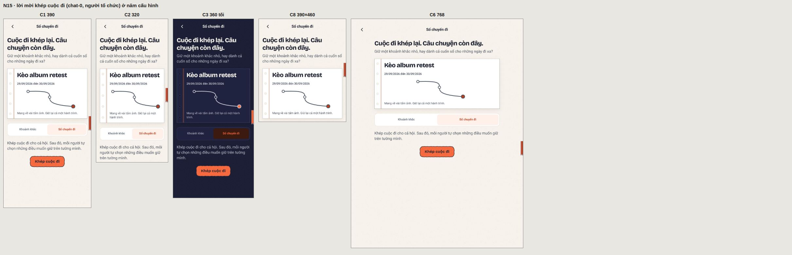
- **Chất liệu**:
  - ảnh chọn sẵn theo ngày đi («3 / 40 ảnh đã chọn»), tải được, bỏ chọn rồi chọn lại được;
  - ô trích đoạn gõ được, phần gửi Nếp đổi thành «3 ảnh · 1 trích đoạn»;
  - câu dưới ô («Chat không được tự đọc. Chỉ đoạn bạn đặt ở đây sẽ đi cùng ảnh.») đúng ranh giới AI của repo: AI chỉ nhận thứ
    được chia sẻ rõ ràng.

  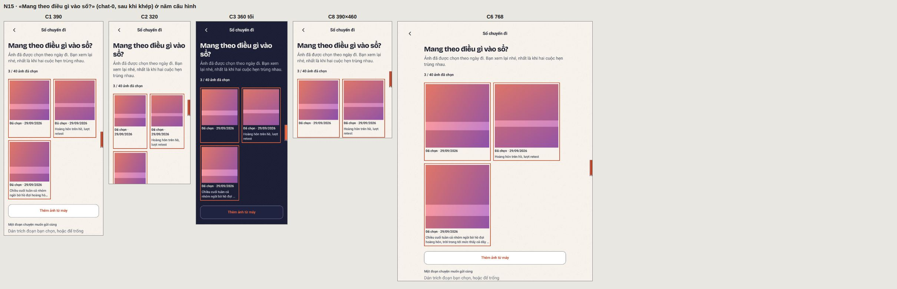
- **Dựng sổ**:
  - «Dựng sổ cùng Nếp» khi không có khoá: lúc chờ có «Quay lại»; sau 5,7 s có câu nói Nếp chưa xếp xong, chất liệu còn nguyên,
    còn lối «Tự xếp trang, không gửi AI»;
  - tự xếp: sổ nháp sau 270 ms, bốn ảnh tải được; sổ lật vào ở C1, hiện ngay ở C9.

  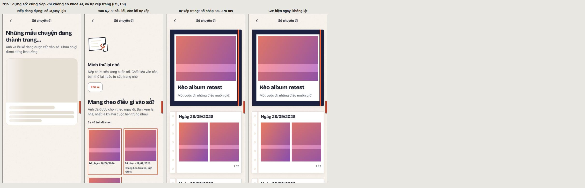
- **Sửa sổ**:
  - tên mới lên bìa;
  - sheet ảnh bìa có role dialog, tiêu điểm vào trong, Esc đóng, chọn ảnh thì đóng;
  - thêm rồi bỏ một trang, đổi chỗ hai trang; ảnh từ máy thành ô thứ tư sau 504 ms;
  - ở C2 và C3 tối không tràn, không cắt chữ.

  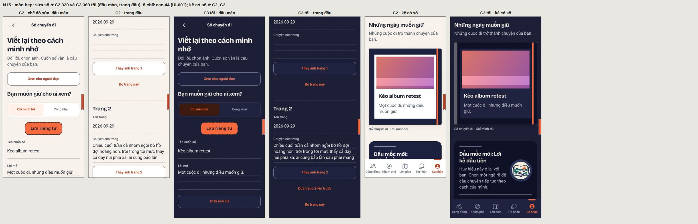
- **Lưu và kệ**: lưu riêng tư sau 267 ms («Đã giữ lại một cuộc đi.»). Kệ «Những ngày muốn giữ» có cuốn sổ «Chỉ mình tôi» và nút
  mở, ở C1, C2, C3.
- **Đọc sổ** ở C1–C3: bìa, các trang «Ngày 29/09/2026» với ảnh, nút của chủ sổ.
- **Quyền riêng tư của sổ** (ADR-0039):
  - người ngoài nhóm mở sổ riêng tư: không lộ chữ hay ảnh nào;
  - trước khi công khai có câu nói ảnh và lời sẽ ra ngoài hội. Sổ công khai thì người ngoài đọc được sổ và ảnh bìa;
  - gửi lên Cộng đồng tạo bài chờ duyệt. Duyệt xong rồi «Cất về riêng tư»: người ngoài nhận 404 cho sổ, cho ảnh bìa và cho bài
    cộng đồng dựng từ sổ.

  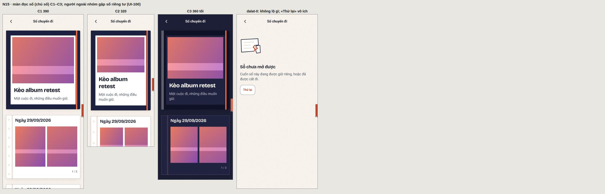

  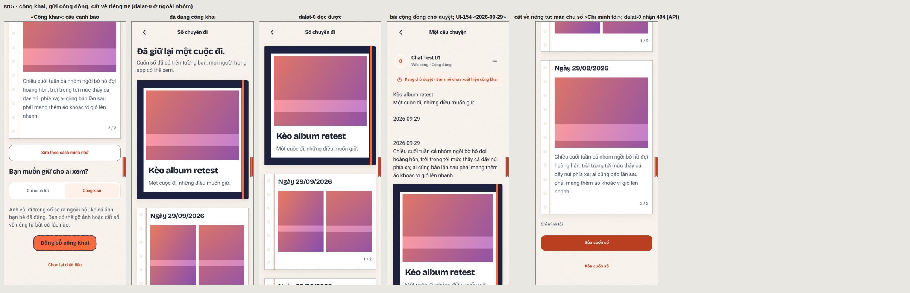
- **Xoá sổ** từ link lạnh:
  - sheet hỏi «Bỏ cuốn sổ này khỏi tường? Ảnh gốc trong hội vẫn còn…»;
  - «Giữ sổ lại» đóng mà không xoá;
  - xác nhận thì về Cá nhân, và sổ trả 404.
- **Lỗi máy chủ** (503 ở lần đọc đầu) ở màn khép và màn đọc: câu nói Rủ Đi gặp sự cố, «Thử lại» mở được màn.

Chưa đo được: native (14 hàng BLOCKED), và Nếp dựng sổ với khoá AI thật (`TC-N15-DUNG-AI-THAT`, BLOCKED).

### UI-149 · «Đã chia» của album tính theo ngày chứ không theo kèo: một khoản chi hiện ở mọi kèo trùng ngày

| Trường | Nội dung |
|---|---|
| Category / Severity | BUG (số tiền hiện sai chỗ) · **P2** |
| Feature / Screen / Layer | N15 (quan sát Q4) · `/groups/[id]/album`, kệ album; `/settlements/[id]`, hero quyết toán của nhóm · `GET /contexts/{id}/albums`, `GET /contexts/{id}/recap` (LIVE-GO; bản Python còn chạy và là oracle) |
| Nền tảng, cấu hình | API trên stack thứ hai (RUNTIME); kệ album và hero quyết toán, web C1. Native gọi cùng API (STATIC) |
| Điều kiện | Nhóm có hai kèo mà khoảng ngày chồng nhau (một kèo một ngày trong một chuyến hai ngày, hay hai kèo cùng ngày), và một khoản chi có ngày rơi vào phần chồng |
| Tái hiện | 1. Nhóm chat-test có một khoản chi ngày 29/09 (tổng phân bổ 13.705.678đ, ghi ở F04) và «Kèo album retest» 29–30/09. 2. chat-0 tạo «Kèo trùng ngày kiểm tổng» ngày 29/09, không chi gì, không ảnh. 3. Mở kệ album của nhóm; đọc hai API trên |
| Expected | Mỗi khoản chi thuộc đúng một kèo, hoặc không kèo nào. «Đã chia» của các kèo cộng lại không vượt tổng chi của nhóm |
| Actual | API: cả hai kèo `split_total_vnd` 13.705.678, `expense_count` 1. Recap: «đã xong» có «Kèo trùng ngày kiểm tổng» 13.705.678đ, «đang đi» có «Kèo album retest» 13.705.678đ. Kệ album: hai hàng cùng ghi «3 ảnh · 0 chỗ đã tới · 0 check-in · đã chia 13.705.678đ», dù kèo vừa tạo không có ảnh hay khoản chi nào của riêng nó. Số ảnh cũng tính theo ngày. Riêng với ảnh, màn chọn chất liệu của sổ nói rõ «Ảnh đã được chọn theo ngày đi. Bạn xem lại nhé, nhất là khi hai cuộc hẹn trùng nhau.»; với tiền thì không có bước xem lại nào. Kệ chỉ ghi năm «2026»: đó là UI-103. Đo lại ngày 01/10, khi «Kèo album retest» đã xong (`TC-N15-Q4-HERO`): recap ghi cả hai kèo trong «đã xong», mỗi kèo 13.705.678đ, tổng 27.411.356đ; hero quyết toán của nhóm ghi «2 chuyến đã kết thúc (20 người) · Số này tính lại từ sổ mỗi lần mở · 27.411.356đ», trong khi cả nhóm chỉ có một khoản chi 13.705.678đ |
| Evidence |  (hàng `TC-N15-Q4-API`, `TC-N15-Q4-KE`)  (hàng `TC-N15-Q4-HERO`; nhãn tên chồng nhau trong sơ đồ là UI-054) |
| Source | `services/core/internal/repo/recap.go:127`: khoản chi nối vào kèo bằng `on_date BETWEEN outings.starts_on AND outings.ends_on`, trong cùng nhóm. `:160`: kỷ niệm (ảnh) nối cùng cách. Bảng `expenses` không có cột kèo. Oracle Python làm y hệt: `services/api/app/api/repository.py:3012` (tiền), `:3029` (kỷ niệm). `routes.json`: `/contexts/{context_id}/albums` và `/recap` là LIVE-GO, `python: live`. Parity so Go với Python nên vẫn xanh trong khi cả hai cùng cộng trùng; bản sửa phải đi qua cả hai. App: `src/rudi/doc-live.ts:126` (`tongTuRecap`) lấy tổng của kèo đang đi đầu tiên, không thì tổng các kèo đã xong; `screens/Bill.tsx:464` đưa số đó lên hero quyết toán |
| Hậu quả | Người trong nhóm đọc album thấy nhiều kèo cùng «đã chia» một khoản, và cộng lại nhiều hơn số cả nhóm đã chi. Từ khi cả hai kèo đã xong, hero quyết toán của nhóm hiện 27.411.356đ, gấp đôi khoản chi thật (RUNTIME, `TC-N15-Q4-HERO`; ở checkpoint N15 phần này còn là giả thuyết suy từ mã). Sổ cái và số dư không bị ảnh hưởng; sai nằm ở con số đọc ra. Còn lối đọc đúng (Tài chính, quyết toán theo sổ), nên là P2 |
| Đề xuất sửa | Gắn khoản chi với kèo lúc ghi (cột kèo trên khoản chi, hoặc bảng nối). Hoặc khi hai kèo chồng ngày thì chỉ tính một lần và nói rõ trên màn. Đây là đổi mô hình dữ liệu của tiền, nên theo quy trình của repo mở ADR trước. Sửa cả Go lẫn oracle Python; thêm ca kèo chồng ngày vào parity và vào tầng PostgreSQL thật |
| Tiêu chí gỡ | `n15-nhat-ky.mjs --chi q4`: tổng `split_total_vnd` của các kèo trong nhóm không vượt tổng phân bổ của nhóm; kèo không có khoản chi nào của riêng nó ghi 0đ; kệ album không ghi cùng một khoản ở hai kèo. `--chi q4:hero`: hero quyết toán của nhóm không vượt tổng chi của nhóm |
| Trạng thái sửa · Retest | chưa sửa · không áp dụng |

### UI-150 · Lưu sổ lỗi: nút thôi quay, quanh nút không gì đổi; câu lỗi nằm ở đầu màn, trên hơn một nghìn điểm ảnh

| Trường | Nội dung |
|---|---|
| Category / Severity | UX ISSUE (câu lỗi ngoài tầm nhìn) · **P2** (cùng họ UI-051, UI-095) |
| Feature / Screen / Layer | N15 · `/outings/[id]/ending`, sổ nháp · nút «Lưu riêng tư» / «Đăng sổ công khai», `ErrorState` của màn; `PUT /outings/{id}/diary` (LIVE-GO, không có bản Python) |
| Nền tảng, cấu hình | web, C1; máy chủ trả 503 cho `PUT` (giả lập bằng `route()`). Native: cùng mã (STATIC) |
| Điều kiện | Lưu sổ khi máy chủ lỗi. Nút lưu nằm dưới cuốn sổ, nên lúc chạm màn đã cuộn xuống |
| Tái hiện | 1. chat-0 tự xếp trang, cuộn tới «Lưu riêng tư». 2. `PUT` trả 503. 3. Chạm «Lưu riêng tư» |
| Expected | Câu lỗi hiện gần nút vừa chạm, hoặc màn cuộn tới câu và dời tiêu điểm vào đó |
| Actual | Lúc chạm, nút ở y 688 và màn đã cuộn 1217. Sau khi chạm, quanh nút không có gì đổi. Câu «Mình thử lại nhé · Rủ Đi đang gặp sự cố nên chưa làm được việc này. Chưa có gì bị ghi sai, thử lại sau một chút.» và «Thử lại» nằm ở y −1139 đến −811, trên đầu màn. Bản nháp còn nguyên (đạt) |
| Evidence | 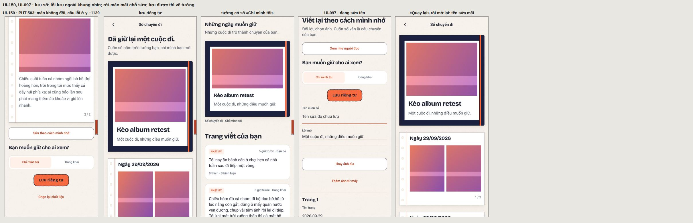 (hàng `TC-N15-LUU-LOI`) |
| Source | `apps/mobile/src/rudi/diary/EndingScreen.tsx:111`: `error` của mọi thao tác vẽ thành `ErrorState` ngay dưới `TopBar`, đầu phần cuộn. `keep()` (`:67–71`) chỉ gọi `report(e)`: không cuộn, không dời tiêu điểm |
| Hậu quả | Người giữ sổ chạm «Lưu», thấy nút thôi quay và nghĩ đã lưu. Nháp chưa lưu chỉ nằm trong state của màn (đọc mã), nên rời màn là mất; phần rời màn đã đo với bản sửa ở UI-097 |
| Đề xuất sửa | Đặt câu lỗi của thao tác lưu ngay dưới nút lưu, hoặc cuộn tới `ErrorState` và dời tiêu điểm vào đó (cùng đề xuất với UI-051, UI-095) |
| Tiêu chí gỡ | `--chi luu:loi`: câu lỗi nằm trong cửa sổ ngay sau khi chạm «Lưu riêng tư» |
| Trạng thái sửa · Retest | chưa sửa · không áp dụng |

### UI-151 · Kèo chưa tới ngày: máy chủ nói «khép được», màn mời «Khép cuộc đi», chạm thì bị từ chối kèm «Thử lại»

| Trường | Nội dung |
|---|---|
| Category / Severity | BUG (máy chủ mời một việc chính nó từ chối) · **P2** |
| Feature / Screen / Layer | N15 · `/outings/[id]/ending`, pha khép · `GET /outings/{id}/ending` (`can_end`), `POST /outings/{id}/ending` (LIVE-GO, không có bản Python) |
| Nền tảng, cấu hình | API trên stack thứ hai (RUNTIME); web C1. Native: cùng API, cùng màn (STATIC) |
| Điều kiện | Người tổ chức mở màn khép của một kèo chưa bắt đầu. Màn kèo không có lối vào (`TC-N15-VAO-SAP-TOI` đạt), nên đường tới là link: link cũ, link được gửi, lịch sử trình duyệt |
| Tái hiện | 1. chat-0 mở `/outings/<id>/ending` của «Kèo retest 2 ngày chưa có chặng» (24–25/10). 2. Chạm «Khép cuộc đi» |
| Expected | Kèo chưa bắt đầu thì `can_end` là false (hoặc có lý do đi kèm); màn nói «Cuộc đi còn ở phía trước…» thay cho nút, và không có «Thử lại» |
| Actual | `GET` trả `can_end=true` cho cả kèo 29–30/09 lẫn kèo 24–25/10; `diary-sources` của kèo 24–25/10 trả 409 `outing_not_ended`. Màn vẽ đủ lời mời và nút «Khép cuộc đi». Chạm thì `POST` trả 409 `outing_not_started`; màn hiện «Mình thử lại nhé · Cuộc đi còn ở phía trước. Mình giữ trang cuối cho hôm trở về nhé.» với «Thử lại», lời mời khép vẫn ở bên dưới. «Thử lại» gửi lại đúng yêu cầu đó (`retry.current = close`), nên chỉ có thể ra lại 409 cho tới 24/10 (đọc mã) |
| Evidence | 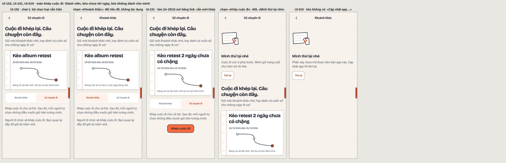 (hàng `TC-N15-API`, `TC-N15-KHEP-SAP-TOI`) |
| Source | `services/core/internal/diary/handler.go:166`: `CanEnd` chỉ xét vai trò (người lập kèo, thành viên cặp đôi, hoặc quản trị khi người lập đã rời). `:242–245`: `POST` từ chối 409 `outing_not_started` khi `starts_on` sau hôm nay (giờ Việt Nam); `GET` (`readEnding`, `:181`) không xét ngày. App: `apps/mobile/src/rudi/diary/EndingScreen.tsx:123` vẽ nút khi `can_end`; `:51` đặt `retry.current = close`; `diary/api.ts:15` có câu riêng cho `outing_not_started`, tức app biết ca này nhưng chỉ biết sau khi đã chạm |
| Hậu quả | Người tổ chức được mời làm một việc chưa thể làm, rồi nhận câu lỗi trình bày như trục trặc tạm («Mình thử lại nhé») kèm «Thử lại» không bao giờ thành. Máy chủ từ chối nên không có dữ liệu sai |
| Đề xuất sửa | `can_end` xét cả ngày bắt đầu (hoặc thêm trường lý do); màn hiện câu «Cuộc đi còn ở phía trước…» thay cho nút; với 409 `outing_not_started` thì không có «Thử lại» |
| Tiêu chí gỡ | Trên một kèo chưa tới ngày, `--chi api,khep-truoc`: `can_end` false hoặc có lý do; màn không có «Khép cuộc đi», không có «Thử lại» |
| Trạng thái sửa · Retest | chưa sửa · không áp dụng |

### UI-152 · Thành viên không khép được cuộc đi nhưng vẫn thấy bộ chọn «Khoảnh khắc | Sổ chuyến đi»; chạm thì đổi tiêu đề mà không có tác dụng

| Trường | Nội dung |
|---|---|
| Category / Severity | UX ISSUE · **P3** |
| Feature / Screen / Layer | N15 · `/outings/[id]/ending`, pha khép, người không có quyền khép · bộ chọn loại |
| Nền tảng, cấu hình | web, C1. Native: cùng mã (STATIC) |
| Điều kiện | Thành viên thường (không lập kèo, không phải quản trị thay người lập đã rời) mở màn khép trước khi người tổ chức khép |
| Tái hiện | 1. chat-1 mở `/outings/<id>/ending` của «Kèo album retest» trước khi khép. 2. Chạm «Khoảnh khắc» |
| Expected | Không có bộ chọn, hoặc bộ chọn tắt kèm lý do; màn nói người tổ chức sẽ chọn |
| Actual | Không có nút «Khép cuộc đi»; câu «Người tổ chức sẽ khép cuộc đi. Bạn quay lại đây để giữ kỷ niệm nhé.» nằm dưới một bộ chọn loại vẫn bấm được. Chạm «Khoảnh khắc»: thanh đầu đổi «Sổ chuyến đi» thành «Khoảnh khắc», câu trên thẻ đổi thành «Không cần đi xa mới có một ngày đáng nhớ.»; không gì được gửi đi |
| Evidence |  (hàng `TC-N15-KHEP-THANH-VIEN`) |
| Source | `apps/mobile/src/rudi/diary/EndingScreen.tsx:121`: `Segmented` luôn vẽ; `:123`: chỉ có nút phụ thuộc `can_end`; `:110`, `:119`: tiêu đề và câu theo `kind` cục bộ. Loại chỉ đi lên máy chủ trong `POST` của người tổ chức (`:51`) |
| Hậu quả | Thành viên tưởng mình đã chọn loại sổ. Khi người tổ chức khép bằng loại khác, màn đổi theo mà không giải thích |
| Đề xuất sửa | Ẩn bộ chọn khi `can_end` false, hoặc hiện loại được gợi ý dưới dạng chữ |
| Tiêu chí gỡ | Trên một kèo chưa khép, một thành viên thường ở màn khép: không có bộ chọn bấm được, hoặc bộ chọn tắt kèm lý do |
| Trạng thái sửa · Retest | chưa sửa · không áp dụng |

### UI-153 · Kệ «Những ngày muốn giữ» khi chưa có sổ: một câu bảo mở cuộc đi đã qua, không có hành động nào

| Trường | Nội dung |
|---|---|
| Category / Severity | UX ISSUE · **P3** |
| Feature / Screen / Layer | N15 · tab Cá nhân `/profile` (và tường `/people/[id]` của chính mình) · kệ «Những ngày muốn giữ» |
| Nền tảng, cấu hình | web, C1, C2, C3. Native: cùng mã (STATIC) |
| Điều kiện | Người chưa giữ cuốn sổ nào (chat-2) |
| Tái hiện | chat-2 mở tab Cá nhân, cuộn tới kệ |
| Expected | DESIGN.md, mục «Trạng thái rỗng, tải, lỗi»: `EmptyState` gồm `h2`, một câu, **một** hành động (và một cửa phụ). Ở đây hành động tự nhiên là tới kèo gần nhất đã xong, hoặc tới danh sách kèo |
| Actual | «Những ngày muốn giữ · Những cuộc đi trở thành chuyện của bạn. · Cuộc đi khép lại, một trang mới sẽ ở đây. Mở cuộc đi đã qua để giữ khoảnh khắc đầu tiên.» Trong kệ không có nút hay link nào, ở cả ba cấu hình. Câu bảo mở một cuộc đi đã qua mà không nói ở đâu; lối đã đo là màn kèo → «Giữ lại cuộc đi» (`TC-N15-VAO-KEO`) |
| Evidence | 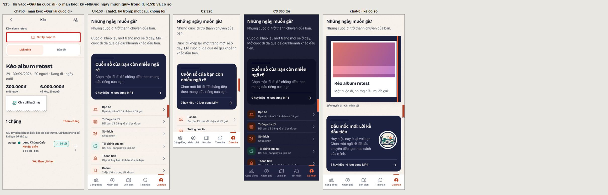 (hàng `TC-N15-TUONG-RONG` C1–C3) |
| Source | `apps/mobile/src/rudi/diary/Wall.tsx:24`: nhánh rỗng chỉ là một `Text` |
| Hậu quả | Người mới không biết bắt đầu cuốn sổ đầu tiên từ đâu |
| Đề xuất sửa | Dùng `EmptyState` với một nút tới kèo gần nhất đã xong (hoặc danh sách kèo) |
| Tiêu chí gỡ | `--chi vao:chat-2:C1` (và C2, C3): kệ trống có đúng một hành động dẫn tới chỗ bắt đầu cuốn sổ |
| Trạng thái sửa · Retest | chưa sửa · không áp dụng |

### UI-154 · Tên trang của sổ tự xếp là ngày dạng máy «2026-09-29», trong ô sửa và trong bài Cộng đồng; màn đọc thì ghi «Ngày 29/09/2026»

| Trường | Nội dung |
|---|---|
| Category / Severity | UX ISSUE · **P3** (cùng họ UI-104) |
| Feature / Screen / Layer | N15 · `/outings/[id]/ending`, chế độ sửa (ô «Tên trang»); bài Cộng đồng dựng từ sổ (`/community/posts/[id]`) |
| Nền tảng, cấu hình | web, C1 (ô sửa, bài), C2 và C3 (ô sửa). Native: cùng dữ liệu (STATIC) |
| Điều kiện | Sổ dựng bằng «Tự xếp trang, không gửi AI». Tên trang do Nếp đặt chưa đo được (không có khoá AI) |
| Tái hiện | 1. Tự xếp trang. 2. «Sửa theo cách mình nhớ», đọc ô «Tên trang». 3. Công khai sổ, gửi lên Cộng đồng, mở bài |
| Expected | Tên trang là chữ người đọc được, cùng kiểu với màn đọc («Ngày 29/09/2026») |
| Actual | Ô «Tên trang» của cả hai trang ghi «2026-09-29»; màn đọc hiện «Ngày 29/09/2026». Thân bài Cộng đồng dựng từ sổ có hai dòng «2026-09-29» |
| Evidence | 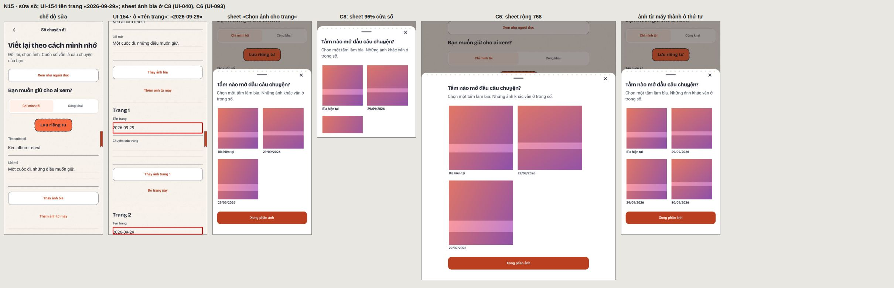  (hàng `TC-N15-TRANG-TEN`; ghi chú của `TC-N15-GUI-CONG-DONG`) |
| Source | `services/core/internal/domain/diary/diary.go:85`: bố cục tay đặt `Heading: s.Photos[i].Day` (ngày ISO). `apps/mobile/src/rudi/diary/BookView.tsx:35`: màn đọc đổi chuỗi dạng `YYYY-MM-DD` thành «Ngày …» chỉ lúc vẽ; ô sửa hiện giá trị thô. `services/core/internal/community/diary.go:163`: thân bài ghép `page.Heading` thô |
| Hậu quả | Người giữ sổ gặp một định dạng máy trong đúng ô được mời sửa; người đọc Cộng đồng thấy nó trong bài công khai. Lệch với «29/09» ở mọi chỗ khác của app |
| Đề xuất sửa | Bố cục tay ghi tên trang bằng chữ («Ngày 29/09/2026») ngay trong tài liệu, hoặc dùng cùng một hàm định dạng cho ô sửa và cho thân bài |
| Tiêu chí gỡ | `--chi sua:C1`: `TC-N15-TRANG-TEN` không có ô nào ghi dạng `YYYY-MM-DD`; bài Cộng đồng dựng từ sổ không có dòng ngày dạng máy |
| Trạng thái sửa · Retest | chưa sửa · không áp dụng |

---

## Mở rộng issue của audit gốc (đo ở N15)

Tám issue của `docs/claude/2026-09-27/mobile-ui-audit/issues.md` gặp lại trên màn sổ chuyến đi. Không đánh số mới.

| Issue gốc | Gặp lại ở N15 | Hàng · ảnh |
|---|---|---|
| UI-001 (ô nhập một dòng 44dp) | Chế độ sửa sổ: «Tên cuốn sổ» và các ô «Tên trang» cao 44 (288×44 ở C2, 328×44 ở C3). Ngoài ba ô này không vùng chạm nào dưới 48 | `TC-N15-O-NHAP-44` C2, C3 · [EV-N15-HEP-ghep](evidence/EV-N15-HEP-ghep.jpg) |
| UI-003 (`accessibilityState` không tới DOM) | Ô ảnh ở màn chất liệu là checkbox mà không có `aria-checked`. Ô ảnh ở sheet ảnh bìa là radio mà không có `aria-checked`; ảnh bìa đang dùng chỉ khác bằng dòng «Bìa hiện tại» | `TC-N15-NGUON-ARIA`, `TC-N15-BIA-RADIO` · [EV-N15-NGUON-ghep](evidence/EV-N15-NGUON-ghep.jpg), [EV-N15-SUA-ghep](evidence/EV-N15-SUA-ghep.jpg) |
| UI-019 (404 báo thành «Cập nhật app») | Màn khép mở cho một kèo không dành cho mình (dalat-0, ngoài nhóm) hay không còn tồn tại (chat-0, id ngẫu nhiên): máy chủ trả 404 `outing_not_found`, màn nói «Phần này chưa mở được trên bản app này. Cập nhật app rồi thử lại.» kèm «Thử lại» | `TC-N15-KHEP-404` · [EV-N15-KHEP-LOI-ghep](evidence/EV-N15-KHEP-LOI-ghep.jpg) |
| UI-040 (sheet quá cao ở cửa sổ thấp) | Ở C8 (390×460), sheet chọn ảnh («Tấm nào mở đầu câu chuyện?») cao 441, tức 96% cửa sổ, đỉnh ở y 19 | `TC-N15-SUA-CO` C8 · [EV-N15-SUA-ghep](evidence/EV-N15-SUA-ghep.jpg) |
| UI-093 (tablet: trải hết bề ngang) | Ở C6 (768), sheet chọn ảnh rộng 768, trong khi cột nội dung của màn sửa (ô «Tên cuốn sổ») rộng 560 | `TC-N15-SUA-CO` C6 · [EV-N15-SUA-ghep](evidence/EV-N15-SUA-ghep.jpg) |
| UI-097 (rời màn là mất phần đang soạn, không hỏi) | Đang sửa tên sổ, chạm «Quay lại»: không hỏi, về màn kèo. Mở lại thì tên đang sửa đã mất; máy chủ vẫn giữ tên cũ | `TC-N15-ROI-MAT-SUA` · [EV-N15-LUU-ghep](evidence/EV-N15-LUU-ghep.jpg) |
| UI-100 («Thử lại» vô ích với nội dung không dành cho mình) | Người ngoài nhóm mở sổ riêng tư: không lộ gì (đạt), nhưng khối «Sổ chưa mở được» có «Thử lại»; chạm thì ra lại đúng khối đó | `TC-N15-DOC-NGOAI-THU-LAI` · [EV-N15-DOC-ghep](evidence/EV-N15-DOC-ghep.jpg) |
| UI-121 (đăng nhập từ deep link không quay về link đó) | Không phiên, mở link sổ `/diaries/[id]` hay màn khép `/outings/[id]/ending`: về `/welcome` (link chat thì về `/login`). Đăng nhập bằng UI từ đó thì tới `/explore`, mất cuốn sổ. Nguồn: `app/diaries/[id].tsx:7`, `app/outings/[id]/ending.tsx:7` (`<Redirect href="/welcome" />`, không mang đường dẫn gốc) | `TC-N15-KHONG-PHIEN` · [EV-N15-XOA-ghep](evidence/EV-N15-XOA-ghep.jpg) |

---

## N21 Hồ sơ kể chuyện: sổ hành trình, huy hiệu trưng bày, tường cá nhân v2 (#658, `03-profile-story-social.md`)

Đo trên bản web export của main với stack thứ hai. Thiết kế đọc đối chiếu: `docs/architecture/03-profile-story-social.md`.
Stack không có khoá AI và chưa nối worker dựng MP4. Persona (seed chat-test, đọc qua API trước mọi lần ghi):
- chat-0: chủ sổ hành trình và chủ tường; ba huy hiệu mở đầu (check-in, ảnh, bài kể) có từ các lượt trước;
- chat-1: bạn của chat-0. Bình luận, trả lời, thích, đăng lại;
- chat-16: cùng nhóm với chat-0, không là bạn;
- chat-17: bạn của chat-1 (kết bạn trong lượt đo), không là bạn của chat-0. Dùng để kiểm quyền xem bài gốc của bài đăng lại;
- dalat-0: ngoài nhóm chat-test, người lạ.

Phần ghi chạy sau 0 giờ 01/10 giờ Việt Nam, để bài kể mới rơi vào ngày kể thứ ba. Mọi lần ghi liệt kê ở `report.md` §A.

Đạt trong phạm vi đã đo (`coverage-matrix.md`, hàng `TC-N21-*`):
- **Quyền xem huy hiệu** (API và màn):
  - bạn và người cùng nhóm thấy đúng ba huy hiệu chủ hồ sơ chọn; không thấy tiến độ, nhánh hay lượt MP4;
  - người lạ nhận 403 `person_not_visible`, màn không lộ gì.

  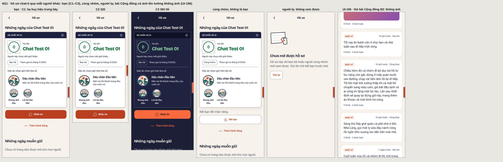
- **Sổ hành trình** ở C1, C3, C6:
  - bìa, khối «MỚI MỞ», bản đồ bốn tuyến, thẻ ngã rẽ có tiến độ, «Nếp nhìn đường đi», «Dấu ấn đã giữ» thấy trọn;
  - mọi mẫu sáng tạo ghi «Mẫu sáng tạo sắp dùng được: …». Đúng thiết kế: không quảng cáo mẫu chưa nối như quyền đã dùng được;
  - mỗi tuyến hiện hai ngã rẽ của nó; tuyến «Ngã rẽ» nói cần một kết trước.

  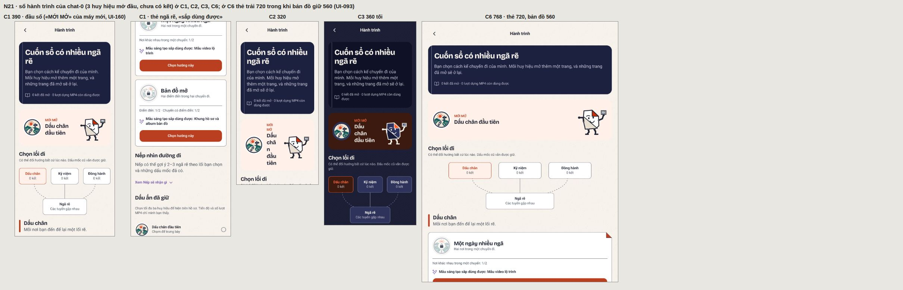
- **Chọn và nhận kết**:
  - bài «Bạn bè» có ảnh của chat-0 là bài kể ở ngày thứ ba, đưa «Chuyện mình kể» lên 3/3;
  - «Chọn hướng này» đổi thành «Nhận kết này». Nhận thì máy chủ ghi kết và cấp 1 lượt MP4;
  - bìa thành «1 kết đã mở · 1 lượt dựng MP4 còn dùng được»; thẻ thành «Đã ghi vào sổ», tắt kèm lý do «Kết này đã ghi vào sổ.»;
  - khoảnh khắc «MỚI MỞ Chuyện mình kể» (Nếp M8) hiện ngay sau khi nhận; tải lại thì không lặp.
- **Nếp, khi không có khoá AI**:
  - «Xem Nếp sẽ nhận gì» liệt kê đúng thứ sẽ gửi: chỉ số đếm và mã ngã rẽ. Không gửi ảnh, nội dung bài, danh tính bạn đồng hành,
    chat hay vị trí; mỗi lần hỏi phải đồng ý lại;
  - thân yêu cầu app gửi chỉ có `{"consent":true}`;
  - không có khoá thì sổ tự gợi ý ba ngã rẽ, nói rõ «Nếp đang vắng. Sổ đã gợi ý từ tiến độ thật của bạn.».

  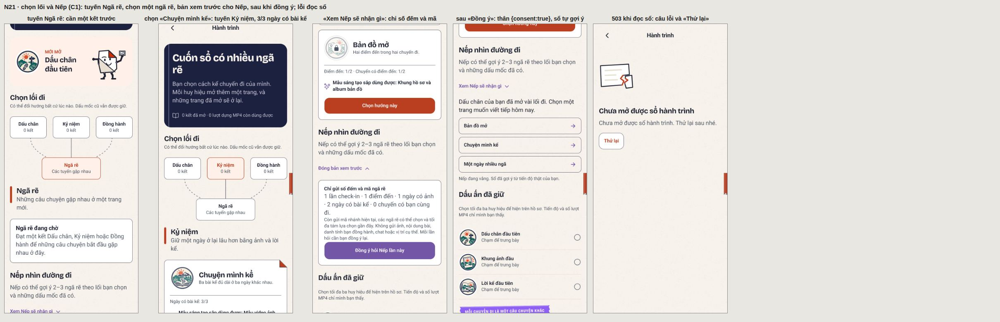
- **Trưng bày**: chạm ba huy hiệu thì cả ba thành «Trên hồ sơ»; máy chủ lưu đúng ba.
- **Lối vào từ tab Cá nhân** ở C1–C3: thẻ «Dấu mốc mới» nói đúng số huy hiệu và lượt MP4 của máy chủ; chạm thì tới sổ.
- **Trang viết cũ** (`/posts/[id]`) ở C1–C3:
  - bình luận gốc, lời đáp lùi một bậc (24px). Trả lời một lời đáp thì câu mới vẫn treo dưới bình luận gốc: đúng một tầng;
  - thích bình luận: máy chủ ghi, tên nút đổi thành «Bỏ thích bình luận»;
  - chạm ảnh trên tường mở ảnh toàn màn kèm khay «Lời nhắn dưới ảnh»: dialog, tiêu điểm vào trong, «Đóng ảnh» 48×48. Gửi từ khay
    thành bình luận của bài. Esc đóng hết, không còn lớp phủ.

  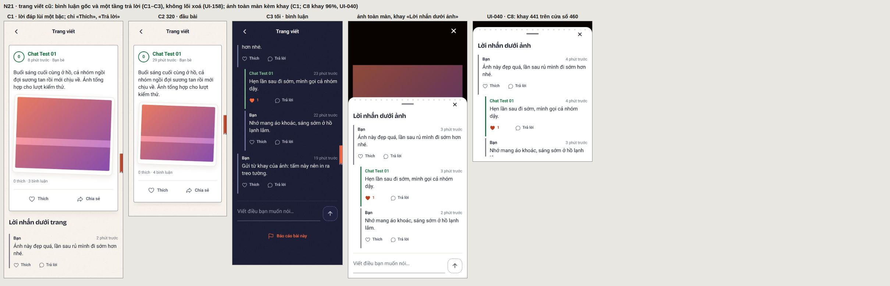
- **Chia sẻ và đăng lại**:
  - khay nói ai thấy bài đăng lại, và rằng nội dung bài gốc chỉ hiện cho người đã có quyền xem bài đó;
  - «Gửi vào chat» tắt, kèm câu chờ chat mã hoá đầu cuối;
  - chat-17 thấy bài đăng lại của chat-1, không thấy chữ hay ảnh của bài gốc «Bạn bè»: API trả trích gốc rỗng, màn ghi «Bài gốc
    không còn xem được».
- **Tường v2**:
  - trang đầu 20 bài; «Xem những trang trước» nối trang sau (23 bài), hết bài thì nút biến mất;
  - lượt thích của người khác hiện trên thẻ sau 517 ms (long poll);
  - máy chủ lỗi 25 s: tường giữ nguyên 20 thẻ, không hiện khối lỗi.

  
- **Lỗi đọc sổ** (503 ở lần đọc đầu): câu «Chưa mở được sổ hành trình», «Thử lại» mở được sổ.
- **Không phiên**: `/achievements` ra bản demo có nhãn «Demo» (tên trợ năng «Dữ liệu demo»); không lộ dữ liệu của ai.

Chưa đo được: native (8 hàng BLOCKED); Nếp với khoá AI thật (`TC-N21-NEP-AI-THAT`); dựng MP4, vì worker chưa nối
(`TC-N21-MP4-DUNG`). Hai hàng cuối cũng BLOCKED.

### UI-155 · Tường: mỗi lần long poll trả về, danh sách bị thay bằng trang đầu; trang vừa mở thêm biến mất dưới tay người đang đọc

| Trường | Nội dung |
|---|---|
| Category / Severity | BUG (mất nội dung đang đọc) · **P2** |
| Feature / Screen / Layer | N21 · `/people/[id]` (hồ sơ người, tường v2) · danh sách bài, «Xem những trang trước»; `GET /social/v2/people/{person_id}/posts` và `/changes` (LIVE-GO, chỉ có bản Go) |
| Nền tảng, cấu hình | web, C1. Native: cùng mã (STATIC) |
| Điều kiện | Tường có hơn 20 bài người xem đọc được, và người xem đã chạm «Xem những trang trước» |
| Tái hiện | 1. chat-0 mở tường của mình (23 bài). 2. Cuộn xuống, chạm «Xem những trang trước»: 23 thẻ. 3a. Một người khác thích một bài (một sự kiện). 3b. Hoặc không ai làm gì, chờ |
| Expected | Làm mới nền giữ các trang đã mở và chỗ đang đọc. 03-profile-story-social.md: «Client làm mới nền khi có sự kiện và đối soát mỗi lần poll hết hạn, giữ nội dung hiện tại khi mạng tạm lỗi» |
| Actual | Có sự kiện: 517 ms sau, danh sách về 20 thẻ và «Xem những trang trước» hiện lại. Vị trí cuộn vẫn 4394, nên chỗ bài đang đọc giờ là cuối trang đầu và cái nút. Không có sự kiện: sau 10,6 s, khi lượt poll đang chờ hết hạn, danh sách cũng về 20 thẻ. Khi máy chủ lỗi thì danh sách giữ nguyên (`TC-N21-DOI-LOI` đạt): chỉ lần poll thành công mới cắt |
| Evidence |  (hai khung cuối; hàng `TC-N21-TRANG-GIU`, `TC-N21-TRANG-GIU-YEN`) |
| Source | `apps/mobile/src/rudi/screens/nguoi/HoSoNguoiScreen.tsx:187–201`: `napTuong` đọc trang đầu rồi đặt `bai: page.posts`, bỏ các trang đã ghép. `:235`: vòng `watch` gọi `napTuong(true)` sau mỗi lần `docDoiTuong` trả về, có sự kiện hay hết hạn đều vậy. `:203–219`: kết quả của `taiThem` đang chạy bị bỏ, vì `napTuong` đã tăng `tuongLanDoc` |
| Hậu quả | Phần cũ của tường dài hơn 20 bài gần như không đọc được: mở thêm xong thì trong tối đa 20 s danh sách lại cắt về 20 bài, người đọc mất chỗ. 20 bài mới nhất thì không bị ảnh hưởng |
| Đề xuất sửa | Làm mới nền chỉ cập nhật các bài đã có và chèn bài mới ở đầu, giữ con trỏ của trang đã tải. Hoặc chỉ đọc lại khi có sự kiện thật, ghép theo id thay vì thay cả danh sách |
| Tiêu chí gỡ | `n21-ho-so.mjs --chi trang`: sau khi mở trang sau, `TRANG-GIU` (có sự kiện) và `TRANG-GIU-YEN` (30 s không sự kiện) đều giữ 23 thẻ |
| Trạng thái sửa · Retest | chưa sửa · không áp dụng |

### UI-156 · Bài Cộng đồng có ảnh lên tường cá nhân thành bài chữ: thẻ trên tường không có ảnh

| Trường | Nội dung |
|---|---|
| Category / Severity | BUG (mất nội dung trên thẻ) · **P2** |
| Feature / Screen / Layer | N21, chỗ gặp với N14 Cộng đồng · `/people/[id]`, thẻ bài trên tường · `GET /social/v2/people/{person_id}/posts` (LIVE-GO, chỉ có bản Go: không có oracle Python) |
| Nền tảng, cấu hình | API; web C1. Native: cùng API (STATIC) |
| Điều kiện | Tác giả có bài Cộng đồng công khai có ảnh. Ở đây là bài B2 của chat-0 (N14), một ảnh tổng hợp 640×480, đã duyệt |
| Tái hiện | 1. chat-1 mở hồ sơ chat-0. 2. Cuộn tới thẻ «Chiều hôm đó cả nhóm đi bộ dọc bờ hồ…» |
| Expected | Thẻ trên tường hiện ảnh của bài, như chi tiết bài ở Cộng đồng |
| Actual | API tường trả bài B2 với `image_url` rỗng; chi tiết bài ở Cộng đồng có 1 ảnh. Thẻ trên tường chỉ có chữ («NHẬT KÝ · 10 giờ trước · Công khai…»): không ảnh, không dấu hiệu bài có ảnh |
| Evidence |  (khung cuối; hàng `TC-N21-TUONG-ANH-CD`) |
| Source | `services/core/internal/community/posts.go:190`: bài Cộng đồng INSERT vào `posts` không có `image_url`; ảnh nằm ở `community_revisions.media_ids` (`:141`). `services/core/internal/socialv2/wall.go:110–119` (`wireWallPost`) chỉ đọc `posts.image_url`, nên bài Cộng đồng nào có ảnh cũng lên tường không ảnh |
| Hậu quả | Bài ảnh mất phần chính khi xem từ hồ sơ. Người xem không biết bài có ảnh, trừ khi mở bài |
| Đề xuất sửa | `wireWallPost` lấy ảnh từ bản sửa đang công bố của bài Cộng đồng (`community_revisions.media_ids`), qua route ảnh của Cộng đồng có kiểm quyền; hoặc trả danh sách ảnh. Thêm ca bài Cộng đồng có ảnh vào test PostgreSQL thật của `socialv2` |
| Tiêu chí gỡ | `--chi xem-nguoi:chat-1:C1`: `TC-N21-TUONG-ANH-CD` PASS (thẻ B2 trên tường có ảnh) |
| Trạng thái sửa · Retest | chưa sửa · không áp dụng |

### UI-157 · Sổ hành trình: chọn lối, nhận kết hay trưng bày lỗi thì câu lỗi nằm ở cuối sổ, ngoài khung nhìn

| Trường | Nội dung |
|---|---|
| Category / Severity | UX ISSUE (câu lỗi ngoài tầm nhìn) · **P2** (cùng họ UI-051, UI-095, UI-107, UI-150) |
| Feature / Screen / Layer | N21 · `/achievements` · thẻ ngã rẽ, «Dấu ấn đã giữ»; `POST /me/achievement-runs`, `POST …/finish`, `PATCH /me/achievement-display` (LIVE-GO, chỉ có bản Go) |
| Nền tảng, cấu hình | web, C1; máy chủ trả 503 cho `POST /me/achievement-runs` (giả lập bằng `route()`). Native: cùng mã (STATIC) |
| Điều kiện | Một thao tác của sổ lỗi khi máy chủ gặp sự cố |
| Tái hiện | 1. chat-0 mở sổ, chọn tuyến «Kỷ niệm». 2. Máy chủ trả 503. 3. Chạm «Chọn hướng này» ở «Những tấm ảnh còn đây» |
| Expected | Câu lỗi hiện gần nút vừa chạm, trong khung nhìn; không có gì được ghi |
| Actual | Lúc chạm, nút ở y 422. Sau khi chạm, quanh nút không gì đổi. Câu «Rủ Đi đang gặp sự cố nên chưa làm được việc này. Chưa có gì bị ghi sai, thử lại sau một chút.» nằm ở y 1268–1316, cửa sổ cao 844. Không lối nào bị chọn (đạt) |
| Evidence |  (khung cuối; hàng `TC-N21-LOI-CHON`) |
| Source | `apps/mobile/src/rudi/screens/ky-niem/AchievementsLive.tsx:79–86` (`perform`: mọi lỗi vào `actionError`), `:245` (`actionError` vẽ sau danh sách «Dấu ấn đã giữ», ở cuối màn; có `role="alert"` nên trình đọc màn hình có đọc) |
| Hậu quả | Người chạm «Chọn hướng này», «Nhận kết này» hay một huy hiệu thấy không có gì xảy ra; chạm lại, hoặc nghĩ đã xong |
| Đề xuất sửa | Đặt câu lỗi ngay dưới nút vừa chạm (biết nút nào nhờ `busy`), hoặc cuộn tới câu lỗi. Cùng đề xuất với UI-051, UI-150 |
| Tiêu chí gỡ | `--chi loi`: `TC-N21-LOI-CHON` PASS (câu lỗi trong cửa sổ ngay sau khi chạm) |
| Trạng thái sửa · Retest | chưa sửa · không áp dụng |

### UI-158 · Trang viết cũ: không còn lối xoá bình luận của chính mình

| Trường | Nội dung |
|---|---|
| Category / Severity | UX ISSUE (thiếu thao tác, quyền riêng tư) · **P2** |
| Feature / Screen / Layer | N21 (quan sát Q3) · `/posts/[id]` (trang viết cũ, `BaiChiTietScreen`) và khay «Lời nhắn dưới ảnh» · hàng bình luận |
| Nền tảng, cấu hình | web, C1. Native: cùng màn (STATIC) |
| Điều kiện | Người xem đã bình luận dưới một bài |
| Tái hiện | 1. chat-1 mở bài «Bạn bè» có ảnh của chat-0, nơi chat-1 có một bình luận gốc và một lời đáp. 2. Tìm lối xoá trên hàng bình luận và trên cả màn. 3. Nhấn giữ bình luận |
| Expected | Người viết xoá được bình luận của mình, có bước hỏi (tiêu chí của UI-096). Máy chủ vẫn có route xoá |
| Actual | Trong khối bình luận của chat-1 chỉ có «Thích bình luận» và «Trả lời Chat Test 02». Cả màn không có nút xoá nào; nhấn giữ không mở gì. Khay bình luận của ảnh cũng chỉ có «Thích», «Trả lời» |
| Evidence |  (hàng `TC-N21-Q3-XOA-BL`) |
| Source | `apps/mobile/src/rudi/screens/tuong/BaiChiTietScreen.tsx`: hàng bình luận chỉ có thích và trả lời. `src/rudi/tuong/bai-chi-tiet.ts:83`: `xoaBinhLuanBai` gọi `DELETE /posts/{post_id}/comments/{comment_id}`, nhưng không màn nào gọi hàm này. `routes.json`: route đó LIVE-GO, còn bản Python. Retest UI-096 trên main ghi «đổi»: nút xoá một chạm bị bỏ hẳn, thay vì thêm bước hỏi |
| Hậu quả | Bình luận lỡ tay, nhầm người hay lỡ để lộ điều riêng thì không gỡ được, trừ khi tác giả xoá cả bài. Cộng đồng thì có «Xóa» cho bình luận của mình (một chạm, UI-096 ở N14): hai nơi làm khác nhau |
| Đề xuất sửa | Đưa lại «Xoá» cho bình luận của chính mình, có bước hỏi như ở chat, dùng lại `xoaBinhLuanBai` |
| Tiêu chí gỡ | `--chi binh-luan`: `TC-N21-Q3-XOA-BL` PASS: có lối xoá bình luận của chat-1, có bước hỏi; sau khi xoá, `GET /social/v2/posts/{post_id}/comments` không còn bình luận đó |
| Trạng thái sửa · Retest | chưa sửa · không áp dụng |

### UI-159 · Đăng lại: khay đóng, câu xác nhận nằm ngoài khung nhìn

| Trường | Nội dung |
|---|---|
| Category / Severity | UX ISSUE (phản hồi ngoài tầm nhìn) · **P3** |
| Feature / Screen / Layer | N21 · `/posts/[id]` · khay «Chia sẻ bài»; `POST /social/v2/posts/{post_id}/repost` (LIVE-GO, chỉ có bản Go) |
| Nền tảng, cấu hình | web, C1. Native: cùng mã (STATIC) |
| Điều kiện | Đăng lại một bài từ trang viết. Nút «Chia sẻ» nằm dưới ảnh, nên lúc đó màn đang ở phần trên |
| Tái hiện | 1. chat-1 mở bài của chat-0, chạm «Chia sẻ». 2. Chạm «Bạn bè của tôi» |
| Expected | Thấy ngay việc đăng lại đã xong: câu xác nhận nằm trong khung nhìn |
| Actual | Bài đăng lại lên tường chat-1 (bạn bè, mang trích bài gốc). Khay đóng, màn trông như trước khi chạm. Câu «Đã chia sẻ lên tường của bạn.» nằm ở y 1219–1237, cửa sổ cao 844 |
| Evidence |  (khung 2; hàng `TC-N21-DANG-LAI`) |
| Source | `BaiChiTietScreen.tsx:193–200` (`repost`: đóng khay rồi `setNotice`), `:327` (câu `notice` vẽ dưới khối bình luận; có `accessibilityLiveRegion="polite"`, nên trình đọc màn hình có đọc) |
| Hậu quả | Người dùng không biết đã đăng lại hay chưa, phải mở tường của mình để xem. Chạm lại trên cùng màn dùng cùng khoá (`attemptFor`), nên không đăng hai lần. Mở lại màn rồi đăng lại thì máy chủ tạo bài thứ hai: chỉ có khoá thử chặn trùng (`socialv2/interactions.go:384–395`). Đọc mã, chưa đo |
| Đề xuất sửa | Hiện câu xác nhận trong khay trước khi đóng, hoặc gần nút «Chia sẻ», hoặc cuộn tới câu |
| Tiêu chí gỡ | `--chi dang-lai` trên một bài chưa đăng lại: câu xác nhận nằm trong cửa sổ |
| Trạng thái sửa · Retest | chưa sửa · không áp dụng |

### UI-160 · «MỚI MỞ» nhớ theo máy: máy mới trình bày huy hiệu cũ nhất như vừa mở

| Trường | Nội dung |
|---|---|
| Category / Severity | UX ISSUE · **P3** |
| Feature / Screen / Layer | N21 · `/achievements` · khối «MỚI MỞ» (khoảnh khắc Nếp M8) |
| Nền tảng, cấu hình | web, C1; cùng hiện tượng ở mọi lượt mở bằng trình duyệt mới (C1–C3, C6, C7). Native: bộ nhớ giao diện của máy (STATIC) |
| Điều kiện | Mở sổ trên máy hay trình duyệt chưa từng mở sổ: máy mới, trình duyệt khác, xoá dữ liệu trang |
| Tái hiện | 1. chat-0, đã có ba huy hiệu từ 29/09, mở sổ trong một trình duyệt mới. 2. Tải lại |
| Expected | «MỚI MỞ» chỉ dành cho huy hiệu vừa đạt kể từ lần xem trước của chính người đó. Máy mới không trình bày huy hiệu cũ như vừa mở |
| Actual | Lần đầu: «MỚI MỞ Dấu chân đầu tiên» cùng Nếp M8. Đó là huy hiệu đạt sớm nhất (29/09). Ngày 01/10, sau khi đã nhận «Chuyện mình kể», mọi trình duyệt mới vẫn trình bày «Dấu chân đầu tiên», không phải huy hiệu mới nhất (`TC-N21-TU-VO` C1–C3, ảnh C7 ngoài git). Tải lại thì hết |
| Evidence |  (khung 1; hàng `TC-N21-MOI-MO`) |
| Source | `apps/mobile/src/rudi/ky-niem/ky-niem.ts:364–373` (`huyHieuMoi`: huy hiệu đạt đầu tiên chưa có trong danh sách «đã thấy»); `screens/ky-niem/AchievementsLive.tsx:48–60` (danh sách «đã thấy» nằm trong bộ nhớ giao diện của máy, `docGiaoDienAsync`, ghi ngay sau khi hiện) |
| Hậu quả | Đổi máy hay mở web lần đầu, người dùng được chúc mừng một huy hiệu đạt từ lâu, còn huy hiệu mới thật thì không. «MỚI MỞ» mất nghĩa |
| Đề xuất sửa | Lưu mốc «đã thấy» theo tài khoản, hoặc chỉ trình bày huy hiệu đạt sau lần mở sổ gần nhất của tài khoản. Nếu vẫn nhớ theo máy thì máy chưa có dữ liệu không trình bày gì, hoặc trình bày huy hiệu mới nhất |
| Tiêu chí gỡ | `--chi moi-mo`: trình duyệt mới không có khối «MỚI MỞ» cho huy hiệu đạt trước lần xem gần nhất |
| Trạng thái sửa · Retest | chưa sửa · không áp dụng |

### UI-161 · Đã trưng bày đủ ba: chạm huy hiệu thứ tư không gì đổi, hàng vẫn mời «Chạm để trưng bày»

| Trường | Nội dung |
|---|---|
| Category / Severity | UX ISSUE · **P3** |
| Feature / Screen / Layer | N21 · `/achievements` · «Dấu ấn đã giữ» (checkbox huy hiệu); `PATCH /me/achievement-display` |
| Nền tảng, cấu hình | web, C1. Native: cùng mã (STATIC) |
| Điều kiện | Đã trưng bày ba huy hiệu (tối đa), còn một huy hiệu đã đạt chưa trưng bày |
| Tái hiện | 1. chat-0 trưng bày «Dấu chân đầu tiên», «Khung ảnh đầu», «Lời kể đầu tiên». 2. Chạm «Chuyện mình kể» |
| Expected | Nói vì sao không được (đã đủ ba, bỏ một chiếc trước), hoặc hàng đó tắt kèm lý do (ADR-0038) |
| Actual | Không câu báo nào; hàng vẫn «Chuyện mình kể · Chạm để trưng bày», không dấu chọn. App vẫn gửi một `PATCH` với đúng ba id cũ. Câu «Chọn tối đa ba huy hiệu để hiện trên hồ sơ.» dưới tiêu đề có từ trước, không đổi |
| Evidence |  (khung 4; hàng `TC-N21-TRUNG-BAY-4`) |
| Source | `apps/mobile/src/rudi/ky-niem/journey-view.ts:17–21` (`toggleDisplayedBadge` trả nguyên danh sách khi đã đủ ba); `AchievementsLive.tsx:238` (`perform` vẫn gọi `trungBayHuyHieu`, rồi đọc lại sổ) |
| Hậu quả | Người dùng chạm nhiều lần, nghĩ app hỏng. Mỗi lần chạm là một lệnh ghi thừa |
| Đề xuất sửa | Khi đã đủ ba: hàng chưa trưng bày ghi «Bỏ một huy hiệu trước để trưng bày» và tắt (viền đứt kèm lý do); không gửi `PATCH` |
| Tiêu chí gỡ | `--chi trung-bay`: chạm thứ tư không sinh `PATCH`, và có lý do nhìn thấy được |
| Trạng thái sửa · Retest | chưa sửa · không áp dụng |

### UI-162 · Mục «Thành tích · Cấp và huy hiệu tính từ sổ của bạn» mở màn «Hành trình»: tên và lời của bản cũ

| Trường | Nội dung |
|---|---|
| Category / Severity | UX ISSUE (chữ) · **P3** |
| Feature / Screen / Layer | N21 · tab Cá nhân (`/profile`) · hàng menu «Thành tích» → `/achievements` |
| Nền tảng, cấu hình | web, C1, C2, C3 |
| Điều kiện | Có phiên |
| Tái hiện | 1. chat-0 mở tab Cá nhân. 2. Đọc mục «Thành tích». 3. Chạm vào |
| Expected | Tên lối vào khớp tên màn tới; lời không nhắc khái niệm không còn |
| Actual | Mục ghi «Thành tích · Cấp và huy hiệu tính từ sổ của bạn». Chạm thì tới `/achievements`, tiêu đề màn «Hành trình» (sổ «Cuốn sổ có nhiều ngã rẽ»), không có «cấp» nào. Thẻ ngay phía trên dẫn tới cùng chỗ và nói đúng («Dấu mốc mới…», «4 huy hiệu · 1 lượt dựng MP4») |
| Evidence | 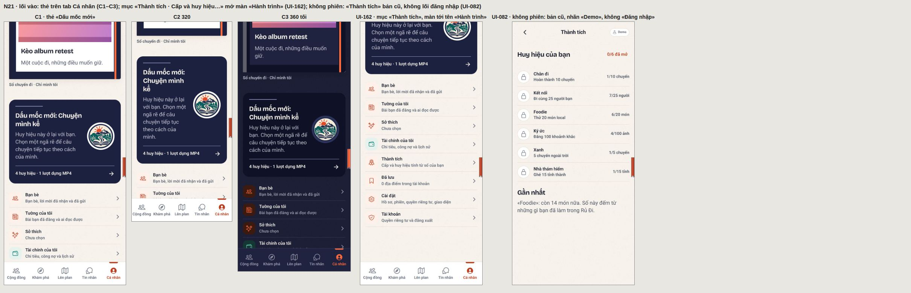 (khung 1–4; hàng `TC-N21-CA-NHAN` C1–C3) |
| Source | `apps/mobile/src/rudi/screens/Profile.tsx:270–275` (hàng khi có phiên). Không phiên thì `/achievements` ra bản demo vẫn tên «Thành tích» (`Profile.tsx:569`) |
| Hậu quả | Hai lối vào một màn mang hai tên; «cấp» gợi một thứ không có. Lỗi nhỏ, nhưng là chữ đầu tiên người dùng đọc trước khi vào sổ |
| Đề xuất sửa | Đổi hàng thành «Hành trình · Sổ huy hiệu và các ngã rẽ của bạn», hoặc bỏ hàng vì đã có thẻ |
| Tiêu chí gỡ | `--chi ca-nhan`: `TC-N21-CA-NHAN` PASS ở C1–C3 |
| Trạng thái sửa · Retest | chưa sửa · không áp dụng |

## Mở rộng issue của audit gốc (đo ở N21)

Tám issue của `docs/claude/2026-09-27/mobile-ui-audit/issues.md` gặp lại trên màn hồ sơ kể chuyện. Không đánh số mới.

| Issue gốc | Gặp lại ở N21 | Hàng · ảnh |
|---|---|---|
| UI-001 (vùng bấm dưới 48dp) | Tường: dòng «N thích · N bình luận» dưới mỗi thẻ là nút «Mở N bình luận của bài» cao 18 (324×18 ở C1, 254×18 ở C2), dưới cả 24; cùng đích với nút «Mở bài» ngay trên. Trang viết: «Thích bình luận», «Trả lời …» 68×44 và ô «Viết bình luận» 302×44 | `TC-N21-TUONG-VUNG-BAM` C1, C2 · `TC-N21-BL-VUNG-BAM` C1–C3 · [EV-N21-XEM-ghep](evidence/EV-N21-XEM-ghep.jpg), [EV-N21-BAI-ghep](evidence/EV-N21-BAI-ghep.jpg) |
| UI-003 (`accessibilityState` không tới DOM) | Sổ hành trình: bốn tab tuyến không có `aria-selected`; huy hiệu trưng bày là checkbox không có `aria-checked`; «Xem Nếp sẽ nhận gì» không có `aria-expanded`. axe critical: aria-required-attr ×3, aria-required-parent ×4 (tab không nằm trong tablist), image-alt ×6 (ảnh huy hiệu) | `TC-N21-HT-TAB-ARIA`, `TC-N21-HT-AXE`, `TC-N21-NEP-ARIA` · [EV-N21-HT-ghep](evidence/EV-N21-HT-ghep.jpg) |
| UI-008 (Nếp là điểm dừng Tab không tên) | Khối «MỚI MỞ» của sổ: Nếp M8 nhận Tab mà không có tên (112×112 ở C1–C3, 128×128 ở C6). Cùng gốc `NepDien.tsx:52` | `TC-N21-NEP-DIEN-TAB` · [EV-N21-HT-ghep](evidence/EV-N21-HT-ghep.jpg) |
| UI-040 (sheet quá cao ở cửa sổ thấp) | Ở C8 (390×460), khay «Lời nhắn dưới ảnh» cao 441, tức 96% cửa sổ, đỉnh ở y 19: ảnh chỉ còn dải 19px. Ở C1 khay chiếm 70% | `TC-N21-ANH-KHAY-C8` · [EV-N21-BAI-ghep](evidence/EV-N21-BAI-ghep.jpg) |
| UI-082 (không phiên: màn demo không có lối đăng nhập) | `/achievements` không phiên ra «Thành tích» bản cũ: có nhãn «Demo» (đạt phần nhãn), nhưng không có lối «Đăng nhập». Lời «Số này đếm từ những gì bạn đã làm trong Rủ Đi» đứng cạnh số bịa; màn khác hẳn sổ hành trình người có phiên thấy | `TC-N21-KHONG-PHIEN-DANG-NHAP` · [EV-N21-VAO-ghep](evidence/EV-N21-VAO-ghep.jpg) |
| UI-093 (tablet: trải hết bề ngang) | Sổ hành trình: thẻ ngã rẽ và hàng huy hiệu rộng 720 ở C6, 912 ở C7 (nút 686, 878), trong khi bản đồ bốn tuyến giữ 560 (`AchievementsLive.tsx:259`: `routeMap` có `maxWidth: 560`, thẻ thì không) | `TC-N21-HT-TABLET` C6, C7 · [EV-N21-HT-ghep](evidence/EV-N21-HT-ghep.jpg) |
| UI-100 («Thử lại» vô ích với nội dung không dành cho mình) | Người lạ mở hồ sơ: «Chưa mở được hồ sơ · Hồ sơ này chỉ bạn bè hoặc người cùng nhóm mới xem được. Gửi lời mời kết bạn trước nhé.» kèm «Thử lại». Chạm thì gọi lại một lần, nhận 403, khối y nguyên; màn không có lối kết bạn nào (`HoSoNguoiScreen.tsx:286`) | `TC-N21-XEM-LA-THU-LAI` · [EV-N21-XEM-ghep](evidence/EV-N21-XEM-ghep.jpg) |
| UI-106 (khối huy hiệu vừa mở bẻ chữ ở 320) | Sổ hành trình ở C2: khối «MỚI MỞ» còn cột chữ 44px giữa ảnh huy hiệu và Nếp M8; chữ «chân» nằm trên hai dòng («châ\|n»), đo bằng Range. C1 (cột 114) và C3 (cột 84) không bẻ. Cùng số đo với `TC-R-UI-106` | `TC-N21-TU-VO` C2, `TC-N21.S02-BASE` C2 · [EV-N21-HT-ghep](evidence/EV-N21-HT-ghep.jpg) |

## N22 Rủ Đi AI trong chat (AI v2 #654, chat hai người #659; ADR-0046)

Đo trên bản web export của main với stack thứ hai. Thiết kế đọc đối chiếu: ADR-0046 (chấp nhận, chủ sản phẩm chốt 27/09) và
`docs/claude/2026-09-25/thiet-ke-ai/03-rudi-ai-trong-luong.md`. Stack không có khoá AI, nên mọi phòng báo `provider_unavailable`.
Đo theo ba cách:
- **màn thật như nó là**: phòng chưa sẵn sàng;
- **phòng «sẵn sàng» dựng ở trình duyệt**: chỉ viết lại đúng một phản hồi, `chat-capabilities` của phòng. Mọi lời gọi khác tới
  máy chủ thật, và máy chủ từ chối thật (503). Danh sách lời gọi hỏng trong quá khứ cũng viết lại ở trình duyệt, để đọc các hàng
  lỗi;
- **trạng thái cần model** (chữ hiện dần, chuyển giao sang thẻ): đọc trên hai trang lab của server dev (fixture),
  `/dev/tra-loi-song` và `/dev/hai-lop-chat`. Hai trang vẽ bằng chính thành phần app dùng, dữ liệu bịa.

Persona: chat-0 (nhóm chat-test 20 người, luồng 49 tin; chat đôi với chat-1, đám bạn, luồng trống); chat-20 và chat-21 (cặp bị
chặn trong lúc đo rồi bỏ chặn); chat-8 và chat-9 (cặp đôi, chỉ đọc). Mọi lần ghi liệt kê ở `report.md` §A.

Đạt trong phạm vi đã đo (`coverage-matrix.md`, hàng `TC-N22-*`):
- **Máy chủ đóng an toàn** (API):
  - ba phòng (nhóm, đám bạn, cặp đôi) báo `plan`, `chia_bill`, `hoi` là `available=false`, lý do `provider_unavailable`;
    `mention=true`, `share_scope=caller_attached`. Cặp có đúng AI của nhóm;
  - lời nhờ hợp lệ: 503, không lưu lời gọi nào. Lời nhờ trống: 400 `invalid_invocation`;
  - cặp đang chặn: 403 `membership_required` từ cả hai phía, chặn trước cả cổng nhà cung cấp. Cặp không chặn: 503.
- **Chip khi chưa sẵn sàng**, ở nhóm (C1–C3) và chat đôi (C1–C3): «Rủ Đi AI chưa sẵn sàng · Gửi như tin thường», trong vùng
  aria-live polite, không có «Xem». Gửi thì tin đi như tin thường: app không gọi AI, không có hàng lời nhờ. Phần chữ hiện lúc gửi
  lệch với chip: UI-164.

  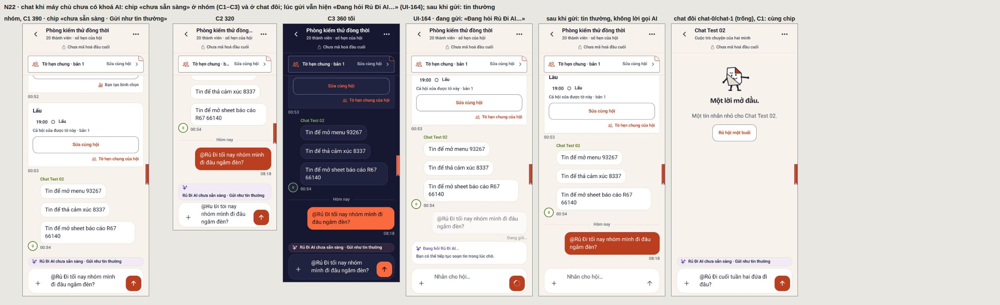
- **Phòng sẵn sàng (dựng)**:
  - chip «Kèm N tin gần đây · Xem · Chỉ gửi lời nhờ»;
  - «Xem» liệt kê đúng N tin chip đếm và nói lời nhờ cùng câu trả lời hiện cho ai. Ảnh đi bằng chú thích, sticker bằng chữ;
  - gửi thì tin được lưu trước, rồi đúng một lời gọi `plan`. Lời nhờ đã bỏ «@Rủ Đi»; `trigger_message_id` là tin vừa lưu;
    gói có đúng N lượt với các trường `id, vai, luc, biDanh, loai, chu`, không `image_url`;
  - máy chủ thật từ chối 503, luồng hiện «Rủ Đi AI chưa nhận lời nhờ · AI chưa sẵn sàng. Bạn vẫn có thể tự tạo kèo.» trong khung
    nhìn. «Thử lại» gửi lại đúng thân cũ, từng byte, cùng khoá idempotency. «Bỏ» bỏ hàng, tin vẫn ở luồng;
  - «Chỉ gửi lời nhờ» đổi chip thành «Chỉ gửi lời nhờ, không kèm tin nào · Kèm lại 40 tin». Lời gọi không có `boi_canh`.

  
- **Lời nhờ hỏng trong quá khứ** (danh sách viết lại): mỗi hàng nói chuyện gì đã xảy ra và nên làm gì. Hàng
  `chia_bill_no_expenses` không có «Thử lại lời nhờ»; hàng `plan` có «Tự tạo kèo». Nút tắt mà không nói lý do: UI-091.
- **Chat đôi**:
  - «/» và «@» gợi ý đúng bốn lệnh của nhóm, lời viết cho hai bạn;
  - luồng trống: chip «Hai bạn chưa có tin nào, chỉ gửi lời nhờ»;
  - tấm «Xem» của chat đôi (trang lab) nói «…hiện cho cả hai bạn» và «Tên hiển thị của hai bạn», không có chữ «nhóm».
- **Nếp, khi không có khoá**: câu hỏi hiện, «Nếp đang nghĩ…», rồi sau 256 ms «Nếp chưa trả lời được lúc này. Bạn thử lại sau ít
  phút nhé.». Câu này không đổ cho mạng; câu hỏi trả về ô nhập để gửi lại. Thiếu vùng aria-live: UI-165.
- **Trang lab**:
  - bảng Nếp (đang nghĩ, đang viết, xong) và hàng Rủ Đi AI trong luồng nhóm (người hỏi, thành viên khác) ở C1–C3: không tràn,
    không cắt;
  - «Chạy thử»: «đang nghĩ», chữ đầu lúc 1227 ms, lớn dần qua 7 nhịp, xong lúc 1626 ms thành lượt có chip. Với «Reduce Motion»:
    hai lần lớn lên, mỗi lần một câu trọn;
  - bản production không có trang lab: `/dev/tra-loi-song` chuyển về `/welcome`.

  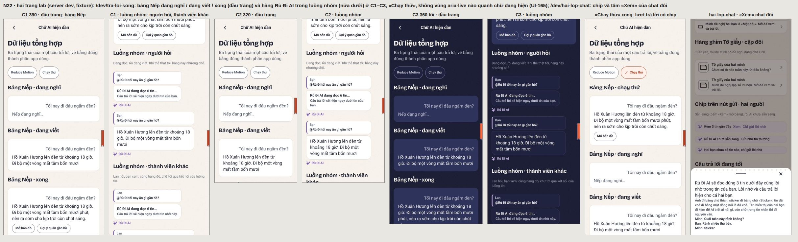

Chưa đo được: native (6 hàng BLOCKED). Cũng BLOCKED là câu trả lời thật, chữ chạy qua mạng (SSE), khung `ai` của WebSocket phòng
ở thành viên khác và chuyển giao sang thẻ (`TC-N22-AI-THAT`).

### UI-163 · Gói bối cảnh kèm 40 tin gần nhất, gấp đôi mặc định 20 tin ADR-0046 đã chốt

| Trường | Nội dung |
|---|---|
| Category / Severity | BUG (lệch quyết định đã chốt; quyền riêng tư) · **P2** |
| Feature / Screen / Layer | N22 · `/groups/[id]/chat` (nhóm và chat đôi) · chip «Kèm N tin gần đây», tấm «Xem», thân `POST /contexts/{id}/ai-invocations` |
| Nền tảng, cấu hình | web, C1 (số tin không phụ thuộc bề rộng). Native: cùng mã (STATIC) |
| Điều kiện | Phòng sẵn sàng (ở đây dựng bằng cách viết lại `chat-capabilities`); luồng có hơn 20 tin (nhóm chat-test: 49) |
| Tái hiện | 1. Mở chat nhóm. 2. Gõ «@Rủ Đi gợi ý quán ăn tối gần hồ cho cả nhóm». 3. Đọc chip, chạm «Xem». 4. Gửi, đọc thân lời gọi |
| Expected | ADR-0046 §2, quyết định 2: «Ngữ cảnh là lời nhờ trong tin tag, cộng N tin gần (mặc định 20), cộng tối đa 6 lượt của chuỗi hỏi tiếp, trong trần 40 lượt hiện có» |
| Actual | Chip ghi «Kèm 40 tin gần đây». «Xem» liệt kê 40 tin. Thân lời gọi có `boi_canh.luot` 40 lượt. Máy chủ nhận tới 40 lượt (trần), nên không có gì chặn lại |
| Evidence |  (khung 1, 2; hàng `TC-N22-SAN-SO-TIN`, `TC-N22-SAN-GUI-KEM`, `TC-N22-SAN-XEM`) |
| Source | `apps/mobile/src/rudi/screens/chat/GroupChatLive.tsx:317` gọi `gomBoiCanhChat({ tin, personId, tenCua })`, không truyền `soLuot`. `chat/boi-canh-chat.ts:121` lấy mặc định `GIOI_HAN_BOI_CANH.soLuot`. `ai/boi-canh.ts:53` đặt `soLuot: 40`: trần bị dùng làm mặc định |
| Hậu quả | Mỗi lời nhờ gửi cho nhà cung cấp AI số tin của bạn bè gấp đôi mức chủ sản phẩm đã chốt. Chip có hiện số 40 và có «Chỉ gửi lời nhờ», nhưng đa số người dùng giữ mặc định. Lệch này thuộc nhóm «quyền riêng tư/consent» trong năm loại blocker của charter |
| Đề xuất sửa | Truyền `soLuot: 20` ở `GroupChatLive`, hoặc tách hằng mặc định 20 khỏi trần 40. Thêm test đơn vị cho mặc định |
| Tiêu chí gỡ | `n22-ai-chat.mjs --chi san-sang:C1` trên luồng hơn 20 tin: `TC-N22-SAN-SO-TIN` PASS (chip ≤ 20). Gói gửi đi bằng số chip đếm (`TC-N22-SAN-GUI-KEM`) |
| Trạng thái sửa · Retest | chưa sửa · không áp dụng |

### UI-164 · Chip nói «Gửi như tin thường», nhưng lúc gửi luồng vẫn hiện «Đang hỏi Rủ Đi AI...»

| Trường | Nội dung |
|---|---|
| Category / Severity | UX ISSUE (chữ sai trạng thái) · **P3** |
| Feature / Screen / Layer | N22 · `/groups/[id]/chat` · khối chờ gửi ở cuối luồng |
| Nền tảng, cấu hình | web, C1. Native: cùng mã (STATIC) |
| Điều kiện | Phòng chưa sẵn sàng (máy chủ báo `provider_unavailable`); tin bắt đầu bằng «@Rủ Đi» |
| Tái hiện | 1. Gõ «@Rủ Đi tối nay nhóm mình đi đâu ngắm đèn?»: chip «Rủ Đi AI chưa sẵn sàng · Gửi như tin thường». 2. Gửi. Lượt đo giữ yêu cầu gửi 2,5 s ở trình duyệt để đọc được trạng thái chờ |
| Expected | Đúng như chip nói: tin đi như tin thường, không nhắc tới AI |
| Actual | Trong lúc gửi, cuối luồng hiện khối ✦ «Đang hỏi Rủ Đi AI...» kèm «Bạn có thể tiếp tục soạn tin trong lúc chờ.». Sau khi lưu là tin thường: app gọi AI 0 lần, máy chủ có 0 lời gọi, không có hàng lời nhờ. Trên mạng thật khối chỉ tồn tại trong một lượt gửi, nhưng nó trái với câu chip vừa nói |
| Evidence |  (khung 4, 5; hàng `TC-N22-GUI-CHUA-SAN-SANG`) |
| Source | `GroupChatLive.tsx:916–929`: khối hiện khi `timNhacAi(dangGuiThan) !== null`, không xét `lenhSanSang`. Đường gửi ở `:413` có xét, nên không gọi AI |
| Hậu quả | Người dùng vừa được báo AI chưa sẵn sàng thì lại thấy «đang hỏi», rồi không có câu trả lời nào, như AI bỏ dở giữa chừng |
| Đề xuất sửa | Chỉ hiện khối khi `lenhSanSang(ai.capabilities, nhac.lenh)`. Tin thường đã có hàng chờ gửi riêng |
| Tiêu chí gỡ | `--chi nhac:gui` trên nhóm chưa có câu nhắc đó (hoặc đổi câu): `TC-N22-GUI-CHUA-SAN-SANG` PASS |
| Trạng thái sửa · Retest | chưa sửa · không áp dụng |

### UI-165 · Chữ AI hiện dần, dòng «đang đọc / đang nghĩ» và câu lỗi của Nếp không nằm trong vùng aria-live

| Trường | Nội dung |
|---|---|
| Category / Severity | UX ISSUE (trợ năng) · **P3** |
| Feature / Screen / Layer | N22 · hàng trả lời trong luồng (`TraLoiAiDangViet`) · bảng Nếp (`NepPhien`) |
| Nền tảng, cấu hình | web, C1: bảng Nếp đo trên màn thật; hàng luồng nhóm và «Nếp đang viết» đo trên trang lab. Native: `accessibilityLiveRegion` chỉ có tác dụng trên Android, iOS cần `AccessibilityInfo.announceForAccessibility` (STATIC) |
| Điều kiện | Có lời nhờ đang chạy, hoặc vừa hỏi Nếp |
| Tái hiện | 1. Ở Khám phá, hỏi Nếp «Tối nay đi đâu ngắm đèn?». 2. Đọc thuộc tính aria-live quanh «Nếp đang nghĩ…» và câu lỗi. 3. Trên `/dev/tra-loi-song`, đọc quanh `nep-dang-nghi`, `nep-dang-viet`, `chat-tra-loi-dang-doc`, `chat-tra-loi-dang-viet` |
| Expected | Trình đọc màn hình được báo khi AI bắt đầu đọc hay nghĩ, khi câu trả lời tới, hoặc khi lỗi. Chip bối cảnh (`ChipBoiCanh.tsx:40`), câu lỗi `ai.error` (`GroupChatLive.tsx:834`) và thông báo (`:908`) đã làm vậy |
| Actual | aria-live null ở cả sáu chỗ trên lab: Nếp đang nghĩ, Nếp đang viết, nhóm đang đọc ×2, nhóm đang viết ×2. Trên màn thật, «Nếp đang nghĩ…» (lúc 0 ms) và «Nếp chưa trả lời được lúc này…» (lúc 256 ms) cũng null |
| Evidence |  ·  (khung 6; hàng `TC-N22-LAB-LIVE`, `TC-N22-NEP-LIVE`) |
| Source | `screens/chat/TraLoiAiDangViet.tsx:99` (`chat-tra-loi-dang-viet`), `:103` (`chat-tra-loi-dang-doc`). `nep/NepPhien.tsx:81` (`nep-dang-viet`), `:85` (`nep-dang-nghi`), `:132` (`nep-loi-hoi`). Không chỗ nào có `accessibilityLiveRegion` |
| Hậu quả | Người dùng trình đọc màn hình gửi lời nhờ rồi không nghe gì; phải tự dò mới biết AI đã trả lời hay đã lỗi |
| Đề xuất sửa | Đặt `accessibilityLiveRegion="polite"` cho dòng trạng thái và câu lỗi. Với chữ đang chạy, chỉ báo một lần khi xong, cả câu, không báo từng nhịp |
| Tiêu chí gỡ | `--chi nep`: ghi chú của `TC-N22-NEP-KHONG-KHOA` đọc aria-live polite cho «đang nghĩ» và câu lỗi. `--chi lab` (server dev): `TC-N22-LAB-LIVE` PASS |
| Trạng thái sửa · Retest | chưa sửa · không áp dụng |

### UI-166 · Tấm «Xem» trượt dưới dải ghim «Tờ hẹn chung»: tay cầm, «Đóng bảng» và dòng đầu bị che

| Trường | Nội dung |
|---|---|
| Category / Severity | BUG (layout, che nội dung) · **P2**. Cùng gốc với UI-070 và UI-040 của audit gốc |
| Feature / Screen / Layer | N22 · `/groups/[id]/chat` · tấm «Những tin sẽ gửi kèm lời nhờ» (`TamXemBoiCanh`, `ui/Sheet.tsx`) dưới dải ghim |
| Nền tảng, cấu hình | web, C1, C2, C8. Native: `zIndex` chỉ xếp các phần tử anh em trong cùng cha; chưa đo dải và tấm có cùng cha hay không (HYPOTHESIS) |
| Điều kiện | Nhóm có tờ hẹn chung (hoặc bình chọn) ghim trên đầu luồng; lời nhờ kèm đủ nhiều tin để tấm cao tới trần |
| Tái hiện | 1. Trong nhóm chat-test (phòng sẵn sàng), gõ «@Rủ Đi …». 2. Chạm «Xem» |
| Expected | Tấm phủ lên mọi thứ của màn, kể cả dải ghim. Tay cầm, «Đóng bảng» và câu đầu «Rủ Đi AI sẽ đọc đúng N tin…» thấy được |
| Actual | Dải ghim (y 91–160) vẽ đè lên tấm. **C1**: tấm bắt đầu ở y 88 (90% cửa sổ); «Đóng bảng» (y 88–136), tay cầm và dòng đầu «Rủ Đi AI sẽ đọc đúng 40 tin dưới đây cùng lời» (y 138) nằm dưới dải. Dòng này ở đầu vùng cuộn nên không bao giờ cuộn ra được. **C2**: tấm từ y 51 (92%); dòng đầu (y 101) nằm dưới dải. **C8**: tấm từ y 19 (96%); dải che dòng 2–4 («nhờ trong tin của bạn. Lời nhờ và câu trả lời hiện cho cả nhóm.» và đầu câu thứ hai). Dải là lớp trơ (inert), nên chạm vào chỗ «Đóng bảng» vẫn đóng được tấm, chạm dải không mở tờ hẹn: đóng được, nhưng không thấy nút |
| Evidence |  (khung 2, 3; hàng `TC-N22-XEM-GHIM` C1, C2, C8; `TC-N22-XEM-CAO`) |
| Source | `GroupChatLive.tsx:800` (dải `day-ghim`), `:1152` (`dayGhim: { …, zIndex: 1 }`), `:1109` (`TamXemBoiCanh` gắn ở gốc màn). `ui/Sheet.tsx:178`: lớp sheet `absoluteFill`, z-index 0 trên web. `:51`, `:219`: trần 82% chỉ áp cho `ScrollView`, hàng tay cầm 48 cộng thêm (UI-040) |
| Hậu quả | Câu nói rõ AI sẽ đọc bao nhiêu tin bị che ở C1, mà đó là lý do tấm này có mặt (bản xem trước của ADR-0036 §2.5). Nút đóng không thấy. Sheet nào mở trong chat có dải ghim mà đủ cao cũng bị đè như vậy. UI-070 chỉ ghi phần dải sáng trên nền mờ |
| Đề xuất sửa | Bỏ `zIndex` của dải, hoặc cho lớp sheet `zIndex` cao hơn mọi thứ trong màn: một chỗ sửa cho cả UI-070. Áp trần 82% cho cả khung sheet (UI-040) |
| Tiêu chí gỡ | `--chi xem-ghim`: `TC-N22-XEM-GHIM` PASS ở C1, C2, C8. Nghĩa là tấm không chồng lên dải, hoặc dải nằm dưới lớp mờ |
| Trạng thái sửa · Retest | chưa sửa · không áp dụng |

### UI-167 · Ở 320dp chip gãy dòng: ký hiệu ✦ đứng riêng một dòng, «Chỉ gửi lời nhờ» rớt xuống dòng hai

| Trường | Nội dung |
|---|---|
| Category / Severity | VISUAL POLISH · **P3** |
| Feature / Screen / Layer | N22 · `/groups/[id]/chat` (nhóm và chat đôi) · chip trên nút gửi |
| Nền tảng, cấu hình | web, C2 (320). C1, C3, C8 vẫn một dòng. Native: Yoga gói dòng tương tự (HYPOTHESIS) |
| Điều kiện | Ô soạn có tin bắt đầu bằng «@Rủ Đi» |
| Tái hiện | Gõ «@Rủ Đi …» ở bề rộng 320 |
| Expected | Chip gọn một dòng (chú thích mã: «48dp touch targets on a one-line chip»). Nếu buộc phải xuống dòng thì ký hiệu đi cùng câu |
| Actual | Chưa sẵn sàng: chip 288×52, ✦ một mình dòng đầu, «Rủ Đi AI chưa sẵn sàng · Gửi như tin thường» ở dòng hai (C1: 358×28). Sẵn sàng: chip 288×82, dòng đầu «✦ Kèm 40 tin gần đây Xem», «Chỉ gửi lời nhờ» ở dòng hai cách một khoảng trống (C1: 358×42) |
| Evidence |  (khung 2; hàng `TC-N22-CHIP-HEP`, `TC-N22.S01-BASE` C2, `TC-N22.S02-BASE` C2) |
| Source | `screens/chat/ChipBoiCanh.tsx:84–85`: `chip` có `flexWrap: "wrap"`, câu chỉ có `flexShrink: 1`. Trên web, khi hàng được phép gói, phần tử xuống dòng trước khi co; câu dài hơn chỗ còn lại sau ký hiệu nên nhảy xuống dòng mới |
| Hậu quả | Chip cao gấp đôi tới gấp ba, đẩy luồng lên, trông như vỡ bố cục. Vẫn đọc được, vẫn bấm được |
| Đề xuất sửa | Bỏ `flexWrap` của hàng ký hiệu và câu, để câu co và tự xuống dòng bên trong nó. Đặt hai nút ở hàng riêng khi không đủ chỗ |
| Tiêu chí gỡ | `--chi nhac:C2`, `--chi doi:C2`, `--chi san-sang:C2`: ký hiệu cùng dòng với chữ (đọc ảnh), chip chưa sẵn sàng cao ≤ 36 |
| Trạng thái sửa · Retest | chưa sửa · không áp dụng |

## Mở rộng issue của audit gốc (đo ở N22)

Bốn issue của `docs/claude/2026-09-27/mobile-ui-audit/issues.md` gặp lại ở chat có Rủ Đi AI. Không đánh số mới. UI-070 (dải ghim
sáng trên nền mờ) gặp lại với hậu quả nặng hơn, thành UI-166.

| Issue gốc | Gặp lại ở N22 | Hàng · ảnh |
|---|---|---|
| UI-001 (vùng bấm dưới 48dp) | Chip «Kèm N tin gần đây»: «Xem» 28×32 và «Chỉ gửi lời nhờ» 90×32 ở C1, C2, C8. Mã định cao 48 bằng `hitSlop={12}` (`ChipBoiCanh.tsx:42`, `:47`, chú thích `:86`), nhưng react-native-web bỏ qua `hitSlop`. Native: 52×56 và 114×56 (STATIC) | `TC-N22-SAN-CHIP` C1, C2, C8 · [EV-N22-SAN-ghep](evidence/EV-N22-SAN-ghep.jpg) |
| UI-023 (nhãn của nút bị cắt ở điện thoại hẹp) | Dải ghim của nhóm ở 320: «Tờ hẹn chung · bản 1» thành «Tờ hẹn chung · b…» (thiếu 12px, mất số bản); «Sửa cùng hội» không co nên chiếm chỗ (`SoHen.tsx:57–58`). C1, C3 đọc trọn | `TC-N22-GHIM-C2` · [EV-N22-CHIP-ghep](evidence/EV-N22-CHIP-ghep.jpg) |
| UI-040 (sheet quá cao) | Tấm «Xem» 40 tin cao 90% cửa sổ ở C1, 92% ở C2, 96% ở C8 | `TC-N22-XEM-CAO` · [EV-N22-SAN-ghep](evidence/EV-N22-SAN-ghep.jpg) |
| UI-091 (nút tắt không nói lý do) | Hàng lời nhờ hỏng: «Thử lại lời nhờ» tắt (viền đứt) khi phòng chưa sẵn sàng, không câu nào nói vì sao (`GroupChatLive.tsx:891`, `disabled` khi `!lenhSanSang`) | `TC-N22-LOI-GOI-THU-LAI-TAT` · [EV-N22-SAN-ghep](evidence/EV-N22-SAN-ghep.jpg) |

---

## Quan sát chưa thành issue (chờ audit feature mới)

Q1 và Q2 đã được đo ở checkpoint N26 và thành issue (cột cuối). Q5 đã được đo ở checkpoint N14. Q4 đã được đo ở checkpoint N15
và thành UI-149. Q3 đã được đo ở checkpoint N21 và thành UI-158.

Những điều thấy trong lúc retest, thuộc phần main mới đổi. Chưa đủ căn cứ để gọi là lỗi, vì cần đối chiếu ý đồ
thiết kế của đúng feature đó. Mỗi điều được giao cho task audit tương ứng, không tính vào số issue.

| # | Quan sát | Căn cứ | Giao cho |
|---|---|---|---|
| Q1 | Cặp bạn bè (chưa «Một đôi») vừa lập sổ: thân màn sang «Hai người cũng thành một hội», khoảnh khắc bìa sổ M6 không còn diễn | `KhongGianGiay.tsx`: M6 (`vuaMoSo`) chỉ nằm trong nhánh `giay-trong`, nhánh này chỉ tới được khi `batDoi`; runtime: `TC-R-UI-084-B` C1/C9 không thấy khung M6 nào | **Đã đo ở N26, thành UI-127**: lúc thành «Một đôi» cũng không có khung M6 nào |
| Q2 | Máy chủ vẫn cho phác và gửi tờ giấy ở cặp chưa «Một đôi»; chỉ UI ẩn nút | `pairsteps/papers.go` `DraftPaper` không kiểm `CanBatDoi` (đọc mã, chưa gọi API trên cặp như vậy) | **Đã đo ở N26, thành UI-131**: phác trả 201 ở cặp chat-6/chat-7 |
| Q3 | Màn bài `/posts/[id]` không còn lối xoá bình luận nào, cho cả người viết lẫn tác giả bài; nhấn giữ bình luận cũng không mở gì. API `DELETE /posts/{id}/comments/{id}` vẫn còn | `TC-R-UI-096` (đổi); `BaiChiTietScreen.tsx` hàng bình luận chỉ có «Thích», «Trả lời» | **Đã đo ở N21, thành UI-158**: chat-1 không có lối xoá bình luận của mình, ở trang viết lẫn khay ảnh; `xoaBinhLuanBai` không màn nào gọi |
| Q4 | Album kèo ghi «đã chia» bằng tổng phân bổ của mọi khoản chi trong nhóm có ngày rơi vào khoảng ngày của kèo, không theo kèo: «Kèo album retest» vừa tạo ghi «đã chia 13.705.678đ» của khoản chi lượt F04. Hai kèo trùng ngày sẽ cùng ghi một khoản | `repo/recap.go`: nối `expenses` theo `on_date BETWEEN outings.starts_on AND outings.ends_on`; bảng `expenses` không có cột kèo. Đọc mã Go, chưa đối chiếu oracle Python | **Đã đo ở N15, thành UI-149**: hai kèo trùng ngày cùng ghi «đã chia 13.705.678đ»; oracle Python tính y hệt Go (`repository.py:3012`) |
| Q5 | Tab Cộng đồng khi chưa đăng nhập có nút «Đăng nhập», trong khi bốn tab demo kia và hai route demo không có (tính vào `TC-R-UI-082-F11`) | `TC-R-UI-082-F11` | **Đã đo ở N14, không thành issue mới**: tab Cộng đồng đúng (`TC-N14-KHONG-PHIEN`: lời mời, «Đăng nhập» tới `/login`); phần lệch nằm ở các tab demo, đã tính vào UI-082. Màn trong của Cộng đồng mở từ link thì không có lối đăng nhập: UI-137 |
