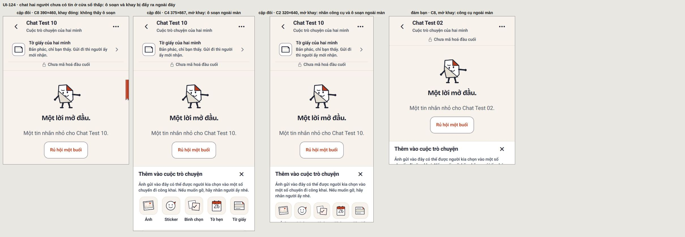
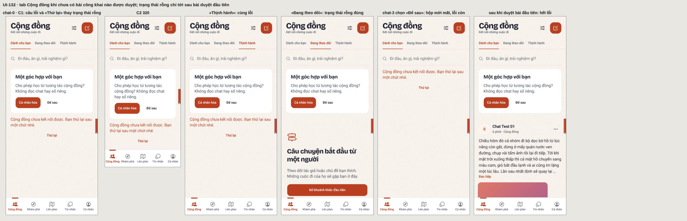
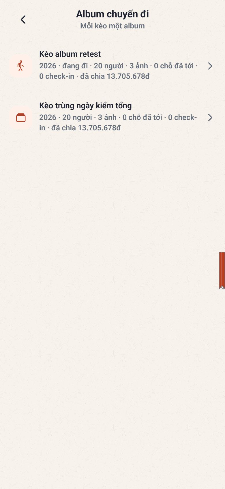
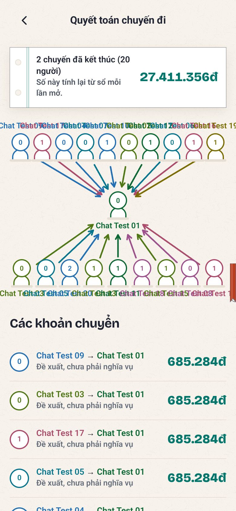
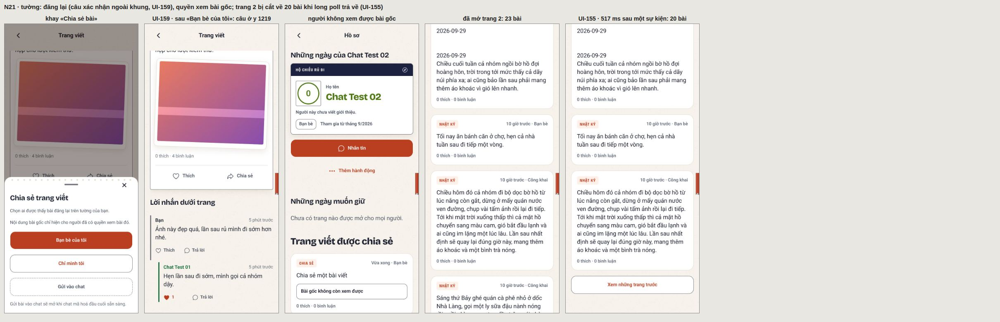
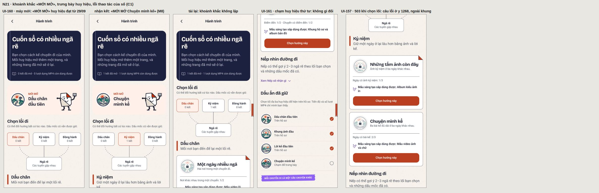
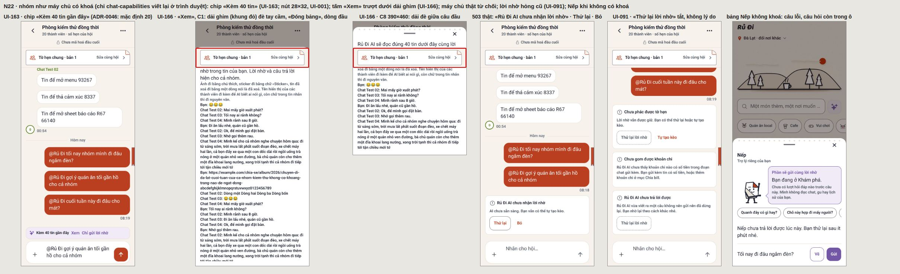
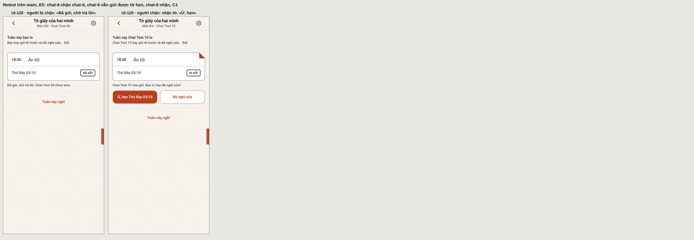
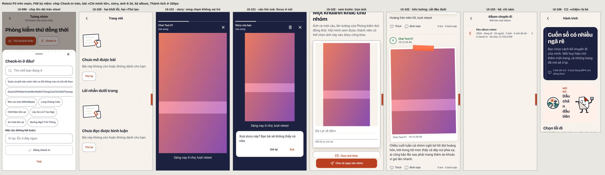

# Audit UI/UX app mobile RuDi, phần sau pipeline trên main: báo cáo

- Ngày: 29/09–01/10/2026. Cây đo: main `461eabf`. Audit gốc: `7ea1a7c`, tài liệu ở `docs/claude/2026-09-27/mobile-ui-audit/`.
  Nhánh ghi: `claude/busy-cray-vfmt4r`.
- MODE = **AUDIT_ONLY**: không sửa mã app. Chỉ thêm tài liệu, ảnh bằng chứng và harness đo.
- protocol_version: không áp dụng. Verdict: không có (chưa có reviewer thật; đây là báo cáo phát hiện).
- Trạng thái: **checkpoint N22**.
  - Cả 122 issue của audit gốc đã được đo lại trên main (checkpoint retest 1 và 2).
  - Năm feature mới đã audit:
    - hai lớp chat hai người «đám bạn» / «cặp đôi» (#660, task #26): 8 issue (UI-124…UI-131);
    - Cộng đồng, tab đầu của app (task #14, ADR-0040): 17 issue (UI-132…UI-148);
    - sổ chuyến đi / Nếp v3: khép cuộc đi, giữ sổ, sửa, công khai, xoá (task #15, ADR-0039): 6 issue (UI-149…UI-154);
    - hồ sơ kể chuyện: sổ hành trình nhiều ngã rẽ, huy hiệu trưng bày, tường cá nhân v2, bình luận một tầng, đăng lại (task
      #21, PR #658): 8 issue (UI-155…UI-162);
    - Rủ Đi AI trong chat: chip bối cảnh, «Xem», lời gọi và hàng lời nhờ hỏng, chat đôi, Nếp, trang lab chữ hiện dần (task
      #22, PR #654 và #659, ADR-0046): 5 issue (UI-163…UI-167).
  - Tổng 45 issue mới trên main (UI-123…UI-167).
  - **Chưa đo:** bản đồ giấy Hành trình của main `79baa1c` (#40), chưa có hàng.
  - Mục «Checkpoint» ở cuối là nguồn sự thật về phần đã và chưa đo.

Tài liệu đi kèm:
- `retest.md`: từng issue của audit gốc, trên main còn, hết hay đổi (sinh từ sổ, không sửa tay).
- `issues.md`: issue mới (từ UI-123), mở rộng của issue gốc gặp lại ở feature mới, và các quan sát chưa thành issue.
- `coverage-matrix.md`: mọi hàng đo trên main, có đếm (sinh từ sổ).
- `evidence-manifest.md`: ảnh đã commit của phần này.
- Harness: `tests/qa/mobile-ui-audit/` (README ở đó; các script `retest-*`, `n26-*`, `n14-*`, `n15-*`, `n21-*` và `n22-*`).

## A. Phạm vi và môi trường

### Đã chạy thật

- **Stack thứ hai**, dựng riêng cho main, không đụng stack của audit gốc:
  - Postgres 16 ở cổng 55433;
  - API Python ở 58198;
  - cửa trước Go ở 58199, build bằng Go 1.26.8, route ứng viên `ported`.
  - Cờ `MOBILE_COMMUNITY_ENABLED` bật. AI chạy engine mặc định, không có khoá, như audit gốc.
  - Dữ liệu:
    - Alembic, rồi các migration Go mới (`migrate-chat`, `-diaries`, `-community`, `-profile`);
    - danh mục 15 điểm đến, `seed:rudi` (Team Đà Lạt), seed chat 22 người.
  - Mọi dữ liệu là tổng hợp, không có dữ liệu người thật.
- **Bản web export production của main** (E1), trỏ vào cửa trước 58199. Màn chào in dấu cây `461eabf`.
  - Bảng dev `/dev/ui-lab` và `/dev/san-khau` chỉ có trên server dev của main (E2, fixture bật, cổng 8091). Dùng cho
    UI-113 ở checkpoint 1, và UI-114, UI-115, phần bảng dev của UI-027 ở checkpoint 2. Ở checkpoint N26 dùng cho trang lab
    `/dev/hai-lop-chat`. Server dev tắt ngay sau mỗi lượt.
- **Trình duyệt và cấu hình** như audit gốc:
  - Chromium 141 headless, giả lập di động, chữ thân Roboto;
  - cấu hình C1–C9 ở `report.md` §A của audit gốc.
  - Mỗi issue đo lại ở đúng cấu hình issue đó nêu, trừ khi ghi chú của hàng nói khác. Còn lại là C1.
- **Để đối chứng UI-123**, stack của audit gốc (`7ea1a7c`, cổng 55432, 58098, 58099) được bật lại. Chỉ đọc, không ghi
  gì lên đó.
- **Gián đoạn.** Máy khởi động lại lần thứ sáu giữa lượt P3 F00. Lượt đó dừng ở bước gắn phiên («Failed to fetch»),
  chưa ghi hàng nào. Stack thứ hai được dựng lại bằng script của nó, rồi chạy lại lượt đó.
- **Checkpoint N14, Cộng đồng.**
  - **Người duyệt.** chat-15 được cấp vào `community_moderators` bằng một câu INSERT trên DB cục bộ, trước phần `duyet`.
    Đó đúng là cách người vận hành cấp vai trò theo ADR-0040 và `docs/testing/cong-dong.md`; app không có lối cấp.
  - **Realtime qua relay.** Stack không đặt `MOBILE_CORS_ALLOW_ORIGINS`, nên cửa trước từ chối WebSocket của trang ở bước
    bắt tay (403, ghi trong ghi chú của hàng `TC-N14-RONG-BANG-TIN`). Phần `ws` chuyển socket của trang qua một relay
    trong Node (`routeWebSocket` của Playwright): relay nối tới máy chủ mà không gửi Origin và chuyển nguyên từng khung
    hai chiều. Khung là khung của máy chủ; relay chỉ thêm khả năng đóng socket phía máy chủ để đo lúc nối lại. Chỉ hàng
    `TC-N14-WS-*` đi qua relay.
  - **Log core.** Số dòng `sqlstate=23502` của UI-132 đếm bằng grep trên file log của cửa trước (chỉ đọc).
- **Checkpoint N15, sổ chuyến đi.**
  - **Không có khoá AI.** «Dựng sổ cùng Nếp» chỉ đo được nhánh lỗi. Mọi sổ được dựng bằng «Tự xếp trang, không gửi AI».
  - **Khép không hoàn tác được.** Phần đo trước khi khép (`khep-truoc`) chạy trước phần khép «Kèo album retest» (`khep`).
  - **Ngày chạy.** Đo ngày 30/09, ngày cuối của «Kèo album retest» (29–30/09), nên album ghi kèo này «đang đi». Vì vậy phần
    «hero quyết toán sau khi kèo xong» của UI-149 là HYPOTHESIS ở checkpoint N15. Ngày 01/10, khi kèo đã xong, phần đó được
    đo (`TC-N15-Q4-HERO`) và bỏ nhãn HYPOTHESIS: xem UI-149.
  - **Gián đoạn.** Container khởi động lại một lần nữa giữa lúc chốt N15. Stack dựng lại bằng `start.sh`, dữ liệu còn
    nguyên; phần `hep` (sửa sổ và kệ ở C2, C3, chỉ đọc) đo sau đó.
- **Checkpoint N21, hồ sơ kể chuyện.**
  - **Giờ chạy.** Phần chỉ đọc (`api`, `hanh-trinh`, `ca-nhan`, `moi-mo`, `nep`, `loi`) chạy ngày 30/09. Phần ghi chạy sau
    0 giờ 01/10 giờ Việt Nam: ngày kể đếm theo ngày Việt Nam, và bài ảnh mới phải rơi vào ngày thứ ba để «Chuyện mình kể» đủ
    điều kiện.
  - **Không có khoá AI, chưa có worker MP4.** Gợi ý của Nếp chỉ đo được nhánh «sổ tự gợi ý»; lượt MP4 chỉ đo được số đếm.
  - **Lỗi máy chủ giả lập** bằng `route()` của trình duyệt: 503 cho đọc sổ, chọn lối, `/changes` và `/posts` của tường. Không
    đụng máy chủ.
  - **Gián đoạn.** Máy khởi động lại thêm một lần sau khi đo xong N21, lúc đang chốt. Stack dựng lại bằng `start.sh`, dữ liệu
    còn nguyên; chỉ phần đếm SQL dưới đây chạy sau đó.
- **Checkpoint N22, Rủ Đi AI trong chat.**
  - **Không có khoá AI.** Mọi phòng báo `provider_unavailable`. Phòng «sẵn sàng» được dựng ở trình duyệt: `page.route` viết
    lại đúng một phản hồi, `chat-capabilities` của phòng đang đo (ba lệnh thành `available`). Mọi lời gọi khác tới máy chủ
    thật, và máy chủ từ chối thật (503). Riêng phần `loi-goi` viết lại thêm danh sách lời gọi của phòng, để hiện ba lời gọi
    hỏng bịa: `plan` với `provider_unavailable`, `chia_bill` với `chia_bill_no_expenses`, `hoi` với `ai_tu_choi`.
  - **Giữ tin ở trình duyệt.** Lượt `nhac:gui` giữ yêu cầu gửi tin 2,5 s rồi mới cho đi, để đọc được trạng thái chờ (UI-164).
    Máy chủ nhận tin bình thường.
  - **Server dev E2** (fixture bật, cổng 8091) cho hai trang lab `/dev/tra-loi-song` và `/dev/hai-lop-chat`; tắt sau khi
    đo. `lab-prod` chạy trên bản export E1.
  - **Gián đoạn.** Máy khởi động lại một lần lúc chốt N22, sau khi đã đo, phân xử và viết tài liệu xong. Không phần đo nào
    chạy sau đó; stack dựng lại bằng `start.sh`.

**Dữ liệu đã ghi lên stack thứ hai** (cục bộ, tổng hợp; phần lớn có chốt để không ghi lần hai):

| Ai | Đã ghi |
|---|---|
| Kịch bản gốc F04, F05, F06 chạy lại trên main (checkpoint 1) | Nhóm chat-test: một khoản chi 13.705.678đ, một đợt thu đã phát, tin nhắn đo ô soạn và link dài. Team Đà Lạt: 10 bill nháp của luồng chia bill (bước 2 sang 3 tạo bill nháp; không ghi sổ, không khoản chi). moi-51 lập nhóm F06 và mời moi-52, moi-53 |
| Phần retest F06 (checkpoint 1) | moi-61 được mời, vào cửa bằng OTP qua UI rồi đồng ý vào nhóm. moi-61 được nâng quản trị qua API. Vai trò của moi-51 bị bỏ bằng một chạm (đúng UI-074), rồi được trả lại qua API |
| Phần retest F07 và E5 (checkpoint 1) | Bốn cặp bạn mới, mỗi cặp có chat đôi và sổ đã lập: chat-4/5, chat-6/7, chat-10/11, chat-8/9. Riêng chat-8/9 thành cặp đôi («Một đôi» từ cả hai). chat-8 chặn chat-9 rồi bỏ chặn. Tờ của chat-9 được chat-8 đồng ý qua API, thành tờ chốt và một kèo của cặp. Thêm một bản phác của chat-8, sinh ra khi đo UI-085 |
| Phần retest F03, F08, E (checkpoint 1) | Nhóm chat-test: «Kèo retest 2 ngày chưa có chặng», «Kèo album retest» (một chặng Lưng Chừng Cafe, một check-in của chat-0), 3 ảnh tổng hợp trên tường. chat-0 có một bài «Bạn bè» với 2 bình luận của chat-1 |
| Kịch bản gốc F03 chạy lại (checkpoint 2) | Team Đà Lạt, như audit gốc: hai kèo biến thể của `seed-bien-the.mjs` («Chuyến săn mây Cầu Đất…» 12 chặng, «Kèo chưa có chặng nào»). Mỗi ca ghi chặng vào chúng thì đặt lại chặng sau đó. Bốn kèo «Kèo thử…» tạo qua form rồi xoá bằng SQL trên DB cục bộ (`donKeoThu`) |
| Kịch bản gốc F04 chạy lại (checkpoint 2) | Team Đà Lạt: một bill nháp (bước 2 sang bước 3 của luồng chia bill tạo bill nháp; luồng dừng ở gán món, không tới ghi sổ, không có khoản chi nào), một ảnh bill tổng hợp gửi đọc (máy chủ trả 503 vì không có khoá AI). «Tạo đợt thu từ sổ» bấm một lần: máy chủ từ chối, số đợt 1 → 1 |
| Kịch bản gốc F05 chạy lại (checkpoint 2) | Nhóm chat-test: hai tin của chat-1 làm chỗ nhấn giữ; một bình chọn «Kiểm thử bình chọn …» (Lẩu, Nướng), một phiếu của chat-0, đã chốt; tờ hẹn chung «Lẩu» mở từ bình chọn đó |
| Phần retest P3 F05, F06 (checkpoint 2) | Một tin của chat-1 cho sheet báo cáo; sheet mở rồi đóng, **không gửi báo cáo**. moi-51 mời lại số của moi-61 (máy chủ từ chối, 409). chat-20 gửi lời mời kết bạn qua API; chat-21 đồng ý (lần đầu bị chặn 503 ở trình duyệt), mở chat đôi; chat-20 chặn chat-21 qua UI, rồi bỏ chặn qua API sau khi đo |
| Phần retest P3 F07 (checkpoint 2) | chat-12/chat-13 thành bạn và có chat đôi qua API; chat-12 đề nghị lập sổ (lời đề nghị còn treo). Bản phác của chat-8 dời sang 08/10 rồi trả về 03/10 (đã kiểm qua API: `ngay` là 2026-10-03) |
| Phần retest P3 F08, F09 (checkpoint 2) | chat-0 có thêm một bài «Chỉ mình tôi»; chat-0 đăng một story rồi xoá nó sau khi đo. chat-2 lưu hai địa điểm. Màn «Xoá tài khoản» của chat-2 mở tới bước 2 rồi rời, **không bấm xoá** |
| Phần retest P3 E (checkpoint 2) | Nhóm F06 của moi-51: kèo «Kèo tạo từ chat retest» tạo từ khay của chat. moi-62 (tài khoản mới, đăng nhập bằng OTP qua API) được mời, đồng ý và nhắn một tin. Một lượt thăm dò ngoài harness tạo cùng tên kèo thẳng từ form, rồi kèo đó được xoá bằng SQL trên DB cục bộ trước lượt đo thật |
| Checkpoint N26, `chuyen` | chat-10 đề nghị «Một đôi» qua UI («Mở sổ cặp đôi» → «Cặp đôi» → «Đề nghị bật «Một đôi»»), chat-11 đồng ý qua UI. chat-10/chat-11 nay là cặp đôi |
| Checkpoint N26, `gu` | chat-9 (cặp đôi chat-8/chat-9) bật chia gu, bật lại một lần (thu hồi rồi đề nghị), rồi một lần bật lại hỏng nửa chừng (thu hồi thật, đề nghị bị chặn 503 ở trình duyệt). Lúc cuối công tắc tắt, như lúc đầu (`gu_chat.cua_toi = tat`) |
| Checkpoint N26, `q2` | chat-6 phác một tờ ở cặp đám bạn chat-6/chat-7 qua API (UI-131), rồi bỏ nó qua UI («Bỏ bản phác này»): tờ sang `nghi_tuan` tuần này. Không tờ nào được gửi |
| Checkpoint N26, phần còn lại | Chỉ đọc. Không tin nhắn, không sticker, không kèo nào được gửi hay tạo (form «Kèo mới» mở rồi rời, không lưu). Lời đề nghị lập sổ của chat-12 vẫn treo |
| Checkpoint N14, vai trò và lời mời | chat-15 vào `community_moderators` (SQL, xem trên). Lời mời cá nhân hoá: chat-2 «Cá nhân hóa», chat-3 «Để sau» |
| Checkpoint N14, `dang` | Bốn bài tổng hợp: B1 của chat-0 (công khai, ngắn, hai chủ đề), B2 của chat-0 (công khai, dài, một ảnh tổng hợp 640×480), B3 của chat-0 («Bạn bè»), B4 của chat-1 (công khai). Hai lần gửi bị máy chủ từ chối (sáu chủ đề, chủ đề một ký tự), không ghi gì. Không tải video |
| Checkpoint N14, `duyet` và `binh-luan` | chat-15 duyệt qua UI B1, B2, bình luận của chat-1 dưới B1 và trả lời của chat-0; B4 được duyệt qua API trong phần `ws`, để có một bài mới lúc stream đang nối. Mỗi lần duyệt kèm lý do. chat-1 gửi một bình luận thử rồi xoá; chat-0 trả lời bình luận của chat-1 và tag chat-1, nên chat-1 có một thông báo |
| Checkpoint N14, bảng tin và chi tiết | chat-1 thích B1, lưu một bài, bỏ theo dõi rồi theo dõi lại chat-0 (cuối lượt vẫn theo dõi). chat-2 đổi lượt thích B1 nhiều lần qua API (mỗi lần đo dải cập nhật một lần) và chọn «Không quan tâm» cho B2 (B2 ẩn với chat-2, không bỏ ẩn được qua UI: UI-141). chat-0 sửa B1 thành phiên bản 2 (chờ duyệt), đổi B3 sang «Chỉ mình tôi» rồi trả về «Bạn bè» ba lượt (bảng `community_audit` ghi sáu lần đổi; cuối cùng là «Bạn bè»). chat-0 gọi Nếp vài lần, máy chủ trả 503, không có nháp |
| Checkpoint N14, không làm | Không gửi báo cáo nào (sheet «Báo cáo bài» mở rồi «Thôi»). Không bấm «Xóa lịch sử đề xuất», không bấm «Xác nhận xóa bài và bình luận». Không bài hay bình luận nào bị từ chối |
| Checkpoint N15, `khep` | chat-0 khép «Kèo album retest» (loại `trip`). Khép không hoàn tác được: `outing_endings` có đúng một hàng |
| Checkpoint N15, sổ của chat-0 | Tự xếp trang nhiều lượt (mỗi lượt là một job dựng sổ `succeeded`), lưu riêng tư (phiên bản 1), rồi hai vòng «công khai → gửi Cộng đồng → chat-15 duyệt qua API → cất về riêng tư». Vòng đầu bị rút vì lỗi harness (§E, sự cố 31). Cuối cùng: một sổ riêng tư, phiên bản 5; hai bài cộng đồng dựng từ sổ, cả hai nay ở trạng thái riêng tư. Trong chế độ sửa: đổi tên sổ rồi rời màn không lưu (đo UI-097); đặt tên trang «Trang thử A», «Trang thử B» để đo đổi chỗ trang |
| Checkpoint N15, ảnh và Nếp | Hai ảnh cá nhân tổng hợp tải lên qua «Thêm ảnh từ máy» (360×640 và 640×480). Đây là ảnh riêng của người tải, không lên tường nhóm: tường nhóm vẫn 3 kỷ niệm. Một lần gọi Nếp: job `failed` với `diary_ai_unavailable` |
| Checkpoint N15, chat-1 | Tự xếp và lưu một sổ riêng, rồi xoá nó qua UI từ link lạnh |
| Checkpoint N15, `q4` | chat-0 tạo «Kèo trùng ngày kiểm tổng» (29/09) trong nhóm chat-test qua API: không chặng, không chi, không ảnh |
| Checkpoint N15, phiên và không làm | chat-0 đăng nhập thêm một lần qua UI bằng mã OTP debug (đo UI-121 trên link sổ). Không xoá sổ của chat-0. «Khép cuộc đi» của kèo 24–25/10 bị máy chủ từ chối (409), không ghi gì |
| Checkpoint N21, `nep` (30/09) | chat-0 đồng ý hỏi Nếp một lần (`POST /me/achievement-suggestions` với `{"consent":true}`). Không có khoá: sổ tự gợi ý |
| Checkpoint N21, `bai-anh` | chat-0 tải một ảnh tổng hợp 640×480 và đăng một bài «Bạn bè» có ảnh, thân dài hơn 40 ký tự: ngày kể thứ ba, «Chuyện mình kể» lên 3/3 |
| Checkpoint N21, `ket` và `trung-bay` | chat-0 chọn «Chuyện mình kể» rồi nhận kết: một kết, một lượt MP4. Trưng bày ba huy hiệu mở đầu. Chạm huy hiệu thứ tư sinh một `PATCH` với đúng ba id cũ (UI-161), không đổi gì |
| Checkpoint N21, `binh-luan` và `anh-toan-man` | Dưới bài ảnh của chat-0: chat-1 một bình luận gốc, chat-0 trả lời, chat-1 trả lời lời đáp (câu treo dưới bình luận gốc), chat-1 gửi một bình luận từ khay ảnh. chat-1 thích lời đáp của chat-0. Một lượt thích nhầm lên bình luận gốc của chính chat-1 (lỗi harness, §E sự cố 39) đã bỏ qua API |
| Checkpoint N21, `dang-lai` | chat-1 gửi lời mời kết bạn cho chat-17, chat-17 đồng ý, cả hai qua API. chat-1 đăng lại bài ảnh của chat-0 cho bạn bè |
| Checkpoint N21, `trang` | chat-0 đăng 15 bài ngắn «Chỉ mình tôi» («Ghi chú trang thử 01…15») để tường có trang sau. chat-1 thích rồi bỏ thích bài ảnh: một sự kiện long poll, cuối cùng 0 lượt |
| Checkpoint N21, không làm | Không xoá bình luận nào (không có lối: UI-158), không dùng lượt MP4, không gửi gì vào chat. Phần `hep` và `khong-phien` chỉ đọc |
| Checkpoint N22, `nhac` và `san-sang` | chat-0 gửi ba tin vào nhóm chat-test: «@Rủ Đi tối nay nhóm mình đi đâu ngắm đèn?» (phòng như thật, chưa sẵn sàng), «@Rủ Đi gợi ý quán ăn tối gần hồ cho cả nhóm» (phòng dựng sẵn sàng, kèm 40 tin), «@Rủ Đi cuối tuần này đi đâu cho mát?» (phòng dựng sẵn sàng, «Chỉ gửi lời nhờ»). Mỗi tin kiểm trước khi gửi. Hai tin sau kéo theo hai lời gọi AI và một lần «Thử lại» cùng khoá; máy chủ từ chối cả ba (503), không lưu lời gọi nào |
| Checkpoint N22, `api` và `chan` | Qua API: ở nhóm, một lời nhờ hợp lệ (503) và một lời nhờ trống (400); ở chat đôi chat-0/chat-1, một lời nhờ (503); ở chat đôi chat-20/chat-21 lúc đang chặn, mỗi phía một lời nhờ (403). chat-20 chặn chat-21 rồi bỏ chặn ngay; sau cùng không còn chặn |
| Checkpoint N22, `nep` | chat-0 hỏi Nếp một câu ở Khám phá. Không có khoá: Nếp báo lỗi, không có câu trả lời |
| Checkpoint N22, không làm | Không gửi tin nào trong chat đôi: phần `doi` chỉ gõ rồi xoá. Không bấm «Tự tạo kèo». Phần `xem-ghim`, `loi-goi` và trang lab chỉ đọc |

Đếm bằng SQL chỉ đọc sau checkpoint N14: 4 bài cộng đồng (B1 `pending` phiên bản 2, đã công khai phiên bản 1; B2, B4
`approved`; B3 «Bạn bè»); `community_audit` có 3 lần duyệt bài, 2 lần duyệt bình luận, 6 lần đổi người đọc của B3, không lần
từ chối nào; 1 ảnh 640×480; 1 người duyệt; 2 hàng `community_preferences`; 1 lưu và 1 ẩn trong `community_feedback`; 1 lượt
theo dõi; 1 thông báo; 0 ghi chép riêng.

Đếm bằng SQL chỉ đọc sau checkpoint N15:
- 1 lần khép cuộc đi (`trip`);
- 1 sổ (của chat-0, riêng tư, phiên bản 5), với 5 phiên bản và 3 ảnh trong sổ; sổ của chat-1 đã xoá;
- 10 job dựng sổ của 2 người: 9 `succeeded` (tự xếp), 1 `failed` (`diary_ai_unavailable`);
- 2 bài cộng đồng dựng từ sổ, đều riêng tư;
- 2 ảnh cá nhân; nhóm chat-test vẫn 3 kỷ niệm.

Đếm bằng SQL chỉ đọc sau checkpoint N21 (01/10):
- chat-0: 4 huy hiệu đã đạt (`first_checkin`, `first_photo`, `first_story`, `storyteller`), 3 đang trưng bày, 1 lượt chọn lối đã
  nhận kết, 1 lượt MP4;
- bài của chat-0: 2 công khai, 3 «Bạn bè», 18 «Chỉ mình tôi» (15 trong số đó là «Ghi chú trang thử»);
- bài ảnh của chat-0: 4 bình luận, 0 lượt thích bài. Cả DB có 1 lượt thích bình luận và 1 bài đăng lại.

Đếm bằng SQL chỉ đọc sau checkpoint N22 (01/10):
- nhóm chat-test có 49 tin; 3 tin bắt đầu bằng «@Rủ Đi», đều của chat-0, đều là tin chữ;
- `chat_ai_invocations`: 0 hàng. Không lời gọi AI nào được lưu, kể cả các lời gọi app gửi khi phòng được dựng sẵn sàng.

**Team Đà Lạt.** Report của checkpoint 1 ghi Team Đà Lạt «chỉ được đọc». Câu đó sai: kịch bản F04 gốc chạy lại ở
checkpoint 1 đã tạo 10 bill nháp trong nhóm này. Ở checkpoint 2, kịch bản F03 và F04 gốc chạy lại cũng ghi vào nó, đúng
như audit gốc từng ghi: hai kèo biến thể và kèo thử, một bill nháp, một lần bấm «Tạo đợt thu» bị từ chối.

Đếm bằng SQL chỉ đọc ngày 30/09:
- 12 bill: một của seed, 10 của checkpoint 1, một của checkpoint 2;
- vẫn đúng một khoản chi, của seed;
- không đợt thu mới, không tin nhắn mới.

### Không chạy được, và vì sao

Như audit gốc: không có Android hay iOS native (không KVM, không SDK, không macOS), không có nền bản đồ (proxy chặn tile),
không có AI thật (không khoá). Retest chỉ đo trên web. Mọi phần native của issue giữ nguyên nhãn STATIC hoặc HYPOTHESIS
như audit gốc; phần retest không thêm hàng native.

Ở N26 thì theo khuôn của audit gốc: mỗi màn mới có một hàng Android và một hàng iOS, đều BLOCKED (12 hàng). Engine AI nhóm
là `brain` không khoá, nên mọi phòng báo `provider_unavailable`. Vì vậy những phần sau không đo được trên màn sống:
- chip «Kèm N tin gần đây · Xem · Chỉ gửi lời nhờ» và tấm «Xem» (đo trên trang lab);
- câu trả lời thật, và chân thẻ «· dùng gu của …»;
- lời nhắc riêng của cặp đôi.

Ở N14 cũng theo khuôn đó: mười màn Cộng đồng (N14.S01–S10), 20 hàng native BLOCKED. Thêm:
- không có model kiểm duyệt, nên đường model tự duyệt không đo được; mọi bài và bình luận đi qua người duyệt, đúng như
  ADR-0040 cho phép khi chưa có model;
- Nếp của bài trả 503 (không có khoá AI): bản nháp Nếp, «Lưu ghi chép riêng» và «Điều mình muốn giữ» khi đã có ghi chép
  không đo được;
- stack không chạy worker xử lý video (ffmpeg): tải video là BLOCKED (`TC-N14-DANG-VIDEO`), không video nào được tải lên;
- WebSocket của trang bị từ chối vì CORS; realtime đo qua relay (xem trên).

Ở N15 cũng theo khuôn đó: bảy màn (N15.S01–S07), 14 hàng native BLOCKED. Không có khoá AI, nên Nếp dựng sổ chỉ đo được
nhánh lỗi (`TC-N15-DUNG-AI`); sổ do Nếp viết là BLOCKED (`TC-N15-DUNG-AI-THAT`).

Ở N21 cũng theo khuôn đó: bốn màn (N21.S01–S04), 8 hàng native BLOCKED. Không có khoá AI, nên gợi ý của Nếp thật là BLOCKED
(`TC-N21-NEP-AI-THAT`). Bộ dựng MP4 chưa nối vào worker, nên dùng lượt dựng là BLOCKED (`TC-N21-MP4-DUNG`).

Ở N22 cũng theo khuôn đó: ba màn (N22.S01–S03), 6 hàng native BLOCKED. Trang lab (N22.S04) là trang dev, không có hàng
native. Không có khoá AI, nên câu trả lời thật, chữ chạy qua SSE, khung `ai` của WebSocket phòng ở thành viên khác và chuyển
giao sang thẻ là BLOCKED (`TC-N22-AI-THAT`). Các trạng thái đó được đọc trên trang lab, vẽ bằng chính thành phần app.

## B. Coverage thực tế (checkpoint N22)

Sinh bằng `tong-hop.mjs` từ sổ của main:

| Phạm vi | PASS | FAIL | BLOCKED | NOT_TESTED | N/A |
|---|---|---|---|---|---|
| Tất cả (720 hàng; 660 web, 60 native) | 328 | 323 | 67 | 0 | 2 |

| Nguồn hàng | Hàng | Kết quả |
|---|---|---|
| Retest `TC-R-UI-xxx`, đủ 122 issue (một số issue có nhiều hàng theo phần hoặc theo cấu hình) | 131 | 125 FAIL, 5 PASS, 1 BLOCKED |
| Issue mới `TC-M-UI-123` | 1 | FAIL |
| Kịch bản gốc chạy lại trên main (F00 5, F02 11, F03 50, F04 44, F05 17, F06 7, F10 7) | 141 | 72 PASS, 66 FAIL, 1 BLOCKED, 2 N/A |
| Feature mới #26 hai lớp chat, `TC-N26-*` | 98 | 64 PASS, 22 FAIL, 12 BLOCKED (native) |
| Feature mới #14 Cộng đồng, `TC-N14-*` | 133 | 64 PASS, 48 FAIL, 21 BLOCKED (20 native, 1 tải video) |
| Feature mới #15 sổ chuyến đi, `TC-N15-*` | 84 | 49 PASS, 20 FAIL, 15 BLOCKED (14 native, 1 Nếp thật) |
| Feature mới #21 hồ sơ kể chuyện, `TC-N21-*` | 76 | 41 PASS, 25 FAIL, 10 BLOCKED (8 native, Nếp thật, dựng MP4) |
| Feature mới #22 Rủ Đi AI trong chat, `TC-N22-*` | 56 | 33 PASS, 16 FAIL, 7 BLOCKED (6 native, AI thật) |

- Năm hàng retest PASS:
  - hai «đổi» đạt tiêu chí của checkpoint 1 (UI-033, UI-096);
  - UI-039 ở C1: đổi, lần chạm hai rơi vào trong sheet; C6 vẫn trượt;
  - UI-092 ở C1, C8: chỉ đạt vì ngày chạy (§C);
  - phần Khám phá của UI-027 ở C9.
- Hàng BLOCKED là `TC-R-UI-117-A`.
- Hàng của kịch bản gốc là số đo trên main. Bảng retest đọc chúng qua `retest-phan-xu.mjs` (`tuHang`): hàng gốc thành hàng
  retest, status và ảnh giữ nguyên, tiêu chí là tiêu chí gỡ của issue.
- **Phân xử bằng mắt** (ảnh đã mở ra xem): khi hàng tự động không kết luận được («cần đọc ảnh ghép») hoặc kết luận sai.
  - Ở checkpoint 2:
    - `TC-F00-RESUME-CHAM` và UI-009: hàng tự động đếm nhầm nhãn năm tab thành nội dung;
    - bốn hàng MO12 của F02;
    - `TC-L10-NEN` (UI-041), `TC-F05-GHIM-TREN-NEN` (UI-070), `TC-F10-CHAY-LAI` ở C9 (UI-027);
    - UI-026, UI-028, UI-029, UI-030, UI-059;
    - ghi chú ngày của UI-092.
  - Ở checkpoint N14:
    - bốn hàng baseline `TC-N14.S01-BASE`, `.S03`, `.S04`, `.S09` ở C1–C3 (bảng tin, form, chi tiết bài, hàng duyệt);
    - `TC-N14-BANG-THICH`: không có `aria-pressed`, nhưng tên nút nói trạng thái («Bỏ thích bài, 1 lượt thích»), nên PASS;
    - `TC-N14-BL-MO-RONG` ở C8: sheet «Bình luận» dùng được; phần đầu sheet ngoài cửa sổ tính vào UI-040.
  - Ở checkpoint N15:
    - bốn hàng baseline `TC-N15.S02-BASE`, `.S03`, `.S04`, `.S06` ở C1–C3 (màn khép, chất liệu, sửa sổ, đọc sổ);
    - `TC-N15-O-NHAP-44` (UI-001), từ số đo của hai ảnh sửa sổ ở C2, C3.
  - Ở checkpoint N21:
    - baseline `TC-N21.S01-BASE`, `.S02`, `.S03`, `.S04` ở C1–C3, và `.S02` thêm C6. `.S02` ở C2 và hàng tự động
      `TC-N21-HT-BASE` C2 lật thành FAIL (UI-106): số đo hình sạch, nhưng tên huy hiệu vỡ giữa từ;
    - `TC-N21-M8`: khoảnh khắc «MỚI MỞ» ngay sau khi nhận kết, không lặp khi tải lại;
    - bốn hàng đọc từ số đo đã có: `TC-N21-TUONG-VUNG-BAM`, `TC-N21-BL-VUNG-BAM` (UI-001), `TC-N21-ANH-KHAY-C8` (UI-040),
      `TC-N21-NEP-DIEN-TAB` (UI-008).
  - Ở checkpoint N22:
    - baseline `TC-N22.S01-BASE` (chat nhóm), `.S02` (chat đôi) và `.S04` (trang lab) ở C1–C3. `.S01` và `.S02` ở C2 là
      FAIL (UI-167): số đo hình sạch, nhưng chip gãy dòng, ký hiệu đứng riêng một dòng;
    - `TC-N22-SAN-XEM` thêm ảnh chụp tấm «Xem» dưới dải ghim;
    - bốn hàng đọc từ số đo đã có: `TC-N22-XEM-CAO` (UI-040), `TC-N22-GHIM-C2` (UI-023), `TC-N22-CHIP-HEP` (UI-167),
      `TC-N22-NEP-LIVE` (UI-165).

**Hàng đã rút** (47 test case, lý do ghi trong sổ và ở cuối `coverage-matrix.md`):
- Checkpoint 1:
  - bốn hàng của kịch bản F06 gốc chạy lại trên main: `TC-F06-DUOC-MOI-VAO-CUA`, `TC-F05.S01-DONG-Y`, `TC-F06-TU-BO-QUAN-TRI`,
    `TC-F06-MOI-LAI`;
  - `TC-R-UI-117`, thay bằng `-A` và `-B`;
  - `TC-R-UI-113`, lỗi harness.
- Checkpoint 2:
  - `TC-R-UI-007`, `TC-R-UI-013`, `TC-R-UI-102`, `TC-R-UI-105`, `TC-R-UI-118`: lỗi harness, đều đã đo lại (§E);
  - hàng giữ chỗ `TC-R-UI-027`: issue này đo theo ba phần.
- Checkpoint N26:
  - mười test case vì lỗi harness, đều đã đo lại (§E, sự cố 13–19): `TC-N26-BAN-LENH`, `TC-N26-BAN-CHIP`,
    `TC-N26-MOI-LAP-SO`, `TC-N26-NHAY-VE-CHAT`, `TC-N26-RU-BAN-CHUA-SO`, `TC-N26-RU-BAN-CO-SO`, `TC-N26-LOI-CAP-503`,
    `TC-N26-LOI-SO-503`, `TC-N26-LAB-TRA-LOI`, `TC-N26-SOAN-CHAT-RONG`;
  - hàng giữ chỗ `TC-N-26-HAI-LOP-CHAT`, thay bằng các hàng `TC-N26-*`.
- Checkpoint N14:
  - bảy test case vì lỗi harness, đều đã đo lại (§E, sự cố 22–27; sự cố 21 và 28 không rút hàng nào): `TC-N14-DUYET-NUT-TAT`, `TC-N14-BANG-THEO-DOI`,
    `TC-N14-WS-DAI`, `TC-N14-CHI-TIET-BASE`, `TC-N14-SUA` (hai lần), `TC-N14-QUAN-LY`, `TC-N14-XOA-HOI`;
  - hàng giữ chỗ `TC-N-14-CONG-DONG`, thay bằng các hàng `TC-N14-*`.
- Checkpoint N15:
  - ba test case vì lỗi harness hay đổi ID, đều đã đo lại (§E, sự cố 30–32): `TC-N15-TRANG-DOI-CHO`, `TC-N15-CAT-RIENG`,
    `TC-N15-TUONG` (tách thành `TC-N15-TUONG-RONG` và `TC-N15-TUONG-CO-SO`);
  - hàng giữ chỗ `TC-N-15-NHAT-KY`, thay bằng các hàng `TC-N15-*`.
- Checkpoint N21:
  - tám test case vì lỗi harness, đều đã đo lại (§E, sự cố 35–42): `TC-N21-API`, `TC-N21-CA-NHAN` (ba lần), `TC-N21-M8`
    (thay bằng phân xử bằng mắt), `TC-N21-TUONG-ANH-CD`, `TC-N21-BL-THICH`, `TC-N21-Q3-XOA-BL`, `TC-N21-KHONG-PHIEN`,
    `TC-N21-KHONG-PHIEN-DANG-NHAP`;
  - hàng giữ chỗ `TC-N-21-HO-SO`, thay bằng các hàng `TC-N21-*`.
- Checkpoint N22:
  - hai test case vì lỗi harness, đều đã đo lại (§E, sự cố 44–45): `TC-N22-API-TU-CHOI`, `TC-N22-DOI-SAN` (thay bằng
    `TC-N22-DOI-SAN-TRONG` và `TC-N22-DOI-LAB-XEM`);
  - hàng giữ chỗ `TC-N-22-AI-CHAT`, thay bằng các hàng `TC-N22-*`.

## C. Issues

**45 issue sau checkpoint N22** (mới trên main: UI-123 từ checkpoint retest 1, UI-124…UI-131 từ N26, UI-132…UI-148 từ
N14, UI-149…UI-154 từ N15, UI-155…UI-162 từ N21, UI-163…UI-167 từ N22). Kết quả đo lại 122 issue cũ nằm ở `retest.md`.

| Mức | BUG | UX ISSUE | VISUAL POLISH |
|---|---|---|---|
| P2 | UI-123, UI-124, UI-132, UI-133, UI-134, UI-136, UI-149, UI-151, UI-155, UI-156, UI-163, UI-166 | UI-130, UI-135, UI-137, UI-138, UI-150, UI-157, UI-158 | |
| P3 | UI-131, UI-140 | UI-125, UI-126, UI-127, UI-128, UI-129, UI-139, UI-141, UI-142, UI-144, UI-145, UI-146, UI-147, UI-148, UI-152, UI-153, UI-154, UI-159, UI-160, UI-161, UI-162, UI-164, UI-165 | UI-143, UI-167 |

### N26: hai lớp chat hai người (#660)

Chat hai người chia hai lớp. **Đám bạn** là mọi chat hai người thường: công cụ và AI như nhóm, chữ viết cho hai người.
**Cặp đôi** là khi cả hai đã bật «Một đôi» (`cap_doi`): thêm hàng ghim Tờ giấy, công cụ thứ năm «Tờ giấy» và bốn sticker.
Sổ tay gu nay nói cả chat (ADR-0048). Phần đạt nằm ở đầu mục N26 của `issues.md`; hợp đồng `chat-capabilities`, khay ở mọi
bề rộng, sticker, hàng mời lập sổ và «Bật lại cho chat» đều đạt.

- **UI-124 (P2).** Chat hai người chưa có tin ở cửa sổ thấp: khối «Một lời mở đầu.» nằm trong cột, đẩy ô soạn ra ngoài.
  - Ở cặp đôi C8, ô soạn và nút «+» nằm hẳn ngoài cửa sổ.
  - Mở khay thì ô soạn (C2, C4) và nhãn công cụ (C2, C8) rơi xuống dưới đáy.
- **UI-130 (P2).** «Rủ … tới đây» hiện cho mọi chat hai người, nhưng với cặp đám bạn thì chỗ vừa chọn không đi tới đâu.
  - Chưa sổ: chỗ đó bị bỏ, không một câu nào.
  - Có sổ: màn bảo tạo kèo rồi thêm chỗ, nhưng form không mang theo quán.
- **UI-125.** Lớp phòng chỉ đọc lúc chat được focus.
  - Mỗi lần về chat cặp đôi, hàng ghim tắt rồi bật lại, nội dung nhảy 78dp: 2 khung, hay 830 ms với mạng trễ.
  - Người đang ở trong chat không thấy phòng thành cặp đôi khi người kia đồng ý.
- **UI-126.** Hàng mời «Một đôi» dẫn tới màn không nhắc lời đề nghị; lối trả lời nằm sau «Mở sổ cặp đôi».
- **UI-127.** Khoảnh khắc M6 «sổ hai người mở» không diễn ở bước nào: lập sổ, hay thành «Một đôi». Quan sát Q1 thành
  issue này.
- **UI-128.** Chat hai người còn chữ của nhóm: «Cả nhóm thấy cùng một màu.», nhãn trợ năng «Cài đặt nhóm», «Rủ hội một buổi»
  ở cặp đôi, và câu «[người kia] hiện có 2 người» ở form kèo mới.
- **UI-129.** Sheet «Gu của hai bạn».
  - Với đồng ý cũ, hai dòng liền nhau nói ngược nhau về việc AI dùng gu trong chat.
  - Lệnh hỏng thì câu lỗi nằm ngoài sheet, dưới lớp phủ, và nói «chưa có gì bị ghi sai» khi công tắc vừa bị tắt.
- **UI-131.** Máy chủ vẫn phác tờ giấy cho cặp chưa «Một đôi» (201). Luật «tờ giấy chỉ cho cặp đôi» chỉ do app giữ.
  Quan sát Q2 thành issue này.
- **Mở rộng issue gốc:**
  - UI-001: hàng mời 31dp ở C6;
  - UI-083: đọc sổ lỗi thì hàng ghim nói chưa có tờ;
  - UI-093: sheet gu rộng 768 ở C6.

### N14: Cộng đồng (#14, ADR-0040)

Cộng đồng là tab đầu của app trên main: bảng tin ba mode («Dành cho bạn», «Đang theo dõi», «Thịnh hành»), bài và bình luận
công khai chờ người duyệt khi không có model, và tín hiệu realtime qua WebSocket. Phần đạt nằm ở đầu mục N14 của
`issues.md`: form đăng bài ở sáu cấu hình, ba sheet của bảng tin, hàng duyệt, quyền đọc của người lạ, lỗi 503, mất mạng và
404 ở bảng tin, dải cập nhật ở C1 và C9, chỗ gặp tường cá nhân v2.

- **UI-132 (P2).** Chưa có bài công khai nào được duyệt thì «Dành cho bạn» và «Thịnh hành» trả 503.
  - Tab đầu của app nói «Cộng đồng chưa kết nối được…» thay vì mời kể chuyện đầu tiên, và «Thử lại» không bao giờ thành.
  - Nguyên nhân đã chứng minh ở runtime: bảng xếp hạng rỗng thành mảng `nil`, và INSERT ghi NULL vào cột NOT NULL (log
    core `sqlstate=23502`: 12 → 37 dòng qua phần đo rỗng). Duyệt bài đầu tiên thì hết, và log đứng yên.
  - Route chỉ có Go, không có oracle Python, nên cổng parity không phủ nó.
- **UI-133 (P2).** Sáu chủ đề, hay một chủ đề một ký tự: câu 422 chung nói «lỗi của app chứ không phải do bạn nhập sai»,
  và nằm dưới mép màn.
- **UI-134 (P2).** Stream nối lại (máy chủ ngắt, hay app về nền rồi trở lại) thì chi tiết bài dựng lại từ đầu: bình luận
  đang gõ mất.
- **UI-135 (P2).** Mở một bài rồi «Quay lại»: bảng tin về đầu, bài vừa đọc hết gập lại.
- **UI-136 (P2).** «Chia sẻ» trên web không làm gì, lỗi bị nuốt; có Web Share thì gửi chuỗi `rudi://` làm chữ.
- **UI-137 (P2).** Không phiên, mở màn trong bằng link: chi tiết bài chờ mãi; viết bài, thông báo, hàng duyệt không có lối
  đăng nhập.
- **UI-138 (P2).** Gọi Nếp lỗi: câu lỗi nằm phía sau sheet.
- **P3:**
  - UI-139: chạm đầu vào thân bài ngắn không làm gì;
  - UI-140: nhãn theo dõi lệch giữa các thẻ của cùng tác giả;
  - UI-141: «Không quan tâm» không hoàn tác, không chỗ xem lại; «Xóa lịch sử đề xuất» một chạm;
  - UI-142: sửa bài thì bài rời bảng tin của chính tác giả;
  - UI-143: ở 320dp, ảnh bị cắt 8px và dải cập nhật đè tab 13px;
  - UI-144: hàng duyệt in «· pending»;
  - UI-145: tìm không ra và «Điều mình muốn giữ» không có trạng thái rỗng;
  - UI-146: trang chủ đề không có «Quay lại»;
  - UI-147: thông báo không nói ai nhắc;
  - UI-148: đọc bình luận lỗi không có «Thử lại».
- **Mở rộng issue gốc:** UI-003 (tab bảng tin, radio, ô tag), UI-040 (hai sheet 96% ở C8), UI-091 (sáu nút tắt không lý
  do), UI-093 (form rộng 720 và 912 ở tablet), UI-094 (trình xem ảnh của bài), UI-095 (thích lỗi, câu ở y −742), UI-096
  (xoá bình luận một chạm).
- **Q5 đóng.** Tab Cộng đồng không phiên đúng; phần lệch nằm ở các tab demo (UI-082).

### N15: sổ chuyến đi / Nếp v3 (#15, ADR-0039)

Người tổ chức khép cuộc đi; rồi mỗi người giữ một cuốn sổ của riêng mình trên tường. Họ chọn ảnh và trích đoạn, dựng cùng Nếp
hay tự xếp trang, sửa, giữ riêng hay công khai, gửi Cộng đồng, xoá. Phần đạt nằm ở đầu mục N15 của `issues.md`:
- lối vào, và màn khép ở năm cấu hình;
- chất liệu, và ranh giới AI (chỉ đoạn được đặt vào ô mới đi cùng ảnh);
- tự xếp và sửa sổ;
- quyền riêng tư của sổ: người ngoài không đọc được sổ riêng; cất về riêng tư thu hồi cả sổ, ảnh bìa lẫn bài cộng đồng;
- xoá sổ có hỏi; lỗi 503 có câu và «Thử lại».

Issue mới và mở rộng:

- **UI-149 (P2, BUG).** «Đã chia» và số ảnh của album tính theo ngày, không theo kèo: hai kèo trùng ngày cùng ghi
  13.705.678đ của một khoản chi. Quan sát Q4 đóng ở đây.
  - Oracle Python tính y hệt Go, nên parity xanh trong khi cả hai cùng cộng trùng. Bản sửa phải đi qua cả hai, và đổi mô
    hình dữ liệu của tiền thì mở ADR trước.
  - Hero quyết toán của nhóm, đo ngày 01/10 khi cả hai kèo đã xong: 27.411.356đ cho một khoản chi 13.705.678đ (RUNTIME,
    `TC-N15-Q4-HERO`; ở checkpoint N15 phần này còn là HYPOTHESIS).
- **UI-150 (P2).** Lưu sổ lỗi: màn đứng yên, câu lỗi nằm ở đầu màn, trên nút hơn một nghìn điểm ảnh.
- **UI-151 (P2, BUG).** Kèo chưa tới ngày vẫn có `can_end=true` và nút «Khép cuộc đi»; chạm thì 409 kèm «Thử lại» vô ích.
- **P3:**
  - UI-152: thành viên thấy bộ chọn loại; chạm đổi tiêu đề mà không có tác dụng;
  - UI-153: kệ trống chỉ có một câu, không hành động (DESIGN.md, `EmptyState`);
  - UI-154: tên trang tự xếp là «2026-09-29» ở ô sửa và trong bài Cộng đồng.
- **Mở rộng issue gốc:**
  - UI-001: ô chữ cao 44 ở màn sửa;
  - UI-003: ô ảnh checkbox và radio không có `aria-checked`;
  - UI-019: 404 báo «Cập nhật app»;
  - UI-040: sheet ảnh cao 96% ở C8;
  - UI-093: sheet ảnh rộng 768 ở C6;
  - UI-097: rời màn là mất chỗ đang sửa;
  - UI-100: «Thử lại» vô ích trước sổ riêng của người khác;
  - UI-121: link sổ khi chưa đăng nhập về Welcome, đăng nhập xong vào Khám phá.

### N21: hồ sơ kể chuyện (#21, PR #658)

Sổ hành trình «Cuốn sổ có nhiều ngã rẽ» thay màn Thành tích cũ: ba tuyến, sáu kết, tuyến Ngã rẽ; chọn tối đa ba huy hiệu để
trưng bày; lượt dựng MP4. Hồ sơ người có tường v2 (phân trang, long poll). Trang viết cũ có bình luận một tầng, thích bình
luận, ảnh toàn màn kèm khay, đăng lại có kiểm quyền xem bài gốc. Phần đạt nằm ở đầu mục N21 của `issues.md`:
- quyền xem huy hiệu đúng quan hệ (bạn, cùng nhóm, người lạ); tiến độ và lượt MP4 không lộ;
- bản xem trước cho Nếp nói đúng thứ sẽ gửi; app chỉ gửi `{"consent":true}`; không khoá thì sổ tự gợi ý và nói rõ;
- «sắp dùng được» cho mọi mẫu chưa nối;
- chọn và nhận kết; khoảnh khắc M8 diễn một lần;
- bình luận một tầng, ảnh toàn màn kèm khay, quyền xem bài gốc khi đăng lại;
- tường giữ nội dung khi mạng lỗi.

Issue mới và mở rộng:
- **UI-155 (P2, BUG).** Mỗi lần long poll trả về, tường thay bằng trang đầu: trang vừa mở thêm biến mất sau 0,5 s (có sự
  kiện) hay 10,6 s (không sự kiện). Phần cũ của một tường dài hơn 20 bài gần như không đọc được.
- **UI-156 (P2, BUG).** Bài Cộng đồng có ảnh lên tường cá nhân không ảnh: `wireWallPost` chỉ đọc `posts.image_url`, còn ảnh
  Cộng đồng nằm ở bản sửa. Route chỉ có Go, không có oracle.
- **UI-157 (P2).** Lỗi của thao tác trong sổ hành trình nằm ở cuối sổ, ngoài khung nhìn (họ UI-150).
- **UI-158 (P2).** Không còn lối xoá bình luận của mình ở trang viết cũ; quan sát Q3 đóng ở đây. Route và hàm xoá còn, không
  màn nào gọi.
- **P3:**
  - UI-159: câu xác nhận đăng lại ngoài khung nhìn;
  - UI-160: «MỚI MỞ» nhớ theo máy, nên máy mới trình bày huy hiệu cũ nhất;
  - UI-161: chạm huy hiệu thứ tư không phản hồi, mà vẫn gửi `PATCH`;
  - UI-162: mục «Thành tích · Cấp và huy hiệu…» mở màn «Hành trình».
- **Mở rộng issue gốc:**
  - UI-001: nút «Mở N bình luận» cao 18 trên tường; nút bình luận và ô soạn cao 44 ở trang viết;
  - UI-003: tab, checkbox, nút mở rộng của sổ không có trạng thái ARIA; axe: tab ngoài tablist, ảnh huy hiệu không alt;
  - UI-008: Nếp M8 nhận Tab mà không có tên;
  - UI-040: khay ảnh cao 96% ở C8;
  - UI-082: «Thành tích» bản demo không có lối đăng nhập;
  - UI-093: thẻ ngã rẽ trải 720 và 912 ở tablet, bản đồ giữ 560;
  - UI-100: người lạ mở hồ sơ: «Thử lại» vô ích, không có lối kết bạn;
  - UI-106: ở 320 tên huy hiệu trong «MỚI MỞ» vỡ giữa từ.

### N22: Rủ Đi AI trong chat (#22, PR #654 và #659, ADR-0046)

Tin «@Rủ Đi», «/plan», «/chia-bill» là tin thường. Chỉ khi máy chủ đã lưu tin, app mới nhờ AI, chỉ đích danh tin đó. Chip
trên nút gửi nói thứ gì sẽ đi kèm («Kèm N tin gần đây · Xem · Chỉ gửi lời nhờ»), hoặc nói AI chưa sẵn sàng. Câu trả lời viết
dần vào luồng, thành viên khác xem cùng hàng đó. Chat đôi có đúng AI của nhóm. Stack không có khoá AI: phòng «sẵn sàng» được
dựng ở trình duyệt (một phản hồi viết lại), máy chủ thật từ chối 503, còn trạng thái cần model đọc trên trang lab. Phần đạt
nằm ở đầu mục N22 của `issues.md`:
- máy chủ đóng an toàn ở cả ba loại phòng; cặp đang chặn bị từ chối 403 từ cả hai phía, trước cả cổng nhà cung cấp;
- chip chưa sẵn sàng nói thật; tin đi như tin thường, không có lời gọi AI;
- khi sẵn sàng: tin lưu trước, rồi đúng một lời gọi; gói đúng như «Xem» liệt kê, không ảnh. «Thử lại» gửi lại đúng thân và
  khoá; «Chỉ gửi lời nhờ» không gửi gói;
- chat đôi nói bằng lời của hai người;
- Nếp không có khoá thì nói rõ chưa trả lời được, không đổ cho mạng;
- trang lab: ba trạng thái; «Reduce Motion» cho chữ tới từng câu trọn; bản production không có trang lab.

Issue mới và mở rộng:
- **UI-163 (P2, BUG).** Gói bối cảnh mặc định kèm 40 tin, gấp đôi mức 20 tin ADR-0046 đã chốt: `gomBoiCanhChat` được gọi
  không có `soLuot`, nên lấy trần làm mặc định.
- **UI-166 (P2, BUG).** Tấm «Xem» trượt dưới dải ghim «Tờ hẹn chung». Ở C1, dải che «Đóng bảng», tay cầm và câu «Rủ Đi AI sẽ
  đọc đúng 40 tin…»; câu này không bao giờ cuộn ra được. Cùng gốc với UI-070 và UI-040 của audit gốc.
- **P3:**
  - UI-164: chip nói «Gửi như tin thường», nhưng lúc gửi luồng vẫn hiện «Đang hỏi Rủ Đi AI...»;
  - UI-165: chữ hiện dần, dòng «đang đọc / đang nghĩ» và câu lỗi của Nếp không nằm trong vùng aria-live;
  - UI-167: ở 320, chip gãy dòng, ký hiệu ✦ đứng riêng một dòng.
- **Mở rộng issue gốc:**
  - UI-001: «Xem» 28×32 và «Chỉ gửi lời nhờ» 90×32 trên web, vì react-native-web bỏ qua `hitSlop`;
  - UI-023: nhãn dải ghim thành «Tờ hẹn chung · b…» ở 320;
  - UI-040: tấm «Xem» cao 90–96% cửa sổ;
  - UI-091: «Thử lại lời nhờ» tắt mà không nói lý do.

### Retest: tóm tắt

| Mức | Còn | Hết | Chưa đo lại |
|---|---|---|---|
| P1 | 4 | 0 | 0 |
| P2 | 36 | 2 | 0 |
| P3 | 80 | 0 | 0 |

- **Cả bốn issue P1 còn trên main** (checkpoint 1):
  - **UI-120.** Người bị chặn vẫn gửi được tờ hẹn tới người đã chặn mình.
    - Trên main, chỉ cặp đôi mới phác và gửi được tờ, nên phép đo dựng một cặp đôi thật: chat-8/9, «Một đôi» từ cả hai.
    - Sau khi chat-8 chặn chat-9:
      - chat-9 vẫn chạm được «Rủ đi chơi» rồi «Gửi cho người ấy», và màn chat-9 nói «Đã gửi, chờ trả lời»;
      - máy chủ ghi tờ `da_gui` ở cả hai phía;
      - màn chat-8 có tờ tới cùng nút «Ừ, hẹn Thứ Bảy 03/10».

    
  - **UI-082.** Không phiên, link tờ giấy của cặp thật vẫn ở lại trang và hiện sổ demo «Hội bạn · Người ấy», không nhãn,
    không lối đăng nhập.
  - **UI-049.** Web: «Gửi cho …» vẫn báo «Kiểm tra mạng», câu lỗi ở y −2855.
  - **UI-005.** Back khi khay «Tạo mới» mở vẫn để lại một vùng inert ≥ 25% màn.
- **P2: 36 còn, 2 «đổi» và đạt tiêu chí** (UI-033, UI-096). UI-006 «đổi» mà vẫn trượt. UI-117 đo theo hai đường. Chi tiết
  ở `retest.md`.
- **P3: 80 còn, 0 hết.** Mọi hàng P3 có số đo hoặc ảnh đã mở ra xem. Những chỗ đổi đáng đọc:
  - **UI-106 nặng hơn.** Màn Thành tích viết lại ở main. Ở 320px, lần đầu, thẻ «Mới mở» bẻ chữ «chân» thành «châ / n»
    trong một cột 44px.
  - **UI-092 đạt chỉ vì ngày chạy.**
    - Dải ngày của sheet sửa tờ bắt đầu từ hôm nay, nên tờ ngày 03/10 nay là lá thứ tư và thấy trọn.
    - `DeNghiSua.tsx` giống hệt bản gốc, không cuộn tới lá đang chọn.
    - Dời bản phác của chat-8 sang 08/10 (lá thứ chín) thì lá đang chọn khuất hẳn: thấy 0/56px (`TC-R-UI-092-XA`).
  - **UI-039.** Ở C1, lần chạm thứ hai rơi vào trong sheet vì sheet cao hơn (main thêm ô tìm địa điểm), nên còn một
    sheet. Ở C6, lần chạm thứ hai trúng «Đóng» ở đầu mục, sheet đóng. Công tắc `moThem` không đổi.
  - **UI-027**, ba phần:
    - Khám phá ở C9 đã hết trống: từ 118 ms sân khấu đứng trọn;
    - Nếp M5 ở C9 vẫn hai ảnh (SVG rồi Skia ở 972 ms);
    - bảng dev ở C9 vẫn trống ở 590 và 619 ms.
  - **UI-079.** Dải «Đi đâu không?» không còn ở chat đôi của cặp bạn, nhưng chỗ đó là nút «Rủ hội một buổi».
    «Đang nối lại» và «Một lời mở đầu» vẫn còn sau 20 s ở cả hai phía; phía người chặn không có câu nào nói đã chặn.
  - **UI-108.** Đường A (tab «Cá nhân» từ Khám phá) nay Back rời hẳn app (UI-123); đường B về Tin nhắn.
  - **Chữ đổi, lỗi còn:**
    - UI-029: câu lỗi mới dùng chung cho 503 lẫn mất mạng;
    - UI-061: câu giải thích mới, ở C2 vẫn 7 dòng (gốc 9);
    - UI-091: nút đổi tên thành «Lưu điều cần tránh», vẫn tắt không lý do;
    - UI-040: sheet 96% ở C8 (gốc 93%).

### Điểm cần đọc trước

1. **UI-120** (P1). Việc chặn không chặn được tờ hẹn của cặp đôi, trái ADR-0027 như audit gốc đã ghi. Trên main,
   route tờ giấy vẫn không kiểm chặn: `requirePairAlive` chỉ được gọi ở gửi tin và phát lại chat.
2. **UI-123** (mới, P2). Mỗi lần chuyển tab thay thế mục lịch sử trình duyệt, nên Back rời app. Lỗi này nay kéo theo
   UI-108 đường A.
3. **UI-124, UI-130** (mới ở N26, P2).
   - Mọi chat hai người mới đều bắt đầu rỗng, nên UI-124 chạm vào lần mở đầu tiên của mọi cặp trên màn thấp.
   - UI-130 là nút hứa rủ tới một quán, mà với mọi cặp chưa «Một đôi» thì lời hứa không thành.
4. **UI-132** (mới ở N14, P2). Mọi cộng đồng vừa bật đều bắt đầu ở trạng thái này, và khi chưa có model thì nó kéo dài
   tới lúc người duyệt duyệt bài đầu tiên. Cộng đồng là tab đầu của app. Chỗ sửa là một dòng Go, nhưng route chỉ có Go
   nên parity không bắt được; cần thêm ca bảng tin rỗng ở test Go và tầng PostgreSQL.
5. **UI-134, UI-133** (mới ở N14, P2). UI-134 làm mất bình luận đang gõ mà người dùng không làm gì; UI-133 đổ lỗi cho
   app khi người dùng chỉ cần bớt một chủ đề, và câu nằm ngoài tầm nhìn.
6. **UI-005, UI-049, UI-082** (P1) còn nguyên.
7. **Không issue P3 nào đã được sửa trên main.** Hai chỗ trông như đạt (UI-092, UI-039 ở C1) là nhờ ngày chạy và bố cục
   mới, không nhờ sửa mã.
8. **UI-149** (mới ở N15, P2; quan sát Q4 cũ). «Đã chia» của album tính theo ngày: một khoản chi hiện ở mọi kèo trùng
   ngày. Đây là con số tiền đọc ra cho người dùng, và oracle Python sai cùng cách nên cổng parity không bắt được. Bản sửa
   cần ADR (mô hình dữ liệu của tiền) và phải đi qua cả Go lẫn Python. Ảnh `EV-R-P3-F08-ghep` (kệ album, retest) cũng có
   con số đó. Hero quyết toán của nhóm nay đã đo: 27.411.356đ cho một khoản chi 13.705.678đ.
9. **UI-151** (mới ở N15, P2). Máy chủ trả `can_end=true` cho kèo chưa bắt đầu rồi tự từ chối khi khép; app mời một việc
   chắc chắn hỏng.
10. **UI-155** (mới ở N21, P2). Tường v2 cắt về trang đầu sau mỗi lượt long poll, kể cả khi không có sự kiện: phần cũ của
    tường gần như không đọc được. Lỗi nằm ở app (`napTuong`); máy chủ trả đúng.
11. **UI-156** (mới ở N21, P2). Bài Cộng đồng có ảnh lên tường không ảnh. Route tường v2 chỉ có Go, nên không có oracle nào
    để so; cần một ca bài Cộng đồng có ảnh ở test PostgreSQL thật của `socialv2`.
12. **UI-163** (mới ở N22, P2). Mỗi lời nhờ Rủ Đi AI mặc định gửi kèm 40 tin gần nhất cho nhà cung cấp AI, gấp đôi mức 20
    ADR-0046 đã chốt. Lỗi ở app (một tham số không truyền); máy chủ nhận tới trần 40 nên không chặn. Thuộc nhóm quyền riêng
    tư/consent trong các loại blocker của charter.
13. **UI-166** (mới ở N22, P2). Tấm «Xem» trượt dưới dải ghim: ở C1, câu nói AI sẽ đọc bao nhiêu tin bị che, mà đó là lý do
    tấm này có mặt. Cùng gốc z-index với UI-070 (P3 của audit gốc): một chỗ sửa cho cả hai.

## D. Thay đổi

Không file nào trong `apps/`, `services/`, `packages/`, `parity/`, `phase0/`.

- `docs/claude/2026-09-29/mobile-ui-audit-main/`: `report.md`, `retest.md`, `issues.md`, `coverage-matrix.md`,
  `evidence-manifest.md` và `.json`, `evidence/` (68 ảnh, 9,98 MiB):
  - checkpoint 1: 10 ảnh ghép retest theo feature, 5 ảnh đơn cho bốn issue P1, ảnh ghép thanh tab;
  - checkpoint 2: 8 ảnh ghép P3 `EV-R-P3-…-ghep`;
  - checkpoint N26: 10 ảnh ghép `EV-N26-…-ghep` và tờ khung `EV-N26-NHAY-tre-800-khung-C1`;
  - checkpoint N14: 10 ảnh ghép `EV-N14-…-ghep`;
  - checkpoint N15: 11 ảnh ghép `EV-N15-…-ghep` và ảnh đơn `EV-N15-Q4-KE-C1`;
  - checkpoint N21: 7 ảnh ghép `EV-N21-…-ghep`, và ảnh đơn `EV-N15-Q4-HERO-C1` (phần bổ sung của N15).
  - checkpoint N22: 3 ảnh ghép `EV-N22-…-ghep` (dựng ở cao 660 thay vì 700 để vừa ngân sách).
- `tests/qa/mobile-ui-audit/`:
  - `kich-ban/retest-main.mjs`: đo lại theo issue.
    - Checkpoint 1: `r-f00`, `r-f01`, `r-f02`, `r-f03`, `r-f06`, `r-f07`, `r-f08`, `r-f09`, `r-f10` (cần `AUDIT_BASE` trỏ
      server dev), `r-f11`, `r-e`, `r-moi`.
    - Checkpoint 2: `r-p3-f00`, `r-p3-f01`, `r-p3-f02`, `r-p3-f03`, `r-p3-f04`, `r-p3-f05`, `r-p3-f06`, `r-p3-f07`,
      `r-p3-f09`, `r-p3-e`, và các phần P3 của F08 nằm trong `r-f08` (`098` … `106`, dùng chung dữ liệu album).
    - Chạy riêng một phần bằng `--chi r-f08:094`.
  - `kich-ban/retest-phan-xu.mjs`:
    - phân xử bằng mắt; đưa hàng của kịch bản gốc vào khuôn retest; rút hàng lệch; thêm hàng giữ chỗ NOT_TESTED;
    - checkpoint 2 thêm hàng P3, `nhinR` và hàng theo phần.
    - Hàng giữ chỗ không còn chặn hàng đo thật (`daDo`).
  - `kich-ban/retest-ghep.mjs`: ảnh ghép, và gắn chúng vào hàng; checkpoint 2 thêm 8 ảnh ghép P3.
  - `kich-ban/f08-ky-niem.mjs`: hai id nhóm viết cứng của stack gốc thay bằng tra cứu. Trên stack gốc, tra cứu ra đúng hai
    id cũ.
  - `kich-ban/tham-do-lich-su-tab.mjs`, `retest-bang.mjs`, `kiem-tai-lieu.mjs`, `chot-anh.mjs`: như checkpoint 1.
  - Checkpoint N26:
    - `kich-ban/n26-hai-lop-chat.mjs` đo hai lớp chat. Các phần: `api`, `ban`, `moi`, `doi`, `soan`, `chuyen`, `gu`, `ru`,
      `q2`, `loi`, `nhay`, `lab-e1`; và `lab`, cần `AUDIT_BASE` trỏ server dev.
    - `kich-ban/n26-phan-xu.mjs`: phân xử bằng mắt, gắn issue, hàng native, rút hàng giữ chỗ.
    - `kich-ban/n26-ghep.mjs`: ảnh ghép, và gắn chúng vào hàng.
  - Checkpoint N14:
    - `kich-ban/n14-cong-dong.mjs` đo Cộng đồng. Các phần, theo thứ tự chạy: `api`, `rong`, `khong-phien`, `tu-kiem-ly-do`,
      `dang`, `duyet`, `sau-duyet`, `bang`, `ws`, `chi-tiet`, `binh-luan`, `phu`, `loi`, `tuong`. Cần `AUDIT_CORE_LOG` trỏ
      log của cửa trước (đếm dòng 23502), và chat-15 phải có vai trò duyệt trước phần `duyet`.
    - `kich-ban/n14-phan-xu.mjs`: phân xử bằng mắt, gắn issue, hàng native và hàng video BLOCKED, rút hàng giữ chỗ.
    - `kich-ban/n14-ghep.mjs`: ảnh ghép, và gắn chúng vào hàng.
  - Checkpoint N15:
    - `kich-ban/n15-nhat-ky.mjs` đo sổ chuyến đi. Các phần, theo thứ tự chạy: `api`, `vao`, `khep-truoc`, `khep`, `nguon`,
      `dung-ai`, `dung-tay`, `sua`, `luu`, `doc`, `cong-khai`, `khoanh-khac-xoa`, `khong-phien`, `loi`, `q4`, `hep`. `khep`
      khép kèo thật và không hoàn tác được, nên `khep-truoc` phải chạy trước nó.
    - `kich-ban/n15-phan-xu.mjs`: phân xử bằng mắt, gắn issue, hàng native và hàng Nếp thật BLOCKED, rút hàng giữ chỗ.
    - `kich-ban/n15-ghep.mjs`: ảnh ghép, và gắn chúng vào hàng.
  - Checkpoint N21:
    - `kich-ban/n21-ho-so.mjs` đo hồ sơ kể chuyện. Phần chỉ đọc: `api`, `hanh-trinh`, `ca-nhan`, `moi-mo`, `nep`, `loi`.
      Phần ghi, sau 0 giờ 01/10 giờ Việt Nam và theo thứ tự: `bai-anh`, `ket`, `trung-bay`, `xem-nguoi`, `binh-luan`,
      `anh-toan-man`, `dang-lai`, `trang`. Mỗi phần ghi kiểm trước khi ghi. Chỉ đọc lại, lúc nào cũng được: `hep` (trang viết
      ở C2, C3; bề ngang ở C6, C7; từ vỡ giữa chừng; người lạ chạm «Thử lại») và `khong-phien`.
    - `kich-ban/n21-phan-xu.mjs`: phân xử bằng mắt, gắn issue, hàng native, hàng Nếp thật và dựng MP4 BLOCKED, rút hàng giữ chỗ.
    - `kich-ban/n21-ghep.mjs`: ảnh ghép, và gắn chúng vào hàng.
    - `kich-ban/n15-nhat-ky.mjs` thêm phần `q4:hero`; `n15-phan-xu.mjs` gắn `TC-N15-Q4-HERO` vào UI-149.
  - Checkpoint N22:
    - `kich-ban/n22-ai-chat.mjs` đo Rủ Đi AI trong chat. Các phần trên bản export: `api`, `chan`, `nhac` (gồm `nhac:gui`),
      `san-sang` (gồm `san-sang:gui`), `doi`, `xem-ghim`, `loi-goi`, `nep`, `lab-prod`. Trên server dev (`AUDIT_BASE`):
      `lab`, `lab-nhom`, `doi-lab`. `nhac:gui` và `san-sang:gui` gửi tin thật, mỗi tin kiểm trước khi gửi; `chan` chặn
      rồi bỏ chặn; các phần còn lại chỉ đọc hoặc chỉ gõ.
    - `kich-ban/n22-phan-xu.mjs`: phân xử bằng mắt, gắn issue, hàng native và hàng AI thật BLOCKED, rút hàng giữ chỗ.
    - `kich-ban/n22-ghep.mjs`: ảnh ghép, và gắn chúng vào hàng.
    - `ghim-ma-tran.mjs`: ghim `coverage-matrix.md` bằng path và digest cho luật `aggregate-base64-fragments`; chạy lại sau
      mỗi lần `tong-hop` (sự cố 47).
- `.repo-guard-allowlist.json`: 8 ghim mới ở checkpoint 2 (259), 11 ghim mới ở N26 (270), 10 ghim mới ở N14 (280), 12 ghim mới ở N15 (292), 8 ghim mới ở N21 (300), 3 ghim ảnh mới ở N22 và một ghim theo digest cho `coverage-matrix.md`
  (luật `aggregate-base64-fragments`, sự cố 47), tổng 304. Từ N14,
  ghim mới mang annotation hẹp cho luật `aggregate-base64-fragments` (§E, sự cố 29); `chot-anh.mjs` ghi dạng đó.

## E. Verification

| Kiểm | Kết quả |
|---|---|
| `kiem-tai-lieu` thư mục này, cả `--canary` (checkpoint N22) | identity xanh: 68 ảnh, 68 ghim khớp sha256, 9,98 MiB, 642 link ảnh, 68/68 ảnh có tài liệu dẫn tới ngoài manifest, 45 issue (19 P2, 26 P3) khớp hai bảng. 5/5 canary đỏ đúng dự đoán (`sha`, `bang`, `muc`, `link`, `thua`) |
| `kiem-tai-lieu` thư mục audit gốc, cả `--canary` | identity xanh: 163 ảnh, 163 ghim, 521 link, 122 issue (4 P1, 38 P2, 80 P3); 5/5 canary đỏ đúng dự đoán. Thư mục gốc không đổi ở checkpoint này |
| `tu-kiem --dot-bien` | 20/20 xanh; M1–M4 đỏ đúng hàng dự đoán |
| `retest-phan-xu.mjs` chạy hai lần sau mỗi lần sửa (checkpoint 2) | 411 → 452 → 452; thêm ghi chú UI-092: 452 → 453 → 453; rút giữ chỗ UI-027: 528 → 529 → 529 |
| `retest-ghep.mjs` chạy hai lần (checkpoint 2) | lượt đầu gắn ảnh ghép vào 75 hàng (453 → 528); lượt hai 0. 10 ảnh ghép của checkpoint 1 dựng lại trùng từng byte với ảnh đã commit |
| `n26-phan-xu.mjs` và `n26-ghep.mjs` chạy hai lần (checkpoint N26) | phân xử 670 → 706 → 706; ghép gắn 39 hàng (706 → 745), lượt hai 0. Thêm hai hàng phân xử sau khi xem ảnh: 745 → 747 → 747, ghép gắn 2 (747 → 749), lượt sau 0. FAIL thiếu issue: 0 |
| `n14-phan-xu.mjs` và `n14-ghep.mjs` (checkpoint N14) | Ghép lượt đầu, 9 ảnh: gắn 45 hàng (907 → 952). Phân xử: 952 → 1026 (73 hàng và một dòng rút hàng giữ chỗ), lượt hai 0. Ghép, 10 ảnh (thêm `EV-N14-FORM-ghep`): gắn 11 hàng (1026 → 1037), lượt sau 0. Đo thêm form ở tablet (`dang:C6`, `dang:C7`): 1037 → 1041; phân xử gắn UI-093: 1041 → 1043, lượt hai 0; ghép gắn 2 (1043 → 1045), lượt sau 0. Lúc chốt chạy lại cả hai: 1045 → 1045, 10 ảnh ghép dựng lại trùng từng byte với ảnh đã ghim. Rồi bước che mốc giờ của máy chủ (sự cố 28): 1045 → 1048, lượt hai 0, ghép 0. FAIL thiếu issue: 0 |
| `n15-phan-xu.mjs` và `n15-ghep.mjs` (checkpoint N15) | Ghép lượt đầu, 10 ảnh: gắn 44 hàng (1130 → 1174). Đo thêm `hep` và kệ ở C2, C3: 1174 → 1178; ghép, 11 ảnh (thêm `EV-N15-HEP-ghep`): gắn 4 hàng (1178 → 1182). Phân xử: 1182 → 1220 (37 hàng và một dòng rút hàng giữ chỗ), lượt hai 0. Đánh số lại (sự cố 33): 1220 → 1230, lượt hai 0; ghép 0. Lúc chốt chạy lại cả hai: 1230 → 1230, 11 ảnh ghép dựng lại trùng từng byte với ảnh đã ghim. Rồi bước đặt ngày trong «» (sự cố 34): 1230 → 1231, lượt hai 0, ghép 0. FAIL thiếu issue: 0 |
| `n21-phan-xu.mjs`, `n15-phan-xu.mjs` và `n21-ghep.mjs` (checkpoint N21) | Ghép lượt đầu, trước phân xử, 7 ảnh: gắn 37 hàng. Phân xử: 1360 → 1403 (42 hàng và một dòng rút hàng giữ chỗ), lượt hai 0. `n15-phan-xu` gắn `TC-N15-Q4-HERO`: 1403 → 1404, lượt hai 0. Ghép lại sau khi sửa nhãn một khung của `EV-N21-NEP-ghep`: gắn 2 hàng (1404 → 1406), lượt hai 0; sáu ảnh ghép dựng lại trùng từng byte, ảnh thứ bảy đổi đúng vì nhãn. FAIL thiếu issue: 0 |
| `n22-phan-xu.mjs` và `n22-ghep.mjs` (checkpoint N22) | Ghép lượt đầu, trước phân xử, 3 ảnh: gắn 17 hàng (1437 → 1454), lượt hai 0. Đo thêm `lab-nhom`, `xem-ghim`, `doi`, `doi-lab` (sau sự cố 45 và 46): 1454 → 1471, gồm một dòng rút; hai lần ghép lại khi thêm khung gắn 3 và 4 hàng, lượt sau 0. Phân xử: 1475 → 1505 (29 hàng và một dòng rút hàng giữ chỗ), lượt hai 0; ghép sau phân xử 0. FAIL thiếu issue: 0 |
| Bộ đo từ vỡ giữa chừng (`hep:tu-vo`, checkpoint N21) | mỗi từ của mọi đoạn chữ (text node) trên màn là một Range; từ nằm trên hơn một dòng là vỡ. Đỏ đúng chỗ đã dự đoán ở C2 («chân», cột 44, khớp `TC-R-UI-106`); xanh ở C1 (cột 114) và C3 (cột 84) |
| Tự kiểm bộ đọc lý do (`--chi tu-kiem-ly-do`, checkpoint N14) | trên trang thật, trước mọi phần đo nút tắt: canary là «Đăng story» ở `/stories/new` (nút tắt có lý do), đọc ra đúng «Chọn một tấm ảnh trước đã.»; identity là «Gửi lên cộng đồng» ở `/community/new` (nút tắt không lý do), đọc ra rỗng. Script dừng nếu một trong hai sai |
| `retest-bang.mjs` và `tong-hop.mjs` sau N22 | `retest.md` trùng từng byte với bản đã commit (N22 không đổi hàng retest); `coverage-matrix.md` và hai manifest sinh lại lần hai trùng từng byte lần một |
| Diff app từ `7ea1a7c` | 0 dòng trong `apps services packages parity phase0` |

**Phép đo UI-123 trên hai bản** (checkpoint 1; `tham-do-lich-su-tab.mjs`, dalat-0, C1; số sau «#» là `history.length`):

| Bản | Chuỗi | Back |
|---|---|---|
| main `461eabf` | `/explore#3` → Lên plan `/plan#3` → Tin nhắn `/messages#3` | rời app (trang gắn phiên của harness, rồi `about:blank`) |
| main `461eabf` | `/community#3` → Khám phá `/explore#4` → Lên plan `/plan#4` | `/community`, rồi rời app |
| `7ea1a7c` | `/explore#3` → Lên plan `/plan#4` → Tin nhắn `/messages#4` | `/explore`, rồi rời app |

### Sự cố quy trình ở phần này

Mỗi sự cố đều có dòng rút trong sổ hoặc không ghi hàng nào. Không số liệu nào ở trên dựa vào bản đo lỗi.

Checkpoint 1:
1. **UI-113.** Bộ tìm chip «Không ảnh» so tên mà không bỏ ký tự icon, nên hàng đã rút. Sửa bộ tìm, đo lại: «còn», cùng
   số.
2. **F08.** Biến kèo đặt tên `keo` đè hàm kéo `keo`. Kịch bản dừng trước khi ghi hàng nào.
3. **Tắt server dev.** `pkill -f "expo start …"` khớp luôn dòng lệnh của chính shell. Lệnh đúng viết mẫu dạng `[e]xpo`.
4. **UI-094.** Ảnh đầu chụp sau khi chụm. Thêm ảnh ngay lúc mở trình xem, rồi đo lại.
5. **F06.** Kịch bản F06 gốc chạy lại trên main bị lệch; bốn hàng đã rút.

Checkpoint 2:
6. **UI-007, UI-013.** Selector `[data-testid="create-sheet"]` trỏ vào lớp bọc toàn màn của Sheet chứ không phải panel,
   nên đo ra 100% và đỉnh 0. Rút, đo lại trên `[role="dialog"]`:
   - UI-007: 92% ở C2, 96% ở C8;
   - UI-013: khung cuối trước khi gỡ, đỉnh 710 trong 844, độ mờ 1.
7. **UI-009.** Hàng tự động xanh vì 54 ký tự đếm được là nhãn năm tab. Ảnh cho thấy nội dung trống, không chỉ báo. Phân
   xử bằng mắt thành FAIL, như audit gốc từng làm.
8. **UI-102, UI-105.** Khung ảnh đo bằng phần tử cha trực tiếp của ``, nhưng expo-image bọc ảnh trong một lớp cao
   0px, nên chiều cao ra 0. Rút, đo lại trên khối đầu tiên có chiều cao: ra đúng số của audit gốc (xem trước 332×443
   `contain`, tường 340×453 `cover`; C6 702×936, C7 894×1192).
9. **UI-118, hai lần.**
   - Lần một gõ tên kèo trước khi form (một route push) sẵn sàng.
   - Lần hai: chat vẫn mount bên dưới form với các nút cùng tên, nên bộ tìm nút chạm vào «Tạo kèo» ẩn của chat. Kèo
     không được tạo.
   - Một lượt thăm dò ngoài harness chứng minh form tạo được kèo. Kèo của lượt thăm dò bị xoá bằng SQL trên DB cục bộ.
   - Đo lại bằng bộ tìm chỉ nhận nút mà tâm của nó trúng chính nó: kèo tạo được, lỗi còn.
10. **Kịch bản F08 gốc** viết cứng hai id nhóm của stack gốc. Đã thay bằng tra cứu trước khi chạy trên stack thứ hai.
11. **UI-092.** Lượt đo đầu đạt chỉ vì ngày chạy. Thêm phép đo ngày xa, dời chính bản phác của chat-8 rồi trả lại.
12. **Câu sai ở report checkpoint 1.** §A của checkpoint 1 ghi Team Đà Lạt chỉ được đọc, trong khi kịch bản F04 gốc chạy
    lại đã tạo 10 bill nháp ở đó. Không số đo nào sai theo; câu đã sửa ở §A, kèm số đếm bằng SQL chỉ đọc.

Checkpoint N26:
13. **Ô soạn là textbox.** Bộ tìm nút chỉ nhận vai trò nút, nên «/» và «@Rủ Đi» chưa từng vào ô soạn. Hai hàng
    `TC-N26-BAN-LENH`, `TC-N26-BAN-CHIP` đã rút; đo lại sau khi chạm ô soạn theo nhãn của nó.
14. **Kỳ vọng sai.** `TC-N26-BAN-LENH` lần hai kỳ vọng bốn gợi ý khi gõ «/», nhưng danh sách chỉ giữ lệnh bắt đầu bằng chữ
    đã gõ: @Rủ Đi hiện khi gõ «@». Đã rút; đo lại hai bước «/» và «@».
15. **Ký tự icon.** Chữ của hàng mời ghép cả glyph mũi tên (vùng private-use), nên so khớp câu trượt. `TC-N26-MOI-LAP-SO`
    đã rút, đo lại sau khi bỏ ký tự icon (như sự cố 1).
16. **ID trùng.** Hai phần đo cùng một ID và cùng cấu hình, nên hàng sau đè hàng trước trong ma trận:
    - `TC-N26-NHAY-VE-CHAT`: mạng nhanh và trễ 800 ms;
    - `TC-N26-SOAN-CHAT-RONG`: đám bạn và cặp đôi.
    Đã rút, tách thành `-TRE`, `-BAN` và `-DOI`, đo lại.
17. **Một PASS sai.** `TC-N26-RU-BAN-*` lượt đầu ra PASS vì tên quán đọc từ thẻ tiêu đề ra chuỗi rỗng, và chuỗi rỗng khớp mọi
    màn. Đã rút; đọc tên từ API rồi đo lại: FAIL (UI-130).
18. **`TC-N26-LOI-*`, hai lần.**
    - Lượt đầu không ghi lại các lần đọc, nên không chứng minh được lỗi 503 rơi đúng chỗ, và gỡ route bằng RegExp.
    - Lượt hai: bước «vào lại» không rời chat, nên không có lần đọc nào.
    - Đã rút; đo lại với nhật ký từng lần đọc kèm mã, `unrouteAll`, và kiểm URL.
19. **Trang lab không đọc giảm chuyển động của hệ thống.** Chip «Reduce Motion» của lab là một prop, nên hàng C9 của
    `TC-N26-LAB-TRA-LOI` không đo gì. Đã rút; đo lại ở C1 với chip tắt rồi bật.
20. **Ngoài sổ.** Một lượt thăm dò chỉ đọc bị treo, vì server web của harness giữ tiến trình sống. Lệnh `pkill -f` dọn nó
    lại khớp chính shell, như sự cố 3. Không hàng nào bị ảnh hưởng.

Checkpoint N14:
21. **Ghi chú lần đọc đầu.** Hàng của phần `rong` ghi «lần đọc: không», vì lần đọc bảng tin đầu tiên xảy ra ngay lúc mở
    trang, trước khi bộ ghi mạng của phần đo bắt đầu. Ghi chú nay đọc từ nhật ký HTTP của cả phiên trang; hàng đo lại thay
    hàng cũ (cùng khoá), status không đổi.
22. **Một PASS sai của bộ đọc lý do.** Bộ đọc lấy chữ của phần tử cha của nút. Ở hàng duyệt, cha là cả mục (chú thích, thân
    bài, ô lý do), nên cả mục bị đọc thành «lý do» và `TC-N14-DUYET-NUT-TAT` ra PASS.
    - Đã rút. Bộ đọc nay đọc đúng vỏ lý do của `RudiButton` (phần tử liền sau nút, có glyph thông tin), dùng chung cho mọi
      phần đo nút tắt, và tự kiểm trên trang thật trước khi đo (bảng trên).
    - Đo lại: FAIL (UI-091).
23. **Regex phân biệt hoa thường.** Bộ tìm nút theo dõi dùng `/theo dõi tác giả$/`, nên không đọc được nhãn «Theo dõi tác
    giả» của B2 và ghi «không thấy». `TC-N14-BANG-THEO-DOI` đã rút; đo lại bằng phần riêng `bang:theo-doi`: hai chạm trên
    B1, đọc B2 sau mỗi chạm, kết thúc ở trạng thái ban đầu.
24. **Ký tự icon, lần nữa.** Bộ lấy mẫu rAF của dải «Bảng tin có cập nhật» so chữ của nút mà không bỏ glyph mũi tên, nên
    không thấy dải ở khung nào, và hàng C9 ra FAIL giả. `TC-N14-WS-DAI` đã rút; đo lại cả C1, C2, C9 (cùng họ sự cố 1 và
    15).
25. **Điểm chạm dưới phần đầu màn.** Bộ mở chi tiết căn giữa cả thẻ B2 (cao vì có ảnh) rồi chạm dòng đầu của thân bài. Ở
    320 và 390×460, điểm chạm rơi dưới phần đầu màn, không vào được chi tiết. `TC-N14-CHI-TIET-BASE` đã rút; bộ mở nay căn
    giữa chính thân bài rồi chạm dòng đầu. Đo lại bốn cấu hình.
26. **Bộ đọc thân bài lấy nhầm dải chờ duyệt.** Nó lấy chữ dài đầu tiên trong thẻ, tức dải «Đang chờ duyệt · …», nên câu
    vừa sửa không được thấy và `TC-N14-SUA` ra FAIL giả. Lệnh sửa đã chạy đúng một lần. Đã rút; bộ đọc nay lấy chữ dài
    nhất không phải dải chờ duyệt hay dòng chú thích.
27. **Dữ liệu đổi giữa hai lượt.** Sau khi B1 được sửa, B1 rời bảng tin của chính tác giả (UI-142).
    - Lượt đo lại mở B1 từ bảng tin nên không tới được chi tiết, và `TC-N14-QUAN-LY`, `TC-N14-XOA-HOI`, `TC-N14-SUA` ghi
      FAIL cho màn sai.
    - Đã rút; đo lại trên B2 của chat-0, và đọc lại B1 qua «Bài của tôi · Trạng thái duyệt».
    - Chính sự cố này làm lộ UI-142.

28. **Guard chặn lượt commit đầu, đúng.** Ghi chú của `TC-N14-WS-DAI` (C1, C2, C9) chép nguyên khung `feed.changed` của
    máy chủ, kèm `occurred_at_ms`: mốc giờ tính bằng mili giây, 13 chữ số, và luật long-number chặn nó trong ma trận.
    Giá trị đó không phải số đo (độ mờ của dải đo bằng đồng hồ của trang). `n14-phan-xu.mjs` chép hàng cuối của ba hàng đó
    với giá trị che thành `[ms]`; relay che nó cho lượt sau. Status và số đo không đổi.
29. **Guard chặn lượt commit thứ hai, ở bước quét range và tree.** Luật `aggregate-base64-fragments` cộng mọi token có cả
    chữ hoa lẫn chữ thường trên toàn file `.repo-guard-allowlist.json`, và các đường dẫn ảnh `…/evidence/EV-…` là những
    token như vậy. Trước N14 cả file đã là 15.746 byte; 10 ghim N14 đưa tổng lên 16.436 byte, quá ngưỡng 16 KiB. Lượt quét
    staged không thấy vì nó chỉ cộng các dòng được thêm. Người giao việc chọn cách xử lý (30/09): mỗi ghim mới mở đầu
    `reason` bằng annotation hẹp `repo-guard: allow=aggregate-base64-fragments reason=audit-evidence-path`, viết trước
    `path`, đúng cơ chế `docs/security/repo-guard.md` §6 cho phép. Annotation chỉ phủ dòng `reason` và dòng `path` của chính
    ghim đó. Ghim cũ giữ nguyên từng chữ; mã guard không đổi; `chot-anh.mjs` ghi dạng này cho mọi ghim mới. Sau khi ghim
    lại 10 ảnh N14 (ảnh trùng từng byte), tổng tính là 15.746 byte, 690 byte được annotation loại ra.

Checkpoint N15:
30. **`TC-N15-TRANG-DOI-CHO` rỗng nghĩa.** Hai trang của sổ tự xếp cùng tên «2026-09-29» (chính là UI-154). So tên trang
    trước và sau «Đưa trang 2 lên trước» vì thế không chứng minh gì: một PASS rỗng. Đã rút; đo lại sau khi đặt tên riêng
    «Trang thử A», «Trang thử B» cho hai trang.
31. **`TC-N15-CAT-RIENG` FAIL giả.** Bộ kiểm gọi ảnh bìa bằng `cover_id` đọc từ phản hồi của người ngoài. Sau khi cất về
    riêng tư, phản hồi đó là 404 nên không có `cover_id`, và ảnh bìa không được gọi. Đã rút; `cover_id` nay lấy từ chủ sổ.
    Đo lại cả vòng công khai → gửi → duyệt → cất, vì vậy sổ có hai vòng (§A).
32. **Đổi ID `TC-N15-TUONG`.** Kệ trống và kệ có sổ là hai phép đo khác nhau; cùng một ID thì hàng sau đè hàng trước (bài
    học N26). Tách thành `TC-N15-TUONG-RONG` (chat-2, chưa có sổ) và `TC-N15-TUONG-CO-SO` (chat-0).
33. **Đánh số lại trước khi commit.**
    - Bản phân xử đầu đánh số UI-151 cho «link sổ khi chưa đăng nhập về Welcome, đăng nhập xong vào Khám phá». Kiểm trùng
      với issue gốc thì đó chính là UI-121 (link chat → đăng nhập → Khám phá). Hàng đo nay trỏ UI-121 (mở rộng), và các issue
      sau lùi một số: 6 issue mới UI-149…UI-154, dãy liền.
    - Cùng lượt, ba ô chữ cao 44 của màn sửa được ghi vào UI-001. Bản phân xử đầu đã coi 44 là đủ, trong khi UI-001 của
      audit gốc đặt ngưỡng 48 theo DESIGN.md.
    - Sổ giữ các dòng cũ (append-only), dòng cuối thắng. Ảnh ghép mang nhãn số cũ được dựng lại và ghim lại trước commit;
      không ảnh nào mang số cũ được commit.
34. **Guard chặn lượt commit đầu, đúng.** Ghi chú của `TC-N15-GUI-CONG-DONG` chép nguyên thân bài Cộng đồng, có hai tên
    trang «2026-09-29» và «2026-09-29» chỉ cách nhau một dấu cách. Luật `vn-phone` đọc đoạn nằm vắt qua hai ngày (tháng và
    ngày của ngày đầu, rồi năm và tháng của ngày sau) thành một số di động 10 chữ số. Lượt commit thứ hai lại bị chặn vì
    chính đoạn giải thích này, trong report, README và comment của script, chép nguyên cặp ngày; nay chúng viết từng ngày
    trong «». Đó là dương tính giả, nhưng guard làm đúng việc của nó. `n15-phan-xu.mjs` chép hàng cuối của hàng đó
    với mỗi ngày đặt trong «», như tài liệu vẫn trích ngày: chữ số giữ nguyên, không còn dãy số và dấu nối nào cho mẫu bắt.
    `n15-nhat-ky.mjs` làm vậy cho lượt đo sau. Status và số đo không đổi.

Checkpoint N21:
35. **`TC-N21-API` FAIL giả.** Bộ kiểm rò rỉ đọc cả thân lỗi 403 của người lạ (`code`, `detail`) như dữ liệu huy hiệu. 403
    `person_not_visible` là đúng. Sửa: chỉ xét phản hồi 200; đo lại.
36. **`TC-N21-CA-NHAN`, lần một.** Bộ tìm mục «Thành tích» không bỏ glyph icon ở đầu chữ; tiêu đề màn tìm theo role heading,
    mà react-native-web không xuất role đó. Ghi chú «không thấy» sai. Sửa hai bộ tìm; đo lại.
37. **`TC-N21-M8` đo sai thời điểm.** Khoảnh khắc «MỚI MỞ» hiện ngay sau khi nhận kết và được đánh dấu đã thấy; bộ đo đọc
    sau khi tải lại nên FAIL giả. Kết không nhận lại được, nên hàng thay bằng phân xử bằng mắt trên ảnh chụp ngay sau khi nhận
    (PASS).
38. **`TC-N21-TUONG-ANH-CD` PASS giả.** Bộ đếm leo ba tầng cha từ nút «Mở bài» ra tới cả danh sách, rồi đếm ảnh của mọi thẻ
    (5); ảnh chụp không có thẻ B2. Sửa: thẻ là cha trực tiếp của nút. Đo lại ra FAIL (UI-156).
39. **`TC-N21-BL-THICH` thích nhầm.** Lời đáp nằm trong khối của bình luận gốc. Bộ tìm đi từ nút thích lên và khớp nút thích
    của bình luận gốc, của chính chat-1, nên đã thích nhầm bình luận đó; lượt thích đã bỏ qua API. Sửa: đi từ chữ của bình
    luận lên khối đầu tiên có nút thích; đo lại.
40. **`TC-N21-Q3-XOA-BL` ghi chú sai.** Ghi chú liệt kê nút của cả màn dưới tên «nút trên hàng bình luận». Kết luận không
    đổi; sửa bộ tìm khối, đo lại. Lúc phân xử còn sửa `expected`: route xoá là `DELETE /posts/{post_id}/comments/{comment_id}`,
    không phải một route `social/v2` như bản đầu ghi.
41. **`TC-N21-CA-NHAN`, lần hai và ba.** Luật tự động chỉ xét thẻ có mặt và đường tới `/achievements`, bỏ sót hai vế của
    expected: số trên thẻ so với máy chủ, và tên mục menu so với tiêu đề màn tới. Hai hàng PASS vì thế thiếu vế. Sau khi sửa
    luật, ảnh chụp lại cho thấy hàm cuộn không cuộn: nó ghép tên trợ năng với chữ hiện rồi thử mẫu neo cuối «Mở sổ hành
    trình$», nên ảnh là đầu trang. Sửa (thử riêng từng chuỗi); đo lại C1–C3: FAIL vì tên mục (UI-162); số trên thẻ khớp máy
    chủ.
42. **`TC-N21-KHONG-PHIEN` FAIL giả.** Luật tìm chữ «Dữ liệu demo» trong innerText; trong thanh đầu, `DemoBadge` vẽ «Demo»
    và giữ «Dữ liệu demo» làm tên trợ năng. Sửa: đọc nhãn theo tên trợ năng; tách vế lối đăng nhập (tiêu chí gỡ UI-082)
    thành `TC-N21-KHONG-PHIEN-DANG-NHAP`. Hàng mới này rút một lần vì ghi chú sai một chi tiết («thanh đếm» thay cho «số
    đếm»).
43. **Detector hình không thấy từ vỡ giữa chừng.** Hàng tự động `TC-N21-HT-BASE` C2 PASS (tràn 0, cắt chữ 0), trong khi ảnh
    cho thấy «châ / n». Không rút hàng nào: hàng được lật bằng mắt, và phần `hep:tu-vo` đo bằng Range cho từng từ (bảng trên).
    Đây là cùng lỗi mà audit gốc đã ghi là UI-106.

Checkpoint N22:
44. **`TC-N22-API-TU-CHOI` expected sai.** Expected đoán mã HTTP 422 cho lời nhờ trống. Máy chủ trả 400 `invalid_invocation`,
    đúng cách mọi lỗi đầu vào của chatassist trả (`invalid()` → 400), và app đọc lỗi theo `code` chứ không theo mã HTTP. Sửa
    expected, đo lại: PASS. Lượt `api` đầu tiên còn dừng trước khi ghi hàng nào, vì `ghi.mjs` chặn một method lạ («API»):
    sổ chỉ nhận RUNTIME-WEB, STATIC, HYPOTHESIS, và hàng API ghi RUNTIME-WEB như ở N14–N21.
45. **`TC-N22-DOI-SAN` expected sai cho dữ liệu.** Hàng đòi chip «Kèm N tin · Xem» trong chat đôi chat-0/chat-1, nhưng luồng
    đó trống (API: 0 tin; màn «Một lời mở đầu»), nên chip đúng phải là «Hai bạn chưa có tin nào, chỉ gửi lời nhờ». Tách thành
    `TC-N22-DOI-SAN-TRONG` (luồng trống, màn thật: PASS) và `TC-N22-DOI-LAB-XEM` (chip có tin và tấm «Xem» của chat đôi trên
    trang lab: PASS). Không ghi tin nào vào chat đôi để có dữ liệu.
46. **Nhãn ảnh ghép lab sai.** Khung đầu của `EV-N22-LAB-ghep` ghi «cả trang», nhưng react-native-web cuộn một view bên trong,
    nên ảnh `fullPage` chỉ là khung nhìn. Nửa dưới của trang (hàng Rủ Đi AI trong luồng nhóm) vì thế chưa được nhìn. Không rút
    hàng nào, vì hàng tự động đọc DOM của cả trang. Sửa nhãn, thêm phần `lab-nhom` cuộn view đó tới luồng nhóm và chụp ở
    C1–C3; baseline `.S04` phân xử trên cả hai nửa.
47. **Ma trận vượt ngưỡng `aggregate-base64-fragments`.** Lượt commit đầu của N22 qua guard `staged`, vì mode này chỉ xét
    dòng thêm. Guard `range` và `tree` thì chặn: cả file `coverage-matrix.md` cộng được 17757 byte mảnh «giống base64»
    (889 mảnh), trên ngưỡng 16 KiB. 14692 byte trong số đó là link ảnh ghép (chữ `EV-…-ghep`, đích `evidence/EV-…-ghep.jpg`)
    lặp ở 360 hàng; phần còn lại là ID và tiêu đề cột. Đây là dương tính giả: file không có dữ liệu mã hoá. Commit đó chưa push.
    Xử lý theo `docs/security/repo-guard.md` §6: ghim `coverage-matrix.md` bằng path và digest với đúng luật đó, như lockfile
    sinh máy, qua script mới `ghim-ma-tran.mjs`. Mỗi lần `tong-hop` sinh lại ma trận phải ghim lại; quên thì `range` và
    `tree` chặn trước khi push. Đổi sang link kiểu tham chiếu cũng hết vượt, nhưng phải sửa `kiem-tai-lieu` và hai canary
    của nó, nên không làm ở checkpoint này. Commit được sửa lại (amend, chưa push) rồi qua đủ cổng.

Ngoài sổ, ở N14: khung của relay mang dấu xuống dòng ở cuối. Ghi chú của `TC-N14-WS-NHAY` và `TC-N14-WS-MAT-CHU` giữ
nguyên trong sổ, và `tong-hop.mjs` thay dấu xuống dòng bằng dấu cách trong ma trận. Bản ghi khung của relay nay cắt khoảng
trắng ở cuối; khung chuyển cho trang vẫn giữ nguyên. Không số đo nào đổi.

## F. Giới hạn và rủi ro còn lại

- **Chưa đo.** Bản đồ giấy Hành trình của main `79baa1c` (#40): chưa có hàng.
- **Giới hạn riêng của N26:**
  - AI không có khoá nên chip sẵn sàng, tấm «Xem», câu trả lời và chân thẻ «· dùng gu của …» chỉ đo trên trang lab, hoặc
    BLOCKED (§A).
  - Trạng thái «đồng ý cũ» (`can_bat_lai`) dựng bằng `page.route`, vì mốc 29/09 đã qua; màn đo là màn thật, phản hồi
    capabilities bị sửa đúng một trường.
  - C8 là proxy cửa sổ thấp. Bàn phím thật (native) chưa đo, nên UI-124 khi bàn phím mở trên máy thật là HYPOTHESIS.
  - Cỡ chữ 1.3 (khay 3 + 2 của `762d5c5`) không đổi được trên web.
  - Trạng thái rỗng của chat nhóm dùng cùng khối với UI-124 nhưng chưa được đo.
  - Tác động của UI-131 lên bản app cũ chỉ là HYPOTHESIS; phần đã đo là API.
- **Giới hạn riêng của N14:**
  - Realtime đo qua relay vì CORS của stack cục bộ (§A). Relay chuyển nguyên từng khung, nhưng đường bắt tay thật của trình
    duyệt với một origin được phép chưa được đo; trên stack này trang không bao giờ nối được.
  - Không có model: đường tự duyệt, Nếp có trả lời, ghi chép riêng có dữ liệu, và video (không worker) là BLOCKED (§A).
  - Trạng thái «chưa có bài duyệt» (UI-132) đã qua trên stack này; đo lại cần một stack mới hoặc một cộng đồng trống.
  - Mỗi bảng tin chỉ có 2–4 bài: phân trang (`onEndReached`), danh sách dài, và hiệu năng cuộn chưa được đo.
  - «Trả lời» chỉ đo với một bình luận, một tầng. Thông báo chỉ có loại `mention`.
  - Cấu hình: bảng tin C1–C8; form C1, C2, C3, C8, C6, C7; chi tiết C1, C2, C3, C8; hàng duyệt C1–C3; dải cập nhật C1, C2,
    C9; tìm C1, C2. Phần còn lại chỉ ở C1. C7 chỉ đo form và thẻ bài.
  - «Chia sẻ» có Web Share đo bằng một `navigator.share` giả trong trang; khay chia sẻ thật của trình duyệt hay của máy chưa
    được mở. Link `rudi://` có bấm được trong app nhắn tin hay không là HYPOTHESIS.
  - «Xóa lịch sử đề xuất» và «Xác nhận xóa bài và bình luận» không được bấm (không xoá dữ liệu để thử UI); phần của chúng
    trong UI-141 là STATIC.
- **Giới hạn riêng của N15:**
  - Không có khoá AI. Các phần sau là BLOCKED: sổ do Nếp viết, việc Nếp chỉ dùng chất liệu được chọn, và luật «dựng lại
    không ghi đè bản đã sửa» (ADR-0039). Tên trang do Nếp đặt chưa đo; UI-154 chỉ nói về sổ tự xếp.
  - Khép chỉ đo trên một kèo, một lần, vì không hoàn tác được. Loại «Khoảnh khắc» chưa được khép thật.
  - Hero quyết toán sau khi «Kèo album retest» xong (UI-149) đo ở checkpoint N21, ngày 01/10.
  - Cấu hình:
    - màn khép và màn chất liệu ở C1, C2, C3, C8, C6;
    - sửa sổ ở C1–C3; sheet ảnh ở C1, C8, C6;
    - đọc sổ và kệ ở C1–C3;
    - chuyển động lật sổ ở C1 và C9;
    - phần còn lại chỉ ở C1.
  - Ảnh từ máy đo bằng bộ chọn tệp của trình duyệt với một ảnh PNG tổng hợp. Bộ chọn ảnh native và quyền thư viện ảnh
    chưa đo.
  - Bài cộng đồng dựng từ sổ chỉ đo tới chờ duyệt, duyệt (qua API của người duyệt) và thu hồi. Thẻ của bài đó trên bảng tin
    chưa đo.
- **Giới hạn riêng của N21:**
  - Không có khoá AI: gợi ý của Nếp thật là BLOCKED. Bộ dựng MP4 chưa nối: dùng lượt là BLOCKED (§A).
  - Long poll chỉ đo ở C1, một người đọc và một người ghi, với tường 23 bài (một trang sau). Tường ở tablet chưa đo (họ
    UI-105 của audit gốc).
  - Chỉ một kết được nhận, vì không hoàn tác được. Tuyến «Ngã rẽ» và kết cuối «Hành trình của mình» chưa tới được với dữ
    liệu này.
  - Ảnh huy hiệu (`BadgeArt`) chỉ xem ở cỡ trên màn, nền sáng (C1, C2, C6) và tối (C3); 13 ảnh chưa được xem riêng ở cỡ 96
    và 48.
  - Cấu hình: sổ hành trình C1, C2, C3, C6 (bề ngang thêm C7); hồ sơ người C1–C3; trang viết C1–C3, ảnh toàn màn C1 và C8;
    lối vào C1–C3; phần còn lại chỉ ở C1.
  - «MỚI MỞ» nhớ theo máy, nên mỗi context trình duyệt mới là một «máy mới»: UI-160 lặp lại được, nhưng chưa đo trên hai
    máy thật.
  - Sau khi đóng ảnh toàn màn, URL vẫn giữ `?photo=1`, nên tải lại thì ảnh mở lại (đọc mã: `BaiChiTietScreen.tsx:73` mở ảnh
    «khi tới»). Chưa đo, không ghi thành issue.
- **Giới hạn riêng của N22:**
  - Không có khoá AI. «Sẵn sàng» là dựng: một phản hồi viết lại ở trình duyệt. Máy chủ chưa từng nhận một lời gọi khi có khoá;
    câu trả lời, SSE, khung `ai` của WebSocket phòng, chuyển giao sang thẻ và chất lượng câu trả lời là BLOCKED.
  - Chữ hiện dần và dòng «đang đọc» chỉ đo trên trang lab (cùng thành phần, dữ liệu bịa). C9 đo qua công tắc «Reduce Motion»
    của lab; màn thật lấy giá trị đó từ `useMotion().reduced` (STATIC), chưa đo bằng `prefers-reduced-motion`.
  - Chuỗi hỏi tiếp (tối đa 6 lượt theo ADR-0046) chưa đo, vì không có câu trả lời nào để hỏi tiếp.
  - Hàng lời nhờ hỏng đo bằng danh sách viết lại với ba mã lỗi; các mã còn lại chưa đo.
  - Chat đôi trên màn thật chỉ có luồng trống; chip có tin và tấm «Xem» của chat đôi đo trên trang lab. Cặp đôi chat-8/chat-9
    chỉ đọc capabilities. Màn chat đôi lúc đang chặn khi gõ «@Rủ Đi» chưa đo; phần chặn đo qua API.
  - Cấu hình: chip chưa sẵn sàng C1–C3 (nhóm và chat đôi); chip sẵn sàng C1, C2, C8; tấm «Xem» C1, C2, C8; trang lab C1–C3;
    phần còn lại chỉ ở C1. Tablet (C6, C7) chưa đo cho chip và tấm.
  - Native: `hitSlop` của hai nút trên chip (UI-001) là STATIC; chip gãy dòng trên Yoga (UI-167) là HYPOTHESIS.
- **Chỉ web.** Native Android và iOS vẫn BLOCKED như audit gốc; phần native của từng issue không được đo lại.
- **Cấu hình.** Phần lớn issue chỉ đo lại ở cấu hình chính (thường là C1). Một số issue nêu nhiều cấu hình mà chỉ đo một:
  - UI-059 chỉ ở C1, trong khi tiêu chí nêu C1–C3;
  - UI-123 chỉ ở C1.
- **Chưa đo lại một số phần con** (checkpoint 1): UI-051 trường hợp 4; UI-048 quyết toán demo ở C2.
- **Dữ liệu chèn và phép tính tĩnh:**
  - UI-099: danh mục của stack thứ hai không có tên dài. Hai tên dài (72 ký tự, và 57 ký tự không dấu cách) được chèn vào
    bản danh mục mà trình duyệt nhận, bằng chặn mạng. Không ghi gì vào DB.
  - UI-054: đo runtime với nhóm 20 người. Ca 10 người là phép tính tĩnh của audit gốc, và hai file của nó giống hệt
    trên main.
- **Phụ thuộc ngày.** Kết luận của UI-092 dựa trên phép đo ngày xa, vì phép đo theo ngày thật đạt hay trượt tuỳ ngày chạy.
- **Đường tái hiện đã đổi.** Nhiều issue phải đi đường khác vì main đã đổi UI: khay tạo, hai lớp sổ, tab đầu, màn Thành tích
  mới. Kết luận «còn» ở những issue này là về cùng lỗi trên đường mới. Ghi chú từng hàng nói rõ đường nào.
- **Quan sát Q1–Q5** đều đã kết luận: Q1 và Q2 thành UI-127 và UI-131 (N26); Q3 thành UI-158 (N21); Q4 thành UI-149
  (N15); Q5 đã đo ở N14 và không thành issue mới.
- **Dữ liệu.** Kết quả dựa trên stack cục bộ thứ hai với dữ liệu tổng hợp. Các lệnh ghi ở §A làm trạng thái stack khác
  stack của audit gốc.
- **Retest không chứng minh app đúng.** Nó chỉ nói tiêu chí gỡ của từng issue đạt hay chưa, trong phạm vi đã đo. Không
  issue nào được kết luận «hết» ngoài hai issue P2 ở checkpoint 1.

## Checkpoint

- **Đã xong.**
  - Checkpoint retest 1: 42 issue P1 và P2 cùng UI-071; issue mới UI-123; quan sát Q1–Q5; 16 ảnh.
  - Checkpoint retest 2: 79 issue P3 còn lại. Cả 122 issue của audit gốc có hàng retest; mọi ảnh ghép đã mở ra xem;
    8 ảnh mới đã ghim.
  - Checkpoint N26: hai lớp chat (#26). 98 hàng `TC-N26-*` (64 PASS, 22 FAIL, 12 BLOCKED native), 8 issue mới
    (UI-124…UI-131), ba mở rộng của issue gốc, Q1 và Q2 đã kết luận. Mọi ảnh ghép đã mở ra xem; 11 ảnh mới đã ghim.
  - Checkpoint N14: Cộng đồng (#14). 133 hàng `TC-N14-*` (64 PASS, 48 FAIL, 21 BLOCKED: 20 native, 1 tải video), 17 issue
    mới (UI-132…UI-148), bảy mở rộng của issue gốc, Q5 đã kết luận. Mọi ảnh ghép đã mở ra xem; 10 ảnh mới đã ghim.
  - Checkpoint N15: sổ chuyến đi / Nếp v3 (#15). 83 hàng `TC-N15-*` (49 PASS, 19 FAIL, 15 BLOCKED: 14 native, 1 Nếp thật),
    6 issue mới (UI-149…UI-154), tám mở rộng của issue gốc, Q4 đã kết luận thành UI-149. Mọi ảnh ghép đã mở ra xem; 12 ảnh
    mới đã ghim.
  - Checkpoint N21: hồ sơ kể chuyện (#21). 76 hàng `TC-N21-*` (41 PASS, 25 FAIL, 10 BLOCKED: 8 native, Nếp thật, dựng MP4),
    8 issue mới (UI-155…UI-162), tám mở rộng của issue gốc, Q3 đã kết luận thành UI-158. Phần hero của UI-149 đã đo. Mọi ảnh
    ghép đã mở ra xem; 8 ảnh mới đã ghim.
  - Checkpoint N22: Rủ Đi AI trong chat (#22). 56 hàng `TC-N22-*` (33 PASS, 16 FAIL, 7 BLOCKED: 6 native, AI thật), 5 issue
    mới (UI-163…UI-167), bốn mở rộng của issue gốc. Mọi ảnh ghép đã mở ra xem; 3 ảnh mới đã ghim.
- **Bước kế:** #40, bản đồ giấy Hành trình trên main `79baa1c`, cần bản web dựng từ commit đó. Đi đủ chuỗi feature → màn →
  lớp → trạng thái như audit gốc; issue mới đánh số từ UI-168.
- **Ngân sách ảnh.** Thư mục ảnh đã 9,98 MiB trên mức tự đặt 10 MiB, nên #40 không còn chỗ. Trước khi commit ảnh của #40
  phải nới ngân sách: dự kiến 12 MiB, vì bản đồ giấy chỉ chứng minh được bằng ảnh. Lý do và con số sẽ ghi ở checkpoint #40.
- **Nếu bị ngắt:** #40 chưa có hàng. Không phần nào ở trên được tuyên bố là xong ngoài những gì liệt kê ở đây.

### Tiến độ

Đếm ngày 01/10, theo hàng test case, gồm cả hàng native BLOCKED. Phần chưa làm là **ước lượng** theo cỡ các feature đã đo.

| Khối | Trạng thái | % |
|---|---|---|
| Audit gốc `7ea1a7c`: F00–F11, E1–E6, verify cây sạch (933 hàng, UI-001…UI-122) | xong | 100% |
| Retest 122 issue gốc trên main | xong | 100% |
| #26 hai lớp chat (98 hàng) | xong | 100% |
| #14 Cộng đồng (133 hàng) | xong | 100% |
| #15 sổ chuyến đi (84 hàng, gồm hàng hero đo ở N21) | xong | 100% |
| #21 hồ sơ kể chuyện, tường v2 (76 hàng) | xong | 100% |
| #22 Rủ Đi AI trong chat (56 hàng; phần AI thật BLOCKED) | xong ở checkpoint này | 100% |
| #40 bản đồ giấy Hành trình (main `79baa1c`) | chưa (ước 50–70 hàng) | 0% |

Đã đo 1649 hàng (929 của audit gốc, 720 trên main) trên tổng ước 1700–1720 hàng (#40 ước 50–70), tức khoảng 96–97%. Không con số nào ở
đây nói app đúng; nó chỉ nói phần nào đã được đo.
