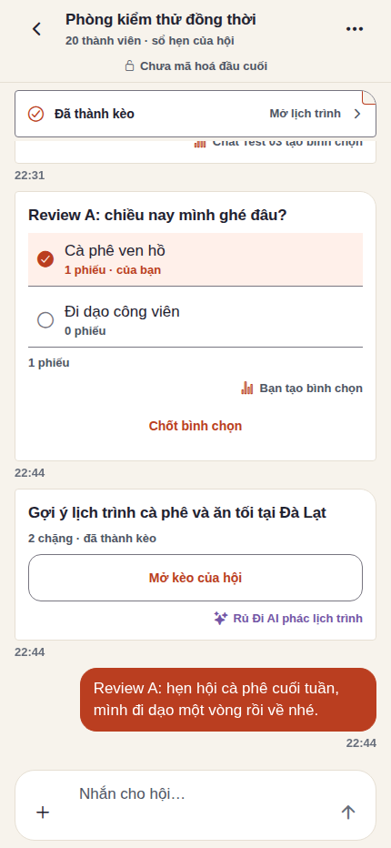
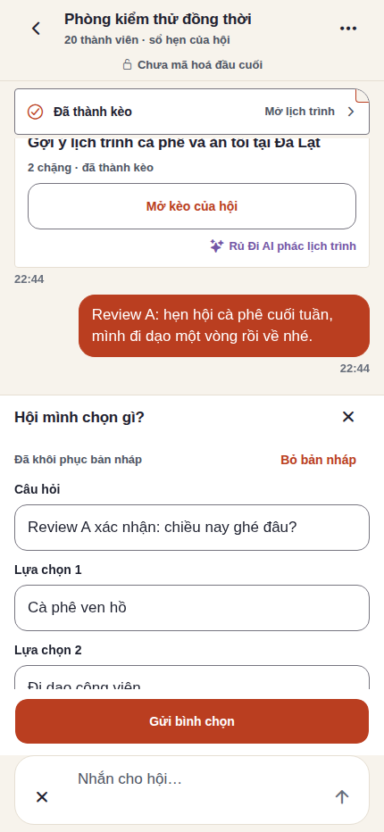
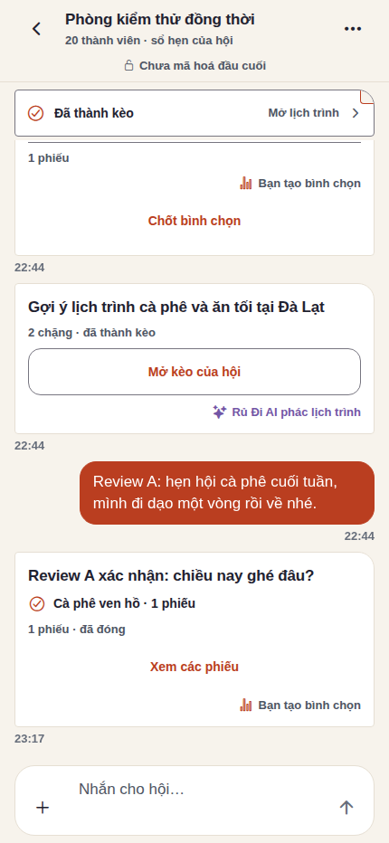
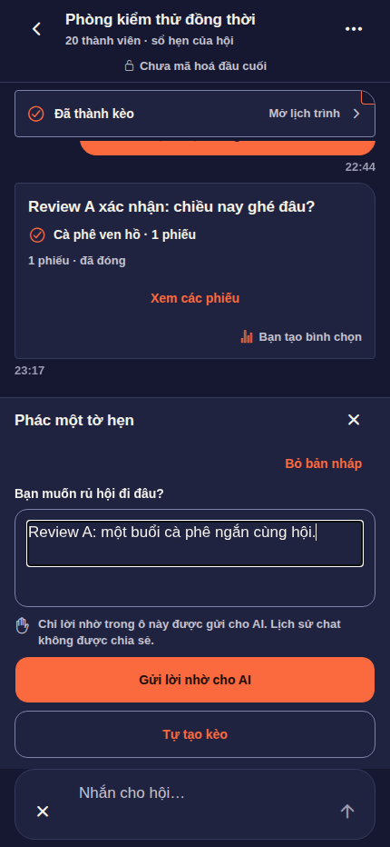
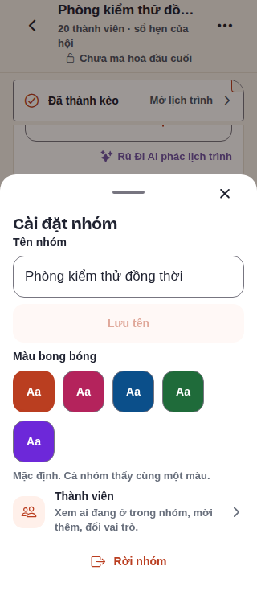

# Checkpoint frontend “Sổ hẹn của hội”

Checkpoint này gom bản frontend hiện hành, gồm cả sửa cursor nhận và giữ bản
nháp trước đó, từ mốc so sánh `534c0fd1`. Cây chuẩn bị commit xuất phát từ
`origin/main` `63959c1d`; nội dung sản phẩm chép nguyên byte từ bản chạy đã
được hai reviewer độc lập kiểm. Đây là phần UI phụ thuộc các PR Go change feed,
AI invocation và promotion; không được phát hành độc lập với hợp đồng backend.

## Hành vi thay đổi

- Peer nhận reaction, xoá tin và số phiếu qua change feed; hydrate trước ACK,
  áp revision tăng, giữ riêng cursor nhận và lịch sử. Tin đã xoá không hồi sinh
  khi response cũ đến; reaction trên tin chưa tải không bỏ qua trang lịch sử.
- Khay có form poll và lời nhờ AI. Nháp form giữ trong RAM theo account/phòng,
  chỉ xoá khi gửi thành công, chủ động bỏ hoặc đổi/thoát account; không phục
  hồi plaintext từ đĩa sau reload. Hết phiên ở route chat thật về đăng nhập.
- Lời nhờ có xác nhận phạm vi chia sẻ; danh sách job/lỗi/retry từ server.
  Thẻ AI đi qua form người dùng xem lại rồi atomic promotion; cùng source
  chỉ có một outing. Nhánh thủ công ghi đúng “Tự tạo kèo”.
- Tờ ghim nêu trạng thái và hành động. Poll đã đóng/thẻ đã tạo kèo thu gọn;
  palette chuyển sáng/tối đồng bộ, sheet giữ focus và đóng bằng Escape,
  năm màu xuống hàng trong chiều rộng320px.

## Bằng chứng và giới hạn

- Fresh worktree: TypeScript đạt; **66/66** chat tests đạt với Node22.
  Dependencies dùng symlink tạm, không đưa vào commit.
- Bản export được kiểm: `entry-5c477e5372d98f5ce4adba7628905d24.js`.
  [Manifest](manifest.json) pin hash source và năm ảnh gốc đã nhìn trực tiếp;
  PNG không chứa metadata. Chỉ tài khoản/nội dung tổng hợp, không chứa token.
- Recovery browser thật: **10/10**, không page error. Gồm giữ đủ nháp poll/AI
  sau rời phòng, validation/footer, route signed-out/reload, hai chiều palette,
  focus/AX và năm màu320px. Script: `apps/mobile/tools/chat-live-recovery.mjs`.
- [A ban đầu](../chat-design-implementation-a.md):28/40.
  [A xác nhận](../chat-design-implementation-a-confirm.md):**32/40**;
  đóng lỗi cũ đã tái hiện nhưng **chưa duyệt tuyên bố hoàn tất40/40**.
- [B ban đầu](../chat-design-implementation-b.md) và
  [B xác nhận](../chat-design-implementation-b-confirm.md): **APPROVE giới hạn
  B1–B3 trên web**;12assertion, focus14/14Tab và3/3Shift+Tab trong dialog,
  mẫu tương phản13,56–15,79:1, đúng palette sau đổi scheme.
- Harness mới `chat-live-plan.mjs` được đưa vào để chạy lại real-provider,
  ba người và hai confirmation cùng source. **Bản harness mới chưa chạy**;
  không dùng việc có script làm bằng chứng. Bằng chứng AI trước đó là lượt
  riêng của root, không thay thế tái chạy harness này.
- Những lượt lỗi harness/OTP429 được giữ ngoài repo; không tính vào pass.
  Screenshot chỉ chứng minh trạng thái đã chụp, không chứng minh FPS.

Còn mở: poll chưa nối với một tờ nháp chung được cả hội sửa trước khi chốt;
“Bỏ bản nháp” chưa có hoàn tác; vùng form còn cần cuộn. Native iOS/Android,
bàn phím thật, TalkBack/VoiceOver, MLS/E2EE, voice và production load là
các cổng riêng còn mở. UI candidate hiện rõ “Chưa mã hoá đầu cuối”; không
được dùng checkpoint này để bật Chat v2 plaintext hoặc tự nhận production-ready.

## Ảnh được chọn

