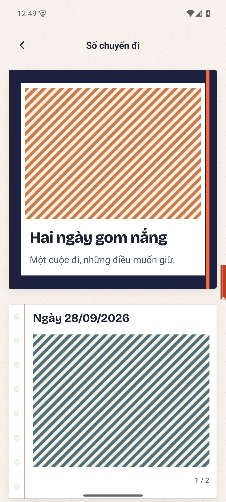
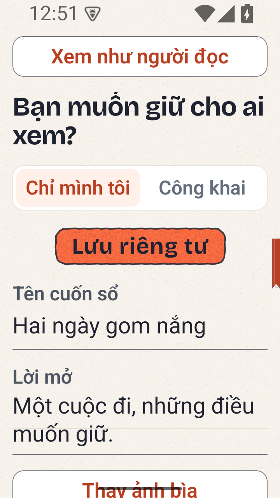
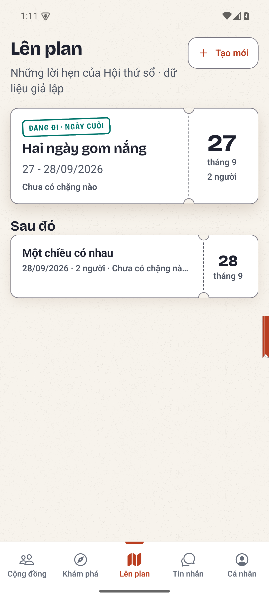
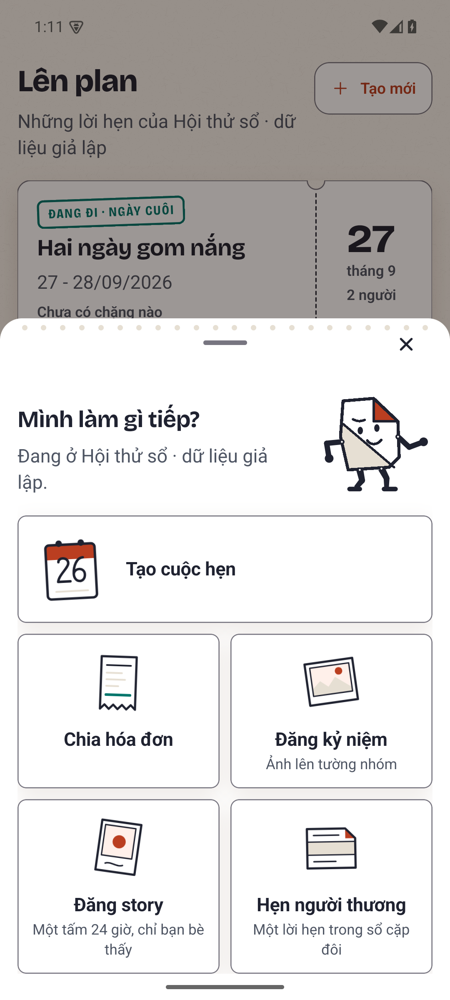

# Bàn giao sổ kỷ niệm — 28/09/2026

**PR nháp, chưa đủ điều kiện merge main.** Người dùng yêu cầu dừng để bàn giao vì quota; không tuyên bố toàn bộ feature đã finished. Máy thật được người dùng hoãn đến đợt kiểm cuối sản phẩm; Android emulator vẫn là cổng bắt buộc hiện tại.

## Phạm vi và nền tích hợp

Nền main: `33d29fe546096c5694265bbb6bed3dc8b788ba77`. Đã tích hợp UI cộng đồng mới và giữ nút gửi sổ lên cộng đồng để duyệt. Backend sổ Go/SQL, AI Python và một phần frontend của công việc trước **đã nằm trên main**; diff PR này chủ yếu hoàn thiện UI/câu chữ, thích nghi điều hướng, hồi quy native và tài liệu. Không thêm backend nghiệp vụ Python.

Sản phẩm hiện có ending chuyến đi, sổ cá nhân trên tường, riêng tư mặc định, công khai/thu hồi/xóa; gợi ý sổ cho chuyến dài ngày và khoảnh khắc cho buổi hẹn, cho phép chọn lại. Hội bạn nhận từ hai người; cặp đôi vẫn cần đồng thuận, dữ liệu mode cũ được đọc tương thích. Ending không thay trạng thái quyết toán tiền.

UI dùng bìa giấy, trang sổ, khung ảnh, washi, dấu đóng và chuyển động theo hệ Nếp. Đã sửa thứ tự điều khiển editor, chiều rộng tablet, trạng thái chọn bìa và phục hồi ảnh đã nhập khi mở lại bản lưu. AI chỉ nhận nội dung người dùng chủ động chia sẻ; không tự đọc chat/gu/lịch sử. Lỗi AI giữ bản trước để tiếp tục viết tay.

Sửa cuối: main thêm tab Cộng đồng khiến thanh năm tab mất lối vào `/create`. Đã bổ sung **Tạo mới** ở đầu Plan (có/chưa nhóm), và dấu cộng ở timeline fixture. Android đã đi được Plan → Tạo mới → Chia hóa đơn → Nhập tay. Chưa chạy hết luồng bill sau sửa này.

## Bằng chứng và giới hạn SHA

Candidate `049601d767852c428c752569289f182070f69d6b` dùng để kiểm clean tree; **đã bị thay thế** bởi sửa Tạo mới và cập nhật các flow 10/26/28/32/40/_30. Không gán kết quả candidate cho HEAD cuối PR.

| Kiểm tra | Kết quả thực tế | Giới hạn |
|---|---|---|
| Gate clean candidate 049601d7 | Qua 17 stage đến Docker; API 3799 pass, 804 skip; mobile 1240 pass, 0 fail/skip, typecheck và export/a11y | Chủ động dừng ở parity khi phát hiện lỗi Tạo mới. Không có verdict parity cuối; các stage PostgreSQL, Go PostgreSQL, e2e, chat-e2e, crypto của lần này chưa chạy |
| Go diary trên nền main mới | 12 PostgreSQL thật + 2 domain pass | Phạm vi diary, không thay full gate |
| AI diary | 18 pass | Không chứng minh mọi phản hồi Gemini luôn thành công |
| Mutant ACL và validation | 2 mutant không tương đương đều đỏ đúng test; identity xanh | Backend candidate; chưa có toàn bộ bộ gate ở HEAD PR |
| Sửa Tạo mới cuối | Typecheck pass; Android debug/release build pass; 5 flow contract pass | Full mobile suite và full gate chưa chạy lại sau sửa cuối |
| Impeccable diary | Mở xem 20/20 ảnh, chấp nhận trong phạm vi diary | Không đại diện toàn app, iOS, TalkBack hay FPS |

Log ở máy hiện tại, không đưa log thô chứa fixture vào Git:

- `/tmp/rudi-v3-community-clean-gate.log`
- `/tmp/rudi-v3-community-diary-pg.log`
- `/tmp/rudi-v3-community-ai-tests.log`
- `/tmp/rudi-v3-community-mutants-verified.log`
- `/tmp/rudi-v3-create-door-typecheck2.log`
- `/tmp/rudi-v3-build-create-door.log`
- `/tmp/rudi-v3-create-flows-contract.log`

Hai mutant: mở ACL document cho người ngoài bị `TestPostgresDiaryPrivacyIncludesImageBytes` bắt; bỏ `book.Validate` bị `TestPostgresExplicitBundleAndModelSourceValidation` bắt. Harness SHA-256: `0fedf083fa63d58c9b6d9b9dd804d40fa7f52113ee78c6fcd933433d01b384f6`.

## Android diary đã chạy thật

Release Android emulator, API Go và PostgreSQL thật, fixture tổng hợp:

- OTP → ending chuyến đi → chọn ba ảnh → dựng tay → lưu riêng tư → tường → công khai: pass.
- Khoảnh khắc → thêm trang → lưu; sửa bìa/thứ tự trang, revision tăng: pass.
- Người đọc khác: document và byte ảnh công khai trả 200, thu riêng tư trả 404: pass.
- Gemini trên runtime riêng: một lần bị bộ kiểm grounding từ chối (422), bản trước còn nguyên; trở về bản đang sửa pass; thử lại dựng AI thành công, revision 5, riêng tư. Đây là lỗi có phục hồi, không phải mọi lần gọi AI đều xanh.
- Identity riêng tư xanh, canary cố tình đòi công khai đỏ đúng bước; cold start release không Metro pass. Harness `_diary-privacy.yaml` SHA-256 `58518ec8590b9f0eb3b3c245f3ac43323ac6fe0918d0a1f3ee87d848dcea16c9`.
- Android Photo Picker → nhập ảnh tổng hợp thứ tư → lưu → mở lại → chọn ảnh đã nhập làm bìa → lưu: pass, API xác nhận ảnh ngoài nguồn nhóm vẫn được giữ.
- Xóa: hủy xác nhận giữ sổ; xác nhận xóa làm reader biến mất và owner GET 404: pass.

Log: `/tmp/rudi-v3-release-community3.log`, `/tmp/rudi-v3-final-edit.log`, `/tmp/rudi-v3-final-ai-isolated.log`, `/tmp/rudi-v3-ai-recover.log`, `/tmp/rudi-v3-final-ai-isolated2.log`, `/tmp/rudi-v3-isolated-{identity,canary,cold,gallery}.log`, `/tmp/rudi-v3-delete-moment2.log`.

Ma trận diary đã xem: phone light 1080×2400; dark/font 1.3/reduced motion; phone 720×1280/font 2; tablet 1600×2560. Ảnh gốc ở `.impeccable/review/diary-v3-final/` trong worktree tích hợp (ignored). Ảnh chọn lọc tổng hợp đính kèm bên dưới. Ba ảnh sửa Tạo mới được mở xem riêng: phone-light có nhóm đạt; chưa kiểm nhánh chưa nhóm, fixture, font 2 và dark sau sửa nút.

Đo motion cũ trước merge cộng đồng: 614 frame, 30 janky (4,89%), p50 25 ms/p95 36 ms/p99 48 ms; chỉ emulator SwiftShader. Không phải chứng nhận 60 FPS, không phải bằng chứng trên APK cuối. Video/log: `/tmp/rudi-v3-evidence/motion.mp4`, `/tmp/rudi-v3-gfxinfo.txt`.

## Hồi quy toàn app chưa xong

<!-- repo-guard: allow=long-number reason=synthetic-native-run-timestamp -->
Lần broad native dùng candidate 049601d7, dừng khi bàn giao; không có kết luận xanh toàn harness. Log `/tmp/rudi-v3-otp-community.log`; evidence ở worktree `gate-v3/.impeccable/review/native/20260928-005241-049601d7/`.

| Flow | Tình trạng / việc tiếp theo |
|---|---|
| 22, 24, 25, 27, 31 | Đã pass. Flow 31 đo keyboard: imeTop 1517, composerBottom 1483, gap 34; không suy diễn last bubble vì giá trị đo là None |
| 23 | Lần broad lỗi trong lúc restart runtime. Replay mới pass, `/tmp/rudi-v3-replay-23-phien-song-qua-lan-tat.log` |
| 26 | Lần đầu chưa cuộn đến activity; đã sửa scroll. Replay dừng ở OTP trước khi đến activity, chưa xác minh sửa; cần xem artifact và tránh dùng trùng tài khoản song song |
| 28 | Phát hiện thiếu lối Tạo mới; đã sửa code và kiểm lối vào native. Toàn luồng bill chưa replay thành công |
| 29 | Lỗi dây chuyền vì 28 không tạo bill; phải chạy sau 28 với fixture đúng |
| 30 | Script cũ bỏ qua consent AI; đã thêm chọn chỉ gửi lời nhờ và xác nhận, chưa native replay. Không đính kèm tin thì AI phải báo chưa thấy khoản chi, không ghi ledger |
| 32 | Đã đến album/comment, vướng Thành tích bị đẩy dưới nếp gấp; sửa scroll chưa replay |
| 33–35 | Broad đã tiến tới cuối bước đổi điểm đến của 35; chưa đối soát đầy đủ artifact/verdict từng flow nên chưa ký pass |
| 36–48, 40 | Chưa hoàn tất lượt cuối. 40 đã thêm consent AI, chưa chạy lại; nhánh `_30-ai-khong-khoa` còn cần rà |

Không chạy broad và replay cùng tài khoản đồng thời: OTP/cooldown và trạng thái nhóm có thể làm nhiễu kết quả. Lần replay 23→26→28→29 dừng ở 26; 28/29 chưa chạy trong chuỗi này. Flow 10 fixture cũng cần chạy lại sau thay lối Tạo mới.

## Cách tiếp tục trên máy này

Worktree code: `/home/lakiet/.local/share/rudi-native/integration/diary-v3` (symlink `/tmp/rudi-diary-v3`). Clean candidate cũ: `/home/lakiet/.local/share/rudi-native/integration/gate-v3`. Không sửa root worktree của agent khác. Stash backup `backup: diary truoc community 33d29fe5` còn giữ, không tự pop lại lên code PR.

Runtime riêng đã tách khỏi worker của agent cộng đồng:

- Go API 8209, health 8309; binary `/tmp/rudi-v3-core-community`, log `/tmp/rudi-v3-core-isolated.log`.
- Python AI 8210, log `/tmp/rudi-v3-brain-isolated.log`; Gemini dùng khóa `.env` gốc qua môi trường, không sao chép vào Git/log.
- PostgreSQL container `rudi-diary-postgres`, port 55437, database tổng hợp **mobile_diary_final**. Không dùng lại database `mobile` chung với worker agent khác.
- Không dừng hay sửa runtime agent khác ở 8199/8198. Helper cũ `/tmp/rudi-start-v3-brain.py` còn trỏ DB cũ: phải sửa cấu hình trước khi dùng.
- Emulator 5574 dùng release mới; 5576 chạy broad candidate cũ. Harness broad đã được dừng để bàn giao. Kiểm `adb devices` và process thực tế trước khi chạy tiếp.
- Node 22 ở `/home/lakiet/.nvm/versions/node/v22.23.2/bin`; Go `/tmp/go/bin/go`; Python `/tmp/rudi-python/bin/python`; JDK `/home/lakiet/.local/share/rudi-native/jdk`; SDK `/home/lakiet/Android/Sdk`; Maestro `/home/lakiet/.maestro/bin/maestro`.

Seeder đã commit: `apps/mobile/tools/seed-diary-native.mjs`. Đặt `DIARY_TEST_API=http://127.0.0.1:8209` và `DIARY_TEST_OUTPUT` là đường dẫn **ngoài mọi worktree**, rồi chạy bằng Node 22. Ngày ảnh dùng Asia/Ho_Chi_Minh. Đợi cooldown OTP trước UI login. Fixture cũ `/tmp/rudi-diary-native-community.json` chứa token tổng hợp: không in/commit; khoảnh khắc của fixture này đã bị xóa bởi test, phải seed mới nếu chạy lại toàn luồng.

Runner tạm: `/tmp/rudi-run-v3-diary.py` (DIARY_TEST_FIXTURE, DIARY_TEST_SERIAL, DIARY_EVIDENCE_DIR); login wrapper `/tmp/rudi-v3-diary-login.yaml`; gallery restore `/tmp/rudi-v3-gallery-restore.yaml`. Broad runner có sẵn trong repo: `scripts/mobile_native.sh --serial emulator-5576 --port 8098 --api-port 8209 --otp --ai`. Replay tạm `/tmp/rudi-v3-replay-native.py` đọc fixture args bên ngoài repo; tài liệu này không chứa token/số điện thoại.

## Điều kiện trước khi merge

1. Fetch main, xem diff mới và thích nghi nếu base đã đổi. Giữ route ownership/cộng đồng/crypto của main.
2. Chạy lại 26, 28→29, 30, 32, 40 bằng tài khoản tổng hợp không cạnh tranh; sửa nguyên nhân và xác minh assertion, không hạ test để lấy xanh. Rà nhánh AI thiếu key.
3. Hoàn tất toàn bộ native fixture và OTP harness, postcondition API/DB, canary/identity cùng harness; không dùng web thay thế. Kiểm screenshot mọi màn/layer đã đổi, bổ sung ma trận Tạo mới nêu trên và đo motion APK cuối.
4. Chạy `make gate`/`make gate-merge` phù hợp trên clean tree **đúng SHA cuối**, gồm parity hoàn chỉnh, PostgreSQL thật, Go PostgreSQL, crypto và e2e. Các skip có chủ ý phải ghi lý do; không đổi skip thành pass. Giữ hai mutant và identity ở harness cuối.
5. Ghi số liệu gate vào commit message bàn giao cuối, chạy cả repo guard staged và tree HEAD. Chỉ chuyển draft sang ready/merge khi các cổng thực sự đạt. Máy thật hoãn theo người dùng; iOS chưa kiểm, không tuyên bố đã kiểm.

## Ảnh Android tổng hợp đã mở xem

