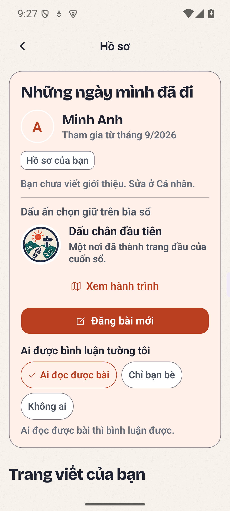
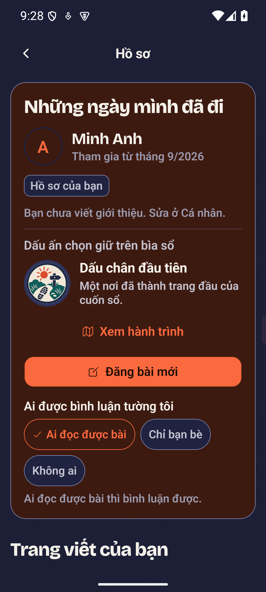
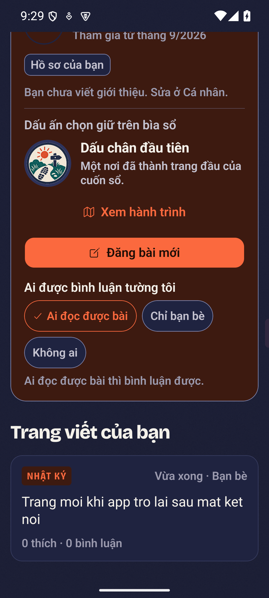

# Hồ sơ và hành trình: bản bàn giao PR ngày 2026-09-28

Nhánh `feat/profile-story-routes` được tạo từ `main`. Đây là bản review phần đã
triển khai; chưa phải xác nhận đủ điều kiện phát hành hoặc merge với `main`
ngày 2026-09-28. Sau khi cập nhật remote, `main` có thêm 128 commit so với điểm
tách nhánh. Bản thử gộp có xung đột ở hồ sơ, story, Nếp, contract và ownership;
đặc biệt phải đối chiếu writer và ACL với Cộng đồng mới trước khi gộp. Không
ghi đè các thay đổi đó để mở PR.

## Phần được bàn giao

- 13 huy hiệu được thiết kế bằng trình sinh ảnh, có tài liệu nguồn và prompt.
  Huy hiệu người dùng chọn được đặt trên bìa hồ sơ cùng lời kể riêng của dấu mốc.
- Ba hướng Dấu chân, Kỷ niệm, Đồng hành; thứ tự đổi hướng mở những kết giao nhau
  khác nhau. Go tính thành tích từ check-in, `destination_id`, ảnh và chuyến đi
  chung; AI chỉ gợi ý sau khi người dùng đồng ý cho lần gọi đó.
- Sổ cấp lượt dựng MP4, đặt chỗ nguyên tử, hoàn lượt khi hỏng, thư viện chỉ chủ
  sở hữu đọc được. Các mẫu sáng tạo chưa có worker vẫn ghi là sắp dùng được.
- Tường phân trang, like bài và bình luận, bình luận cha/con, đăng lại, ảnh toàn
  màn hình với khay bình luận; ACL bài gốc được kiểm lại khi chia sẻ.
- Long poll có sự kiện bền vững trong PostgreSQL, `LISTEN` đánh thức người xem;
  hồ sơ và bài chi tiết đọc lại ngay khi app trở về foreground. Các phản hồi
  phân trang cũ bị bỏ qua khi có lượt refresh mới; lỗi tải thêm giữ các bài đã có.

Quy tắc và ranh giới chi tiết ở
[kiến trúc hồ sơ](../architecture/03-profile-story-social.md).

## Kiểm chứng bổ sung

| Tình huống | Bằng chứng và giới hạn |
| --- | --- |
| Stack tổng hợp mới thiếu schema của hồ sơ | Trước sửa, màn hành trình lỗi và HTTP trả 500. Sau khi thêm `core migrate-profile` vào script dựng stack, dựng một stack mới từ đầu: bốn route hành trình, huy hiệu hiển thị, sự kiện tường và thư viện video đều trả 200. |
| Tám tài khoản bạn bè cùng chờ một bài mới | Ca Go trên PostgreSQL thật nhận đúng một sự kiện cho mỗi người, dưới ba giây; người ngoài không nhận hoạt động riêng; dùng cursor đã đọc không phát lại và vẫn nhận bình luận kế tiếp. Đây là kiểm tra đồng thời nhỏ, chưa phải test tải production. |
| App Android trở lại sau mất đường kết nối | Đưa app về nền, tháo cổng API, thêm bài tổng hợp vào PostgreSQL, khôi phục cổng rồi mở app. Tường đã mở hiện bài mới sau khi trở lại. Bài được đưa vào bằng SQL để kiểm soát tình huống; không mô tả đây là bài đăng từ native. |
| File video giả chỉ có `ftyp` | Test hồi quy đỏ với validator cũ. Validator mới kiểm tra các box hoàn chỉnh, video track H.264/H.265, bảng sample và `mdat` không rỗng; từ chối header đơn lẻ, MIME sai và file bị cắt. |
| MP4 có dữ liệu thật | Fixture là một frame màu tổng hợp 64 × 64, H.264, được dựng và giải mã lại bằng ffmpeg. Ca PostgreSQL dùng file này để kiểm chứng thư viện riêng, range request, idempotency và tiêu một lượt. Validator chỉ kiểm cấu trúc container MP4 không phân mảnh, không thay bộ giải mã codec. |

Các lượt native hai người, ảnh, trả lời, like, đăng lại và story trước đó được
ghi ở [nhật ký Android](profile-native-qa-2026-09-24.md). Không suy rộng các lượt
đã thao tác thành việc đã kiểm thử mọi ngách của ứng dụng.

## Ảnh đã mở và xem trực tiếp

Các ảnh dưới đây chụp trên Android với tài khoản và nội dung tổng hợp. Tên
Minh Anh thuộc roster seed của repo; không có dữ liệu người tham gia thật.

| Hồ sơ sáng | Hồ sơ tối | Tường sau khi app trở lại |
| --- | --- | --- |
|  |  |  |

Quan sát: hình huy hiệu tải được, lời kể xuống dòng trong khung, nút hành trình
và đăng bài không chồng nhau, các trạng thái quyền bình luận đọc được ở hai
theme. Phiên này không xác nhận lại mức phóng chữ sau khi đổi cài đặt hệ thống;
lượt kiểm chứng chữ 130% trước đó nằm trong nhật ký Android.

## Các cổng còn mở

- Tích hợp với `main` mới, nhất là ACL kiểm duyệt và quyền ghi của Cộng đồng;
  cần giải xung đột và chạy gate trên kết quả gộp trước khi merge.
- iOS native, kiểm chứng crypto độc lập, tải production và Maestro.
- Chất lượng gợi ý từ dịch vụ inference thật và video do renderer thật sinh;
  stack QA hiện chỉ có đường fallback và proxy tổng hợp.
- Lượt đăng story đầu sau khi khôi phục stack trước đây chỉ ghi ảnh, chưa ghi
  story; lượt lặp lại thành công. Chưa tái hiện được để kết luận nguyên nhân.
- Chia sẻ vào chat chỉ nối khi dùng chat v2 E2EE. Hiện có đăng lại lên tường.
- Toàn bộ `make gate` strict chưa được xác nhận xanh. Kết quả gate chạy ở SHA
  cụ thể được ghi trong PR; các lượt bị skip không được coi là đạt.

Backend nghiệp vụ mới của nhánh là Go/SQL. Python bổ sung adapter inference
cho Nếp từ số đếm và danh sách hướng Go đã cho phép; không đọc database,
không trao huy hiệu hay ghi sổ lượt. Test legacy và oracle parity được giữ
làm đối chiếu.
